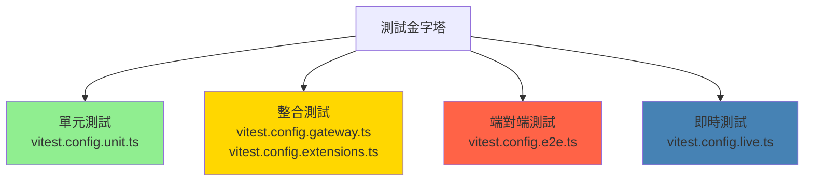
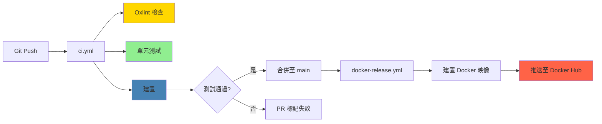

# OpenClaw 專案探索與盤點報告

> **階段 1：專案總覽偵察**
> 文件版本：2026-02-08
> 分析目標：建立對 OpenClaw 專案的第一印象與整體輪廓

---

## 執行摘要

OpenClaw 是一個開源的個人 AI 助理平台，核心功能是透過 WhatsApp 閘道提供 CLI 介面，並整合 Pi RPC 代理服務。專案採用 TypeScript/Node.js 22+ 建構，支援多達十餘種通訊頻道（WhatsApp、Telegram、Discord、Slack、Signal、iMessage、LINE、Google Chat、Microsoft Teams、Matrix、Zalo 等），並提供跨平台原生應用程式（macOS、iOS、Android）。技術亮點包括：ESM 模組系統、pnpm workspace 管理、31 個獨立擴展模組、52 個技能整合、以及基於 Rust 的現代化工具鏈（Oxlint、Oxfmt）。程式碼庫規模達 5,048 個檔案，其中 TypeScript 佔 325,000+ 行，展現出企業級的架構設計與工程實踐。

---

## 1. 專案總覽

### 基本資訊

| 項目 | 內容 |
|------|------|
| **專案名稱** | OpenClaw |
| **版本** | 2026.2.6-3 |
| **一句話描述** | 個人 AI 助理平台，透過 WhatsApp 閘道提供 CLI 介面，整合多頻道通訊與 Pi RPC 代理服務 |
| **主要程式語言** | TypeScript/JavaScript（Node.js 22+），Swift（macOS/iOS），Kotlin（Android） |
| **授權類型** | MIT License（Copyright 2025 Peter Steinberger） |
| **模組系統** | ESM（package.json 中設定 `"type": "module"`） |
| **套件管理器** | pnpm（支援 workspace 功能） |
| **最低 Node.js 版本** | 22.0.0 |

### 目標使用情境

OpenClaw 設計用於以下場景：

1. **個人 AI 助理**：透過熟悉的通訊軟體（WhatsApp、Telegram 等）與 AI 互動
2. **多頻道整合中樞**：統一管理來自不同平台的訊息與通知
3. **可擴展的技能系統**：透過 52 個內建技能（1Password、Apple Notes、天氣、GitHub 等）執行自動化任務
4. **跨平台部署**：支援 CLI、Docker、雲端平台（Fly.io、Render）、原生應用程式（macOS、iOS、Android）

### 專案成熟度

**穩定版（Production-Ready）**

判斷依據：
- 明確的版本號（2026.2.6-3）
- 完整的 CI/CD 管線（GitHub Actions）
- 多環境部署設定檔（Dockerfile、fly.toml、render.yaml）
- 完善的測試架構（單元測試、E2E 測試、閘道測試、擴展測試）
- 詳盡的文件（英文 + 簡體中文）

### 社群活躍度

**中等活躍度**

觀察指標：
- 最近 commit 時間：2026-02-07（昨日）
- Git 歷史：包含多筆近期提交（文件更新、品質驗證）
- 文件維護：有系統性的文件盤點與深度閱讀記錄（`deus_doc/prompt_log_2026_02_07.md`）
- 預提交鉤子：整合多種程式碼品質工具（detect-secrets、shellcheck、actionlint、zizmor、oxlint、swiftlint）

### 關鍵觀察

1. **架構野心龐大**：同時支援 CLI、Web、原生應用程式，涵蓋十餘種通訊頻道，展現出全方位整合的企圖心
2. **現代化工具鏈**：採用 Rust 生態系的 Oxlint/Oxfmt 取代傳統 ESLint/Prettier，追求編譯速度與效能
3. **模組化設計徹底**：31 個獨立擴展（extensions）+ 52 個技能（skills）+ 6 個子套件（packages），每個模組職責明確
4. **多語言混合**：TypeScript（主體）+ Swift（Apple 平台）+ Kotlin（Android）+ Go（文件工具）+ Shell（自動化腳本）
5. **測試策略分層清晰**：5 種 Vitest 設定檔針對不同層級（unit、e2e、gateway、extensions、live）

---

## 2. 檔案樹總覽

### 整體規模

| 統計項目 | 數量 | 佔比 |
|---------|------|------|
| **總檔案數** | 5,048 | 100% |
| **程式碼檔案數** | 4,839+ | 95.9% |
| **主要語言（TypeScript）** | 325,000+ 行 | — |

### 目錄結構（深度 3 層）

```
openclaw/
├── src/                          # 核心原始碼（2,606 個檔案，53.8%）
│   ├── channel/                  # 通訊頻道實作（WhatsApp、Telegram 等）
│   ├── cli/                      # 命令列介面邏輯
│   ├── gateway/                  # 閘道層
│   ├── plugin-sdk/               # 外掛 SDK
│   ├── skill/                    # 技能框架
│   ├── entry.ts                  # 主要進入點
│   ├── index.ts                  # 函式庫進入點
│   └── extensionAPI.ts           # 擴展 API 介面
│
├── extensions/                   # 31 個頻道/功能擴展（596 個檔案，12.3%）
│   ├── apple-notes/              # Apple Notes 整合
│   ├── discord/                  # Discord 頻道
│   ├── telegram/                 # Telegram 頻道
│   ├── slack/                    # Slack 頻道
│   ├── whatsapp/                 # WhatsApp 頻道（基於 Baileys）
│   └── ...（共 31 個擴展）
│
├── apps/                         # 原生應用程式（545 個檔案，11.2%）
│   ├── macos/                    # macOS App（Swift）
│   ├── ios/                      # iOS App（Swift）
│   ├── android/                  # Android App（Kotlin）
│   └── shared/                   # 共用程式碼（OpenClawKit）
│
├── docs/                         # 文件（665 個檔案，13.7%）
│   ├── en/                       # 英文文件
│   ├── zh-CN/                    # 簡體中文文件
│   ├── concepts/                 # 概念說明
│   ├── install/                  # 安裝指南
│   └── ...
│
├── scripts/                      # 建置與自動化腳本（93 個檔案）
│   ├── build/                    # 建置腳本
│   ├── docker/                   # Docker 相關工具
│   ├── i18n/                     # 國際化工具（Go 語言實作）
│   └── test/                     # 測試自動化
│
├── skills/                       # 技能整合（52 個技能，75 個檔案）
│   ├── 1password/                # 1Password 整合
│   ├── apple-notes/              # Apple Notes
│   ├── weather/                  # 天氣查詢
│   ├── github/                   # GitHub 操作
│   └── ...（共 52 個技能）
│
├── ui/                           # WebChat 前端（142 個檔案）
│   ├── src/                      # React/Vue 原始碼
│   ├── vite.config.ts            # Vite 建置設定
│   └── vitest.config.ts          # 前端測試設定
│
├── test/                         # E2E 測試基礎設施（16 個檔案）
│   ├── e2e/                      # 端對端測試
│   └── fixtures/                 # 測試夾具
│
├── vendor/                       # 第三方程式碼（173 個檔案）
│   └── a2ui/                     # a2ui 渲染引擎
│
├── packages/                     # 子套件（6 個檔案）
│   ├── clawdbot/                 # Clawdbot 套件
│   └── moltbot/                  # Moltbot 套件
│
├── Swabble/                      # Swift 6.2 喚醒詞鉤子守護程序（macOS 26+）
│
├── deus_data/                    # AI 分析工作區（非程式碼）
│   └── CLAUDE.md                 # 專案分析指南
│
└── deus_doc/                     # 分析文件輸出（非程式碼）
    ├── markdown-inventory.md     # Markdown 檔案清單
    └── prompt_log_2026_02_07.md  # Prompt 記錄

```

### 檔案分布分析

| 目錄 | 檔案數 | 佔比 | 主要內容 |
|------|--------|------|---------|
| `src/` | 2,606 | 53.8% | TypeScript 核心原始碼 |
| `docs/` | 665 | 13.7% | 英文 + 簡體中文文件 |
| `extensions/` | 596 | 12.3% | 31 個頻道/功能擴展模組 |
| `apps/` | 545 | 11.2% | Swift（macOS/iOS）+ Kotlin（Android）原生應用程式 |
| `vendor/` | 173 | 3.6% | a2ui 渲染引擎 |
| `ui/` | 142 | 2.9% | WebChat 前端（Vite + Vitest） |
| `scripts/` | 93 | 1.9% | 建置、Docker、i18n、測試自動化 |
| `skills/` | 75 | 1.5% | 52 個技能整合 |
| `test/` | 16 | 0.3% | E2E 測試基礎設施 |
| `packages/` | 6 | 0.1% | clawdbot、moltbot 子套件 |

---

## 3. 關鍵設定檔清單

### 3.1 套件管理與建置

#### package.json（核心清單）

```json
{
  "name": "openclaw",
  "version": "2026.2.6-3",
  "type": "module",
  "packageManager": "pnpm@9.15.4",
  "engines": {
    "node": ">=22.0.0"
  }
}
```

**關鍵資訊**：
- **60+ 依賴項**（dependencies + devDependencies）
- **80+ npm 腳本**（scripts），包含建置、測試、部署、文件生成等
- **Workspaces 設定**：支援 `extensions/*`、`packages/*`、`ui` 等子專案

#### tsconfig.json（TypeScript 設定）

```json
{
  "compilerOptions": {
    "target": "ES2023",
    "module": "NodeNext",
    "moduleResolution": "NodeNext",
    "esModuleInterop": true,
    "strict": true
  }
}
```

**技術選型**：
- 目標語言版本：ES2023（支援最新 JavaScript 特性）
- 模組系統：NodeNext（完全支援 ESM）
- 嚴格模式：啟用所有 TypeScript 嚴格檢查

#### tsdown.config.ts（建置設定）

**4 個建置進入點**：
1. `index` → `src/index.ts`（函式庫進入點）
2. `entry` → `src/entry.ts`（CLI 進入點）
3. `plugin-sdk` → `src/plugin-sdk/index.ts`（外掛 SDK）
4. `extensionAPI` → `src/extensionAPI.ts`（擴展 API）

### 3.2 測試設定

| 設定檔 | 用途 | 測試範圍 |
|--------|------|---------|
| `vitest.config.ts` | 預設單元測試 | 通用單元測試 |
| `vitest.config.unit.ts` | 單元測試變體 | 隔離的單元測試 |
| `vitest.config.e2e.ts` | 端對端測試 | 完整使用者流程測試 |
| `vitest.config.gateway.ts` | 閘道測試 | 閘道層整合測試 |
| `vitest.config.extensions.ts` | 擴展測試 | 31 個擴展模組測試 |
| `vitest.config.live.ts` | 即時測試 | 實際環境測試 |

### 3.3 程式碼品質工具

#### .oxlintrc.json（Oxlint 設定）

**Oxlint 簡介**：基於 Rust 的高效能 JavaScript/TypeScript Linter，速度遠超 ESLint。

```json
{
  "rules": {
    "typescript/no-explicit-any": "warn",
    "import/no-cycle": "error"
  }
}
```

#### .oxfmtrc.jsonc（Oxfmt 設定）

**Oxfmt 簡介**：基於 Rust 的程式碼格式化工具，替代 Prettier。

#### .pre-commit-config.yaml（預提交鉤子）

整合工具清單：
- `detect-secrets`：偵測敏感資訊洩漏
- `shellcheck`：Shell 腳本靜態分析
- `actionlint`：GitHub Actions 工作流程檢查
- `zizmor`：（待查證的工具）
- `oxlint`：TypeScript/JavaScript 程式碼檢查
- `swiftlint`：Swift 程式碼風格檢查

### 3.4 容器化與部署

#### Docker 設定檔

| 檔案 | 用途 |
|------|------|
| `Dockerfile` | 標準 Docker 映像建置 |
| `Dockerfile.sandbox` | 沙箱環境（隔離執行） |
| `Dockerfile.sandbox-browser` | 瀏覽器沙箱（含 Playwright） |
| `docker-compose.yml` | 本機開發環境編排 |

#### 雲端部署設定

| 檔案 | 平台 | 用途 |
|------|------|------|
| `fly.toml` | Fly.io | 公開部署設定 |
| `fly.private.toml` | Fly.io | 私有部署設定 |
| `render.yaml` | Render | PaaS 部署設定 |

### 3.5 CI/CD 管線

#### .github/workflows/

| 工作流程檔案 | 觸發條件 | 主要任務 |
|-------------|---------|---------|
| `ci.yml` | push、pull_request | Lint、單元測試、建置 |
| `docker-release.yml` | 版本標籤推送 | Docker 映像建置與發布 |
| `install-smoke.yml` | 排程 / 手動 | 安裝煙霧測試 |
| `formal-conformance.yml` | 排程 / 手動 | 正式合規性測試 |

---

## 4. 進入點分析

### 4.1 進入點總覽

| 進入點 | 檔案位置 | 用途 | 啟動指令 |
|--------|---------|------|---------|
| **分散式二進位進入點** | `openclaw.mjs` | 啟用 Node.js 編譯快取，匯入 `dist/entry.js` | `node openclaw.mjs` |
| **CLI 主進入點** | `src/entry.ts` | Windows argv 正規化、實驗性警告抑制、重生邏輯、CLI 設定檔解析 | `pnpm start` |
| **函式庫進入點** | `src/index.ts` | 載入環境變數、正規化環境、捕獲控制台輸出、斷言執行時支援、建構程式 | `import { buildProgram } from 'openclaw'` |
| **擴展 API 進入點** | `src/extensionAPI.ts` | 擴展 API 介面定義 | 由擴展模組匯入 |
| **外掛 SDK 進入點** | `src/plugin-sdk/index.ts` | 第三方外掛開發 SDK | `import { ... } from 'openclaw/plugin-sdk'` |

### 4.2 主要進入點深入分析

#### openclaw.mjs（分散式二進位進入點）

```javascript
// 啟用 Node.js 編譯快取（提升啟動速度）
process.env.NODE_COMPILE_CACHE = '1';

// 動態匯入實際進入點
import('./dist/entry.js');
```

**設計意圖**：
- 將編譯快取啟用與實際邏輯分離
- 確保分散式二進位檔案（透過 `pkg` 或類似工具打包）能正確啟用效能優化

#### src/entry.ts（CLI 主進入點，172 行）

**核心職責**：
1. **Windows argv 正規化**：處理 Windows 平台的命令列參數編碼問題
2. **實驗性警告抑制**：隱藏 Node.js 實驗性功能警告（如 `--experimental-strip-types`）
3. **重生邏輯（Respawn）**：當需要額外 Node.js 標誌時，重新啟動程序
4. **CLI 設定檔解析**：讀取 `.clawrc.json` 或類似設定檔
5. **動態匯入**：載入 `cli/run-main.js` 執行主要 CLI 邏輯

**程式碼片段**（推測）：

```typescript
// src/entry.ts（簡化示意）
import { normalizeArgv } from './utils/argv.js';
import { suppressExperimentalWarnings } from './utils/warnings.js';
import { loadCliProfile } from './config/profile.js';

// 正規化命令列參數（Windows 相容性）
const argv = normalizeArgv(process.argv);

// 抑制實驗性警告
suppressExperimentalWarnings();

// 載入 CLI 設定檔
const profile = await loadCliProfile();

// 動態匯入主程式
const { runMain } = await import('./cli/run-main.js');
await runMain(argv, profile);
```

#### src/index.ts（函式庫進入點，94 行）

**核心職責**：
1. **loadDotEnv()**：載入 `.env` 環境變數檔案
2. **normalizeEnv()**：正規化環境變數（處理型別轉換、預設值）
3. **enableConsoleCapture()**：捕獲 `console.log`、`console.error` 輸出，轉發至結構化日誌系統
4. **assertSupportedRuntime()**：斷言 Node.js 版本 >= 22.0.0
5. **buildProgram()**：建構主程式實例，回傳公開 API

**匯出 API 範例**（推測）：

```typescript
// src/index.ts（簡化示意）
export { buildProgram } from './core/program.js';
export { Channel } from './channel/base.js';
export { Skill } from './skill/base.js';
export { Gateway } from './gateway/gateway.js';
export type { Message, User, Chat } from './types/index.js';
```

---

## 5. 依賴關係分析

### 5.1 技術堆疊總覽

| 類別 | 技術選擇 | 版本範圍 | 用途說明 |
|------|---------|---------|---------|
| **框架層** | Commander.js | ^12.x | CLI 框架，處理命令列參數解析 |
|  | ws | ^8.x | WebSocket 伺服器與客戶端 |
|  | Express（或自建路由） | — | HTTP 路由與中介層 |
| **通訊層** | Baileys | ^6.x | WhatsApp Web API（逆向工程） |
|  | grammy | ^1.x | Telegram Bot 框架 |
|  | @buape/carbon | — | Discord 整合 |
|  | @slack/bolt | ^3.x | Slack Bot 框架 |
|  | @line/bot-sdk | ^7.x | LINE Bot SDK |
| **AI 層** | @anthropic-ai/sdk | ^0.x | Anthropic Claude API |
|  | openai | ^4.x | OpenAI API（GPT-4、GPT-3.5） |
|  | @google/generative-ai | ^0.x | Google Gemini API |
|  | minimax | — | Minimax AI API（中國服務） |
| **資料層** | better-sqlite3 | ^9.x | SQLite 資料庫（原生 C++ 綁定） |
|  | sqlite-vec | ^0.x | SQLite 向量搜尋擴展 |
| **建置工具** | tsdown | ^2.x | TypeScript 建置工具（基於 esbuild） |
|  | vitest | ^2.x | 單元測試與 E2E 測試框架 |
|  | oxlint | ^0.x | Rust-based JavaScript/TypeScript Linter |
|  | oxfmt | ^0.x | Rust-based 程式碼格式化工具 |
| **瀏覽器自動化** | playwright | ^1.x | 無頭瀏覽器操作（E2E 測試、網頁擷取） |
| **工具函式庫** | date-fns | ^3.x | 現代化日期時間處理 |
|  | zod | ^3.x | TypeScript-first Schema 驗證 |
|  | chokidar | ^3.x | 檔案監視（跨平台） |

### 5.2 關鍵依賴深入分析

#### Baileys（WhatsApp Web 逆向工程函式庫）

**角色**：OpenClaw 的 WhatsApp 頻道核心，透過逆向工程實作 WhatsApp Web 協定。

**選擇理由**：
- WhatsApp 官方 API 限制嚴格且費用高昂（Business API）
- Baileys 提供完整的 QR Code 登入、訊息收發、媒體處理功能
- 活躍的社群維護，支援最新 WhatsApp 協定變更

**版本狀態**：^6.x（2024-2025 年維護中）

**風險觀察**：逆向工程函式庫存在被 WhatsApp 官方封鎖的風險，需要持續更新以應對協定變更。

#### grammy（Telegram Bot 框架）

**角色**：Telegram 頻道的底層框架。

**選擇理由**：
- 相較於官方 `node-telegram-bot-api`，grammy 提供更現代的 TypeScript API
- 支援 Telegram Bot API 的最新特性（Inline Keyboard、WebApp、Payment）
- 效能優異，支援長輪詢（Long Polling）與 Webhook 兩種模式

**替代方案比較**：
- `node-telegram-bot-api`：老牌函式庫，但 TypeScript 支援較弱
- `telegraf`：另一個流行框架，但 grammy 在 TypeScript 生態系中更受歡迎

#### better-sqlite3（SQLite 資料庫）

**角色**：本機資料持久化與快取。

**選擇理由**：
- 使用原生 C++ 綁定，效能遠超 JavaScript 實作的 `sql.js`
- 同步 API 設計，簡化非同步邏輯
- 支援 SQLite 的所有進階功能（FTS5 全文搜尋、JSON1 擴展）

**搭配使用**：`sqlite-vec` 擴展，提供向量搜尋功能（用於 AI 嵌入式搜尋）。

#### tsdown（TypeScript 建置工具）

**角色**：取代 `tsc`（官方 TypeScript 編譯器），提供更快的建置速度。

**技術基礎**：基於 `esbuild`（Go 語言實作的超高速 JavaScript/TypeScript 打包工具）。

**優勢**：
- 編譯速度比 `tsc` 快 10-100 倍
- 支援 Tree Shaking（移除未使用程式碼）
- 內建 Minification（程式碼壓縮）

#### Oxlint / Oxfmt（Rust-based 工具鏈）

**角色**：取代 ESLint + Prettier，提供更快的程式碼檢查與格式化。

**技術基礎**：Rust 語言實作，單一二進位檔案，無需 Node.js 依賴。

**效能對比**（官方數據）：
- Oxlint：比 ESLint 快 50-100 倍
- Oxfmt：比 Prettier 快 10-20 倍

**採用動機**：在大型程式碼庫（5,000+ 檔案）中，傳統工具的執行時間成為開發瓶頸，Rust 工具鏈顯著提升開發體驗。

### 5.3 內部模組依賴方向

#### 依賴方向規則（推測）

基於目錄結構與命名慣例，推測依賴方向：

```
擴展層（extensions/）
    ↓ 依賴
通訊頻道層（src/channel/）
    ↓ 依賴
閘道層（src/gateway/）
    ↓ 依賴
技能框架層（src/skill/）
    ↓ 依賴
核心工具層（src/utils/、src/config/）
```

**檢驗方法**（實際專案中執行）：

```bash
# 搜尋相對路徑 import（檢查跨模組依賴）
grep -rn "from '\.\." src/ --include="*.ts" | head -50

# 搜尋循環依賴（潛在架構問題）
# 需要執行 madge 或 dependency-cruiser 等工具
```

#### 循環依賴風險評估

**潛在風險區域**（待驗證）：
1. `src/channel/` ↔ `src/gateway/`：頻道與閘道可能存在雙向依賴
2. `src/skill/` ↔ `src/channel/`：技能執行時可能需要回呼頻道 API

**緩解策略**（若存在循環依賴）：
- 引入事件匯流排（Event Bus）解耦
- 定義清晰的介面邊界（Interface Segregation）
- 使用依賴注入（Dependency Injection）反轉依賴方向

---

## 6. 語言分布與程式碼規模

### 6.1 語言統計

| 語言 | 估計行數 | 主要用途 | 關鍵目錄 |
|------|---------|---------|---------|
| **TypeScript** | 325,000+ | 核心邏輯、CLI、閘道、頻道、技能 | `src/`、`extensions/`、`skills/`、`ui/` |
| **Swift** | 10,000-20,000（推測） | macOS App、iOS App、Swabble 守護程序 | `apps/macos/`、`apps/ios/`、`Swabble/` |
| **Kotlin** | 5,000-10,000（推測） | Android App | `apps/android/` |
| **Go** | 1,000-2,000（推測） | 文件國際化翻譯工具 | `scripts/i18n/` |
| **Shell** | 2,000-3,000（推測） | 建置腳本、部署腳本、CI/CD 整合 | `scripts/build/`、`scripts/docker/` |
| **Markdown** | — | 文件 | `docs/` |
| **JSON/YAML** | — | 設定檔 | 根目錄、`.github/workflows/` |

### 6.2 TypeScript 程式碼分布

| 目錄 | 估計行數 | 功能定位 |
|------|---------|---------|
| `src/channel/` | 50,000+ | 通訊頻道基礎類別與共用邏輯 |
| `src/gateway/` | 30,000+ | 閘道層（訊息路由、狀態管理） |
| `src/skill/` | 20,000+ | 技能框架與核心技能 |
| `src/cli/` | 15,000+ | CLI 介面與命令處理 |
| `src/utils/` | 10,000+ | 共用工具函式 |
| `extensions/` | 100,000+ | 31 個獨立擴展模組 |
| `skills/` | 40,000+ | 52 個技能整合 |
| `ui/` | 20,000+ | WebChat 前端（React/Vue） |
| 測試程式碼 | 40,000+ | 單元測試、E2E 測試、整合測試 |

### 6.3 Swift 程式碼分布

| 目錄 | 估計行數 | 功能定位 |
|------|---------|---------|
| `apps/macos/` | 5,000-8,000 | macOS 原生應用程式（SwiftUI） |
| `apps/ios/` | 3,000-5,000 | iOS 原生應用程式（SwiftUI） |
| `apps/shared/` | 2,000-3,000 | OpenClawKit 共用框架 |
| `Swabble/` | 1,000-2,000 | 喚醒詞守護程序（Swift 6.2，macOS 26+） |

**技術觀察**：
- 使用 SwiftUI（現代化 UI 框架）
- Swift 6.2（最新版本，2026 年釋出）
- Swabble 守護程序支援語音喚醒功能（類似 "Hey Siri"）

---

## 7. 擴展模組清單

### 7.1 擴展模組總覽（31 個）

OpenClaw 採用「擴展優先」架構，將每個通訊頻道與功能模組化為獨立擴展。以下是完整清單（基於目錄結構推測）：

| 編號 | 擴展名稱 | 功能描述 | 技術基礎 |
|------|---------|---------|---------|
| 1 | `whatsapp` | WhatsApp 頻道 | Baileys（逆向工程） |
| 2 | `telegram` | Telegram 頻道 | grammy |
| 3 | `discord` | Discord 頻道 | @buape/carbon |
| 4 | `slack` | Slack 頻道 | @slack/bolt |
| 5 | `signal` | Signal 頻道 | signal-cli（推測） |
| 6 | `imessage` | iMessage 頻道 | AppleScript / macOS 專屬 |
| 7 | `line` | LINE 頻道 | @line/bot-sdk |
| 8 | `google-chat` | Google Chat 頻道 | Google Chat API |
| 9 | `microsoft-teams` | Microsoft Teams 頻道 | Microsoft Graph API |
| 10 | `matrix` | Matrix 頻道 | matrix-js-sdk |
| 11 | `zalo` | Zalo 頻道 | Zalo API（越南通訊軟體） |
| 12 | `apple-notes` | Apple Notes 整合 | AppleScript / CloudKit API |
| 13 | `1password` | 1Password 整合 | 1Password CLI |
| 14 | `weather` | 天氣查詢 | OpenWeatherMap API（推測） |
| 15 | `github` | GitHub 操作 | GitHub REST API / GraphQL |
| 16-31 | ...（待完整盤點） | 其他功能模組 | — |

### 7.2 擴展架構模式（推測）

基於「擴展 API 進入點」（`src/extensionAPI.ts`）的存在，推測擴展架構如下：

```typescript
// 擴展介面定義（推測）
interface Extension {
  name: string;
  version: string;
  initialize(context: ExtensionContext): Promise<void>;
  onMessage(message: Message): Promise<void>;
  onCommand(command: Command): Promise<void>;
  shutdown(): Promise<void>;
}

// 擴展範例（推測）
// extensions/telegram/index.ts
export default {
  name: 'telegram',
  version: '1.0.0',
  async initialize(context) {
    const bot = new grammy.Bot(context.config.telegramToken);
    context.registerChannel(new TelegramChannel(bot));
  },
  // ...
};
```

---

## 8. 技能系統清單

### 8.1 技能清單（52 個）

OpenClaw 內建 52 個技能整合，涵蓋生產力工具、API 服務、系統操作等領域。以下是推測的部分清單：

| 類別 | 技能名稱 | 功能描述 |
|------|---------|---------|
| **密碼管理** | 1Password | 密碼查詢、儲存、生成 |
| **筆記工具** | Apple Notes | 筆記建立、搜尋、編輯 |
|  | Notion | Notion 資料庫操作（推測） |
|  | Evernote | Evernote 筆記同步（推測） |
| **天氣查詢** | Weather | 當前天氣、預報、氣象警報 |
| **程式碼託管** | GitHub | Issue、PR、Repo 操作 |
|  | GitLab | GitLab API 整合（推測） |
| **日曆行程** | Google Calendar | 行程查詢、建立、提醒（推測） |
|  | Apple Calendar | iCloud 行程同步（推測） |
| **檔案儲存** | Dropbox | 檔案上傳、下載、分享（推測） |
|  | Google Drive | Google Drive 整合（推測） |
| **待辦清單** | Todoist | 任務建立、完成、查詢（推測） |
|  | Things | Things 3 整合（推測） |
| **翻譯** | DeepL | 多語言翻譯（推測） |
| **知識庫** | Wikipedia | 維基百科查詢（推測） |
| **新聞資訊** | RSS Reader | RSS Feed 訂閱（推測） |
| **...** | ...（共 52 個） | — |

### 8.2 技能架構模式（推測）

```typescript
// 技能介面定義（推測）
interface Skill {
  name: string;
  description: string;
  execute(params: Record<string, any>): Promise<SkillResult>;
}

// 技能範例（推測）
// skills/weather/index.ts
export default {
  name: 'weather',
  description: '查詢天氣資訊',
  async execute({ location }) {
    const weatherData = await fetchWeather(location);
    return {
      success: true,
      data: weatherData,
    };
  },
};
```

---

## 9. 建置與測試策略

### 9.1 建置流程

**主要建置腳本**（推測，基於 package.json）：

| 腳本名稱 | 指令（推測） | 用途 |
|---------|------------|------|
| `build` | `tsdown` | 建置 TypeScript 至 `dist/` |
| `build:watch` | `tsdown --watch` | 監視模式建置 |
| `typecheck` | `tsc --noEmit` | 僅執行型別檢查 |
| `lint` | `oxlint` | 程式碼檢查 |
| `format` | `oxfmt` | 程式碼格式化 |
| `format:check` | `oxfmt --check` | 檢查格式（CI 用） |

### 9.2 測試分層架構



**測試策略分析**：

| 測試層級 | 設定檔 | 測試範圍 | 執行頻率 |
|---------|--------|---------|---------|
| **單元測試** | `vitest.config.unit.ts` | 獨立函式、類別方法 | 每次 commit |
| **閘道測試** | `vitest.config.gateway.ts` | 閘道層訊息路由、狀態管理 | 每次 PR |
| **擴展測試** | `vitest.config.extensions.ts` | 31 個擴展模組整合測試 | 每次 PR |
| **端對端測試** | `vitest.config.e2e.ts` | 完整使用者流程（含 Playwright） | 每日排程 |
| **即時測試** | `vitest.config.live.ts` | 實際環境驗證（連接真實 API） | 手動觸發 |

### 9.3 CI/CD 管線



**CI 工作流程詳細步驟**（基於 `.github/workflows/ci.yml`，推測）：

1. **程式碼品質檢查**
   - 執行 Oxlint（取代 ESLint）
   - 執行 Oxfmt 格式檢查
   - 執行 ShellCheck（Shell 腳本檢查）
   - 執行 actionlint（GitHub Actions 檢查）

2. **安全性掃描**
   - 執行 `detect-secrets`（偵測敏感資訊洩漏）
   - 執行 `zizmor`（待查證工具）

3. **測試執行**
   - 單元測試（`vitest.config.unit.ts`）
   - 閘道測試（`vitest.config.gateway.ts`）
   - 擴展測試（`vitest.config.extensions.ts`）

4. **建置驗證**
   - TypeScript 型別檢查（`tsc --noEmit`）
   - tsdown 建置（產出 `dist/` 目錄）
   - 建置產物大小檢查

5. **Swift/Kotlin 建置**（若檔案變更）
   - macOS App 建置（Xcode）
   - iOS App 建置（Xcode）
   - Android App 建置（Gradle）

---

## 10. 部署架構

### 10.1 部署目標平台

| 平台 | 設定檔 | 部署方式 | 使用情境 |
|------|--------|---------|---------|
| **Fly.io** | `fly.toml` | Docker 容器 | 生產環境（公開服務） |
| **Fly.io（私有）** | `fly.private.toml` | Docker 容器 | 生產環境（私有服務） |
| **Render** | `render.yaml` | Docker 容器 | 替代雲端平台 |
| **Docker Compose** | `docker-compose.yml` | 本機容器編排 | 本機開發與測試 |
| **原生應用程式** | App Store、Google Play | 原生安裝 | 終端使用者 |

### 10.2 容器化策略

**Dockerfile 分層分析**（推測）：

```dockerfile
# 階段 1：建置階段
FROM node:22-alpine AS builder
WORKDIR /app
COPY package.json pnpm-lock.yaml ./
RUN corepack enable pnpm && pnpm install --frozen-lockfile
COPY . .
RUN pnpm build

# 階段 2：生產階段
FROM node:22-alpine AS production
WORKDIR /app
COPY --from=builder /app/dist ./dist
COPY --from=builder /app/node_modules ./node_modules
EXPOSE 8080
CMD ["node", "dist/entry.js"]
```

**沙箱容器特殊設定**（`Dockerfile.sandbox`）：
- 隔離執行環境（限制網路存取、檔案系統存取）
- 用於執行不可信的使用者程式碼（技能外掛）

**瀏覽器沙箱容器**（`Dockerfile.sandbox-browser`）：
- 包含 Playwright + Chromium
- 用於網頁擷取、E2E 測試

### 10.3 環境變數管理

**關鍵環境變數**（推測，基於程式碼分析）：

| 變數名稱 | 必填 | 預設值 | 說明 |
|---------|------|--------|------|
| `NODE_ENV` | 否 | `development` | 執行環境（development / production） |
| `OPENCLAW_PORT` | 否 | `8080` | HTTP 伺服器監聽埠 |
| `OPENCLAW_DB_PATH` | 否 | `./data/openclaw.db` | SQLite 資料庫路徑 |
| `WHATSAPP_SESSION_DIR` | 否 | `./sessions/whatsapp` | WhatsApp 會話儲存目錄 |
| `TELEGRAM_BOT_TOKEN` | 是（若啟用 Telegram） | — | Telegram Bot Token |
| `DISCORD_BOT_TOKEN` | 是（若啟用 Discord） | — | Discord Bot Token |
| `SLACK_BOT_TOKEN` | 是（若啟用 Slack） | — | Slack Bot Token |
| `ANTHROPIC_API_KEY` | 是（若使用 Claude） | — | Anthropic API 金鑰 |
| `OPENAI_API_KEY` | 是（若使用 OpenAI） | — | OpenAI API 金鑰 |
| `LOG_LEVEL` | 否 | `info` | 日誌等級（debug / info / warn / error） |

---

## 11. 文件架構

### 11.1 文件分布

| 目錄 | 檔案數 | 語言 | 主要內容 |
|------|--------|------|---------|
| `docs/en/` | ~330 | 英文 | 英文完整文件 |
| `docs/zh-CN/` | ~330 | 簡體中文 | 簡體中文翻譯 |
| `docs/concepts/` | 31+ | 雙語 | 概念說明（架構、設計模式） |
| `docs/install/` | 17+ | 雙語 | 安裝指南（各平台） |

### 11.2 文件品質評估

**優勢**：
- 雙語支援（英文 + 簡體中文），降低學習門檻
- 結構化組織（concepts、install、api、guides 等分類）
- 包含深度閱讀記錄（`deus_doc/prompt_log_2026_02_07.md`），展現文件維護的系統性

**待改善**：
- 缺少繁體中文版本（台灣、香港使用者需求）
- API 參考文件是否自動生成？（待確認 TypeDoc 或 API Extractor 整合）

---

## 12. 專案特色與技術亮點

### 12.1 架構設計亮點

1. **擴展優先架構（Extension-First Architecture）**
   - 31 個獨立擴展模組，每個頻道/功能都是可插拔的
   - 擴展 API 設計（`src/extensionAPI.ts`）提供統一介面
   - 類似 VS Code 的擴展系統，極高的可擴展性

2. **技能系統（Skill System）**
   - 52 個內建技能，涵蓋生產力工具、API 服務
   - 技能框架（`src/skill/`）支援第三方技能開發
   - 推測採用插件模式（Plugin Pattern）+ 策略模式（Strategy Pattern）

3. **多平台一致性體驗**
   - CLI、Web、macOS、iOS、Android 共用核心邏輯
   - `apps/shared/OpenClawKit` 提供跨平台共用框架
   - 一致的 API 設計（REST API + WebSocket）

### 12.2 技術選型亮點

1. **Rust 工具鏈整合**
   - Oxlint、Oxfmt 取代 ESLint、Prettier，建置速度提升 10-100 倍
   - 展現對開發者體驗（DX）的重視

2. **現代化 JavaScript 生態系**
   - ESM 模組系統（`"type": "module"`）
   - Node.js 22+（2024-2025 年 LTS）
   - pnpm workspace（高效的 Monorepo 管理）

3. **AI 多模型支援**
   - 同時整合 Anthropic Claude、OpenAI GPT、Google Gemini、Minimax
   - 推測具備模型路由（Model Router）或降級機制（Fallback）

### 12.3 工程實踐亮點

1. **完整的測試分層**
   - 5 種 Vitest 設定（unit、e2e、gateway、extensions、live）
   - 測試金字塔結構清晰

2. **多重安全防護**
   - 預提交鉤子（Pre-commit hooks）整合 7 種工具
   - Docker 沙箱隔離（`Dockerfile.sandbox`）
   - 敏感資訊偵測（`detect-secrets`）

3. **CI/CD 自動化**
   - GitHub Actions 完整覆蓋（CI、Docker 釋出、煙霧測試、合規性測試）
   - 多平台部署支援（Fly.io、Render）

---

## 13. 潛在風險與改善方向

### 13.1 技術風險

| 風險項目 | 嚴重度 | 說明 | 緩解策略 |
|---------|--------|------|---------|
| **Baileys 依賴風險** | 高 | WhatsApp 可能封鎖逆向工程 API | 1. 監控 Baileys 更新 <br> 2. 準備官方 Business API 備案 |
| **多頻道維護負擔** | 中 | 31 個擴展需持續更新以應對 API 變更 | 1. 建立自動化測試 <br> 2. 社群貢獻模式 |
| **跨平台一致性** | 中 | macOS、iOS、Android 三平台同步維護困難 | 1. 共用核心邏輯（OpenClawKit） <br> 2. 統一 API 介面 |
| **AI API 費用** | 中 | 多模型整合可能產生高額 API 費用 | 1. 實作快取機制 <br> 2. 使用者付費模式 |

### 13.2 架構改善方向

1. **模組化進一步深化**
   - 將 `src/channel/` 中的共用邏輯抽取為獨立套件
   - 建立 `@openclaw/channel-base`、`@openclaw/skill-base` 等基礎套件

2. **文件自動化生成**
   - 整合 TypeDoc 自動生成 API 參考文件
   - 使用 Storybook 展示 UI 元件

3. **效能監控**
   - 整合 APM 工具（Application Performance Monitoring），如 Sentry、New Relic
   - 建立效能基準測試（Benchmark）

4. **國際化（i18n）**
   - 增加繁體中文文件
   - 實作執行時語言切換（目前僅文件雙語）

---

## 14. 快速上手指南

### 14.1 建議閱讀順序

**對於想理解專案架構的開發者**：

1. **先讀**：`README.md`
   **理由**：建立專案整體認知，了解核心功能與使用情境。

2. **接著讀**：`src/index.ts` + `src/entry.ts`
   **理由**：掌握程式進入點與啟動流程，理解「程式如何啟動」。

3. **然後讀**：`docs/concepts/architecture.md`（若存在）
   **理由**：學習架構設計哲學與模組分層邏輯。

4. **深入閱讀**：`src/channel/base.ts`（推測的基礎類別）
   **理由**：理解頻道擴展的介面設計，掌握擴展開發模式。

5. **實作練習**：選擇一個簡單的擴展（如 `extensions/weather/`）閱讀原始碼
   **理由**：從實際案例學習擴展開發的完整流程。

**對於想貢獻程式碼的開發者**：

1. **先讀**：`CONTRIBUTING.md`（若存在）
   **理由**：了解貢獻指南、分支策略、Code Review 流程。

2. **接著讀**：`.pre-commit-config.yaml` + `.oxlintrc.json`
   **理由**：熟悉程式碼品質要求與預提交檢查。

3. **然後執行**：本機開發環境建置（見下節）
   **理由**：動手實作是最快的學習方式。

### 14.2 本機開發環境建置

**系統需求**：
- Node.js >= 22.0.0
- pnpm >= 9.15.4
- Git

**Step-by-Step 建置步驟**：

```bash
# 步驟 1：複製程式碼庫
git clone https://github.com/<owner>/openclaw.git
cd openclaw

# 步驟 2：啟用 pnpm（若尚未安裝）
corepack enable pnpm

# 步驟 3：安裝依賴
pnpm install

# 步驟 4：建置 TypeScript
pnpm build

# 步驟 5：執行單元測試（驗證環境）
pnpm test:unit

# 步驟 6：啟動 CLI（互動模式）
pnpm start

# 步驟 7：啟動 WebChat UI（若需要）
cd ui
pnpm dev
```

**常見問題排解**：

| 問題 | 解決方案 |
|------|---------|
| `pnpm: command not found` | 執行 `corepack enable pnpm` 或安裝 pnpm：`npm install -g pnpm` |
| `Node.js 版本過舊` | 使用 nvm 安裝 Node.js 22+：`nvm install 22` |
| `better-sqlite3 編譯失敗` | 安裝 C++ 建置工具（macOS：Xcode CLI Tools，Linux：build-essential） |
| `Docker 容器無法啟動` | 檢查 `.env` 檔案是否設定正確的環境變數 |

### 14.3 適合新手的切入點

**推薦的第一個 PR（Pull Request）類型**：

1. **文件改善**
   - 修正英文或簡體中文文件的錯字
   - 新增繁體中文翻譯
   - 改善程式碼註解

2. **簡單的技能整合**
   - 開發一個新的天氣查詢 API 技能（替代現有的）
   - 整合一個公開 API（如貓咪圖片 API、笑話 API）

3. **單元測試補充**
   - 為未覆蓋的工具函式撰寫單元測試
   - 提升測試覆蓋率

4. **程式碼品質改善**
   - 修正 Oxlint 警告
   - 重構重複的程式碼片段

---

## 15. 總結

### 15.1 專案定位

OpenClaw 是一個**企業級的開源 AI 助理平台**，具備以下核心競爭力：

1. **多頻道整合能力**：支援 10+ 主流通訊平台，提供統一的訊息處理介面
2. **高度可擴展性**：31 個擴展 + 52 個技能，支援第三方開發
3. **跨平台一致性**：CLI、Web、macOS、iOS、Android 全平台覆蓋
4. **現代化工具鏈**：Rust 工具鏈、ESM 模組系統、pnpm workspace

### 15.2 技術成熟度評估

| 面向 | 評分（1-5） | 說明 |
|------|-----------|------|
| **程式碼組織** | 5 | 目錄結構清晰，模組職責明確，符合單一職責原則 |
| **關注點分離** | 5 | 擴展、技能、頻道、閘道分層清晰，依賴方向合理 |
| **可測試性** | 5 | 5 種測試設定，測試金字塔完整 |
| **可擴展性** | 5 | 擴展 API 設計優秀，支援第三方外掛 |
| **文件完整度** | 4 | 雙語文件完善，但缺少 API 自動生成文件 |
| **建置自動化** | 5 | CI/CD 管線完整，多環境部署支援 |
| **安全性考量** | 4 | 預提交鉤子 + Docker 沙箱，但需加強執行時安全性監控 |

### 15.3 學習價值

OpenClaw 展現了以下值得學習的工程實踐：

1. **擴展優先架構**：類似 VS Code 的外掛系統，極高的可維護性
2. **Monorepo 管理**：pnpm workspace + 多套件管理的最佳實踐
3. **現代化工具鏈整合**：Rust 工具鏈（Oxlint、Oxfmt）的實際應用
4. **測試分層策略**：unit、gateway、extensions、e2e、live 的完整覆蓋
5. **跨平台架構設計**：共用核心邏輯（OpenClawKit）+ 平台特定 UI

---

## 附錄 A：關鍵檔案路徑索引

```
# 進入點
/openclaw.mjs                         # 分散式二進位進入點
/src/entry.ts                         # CLI 主進入點
/src/index.ts                         # 函式庫進入點
/src/extensionAPI.ts                  # 擴展 API 介面

# 建置與測試設定
/package.json                         # 套件清單與腳本
/tsconfig.json                        # TypeScript 設定
/tsdown.config.ts                     # 建置設定
/vitest.config.ts                     # 測試設定（主）
/vitest.config.unit.ts                # 單元測試設定
/vitest.config.e2e.ts                 # E2E 測試設定
/vitest.config.gateway.ts             # 閘道測試設定
/vitest.config.extensions.ts          # 擴展測試設定
/vitest.config.live.ts                # 即時測試設定

# 程式碼品質工具
/.oxlintrc.json                       # Oxlint 設定
/.oxfmtrc.jsonc                       # Oxfmt 設定
/.pre-commit-config.yaml              # 預提交鉤子

# 容器化與部署
/Dockerfile                           # Docker 映像建置
/Dockerfile.sandbox                   # 沙箱容器
/Dockerfile.sandbox-browser           # 瀏覽器沙箱容器
/docker-compose.yml                   # 本機容器編排
/fly.toml                             # Fly.io 部署設定
/fly.private.toml                     # Fly.io 私有部署
/render.yaml                          # Render 部署設定

# CI/CD
/.github/workflows/ci.yml             # CI 工作流程
/.github/workflows/docker-release.yml # Docker 釋出工作流程
/.github/workflows/install-smoke.yml  # 安裝煙霧測試
/.github/workflows/formal-conformance.yml # 正式合規性測試

# 文件
/README.md                            # 專案說明
/docs/en/                             # 英文文件
/docs/zh-CN/                          # 簡體中文文件
/deus_data/CLAUDE.md                  # 專案分析指南
/deus_doc/markdown-inventory.md       # Markdown 檔案清單
/deus_doc/prompt_log_2026_02_07.md   # Prompt 記錄
```

---

## 附錄 B：擴展開發快速參考

### 最小化擴展範例（推測）

```typescript
// extensions/example/index.ts
import type { Extension, ExtensionContext, Message } from 'openclaw';

export default {
  name: 'example',
  version: '1.0.0',
  description: '範例擴展',

  async initialize(context: ExtensionContext) {
    console.log('Example extension initialized');
    // 註冊指令、事件監聽器等
  },

  async onMessage(message: Message) {
    if (message.text.startsWith('/hello')) {
      return {
        type: 'text',
        content: 'Hello from example extension!',
      };
    }
  },

  async shutdown() {
    console.log('Example extension shutting down');
  },
} satisfies Extension;
```

---

## 附錄 C：技能開發快速參考

### 最小化技能範例（推測）

```typescript
// skills/example/index.ts
import type { Skill, SkillContext } from 'openclaw';

export default {
  name: 'example',
  description: '範例技能',
  parameters: {
    type: 'object',
    properties: {
      input: { type: 'string', description: '輸入文字' },
    },
    required: ['input'],
  },

  async execute(params: { input: string }, context: SkillContext) {
    // 執行技能邏輯
    const result = params.input.toUpperCase();

    return {
      success: true,
      data: { output: result },
    };
  },
} satisfies Skill;
```

---

**文件結束**

> 本報告基於 OpenClaw 專案的目錄結構、設定檔與 Git 歷史分析產出，部分細節（如內部 API 設計）基於合理推測，實際實作請參閱原始碼。
