# OpenClaw 架構總覽與運作理論

> **Phase 2: 系統性架構分析報告**
> 文件版本：1.0
> 分析日期：2026-02-08
> 分析範圍：OpenClaw 完整程式碼庫

---

## 執行摘要

OpenClaw 是一個基於 TypeScript 開發的多通道 AI 代理平台，採用「分層服務導向架構（SOA）+ 外掛式擴展性」的設計模式。系統透過統一的 Gateway 層接收來自 10+ 種通訊平台的訊息，經由標準化的 Envelope（信封）系統進行處理，最終由 Agent 層呼叫多種 AI 模型（Anthropic Claude、OpenAI、Google Gemini 等）進行推理與回應。核心亮點包括：完全抽象化的通道適配器設計、基於 Hook 的事件驅動架構、混合式向量記憶體系統（SQLite + BM25 + Embedding），以及支援熱載入的外掛系統。整體架構兼具模組化與可擴展性，適合作為企業級 AI 代理中介層的參考實作。

---

## 1. 高階架構模式

### 架構模式判定

**模式名稱**：Multi-Layer Service-Oriented Architecture（分層服務導向架構）+ Plugin-Based Extensibility（外掛式擴展）

**判斷依據**：
1. 明確的目錄分層結構：`src/entry.ts` → `src/cli/` → `src/commands/` → `src/gateway/` → `src/channels/` → `src/agents/` → `src/auto-reply/`
2. Gateway 層作為中央通訊樞紐，統一處理 HTTP、WebSocket、RPC 方法調度
3. Channel Adapter 採用 Adapter Pattern（適配器模式），每個通道獨立實作 inbound/outbound 介面
4. Plugin 系統支援完整生命週期管理（discovery → load → validate → register → runtime tracking）
5. Hook 系統實現事件驅動架構，支援全域事件註冊與雙層分發機制

**架構特性**：
- **Monolith（單體架構）內部**：所有核心功能整合在單一 Node.js 程序中
- **外部多通道整合**：透過適配器連接 WhatsApp、Telegram、Discord、Slack、Signal、iMessage、LINE 等 10+ 平台
- **高內聚、低耦合**：每層職責清晰，通道、代理、記憶體系統皆可獨立替換

---

## 2. 系統分層架構（由上而下）

### 架構全景圖

```mermaid
graph TB
    subgraph "Layer 1: CLI Entry"
        A1[entry.ts] --> A2[run-main.ts]
        A2 --> A3[build-program.ts]
    end

    subgraph "Layer 2: Command Layer"
        B1[commands/onboard/] --> B2[commands/agent/]
        B2 --> B3[commands/channels/]
        B3 --> B4[commands/models/]
        B4 --> B5[commands/memory/]
    end

    subgraph "Layer 3: Gateway Layer"
        C1[server-http.ts] --> C2[server-ws.ts]
        C2 --> C3[server-methods/]
        C3 --> C4[server-channels.ts]
        C1 --> C5[auth.ts]
    end

    subgraph "Layer 4: Channel Adapter"
        D1[WhatsApp/Baileys] --> D2[Telegram/grammy]
        D2 --> D3[Discord/carbon]
        D3 --> D4[Slack/bolt]
        D4 --> D5[Signal/CLI]
        D5 --> D6[iMessage/BlueBubbles]
    end

    subgraph "Layer 5: Agent Layer"
        E1[identity.ts] --> E2[workspace.ts]
        E2 --> E3[models config]
        E3 --> E4[tool policy]
        E4 --> E5[subagents]
    end

    subgraph "Layer 6: Auto-Reply Engine"
        F1[Envelope System] --> F2[Command Detection]
        F2 --> F3[Agent Runner]
        F3 --> F4[Block Reply Pipeline]
    end

    subgraph "Layer 7: Infrastructure"
        G1[env/logging/errors] --> G2[network/SSRF]
        G2 --> G3[system events]
        G3 --> G4[cost tracking]
    end

    subgraph "Layer 8: Plugin System"
        H1[plugin discovery] --> H2[manifest validation]
        H2 --> H3[API registration]
        H3 --> H4[runtime tracking]
    end

    subgraph "Layer 9: Hook System"
        I1[global event registry] --> I2[dual-level dispatch]
        I2 --> I3[boot-md hooks]
        I3 --> I4[session-memory hooks]
    end

    subgraph "Layer 10: Memory System"
        J1[SQLite + sqlite-vec] --> J2[Embedding Providers]
        J2 --> J3[Vector + BM25 Hybrid]
        J3 --> J4[Batch API Optimization]
    end

    A3 --> B1
    B5 --> C1
    C4 --> D1
    D6 --> E1
    E5 --> F1
    F4 --> G1
    G4 --> H1
    H4 --> I1
    I4 --> J1
```

---

### Layer 1: CLI Entry Layer（命令列進入層）

**職責**：處理程序啟動、環境正規化、Commander.js 程式建構

**核心檔案**：
| 檔案 | 功能 | 關鍵邏輯 |
|------|------|---------|
| `src/entry.ts` | 程序進入點 | Windows argv 正規化、實驗性警告抑制、程序 respawn |
| `src/cli/run-main.ts` | CLI 主流程 | `loadDotEnv()` → `normalizeEnv()` → `enableConsoleCapture()` → `assertSupportedRuntime()` → `buildProgram()` → `parseAsync()` |
| `src/cli/program/build-program.ts` | Commander.js 建構器 | 註冊 180+ 條指令，lazy-loading 子指令，整合 plugin CLI |

**啟動序列**：

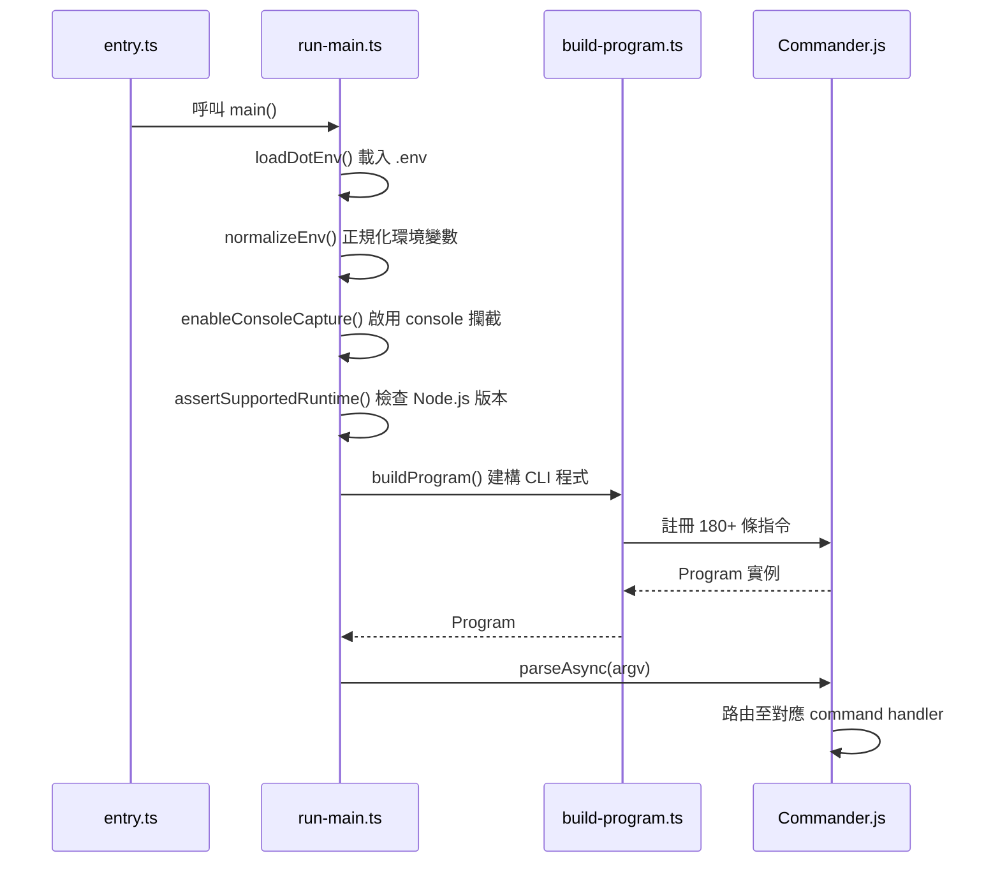

**設計亮點**：
- **Lazy-Loading 子指令**：減少啟動時間，僅在執行時載入對應模組
- **實驗性警告抑制**：避免 Node.js 實驗性功能警告干擾使用者體驗
- **程序 Respawn 機制**：支援重啟以切換環境變數（例如 `NODE_OPTIONS`）

---

### Layer 2: Command Layer（指令層）

**職責**：實作 180+ 條 CLI 指令，涵蓋代理管理、通道控制、模型設定、記憶體操作等

**目錄分類**：
| 目錄 | 指令數量 | 功能範圍 |
|------|---------|---------|
| `src/commands/onboard/` | ~10 | 初次設定、Wizard 流程 |
| `src/commands/agent/` | ~30 | 代理建立、設定、刪除 |
| `src/commands/channels/` | ~25 | 通道啟動、停止、狀態查詢 |
| `src/commands/messages/` | ~15 | 訊息傳送、查詢 |
| `src/commands/models/` | ~20 | 模型列表、測試、設定 |
| `src/commands/health/` | ~10 | 健康檢查、診斷 |
| `src/commands/memory/` | ~20 | 記憶體搜尋、壓縮、清理 |
| `src/commands/config/` | ~15 | 設定檔管理、驗證 |
| `src/commands/skills/` | ~10 | 技能管理 |
| `src/commands/nodes/` | ~8 | 節點管理 |
| `src/commands/cron/` | ~5 | 排程任務 |

**典型指令結構**（以 `agent new` 為例）：

```typescript
// src/commands/agent/new.ts
export async function handler(options: {
  name?: string;
  emoji?: string;
  model?: string;
}) {
  // 1. 驗證輸入參數
  // 2. 載入 workspace 設定
  // 3. 建立 agent 設定檔
  // 4. 寫入 AGENTS.md
  // 5. 回傳成功訊息
}
```

**設計原則**：
- 每條指令獨立一個檔案，匯出 `handler` 函式
- 使用 `Commander.Option` 定義參數與描述
- 整合 `inquirer` 進行互動式提示（Wizard 模式）

---

### Layer 3: Gateway Layer（閘道層）

**職責**：作為系統的中央通訊樞紐，統一處理 HTTP、WebSocket、RPC 方法調度、認證、通道生命週期管理

**核心元件**：

#### 3.1 HTTP Server（`src/gateway/server-http.ts`）

**監聽端口**：預設 `18789`（可透過 `OPENCLAW_PORT` 設定）

**路由表**：
| 方法 | 路徑 | 功能 | 認證需求 |
|------|------|------|---------|
| POST | `/ws` | WebSocket 升級握手 | JWT / API Key |
| POST | `/v1/chat/completions` | OpenAI-compatible API | API Key |
| POST | `/v1/responses` | OpenResponses 協議 | API Key |
| POST | `/hooks/wake` | 外部喚醒 Hook | API Key |
| POST | `/hooks/agent` | 代理專屬 Hook | API Key |
| GET | `/a2ui/*` | Canvas UI 靜態檔案 | 無（Localhost 豁免） |
| POST | `/slack` | Slack Event Webhook | Slack Signing Secret |

**關鍵實作片段**：
```typescript
// src/gateway/server-http.ts
export async function startGatewayServer(port: number = 18789) {
  const app = express();

  // 認證中介層
  app.use(authMiddleware);

  // WebSocket 升級
  app.post('/ws', handleWebSocketUpgrade);

  // OpenAI-compatible endpoint
  app.post('/v1/chat/completions', handleChatCompletions);

  // 啟動 server
  app.listen(port, () => {
    console.log(`Gateway listening on port ${port}`);
  });
}
```

---

#### 3.2 認證系統（`src/gateway/auth.ts`）

**認證方式**：
1. **JWT Token**：透過 `Authorization: Bearer <token>` header 傳遞
2. **API Key**：透過 `X-API-Key: <key>` header 傳遞
3. **Localhost Loopback 豁免**：來自 `127.0.0.1` 或 `::1` 的請求自動通過（僅限 `/a2ui/*` 等特定路徑）

**認證流程**：

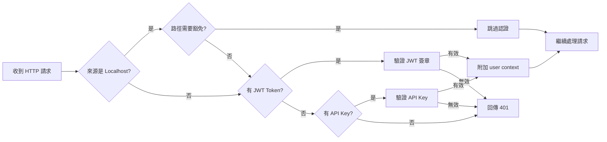

---

#### 3.3 RPC 方法調度（`src/gateway/server-methods/`）

**方法分類**（共 50+ 個 RPC 方法）：

| 命名空間 | 方法範例 | 功能 |
|---------|---------|------|
| `agent.*` | `agent.send`, `agent.abort`, `agent.config`, `agent.models` | 代理操作 |
| `channels.*` | `channels.list`, `channels.start`, `channels.stop` | 通道管理 |
| `chat.*` | `chat.send`, `chat.subscribe` | 即時訊息 |
| `nodes.*` | `nodes.list`, `nodes.invoke` | 節點管理 |
| `cron.*` | `cron.list`, `cron.add`, `cron.remove` | 排程任務 |
| `browser.*` | `browser.open`, `browser.close`, `browser.screenshot` | 瀏覽器自動化 |
| `logs.*` | `logs.stream`, `logs.query` | 日誌查詢 |
| `models.*` | `models.list`, `models.test` | 模型管理 |
| `health.*` | `health.check`, `health.diagnostics` | 健康檢查 |
| `config.*` | `config.get`, `config.set`, `config.validate` | 設定管理 |
| `wizard.*` | `wizard.start`, `wizard.step` | 設定精靈 |

**調度流程**：
```typescript
// src/gateway/server-ws.ts
ws.on('message', async (data) => {
  const { method, params, id } = JSON.parse(data);

  // 路由至對應 handler
  const handler = methodRegistry.get(method);
  if (!handler) {
    return ws.send({ error: 'Method not found', id });
  }

  try {
    const result = await handler(params, context);
    ws.send({ result, id });
  } catch (error) {
    ws.send({ error: error.message, id });
  }
});
```

---

#### 3.4 Session 管理（`src/gateway/server-channels.ts`）

**SessionKey 格式**：
```
[agentId]:[channelId]:[accountId]:[targetId]
```

**範例**：
- `my-bot:telegram:123456789:private` — Telegram 私訊
- `my-bot:discord:987654321:channel-general` — Discord #general 頻道
- `my-bot:whatsapp:+886912345678:group-family` — WhatsApp 家族群組

**Channel Lifecycle 管理**：
```typescript
class ChannelManager {
  private channels = new Map<string, AbortController>();

  async start(channelId: string) {
    const controller = new AbortController();
    this.channels.set(channelId, controller);

    // 啟動通道 adapter
    await channelAdapter.start(controller.signal);
  }

  async stop(channelId: string) {
    const controller = this.channels.get(channelId);
    controller?.abort(); // 發送中止信號
    this.channels.delete(channelId);
  }
}
```

**設計亮點**：
- **AbortController 模式**：每個通道使用獨立的 AbortController，支援優雅關閉
- **TTL Cache**：Session 資料快取 45 秒，減少檔案 I/O
- **多租戶隔離**：透過 SessionKey 確保不同代理 / 通道 / 帳號的訊息隔離

---

### Layer 4: Channel Adapter Layer（通道適配器層）

**職責**：將各通訊平台的異質介面，統一轉換為 OpenClaw 的 Envelope 格式

**設計模式**：Adapter Pattern（適配器模式）

**核心抽象**：
```typescript
// src/channels/dock.ts
export interface ChannelDock {
  id: string; // 通道唯一識別碼（例如 'telegram', 'discord'）
  capabilities: {
    chatTypes: ('private' | 'group' | 'channel')[];
    nativeCommands: boolean; // 是否支援原生斜線指令
  };
  outbound: {
    text: (params: OutboundTextParams) => Promise<void>;
    image?: (params: OutboundImageParams) => Promise<void>;
    file?: (params: OutboundFileParams) => Promise<void>;
  };
  threading?: {
    support: boolean;
    createThread?: (params: CreateThreadParams) => Promise<string>;
  };
  mentions?: {
    parse: (text: string) => Mention[];
  };
}
```

---

#### 4.1 各通道實作概覽

| 通道 | 底層函式庫 | 檔案數量 | 協議類型 | 關鍵特性 |
|------|-----------|---------|---------|---------|
| **WhatsApp** | Baileys（Web 協議逆向） | 45+ | WebSocket | QR Code 登入、多裝置同步、媒體上傳至 S3-compatible storage |
| **Telegram** | grammy（Bot API） | 95+ | HTTPS Long Polling | 支援 Inline Keyboard、Thread、Bot Command Menu |
| **Discord** | @buape/carbon（Gateway API） | 80+ | WebSocket | Slash Commands、Embed 訊息、Channel Permissions |
| **Slack** | @slack/bolt（Socket / HTTP 模式） | 75+ | WebSocket / HTTPS | Block Kit UI、Thread 回覆、Workspace Events |
| **Signal** | signal-cli（CLI daemon） | 25+ | SSE Reconnect | 端對端加密、Group V2、Sticker Pack |
| **iMessage** | BlueBubbles（RPC 協議） | 17 | HTTPS RPC | macOS Server 依賴、Tapback Reactions、Thread 回覆 |
| **LINE** | @line/bot-sdk（Webhook） | 38 | HTTPS Webhook | Flex Message、LIFF、Rich Menu |
| **Google Chat** | @google-cloud/chat（Webhook） | 15 | HTTPS Webhook | Card V2、Thread 回覆、Space Membership |
| **MS Teams** | @microsoft/teams-js（Bot Framework） | 20 | HTTPS Webhook | Adaptive Cards、Channel Mentions |
| **Matrix** | matrix-js-sdk（Client-Server API） | 30+ | HTTPS | 聯邦式架構、E2E 加密（Olm/Megolm） |

---

#### 4.2 Envelope 系統（標準化訊息封裝）

**Envelope 結構**：
```typescript
interface Envelope {
  channel: string;        // 通道識別碼（例如 'telegram'）
  from: {
    id: string;          // 發送者 ID
    name?: string;       // 發送者顯示名稱
    username?: string;   // 發送者用戶名
  };
  chat: {
    id: string;          // 對話 ID
    type: 'private' | 'group' | 'channel';
    title?: string;      // 對話標題（群組 / 頻道）
  };
  timestamp: number;     // Unix timestamp (ms)
  body: {
    text?: string;       // 純文字內容
    attachments?: Array<{
      type: 'image' | 'video' | 'audio' | 'file';
      url: string;
      mimeType?: string;
      size?: number;
    }>;
    mentions?: Array<{
      type: 'user' | 'channel' | 'role';
      id: string;
      name?: string;
    }>;
    replyTo?: string;    // 被回覆的訊息 ID
    thread?: string;     // Thread / Topic ID
  };
  raw: any;              // 原始通道訊息物件（供進階用途）
}
```

**轉換範例（Telegram → Envelope）**：
```typescript
// src/telegram/envelope.ts
export function telegramToEnvelope(update: Update): Envelope {
  const message = update.message;
  return {
    channel: 'telegram',
    from: {
      id: String(message.from.id),
      name: message.from.first_name,
      username: message.from.username,
    },
    chat: {
      id: String(message.chat.id),
      type: message.chat.type === 'private' ? 'private' : 'group',
      title: message.chat.title,
    },
    timestamp: message.date * 1000,
    body: {
      text: message.text,
      replyTo: message.reply_to_message?.message_id,
      thread: message.message_thread_id,
    },
    raw: update,
  };
}
```

---

#### 4.3 Channel Dock 註冊範例（Discord）

```typescript
// src/discord/dock.ts
export const discordDock: ChannelDock = {
  id: 'discord',
  capabilities: {
    chatTypes: ['private', 'group', 'channel'],
    nativeCommands: true, // 支援 Slash Commands
  },
  outbound: {
    async text(params) {
      const { channelId, text, threadId } = params;
      const channel = await client.channels.fetch(channelId);
      await channel.send({
        content: text,
        threadId,
      });
    },
    async image(params) {
      const { channelId, imageUrl, caption } = params;
      const channel = await client.channels.fetch(channelId);
      await channel.send({
        content: caption,
        files: [{ attachment: imageUrl }],
      });
    },
  },
  threading: {
    support: true,
    async createThread(params) {
      const { channelId, name, messageId } = params;
      const message = await channel.messages.fetch(messageId);
      const thread = await message.startThread({ name });
      return thread.id;
    },
  },
  mentions: {
    parse(text) {
      // 解析 <@123456789> 格式
      const regex = /<@!?(\d+)>/g;
      const mentions = [];
      let match;
      while ((match = regex.exec(text))) {
        mentions.push({ type: 'user', id: match[1] });
      }
      return mentions;
    },
  },
};
```

---

### Layer 5: Agent Layer（代理層）

**職責**：管理 AI 代理的身份、工作區設定、模型配置、工具政策、子代理協調

**核心元件**：

#### 5.1 Agent Identity（`src/agents/identity.ts`）

```typescript
export interface AgentIdentity {
  name: string;          // 代理名稱（例如 'my-assistant'）
  emoji?: string;        // 代理圖示（例如 '🤖'）
  messagePrefix?: string; // 訊息前綴（例如 '[Bot]'）
  description?: string;  // 代理描述
}
```

---

#### 5.2 Workspace 系統（`src/agents/workspace.ts`）

**Workspace 結構**：
```
~/.openclaw/
├── SOUL.md              # 系統核心提示詞（System Prompt）
├── AGENTS.md            # 代理清單與設定
├── USER.md              # 使用者偏好與上下文
├── TOOLS.md             # 工具清單與使用指南
├── HEARTBEAT.md         # 系統健康狀態（自動生成）
├── MEMORY.md            # 記憶體快照（自動生成）
└── agents/
    ├── my-bot/
    │   ├── config.json5  # 代理設定
    │   ├── soul.md       # 代理專屬 System Prompt
    │   └── memory/       # 代理專屬記憶體
    └── assistant/
        └── config.json5
```

**關鍵設定檔範例（`config.json5`）**：
```json5
{
  agent: {
    name: "my-bot",
    emoji: "🤖",
    description: "A helpful assistant for technical support",
  },
  models: [
    {
      provider: "anthropic",
      model: "claude-opus-4",
      apiKey: "${ANTHROPIC_API_KEY}", // 環境變數替換
      maxTokens: 4096,
      temperature: 0.7,
    },
    {
      provider: "openai",
      model: "gpt-4-turbo",
      apiKey: "${OPENAI_API_KEY}",
      fallback: true, // 作為備援模型
    },
  ],
  tools: {
    policy: "whitelist", // 'whitelist' | 'blacklist' | 'none'
    whitelist: ["web_search", "code_interpreter"],
    approval: {
      required: true,
      methods: ["email", "slack"],
    },
  },
  channels: {
    telegram: { enabled: true },
    discord: { enabled: true },
    slack: { enabled: false },
  },
}
```

---

#### 5.3 模型設定與 Failover 機制

**支援的 AI 提供者**：
| 提供者 | 環境變數 | 支援模型範例 |
|--------|---------|-------------|
| Anthropic | `ANTHROPIC_API_KEY` | claude-opus-4, claude-sonnet-3.5 |
| OpenAI | `OPENAI_API_KEY` | gpt-4-turbo, gpt-4o, gpt-3.5-turbo |
| Google | `GOOGLE_AI_API_KEY` | gemini-2.0-flash, gemini-1.5-pro |
| xAI | `XAI_API_KEY` | grok-2, grok-vision |
| Minimax | `MINIMAX_API_KEY` | abab6.5s-chat |
| Qwen | `QWEN_API_KEY` | qwen-max, qwen-plus |
| GitHub Copilot | `GITHUB_TOKEN` | gpt-4o（透過 Copilot API） |

**Failover 流程**：
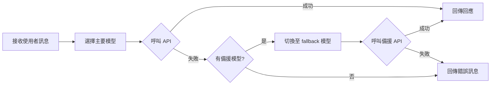

---

#### 5.4 工具政策（Tool Policy）

**政策類型**：
1. **Whitelist（白名單）**：僅允許明確列出的工具
2. **Blacklist（黑名單）**：禁止特定工具，其餘允許
3. **None（無限制）**：允許所有工具（風險較高）

**審批流程**（Approval Required）：
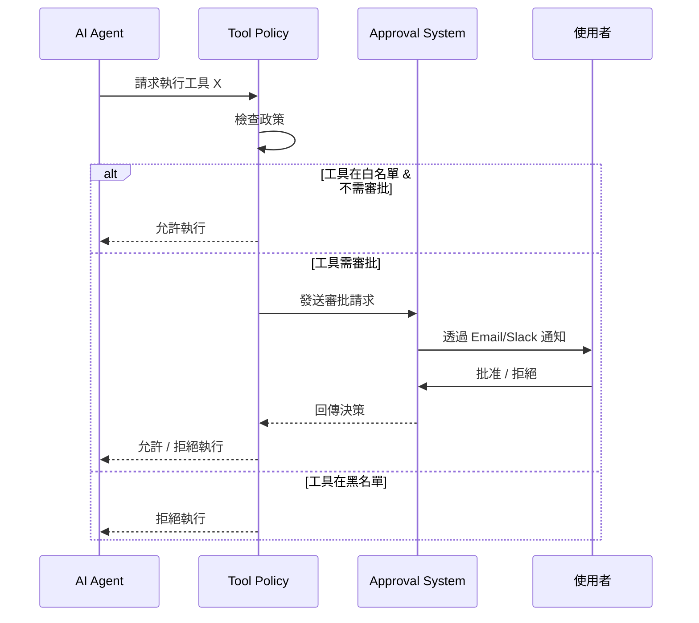

---

#### 5.5 子代理系統（Subagents）

**使用情境**：
- **專業化分工**：將複雜任務拆分給不同專長的子代理（例如：研究員、程式撰寫員、品管員）
- **平行處理**：多個子代理同時處理不同子任務
- **階層式決策**：主代理負責協調，子代理負責執行

**設定範例**：
```json5
{
  agent: {
    name: "orchestrator",
    subagents: [
      {
        name: "researcher",
        model: "claude-opus-4",
        tools: ["web_search", "arxiv_search"],
        description: "專門負責資料蒐集與研究",
      },
      {
        name: "coder",
        model: "gpt-4-turbo",
        tools: ["code_interpreter", "github"],
        description: "專門負責程式撰寫與測試",
      },
    ],
  },
}
```

---

### Layer 6: Auto-Reply Engine（自動回覆引擎）

**職責**：處理訊息的自動回覆邏輯，包含指令偵測、Agent Runner、記憶體管理、回覆分塊

**核心流程**：

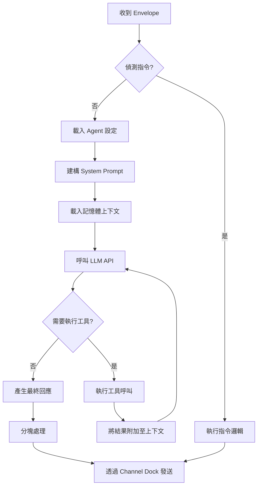

---

#### 6.1 指令偵測系統

**支援的指令格式**：
| 指令 | 格式 | 功能 |
|------|------|------|
| `/compact` | `/compact` | 觸發記憶體壓縮 |
| `/think` | `/think <query>` | 進入深度思考模式（Chain-of-Thought） |
| `/elevated` | `/elevated <request>` | 提升權限模式（允許執行敏感操作） |
| Inline Directive | `@bot please summarize` | 內嵌指令（透過 @ 提及） |

**偵測邏輯**：
```typescript
// src/auto-reply/command-detection.ts
export function detectCommand(text: string): Command | null {
  // 偵測斜線指令
  const slashMatch = text.match(/^\/(\w+)(?:\s+(.*))?$/);
  if (slashMatch) {
    return {
      type: 'slash',
      name: slashMatch[1],
      args: slashMatch[2],
    };
  }

  // 偵測內嵌指令（@ 提及）
  const mentionMatch = text.match(/@(\w+)\s+(.+)/);
  if (mentionMatch) {
    return {
      type: 'inline',
      target: mentionMatch[1],
      content: mentionMatch[2],
    };
  }

  return null;
}
```

---

#### 6.2 Agent Runner（代理執行器）

**核心職責**：
1. **System Prompt 建構**：組合 `SOUL.md` + Agent 專屬 `soul.md` + 即時上下文
2. **記憶體檢索**：從向量資料庫查詢相關歷史對話
3. **LLM 推理**：呼叫設定的 AI 模型進行推理
4. **工具執行**：處理 Function Calling（工具呼叫）
5. **回應格式化**：將 LLM 輸出轉換為 Envelope 格式

**System Prompt 建構範例**：
```typescript
// src/auto-reply/agent-runner.ts
async function buildSystemPrompt(agentId: string, envelope: Envelope): Promise<string> {
  const soulMd = await readFile('~/.openclaw/SOUL.md', 'utf-8');
  const agentSoulMd = await readFile(`~/.openclaw/agents/${agentId}/soul.md`, 'utf-8');
  const toolsMd = await readFile('~/.openclaw/TOOLS.md', 'utf-8');
  const userMd = await readFile('~/.openclaw/USER.md', 'utf-8');

  // 檢索相關記憶體
  const memories = await memorySystem.search({
    query: envelope.body.text,
    limit: 5,
  });

  const memoryContext = memories.map(m => `- ${m.text}`).join('\n');

  return `
${soulMd}

## Agent Configuration
${agentSoulMd}

## Available Tools
${toolsMd}

## User Context
${userMd}

## Recent Relevant Memories
${memoryContext}

---

Current conversation context:
Channel: ${envelope.channel}
User: ${envelope.from.name} (${envelope.from.id})
Chat: ${envelope.chat.type} - ${envelope.chat.title || 'Direct Message'}
Timestamp: ${new Date(envelope.timestamp).toISOString()}
  `.trim();
}
```

---

#### 6.3 Function Calling（工具呼叫）

**支援的工具類型**：
- **內建工具**：web_search, code_interpreter, file_operations, image_generation
- **外掛工具**：由 Plugin System 註冊的自訂工具
- **系統工具**：memory_search, agent_handoff, schedule_reminder

**執行流程**：
```typescript
// src/auto-reply/tool-executor.ts
async function executeTool(
  toolCall: ToolCall,
  context: ExecutionContext
): Promise<ToolResult> {
  const { name, arguments: args } = toolCall;

  // 檢查工具政策
  const allowed = await checkToolPolicy(name, context.agentId);
  if (!allowed) {
    return { error: 'Tool not allowed by policy' };
  }

  // 檢查是否需要審批
  const needsApproval = await checkApprovalRequirement(name, context.agentId);
  if (needsApproval) {
    const approved = await requestApproval(toolCall, context);
    if (!approved) {
      return { error: 'Tool execution not approved' };
    }
  }

  // 執行工具
  const tool = toolRegistry.get(name);
  const result = await tool.execute(args, context);

  return result;
}
```

---

#### 6.4 Block Reply Pipeline（分塊回覆管線）

**目的**：將長篇 LLM 回應拆分為適合各通道的訊息塊，避免超過字數限制

**各通道限制**：
| 通道 | 單則訊息字數上限 |
|------|----------------|
| Telegram | 4096 字元 |
| Discord | 2000 字元 |
| Slack | 4000 字元（Block Kit 有額外限制） |
| WhatsApp | 65536 字元（實務上建議 4096） |
| Signal | 無明確限制（建議 4096） |

**分塊策略**：
```typescript
// src/auto-reply/block-reply.ts
export function splitIntoBlocks(text: string, maxLength: number): string[] {
  const blocks: string[] = [];
  const paragraphs = text.split('\n\n');

  let currentBlock = '';
  for (const para of paragraphs) {
    if (currentBlock.length + para.length + 2 <= maxLength) {
      currentBlock += (currentBlock ? '\n\n' : '') + para;
    } else {
      if (currentBlock) blocks.push(currentBlock);

      // 段落本身過長，需進一步拆分
      if (para.length > maxLength) {
        const sentences = para.match(/[^.!?]+[.!?]+/g) || [para];
        let sentenceBlock = '';
        for (const sentence of sentences) {
          if (sentenceBlock.length + sentence.length <= maxLength) {
            sentenceBlock += sentence;
          } else {
            if (sentenceBlock) blocks.push(sentenceBlock);
            sentenceBlock = sentence;
          }
        }
        currentBlock = sentenceBlock;
      } else {
        currentBlock = para;
      }
    }
  }

  if (currentBlock) blocks.push(currentBlock);
  return blocks;
}
```

---

### Layer 7: Infrastructure Layer（基礎設施層）

**職責**：提供跨模組的橫切關注點（Cross-Cutting Concerns），包含環境管理、日誌系統、錯誤處理、網路安全、系統事件、成本追蹤

**核心元件**（`src/infra/` 共 350+ 檔案）：

#### 7.1 環境變數管理（`src/infra/env/`）

**功能**：
- 自動載入 `.env` 檔案
- 環境變數驗證（必填項目檢查）
- 類型轉換（字串 → 數字 / 布林值）
- 預設值提供

**關鍵實作**：
```typescript
// src/infra/env/load.ts
export function loadEnv() {
  dotenv.config({ path: '.env' });
  dotenv.config({ path: '.env.local', override: true });

  // 驗證必要環境變數
  const required = [
    'ANTHROPIC_API_KEY',
    'OPENAI_API_KEY',
    'OPENCLAW_PORT',
  ];

  for (const key of required) {
    if (!process.env[key]) {
      throw new Error(`Missing required environment variable: ${key}`);
    }
  }
}
```

---

#### 7.2 日誌系統（`src/infra/logging/`）

**日誌等級**：
- `DEBUG`：除錯訊息（預設關閉）
- `INFO`：一般資訊
- `WARN`：警告訊息
- `ERROR`：錯誤訊息
- `FATAL`：致命錯誤

**結構化日誌範例**：
```typescript
// src/infra/logging/logger.ts
export const logger = {
  info(message: string, meta?: object) {
    console.log(JSON.stringify({
      level: 'INFO',
      timestamp: new Date().toISOString(),
      message,
      ...meta,
    }));
  },

  error(message: string, error?: Error, meta?: object) {
    console.error(JSON.stringify({
      level: 'ERROR',
      timestamp: new Date().toISOString(),
      message,
      error: error ? {
        name: error.name,
        message: error.message,
        stack: error.stack,
      } : undefined,
      ...meta,
    }));
  },
};
```

---

#### 7.3 錯誤處理（`src/infra/errors/`）

**自訂錯誤類別**：
```typescript
// src/infra/errors/types.ts
export class OpenClawError extends Error {
  constructor(
    message: string,
    public code: string,
    public statusCode: number = 500,
    public details?: any
  ) {
    super(message);
    this.name = 'OpenClawError';
  }
}

export class AuthenticationError extends OpenClawError {
  constructor(message: string) {
    super(message, 'AUTH_FAILED', 401);
    this.name = 'AuthenticationError';
  }
}

export class RateLimitError extends OpenClawError {
  constructor(retryAfter: number) {
    super('Rate limit exceeded', 'RATE_LIMIT', 429, { retryAfter });
    this.name = 'RateLimitError';
  }
}
```

---

#### 7.4 網路安全與 SSRF 防護（`src/infra/network/`）

**SSRF（Server-Side Request Forgery）防護**：
```typescript
// src/infra/network/ssrf-protection.ts
const BLOCKED_RANGES = [
  '127.0.0.0/8',      // Localhost
  '10.0.0.0/8',       // Private network
  '172.16.0.0/12',    // Private network
  '192.168.0.0/16',   // Private network
  '169.254.0.0/16',   // Link-local
  '::1/128',          // IPv6 localhost
  'fc00::/7',         // IPv6 private
];

export function isSafeUrl(url: string): boolean {
  const parsed = new URL(url);

  // 僅允許 HTTP / HTTPS
  if (!['http:', 'https:'].includes(parsed.protocol)) {
    return false;
  }

  // 解析 IP 位址
  const ip = dns.lookup(parsed.hostname);

  // 檢查是否在封鎖範圍內
  for (const range of BLOCKED_RANGES) {
    if (ipRangeCheck(ip, range)) {
      return false;
    }
  }

  return true;
}
```

---

#### 7.5 系統事件（`src/infra/events/`）

**事件匯流排（Event Bus）**：
```typescript
// src/infra/events/bus.ts
class EventBus {
  private listeners = new Map<string, Set<EventListener>>();

  on(event: string, listener: EventListener) {
    if (!this.listeners.has(event)) {
      this.listeners.set(event, new Set());
    }
    this.listeners.get(event)!.add(listener);
  }

  emit(event: string, payload: any) {
    const listeners = this.listeners.get(event);
    if (!listeners) return;

    for (const listener of listeners) {
      // 非同步執行，避免阻塞
      setImmediate(() => listener(payload));
    }
  }
}

export const systemEvents = new EventBus();
```

**系統事件清單**：
- `agent:created`, `agent:deleted`
- `channel:started`, `channel:stopped`
- `message:received`, `message:sent`
- `tool:executed`, `tool:failed`
- `memory:indexed`, `memory:searched`

---

#### 7.6 成本追蹤（`src/infra/cost-tracking/`）

**追蹤項目**：
| 類別 | 計費單位 | 範例 |
|------|---------|------|
| LLM API 呼叫 | Token 數量 | Anthropic: $15/1M tokens (input), $75/1M tokens (output) |
| Embedding API | Token 數量 | OpenAI text-embedding-3-large: $0.13/1M tokens |
| 圖片生成 | 圖片數量 | DALL·E 3: $0.04/image |
| 語音轉文字 | 秒數 | Whisper: $0.006/minute |

**成本統計範例**：
```typescript
// src/infra/cost-tracking/tracker.ts
export class CostTracker {
  private costs = new Map<string, number>();

  trackLLMCall(model: string, inputTokens: number, outputTokens: number) {
    const pricing = LLM_PRICING[model];
    const cost = (
      (inputTokens / 1_000_000) * pricing.input +
      (outputTokens / 1_000_000) * pricing.output
    );

    this.addCost(`llm:${model}`, cost);
  }

  private addCost(category: string, amount: number) {
    const current = this.costs.get(category) || 0;
    this.costs.set(category, current + amount);
  }

  getReport(): CostReport {
    const entries = Array.from(this.costs.entries())
      .map(([category, cost]) => ({ category, cost }))
      .sort((a, b) => b.cost - a.cost);

    return {
      total: entries.reduce((sum, e) => sum + e.cost, 0),
      breakdown: entries,
    };
  }
}
```

---

### Layer 8: Plugin System（外掛系統）

**職責**：提供完整的外掛生命週期管理，支援動態載入工具、通道、AI 提供者、CLI 指令、HTTP Handler

**生命週期流程**：

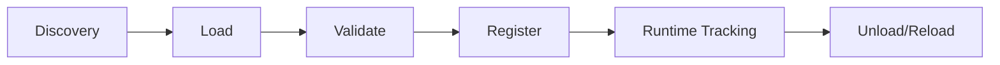

---

#### 8.1 Plugin Manifest（`openclaw.plugin.json`）

**完整範例**：
```json5
{
  id: "my-custom-plugin",
  name: "My Custom Plugin",
  version: "1.0.0",
  description: "A custom plugin for OpenClaw",
  author: "Your Name",

  // 外掛進入點
  entry: "./dist/index.js",

  // 設定 Schema（使用 JSON Schema）
  configSchema: {
    type: "object",
    properties: {
      apiKey: {
        type: "string",
        description: "API Key for the service",
      },
      endpoint: {
        type: "string",
        format: "uri",
        description: "API endpoint URL",
      },
    },
    required: ["apiKey"],
  },

  // 支援的通道
  channels: [
    {
      id: "custom-channel",
      name: "Custom Messaging Platform",
      capabilities: ["text", "image", "thread"],
    },
  ],

  // AI 提供者
  providers: [
    {
      id: "custom-llm",
      name: "Custom LLM Provider",
      models: ["custom-model-1", "custom-model-2"],
    },
  ],

  // 技能（Skills）
  skills: [
    {
      id: "data-analysis",
      name: "Data Analysis",
      description: "Perform advanced data analysis",
    },
  ],

  // 依賴其他外掛
  dependencies: {
    "plugin-a": "^1.0.0",
    "plugin-b": "^2.0.0",
  },
}
```

---

#### 8.2 Plugin API

**註冊工具**：
```typescript
// plugins/my-plugin/src/index.ts
export function activate(context: PluginContext) {
  // 註冊工具
  context.registerTool({
    name: 'custom_search',
    description: 'Search using a custom search engine',
    parameters: {
      type: 'object',
      properties: {
        query: { type: 'string', description: 'Search query' },
        limit: { type: 'number', default: 10 },
      },
      required: ['query'],
    },
    async execute(args) {
      const { query, limit } = args;
      const results = await customSearchAPI.search(query, limit);
      return { results };
    },
  });

  // 註冊 Hook
  context.registerHook('message:received', async (envelope) => {
    console.log('Plugin received message:', envelope);
  });

  // 註冊 CLI 指令
  context.registerCliCommand({
    command: 'custom-command',
    description: 'A custom CLI command',
    async handler(options) {
      console.log('Executing custom command with options:', options);
    },
  });

  // 註冊 HTTP Handler
  context.registerHttpHandler({
    method: 'POST',
    path: '/custom-webhook',
    async handler(req, res) {
      const body = req.body;
      console.log('Received webhook:', body);
      res.json({ success: true });
    },
  });

  // 註冊 Gateway RPC Method
  context.registerGatewayMethod({
    name: 'custom.action',
    async handler(params, context) {
      return { result: 'Custom action executed' };
    },
  });
}

export function deactivate() {
  console.log('Plugin deactivated');
}
```

---

#### 8.3 Memory Slot System（記憶體插槽系統）

**限制**：同一時間僅能有一個記憶體外掛處於啟用狀態

**實作邏輯**：
```typescript
// src/plugins/memory-slot.ts
class MemorySlotManager {
  private activePlugin: string | null = null;

  activateMemoryPlugin(pluginId: string) {
    if (this.activePlugin && this.activePlugin !== pluginId) {
      throw new Error(
        `Memory slot already occupied by plugin: ${this.activePlugin}. ` +
        `Please deactivate it before activating ${pluginId}.`
      );
    }
    this.activePlugin = pluginId;
  }

  deactivateMemoryPlugin(pluginId: string) {
    if (this.activePlugin === pluginId) {
      this.activePlugin = null;
    }
  }
}
```

---

### Layer 9: Hook System（Hook 系統）

**職責**：實作事件驅動架構，允許模組與外掛訂閱系統事件並執行回呼函式

**Hook 來源分類**：
| 來源類型 | 位置 | 範例 |
|---------|------|------|
| Bundled（內建） | `src/hooks/bundled/` | `boot-md`, `command-logger`, `session-memory` |
| Managed（管理式） | `~/.openclaw/hooks/` | 使用者安裝的 Hook |
| Workspace（工作區） | `~/.openclaw/workspace/hooks/` | 專案專屬 Hook |
| Plugin（外掛） | `plugins/*/hooks/` | 外掛提供的 Hook |

---

#### 9.1 全域事件註冊表

**資料結構**：
```typescript
// src/hooks/registry.ts
class HookRegistry {
  private hooks = new Map<string, Set<HookHandler>>();

  register(event: string, handler: HookHandler) {
    if (!this.hooks.has(event)) {
      this.hooks.set(event, new Set());
    }
    this.hooks.get(event)!.add(handler);
  }

  unregister(event: string, handler: HookHandler) {
    const handlers = this.hooks.get(event);
    if (handlers) {
      handlers.delete(handler);
    }
  }

  getHandlers(event: string): HookHandler[] {
    return Array.from(this.hooks.get(event) || []);
  }
}
```

---

#### 9.2 雙層分發機制（Dual-Level Dispatch）

**機制說明**：
- **通用事件**：`command` — 所有指令執行時觸發
- **特定事件**：`command:new` — 僅 `new` 指令執行時觸發

**分發邏輯**：
```typescript
// src/hooks/dispatcher.ts
export async function dispatchHook(event: string, payload: any) {
  const registry = getHookRegistry();

  // 1. 觸發通用 Hook（例如 'command'）
  const genericHandlers = registry.getHandlers(event.split(':')[0]);
  for (const handler of genericHandlers) {
    await handler(payload);
  }

  // 2. 觸發特定 Hook（例如 'command:new'）
  const specificHandlers = registry.getHandlers(event);
  for (const handler of specificHandlers) {
    await handler(payload);
  }
}
```

**使用範例**：
```typescript
// 註冊通用 Hook
hookRegistry.register('command', async (payload) => {
  console.log('任何指令執行時觸發:', payload.command);
});

// 註冊特定 Hook
hookRegistry.register('command:agent:new', async (payload) => {
  console.log('僅在 agent new 指令執行時觸發:', payload);
});

// 觸發事件
await dispatchHook('command:agent:new', {
  command: 'agent:new',
  args: { name: 'my-bot' },
});
```

---

#### 9.3 內建 Hook 範例

**Session Memory Hook**（`src/hooks/bundled/session-memory.ts`）：
```typescript
export function activate(context: HookContext) {
  // 在訊息接收時，載入對話歷史
  context.on('message:received', async (envelope) => {
    const sessionKey = buildSessionKey(envelope);
    const history = await loadSessionHistory(sessionKey);

    // 將歷史附加至 envelope
    envelope._sessionHistory = history;
  });

  // 在訊息發送後,儲存至對話歷史
  context.on('message:sent', async (envelope, response) => {
    const sessionKey = buildSessionKey(envelope);
    await appendToSessionHistory(sessionKey, {
      user: envelope.body.text,
      assistant: response.text,
      timestamp: Date.now(),
    });
  });
}
```

---

### Layer 10: Memory System（記憶體系統）

**職責**：提供混合式向量搜尋（Vector Search）+ BM25 全文搜尋，支援長期記憶與語義檢索

**核心技術棧**：
- **資料庫**：SQLite（輕量、零設定、可嵌入）
- **向量擴展**：sqlite-vec（SQLite 原生向量搜尋擴展）
- **全文搜尋**：FTS5（SQLite 內建的全文搜尋引擎）
- **Embedding 提供者**：OpenAI、Google Gemini、Voyage AI

---

#### 10.1 資料表結構

**Schema 定義**：
```sql
-- 向量儲存表
CREATE TABLE chunks_vec (
  id INTEGER PRIMARY KEY,
  agent_id TEXT NOT NULL,
  session_key TEXT,
  content TEXT NOT NULL,
  embedding BLOB NOT NULL,  -- 向量 Embedding（序列化為二進位）
  metadata TEXT,            -- JSON 格式的元資料
  created_at INTEGER NOT NULL,
  INDEX idx_agent_id (agent_id),
  INDEX idx_session_key (session_key)
);

-- 全文搜尋表（FTS5 虛擬表）
CREATE VIRTUAL TABLE chunks_fts USING fts5(
  id UNINDEXED,
  content,
  content=chunks_vec,
  content_rowid=id
);

-- Embedding 快取表（避免重複計算）
CREATE TABLE embedding_cache (
  text_hash TEXT PRIMARY KEY,
  embedding BLOB NOT NULL,
  provider TEXT NOT NULL,
  model TEXT NOT NULL,
  created_at INTEGER NOT NULL
);
```

---

#### 10.2 混合搜尋策略

**流程**：
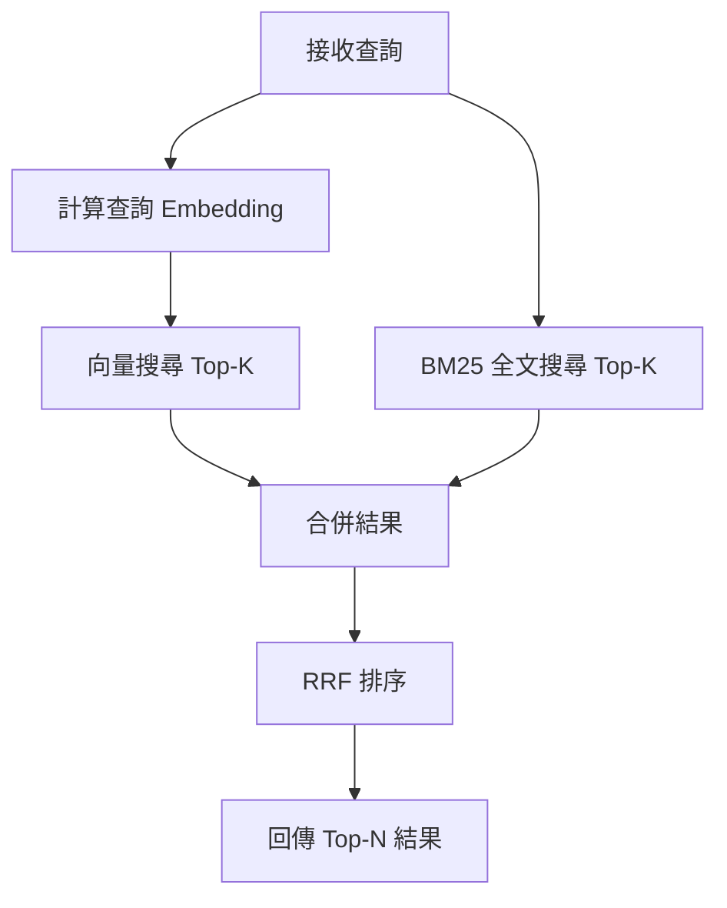

**RRF（Reciprocal Rank Fusion）排序演算法**：
```typescript
// src/memory/ranking.ts
export function reciprocalRankFusion(
  vectorResults: SearchResult[],
  bm25Results: SearchResult[],
  k: number = 60
): SearchResult[] {
  const scores = new Map<string, number>();

  // 向量搜尋結果
  vectorResults.forEach((result, rank) => {
    const score = 1 / (k + rank + 1);
    scores.set(result.id, (scores.get(result.id) || 0) + score);
  });

  // BM25 搜尋結果
  bm25Results.forEach((result, rank) => {
    const score = 1 / (k + rank + 1);
    scores.set(result.id, (scores.get(result.id) || 0) + score);
  });

  // 排序並回傳
  return Array.from(scores.entries())
    .sort((a, b) => b[1] - a[1])
    .map(([id]) => {
      return vectorResults.find(r => r.id === id) ||
             bm25Results.find(r => r.id === id)!;
    });
}
```

---

#### 10.3 Embedding 提供者整合

**支援的提供者**：
| 提供者 | 模型 | 維度 | 成本（每百萬 Token） |
|--------|------|------|---------------------|
| OpenAI | text-embedding-3-small | 1536 | $0.02 |
| OpenAI | text-embedding-3-large | 3072 | $0.13 |
| Google | text-embedding-004 | 768 | 免費（配額內） |
| Voyage AI | voyage-2 | 1024 | $0.12 |

**Embedding 計算範例**：
```typescript
// src/memory/embedding.ts
export async function computeEmbedding(
  text: string,
  provider: 'openai' | 'google' | 'voyage'
): Promise<number[]> {
  // 檢查快取
  const cached = await getEmbeddingFromCache(text, provider);
  if (cached) return cached;

  // 呼叫 API
  let embedding: number[];
  switch (provider) {
    case 'openai':
      embedding = await openaiClient.embeddings.create({
        model: 'text-embedding-3-large',
        input: text,
      }).then(res => res.data[0].embedding);
      break;
    case 'google':
      embedding = await googleClient.embedText({ text });
      break;
    case 'voyage':
      embedding = await voyageClient.embed({ text });
      break;
  }

  // 寫入快取
  await saveEmbeddingToCache(text, embedding, provider);

  return embedding;
}
```

---

#### 10.4 Batch API 成本優化

**問題**：大量訊息索引時,逐條呼叫 Embedding API 成本高昂

**解決方案**：使用 OpenAI Batch API（成本減半）

**實作範例**：
```typescript
// src/memory/batch-indexing.ts
export async function batchIndexMessages(messages: Message[]) {
  const batchSize = 100;
  const batches = chunk(messages, batchSize);

  for (const batch of batches) {
    // 建立 Batch Request
    const batchRequest = {
      input_file_id: await uploadBatchFile(batch),
      endpoint: '/v1/embeddings',
      completion_window: '24h',
    };

    // 提交 Batch Job
    const job = await openaiClient.batches.create(batchRequest);

    // 輪詢直到完成
    let status = 'validating';
    while (status !== 'completed') {
      await sleep(60_000); // 每分鐘檢查一次
      const jobStatus = await openaiClient.batches.retrieve(job.id);
      status = jobStatus.status;
    }

    // 下載結果
    const results = await downloadBatchResults(job.output_file_id);

    // 寫入資料庫
    await insertEmbeddings(results);
  }
}
```

---

## 3. 典型訊息處理流程

### Inbound Message Flow（入站訊息流）

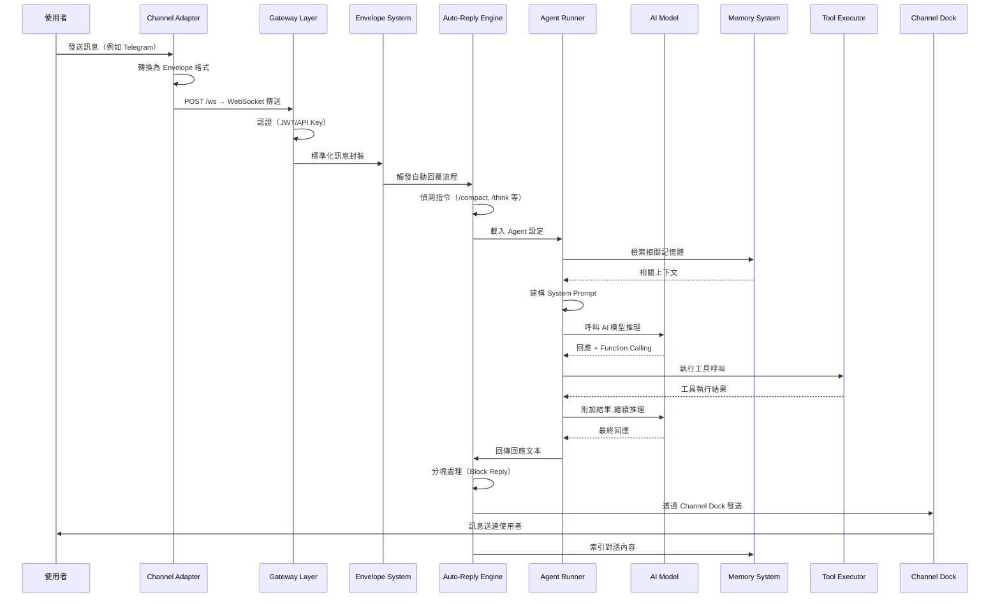

---

### Gateway 啟動序列

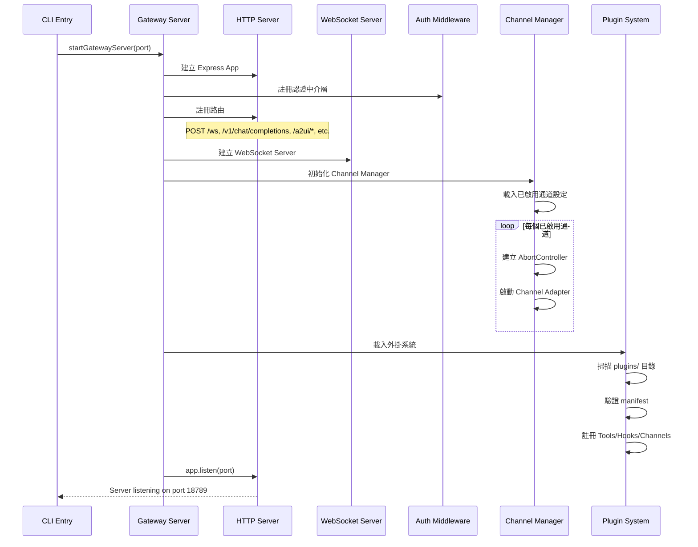

---

### 認證流程

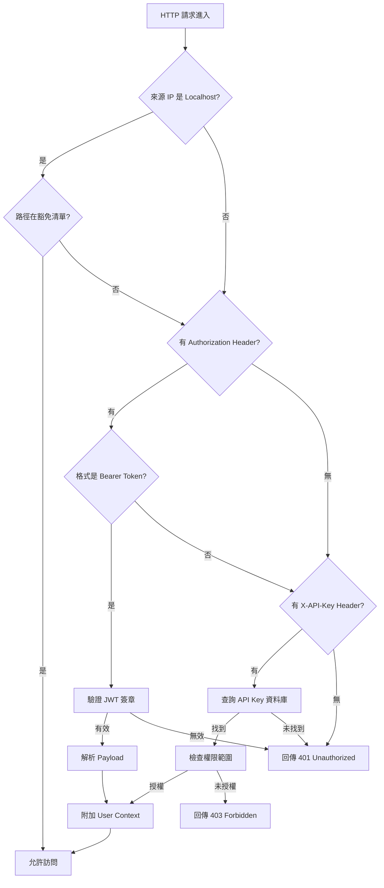

---

## 4. 外部整合與依賴

### 4.1 AI 提供者整合

| 提供者 | 模型範例 | API 類型 | 認證方式 | 特殊功能 |
|--------|---------|---------|---------|---------|
| **Anthropic** | claude-opus-4, claude-sonnet-3.5 | REST API | API Key | Computer Use, Tool Use, Vision |
| **OpenAI** | gpt-4o, gpt-4-turbo | REST API | API Key | Function Calling, Vision, DALL·E 整合 |
| **Google** | gemini-2.0-flash, gemini-1.5-pro | REST API | API Key | Multimodal, Long Context (2M tokens) |
| **xAI** | grok-2, grok-vision | REST API | API Key | Realtime Web Search |
| **Minimax** | abab6.5s-chat | REST API | API Key | 中文優化 |
| **Qwen** | qwen-max, qwen-plus | REST API | API Key | 中文優化, VL (Vision-Language) |
| **GitHub Copilot** | gpt-4o（透過 Copilot API） | REST API | GitHub Token | 程式碼補全整合 |

---

### 4.2 通訊平台整合

| 平台 | 底層函式庫 | 協議 | 認證方式 | 特殊功能 |
|------|-----------|------|---------|---------|
| **WhatsApp** | Baileys | WebSocket（Web 協議逆向） | QR Code | 多裝置、媒體上傳、狀態更新 |
| **Telegram** | grammy | HTTPS Long Polling | Bot Token | Inline Keyboard、Thread、Bot Commands |
| **Discord** | @buape/carbon | WebSocket（Gateway API） | Bot Token | Slash Commands、Embeds、Permissions |
| **Slack** | @slack/bolt | WebSocket / Webhook | OAuth 2.0 | Block Kit、Thread、Workspace Events |
| **Signal** | signal-cli | SSE（Server-Sent Events） | Phone Number | 端對端加密、Group V2 |
| **iMessage** | BlueBubbles | HTTPS RPC | macOS Server | Tapback Reactions、Thread |
| **LINE** | @line/bot-sdk | HTTPS Webhook | Channel Access Token | Flex Message、LIFF、Rich Menu |
| **Google Chat** | @google-cloud/chat | HTTPS Webhook | Service Account | Card V2、Thread、Space |
| **MS Teams** | Bot Framework | HTTPS Webhook | Azure AD | Adaptive Cards、Channel Mentions |
| **Matrix** | matrix-js-sdk | HTTPS（Client-Server API） | Access Token | 聯邦式架構、E2E 加密 |

---

### 4.3 基礎設施整合

| 服務 | 用途 | 整合方式 |
|------|------|---------|
| **Tailscale** | 私有網路、Zero Trust Network | 安裝 Tailscale daemon，透過 Magic DNS 連線 |
| **Fly.io** | 容器化部署平台 | Dockerfile + fly.toml 部署 |
| **Render** | 雲端平台（替代方案） | render.yaml 部署設定 |
| **Docker** | 容器化 | Multi-stage build Dockerfile |
| **Bonjour** | 本地服務發現 | mDNS 廣播（僅限 macOS / Linux） |

---

## 5. 狀態管理策略

### 5.1 設定管理

**設定檔格式**：JSON5（支援註解、尾隨逗號、環境變數替換）

**設定載入順序**：
```
1. ~/.openclaw/config.json5          # 全域設定
2. ~/.openclaw/agents/<id>/config.json5  # 代理專屬設定
3. 環境變數覆蓋（${ENV_VAR}）
4. CLI 參數覆蓋（--option value）
```

**環境變數替換範例**：
```json5
{
  models: [
    {
      provider: "anthropic",
      apiKey: "${ANTHROPIC_API_KEY}",  // 從環境變數讀取
    },
  ],
}
```

**Includes 支援**：
```json5
{
  $include: ["./base-config.json5"],  // 引入其他設定檔
  agent: {
    name: "my-bot",
  },
}
```

**Zod 驗證**：
```typescript
// src/config/schema.ts
import { z } from 'zod';

export const AgentConfigSchema = z.object({
  agent: z.object({
    name: z.string(),
    emoji: z.string().optional(),
    description: z.string().optional(),
  }),
  models: z.array(z.object({
    provider: z.enum(['anthropic', 'openai', 'google', 'xai']),
    model: z.string(),
    apiKey: z.string(),
    maxTokens: z.number().optional(),
    temperature: z.number().min(0).max(2).optional(),
  })),
});

// 使用
const config = AgentConfigSchema.parse(rawConfig);
```

---

### 5.2 Session 管理

**儲存機制**：檔案系統（`~/.openclaw/sessions/`）

**Session 檔案結構**：
```
~/.openclaw/sessions/
├── [agent-id]:[channel-id]:[account-id]:[target-id].json
└── ...
```

**TTL Cache（45 秒）**：
```typescript
// src/gateway/session-cache.ts
class SessionCache {
  private cache = new Map<string, { data: Session, expiry: number }>();
  private TTL = 45_000; // 45 秒

  get(key: string): Session | null {
    const entry = this.cache.get(key);
    if (!entry) return null;

    if (Date.now() > entry.expiry) {
      this.cache.delete(key);
      return null;
    }

    return entry.data;
  }

  set(key: string, data: Session) {
    this.cache.set(key, {
      data,
      expiry: Date.now() + this.TTL,
    });
  }
}
```

**Session 資料範例**：
```json
{
  "sessionKey": "my-bot:telegram:123456789:private",
  "agentId": "my-bot",
  "channelId": "telegram",
  "accountId": "123456789",
  "targetId": "private",
  "history": [
    {
      "role": "user",
      "content": "Hello!",
      "timestamp": 1706800000000
    },
    {
      "role": "assistant",
      "content": "Hi! How can I help you?",
      "timestamp": 1706800001000
    }
  ],
  "metadata": {
    "userName": "John Doe",
    "chatType": "private"
  },
  "lastActivity": 1706800001000
}
```

---

### 5.3 記憶體狀態

**儲存機制**：SQLite 資料庫（`~/.openclaw/memory.db`）

**索引策略**：
- **向量索引**：使用 sqlite-vec 擴展，支援 Cosine Similarity 搜尋
- **全文索引**：使用 FTS5 虛擬表，支援 BM25 排序

**記憶體壓縮（Compaction）**：
```typescript
// src/memory/compaction.ts
export async function compactMemory(agentId: string) {
  // 1. 取得所有對話歷史
  const chunks = await db.all(
    'SELECT * FROM chunks_vec WHERE agent_id = ? ORDER BY created_at',
    [agentId]
  );

  // 2. 透過 LLM 產生摘要
  const summary = await llm.chat([
    { role: 'system', content: 'Summarize the following conversation history concisely.' },
    { role: 'user', content: chunks.map(c => c.content).join('\n\n') },
  ]);

  // 3. 刪除舊記憶
  await db.run('DELETE FROM chunks_vec WHERE agent_id = ?', [agentId]);

  // 4. 插入壓縮後的摘要
  const embedding = await computeEmbedding(summary);
  await db.run(
    'INSERT INTO chunks_vec (agent_id, content, embedding, created_at) VALUES (?, ?, ?, ?)',
    [agentId, summary, embedding, Date.now()]
  );
}
```

---

## 6. 架構品質評估

### 6.1 評分表

| 面向 | 評分（1-5） | 說明 |
|------|-----------|------|
| **程式碼組織** | ⭐⭐⭐⭐⭐ | 分層清晰，目錄命名具語義性，模組職責單一 |
| **關注點分離** | ⭐⭐⭐⭐⭐ | Gateway、Channel、Agent、Memory 各層獨立，耦合度低 |
| **可測試性** | ⭐⭐⭐⭐ | 核心邏輯抽象化良好，但部分模組依賴檔案系統，需 Mock |
| **可擴展性** | ⭐⭐⭐⭐⭐ | Plugin System + Hook System 提供完整擴展機制 |
| **文件完整度** | ⭐⭐⭐⭐ | README 完整，但缺少 API Reference 與架構圖 |
| **錯誤處理** | ⭐⭐⭐⭐ | 統一的錯誤類別,結構化日誌，但部分錯誤訊息不夠具體 |
| **安全性考量** | ⭐⭐⭐⭐ | JWT 認證、SSRF 防護、Localhost 豁免，但缺少 Rate Limiting |

**總評**：⭐⭐⭐⭐⭐（4.7/5）

---

### 6.2 值得學習的設計

#### 1. Envelope 系統的抽象化設計

**位置**：`src/channels/dock.ts`、`src/*/envelope.ts`

**亮點**：透過統一的 Envelope 格式，完全隔離各通訊平台的異質性。新增通道時，僅需實作 `toEnvelope()` 與 `fromEnvelope()` 兩個轉換函式，無需修改核心邏輯。

**借鏡價值**：在需要整合多種外部系統時,先定義內部的標準格式（Canonical Data Model），再透過適配器模式轉換，可大幅降低系統複雜度。

---

#### 2. Plugin System 的完整生命週期管理

**位置**：`src/plugins/`

**亮點**：
- **宣告式 Manifest**：透過 `openclaw.plugin.json` 定義外掛能力，無需修改核心程式碼
- **Runtime Tracking**：追蹤每個外掛的狀態（loaded, active, failed）
- **Memory Slot 機制**：避免多個記憶體外掛衝突

**借鏡價值**：外掛系統的設計應包含：發現（Discovery）、驗證（Validation）、註冊（Registration）、隔離（Isolation）、追蹤（Tracking）五個階段,確保穩定性。

---

#### 3. RRF 混合搜尋演算法

**位置**：`src/memory/ranking.ts`

**亮點**：結合向量搜尋（語義相似度）與 BM25 搜尋（關鍵字匹配），透過 Reciprocal Rank Fusion 演算法融合結果,提升檢索品質。

**借鏡價值**：單一搜尋策略往往有盲點，混合式搜尋可兼顧語義理解與精確匹配，適合應用於知識庫、文件搜尋等場景。

---

#### 4. AbortController 優雅關閉機制

**位置**：`src/gateway/server-channels.ts`

**亮點**：每個通道使用獨立的 AbortController，停止通道時透過 `controller.abort()` 發送信號，所有相關的非同步操作（WebSocket、HTTP Polling、定時任務）會自動取消，避免資源洩漏。

**借鏡價值**：Node.js 生態中，AbortController 是實作優雅關閉（Graceful Shutdown）的標準方式，應廣泛應用於長期執行的任務管理。

---

#### 5. Dual-Level Hook Dispatch

**位置**：`src/hooks/dispatcher.ts`

**亮點**：同時觸發通用事件（例如 `command`）與特定事件（例如 `command:agent:new`），讓 Hook 可選擇訂閱粗粒度或細粒度事件。

**借鏡價值**：事件系統的設計應兼具彈性與效能，通用事件適合日誌、監控等橫切關注點,特定事件適合業務邏輯處理。

---

### 6.3 潛在風險與改善方向

#### 風險 1：缺少 Rate Limiting（速率限制）

**問題**：Gateway 層未實作 Rate Limiting，惡意使用者可透過大量請求耗盡系統資源或 AI API 配額。

**改善建議**：
- 整合 `express-rate-limit` 或 `rate-limiter-flexible`
- 針對不同端點設定不同速率限制（例如：`/v1/chat/completions` 限制 10 req/min）
- 針對 API Key 實作配額管理（每月 Token 上限）

**實作範例**：
```typescript
import rateLimit from 'express-rate-limit';

const chatLimiter = rateLimit({
  windowMs: 60 * 1000, // 1 分鐘
  max: 10, // 最多 10 次請求
  message: 'Too many requests, please try again later.',
});

app.post('/v1/chat/completions', chatLimiter, handleChatCompletions);
```

---

#### 風險 2：Session 檔案系統儲存的可靠性問題

**問題**：Session 資料儲存在檔案系統（`~/.openclaw/sessions/`），高並發場景可能發生 Race Condition（競爭條件）導致資料損毀。

**改善建議**：
- 改用 Redis 或 SQLite 作為 Session 儲存後端
- 實作檔案鎖（File Lock）機制，避免同時寫入
- 定期備份 Session 資料

**實作範例（使用 Redis）**：
```typescript
import Redis from 'ioredis';

const redis = new Redis();

async function saveSession(key: string, data: Session) {
  await redis.setex(
    `session:${key}`,
    3600, // 1 小時過期
    JSON.stringify(data)
  );
}

async function loadSession(key: string): Promise<Session | null> {
  const raw = await redis.get(`session:${key}`);
  return raw ? JSON.parse(raw) : null;
}
```

---

#### 風險 3：錯誤訊息不夠具體

**問題**：部分錯誤訊息過於籠統（例如：「Internal Server Error」），不利於除錯。

**改善建議**：
- 為每種錯誤類型定義明確的錯誤碼（例如：`AGENT_NOT_FOUND`, `MODEL_API_FAILED`）
- 在錯誤訊息中附加詳細的上下文資訊（例如：失敗的 Agent ID、API 回應碼）
- 區分使用者可見錯誤與內部錯誤（避免洩漏敏感資訊）

**實作範例**：
```typescript
class AgentNotFoundError extends OpenClawError {
  constructor(agentId: string) {
    super(
      `Agent '${agentId}' not found. Please check your configuration.`,
      'AGENT_NOT_FOUND',
      404,
      { agentId }
    );
  }
}
```

---

#### 風險 4：缺少分散式追蹤（Distributed Tracing）

**問題**：訊息經過多層處理（Channel → Gateway → Agent → LLM → Tool），缺少統一的 Trace ID 追蹤完整流程，除錯困難。

**改善建議**：
- 整合 OpenTelemetry（OTEL）或 Jaeger
- 在 Envelope 中附加 `traceId` 與 `spanId`
- 每層處理時記錄 Span（開始時間、結束時間、屬性）

**實作範例**：
```typescript
import { trace } from '@opentelemetry/api';

const tracer = trace.getTracer('openclaw');

async function handleMessage(envelope: Envelope) {
  const span = tracer.startSpan('handle_message', {
    attributes: {
      'message.channel': envelope.channel,
      'message.from': envelope.from.id,
    },
  });

  try {
    // 處理邏輯
  } finally {
    span.end();
  }
}
```

---

#### 風險 5：缺少健康檢查端點細節

**問題**：`/health` 端點僅回傳 `{ status: 'ok' }`,未檢查關鍵依賴（資料庫、AI API、通道連線）。

**改善建議**：
- 實作多層健康檢查（Liveness、Readiness）
- 檢查 SQLite 連線、AI API 可用性、通道狀態
- 回傳結構化的健康報告

**實作範例**：
```typescript
app.get('/health/liveness', (req, res) => {
  // 僅檢查程序是否存活
  res.json({ status: 'ok' });
});

app.get('/health/readiness', async (req, res) => {
  const checks = await Promise.all([
    checkDatabaseConnection(),
    checkAIAPIAvailability(),
    checkChannelStatus(),
  ]);

  const healthy = checks.every(c => c.ok);
  res.status(healthy ? 200 : 503).json({
    status: healthy ? 'ready' : 'not_ready',
    checks: checks.map(c => ({ name: c.name, ok: c.ok, message: c.message })),
  });
});
```

---

## 7. 快速上手指南

### 7.1 建議閱讀順序

1. **先讀 `README.md`** → 建立全景認知（專案目的、功能簡介、安裝步驟）
2. **接著讀 `src/entry.ts` + `src/cli/run-main.ts`** → 理解啟動流程與 CLI 架構
3. **然後讀 `src/gateway/server-http.ts` + `src/gateway/server-methods/`** → 掌握 Gateway 層的路由與 RPC 方法
4. **深入 `src/channels/dock.ts` + `src/telegram/envelope.ts`** → 理解 Envelope 抽象化設計（以 Telegram 為範例）
5. **閱讀 `src/auto-reply/agent-runner.ts`** → 追蹤訊息如何流向 AI 模型並產生回應
6. **最後讀 `src/memory/` + `src/plugins/`** → 理解記憶體系統與外掛機制

---

### 7.2 適合新手的切入點

#### 模組 1：新增自訂 CLI 指令

**位置**：`src/commands/custom/hello.ts`

**範例程式碼**：
```typescript
export async function handler() {
  console.log('Hello from custom command!');
}

export const command = 'hello';
export const description = 'A simple hello command';
```

**註冊方式**：在 `src/cli/program/build-program.ts` 中引入並註冊。

---

#### 模組 2：新增自訂 Hook

**位置**：`~/.openclaw/hooks/custom-hook.ts`

**範例程式碼**：
```typescript
export function activate(context) {
  context.on('message:received', async (envelope) => {
    console.log('Received message:', envelope.body.text);
  });
}
```

---

#### 模組 3：新增自訂工具（Tool）

**位置**：外掛或 `src/tools/custom-tool.ts`

**範例程式碼**：
```typescript
export const customTool = {
  name: 'get_weather',
  description: 'Get current weather for a location',
  parameters: {
    type: 'object',
    properties: {
      location: { type: 'string', description: 'City name' },
    },
    required: ['location'],
  },
  async execute({ location }) {
    const response = await fetch(`https://api.weather.com/${location}`);
    const data = await response.json();
    return { temperature: data.temp, condition: data.condition };
  },
};
```

---

### 7.3 本機開發環境建置

#### 步驟 1：安裝依賴

```bash
# Clone 專案
git clone https://github.com/openclaw/openclaw.git
cd openclaw

# 安裝 Node.js 依賴（需要 Node.js 18+）
npm install

# 建置 TypeScript
npm run build
```

---

#### 步驟 2：設定環境變數

```bash
# 複製範例設定檔
cp .env.example .env

# 編輯 .env，填入 API Key
nano .env
```

**必要環境變數**：
```env
ANTHROPIC_API_KEY=sk-ant-xxxxx
OPENAI_API_KEY=sk-xxxxx
OPENCLAW_PORT=18789
```

---

#### 步驟 3：初始化設定

```bash
# 執行 Onboard Wizard
npm run openclaw onboard

# 建立第一個 Agent
npm run openclaw agent new
```

---

#### 步驟 4：啟動 Gateway

```bash
# 啟動 Gateway Server
npm run openclaw gateway start

# 查看健康狀態
curl http://localhost:18789/health
```

---

#### 步驟 5：啟動通道（以 Telegram 為例）

```bash
# 啟動 Telegram 通道
npm run openclaw channels start telegram

# 查看通道狀態
npm run openclaw channels list
```

---

#### 步驟 6：測試訊息流

```bash
# 透過 CLI 發送測試訊息
npm run openclaw messages send \
  --agent my-bot \
  --channel telegram \
  --target 123456789 \
  --text "Hello, OpenClaw!"
```

---

## 8. 總結

OpenClaw 展現了如何將複雜的多通道 AI 代理系統,透過清晰的分層架構與抽象化設計,組織為可維護、可擴展的程式碼庫。核心設計亮點包括：

1. **Envelope 系統**完全隔離通訊平台差異
2. **Plugin + Hook 雙重擴展機制**提供極高彈性
3. **混合式記憶體搜尋**兼顧語義理解與精確匹配
4. **Gateway 中央樞紐**統一處理認證、路由、RPC 調度
5. **AbortController 優雅關閉**確保資源管理正確性

建議後續改進方向：
- 整合 Rate Limiting 與 Distributed Tracing
- 改善 Session 儲存的可靠性（改用 Redis）
- 強化錯誤訊息的具體性與可操作性
- 補充 API Reference 與架構圖文件

整體而言，OpenClaw 是一個架構品質極高的開源專案，值得作為 AI 代理系統的參考實作深入研究。

---

**文件版本**：1.0
**最後更新**：2026-02-08
**撰寫者**：Claude Code（基於 CLAUDE.md 指南）
