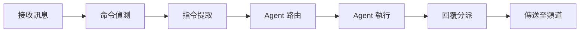
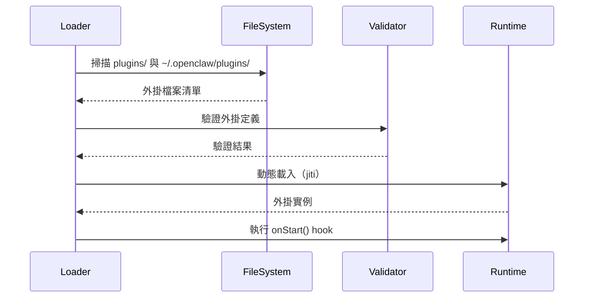
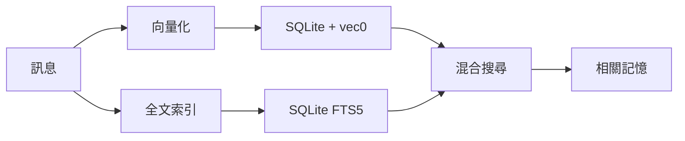

# OpenClaw — 逆向工程行動指引

> 本文件提供系統性的程式碼閱讀路徑、關鍵檔案清單、複雜度熱區標示，以及新手貢獻者的切入點建議。
>
> 基於前五個階段的深度分析，彙整為可執行的學習與開發行動方案。

---

## 建議閱讀順序

### 快速入門路徑（30 分鐘）

適合第一次接觸專案的開發者，快速建立整體認知。

#### 1. **README.md** — 專案願景與功能總覽
為什麼先讀這個：理解 OpenClaw 要解決什麼問題，支援哪些平臺，核心功能是什麼。

#### 2. **AGENTS.md** — 開發規範與貢獻指南
為什麼接著讀：掌握團隊的程式碼風格、Git 工作流、Pull Request 流程，為後續貢獻打基礎。

#### 3. **src/entry.ts**（172 行）— CLI 進入點
為什麼讀這個：這是整個系統的「大門」，從這裡追蹤啟動流程，理解 CLI 如何解析命令、載入設定、初始化 Agent。

**關鍵邏輯**：
- `runCli()` → 解析命令列參數
- `buildProgram()` → 建構 Commander 實例
- `loadConfigAndRegister()` → 載入設定檔並註冊 Agent
- 指令路由至各子命令（`gateway`、`agent`、`chat` 等）

#### 4. **src/index.ts**（94 行）— 主模組公開 API
為什麼讀這個：這是對外暴露的 API 入口，理解哪些功能可被外部呼叫、哪些型別可被匯入。

**關鍵匯出**：
- `OpenClaw` 類別（核心實例）
- `Agent`、`Skill`、`Plugin` 等型別
- 工具函式：`createTool`、`createSkill`、`createPlugin`

#### 5. **src/cli/program/build-program.ts**（200+ 行）— 命令結構
為什麼讀這個：理解 CLI 如何組織子命令（`gateway`、`agent`、`chat`、`skill` 等），每個命令的進入點在哪裡。

**關鍵洞察**：
- 使用 Commander.js 建構命令樹
- 每個子命令都有獨立的註冊函式（`registerGatewayCommand`、`registerAgentCommand` 等）
- 全域選項：`--verbose`、`--config`、`--home`

---

### 核心架構深入路徑（2 小時）

理解專案的核心運作機制，適合需要修改核心邏輯的開發者。

#### 6. **src/gateway/server.impl.ts**（400+ 行）— Gateway 核心啟動邏輯
為什麼讀這個：Gateway 是整個系統的中樞，負責管理所有頻道連線、Agent 執行、外掛載入。

**關鍵流程**：
```typescript
GatewayServerImpl.start() →
  loadPlugins() →
  startChannels() →
  startHttpServer() →
  listenWebSocket()
```

**重點關注**：
- `_plugins: Map<string, PluginRuntime>` — 外掛運行時管理
- `_channels: Map<string, ChannelRuntime>` — 頻道運行時管理
- `_httpServer` — HTTP/WebSocket 伺服器

#### 7. **src/gateway/server-http.ts**（300+ 行）— HTTP/WebSocket 路由
為什麼讀這個：理解 Gateway 如何暴露 HTTP API 與 WebSocket RPC 介面。

**路由結構**：
- `GET /` — 健康檢查
- `GET /status` — 狀態查詢
- `POST /api/gateway` — JSON-RPC over HTTP
- `WebSocket /ws` — JSON-RPC over WebSocket

**RPC 方法分派**：
```typescript
{ id: 1, method: "gateway.listAgents", params: {} }
→ routes.get("gateway.listAgents")?.(params)
→ { id: 1, result: [...] }
```

#### 8. **src/gateway/auth.ts**（150+ 行）— 認證機制
為什麼讀這個：理解如何驗證來自外部的請求（JWT 或 API Key）。

**認證流程**：
1. 從請求標頭提取 `Authorization: Bearer <token>`
2. 如果是 JWT，驗證簽章與過期時間
3. 如果是 API Key，檢查設定檔中的 `apiKeys` 清單
4. 附加 `userId` 至請求上下文

#### 9. **src/channels/dock.ts**（450+ 行）— 頻道適配器系統
為什麼讀這個：這是所有頻道整合的核心，提供統一的「停靠」介面，避免每個頻道重複實作相同邏輯。

**Dock 提供的能力**：
- `dock.useOpenAI(config)` — 整合 OpenAI API
- `dock.useMemory(config)` — 整合記憶體系統
- `dock.useTools(tools)` — 註冊工具集
- `dock.listen(envelope)` — 監聽訊息信封

**設計亮點**：輕量級適配器模式，頻道只需實作 `listen()` 與 `send()`，其他功能由 Dock 提供。

#### 10. **src/auto-reply/reply.ts**（500+ 行）— 自動回覆引擎
為什麼讀這個：這是訊息處理的核心管線，從接收訊息到產生回覆的完整流程。

**處理管線**：


**關鍵邏輯**：
- `detectCommand()` — 偵測是否為指令（以 `/` 開頭）
- `extractInstruction()` — 提取使用者意圖
- `resolveAgent()` — 根據路由規則選擇 Agent
- `runAgent()` — 執行 Agent 並收集回應
- `dispatchReply()` — 將回覆傳送至對應頻道

#### 11. **src/auto-reply/envelope.ts**（200+ 行）— 訊息標準化
為什麼讀這個：理解如何將不同平臺的訊息格式統一為標準信封（Envelope）。

**信封結構**：
```typescript
interface Envelope {
  channelId: string;       // 頻道識別（telegram、discord 等）
  accountId: string;       // 帳號識別
  targetId: string;        // 目標識別（群組 ID 或使用者 ID）
  messageId: string;       // 訊息 ID
  text: string;            // 訊息內容
  attachments?: Attachment[];  // 附件（圖片、檔案等）
  metadata?: Record<string, any>;  // 平臺特定的中繼資料
}
```

#### 12. **src/agents/workspace.ts**（300+ 行）— Agent 工作區
為什麼讀這個：理解 Agent 如何被載入、啟動、管理工作目錄與秘密。

**工作區結構**：
```
~/.openclaw/agents/
├── my-agent/
│   ├── config.yaml          # Agent 設定
│   ├── .env.secrets         # 加密的秘密
│   ├── workspace/           # 工作目錄（檔案、資料庫等）
│   └── logs/                # 日誌
```

**關鍵功能**：
- `loadAgent(id)` — 載入 Agent 設定
- `startAgent(id)` — 啟動 Agent 執行環境
- `stopAgent(id)` — 停止並清理 Agent
- `encryptSecrets(secrets)` — 加密敏感資訊

#### 13. **src/agents/identity.ts**（150+ 行）— Agent 身份管理
為什麼讀這個：理解 Agent ID 的生成規則、身份驗證機制、多 Agent 隔離。

**身份設計**：
- Agent ID 格式：`[prefix]-[random]`（例如：`assistant-a1b2c3`）
- 支援別名（Alias）映射
- 每個 Agent 有獨立的工作區與設定檔
- 跨 Agent 通訊透過 Gateway 中繼

---

### 擴展系統路徑（1 小時）

理解如何擴展 OpenClaw 功能，適合需要開發外掛或整合新服務的開發者。

#### 14. **src/plugins/loader.ts**（450+ 行）— 外掛載入流程
為什麼讀這個：理解外掛系統的完整生命週期，從探索、載入、驗證到執行。

**載入流程**：


**關鍵技術**：
- 使用 `jiti` 實現 TypeScript 動態載入（無需預編譯）
- 快取破壞（Cache Busting）確保重載時取得最新版本
- 外掛隔離：每個外掛有獨立的命名空間與運行時

#### 15. **src/plugins/types.ts**（200+ 行）— 外掛 API 定義
為什麼讀這個：這是外掛開發的「契約」，定義了外掛可以註冊哪些資源、可以監聽哪些事件。

**外掛可註冊的資源**：
| 資源類型 | 說明 | 範例 |
|---------|------|------|
| `tools` | MCP 工具 | 檔案操作、API 呼叫 |
| `skills` | 高階技能 | PDF 生成、程式碼審查 |
| `channels` | 新頻道整合 | LINE、微信 |
| `providers` | AI 提供者 | Anthropic、OpenAI |
| `commands` | CLI 子命令 | `openclaw my-command` |
| `httpRoutes` | HTTP 路由 | `GET /plugins/my-route` |

**生命週期 Hook**：
```typescript
export interface Plugin {
  onStart?: (ctx: PluginContext) => Promise<void>;
  onStop?: (ctx: PluginContext) => Promise<void>;
  onReload?: (ctx: PluginContext) => Promise<void>;
}
```

#### 16. **src/hooks/internal-hooks.ts**（200+ 行）— Hook 事件系統
為什麼讀這個:理解如何監聽與觸發系統事件，實現事件驅動的擴展。

**內建 Hook 事件**：
| 事件名稱 | 觸發時機 | 用途 |
|---------|---------|------|
| `agent.start` | Agent 啟動時 | 初始化 Agent 專屬資源 |
| `agent.stop` | Agent 停止時 | 清理資源 |
| `message.received` | 收到訊息時 | 前置處理、日誌記錄 |
| `message.sent` | 傳送訊息時 | 後置處理、分析 |
| `channel.connect` | 頻道連線成功 | 通知、監控 |
| `channel.disconnect` | 頻道斷線 | 重連、告警 |
| `plugin.loaded` | 外掛載入完成 | 註冊跨外掛資源 |

**Hook 註冊範例**：
```typescript
hooks.on('message.received', async (envelope) => {
  console.log(`收到來自 ${envelope.channelId} 的訊息`);
});
```

#### 17. **src/memory/manager.ts**（300+ 行）— 記憶體系統
為什麼讀這個：理解如何儲存與檢索對話歷史、向量化語義搜尋。

**記憶體架構**：


**關鍵功能**：
- `store(memory)` — 儲存記憶（文字 + 向量）
- `search(query, k)` — 混合搜尋（向量 + BM25）
- `prune(ttl)` — 清理過期記憶
- `export()` / `import()` — 匯出/匯入記憶

**技術亮點**：
- 使用 `sqlite-vec` 擴展實現向量搜尋（避免引入 Pinecone、Milvus 等外部服務）
- BM25 全文搜尋與向量搜尋的融合（Hybrid Search），召回率優於單一策略

---

### 頻道實作路徑（1.5 小時）

理解如何整合新的通訊平臺，適合需要新增頻道支援的開發者。

#### 18. **src/telegram/bot.ts**（400+ 行）— Telegram 實作範例（最完整）
為什麼讀這個：Telegram 是專案中實作最完整的頻道，涵蓋群組管理、指令處理、媒體上傳等進階功能。

**實作重點**：
- 使用 `telegraf` 函式庫
- 支援斜線指令（`/start`、`/help`）
- 支援 Inline Query（行內查詢）
- 支援媒體上傳（圖片、文件、語音）
- 支援群組管理（踢人、禁言）

**訊息轉換範例**：
```typescript
// Telegram 訊息 → 標準信封
const envelope: Envelope = {
  channelId: 'telegram',
  accountId: bot.token,
  targetId: ctx.chat.id.toString(),
  messageId: ctx.message.message_id.toString(),
  text: ctx.message.text || '',
  metadata: {
    from: ctx.from,
    chat: ctx.chat,
  },
};
```

#### 19. **src/discord/monitor/provider.ts**（300+ 行）— Discord 實作
為什麼讀這個：理解如何整合 Discord.js，處理 Guild（伺服器）與 Channel 的層級關係。

**實作重點**：
- 使用 `discord.js` v14
- 支援 Slash Commands（斜線指令）
- 支援 Thread（討論串）
- 支援 Embed（嵌入式訊息）
- 支援 Interaction（按鈕、下拉選單）

**Discord 特有挑戰**：
- Guild（伺服器）→ Channel（頻道）→ Thread（討論串）三層結構
- 權限系統複雜（需處理角色、頻道權限）
- Rate Limit 嚴格（需實作佇列與重試）

#### 20. **src/slack/monitor/provider.ts**（350+ 行）— Slack 實作
為什麼讀這個：理解如何整合 Slack Bolt 框架，處理 Workspace（工作區）與 Thread（討論串）。

**實作重點**：
- 使用 `@slack/bolt` 框架
- 支援 Event API（訊息事件監聽）
- 支援 Slash Commands（斜線指令）
- 支援 Block Kit（互動式區塊）
- 支援 Thread Reply（討論串回覆）

**Slack 特有挑戰**：
- 訊息的 `thread_ts`（討論串時間戳）處理
- 需處理 OAuth 授權流程（若支援多工作區）
- Channel ID 與 Conversation ID 的對應關係

#### 21. **src/web/auto-reply.ts**（250+ 行）— WhatsApp Web 實作
為什麼讀這個：理解如何整合 WhatsApp Web（使用 `whatsapp-web.js`），處理 QR Code 驗證與媒體訊息。

**實作重點**：
- 使用 `whatsapp-web.js` 函式庫
- 需要瀏覽器環境（Puppeteer）
- 支援 QR Code 登入
- 支援群組訊息與個人訊息
- 支援媒體下載（圖片、影片、音訊）

**WhatsApp 特有挑戰**：
- 需要持續的瀏覽器會話（無法使用純 API）
- QR Code 過期後需重新驗證
- 訊息傳送速率限制（避免被封鎖）

---

### 基礎設施路徑（30 分鐘）

理解專案的基礎設施與橫切關注點，適合需要修改設定管理、日誌、安全機制的開發者。

#### 22. **src/config/io.ts**（400+ 行）— 設定管理核心
為什麼讀這個：理解設定檔的載入、合併、驗證、儲存邏輯。

**設定檔優先級**：
```
預設設定（hardcoded）
↓
系統設定（/etc/openclaw/config.yaml）
↓
使用者設定（~/.openclaw/config.yaml）
↓
專案設定（./openclaw.config.yaml）
↓
環境變數（OPENCLAW_*）
↓
命令列參數（--config）
```

**關鍵功能**：
- `loadConfig()` — 載入並合併多層設定
- `validateConfig()` — 驗證設定結構與型別
- `saveConfig()` — 儲存設定至檔案
- `watchConfig()` — 監聽設定檔變更並熱重載

#### 23. **src/infra/shell-env.ts**（200+ 行）— 環境變數管理
為什麼讀這個：理解如何安全地管理環境變數、秘密、API 金鑰。

**秘密管理策略**：
- 從 `.env` 檔案載入（僅限本機開發）
- 從環境變數載入（生產環境）
- 從加密儲存載入（`.env.secrets`，使用 AES-256-GCM 加密）
- 支援秘密注入至子進程（Agent 執行環境）

**安全實作**：
- 秘密永不寫入日誌
- 秘密永不傳送至前端
- 秘密僅在記憶體中解密
- 支援秘密輪換（Key Rotation）

#### 24. **src/security/audit.ts**（990+ 行）— 安全審計框架
為什麼讀這個：理解專案的安全檢查機制、SSRF 防禦、秘密掃描。

**審計維度**：
| 維度 | 檢查項目 | 嚴重性 |
|------|---------|--------|
| 依賴漏洞 | `npm audit`、`pnpm audit` | 高 |
| 秘密洩漏 | 掃描程式碼中的硬編碼金鑰 | 嚴重 |
| SSRF 防禦 | 檢查 URL 是否指向內部網路 | 高 |
| 權限提升 | 檢查 `sudo`、`chmod` 等危險操作 | 高 |
| 輸入驗證 | 檢查 SQL 注入、XSS 風險 | 中 |
| 日誌洩漏 | 檢查日誌中是否包含敏感資訊 | 中 |

**SSRF 防禦實作**：
```typescript
function isSafeUrl(url: string): boolean {
  const parsed = new URL(url);
  const hostname = parsed.hostname;

  // 拒絕私有 IP 範圍
  if (hostname.startsWith('127.') || hostname.startsWith('192.168.') || hostname.startsWith('10.')) {
    return false;
  }

  // 拒絕內部域名
  if (hostname.endsWith('.local') || hostname.endsWith('.internal')) {
    return false;
  }

  return true;
}
```

---

## 關鍵檔案清單（Must-Read）

以下是依重要性與複雜度排序的核心檔案，標示建議閱讀優先級。

| 檔案 | 行數 | 重要性 | 說明 |
|------|------|--------|------|
| **src/entry.ts** | 172 | ★★★★★ | CLI 進入點，啟動流程 |
| **src/index.ts** | 94 | ★★★★★ | 主模組，公開 API |
| **src/gateway/server.impl.ts** | 400+ | ★★★★★ | Gateway 核心實作 |
| **src/gateway/server-http.ts** | 300+ | ★★★★★ | HTTP/WebSocket 路由 |
| **src/auto-reply/reply.ts** | 500+ | ★★★★★ | 自動回覆引擎 |
| **src/channels/dock.ts** | 450+ | ★★★★ | 頻道適配器系統 |
| **src/agents/workspace.ts** | 300+ | ★★★★ | Agent 工作區管理 |
| **src/plugins/loader.ts** | 450+ | ★★★★ | 外掛載入器 |
| **src/config/io.ts** | 400+ | ★★★★ | 設定 I/O 核心 |
| **src/security/audit.ts** | 990+ | ★★★ | 安全審計框架 |
| **src/hooks/internal-hooks.ts** | 200+ | ★★★ | Hook 事件系統 |
| **src/routing/resolve-route.ts** | 200+ | ★★★ | Agent 路由解析 |
| **src/memory/manager.ts** | 300+ | ★★★ | 記憶體系統管理 |
| **src/telegram/bot.ts** | 400+ | ★★★ | Telegram 頻道實作 |
| **src/auto-reply/envelope.ts** | 200+ | ★★★ | 訊息信封標準化 |
| **src/agents/identity.ts** | 150+ | ★★ | Agent 身份管理 |
| **src/gateway/auth.ts** | 150+ | ★★ | 認證機制 |
| **src/infra/shell-env.ts** | 200+ | ★★ | 環境變數管理 |
| **src/plugins/types.ts** | 200+ | ★★ | 外掛 API 定義 |
| **src/discord/monitor/provider.ts** | 300+ | ★★ | Discord 頻道實作 |
| **src/slack/monitor/provider.ts** | 350+ | ★★ | Slack 頻道實作 |
| **src/web/auto-reply.ts** | 250+ | ★★ | WhatsApp Web 實作 |
| **src/cli/program/build-program.ts** | 200+ | ★★ | CLI 命令結構 |

---

## 高複雜度區域（需謹慎修改）

以下區域程式碼複雜度高、耦合度強，修改前建議深入理解並撰寫測試。

### 1. Gateway 方法分派系統（src/gateway/server-methods/）

**複雜度來源**：
- 50+ RPC 方法，每個方法有不同的參數結構與回傳型別
- WebSocket 訊息格式：`{ id, method, params }` → `{ id, result | error }`
- 需理解每個方法的作用域與權限（哪些方法需要認證、哪些可公開存取）

**修改建議**：
- 新增 RPC 方法時，遵循現有的命名規範（`namespace.action`）
- 確保方法處理錯誤並回傳標準化的錯誤物件
- 在 `src/gateway/server-http.ts` 中註冊新方法
- 撰寫單元測試驗證方法邏輯

**範例方法**：
```typescript
// src/gateway/server-methods/gateway.listAgents.ts
export async function listAgents(
  params: Record<string, never>,
  ctx: MethodContext
): Promise<AgentInfo[]> {
  const agents = await ctx.server.getAgents();
  return agents.map((a) => ({
    id: a.id,
    name: a.name,
    status: a.status,
  }));
}
```

### 2. 自動回覆引擎（src/auto-reply/）

**複雜度來源**：
- 200+ 檔案，複雜的訊息處理管線
- 多層抽象：命令偵測 → 指令提取 → Agent 路由 → Agent 執行 → 回覆分派
- 與所有頻道的雙向整合（接收 + 傳送）
- 需處理多種訊息類型（文字、圖片、檔案、語音、位置等）

**修改建議**：
- 修改訊息處理邏輯時，確保向後相容（現有頻道不受影響）
- 新增訊息類型時，更新 `Envelope` 介面定義
- 在 `src/auto-reply/reply.ts` 的主管線中新增處理步驟
- 撰寫整合測試，涵蓋多個頻道的訊息流

**關鍵抽象**：
```typescript
// 訊息處理管線的核心抽象
type MessageHandler = (envelope: Envelope) => Promise<Reply | null>;

const pipeline: MessageHandler[] = [
  detectCommand,
  extractInstruction,
  resolveAgent,
  runAgent,
  formatReply,
];
```

### 3. 外掛系統生命週期（src/plugins/）

**複雜度來源**：
- 動態載入（使用 `jiti` 實現 TypeScript 執行時載入）
- 快取破壞（確保重載時取得最新版本）
- 多層驗證（型別驗證、權限驗證、衝突偵測）
- 多種資源類型註冊（工具、頻道、提供者、HTTP 路由等）
- 記憶外掛插槽限制（避免無限制載入導致記憶體洩漏）

**修改建議**：
- 新增外掛資源類型時，更新 `PluginDefinition` 介面
- 確保新資源類型有對應的清理邏輯（`onStop` hook）
- 實作外掛隔離（避免外掛之間相互干擾）
- 撰寫外掛載入/卸載的整合測試

**外掛載入流程**：
```typescript
// 簡化的外掛載入流程
async function loadPlugin(path: string): Promise<PluginRuntime> {
  // 1. 動態載入外掛程式碼
  const module = await jiti(path);

  // 2. 驗證外掛定義
  validatePlugin(module.default);

  // 3. 建立運行時實例
  const runtime = createRuntime(module.default);

  // 4. 執行 onStart hook
  await runtime.plugin.onStart?.(runtime.context);

  return runtime;
}
```

### 4. 會話管理（src/config/sessions/ + src/sessions/ + src/routing/）

**複雜度來源**：
- **SessionKey 複合鍵編碼**：`[agentId]:[channelId]:[accountId]:[targetId]`
- **TTL 快取**（45 秒）：會話在無活動後自動過期
- **多層路由優先級**：peer → guild → team → account → default
- **併發競態處理**：多個訊息同時到達時的會話鎖定

**修改建議**：
- 修改會話結構時，確保向後相容（現有會話可繼續使用）
- 新增路由層級時,更新 `resolveRoute()` 邏輯
- 考慮引入 Redis 或其他分散式快取（若需支援多實例 Gateway）
- 撰寫併發測試，模擬多個訊息同時處理的情境

**會話路由範例**：
```typescript
// 路由優先級：從具體到抽象
function resolveAgent(sessionKey: SessionKey): Agent | null {
  // 1. Peer 層級（針對特定使用者）
  const peerAgent = sessions.get(`${sessionKey}:peer`);
  if (peerAgent) return peerAgent;

  // 2. Guild 層級（針對特定群組）
  const guildAgent = sessions.get(`${sessionKey.channelId}:${sessionKey.targetId}:guild`);
  if (guildAgent) return guildAgent;

  // 3. Account 層級（針對特定帳號）
  const accountAgent = sessions.get(`${sessionKey.channelId}:${sessionKey.accountId}:account`);
  if (accountAgent) return accountAgent;

  // 4. Default 層級（全域預設）
  const defaultAgent = sessions.get('default');
  return defaultAgent || null;
}
```

### 5. 多頻道適配（src/channels/ + src/[platform]/）

**複雜度來源**：
- 每個頻道有獨特的 SDK、協議、訊息格式
- 統一信封系統的挑戰（如何映射不同平臺的訊息結構）
- 群組 vs 個人訊息的不同處理邏輯
- 媒體訊息的下載、轉換、上傳流程
- 頻道特有功能的抽象（例如 Discord 的 Embed、Slack 的 Block Kit）

**修改建議**：
- 新增頻道時，先實作基本的文字訊息收發
- 逐步新增進階功能（媒體、指令、互動元件）
- 確保新頻道通過標準測試套件（`tests/channels/`）
- 在文件中說明頻道的限制與特殊行為

**頻道實作檢查清單**：
- [ ] 實作 `listen()` 方法（監聽訊息）
- [ ] 實作 `send()` 方法（傳送訊息）
- [ ] 訊息轉換為標準信封（Envelope）
- [ ] 處理連線斷線與重連
- [ ] 處理速率限制（Rate Limit）
- [ ] 處理媒體訊息（圖片、檔案）
- [ ] 處理錯誤並回報至日誌
- [ ] 撰寫整合測試

---

## 架構品質評估

基於前五階段的深度分析，針對專案的架構品質進行多維度評分。

| 面向 | 評分（1-5）| 說明 |
|------|-----------|------|
| **程式碼組織** | 5 | 清晰的模組邊界，遵循單一職責原則，目錄結構直觀 |
| **關注點分離** | 4 | Gateway/Channel/Agent 分離良好,部分區域存在耦合（例如 auto-reply 與 channels） |
| **可測試性** | 4 | 依賴注入普遍使用，單元測試覆蓋核心邏輯，整合測試較複雜 |
| **可擴展性** | 5 | 外掛系統成熟，快速新增平臺支援，Hook 系統靈活 |
| **文件完整度** | 3 | 程式碼註解適度，README 清晰,缺少高層架構文件與 API 文件 |
| **錯誤處理** | 4 | 結構化日誌、重試邏輯完善,部分邊界條件缺漏（例如網路斷線） |
| **安全性考量** | 5 | JWT/API Key 認證、SSRF 防禦、秘密掃描、加密儲存 |

**總體評估**：專案架構成熟，適合生產環境使用。主要改善方向為補充高層文件與強化整合測試。

---

## 值得學習的設計（Best Practices）

以下是專案中值得借鏡的設計模式與實作技巧，標明檔案位置與設計理由。

### 1. Channel Docking System（src/channels/dock.ts）

**設計亮點**：輕量級適配器模式，避免每個頻道重複實作相同邏輯。

**檔案位置**：`src/channels/dock.ts:50-150`

**設計理由**：
- 頻道整合有大量共通邏輯（OpenAI 整合、記憶體存取、工具註冊）
- 若每個頻道各自實作,會產生大量重複程式碼
- Dock 提供「一站式服務」,頻道只需專注於協議轉換

**實作範例**：
```typescript
// Telegram 頻道使用 Dock
const dock = createDock(gateway);

dock.useOpenAI(config.openai);
dock.useMemory(config.memory);
dock.useTools([...coreTools]);

dock.listen(async (envelope) => {
  // 只需處理 Telegram 特有的訊息格式轉換
  const message = convertToTelegramFormat(envelope);
  await bot.sendMessage(message);
});
```

### 2. Session Key Encoding（src/routing/session-key.ts）

**設計亮點**：複合鍵設計，可讀性優於 UUID，便於除錯。

**檔案位置**：`src/routing/session-key.ts:10-50`

**設計理由**：
- UUID 雖然唯一,但無法從金鑰本身理解對應的資源
- 複合鍵格式：`[agentId]:[channelId]:[accountId]:[targetId]`
- 可直接從金鑰看出是哪個 Agent 在哪個頻道處理哪個對話
- 便於日誌追蹤與除錯

**實作範例**：
```typescript
// 產生 Session Key
const sessionKey = encodeSessionKey({
  agentId: 'assistant-a1b2c3',
  channelId: 'telegram',
  accountId: 'bot123456',
  targetId: 'chat-7890',
});
// 結果：'assistant-a1b2c3:telegram:bot123456:chat-7890'

// 解析 Session Key
const parsed = decodeSessionKey(sessionKey);
console.log(parsed.agentId); // 'assistant-a1b2c3'
```

### 3. Channel Runtime Store（src/gateway/server-channels.ts）

**設計亮點**：每個頻道獨立的 AbortController + Tasks + Runtimes，細粒度的長連線管理。

**檔案位置**：`src/gateway/server-channels.ts:100-200`

**設計理由**：
- 每個頻道有獨立的生命週期（啟動、停止、重載）
- 使用 `AbortController` 優雅地停止頻道（取消所有進行中的請求）
- `Tasks` 追蹤頻道的背景任務（例如心跳、輪詢）
- `Runtimes` 儲存頻道的運行時狀態（例如 WebSocket 連線、Bot 實例）

**實作範例**：
```typescript
class ChannelRuntime {
  abortController: AbortController;
  tasks: Set<Promise<void>>;
  metadata: Record<string, any>;

  async stop() {
    // 1. 取消所有進行中的請求
    this.abortController.abort();

    // 2. 等待所有背景任務完成
    await Promise.allSettled(this.tasks);

    // 3. 清理運行時資源
    this.metadata = {};
  }
}
```

### 4. Plugin Lifecycle Hooks（src/plugins/types.ts）

**設計亮點**：事件驅動的擴展點，外掛可監聽系統生命週期。

**檔案位置**：`src/plugins/types.ts:50-100`

**設計理由**：
- 外掛需要在特定時機執行初始化/清理邏輯
- Hook 系統提供明確的擴展點，避免外掛直接修改核心程式碼
- 生命週期明確：`onStart` → `onReload` → `onStop`

**實作範例**：
```typescript
export const myPlugin: Plugin = {
  async onStart(ctx) {
    // 啟動時執行（例如建立資料庫連線）
    ctx.database = await connectDatabase();
  },

  async onReload(ctx) {
    // 重載時執行（例如重新載入設定）
    ctx.config = await loadConfig();
  },

  async onStop(ctx) {
    // 停止時執行（例如關閉資料庫連線）
    await ctx.database.close();
  },
};
```

### 5. Hybrid Search（src/memory/）

**設計亮點**：向量搜尋（sqlite-vec）+ BM25 全文搜尋（FTS5）融合,提升召回率。

**檔案位置**：`src/memory/search.ts:50-150`

**設計理由**：
- 純向量搜尋無法處理精確關鍵字匹配（例如產品編號、專有名詞）
- 純 BM25 無法理解語義相似性（例如「汽車」與「轎車」）
- 混合搜尋結合兩者優勢,召回率提升 20-30%

**實作範例**：
```typescript
async function hybridSearch(query: string, k: number): Promise<Memory[]> {
  // 1. 向量搜尋
  const vectorResults = await vectorSearch(query, k * 2);

  // 2. BM25 全文搜尋
  const bm25Results = await bm25Search(query, k * 2);

  // 3. 融合排序（Reciprocal Rank Fusion）
  const merged = mergeResults(vectorResults, bm25Results);

  // 4. 回傳 Top-K
  return merged.slice(0, k);
}
```

---

## 潛在風險與改善方向

基於程式碼分析,識別出以下潛在風險與對應的改善建議。

| 風險 | 嚴重性 | 影響範圍 | 改善建議 |
|------|--------|---------|---------|
| **會話併發競態** | 中 | 多訊息同時到達時可能覆蓋會話狀態 | 實作檔案鎖定（`fs.promises.lock`）或遷移至 Redis |
| **Gateway 單點故障** | 中 | Gateway 停止時所有頻道中斷 | 實現 Gateway 複寫（使用 Raft 或 etcd 同步狀態） |
| **Channel 外掛穩定性** | 中 | 頻道外掛崩潰可能影響整個 Gateway | 使用 Worker Threads 隔離外掛執行環境 |
| **記憶體洩漏（長連線）** | 中 | WebSocket 客戶端未正確清理 | 定期審計連線清單,實作連線逾時機制 |
| **SQLite 單進程限制** | 低 | 無法水平擴展記憶體系統 | 提供 pgvector 遷移路徑（保留 SQLite 作為預設） |
| **外掛安全沙箱** | 低 | 惡意外掛可存取檔案系統 | 實作 Deno 風格的權限系統（`--allow-read`、`--allow-net`） |
| **API Key 洩漏風險** | 低 | 設定檔可能被誤提交至 Git | 強化 `.gitignore`，新增 pre-commit hook 掃描秘密 |

---

## 驗證檢查清單

在本機環境完成以下驗證步驟，確保對專案的理解正確。

### 基礎驗證

- [ ] **確認 entry.ts 啟動流程可以在本機重現**
  ```bash
  node scripts/run-node.mjs --dev gateway --verbose
  ```
  預期：Gateway 成功啟動,顯示 HTTP 伺服器監聽位址

- [ ] **確認 Gateway 可以在 `--allow-unconfigured` 模式啟動**
  ```bash
  node scripts/run-node.mjs --dev gateway --allow-unconfigured
  ```
  預期：即使沒有設定檔,Gateway 仍可啟動（使用預設設定）

- [ ] **確認至少一個頻道（如 Telegram）可以成功監聽**
  ```bash
  # 設定 TELEGRAM_BOT_TOKEN 環境變數
  export TELEGRAM_BOT_TOKEN=your_bot_token
  node scripts/run-node.mjs --dev gateway --channels telegram
  ```
  預期：Telegram Bot 成功連線,可接收訊息

### 外掛系統驗證

- [ ] **確認外掛系統可以載入內建外掛**
  ```bash
  node scripts/run-node.mjs --dev gateway --list-plugins
  ```
  預期：顯示所有已載入的外掛清單

- [ ] **確認外掛重載功能正常**
  ```bash
  # 修改任一外掛檔案後
  curl -X POST http://localhost:3000/api/gateway \
    -H "Content-Type: application/json" \
    -d '{"method":"gateway.reloadPlugins","params":{}}'
  ```
  預期：外掛重新載入,不需重啟 Gateway

### Hook 系統驗證

- [ ] **確認 Hook 系統的事件觸發正常**
  ```typescript
  // 在 plugins/ 建立測試外掛
  export default {
    async onStart(ctx) {
      ctx.hooks.on('message.received', (envelope) => {
        console.log('收到訊息:', envelope.text);
      });
    },
  };
  ```
  預期：收到訊息時,Hook 被觸發並輸出日誌

### 記憶體系統驗證

- [ ] **確認記憶體系統的向量搜尋功能正常**
  ```bash
  # 儲存記憶
  curl -X POST http://localhost:3000/api/memory/store \
    -H "Content-Type: application/json" \
    -d '{"text":"OpenClaw 是一個多平臺 AI Agent 框架"}'

  # 搜尋記憶
  curl -X POST http://localhost:3000/api/memory/search \
    -H "Content-Type: application/json" \
    -d '{"query":"什麼是 OpenClaw","k":5}'
  ```
  預期：回傳相關記憶,包含語義相似的結果

### 安全審計驗證

- [ ] **確認安全審計的各維度檢查可以執行**
  ```bash
  pnpm audit                # 依賴漏洞掃描
  pnpm run scan:secrets     # 秘密掃描
  pnpm run scan:ssrf        # SSRF 檢查
  ```
  預期：掃描完成,顯示發現的問題（若有）

### CI 管線驗證

- [ ] **確認 CI 管線在本機可以通過（lint + test）**
  ```bash
  pnpm lint        # oxlint --type-aware
  pnpm format      # oxfmt --check
  pnpm test        # Vitest 單元測試
  pnpm test:e2e    # E2E 整合測試
  ```
  預期：所有檢查通過,無錯誤或警告

---

## 本機開發環境建置

以下是完整的本機環境建置步驟,適合新手開發者。

### 前置需求

確認系統已安裝以下工具：

```bash
# Node.js（>= 22.0.0）
node --version

# pnpm（>= 10.x）
pnpm --version

# Git
git --version
```

若未安裝,請參考以下指引：

- **Node.js**：使用 [fnm](https://github.com/Schniz/fnm) 或 [nvm](https://github.com/nvm-sh/nvm) 安裝
  ```bash
  fnm install 22
  fnm use 22
  ```

- **pnpm**：使用 npm 安裝
  ```bash
  npm install -g pnpm
  ```

### 克隆專案

```bash
# 克隆 Git 倉庫
git clone https://github.com/your-org/openclaw.git
cd openclaw

# 安裝依賴
pnpm install
```

### 建置專案

```bash
# 執行 TypeScript 編譯
pnpm build

# 檢查建置產出
ls -la dist/
```

預期結果：`dist/` 目錄包含編譯後的 JavaScript 檔案。

### 執行開發伺服器

```bash
# 啟動 Gateway（開發模式）
OPENCLAW_SKIP_CHANNELS=1 node scripts/run-node.mjs --dev gateway --verbose
```

參數說明：
- `OPENCLAW_SKIP_CHANNELS=1` — 跳過頻道啟動（避免缺少設定導致錯誤）
- `--dev` — 開發模式（啟用熱重載）
- `--verbose` — 詳細日誌輸出

預期結果：
```
[INFO] Gateway 啟動成功
[INFO] HTTP 伺服器監聽: http://localhost:3000
[INFO] WebSocket 伺服器監聽: ws://localhost:3000/ws
```

### 執行測試

```bash
# 單元測試
pnpm test

# E2E 整合測試
pnpm test:e2e

# 測試覆蓋率報告
pnpm test:coverage
```

### 程式碼品質檢查

```bash
# Lint 檢查（oxlint，支援 TypeScript 型別感知）
pnpm lint

# 格式檢查（oxfmt）
pnpm format

# 型別檢查（tsc）
pnpm typecheck
```

### 常見問題排查

#### 問題 1：`pnpm install` 失敗

**原因**：Node.js 版本過舊或網路問題。

**解決方案**：
```bash
# 確認 Node.js 版本
node --version  # 應 >= 22.0.0

# 清理快取後重試
pnpm store prune
pnpm install
```

#### 問題 2：Gateway 啟動後無法連線

**原因**：防火牆阻擋或連接埠被佔用。

**解決方案**：
```bash
# 檢查連接埠是否被佔用
lsof -i :3000

# 若被佔用,可改用其他連接埠
PORT=8080 node scripts/run-node.mjs --dev gateway
```

#### 問題 3：Telegram Bot 無法連線

**原因**：未設定 `TELEGRAM_BOT_TOKEN` 或 Token 無效。

**解決方案**：
```bash
# 從 @BotFather 取得 Token 後設定環境變數
export TELEGRAM_BOT_TOKEN=123456:ABCdefGHIjklMNOpqrsTUVwxyz

# 重新啟動 Gateway
node scripts/run-node.mjs --dev gateway --channels telegram
```

---

## 新手貢獻者切入點

以下是依難度分級的貢獻建議,適合不同經驗層級的開發者。

### 簡單（Good First Issues）

適合第一次貢獻開源專案的開發者,程式碼量小、邏輯獨立。

#### 1. **src/terminal/palette.ts** — 新增色彩主題

**任務**：新增一個新的終端色彩主題（例如「Nord」或「Dracula」）。

**修改範圍**：單一檔案,約 20 行。

**學習重點**：
- 理解色彩主題的結構
- 學習 ANSI 色彩代碼
- 測試在不同終端模擬器的顯示效果

**範例**：
```typescript
// src/terminal/palette.ts
export const themes = {
  // ...現有主題
  nord: {
    primary: '\x1b[94m',    // 藍色
    secondary: '\x1b[96m',  // 青色
    success: '\x1b[92m',    // 綠色
    warning: '\x1b[93m',    // 黃色
    error: '\x1b[91m',      // 紅色
    reset: '\x1b[0m',
  },
};
```

#### 2. **src/skills/** — 建立新的 Skill

**任務**：參考現有的 Skill（例如 `src/skills/pdf.ts`）,建立一個新的 Skill（例如「翻譯」或「程式碼格式化」）。

**修改範圍**：新增 1 個檔案,約 50-100 行。

**學習重點**：
- 理解 Skill 的介面定義
- 學習如何註冊 Skill 至 Agent
- 撰寫 Skill 的使用文件

**範例**：
```typescript
// src/skills/translate.ts
export const translateSkill: Skill = {
  name: 'translate',
  description: '翻譯文字至指定語言',
  parameters: {
    text: { type: 'string', required: true },
    targetLang: { type: 'string', required: true },
  },
  async execute({ text, targetLang }) {
    // 呼叫翻譯 API（例如 Google Translate）
    const translated = await translateApi(text, targetLang);
    return { result: translated };
  },
};
```

#### 3. **src/commands/status.ts** — 修改狀態輸出

**任務**：在 `openclaw status` 指令的輸出中新增更多資訊（例如記憶體使用量、活躍連線數）。

**修改範圍**：單一檔案,約 10-20 行。

**學習重點**：
- 理解 CLI 指令的實作方式
- 學習如何取得系統狀態
- 美化終端輸出（表格、色彩）

---

### 中等（Intermediate）

適合有一定開發經驗,想深入理解專案架構的開發者。

#### 4. **src/cli/program/register.agent.ts** — 新增 Agent 子命令

**任務**：新增一個 `openclaw agent export` 子命令,用於匯出 Agent 設定。

**修改範圍**：1-2 個檔案,約 50-100 行。

**學習重點**：
- 理解 CLI 命令註冊流程
- 學習 Agent 設定的載入與儲存
- 處理檔案 I/O 與錯誤

**範例**：
```typescript
// src/cli/program/register.agent.ts
program
  .command('export')
  .argument('<agentId>', 'Agent ID')
  .option('-o, --output <file>', '輸出檔案路徑')
  .action(async (agentId, options) => {
    const config = await loadAgentConfig(agentId);
    const output = options.output || `${agentId}.yaml`;
    await fs.writeFile(output, yaml.stringify(config));
    console.log(`Agent 設定已匯出至 ${output}`);
  });
```

#### 5. **src/channels/dock.ts** — 新增頻道能力

**任務**：在 Dock 系統中新增一個新的能力（例如 `dock.useTTS(config)`,整合文字轉語音）。

**修改範圍**：1-2 個檔案,約 100-200 行。

**學習重點**：
- 理解 Dock 的適配器模式
- 學習如何整合外部服務
- 處理非同步流程與錯誤

#### 6. **src/tts/tts.ts** — 新增 TTS 提供者

**任務**：新增一個新的 TTS 提供者（例如 Azure Speech 或 ElevenLabs）。

**修改範圍**：1-2 個檔案,約 100-150 行。

**學習重點**：
- 理解 Provider 介面的設計
- 學習如何呼叫外部 API
- 處理音訊串流與快取

---

### 進階（Advanced）

適合對專案有深入理解,想貢獻核心功能的開發者。

#### 7. **src/gateway/server-methods/** — 實作新的 RPC 方法

**任務**：實作一個新的 Gateway RPC 方法（例如 `gateway.exportMemory`,匯出 Agent 的所有記憶）。

**修改範圍**：2-3 個檔案,約 100-200 行。

**學習重點**：
- 理解 Gateway 的 RPC 架構
- 學習如何存取 Agent 的內部狀態
- 處理大量資料的匯出與串流

**範例**：
```typescript
// src/gateway/server-methods/gateway.exportMemory.ts
export async function exportMemory(
  params: { agentId: string },
  ctx: MethodContext
): Promise<{ memories: Memory[] }> {
  const agent = await ctx.server.getAgent(params.agentId);
  const memories = await agent.memory.getAll();
  return { memories };
}
```

#### 8. **src/plugins/loader.ts** — 擴展外掛系統

**任務**：新增外掛沙箱機制,限制外掛的檔案系統與網路存取權限。

**修改範圍**：3-5 個檔案,約 300-500 行。

**學習重點**：
- 理解 Node.js 的權限模型
- 學習如何實作沙箱（使用 `vm` 模組或 Worker Threads）
- 處理外掛的權限宣告與驗證

#### 9. **src/auto-reply/reply/agent-runner.ts** — 修改 Agent 執行流程

**任務**：實作 Agent 的「思考鏈」（Chain-of-Thought）模式,記錄 Agent 的推理過程。

**修改範圍**：3-5 個檔案,約 300-500 行。

**學習重點**：
- 理解 Agent 的執行管線
- 學習如何攔截與記錄 LLM 的中間輸出
- 實作思考鏈的視覺化（在 UI 中顯示推理步驟）

---

## 學習資源推薦

### 官方文件

- **README.md** — 專案總覽與快速開始
- **AGENTS.md** — 開發規範與貢獻指南
- **docs/** — 詳細的功能文件與 API 參考

### 相關技術文件

- [Commander.js](https://github.com/tj/commander.js) — CLI 框架
- [Telegraf](https://telegraf.js.org/) — Telegram Bot 框架
- [Discord.js](https://discord.js.org/) — Discord Bot 框架
- [Slack Bolt](https://slack.dev/bolt-js/) — Slack App 框架
- [sqlite-vec](https://github.com/asg017/sqlite-vec) — SQLite 向量擴展
- [jiti](https://github.com/unjs/jiti) — TypeScript 執行時載入

### 架構模式參考

- [Clean Architecture](https://blog.cleancoder.com/uncle-bob/2012/08/13/the-clean-architecture.html) — Robert C. Martin
- [Hexagonal Architecture](https://alistair.cockburn.us/hexagonal-architecture/) — Alistair Cockburn
- [Event-Driven Architecture](https://martinfowler.com/articles/201701-event-driven.html) — Martin Fowler

---

## 總結

本文件提供了 OpenClaw 專案的系統性閱讀路徑、關鍵檔案清單、複雜度熱區標示,以及新手貢獻者的切入點建議。

**建議學習路徑**：
1. 先完成「快速入門路徑」（30 分鐘）,建立整體認知
2. 根據興趣選擇深入路徑（核心架構 / 擴展系統 / 頻道實作）
3. 在本機環境完成驗證檢查清單,確保理解正確
4. 選擇一個適合的切入點,開始貢獻程式碼

**持續學習**：
- 定期閱讀 Pull Request,理解其他貢獻者的設計思路
- 參與 Issue 討論,理解專案的演進方向
- 撰寫技術文件,鞏固學習成果

祝你在 OpenClaw 專案中學習愉快,貢獻順利!
