# OpenClaw 記憶體機制探索報告

> **Phase 1：Memory Mechanism Discovery**
> 文件版本：1.0
> 分析日期：2026-02-08
> 分析範圍：OpenClaw Memory 子系統完整原始碼

---

## 執行摘要

OpenClaw 的 Memory（記憶體）子系統是一套混合式語意搜尋引擎，負責將使用者的工作空間 Markdown 檔案與會話紀錄轉化為可被 AI Agent 即時檢索的向量索引。整個子系統位於 `src/memory/` 目錄下，共 43 個 TypeScript 檔案（含 11 個測試檔），核心管理器 `manager.ts` 達 2,400+ 行，是專案中最複雜的單一模組之一。

Memory 的設計理念是「讓 AI 記住使用者過去的工作內容」，透過 Embedding 向量化、FTS5 全文檢索、BM25 排名的混合搜尋策略，使 Agent 在對話時能自動回憶先前的決策、偏好、待辦事項與知識筆記。

---

## 1. 原始碼檔案清單

### 1.1 核心模組（src/memory/）

| 檔案 | 行數（約） | 角色定位 |
|------|-----------|---------|
| `manager.ts` | 2,403 | 核心管理器，統籌索引、嵌入、搜尋、同步、快取的完整生命週期 |
| `types.ts` | 81 | 公開型別定義：`MemorySearchManager` 介面、`MemorySearchResult`、`MemoryProviderStatus` |
| `index.ts` | 8 | Barrel 匯出檔，定義 Memory 子系統的公開 API 表面 |
| `internal.ts` | 308 | 內部工具：檔案列舉、Markdown 分塊（chunking）、雜湊、餘弦相似度、並行控制 |
| `search-manager.ts` | 213 | 搜尋管理器工廠，負責後端選擇（builtin vs. QMD）與 Fallback 機制 |
| `manager-search.ts` | 188 | 向量搜尋與關鍵字搜尋的 SQL 執行層 |
| `hybrid.ts` | 116 | 混合搜尋結果合併演算法（向量 + BM25 加權融合） |
| `memory-schema.ts` | 97 | SQLite 資料庫 Schema 建立與遷移（6 張資料表） |
| `embeddings.ts` | 255 | Embedding Provider 工廠，支援 OpenAI、Gemini、Voyage、Local 四種後端 |
| `embeddings-openai.ts` | 93 | OpenAI Embedding 提供者實作（text-embedding-3-small） |
| `embeddings-gemini.ts` | 166 | Google Gemini Embedding 提供者實作（gemini-embedding-001） |
| `embeddings-voyage.ts` | 93 | Voyage AI Embedding 提供者實作（voyage-4-large） |
| `node-llama.ts` | 3 | node-llama-cpp 動態載入包裝器（Local Embedding） |
| `batch-openai.ts` | ~150 | OpenAI Batch API 整合（大量嵌入批次處理） |
| `batch-gemini.ts` | ~150 | Gemini Batch API 整合 |
| `batch-voyage.ts` | ~150 | Voyage Batch API 整合 |
| `openai-batch.ts` | 3 | 向下相容的重新匯出（deprecated） |
| `backend-config.ts` | 273 | Memory 後端設定解析（builtin / QMD 兩種模式） |
| `qmd-manager.ts` | ~100 | QMD 外部記憶體工具包裝器（子程序方式呼叫） |
| `session-files.ts` | 126 | 會話檔案處理：JSONL 解析、敏感資訊脫敏、文字萃取 |
| `sync-memory-files.ts` | 103 | Memory 檔案同步邏輯（偵測變更、索引、清理過期） |
| `sync-session-files.ts` | 132 | Session 檔案同步邏輯（差異追蹤、增量更新） |
| `sqlite.ts` | 10 | Node.js SQLite 模組包裝器（抑制警告） |
| `sqlite-vec.ts` | 25 | sqlite-vec 擴展載入器（向量搜尋引擎） |
| `status-format.ts` | 46 | 狀態格式化工具（向量就緒狀態、FTS 可用性、快取摘要） |
| `provider-key.ts` | 34 | Provider 指紋產生器（用於快取失效判斷） |
| `manager-cache-key.ts` | 55 | Manager 設定指紋（完整設定雜湊） |
| `headers-fingerprint.ts` | 20 | HTTP Header 正規化（用於 Provider 指紋） |

### 1.2 測試檔案

| 檔案 | 測試範圍 |
|------|---------|
| `index.test.ts` | 核心整合測試：向量搜尋、重新索引、快取復用、混合搜尋權重 |
| `internal.test.ts` | 內部工具測試：分塊演算法、路徑驗證 |
| `embeddings.test.ts` | Provider 選擇邏輯測試 |
| `embeddings-voyage.test.ts` | Voyage 特定測試 |
| `batch-voyage.test.ts` | Voyage Batch API 測試 |
| `backend-config.test.ts` | 設定解析測試 |
| `hybrid.test.ts` | 混合搜尋合併測試 |
| `search-manager.test.ts` | 搜尋管理器工廠測試 |
| `qmd-manager.test.ts` | QMD 整合測試 |
| `manager.async-search.test.ts` | 非同步搜尋測試 |
| `manager.atomic-reindex.test.ts` | 原子性重新索引測試 |
| `manager.batch.test.ts` | 批次處理測試 |
| `manager.embedding-batches.test.ts` | 嵌入批次測試 |
| `manager.sync-errors-do-not-crash.test.ts` | 同步錯誤不崩潰測試 |
| `manager.vector-dedupe.test.ts` | 向量去重測試 |

### 1.3 跨模組相關檔案

| 檔案路徑 | 角色 |
|---------|------|
| `src/agents/tools/memory-tool.ts` | Agent 可呼叫的 `memory_search` 與 `memory_get` 工具定義 |
| `src/agents/memory-search.ts` | `ResolvedMemorySearchConfig` 型別與設定解析 |
| `src/auto-reply/reply/agent-runner-memory.ts` | Memory Flush 機制（壓縮前自動儲存記憶） |
| `src/auto-reply/reply/memory-flush.ts` | Memory Flush 觸發條件判斷 |
| `src/hooks/bundled/session-memory/handler.ts` | Session Memory Hook（`/new` 指令觸發記憶儲存） |
| `src/cli/memory-cli.ts` | CLI 記憶體指令（`memory status`、`memory index`、`memory search`） |
| `src/config/types.memory.ts` | Memory 設定型別定義（`MemoryConfig`、`MemoryBackend`） |
| `src/config/types.tools.ts` | `MemorySearchConfig` 工具設定型別 |
| `src/config/zod-schema.agent-runtime.ts` | `MemorySearchSchema` Zod 驗證 Schema |
| `src/plugins/runtime/types.ts` | 外掛系統中的 Memory 工具型別參照 |

---

## 2. Memory 的概念定義

### 2.1 什麼是「Memory」？

在 OpenClaw 的脈絡中，**Memory** 是一套持久化的知識檢索系統，讓 AI Agent 能夠跨會話地「記住」使用者過去的工作內容。簡單來說：

> Memory = 使用者的工作筆記 + 歷史對話紀錄 → 向量化索引 → 語意搜尋 → AI 回答時自動引用

### 2.2 Memory 的兩種來源（MemorySource）

系統定義了兩種記憶來源，定義於 `src/memory/types.ts:1`：

```typescript
type MemorySource = "memory" | "sessions";
```

| 來源 | 內容 | 檔案位置 | 格式 |
|------|------|---------|------|
| `"memory"` | 使用者手動撰寫的筆記與 AI 自動產生的摘要 | `{workspace}/MEMORY.md`、`{workspace}/memory/*.md`、額外路徑 | Markdown |
| `"sessions"` | 歷史對話紀錄（使用者與 AI 的來回對話） | `{agentId}/sessions/*.jsonl` | JSONL（每行一個 JSON 訊息） |

### 2.3 Memory 單元的資料結構

一個 Memory 單元的最小粒度是 **Chunk**（文字區塊），定義於 `src/memory/internal.ts:14-19`：

```typescript
type MemoryChunk = {
  startLine: number;  // 區塊起始行號
  endLine: number;    // 區塊結束行號
  text: string;       // 區塊文字內容
  hash: string;       // SHA-256 雜湊（用於變更偵測）
};
```

在資料庫中，每個 Chunk 額外攜帶嵌入向量與中繼資料（`chunks` 資料表）：

| 欄位 | 型別 | 說明 |
|------|------|------|
| `id` | TEXT PRIMARY KEY | 區塊唯一識別碼 |
| `path` | TEXT | 來源檔案相對路徑 |
| `source` | TEXT | 來源類型（"memory" 或 "sessions"） |
| `start_line` | INTEGER | 起始行號 |
| `end_line` | INTEGER | 結束行號 |
| `hash` | TEXT | 文字內容的 SHA-256 雜湊 |
| `model` | TEXT | 產生嵌入所用的模型名稱 |
| `text` | TEXT | 原始文字內容 |
| `embedding` | TEXT | 嵌入向量（JSON 陣列格式字串） |
| `updated_at` | INTEGER | 更新時間戳 |

### 2.4 Memory 的語意意義

Memory 在應用脈絡中承載以下語意角色：

1. **長期知識庫**：使用者在 `MEMORY.md` 或 `memory/` 目錄中記錄的偏好、決策、專案筆記
2. **對話歷史索引**：過去會話中的重要資訊，經脫敏處理後可被未來會話檢索
3. **自動記憶持久化**：當會話即將被壓縮（compaction）時，系統自動呼叫 LLM 產生摘要並寫入 Memory 檔案
4. **上下文增強**：Agent 在回答問題前，自動搜尋 Memory 以獲取相關的先前資訊

---

## 3. CRUD 進入點

### 3.1 Create（建立記憶）

| 進入點 | 檔案位置 | 觸發方式 | 說明 |
|--------|---------|---------|------|
| Session Memory Hook | `src/hooks/bundled/session-memory/handler.ts` | 使用者輸入 `/new` 指令 | LLM 產生會話摘要，寫入 `memory/YYYY-MM-DD-slug.md` |
| Memory Flush | `src/auto-reply/reply/agent-runner-memory.ts` | Token 數接近上下文窗口上限 | 自動觸發 LLM 產生重點摘要，寫入 Memory 目錄 |
| Chunk Indexing | `src/memory/manager.ts` `indexFile()` | 同步過程中發現新/變更檔案 | 讀取 Markdown → 分塊 → 嵌入 → 寫入 SQLite |
| Embedding Cache Write | `src/memory/manager.ts` | 嵌入計算完成後 | 將嵌入結果快取至 `embedding_cache` 資料表 |

### 3.2 Read（檢索記憶）

| 進入點 | 檔案位置 | 觸發方式 | 說明 |
|--------|---------|---------|------|
| `memory_search` 工具 | `src/agents/tools/memory-tool.ts:25-88` | Agent 自動呼叫 | 語意搜尋 Memory + Sessions，回傳排序後的片段 |
| `memory_get` 工具 | `src/agents/tools/memory-tool.ts:90-135` | Agent 自動呼叫 | 讀取特定 Memory 檔案的指定行範圍 |
| CLI `memory search` | `src/cli/memory-cli.ts` | 使用者在終端機執行 | 命令列搜尋介面 |
| CLI `memory status` | `src/cli/memory-cli.ts` | 使用者在終端機執行 | 顯示索引狀態、Provider 資訊、髒標記 |
| `manager.search()` | `src/memory/manager.ts` | 程式內部呼叫 | 混合搜尋核心方法（向量 + BM25） |
| `manager.readFile()` | `src/memory/manager.ts` | 程式內部呼叫 | 安全的檔案讀取（路徑驗證、行範圍支援） |

### 3.3 Update（更新記憶）

| 進入點 | 檔案位置 | 觸發方式 | 說明 |
|--------|---------|---------|------|
| 檔案同步 | `src/memory/sync-memory-files.ts` | Watcher / 定時 / 搜尋前觸發 | Hash 變更偵測 → 重新索引修改過的檔案 |
| Session 差異追蹤 | `src/memory/sync-session-files.ts` | Session 紀錄事件 | 追蹤增量變更（deltaBytes / deltaMessages） |
| 嵌入重新計算 | `src/memory/manager.ts` | Provider 或模型變更 | 偵測到 Provider 指紋改變時，全量重新嵌入 |
| 重新索引 | CLI `memory index` | 使用者手動觸發 | 強制完整重新索引 |

### 3.4 Delete（刪除記憶）

| 進入點 | 檔案位置 | 觸發方式 | 說明 |
|--------|---------|---------|------|
| 過期檔案清理 | `src/memory/manager.ts` `syncMemoryFiles()` | 同步過程中發現已刪除的來源檔案 | 從 `files`、`chunks`、`chunks_vec`、`chunks_fts` 中刪除 |
| 完整索引重置 | `src/memory/manager.ts` `resetIndex()` | Provider 變更或手動觸發 | 清空所有資料表 |
| 嵌入快取修剪 | `src/memory/manager.ts` | 快取條目超過 `maxEntries` | 按 `updated_at` 時間刪除最舊的條目 |
| 向量索引清理 | `src/memory/manager.ts` `indexFile()` | 重新嵌入前 | 先刪除舊向量再插入新向量 |

---

## 4. 公開 API 表面

Memory 子系統的公開 API 定義於 `src/memory/index.ts`，僅匯出以下項目：

```typescript
// 核心實作
export { MemoryIndexManager } from "./manager.js";

// 介面型別
export type { MemorySearchManager, MemorySearchResult, MemoryEmbeddingProbeResult } from "./types.js";

// 工廠函式
export { getMemorySearchManager, type MemorySearchManagerResult } from "./search-manager.js";
```

`MemorySearchManager` 介面（`src/memory/types.ts:61-80`）定義了完整的操作契約：

| 方法 | 說明 |
|------|------|
| `search(query, opts?)` | 語意搜尋，回傳 `MemorySearchResult[]` |
| `readFile(params)` | 讀取記憶檔案片段 |
| `status()` | 回傳 `MemoryProviderStatus` 狀態物件 |
| `sync?(params?)` | 觸發同步（可選） |
| `probeEmbeddingAvailability()` | 探測嵌入服務可用性 |
| `probeVectorAvailability()` | 探測向量搜尋可用性 |
| `close?()` | 關閉資源（可選） |

---

## 5. 架構概覽圖

```mermaid
graph TB
    subgraph "使用者介面"
        CLI["CLI memory 指令"]
        AgentTool["memory_search / memory_get 工具"]
        Hook["Session Memory Hook"]
        Flush["Memory Flush（自動）"]
    end

    subgraph "搜尋管理器層"
        Factory["getMemorySearchManager()"]
        Fallback["FallbackMemoryManager"]
    end

    subgraph "後端實作"
        Builtin["MemoryIndexManager（builtin）"]
        QMD["QmdMemoryManager（外部）"]
    end

    subgraph "儲存層"
        SQLite["SQLite 資料庫"]
        Vec["sqlite-vec（向量）"]
        FTS["FTS5（全文檢索）"]
        Cache["embedding_cache"]
    end

    subgraph "Embedding 層"
        OpenAI["OpenAI"]
        Gemini["Gemini"]
        Voyage["Voyage"]
        Local["node-llama-cpp"]
    end

    subgraph "資料來源"
        MemFiles["MEMORY.md + memory/*.md"]
        Sessions["sessions/*.jsonl"]
        Extra["額外路徑"]
    end

    CLI --> Factory
    AgentTool --> Factory
    Hook --> MemFiles
    Flush --> MemFiles
    Factory --> Fallback
    Fallback --> Builtin
    Fallback --> QMD
    Builtin --> SQLite
    SQLite --> Vec
    SQLite --> FTS
    SQLite --> Cache
    Builtin --> OpenAI
    Builtin --> Gemini
    Builtin --> Voyage
    Builtin --> Local
    Builtin --> MemFiles
    Builtin --> Sessions
    Builtin --> Extra
```



---

## 版本紀錄

| 版本 | 日期 | 變更 |
|------|------|------|
| 1.0 | 2026-02-08 | 初版建立 |
