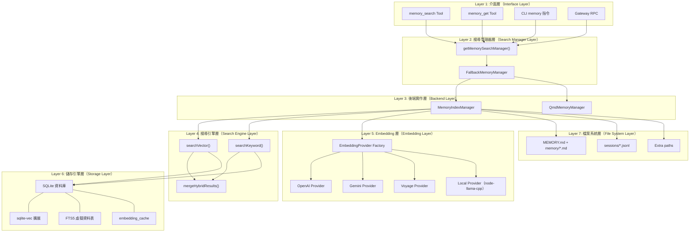
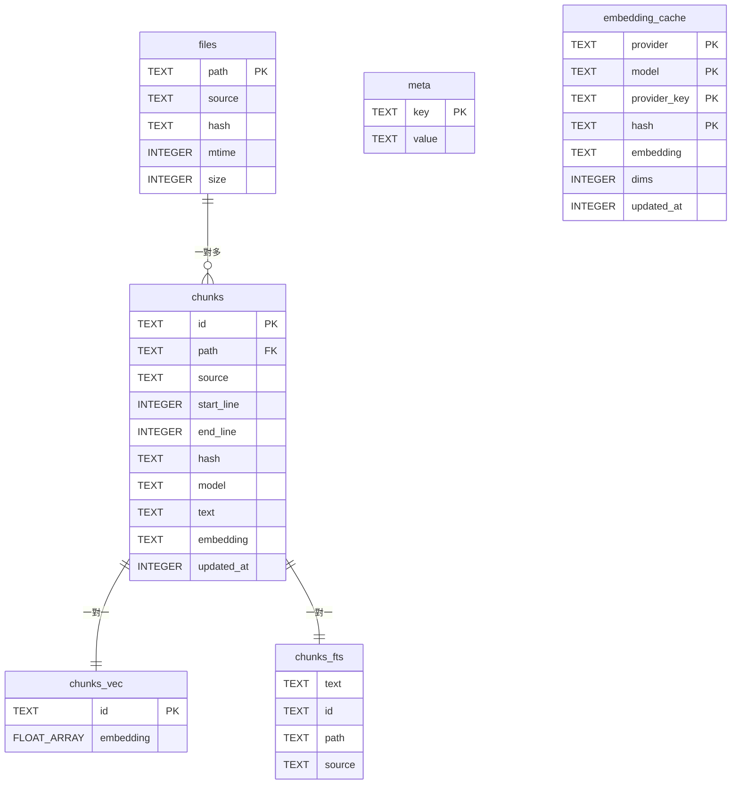
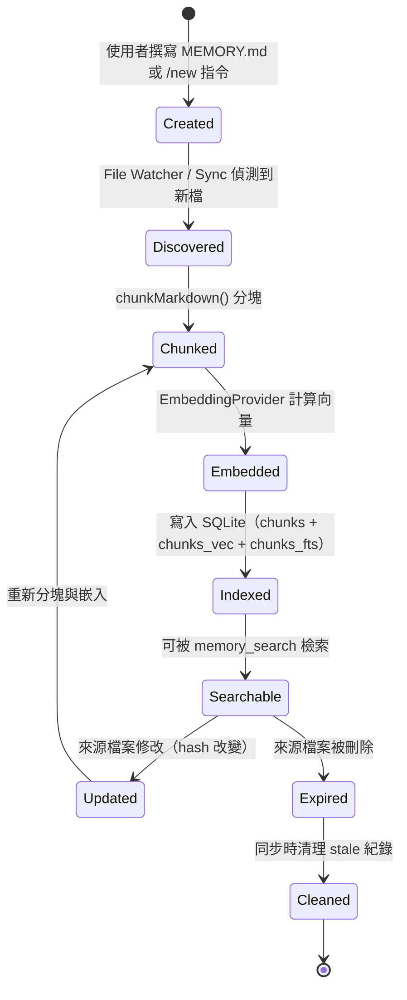
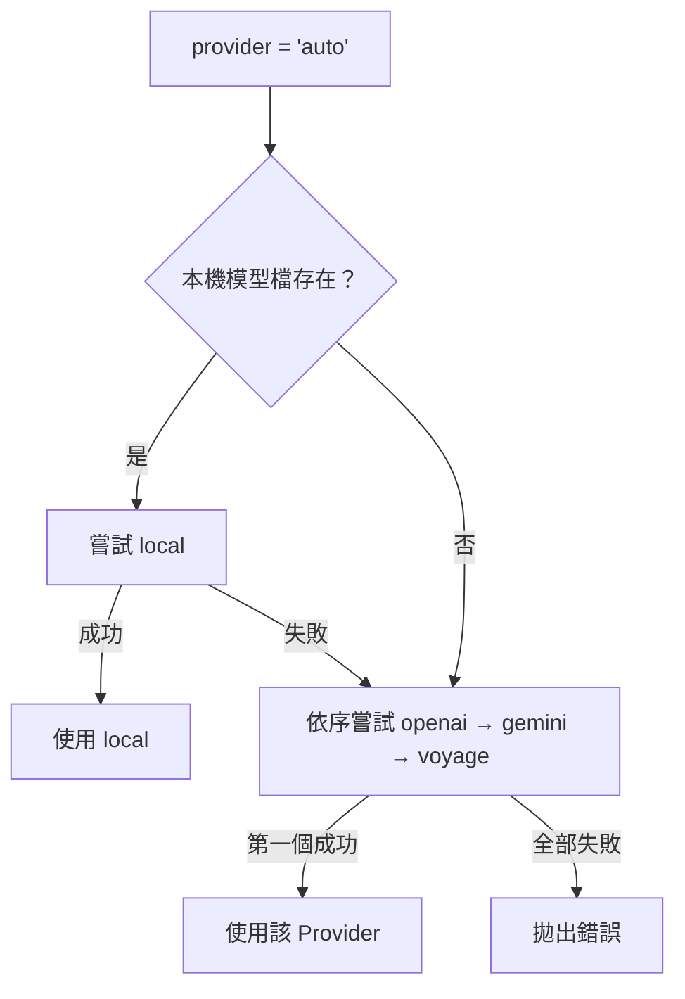

# OpenClaw 記憶體架構分析報告

> **Phase 2：Memory Architecture Analysis**
> 文件版本：1.0
> 分析日期：2026-02-08
> 分析範圍：Memory 子系統架構、資料模型、儲存後端、生命週期、索引策略

---

## 執行摘要

OpenClaw 的 Memory 子系統採用三層式架構：**搜尋管理器層**（Factory + Fallback）→ **核心索引層**（MemoryIndexManager）→ **儲存引擎層**（SQLite + sqlite-vec + FTS5）。資料模型以「檔案 → 區塊（Chunk） → 嵌入向量」為核心層級，透過 SHA-256 雜湊實現增量變更偵測。儲存後端採用 SQLite 單一檔案資料庫，搭配 sqlite-vec 擴展實現向量相似度搜尋，FTS5 虛擬資料表實現 BM25 全文檢索，兩者結果以可設定的權重進行混合融合。整個生命週期包含建立、索引、搜尋、同步、快取、過期清理六個階段，並支援原子性重新索引（Atomic Reindex）確保資料完整性。

---

## 1. 完整架構地圖

### 1.1 分層架構



### 1.2 核心元件職責

| 元件 | 檔案 | 職責 |
|------|------|------|
| **MemoryIndexManager** | `manager.ts` | 統籌全局：初始化、同步、索引、搜尋、快取、狀態報告 |
| **SearchManager Factory** | `search-manager.ts` | 依設定選擇後端（builtin/QMD），建立 Fallback 包裝器 |
| **FallbackMemoryManager** | `search-manager.ts:67-191` | 主要-後備模式：QMD 失敗時自動切換至 builtin |
| **EmbeddingProvider** | `embeddings.ts` | 統一的嵌入抽象層，支援 auto 自動偵測與 fallback |
| **Hybrid Search** | `hybrid.ts` | 向量搜尋與關鍵字搜尋的結果融合演算法 |
| **Memory Schema** | `memory-schema.ts` | 資料庫 Schema 初始化與遷移 |
| **QmdMemoryManager** | `qmd-manager.ts` | 外部 QMD 工具的子程序包裝器 |

---

## 2. 資料模型與 Schema

### 2.1 完整資料庫 Schema

資料庫由 `ensureMemoryIndexSchema()`（`memory-schema.ts:3-83`）建立，共 6 張資料表：

#### 資料表 1：`meta`（中繼資料）

```sql
CREATE TABLE IF NOT EXISTS meta (
  key TEXT PRIMARY KEY,
  value TEXT NOT NULL
);
```

**用途**：儲存索引中繼資料，包括 Provider 名稱、模型 ID、向量維度、分塊設定等。
**存取方式**：`readMeta()` / `writeMeta()` 方法，透過 UPSERT 操作。

#### 資料表 2：`files`（檔案追蹤）

```sql
CREATE TABLE IF NOT EXISTS files (
  path TEXT PRIMARY KEY,
  source TEXT NOT NULL DEFAULT 'memory',
  hash TEXT NOT NULL,
  mtime INTEGER NOT NULL,
  size INTEGER NOT NULL
);
```

**用途**：追蹤已索引的檔案，透過 SHA-256 `hash` 偵測內容變更。
**索引**：無額外索引（`path` 本身為主鍵）。

#### 資料表 3：`chunks`（文字區塊 + 嵌入）

```sql
CREATE TABLE IF NOT EXISTS chunks (
  id TEXT PRIMARY KEY,
  path TEXT NOT NULL,
  source TEXT NOT NULL DEFAULT 'memory',
  start_line INTEGER NOT NULL,
  end_line INTEGER NOT NULL,
  hash TEXT NOT NULL,
  model TEXT NOT NULL,
  text TEXT NOT NULL,
  embedding TEXT NOT NULL,
  updated_at INTEGER NOT NULL
);
CREATE INDEX IF NOT EXISTS idx_chunks_path ON chunks(path);
CREATE INDEX IF NOT EXISTS idx_chunks_source ON chunks(source);
```

**用途**：核心資料表，每筆紀錄代表一個 Markdown 文字區塊及其嵌入向量。
**嵌入格式**：JSON 陣列序列化為 TEXT（例如 `"[0.123, -0.456, ...]"`）。

#### 資料表 4：`embedding_cache`（嵌入快取）

```sql
CREATE TABLE IF NOT EXISTS embedding_cache (
  provider TEXT NOT NULL,
  model TEXT NOT NULL,
  provider_key TEXT NOT NULL,
  hash TEXT NOT NULL,
  embedding TEXT NOT NULL,
  dims INTEGER,
  updated_at INTEGER NOT NULL,
  PRIMARY KEY (provider, model, provider_key, hash)
);
CREATE INDEX IF NOT EXISTS idx_embedding_cache_updated_at ON embedding_cache(updated_at);
```

**用途**：跨 Provider 的嵌入快取，相同文字雜湊 + 相同 Provider/Model 可直接命中快取，避免重複 API 呼叫。

#### 資料表 5：`chunks_fts`（FTS5 全文檢索）

```sql
CREATE VIRTUAL TABLE IF NOT EXISTS chunks_fts USING fts5(
  text,
  id UNINDEXED,
  path UNINDEXED,
  source UNINDEXED,
  model UNINDEXED,
  start_line UNINDEXED,
  end_line UNINDEXED
);
```

**用途**：FTS5 虛擬資料表，支援 BM25 排名的全文搜尋。僅 `text` 欄位被索引，其餘欄位作為未索引附加資料。
**條件**：僅在 `ftsEnabled` 設定為 `true` 時建立，建立失敗時優雅降級。

#### 資料表 6：`chunks_vec`（向量索引）

```sql
-- 由 sqlite-vec 擴展建立的虛擬資料表
-- 動態維度，依 Embedding Provider 而定
CREATE VIRTUAL TABLE chunks_vec USING vec0(
  id TEXT PRIMARY KEY,
  embedding FLOAT[{dimensions}]
);
```

**用途**：sqlite-vec 擴展提供的向量索引表，支援餘弦距離搜尋。
**維度**：依 Embedding Provider 動態設定（OpenAI: 1536, Gemini: 768, Voyage: 1024 等）。

### 2.2 資料模型關聯圖



---

## 3. 儲存後端

### 3.1 主儲存：SQLite

- **驅動**：Node.js 22+ 內建 `node:sqlite`（`DatabaseSync`）
- **模式**：WAL（Write-Ahead Logging），支援並行讀取
- **檔案位置**：由 `store.path` 設定，預設為 `{workspace}/.memory-index.db`
- **SQLite 包裝**：`src/memory/sqlite.ts` 安裝警告過濾器以抑制不必要的輸出

### 3.2 向量引擎：sqlite-vec

- **載入方式**：`src/memory/sqlite-vec.ts` 動態載入 sqlite-vec 擴展
- **支援的操作**：`vec_distance_cosine()` 餘弦距離計算
- **降級策略**：若 sqlite-vec 不可用，回退至 JavaScript 實作的餘弦相似度（`internal.ts:258-277`）
- **擴展路徑**：可透過 `store.vector.extensionPath` 自訂 `.dylib` / `.so` / `.dll` 路徑

### 3.3 全文檢索：FTS5

- **觸發條件**：`hybrid.enabled` 設定為 `true` 時啟用
- **排名演算法**：BM25（FTS5 內建）
- **查詢建構**：`buildFtsQuery()`（`hybrid.ts:23-34`）將自然語言轉為 FTS5 AND 查詢
- **分數正規化**：`bm25RankToScore(rank) = 1 / (1 + rank)`（`hybrid.ts:36-39`）

### 3.4 替代後端：QMD

- **類型**：外部子程序（spawned process）
- **工具**：`qmd` 命令列工具
- **通訊方式**：標準輸入/輸出的 JSON 交換
- **用途**：適用於大型記憶庫或需要 LanceDB 等進階向量儲存的場景
- **設定**：`memory.backend = "qmd"`，搭配 `memory.qmd.*` 系列設定

---

## 4. Memory 生命週期

### 4.1 完整生命週期圖



### 4.2 各階段詳述

#### 階段 1：建立（Creation）

**觸發條件**：
- 使用者手動在 `MEMORY.md` 或 `memory/` 目錄新增 Markdown 檔案
- `/new` 指令觸發 Session Memory Hook 自動產生摘要
- Memory Flush 在壓縮前自動呼叫 LLM 產生摘要

**負責模組**：
- `src/hooks/bundled/session-memory/handler.ts`：`saveSessionToMemory()` 將 LLM 摘要寫入 `memory/YYYY-MM-DD-slug.md`
- `src/auto-reply/reply/agent-runner-memory.ts`：`runMemoryFlushIfNeeded()` 在 token 數超過閾值時觸發

#### 階段 2：探索（Discovery）

**觸發條件**：
- 檔案系統 Watcher（chokidar）偵測到變更
- 定時同步（`sync.intervalMinutes`）
- 搜尋前同步（`sync.onSearch`）
- 會話啟動同步（`sync.onSessionStart`）
- CLI `memory index` 手動觸發

**負責模組**：
- `internal.ts:78-144`：`listMemoryFiles()` 走訪 `MEMORY.md` + `memory/` + 額外路徑
- `session-files.ts:19-31`：`listSessionFilesForAgent()` 列舉 `.jsonl` 會話檔

#### 階段 3：分塊（Chunking）

**演算法**（`internal.ts:166-247`）：
1. 將 Markdown 內容按行分割
2. 以 `tokens * 4` 字元為區塊上限（預設 400 tokens = 1,600 chars）
3. 區塊間保留 `overlap * 4` 字元的重疊（預設 80 tokens = 320 chars）
4. 超長行自動切割為 `maxChars` 長度的段落
5. 每個區塊計算 SHA-256 雜湊作為唯一識別

**Session 檔案特殊處理**（`session-files.ts:72-125`）：
1. 解析 JSONL 格式，篩選 `type: "message"` 的紀錄
2. 僅保留 `role: "user"` 和 `role: "assistant"` 的訊息
3. 呼叫 `redactSensitiveText()` 脫敏處理
4. 格式化為 `"User: ..." / "Assistant: ..."` 的文字

#### 階段 4：嵌入（Embedding）

**Provider 選擇策略**（`embeddings.ts:128-212`）：
1. 若指定 `provider`：嘗試建立對應 Provider，失敗時使用 `fallback`
2. 若 `provider = "auto"`：依序嘗試 local → openai → gemini → voyage
3. 所有嵌入向量經過正規化處理（`sanitizeAndNormalizeEmbedding()`）

**批次處理**：
- OpenAI Batch API：上傳 JSONL → 建立批次 → 輪詢狀態 → 下載結果
- Gemini Batch API：multipart 上傳 → 非同步處理
- Voyage Batch API：類 OpenAI 風格的檔案 API

**快取機制**：
- 以 `(provider, model, provider_key, hash)` 為主鍵
- 相同文字雜湊在相同 Provider/Model 下可直接命中
- 可設定 `maxEntries` 上限，超出時按 `updated_at` 清理最舊條目

#### 階段 5：索引（Indexing）

**核心方法**：`manager.ts` `indexFile()`

**操作順序**：
1. UPSERT 至 `chunks` 資料表（含嵌入向量的 JSON 文字）
2. INSERT 至 `chunks_vec` 資料表（sqlite-vec 向量格式）
3. INSERT 至 `chunks_fts` 資料表（全文檢索索引）
4. UPSERT 至 `files` 資料表（檔案追蹤中繼資料）

**原子性重新索引**：
- 建立臨時資料庫進行完整重新索引
- 成功後原子性交換（swap）主資料庫與臨時資料庫
- 失敗時回退至原始資料庫

#### 階段 6：搜尋（Search）

**混合搜尋流程**（`manager.ts` `search()`）：
1. 若 `sync.onSearch` 且索引髒標記為 `true` → 先同步
2. 將查詢文字嵌入為向量
3. 執行向量搜尋（sqlite-vec 餘弦距離）→ 取得 `limit * candidateMultiplier` 筆候選
4. 執行關鍵字搜尋（FTS5 BM25）→ 取得同數量候選
5. 以 `mergeHybridResults()` 加權融合兩組結果
6. 按最終分數排序，截取 `maxResults` 筆回傳

**混合加權公式**：
```
finalScore = vectorWeight × vectorScore + textWeight × textScore
```
預設權重：`vectorWeight = 0.5`、`textWeight = 0.5`

#### 階段 7：同步與過期清理（Sync & Cleanup）

**同步觸發機制**：
- File Watcher（chokidar）：`watchDebounceMs` 抖動防護
- Session Listener：`onSessionTranscriptUpdate` 事件
- Interval Timer：`sync.intervalMinutes` 定時
- Session Start：`sync.onSessionStart` 啟動時同步
- Search Trigger：`sync.onSearch` 搜尋前同步

**清理邏輯**：
1. 比對資料庫中的 `files` 紀錄與實際檔案系統
2. 找出已不存在的檔案（stale files）
3. 依序刪除：`chunks_fts` → `chunks_vec` → `chunks` → `files`

---

## 5. 索引與檢索優化策略

### 5.1 向量搜尋優化

| 策略 | 實作位置 | 說明 |
|------|---------|------|
| sqlite-vec 原生餘弦距離 | `manager-search.ts:35-44` | 使用 `vec_distance_cosine()` SQL 函式，直接在 SQLite 內部計算 |
| 候選池擴張 | `manager.ts` search() | `candidateMultiplier`（預設 4x）擴大初始候選數量 |
| 向量正規化 | `embeddings.ts:10-17` | 所有嵌入向量正規化至單位向量，確保餘弦距離計算準確 |
| JavaScript 回退 | `manager-search.ts:70-93` | sqlite-vec 不可用時，載入所有 chunks 至記憶體計算 |

### 5.2 全文檢索優化

| 策略 | 實作位置 | 說明 |
|------|---------|------|
| FTS5 AND 查詢 | `hybrid.ts:23-34` | 將查詢分詞後以 AND 連接，提高精確度 |
| BM25 排名正規化 | `hybrid.ts:36-39` | `1/(1+rank)` 轉換為 [0,1] 分數範圍 |
| 來源篩選 | `manager-search.ts` | SQL WHERE 條件篩選特定 `source` 的結果 |

### 5.3 快取策略

| 快取層 | 範圍 | 失效條件 |
|--------|------|---------|
| Embedding Cache | Provider + Model + Hash | Provider/Model 變更、`maxEntries` 超限 |
| Manager Instance Cache | QMD 設定指紋 | 設定變更 |
| Provider Key Fingerprint | Provider 設定雜湊 | baseURL / model / headers 變更 |
| Manager Cache Key | 完整設定雜湊 | 任何設定項變更 |

### 5.4 增量更新機制

| 機制 | 觸發條件 | 說明 |
|------|---------|------|
| Hash 變更偵測 | 檔案 `hash` 與資料庫紀錄不符 | 僅重新索引實際修改的檔案 |
| Session Delta 追蹤 | `deltaBytes` 或 `deltaMessages` 超過閾值 | 僅在累積足夠變更量後才重新索引 |
| Mtime 檢查 | 檔案修改時間戳 | 快速初步篩選，再進行 hash 比對 |

---

## 6. Embedding Provider 架構

### 6.1 Provider 抽象介面

```typescript
// embeddings.ts:23-28
type EmbeddingProvider = {
  id: string;                                    // Provider 識別碼
  model: string;                                 // 模型名稱
  embedQuery: (text: string) => Promise<number[]>;      // 單筆嵌入
  embedBatch: (texts: string[]) => Promise<number[][]>; // 批次嵌入
};
```

### 6.2 支援的 Provider

| Provider | 預設模型 | 維度 | API 端點 | Batch API |
|----------|---------|------|---------|-----------|
| `openai` | text-embedding-3-small | 1536 | `/embeddings` | ✅ OpenAI Batch API |
| `gemini` | gemini-embedding-001 | 768 | `/{model}:embedContent` | ✅ `batchEmbedContents` |
| `voyage` | voyage-4-large | 1024 | `/embeddings` | ✅ Voyage Batch API |
| `local` | embeddinggemma-300M-Q8_0.gguf | 動態 | 本機（node-llama-cpp） | ❌ |

### 6.3 Auto 模式選擇流程



---

## 版本紀錄

| 版本 | 日期 | 變更 |
|------|------|------|
| 1.0 | 2026-02-08 | 初版建立 |
