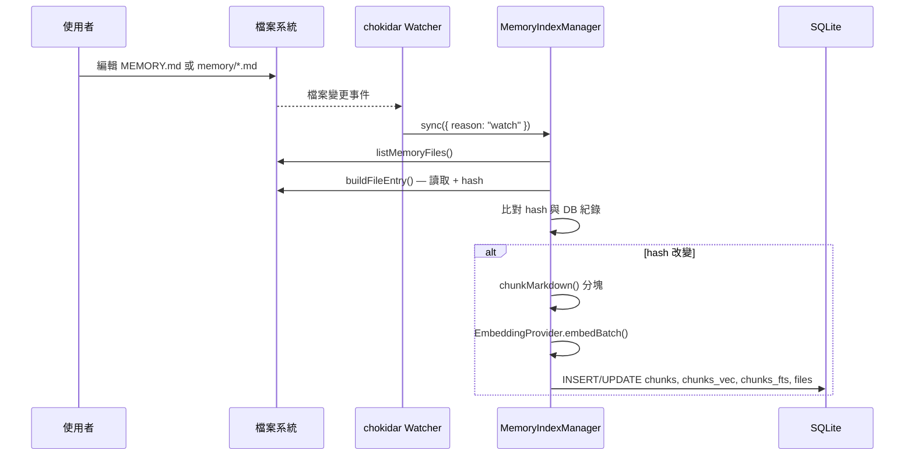
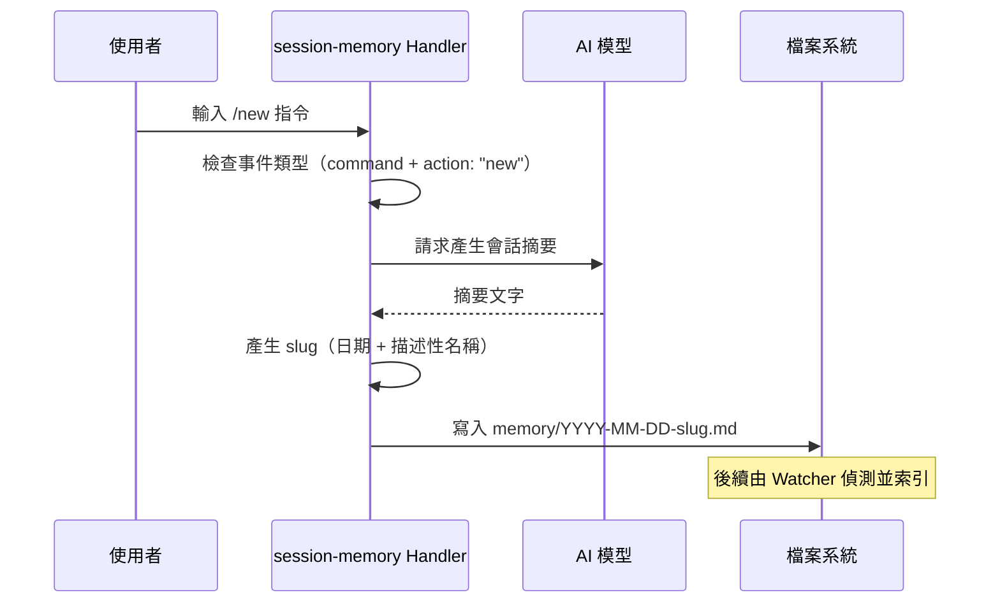
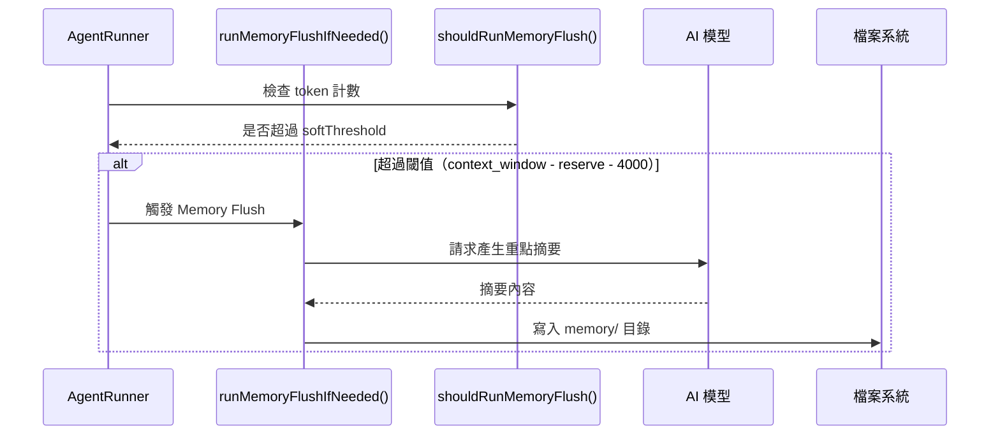
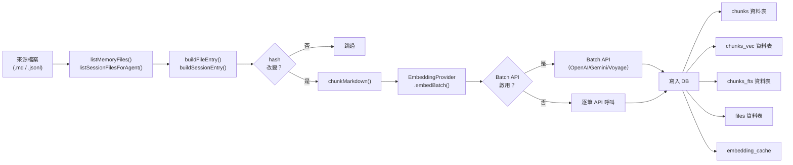
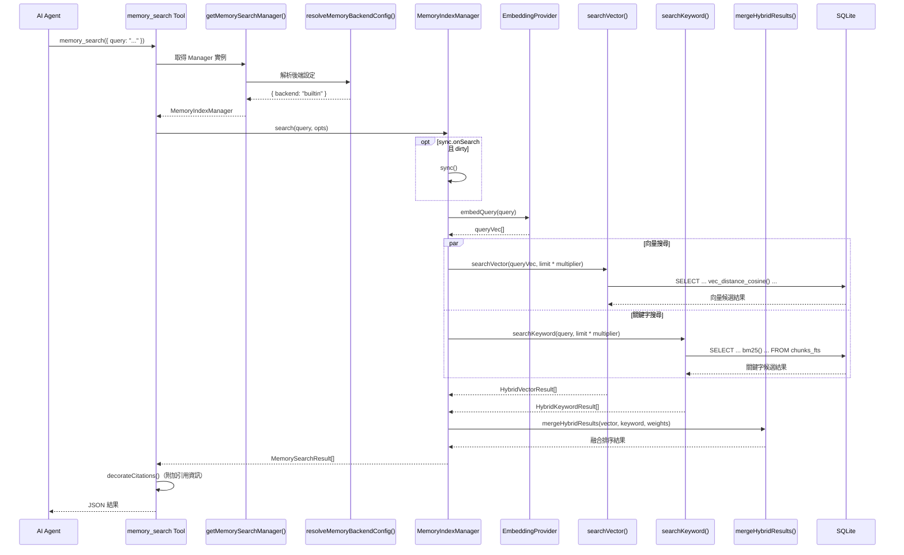
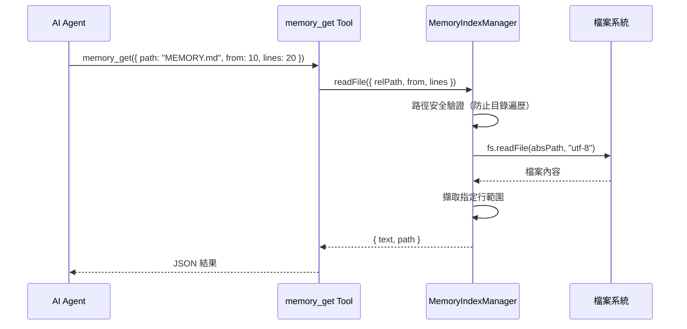
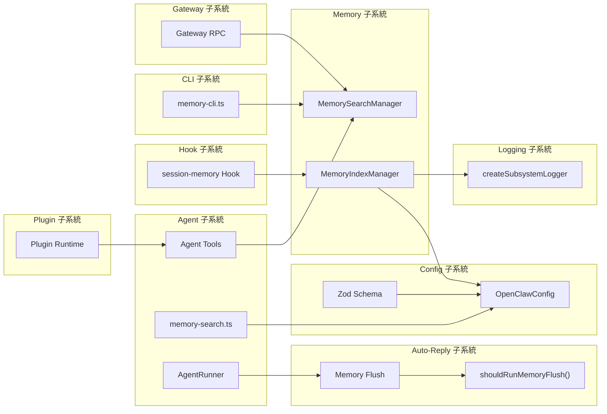
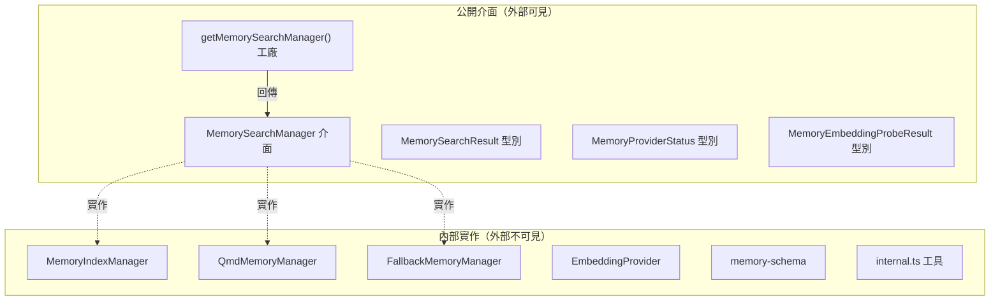

# OpenClaw 記憶體資料流與整合分析

> **Phase 3：Memory Data Flow and Integration**
> 文件版本：1.0
> 分析日期：2026-02-08
> 分析範圍：Memory 的完整資料流路徑、跨子系統整合、介面契約、事件驅動行為

---

## 執行摘要

Memory 子系統的資料流遵循「寫入 → 索引 → 搜尋 → 回傳」的管線模式，在寫入端有三個來源（手動筆記、Session Hook、Memory Flush），在讀取端有兩個消費者（Agent 工具、CLI 指令）。Memory 與其他子系統的整合透過明確的介面契約（`MemorySearchManager`）實現，並透過事件驅動機制（File Watcher、Session Transcript 事件、Interval Timer）保持索引的即時性。

---

## 1. 完整資料流追蹤

### 1.1 寫入路徑：Memory 檔案建立

#### 路徑 A：使用者手動撰寫



#### 路徑 B：Session Memory Hook（`/new` 指令）



#### 路徑 C：Memory Flush（自動壓縮前儲存）



### 1.2 索引路徑：從檔案到可搜尋的向量



### 1.3 搜尋路徑：從查詢到結果

#### 典型搜尋生命週期：`memory_search` 工具呼叫



### 1.4 檔案讀取路徑：`memory_get` 工具



---

## 2. 跨子系統整合

### 2.1 整合關係總覽



### 2.2 與 Agent 子系統的整合

**整合點**：`src/agents/tools/memory-tool.ts`

Agent 子系統透過兩個工具與 Memory 互動：

1. **`memory_search`**（行 25-88）：
   - 描述：「Mandatory recall step: semantically search MEMORY.md + memory/*.md」
   - 語意：Agent 在回答使用者問題前的「強制回憶」步驟
   - 流程：解析 agentId → 取得 Manager → 執行搜尋 → 附加引用 → 回傳 JSON

2. **`memory_get`**（行 90-135）：
   - 描述：「Safe snippet read from MEMORY.md or memory/*.md」
   - 語意：Agent 在搜尋到相關片段後，讀取更完整的上下文
   - 流程：解析路徑 → 安全驗證 → 讀取檔案 → 擷取行範圍

**設定解析**：`src/agents/memory-search.ts` 中的 `resolveMemorySearchConfig()` 負責將使用者設定轉為完整的 `ResolvedMemorySearchConfig`。

### 2.3 與 Auto-Reply / Context Management 的整合

**整合點**：`src/auto-reply/reply/agent-runner-memory.ts`

Memory Flush 機制確保在會話壓縮（compaction）前，將重要的上下文資訊持久化到 Memory 檔案中：

- **觸發條件**：`shouldRunMemoryFlush()` 判斷 token 計數是否超過閾值
- **閾值公式**：`softThresholdTokens = context_window - reserve_tokens - 4000`
- **動作**：呼叫 LLM 產生當前會話的重點摘要，寫入 `memory/` 目錄

### 2.4 與 Hook 子系統的整合

**整合點**：`src/hooks/bundled/session-memory/handler.ts`

Session Memory Hook 是一個綁定在 `/new` 指令上的 Hook Handler：

- **事件類型**：`event.type === "command" && event.action === "new"`
- **動作**：呼叫 LLM 為即將結束的會話產生摘要
- **輸出**：建立 `memory/YYYY-MM-DD-slug.md` 檔案

### 2.5 與 Config 子系統的整合

**整合點**：
- `src/config/types.memory.ts`：`MemoryConfig`、`MemoryBackend`、`MemoryCitationsMode`
- `src/config/types.tools.ts`：`MemorySearchConfig` 完整設定型別
- `src/config/zod-schema.agent-runtime.ts`：`MemorySearchSchema` Zod 驗證

設定流向：
```
使用者設定檔 → Zod 驗證 → OpenClawConfig → resolveMemorySearchConfig() → ResolvedMemorySearchConfig
                                          → resolveMemoryBackendConfig() → ResolvedMemoryBackendConfig
```

### 2.6 與 CLI 子系統的整合

**整合點**：`src/cli/memory-cli.ts`

提供三個終端機指令：

| 指令 | 功能 | 內部呼叫 |
|------|------|---------|
| `memory status` | 顯示索引狀態 | `manager.status()` |
| `memory index` | 強制重新索引 | `manager.sync({ force: true })` |
| `memory search <query>` | 搜尋記憶 | `manager.search(query)` |

### 2.7 與 Plugin 子系統的整合

**整合點**：`src/plugins/runtime/types.ts`

Plugin Runtime 型別系統中定義了 Memory 工具的型別參照：
```typescript
type CreateMemoryGetTool = typeof import("../../agents/tools/memory-tool.js").createMemoryGetTool;
type CreateMemorySearchTool = typeof import("../../agents/tools/memory-tool.js").createMemorySearchTool;
```

這允許外掛系統在運行時動態取得 Memory 工具的工廠函式。

### 2.8 與 Logging 子系統的整合

Memory 使用 `createSubsystemLogger("memory")` 建立專屬的日誌記錄器（`search-manager.ts:11`、`session-files.ts:8`），所有記錄都標記為 `memory` 子系統。

---

## 3. 介面契約與抽象邊界

### 3.1 主要介面：`MemorySearchManager`

定義於 `src/memory/types.ts:61-80`，這是 Memory 子系統對外暴露的唯一操作介面：

```typescript
interface MemorySearchManager {
  search(query, opts?): Promise<MemorySearchResult[]>;
  readFile(params): Promise<{ text: string; path: string }>;
  status(): MemoryProviderStatus;
  sync?(params?): Promise<void>;
  probeEmbeddingAvailability(): Promise<MemoryEmbeddingProbeResult>;
  probeVectorAvailability(): Promise<boolean>;
  close?(): Promise<void>;
}
```

**實作者**：
- `MemoryIndexManager`（builtin 後端）
- `QmdMemoryManager`（QMD 後端）
- `FallbackMemoryManager`（包裝器，自動切換主/備）

### 3.2 Embedding Provider 介面

定義於 `src/memory/embeddings.ts:23-28`：

```typescript
type EmbeddingProvider = {
  id: string;
  model: string;
  embedQuery: (text: string) => Promise<number[]>;
  embedBatch: (texts: string[]) => Promise<number[][]>;
};
```

**實作者**：OpenAI、Gemini、Voyage、Local 四個 Provider。

### 3.3 抽象邊界圖



---

## 4. 事件驅動與非同步行為

### 4.1 事件觸發機制

Memory 子系統有四種事件驅動的非同步行為：

#### A. 檔案系統 Watcher

- **工具**：chokidar（`manager.ts` `ensureWatcher()`）
- **監聽目標**：`MEMORY.md`、`memory/` 目錄、額外路徑
- **事件**：檔案新增、修改、刪除
- **抖動防護**：`watchDebounceMs` 抑制高頻變更
- **動作**：`sync({ reason: "watch" })`

#### B. Session Transcript 事件

- **訂閱**：`onSessionTranscriptUpdate` 事件（`manager.ts` `ensureSessionListener()`）
- **觸發**：當 Agent 與使用者的對話產生新紀錄
- **差異追蹤**：追蹤 `deltaBytes` 和 `deltaMessages`，超過閾值才觸發重新索引
- **抖動防護**：5 秒 debounce
- **動作**：`processSessionDeltaBatch()` → `sync({ reason: "session-delta" })`

#### C. Interval Timer

- **設定**：`sync.intervalMinutes`
- **動作**：定時呼叫 `sync({ reason: "interval" })`
- **用途**：確保即使 Watcher 遺漏事件，索引也會定期更新

#### D. Session Start Warmup

- **設定**：`sync.onSessionStart`
- **觸發**：新會話開始時
- **動作**：`warmSession()` → `sync({ reason: "session-start" })`

### 4.2 非同步操作概覽

| 操作 | 非同步模式 | 超時設定 |
|------|-----------|---------|
| Embedding 計算 | 逐批非同步 | 依 Provider 而定 |
| Batch Embedding | 輪詢式等待 | `timeoutMinutes`（預設 60 分鐘） |
| 向量搜尋 | 同步（DatabaseSync） | 無（SQLite 原生） |
| 關鍵字搜尋 | 同步（DatabaseSync） | 無（SQLite 原生） |
| 檔案同步 | 非同步（並行限制） | 無明確超時 |
| QMD 子程序 | 非同步 spawn | `timeoutMs`（預設 4,000ms） |

### 4.3 並行控制

- **嵌入並行度**：`runWithConcurrency(tasks, limit)` 工具函式（`internal.ts:279-307`）
- **預設並行數**：4（或 Batch 設定中的 `concurrency`）
- **Worker Pool 模式**：`resolvedLimit` 個 Worker 持續從任務佇列取出任務執行
- **錯誤傳播**：第一個錯誤立即停止所有 Worker

---

## 5. Citations（引用）機制

Memory 搜尋結果支援附加引用資訊（`memory-tool.ts:145-162`）：

### 5.1 引用模式

| 模式 | 說明 |
|------|------|
| `"auto"` | 直接對話顯示引用，群組/頻道不顯示 |
| `"on"` | 始終顯示引用 |
| `"off"` | 不顯示引用 |

### 5.2 引用格式

```
Source: {path}#L{startLine}-L{endLine}
```

例如：`Source: MEMORY.md#L10-L25`

### 5.3 QMD 結果截斷

QMD 後端額外支援 `maxInjectedChars` 限制（`memory-tool.ts:164-188`），超出字元預算的搜尋結果會被截斷。

---

## 版本紀錄

| 版本 | 日期 | 變更 |
|------|------|------|
| 1.0 | 2026-02-08 | 初版建立 |
