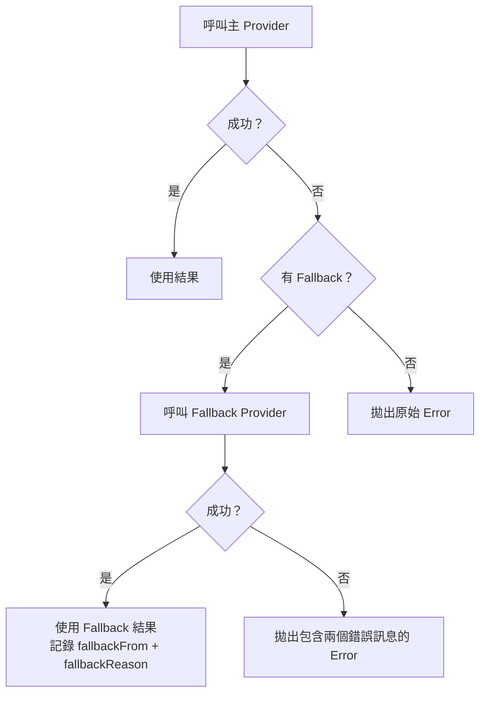
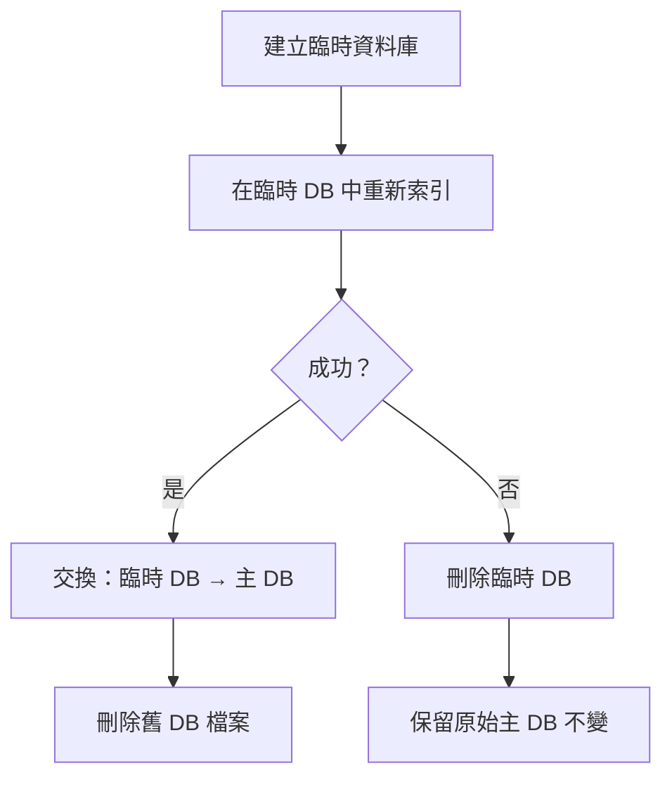

# OpenClaw 記憶體設定與邊界條件分析

> **Phase 4：Memory Configuration, Constraints, and Edge Cases**
> 文件版本：1.0
> 分析日期：2026-02-08
> 分析範圍：Memory 的設定參數、限制、邊界情況、錯誤處理

---

## 執行摘要

Memory 子系統提供豐富的設定參數，涵蓋 Embedding Provider 選擇、搜尋行為、分塊策略、同步觸發、快取管理等面向。系統設計了多層防禦機制來處理 Provider 故障、資料庫損毀、檔案系統異常等邊界情況，包含 Provider Fallback、原子性重新索引、漸進式降級等策略。本報告完整編錄所有設定參數並分析各種限制與邊界條件。

---

## 1. 設定參數完整編錄

### 1.1 Memory 後端設定（`memory.*`）

定義於 `src/config/types.memory.ts`，控制 Memory 子系統的全域行為。

| 參數路徑 | 型別 | 預設值 | 說明 |
|---------|------|--------|------|
| `memory.backend` | `"builtin" \| "qmd"` | `"builtin"` | 記憶體後端選擇 |
| `memory.citations` | `"auto" \| "on" \| "off"` | `"auto"` | 搜尋結果引用模式 |

### 1.2 Memory Search 設定（`agents.defaults.memorySearch.*`）

定義於 `src/config/types.tools.ts`，控制搜尋索引的細部行為。

#### 基本設定

| 參數路徑 | 型別 | 預設值 | 說明 |
|---------|------|--------|------|
| `enabled` | boolean | `true` | 啟用或停用 Memory 搜尋 |
| `sources` | `("memory" \| "sessions")[]` | `["memory"]` | 索引來源選擇 |
| `extraPaths` | string[] | `[]` | 額外的 Markdown 檔案路徑或目錄 |
| `provider` | `"openai" \| "gemini" \| "voyage" \| "local"` | — | Embedding Provider 指定 |
| `fallback` | `"openai" \| "gemini" \| "local" \| "voyage" \| "none"` | — | Embedding 失敗時的後備 Provider |
| `model` | string | 依 Provider 而定 | Embedding 模型 ID |

#### 遠端 Provider 設定（`remote.*`）

| 參數路徑 | 型別 | 預設值 | 說明 |
|---------|------|--------|------|
| `remote.baseUrl` | string | 依 Provider 預設 | API 基礎 URL |
| `remote.apiKey` | string | 環境變數 | API 金鑰 |
| `remote.headers` | Record<string, string> | `{}` | 自訂 HTTP 標頭 |
| `remote.batch.enabled` | boolean | `true` | 啟用 Batch API 批次嵌入 |
| `remote.batch.wait` | boolean | `true` | 等待 Batch 完成 |
| `remote.batch.concurrency` | number | `2` | 最大並行 Batch 任務數 |
| `remote.batch.pollIntervalMs` | number | `5000` | Batch 輪詢間隔（毫秒） |
| `remote.batch.timeoutMinutes` | number | `60` | Batch 超時（分鐘） |

#### 本機 Embedding 設定（`local.*`）

| 參數路徑 | 型別 | 預設值 | 說明 |
|---------|------|--------|------|
| `local.modelPath` | string | `"hf:ggml-org/embeddinggemma-300M-GGUF/..."` | GGUF 模型路徑或 `hf:` URI |
| `local.modelCacheDir` | string | — | 本機模型快取目錄 |

#### 儲存設定（`store.*`）

| 參數路徑 | 型別 | 預設值 | 說明 |
|---------|------|--------|------|
| `store.driver` | `"sqlite"` | `"sqlite"` | 儲存引擎（目前僅支援 SQLite） |
| `store.path` | string | `"{workspace}/.memory-index.db"` | 資料庫檔案路徑 |
| `store.vector.enabled` | boolean | `true` | 啟用 sqlite-vec 向量搜尋 |
| `store.vector.extensionPath` | string | — | 自訂 sqlite-vec 擴展路徑 |

#### 分塊設定（`chunking.*`）

| 參數路徑 | 型別 | 預設值 | 說明 |
|---------|------|--------|------|
| `chunking.tokens` | number | 400 | 每個區塊的最大 token 數 |
| `chunking.overlap` | number | 80 | 區塊間重疊的 token 數 |

**換算規則**：1 token ≈ 4 字元（`internal.ts:174`：`maxChars = Math.max(32, chunking.tokens * 4)`）

#### 同步設定（`sync.*`）

| 參數路徑 | 型別 | 預設值 | 說明 |
|---------|------|--------|------|
| `sync.onSessionStart` | boolean | — | 會話啟動時同步 |
| `sync.onSearch` | boolean | — | 搜尋前同步 |
| `sync.watch` | boolean | — | 啟用檔案系統 Watcher |
| `sync.watchDebounceMs` | number | — | Watcher 抖動防護（毫秒） |
| `sync.intervalMinutes` | number | — | 定時同步間隔（分鐘） |
| `sync.sessions.deltaBytes` | number | — | Session 觸發重新索引的最小累積位元組 |
| `sync.sessions.deltaMessages` | number | — | Session 觸發重新索引的最小累積訊息數 |

#### 查詢設定（`query.*`）

| 參數路徑 | 型別 | 預設值 | 說明 |
|---------|------|--------|------|
| `query.maxResults` | number | — | 最大回傳結果數 |
| `query.minScore` | number (0-1) | — | 最低分數閾值 |
| `query.hybrid.enabled` | boolean | `true` | 啟用混合搜尋（向量 + BM25） |
| `query.hybrid.vectorWeight` | number (0-1) | `0.5` | 向量搜尋權重 |
| `query.hybrid.textWeight` | number (0-1) | `0.5` | 文字搜尋權重 |
| `query.hybrid.candidateMultiplier` | number | `4` | 候選池倍數（搜尋 `maxResults * multiplier` 筆再排序） |

#### 快取設定（`cache.*`）

| 參數路徑 | 型別 | 預設值 | 說明 |
|---------|------|--------|------|
| `cache.enabled` | boolean | `true` | 啟用 Embedding 快取 |
| `cache.maxEntries` | number | — | 快取最大條目數（超出時清理最舊） |

#### 實驗性設定（`experimental.*`）

| 參數路徑 | 型別 | 預設值 | 說明 |
|---------|------|--------|------|
| `experimental.sessionMemory` | boolean | `false` | 啟用 Session 紀錄索引（實驗性功能） |

### 1.3 QMD 後端設定（`memory.qmd.*`）

定義於 `src/memory/backend-config.ts`，僅在 `memory.backend = "qmd"` 時生效。

| 參數路徑 | 型別 | 預設值 | 說明 |
|---------|------|--------|------|
| `qmd.command` | string | `"qmd"` | QMD 執行檔路徑 |
| `qmd.includeDefaultMemory` | boolean | `true` | 是否包含預設 Memory 路徑 |
| `qmd.paths[].path` | string | — | 自訂集合路徑 |
| `qmd.paths[].name` | string | — | 自訂集合名稱 |
| `qmd.paths[].pattern` | string | `"**/*.md"` | 檔案匹配模式 |
| `qmd.sessions.enabled` | boolean | `false` | 啟用 Session 匯出 |
| `qmd.sessions.exportDir` | string | — | Session 匯出目錄 |
| `qmd.sessions.retentionDays` | number | — | Session 保留天數 |
| `qmd.update.interval` | string | `"5m"` | 更新間隔 |
| `qmd.update.debounceMs` | number | `15000` | 抖動防護（毫秒） |
| `qmd.update.onBoot` | boolean | `true` | 啟動時更新 |
| `qmd.update.embedInterval` | string | `"60m"` | 嵌入更新間隔 |
| `qmd.limits.maxResults` | number | `6` | 最大結果數 |
| `qmd.limits.maxSnippetChars` | number | `700` | 片段最大字元數 |
| `qmd.limits.maxInjectedChars` | number | `4000` | 注入 Agent 的最大字元數 |
| `qmd.limits.timeoutMs` | number | `4000` | QMD 指令超時 |

### 1.4 環境變數

| 環境變數 | 用途 |
|---------|------|
| `OPENAI_API_KEY` | OpenAI Embedding API 金鑰 |
| `GOOGLE_API_KEY` / `GEMINI_API_KEY` | Google Gemini Embedding API 金鑰 |
| `VOYAGE_API_KEY` | Voyage AI Embedding API 金鑰 |
| `OPENCLAW_DEBUG_MEMORY_EMBEDDINGS` | 啟用 Embedding 除錯日誌 |

---

## 2. 限制與限額

### 2.1 容量限制

| 限制項目 | 值 | 來源 |
|---------|-----|------|
| Batch API 最大請求數 | 50,000 | `batch-openai.ts`、`batch-gemini.ts`、`batch-voyage.ts` |
| OpenAI Batch 完成窗口 | 24 小時 | `batch-openai.ts` |
| Voyage Batch 完成窗口 | 12 小時 | `batch-voyage.ts` |
| 嵌入快取最大條目 | 可設定（`maxEntries`） | `types.tools.ts` |
| QMD 最大結果數 | 6（預設） | `backend-config.ts:64` |
| QMD 最大注入字元 | 4,000（預設） | `backend-config.ts:67` |
| QMD 指令超時 | 4,000ms（預設） | `backend-config.ts:62` |

### 2.2 效能限制

| 項目 | 預設值 | 影響 |
|------|--------|------|
| Embedding 並行度 | 4 | 同時進行的嵌入 API 呼叫數 |
| Batch 並行任務 | 2 | 同時進行的 Batch Job 數 |
| Batch 輪詢間隔 | 5,000ms | Batch 狀態檢查頻率 |
| 分塊大小 | 400 tokens（1,600 chars） | 影響搜尋粒度與嵌入 API 呼叫次數 |
| 分塊重疊 | 80 tokens（320 chars） | 影響相鄰區塊的上下文連續性 |
| 候選池倍數 | 4x | 影響混合搜尋的初始候選數量 |
| Watcher 抖動防護 | 設定值 | 影響變更偵測的反應速度 |
| Session Delta 閾值 | `deltaBytes` / `deltaMessages` | 影響 Session 重新索引頻率 |

### 2.3 檔案系統限制

| 限制 | 實作位置 | 說明 |
|------|---------|------|
| 僅索引 `.md` 檔案 | `internal.ts:71` | Memory 來源僅支援 Markdown 格式 |
| 排除符號連結 | `internal.ts:61` | 安全考量，符號連結被跳過 |
| 路徑安全驗證 | `manager.ts` `readFile()` | 防止目錄遍歷攻擊 |
| Session 僅支援 `.jsonl` | `session-files.ts:25` | 僅處理 JSONL 格式的會話紀錄 |

---

## 3. 邊界條件與例外處理

### 3.1 Embedding Provider 故障

#### 場景：主 Provider 失敗

**實作**：`embeddings.ts:188-211`
- 先嘗試主 Provider，捕獲錯誤
- 若有 `fallback` 且非 `"none"`，嘗試 Fallback Provider
- Fallback 成功時，回傳結果並附帶 `fallbackFrom` 和 `fallbackReason`

#### 場景：Batch 嵌入失敗

- **重試機制**：指數退避（3 次嘗試，500ms-8s 延遲）
- **速率限制偵測**：HTTP 429、5xx、Cloudflare 錯誤碼
- **Batch 停用**：連續 2 次 Batch 失敗後自動停用，回退為逐筆 API 呼叫
- **實作**：`manager.ts` 中的 `embedChunksWithBatch()` / `embedChunksInBatches()`

### 3.2 資料庫故障

#### 場景：原子性重新索引失敗

**實作**：`manager.ts` `swapIndexFiles()` / `removeIndexFiles()`
- 使用臨時 `.tmp` 檔案進行完整重新索引
- 成功後原子性 rename 交換
- 失敗時清理臨時檔案，主資料庫不受影響

#### 場景：FTS5 不可用

- FTS5 建立失敗時（`memory-schema.ts:70-74`），`ftsAvailable` 設為 `false`
- 搜尋降級為純向量搜尋，BM25 關鍵字搜尋自動停用
- 錯誤訊息記錄於 `ftsError`

#### 場景：sqlite-vec 不可用

- 擴展載入失敗時（`sqlite-vec.ts`），`vector.available` 設為 `false`
- 搜尋降級為 JavaScript 實作的餘弦相似度（`manager-search.ts:70-93`）
- 載入所有 chunks 至記憶體進行暴力搜尋

### 3.3 檔案系統異常

#### 場景：Memory 檔案被刪除

- 同步時偵測到資料庫中有記錄但檔案不存在
- 依序刪除：`chunks_fts` → `chunks_vec` → `chunks` → `files`
- 清理完成後，搜尋結果中不再包含已刪除檔案的內容

#### 場景：符號連結

- `listMemoryFiles()`（`internal.ts:61`）和 `addMarkdownFile()`（`internal.ts:90`）皆檢查 `isSymbolicLink()`
- 符號連結被靜默跳過，不產生錯誤

#### 場景：路徑安全

- `readFile()` 方法驗證解析後的絕對路徑不超出工作空間範圍
- 防止 `../` 等目錄遍歷攻擊

### 3.4 並行與競爭條件

#### 場景：同時搜尋與同步

- `search()` 方法在搜尋前可選擇性觸發 `sync()`（`sync.onSearch`）
- SQLite WAL 模式允許並行讀取，但寫入仍為序列化
- `DatabaseSync` 為同步 API，避免了非同步 I/O 的競爭問題

#### 場景：多個 Watcher 事件快速觸發

- `watchDebounceMs` 抖動防護確保短時間內的多個事件被合併
- Session Delta 追蹤使用累積閾值而非逐次觸發

### 3.5 資料一致性

#### 場景：Provider/Model 變更

- `manager.ts` 比對 `meta` 資料表中的 `providerKey` 與當前 Provider 指紋
- 若指紋不符，觸發完整重新索引（所有嵌入需重新計算）
- 向量維度變更時，`chunks_vec` 虛擬資料表需要重新建立

#### 場景：向量維度不一致

- 新嵌入的維度與現有 `chunks_vec` 表的維度不符
- 系統偵測到維度變更後，DROP + CREATE `chunks_vec` 表
- 所有現有向量需要重新插入

### 3.6 node-llama-cpp 不可用

**偵測**（`embeddings.ts:221-230`）：
- 檢查 `ERR_MODULE_NOT_FOUND` 錯誤碼
- 檢查錯誤訊息是否包含 `"node-llama-cpp"`

**處理**（`embeddings.ts:232-254`）：
- 產生詳細的診斷訊息，指引使用者安裝步驟
- 建議切換至遠端 Provider（OpenAI / Voyage）
- 不會導致系統崩潰，自動回退至其他 Provider

---

## 4. 降級與後備策略總覽

| 層級 | 主要策略 | 降級策略 | 最終兜底 |
|------|---------|---------|---------|
| Embedding | 指定 Provider | Fallback Provider | 拋出錯誤 |
| 向量搜尋 | sqlite-vec 原生 | JavaScript 暴力搜尋 | 純文字搜尋 |
| 文字搜尋 | FTS5 BM25 | 停用 | 純向量搜尋 |
| 後端 | QMD 外部 | Builtin 內建 | 回傳 null |
| 批次處理 | Batch API | 逐筆呼叫 | 跳過嵌入 |
| 索引更新 | 原子性交換 | 保留原始 DB | 不更新 |

---

## 5. Zod 驗證 Schema

`src/config/zod-schema.agent-runtime.ts` 中的 `MemorySearchSchema` 對所有設定參數進行嚴格的型別驗證：

- 所有 object 使用 `.strict()`，禁止未知屬性
- 數值參數使用 `.positive()`、`.nonnegative()`、`.int()` 約束
- 分數參數使用 `.min(0).max(1)` 約束（0 到 1 之間）
- Provider 和 Fallback 使用 `z.union()` 限定可選值
- 所有參數均為 `optional()`，允許部分設定

---

## 版本紀錄

| 版本 | 日期 | 變更 |
|------|------|------|
| 1.0 | 2026-02-08 | 初版建立 |
