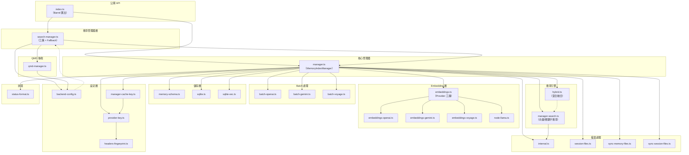
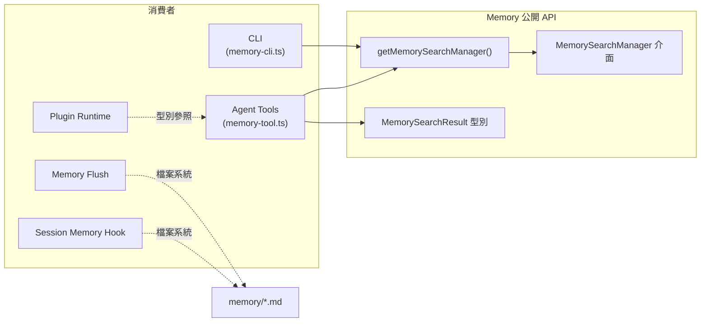

# OpenClaw 記憶體依賴關係對映

> **Phase 5：Memory Dependency and Relationship Mapping**
> 文件版本：1.0
> 分析日期：2026-02-08
> 分析範圍：Memory 子系統的內部與外部依賴關係

---

## 執行摘要

Memory 子系統的依賴關係呈現「內聚高、耦合低」的特徵。內部依賴以 `manager.ts` 為核心，放射狀地連接搜尋引擎、嵌入層、儲存層、同步層等元件。外部依賴精簡，核心僅仰賴 Node.js 內建模組（`node:sqlite`、`node:crypto`、`node:fs`）和 chokidar 檔案監聽器；sqlite-vec 與 node-llama-cpp 為可選依賴，不可用時系統自動降級。對外提供的介面透過 `MemorySearchManager` 單一介面封裝，消費端（Agent Tools、CLI、Hooks）僅需透過工廠函式取得實例即可操作。

---

## 1. 內部依賴關係

### 1.1 模組依賴圖



### 1.2 模組依賴矩陣

| 模組（被依賴者） | 依賴它的模組 |
|-----------------|------------|
| `types.ts` | `index.ts`、`search-manager.ts`、`manager.ts`、`memory-tool.ts` |
| `internal.ts` | `manager.ts`、`manager-search.ts`、`sync-memory-files.ts`、`sync-session-files.ts`、`session-files.ts` |
| `embeddings.ts` | `manager.ts` |
| `manager.ts` | `index.ts`、`search-manager.ts` |
| `search-manager.ts` | `index.ts`、`memory-tool.ts` |
| `backend-config.ts` | `search-manager.ts`、`qmd-manager.ts`、`memory-tool.ts` |
| `memory-schema.ts` | `manager.ts` |
| `hybrid.ts` | `manager.ts` |
| `manager-search.ts` | `manager.ts` |
| `session-files.ts` | `manager.ts`、`sync-session-files.ts` |
| `provider-key.ts` | `manager.ts`、`manager-cache-key.ts` |
| `headers-fingerprint.ts` | `provider-key.ts` |

### 1.3 依賴方向分析

**依賴方向**：由外向內、由上向下

```
介面層（index.ts）
  → 工廠層（search-manager.ts）
    → 管理器層（manager.ts）
      → 搜尋層（manager-search.ts、hybrid.ts）
      → 嵌入層（embeddings.ts → openai/gemini/voyage/local）
      → 儲存層（memory-schema.ts、sqlite.ts、sqlite-vec.ts）
      → 檔案層（internal.ts、session-files.ts、sync-*.ts）
      → 設定層（backend-config.ts、provider-key.ts）
```

**無循環依賴**：所有依賴方向為單向，未發現循環依賴。

---

## 2. 外部依賴

### 2.1 必要依賴（Required）

| 依賴 | 類型 | 用途 | 使用位置 |
|------|------|------|---------|
| `node:sqlite` | Node.js 內建 | SQLite 同步資料庫驅動 | `manager.ts`、`memory-schema.ts`、`manager-search.ts` |
| `node:crypto` | Node.js 內建 | SHA-256 雜湊計算 | `internal.ts:1,146` |
| `node:fs` / `node:fs/promises` | Node.js 內建 | 檔案系統操作 | `internal.ts`、`session-files.ts`、`manager.ts` |
| `node:path` | Node.js 內建 | 路徑處理 | 多個模組 |
| `chokidar` | npm 套件 | 檔案系統監聽（Watcher） | `manager.ts` |
| `@sinclair/typebox` | npm 套件 | Agent Tool 的 JSON Schema 定義 | `memory-tool.ts:1` |

### 2.2 可選依賴（Optional）

| 依賴 | 類型 | 用途 | 不可用時的降級策略 |
|------|------|------|-----------------|
| `sqlite-vec` | npm 套件（原生擴展） | SQLite 向量相似度搜尋 | 回退至 JavaScript 暴力餘弦計算 |
| `node-llama-cpp` | npm 套件（原生擴展） | 本機 Embedding 計算 | 使用遠端 Provider（OpenAI/Gemini/Voyage） |

### 2.3 外部 API 依賴

| API 服務 | SDK / 協定 | 用途 | 必要性 |
|---------|-----------|------|--------|
| OpenAI Embeddings API | HTTP POST `/embeddings` | 文字嵌入計算 | 可選（auto 模式自動偵測） |
| OpenAI Batch API | HTTP POST `/batches` | 大量嵌入批次處理 | 可選（`batch.enabled`） |
| Google Gemini Embedding API | HTTP POST `/{model}:embedContent` | 文字嵌入計算 | 可選 |
| Google Gemini Batch API | HTTP POST `/{model}:batchEmbedContents` | 批次嵌入 | 可選 |
| Voyage AI Embeddings API | HTTP POST `/embeddings` | 文字嵌入計算 | 可選 |
| Voyage AI Batch API | HTTP POST `/batches` | 批次嵌入 | 可選 |

### 2.4 跨模組依賴（來自 OpenClaw 其他子系統）

| 依賴模組 | 匯入來源 | 用途 |
|---------|---------|------|
| `config/config.ts` | `OpenClawConfig` | 讀取全域設定 |
| `config/types.memory.ts` | Memory 設定型別 | 型別定義 |
| `config/types.tools.ts` | `MemorySearchConfig` | 工具設定型別 |
| `config/types.base.ts` | `SessionSendPolicyConfig` | QMD 範圍設定 |
| `config/sessions/paths.ts` | `resolveSessionTranscriptsDirForAgent` | Session 檔案路徑解析 |
| `config/zod-schema.agent-runtime.ts` | `MemorySearchSchema` | Zod 驗證 Schema |
| `agents/agent-scope.ts` | `resolveAgentWorkspaceDir`、`resolveSessionAgentId` | Agent 工作空間與 ID 解析 |
| `agents/memory-search.ts` | `resolveMemorySearchConfig` | Memory Search 設定解析 |
| `routing/session-key.ts` | `parseAgentSessionKey` | Session Key 解析（引用模式判斷） |
| `logging/subsystem.ts` | `createSubsystemLogger` | 子系統日誌 |
| `logging/redact.ts` | `redactSensitiveText` | 敏感資訊脫敏 |
| `utils.ts` | `resolveUserPath`、`truncateUtf16Safe` | 路徑解析、UTF-16 安全截斷 |
| `utils/shell-argv.ts` | `splitShellArgs` | QMD 指令解析 |
| `cli/parse-duration.ts` | `parseDurationMs` | QMD 間隔設定解析 |

---

## 3. 被其他模組依賴的關係

### 3.1 依賴 Memory 的模組

| 消費者模組 | 使用的 Memory API | 用途 |
|-----------|-----------------|------|
| `src/agents/tools/memory-tool.ts` | `getMemorySearchManager`、`MemorySearchResult` | Agent 的 memory_search / memory_get 工具 |
| `src/cli/memory-cli.ts` | `getMemorySearchManager`、`MemoryIndexManager` | CLI memory 指令 |
| `src/hooks/bundled/session-memory/handler.ts` | 檔案系統寫入（間接） | Session Memory Hook |
| `src/auto-reply/reply/agent-runner-memory.ts` | 檔案系統寫入（間接） | Memory Flush |
| `src/plugins/runtime/types.ts` | `createMemorySearchTool`、`createMemoryGetTool` 型別 | 外掛系統型別參照 |

### 3.2 依賴方向圖（消費者視角）



---

## 4. 依賴健康度評估

### 4.1 核心依賴評估

| 依賴 | 穩定性 | 維護狀態 | 風險 |
|------|--------|---------|------|
| `node:sqlite` | 高（Node.js 內建） | Node.js 團隊維護 | 低：Node.js 22+ LTS |
| `node:crypto` | 高（Node.js 內建） | Node.js 團隊維護 | 低 |
| `chokidar` | 高（成熟套件） | 活躍維護 | 低 |
| `@sinclair/typebox` | 中高 | 活躍維護 | 低 |

### 4.2 可選依賴評估

| 依賴 | 穩定性 | 維護狀態 | 風險 |
|------|--------|---------|------|
| `sqlite-vec` | 中（較新套件） | 活躍維護 | 中：原生擴展安裝可能失敗 |
| `node-llama-cpp` | 中（較新套件） | 活躍維護 | 中高：原生編譯依賴，跨平台相容性 |

### 4.3 API 依賴評估

| 服務 | 可用性 | 風險 |
|------|--------|------|
| OpenAI API | 高 | 低：穩定的商業服務 |
| Google Gemini API | 高 | 低：Google 背書 |
| Voyage AI API | 中 | 中：較新的服務提供商 |

### 4.4 架構耦合度評估

| 評估面向 | 評分 (1-5) | 說明 |
|---------|-----------|------|
| 介面封裝度 | 5 | 透過 `MemorySearchManager` 單一介面對外暴露 |
| 實作可替換性 | 5 | builtin / QMD 兩種後端可替換，Embedding Provider 可插拔 |
| 設定隔離度 | 4 | 設定集中於 `config/types.*.ts`，但分散在多個型別檔 |
| 降級優雅度 | 5 | 多層降級策略，每個元件不可用時都有後備方案 |
| 測試獨立性 | 4 | 11 個專屬測試檔，使用 Mock Provider 隔離外部依賴 |

---

## 版本紀錄

| 版本 | 日期 | 變更 |
|------|------|------|
| 1.0 | 2026-02-08 | 初版建立 |
