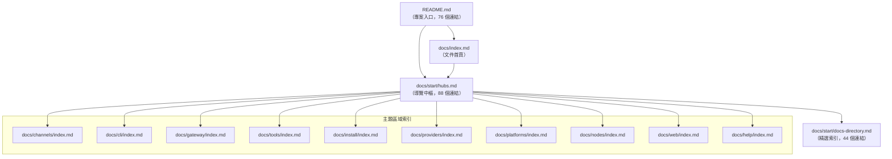
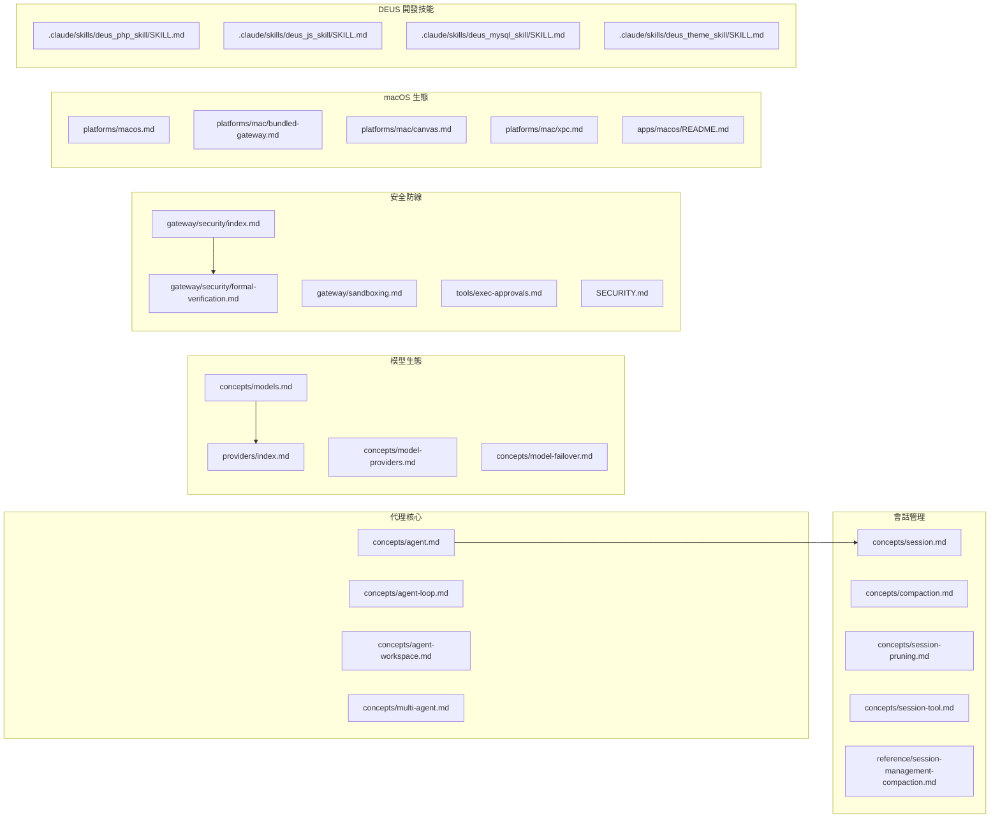

# OpenClaw 專案 Markdown 檔案索引清冊

> 產出日期：2026-02-07
> 掃描範圍：專案根目錄下所有 `.md` 檔案（排除 `node_modules`、`.git`）
> 檔案總數：**801 個**

---

## 目錄

- [概覽摘要](#概覽摘要)
- [統計概覽](#統計概覽)
- [一、專案根目錄](#一專案根目錄)
- [二、Swabble 子專案](#二swabble-子專案)
- [三、apps — 行動與桌面應用](#三apps--行動與桌面應用)
- [四、assets — 靜態資源](#四assets--靜態資源)
- [五、.github — GitHub 專案治理](#五github--github-專案治理)
- [六、.agent / .agents — 自動化工作流](#六agent--agents--自動化工作流)
- [七、.pi — Pi 編碼代理提示](#七pi--pi-編碼代理提示)
- [八、docs — 主文件體系（英文）](#八docs--主文件體系英文)
  - [8.1 文件根目錄](#81-文件根目錄)
  - [8.2 docs/start — 入門指南](#82-docsstart--入門指南)
  - [8.3 docs/install — 安裝部署](#83-docsinstall--安裝部署)
  - [8.4 docs/concepts — 核心概念](#84-docsconcepts--核心概念)
  - [8.5 docs/channels — 通訊管道整合](#85-docschannels--通訊管道整合)
  - [8.6 docs/cli — CLI 命令參考](#86-docscli--cli-命令參考)
  - [8.7 docs/gateway — Gateway 服務](#87-docsgateway--gateway-服務)
  - [8.8 docs/tools — 代理工具](#88-docstools--代理工具)
  - [8.9 docs/nodes — 節點裝置](#89-docsnodes--節點裝置)
  - [8.10 docs/web — Web 介面](#810-docsweb--web-介面)
  - [8.11 docs/providers — 模型提供商](#811-docsproviders--模型提供商)
  - [8.12 docs/platforms — 平台指南](#812-docsplatforms--平台指南)
  - [8.13 docs/plugins — 外掛系統](#813-docsplugins--外掛系統)
  - [8.14 docs/automation — 自動化](#814-docsautomation--自動化)
  - [8.15 docs/reference — 參考文件](#815-docsreference--參考文件)
  - [8.16 docs/refactor — 重構計畫](#816-docsrefactor--重構計畫)
  - [8.17 docs/experiments — 實驗性功能](#817-docsexperiments--實驗性功能)
  - [8.18 docs/help — 求助中心](#818-docshelp--求助中心)
  - [8.19 docs/其他](#819-docs其他)
- [九、docs/zh-CN — 簡體中文翻譯鏡像](#九docszh-cn--簡體中文翻譯鏡像)
- [十、extensions — 外掛擴展](#十extensions--外掛擴展)
- [十一、skills — 代理技能](#十一skills--代理技能)
- [十二、src/hooks — 內建 Hook](#十二srchooks--內建-hook)
- [十三、vendor/a2ui — 第三方 A2UI 規範](#十三vendora2ui--第三方-a2ui-規範)
- [十四、.claude/skills — DEUS 開發技能](#十四claudeskills--deus-開發技能)
- [十五、deus_data — 專案分析資料](#十五deus_data--專案分析資料)
- [檔案間關聯圖譜](#檔案間關聯圖譜)
- [孤立檔案清單](#孤立檔案清單)

---

## 概覽摘要

OpenClaw 是一個多通道 AI 代理閘道平台，可在 WhatsApp、Telegram、Slack、Discord 等 20+ 通訊管道上執行個人 AI 助手。專案採用 TypeScript / Node.js 技術堆疊，以 Monorepo 方式組織，涵蓋：

- **核心 Gateway 服務**：WebSocket 伺服器、代理運行時、會話管理
- **多通道整合**：20+ 通訊平台外掛
- **行動與桌面應用**：macOS（Swift）、iOS（SwiftUI）、Android（Kotlin）
- **豐富的代理技能**：50+ 技能，整合 GitHub、Notion、Spotify、智慧家居等
- **完善的文件體系**：300+ 英文文件 + 305 簡體中文翻譯鏡像

文件結構採用 **Mintlify** 文件框架，使用根相對路徑連結（無 `.md` 副檔名），以 Hub-Spoke 模式組織導覽。

---

## 統計概覽

| 類別 | 檔案數量 |
|------|---------|
| 專案根目錄 | 8 |
| Swabble 子專案 | 3 |
| apps（行動/桌面應用） | 6 |
| assets | 1 |
| .github（專案治理） | 2 |
| .agent / .agents（自動化） | 4 |
| .pi（提示集） | 4 |
| docs（英文主文件） | 313 |
| docs/zh-CN（簡中翻譯鏡像） | 305 |
| extensions（外掛擴展） | 48 |
| skills（代理技能） | 57 |
| src/hooks（內建 Hook） | 6 |
| vendor/a2ui（第三方） | 9 |
| .claude/skills（DEUS 開發技能） | 34 |
| deus_data | 1 |
| **合計** | **801** |

---

## 一、專案根目錄

| 檔案名稱 | 相對路徑 | 用途說明 | 分類 | 目標受眾 |
|---------|---------|---------|------|---------|
| README.md ✅ PROCESSED | `./README.md` | 專案主頁與完整入口文件（約 500 行），涵蓋七大區塊：（1）**專案定位與安裝**：介紹 OpenClaw 為個人 AI 助手平台，支援 Node ≥22 執行環境，提供 `npm install -g openclaw@latest` 與 `openclaw onboard --install-daemon` 一鍵安裝流程，並說明 stable/beta/dev 三軌版本通道切換機制；（2）**快速啟動與源碼開發**：包含 Gateway 啟動、訊息傳送、Agent 互動的最小範例，以及 pnpm 源碼建構與 `gateway:watch` 熱重載開發迴圈；（3）**安全預設**：詳述 DM 配對機制（`dmPolicy="pairing"`），未知發送者需透過 `openclaw pairing approve` 核准，並建議使用 `openclaw doctor` 檢查風險設定；（4）**功能亮點**：列舉 Gateway WebSocket 控制面板、20+ 通訊管道收件匣（WhatsApp/Telegram/Slack/Discord/Google Chat/Signal/BlueBubbles/iMessage/MS Teams/Matrix/Zalo/WebChat）、多代理路由、Voice Wake 語音喚醒、Talk Mode 連續對話、Live Canvas 視覺工作區、A2UI 整合、伴侶應用（macOS/iOS/Android）、50+ 技能系統與 ClawHub 技能註冊表；（5）**架構與子系統**：以 ASCII 圖表呈現 Gateway 控制面板架構，說明 Tailscale Serve/Funnel 遠端存取、SSH 通道、macOS TCC 權限模型、Agent-to-Agent sessions 跨工作階段協作（`sessions_list`/`sessions_history`/`sessions_send`）；（6）**通道設定速查**：逐一列出 WhatsApp、Telegram、Slack、Discord、Signal、BlueBubbles、iMessage、MS Teams、WebChat 的最小設定範例（JSON5 格式）；（7）**文件導覽與社群**：提供 76+ 個外部連結，分為入門文件、進階文件、操作排錯、深度剖析、工作區技能、平台內部實作等分類，尾部包含貢獻者頭像牆與專案起源故事（Molty 太空龍蝦助手）。此檔案是整個專案的核心入口點，連結密度極高，適合所有角色閱讀。 | 專案總覽 | 所有人 |
| CHANGELOG.md ✅ PROCESSED | `./CHANGELOG.md` | 專案版本更新紀錄，採用日期制版號（`YYYY.M.D` 格式，如 `2026.2.6`），每個版本區塊分為 Changes（行為變更）、Added（新增功能）、Fixes（修復項目）三個子段落。最新版本 2026.2.6 的重點異動包括：Cron 排程系統大幅重構（預設 `wakeMode` 改為 `"now"`、新增執行歷史深連結、修復計時器漂移與鎖競爭問題）、新增 xAI（Grok）與百度 Qianfan 模型提供商支援、Anthropic Opus 4.6 與 OpenAI Codex gpt-5.3-codex 前向相容、原生 Voyage AI 記憶體嵌入支援、Web UI 新增令牌用量儀表板。安全修復方面涵蓋 Gateway Canvas Host 認證加固、技能/外掛程式碼安全掃描器、憑證從 config.get 回應中遮蔽。歷史版本回溯至早期開發階段，每筆變更均標注對應的 GitHub Issue/PR 編號與貢獻者致謝（如 `#10776 Thanks @tyler6204`），便於追溯具體程式碼變更。此檔案是了解專案演進歷程、判斷功能成熟度、追蹤已知問題修復狀態的關鍵文件。 | 版本紀錄 | 開發者/使用者 |
| CONTRIBUTING.md ✅ PROCESSED | `./CONTRIBUTING.md` | 社群貢獻指南（約 79 行），涵蓋四大面向：（1）**社群連結**：GitHub 儲存庫、Discord 伺服器、X/Twitter 帳號快速入口；（2）**維護者名單**：列出 5 位核心維護者及其負責領域——Peter Steinberger（專案領導者，Benevolent Dictator）、Shadow（Discord + Slack 子系統）、Jos（Telegram、API、Nix 模式）、Christoph Nakazawa（JS 基礎設施）、Gustavo Madeira Santana（多代理、CLI、Web UI）；（3）**貢獻流程**：小型修復直接開 PR，新功能或架構變更需先在 GitHub Discussion 或 Discord 討論，問題諮詢可至 Discord #setup-help 頻道。PR 前需通過本地測試（`pnpm build && pnpm check && pnpm test`），保持 PR 聚焦單一主題；（4）**AI 輔助 PR 政策**：明確歡迎 AI/Vibe-Coded PR，要求標註 AI 輔助程度、測試範圍、附上提示詞或工作階段記錄。此外說明 Control UI 使用 Lit 搭配舊版裝飾器（legacy decorators），`tsconfig.json` 設定 `experimentalDecorators: true`。當前開發重點為穩定性（WhatsApp/Telegram 邊界案例）、UX（Onboarding 精靈與錯誤訊息）、技能擴展、效能最佳化（令牌用量與壓縮邏輯）。 | 社群治理 | 貢獻者 |
| SECURITY.md ✅ PROCESSED | `./SECURITY.md` | 安全政策文件（約 73 行），定義漏洞回報與安全邊界：（1）**漏洞回報管道**：透過 `steipete@gmail.com` 私下回報，需附上重現步驟、影響評估與最小 PoC；（2）**無賞金計畫聲明**：專案為開源社群專案，無 Bug Bounty 預算，鼓勵以 PR 形式貢獻修復；（3）**排除範圍**：公開網路曝露、違反文件建議的使用方式、Prompt Injection 攻擊均不在安全範圍內；（4）**操作指引**：引導至 `docs.openclaw.ai/gateway/security` 查看威脅模型與強化指南，包含 `openclaw security audit --deep` 與 `--fix` 命令；（5）**Web 介面安全警告**：Web 介面僅供本地使用，未經公開網路強化，禁止綁定至公開 IP；（6）**執行環境安全需求**：要求 Node.js ≥22.12.0（包含 CVE-2025-59466 async_hooks DoS 與 CVE-2026-21636 Permission Model Bypass 修補）；（7）**Docker 安全最佳實踐**：官方映像以非 root 使用者（`node`）執行，建議搭配 `--read-only` 與 `--cap-drop=ALL` 旗標；（8）**秘密掃描**：使用 `detect-secrets` 工具於 CI/CD 中自動偵測洩漏的秘密，設定檔為 `.detect-secrets.cfg`，基線檔為 `.secrets.baseline`。 | 安全政策 | 安全研究者 |
| AGENTS.md ✅ PROCESSED | `./AGENTS.md` | 儲存庫層級的 AI 代理與開發者操作指引（約 190 行），是 AI 編碼代理（如 Claude、Codex、Pi）與人類開發者在此專案中工作的核心行為手冊。涵蓋：（1）**專案結構與模組組織**：定義 `src/` 原始碼目錄（CLI 於 `src/cli`、命令於 `src/commands`、Web Provider 於 `src/provider-web.ts`、基礎設施於 `src/infra`、媒體管線於 `src/media`）、測試共置（`*.test.ts`）、外掛於 `extensions/*` 為獨立工作區套件、通訊管道需同時考量所有內建與擴展管道；（2）**Mintlify 文件連結規範**：內部連結使用根相對路徑且不帶 `.md` 副檔名、標題避免 em dash 與撇號、對外回覆使用完整 `https://docs.openclaw.ai/` URL；（3）**i18n 翻譯管線**：`docs/zh-CN/` 為自動生成，不直接編輯，需透過詞彙表與 `scripts/docs-i18n` 腳本更新；（4）**建構與測試指令**：`pnpm install` → `pnpm build` → `pnpm check` → `pnpm test`（Vitest，V8 覆蓋率門檻 70%），偏好 Bun 執行 TypeScript；（5）**編碼風格**：TypeScript ESM、Oxlint/Oxfmt 格式化、檔案上限約 700 LOC、使用 `createDefaultDeps` 依賴注入、產品名稱用 OpenClaw / CLI 用 `openclaw`；（6）**Commit 與 PR 工作流**：使用 `scripts/committer` 提交、偏好 rebase 線性歷史、PR 合併後需新增 CHANGELOG 條目並致謝貢獻者、新貢獻者需加入 README 頭像牆；（7）**多代理安全規則**：禁止未經授權的 git stash/worktree/branch 操作、各代理維持獨立工作階段、僅提交自身變更；（8）**平台特定注意事項**：macOS 透過 App 管理 Gateway 而非臨時 tmux、SwiftUI 偏好 Observation 框架、版本號分佈於 `package.json`/iOS Info.plist/Android build.gradle.kts/macOS Info.plist 等多處。 | 開發指南 | 開發者/AI 代理 |
| CLAUDE.md ✅ PROCESSED | `./CLAUDE.md` | 專案系統性分析與逆向工程指南（繁體中文，約 600+ 行），為 Claude Code AI 代理提供一套完整的 GitHub 專案架構分析方法論。文件定義三大核心能力（快速偵察、逆向推導、清晰表達）並規範十個分析階段的執行流程：（1）專案總覽偵察（README/LICENSE/CHANGELOG/CONTRIBUTING 閱讀）、（2）目錄結構解讀（目錄樹產生、架構風格判斷、Mermaid 模組關係圖）、（3）依賴關係拓撲（五大類別歸類：Framework/Data/Communication/Infra/DevTools）、（4）進入點與啟動流程（main 函式追蹤、啟動序列圖）、（5）核心架構模式辨識（MVC/Clean Architecture/Hexagonal/Event-Driven/CQRS/Microservices 等）、（6）資料流與狀態管理追蹤（典型 API 請求生命週期）、（7）API 介面與對外契約（端點清單、認證機制、錯誤處理模式）、（8）測試策略與品質保障（測試分層、覆蓋率評估）、（9）建置與部署管線（CI/CD 流程圖）、（10）綜合分析報告產出（含架構品質 1-5 評分矩陣）。嚴格規範輸出語言為台灣繁體中文，附有完整的詞彙對照表（如「使用者」取代「用戶」、「設定」取代「配置」），並設有 6 項分析原則（先觀察再推論、區分事實與推測、關注設計意圖、追蹤邊界例外、保持實用導向、承認不確定性）與自我檢查清單。 | AI 分析框架 | AI 代理 |
| CLAUDE.md.deprecated ✅ PROCESSED | `./CLAUDE.md.deprecated` | 已棄用的符號連結（symlink），實際指向 `./AGENTS.md`。這代表專案曾經使用 `CLAUDE.md` 作為 AI 代理的工作指引檔名（遵循 Claude Code 慣例），後來將其重新命名為更通用的 `AGENTS.md`（適用於所有 AI 編碼代理），並保留此 deprecated 檔案作為向後相容的過渡。讀者應直接參考 `AGENTS.md` 取得最新的儲存庫操作指引，此符號連結無獨立內容。 | 已棄用 | — |
| docs.acp.md ✅ PROCESSED | `./docs.acp.md` | ACP（Agent Client Protocol）橋接器完整技術文件（約 198 行），定義 IDE 與 OpenClaw Gateway 之間的通訊協定。核心架構為 `openclaw acp` 透過 stdio（NDJSON 格式）對外暴露 ACP 代理介面，內部轉發至 Gateway WebSocket。涵蓋：（1）**使用情境**：IDE 或工具鏈支援 ACP 時，可透過此橋接器驅動 Gateway 工作階段，支援本地或遠端 Gateway；（2）**代理選擇**：ACP 不直接選擇代理，而是透過 Gateway session key 路由，支援 `agent:main:main`、`agent:design:main` 等命名慣例的代理範圍工作階段鍵；（3）**Zed 編輯器整合範例**：提供 `~/.config/zed/settings.json` 的 `agent_servers` 設定範本，可指定 Gateway URL、Token 與目標代理工作階段；（4）**執行模型**：ACP `prompt` 映射至 Gateway `chat.send`，串流事件雙向轉譯，`cancel` 映射至 `chat.abort`，終態對應為 `complete→stop`、`aborted→cancel`、`error→error`；（5）**工作階段映射**：預設產生 `acp:<uuid>` 隔離鍵，可透過 CLI 旗標（`--session`/`--session-label`/`--reset-session`）或 ACP `_meta` 欄位覆寫，支援 `sessionKey`/`sessionLabel`/`resetSession`/`requireExisting` 四種模式；（6）**認證與 Gateway 探索**：優先使用 CLI 旗標（`--url`/`--token`/`--password`），否則讀取 `gateway.remote.*` 設定；（7）**相容性**：使用 `@agentclientprotocol/sdk` 0.13.x，支援 ACP 的 `initialize`/`newSession`/`loadSession`/`prompt`/`cancel`/`listSessions` 操作。關聯文件：`docs/cli/acp.md`、`docs/concepts/session.md`。 | 協定文件 | 開發者 |

---

## 二、Swabble 子專案

| 檔案名稱 | 相對路徑 | 用途說明 | 分類 |
|---------|---------|---------|------|
| README.md ✅ PROCESSED | `Swabble/README.md` | Swabble 子專案完整介紹文件（約 112 行），定義一個 Swift 6.2 語音喚醒詞守護程式，專為 macOS 26 設計，使用 Apple Speech.framework（SpeechAnalyzer + SpeechTranscriber）實現完全本地端（零網路）語音辨識。核心功能包括：（1）**喚醒詞偵測**：預設喚醒詞 `clawd`（別名 `claude`），可透過 `--no-wake` 旗標繞過；（2）**SwabbleKit 共享程式庫**：多平台（iOS 17+/macOS 15+）喚醒詞門控工具，提供基於語音片段間隙的觸發偵測；（3）**Hook 執行協定**：喚醒後執行任意 Shell 命令，支援 prefix/env/cooldown（1 秒）/min_chars（24 字元）/timeout（5 秒）參數，注入 `SWABBLE_TEXT` 與 `SWABBLE_PREFIX` 環境變數；（4）**完整 CLI 命令集**：`serve`（前景守護迴圈）、`transcribe`（離線音檔轉錄為 TXT/SRT）、`test-hook`、`mic list/set`、`setup`（產生預設 config.json）、`doctor`（檢查 Speech 授權與裝置可用性）、`health`、`tail-log`、`status`、`service install/uninstall/status`（launchd plist 管理佔位）；（5）**設定檔**：`~/.config/swabble/config.json`，涵蓋 audio（裝置/取樣率/聲道）、wake（喚醒詞/別名）、hook（命令/參數/前綴/冷卻/超時/環境變數）、logging（等級/格式）、transcripts（啟用/最大筆數）、speech（語言區域/禮貌用語替換）；（6）**語音管線**：`AVAudioEngine` tap → `BufferConverter` → `AnalyzerInput` → `SpeechAnalyzer`，請求 volatile + final 結果。可作為 SwiftPM 相依性嵌入其他應用程式。 | 子專案總覽 |
| CHANGELOG.md ✅ PROCESSED | `Swabble/CHANGELOG.md` | Swabble 版本變更紀錄（目前僅一個版本 0.2.0，2025-12-23 發布），記錄兩項重點變更：新增 `SwabbleKit` 多平台喚醒詞門控工具程式庫（支援 iOS + macOS，具備基於語音片段間隙的偵測能力），以及將 CLI 的喚醒詞匹配/剝離邏輯路由至 `SwabbleKit` helpers。Speech 管線型別明確標註 macOS 26 / iOS 26 可用性門控。此檔案篇幅極短，反映專案處於早期開發階段。 | 版本紀錄 |
| spec.md ✅ PROCESSED | `Swabble/docs/spec.md` | Swabble 技術規格書（約 34 行），作為專案的架構設計藍圖與實作規範。涵蓋：（1）**目標定義**：類 brabble 風格的 always-on 語音 Hook，使用 Apple Speech.framework 取代 whisper.cpp；（2）**需求規格**：macOS 26+、Swift 6.2、完全本地處理、喚醒詞門控、Hook 執行（cooldown/min_chars/timeout/prefix/env）、JSON Codable 設定檔（不使用 TOML）、CLI 使用 Commander 框架（steipete/Commander SwiftPM 套件）；（3）**架構分層**：CLI 層（Commander 子命令體系）、Config 層（`SwabbleConfig` Codable 結構）、Audio + Speech Pipeline 層（`SpeechPipeline` 包裝 `AVAudioEngine` → `SpeechAnalyzer` + `SpeechTranscriber`）、Wake Gate 層（CLI 文字匹配 + SwabbleKit 片段感知間隙偵測）、Hook Executor 層（async Process 生成，`${hostname}` 前綴替換）、Transcripts Store 層（記憶體環形緩衝區 + 可選 JSON Lines 持久化）；（4）**範圍外項目**：模型管理（由 Speech 框架處理）、launchd Helper（規劃中）、進階喚醒詞偵測器；（5）**待定設計決策**：UNIX 控制 socket 介面選擇、PII 遮蔽功能（brabble 對等功能，目前僅佔位布林值）。 | 技術規格 |

---

## 三、apps — 行動與桌面應用

| 檔案名稱 | 相對路徑 | 用途說明 | 分類 |
|---------|---------|---------|------|
| README.md ✅ PROCESSED | `apps/android/README.md` | Android 節點應用開發指南（約 52 行），說明以 Kotlin + Jetpack Compose 建構的內部專用 Android 節點客戶端。應用透過 mDNS 服務探測（`_openclaw-gw._tcp`）自動發現 Gateway WebSocket，並暴露 Canvas、Chat、Camera 三大能力。技術重點：Foreground Service 持久通知（含 Disconnect 按鈕）維持連線、Chat 使用共享 session key `main`（跨 iOS/macOS/WebChat/Android 同步）、最低 SDK 31。建置指令為 Gradle 標準流程（`./gradlew :app:assembleDebug`/`installDebug`/`testDebugUnitTest`）。配對流程需先在主機啟動 Gateway，再由 Android 端設定頁發現或手動輸入 Gateway 位址，最後由 Gateway CLI 核准（`openclaw nodes approve`）。必要 Android 權限：`NEARBY_WIFI_DEVICES`（Android 13+）、`ACCESS_FINE_LOCATION`（Android 12-）、`POST_NOTIFICATIONS`、`CAMERA`、`RECORD_AUDIO`。 | 行動應用 |
| README.md ✅ PROCESSED | `apps/ios/README.md` | iOS 應用開發指南（約 29 行），說明內部專用 SwiftUI iOS 應用鷹架。涵蓋開發工具需求（`swiftformat` + `swiftlint` 經由 Homebrew 安裝）、Xcode 專案產生流程（`xcodegen generate` 於 `apps/ios` 目錄執行後開啟 `OpenClaw.xcodeproj`）、共享套件 `../shared/OpenClawKit`（型別與常數共享，供 iOS/macOS bridge/Gateway routing 使用），以及 fastlane 整合（指向 `apps/ios/fastlane/SETUP.md` 了解 App Store Connect 認證與上傳 lanes）。 | 行動應用 |
| SETUP.md ✅ PROCESSED | `apps/ios/fastlane/SETUP.md` | iOS fastlane 自動化建置設定指南（約 33 行），提供逐步操作流程：（1）經由 Homebrew 安裝 fastlane；（2）在 App Store Connect > Users and Access > Keys 建立 API 金鑰，下載 `.p8` 檔案並記錄 Issuer ID 與 Key ID；（3）建立 gitignored `.env` 檔案（位於 `apps/ios/fastlane/.env`），設定 `ASC_KEY_ID`、`ASC_ISSUER_ID`、`ASC_KEY_PATH`（`.p8` 絕對路徑）、`IOS_DEVELOPMENT_TEAM`（Apple Team ID）；（4）若缺少 Team ID 可執行 `scripts/ios-team-id.sh` 輔助查詢；（5）執行 `fastlane beta` 啟動 Beta 發佈通道。 | 建置部署 |
| README.md ✅ PROCESSED | `apps/macos/README.md` | macOS 應用建構、簽署與打包完整指南（約 65 行），涵蓋：（1）快速開發啟動（`scripts/restart-mac.sh --no-sign` 最快但 TCC 權限不持久、`--sign` 需憑證）；（2）打包流程（`scripts/package-mac-app.sh` 產生 `dist/OpenClaw.app` 並呼叫 `scripts/codesign-mac-app.sh` 簽署）；（3）簽署身份自動選擇優先順序：Developer ID Application > Apple Distribution > Apple Development > 首個可用，找不到時預設報錯（可透過 `ALLOW_ADHOC_SIGNING=1` 或 `SIGN_IDENTITY="-"` 覆寫）；（4）Team ID 審計（Sparkle 不一致防護）：簽署後比對 App Bundle 中所有 Mach-O 二進位的 Team ID 一致性，可透過 `SKIP_TEAM_ID_CHECK=1` 跳過；（5）Library Validation 變通方案：開發情境下 `DISABLE_LIBRARY_VALIDATION=1` 新增 `com.apple.security.cs.disable-library-validation` entitlement；（6）完整環境變數旗標一覽表。 | 桌面應用 |
| NOTICE.md ✅ PROCESSED | `apps/macos/Sources/OpenClaw/Resources/DeviceModels/NOTICE.md` | Apple 設備型號對應資料授權聲明（約 10 行），記錄目錄內的 Apple Model Identifier 對人類可讀名稱映射資料來源為開源專案 `kyle-seongwoo-jun/apple-device-identifiers`，iOS 映射鎖定至 commit `8e7388b`、macOS 映射鎖定至 commit `98ca753`，完整授權條款見同目錄下的 `LICENSE.apple-device-identifiers.txt`。 | 授權聲明 |

---

## 四、assets — 靜態資源

| 檔案名稱 | 相對路徑 | 用途說明 | 分類 |
|---------|---------|---------|------|
| README.md ✅ PROCESSED | `assets/chrome-extension/README.md` | Chrome 擴充功能（Browser Relay）安裝與使用指南（約 22 行），說明如何將 OpenClaw 附加至現有 Chrome 分頁以實現 Gateway 自動化控制。運作機制為透過本地 CDP（Chrome DevTools Protocol）中繼伺服器（預設 `http://127.0.0.1:18792/`，埠號可於選項中調整）橋接 Gateway 與瀏覽器。安裝流程：（1）啟動已啟用 Browser Control 的 Gateway；（2）確認中繼伺服器可達；（3）透過 CLI 命令 `openclaw browser extension install` 與 `openclaw browser extension path` 取得擴充功能路徑；（4）在 `chrome://extensions` 啟用開發者模式後載入未打包擴充功能；（5）釘選擴充功能圖示，點擊即可附加/分離目標分頁。 | 瀏覽器擴充 |

---

## 五、.github — GitHub 專案治理

| 檔案名稱 | 相對路徑 | 用途說明 | 分類 |
|---------|---------|---------|------|
| bug_report.md ✅ PROCESSED | `.github/ISSUE_TEMPLATE/bug_report.md` | GitHub Issue 程式錯誤回報範本（約 35 行），包含 YAML front matter（`name: Bug report`，`about: Report a problem or unexpected behavior in Clawdbot`，標籤 `bug`），提供結構化回報欄位：Summary（問題描述）、Steps to reproduce（重現步驟）、Expected behavior（預期行為）、Actual behavior（實際行為）、Environment（Clawdbot 版本/OS/安裝方式 pnpm/npx/docker 等）、Logs or screenshots（附帶秘密遮蔽提醒）。值得注意的是範本中使用「Clawdbot」而非「OpenClaw」作為產品名稱，反映專案可能經歷過品牌更名。 | Issue 範本 |
| feature_request.md ✅ PROCESSED | `.github/ISSUE_TEMPLATE/feature_request.md` | GitHub Issue 功能需求提案範本（約 23 行），包含 YAML front matter（`name: Feature request`，`about: Suggest an idea or improvement for Clawdbot`，標籤 `enhancement`），提供四個結構化欄位：Summary（問題或機會描述）、Proposed solution（建議 Clawdbot 應如何處理）、Alternatives considered（替代方案）、Additional context（連結/截圖/相關 Issue）。同樣使用「Clawdbot」產品名稱，與 bug_report 範本保持一致。 | Issue 範本 |

---

## 六、.agent / .agents — 自動化工作流

| 檔案名稱 | 相對路徑 | 用途說明 | 分類 |
|---------|---------|---------|------|
| update_clawdbot.md ✅ PROCESSED | `.agent/workflows/update_clawdbot.md` | Fork 上游同步完整工作流程文件（約 381 行，為本批次中最長的文件之一），提供 Fork 分支與上游發生分歧時的完整同步指南。涵蓋：（1）快速參考一行指令；（2）分歧評估（`git fetch upstream` + `git log --left-right` 判斷 ahead/behind 數量，附選擇 rebase vs. merge 的決策準則）；（3）Rebase 策略（偏好）：含常見衝突模式對照表（`package.json`/`pnpm-lock.yaml`/`*.patch`/原始碼檔案的衝突處理方式）；（4）Merge 替代策略；（5）全面重建（`pnpm install` → `build` → `ui:build` → `clawdbot doctor`）；（6）macOS App 重建（`scripts/restart-mac.sh` 或 `pnpm mac:package`，含手動安裝至 `/Applications`）；（7）macOS App 與 Agent 驗證（健康檢查、殭屍程序偵測、Telegram Agent 驗證）；（8）Swift/macOS 建構問題排除（Swift 6.2/macOS 26 SDK 不相容處理，含 `FileManager.default` 棄用、`Thread.isMainThread` 棄用、Peekaboo 子模組修復）；（9）驗證與推送（`git push --force-with-lease`）；（10）完整疑難排解區；（11）自動化腳本 `scripts/sync-upstream.sh`。 | 工作流定義 |
| SKILL.md ✅ PROCESSED | `.agents/skills/merge-pr/SKILL.md` | AI 代理 PR Squash 合併技能定義（約 186 行，三階段 PR 工作流的第三步），提供自動化合併已準備好的 PR 的結構化流程。安全規則：僅使用 `gh pr merge --squash`，禁止 `git push`、禁止停止 Gateway、禁止結束 18792 埠程序。前置條件需已執行 `/reviewpr` 與 `/preparepr`（讀取 `.local/review.md` 與 `.local/prep.md` 產出物）。執行步驟：辨識 PR 元資料 → 健全性檢查（草稿狀態/CI 檢查/是否落後 main）→ 執行 `gh pr merge --squash --delete-branch`（CI 待定時使用 `--auto`）→ 取得合併 SHA → 可選感謝留言 → 驗證狀態為 MERGED → 成功後清理 worktree。使用獨立 git worktree（`.worktrees/pr-<PR>`）隔離操作。 | PR 自動化 |
| SKILL.md ✅ PROCESSED | `.agents/skills/prepare-pr/SKILL.md` | AI 代理 PR 準備合併技能定義（約 249 行，三階段 PR 工作流的第二步），負責將已審查的 PR 修復至可合併狀態。安全規則：禁止推送至 main、禁止 `git push`（裸命令）、禁止 `git clean -fdx`、禁止 `git add -A`（僅 stage 特定檔案）。執行步驟：辨識 PR 元資料（作者/head branch/head repo URL）→ Fetch PR branch tip → Rebase 至最新 main（含衝突解決指引，上限 3 次衝突解決）→ 修復 `.local/review.md` 中所有 BLOCKER 與 IMPORTANT 項目（NIT 為可選）→ 更新 CHANGELOG.md → 更新文件 → 使用 `committer` 工具提交 → 執行完整門控（`pnpm install`/`build`/`ui:build`/`check`/`test`，最多 3 輪重試）→ 推送至 PR head branch（安全檢查 head 非 main/master）→ 驗證 PR 未落後 main → 寫入 `.local/prep.md` 摘要產出物。 | PR 自動化 |
| SKILL.md ✅ PROCESSED | `.agents/skills/review-pr/SKILL.md` | AI 代理 PR 結構化審查技能定義（約 229 行，三階段 PR 工作流的第一步），執行唯讀分析評估。安全規則：禁止推送、禁止合併、純唯讀操作。使用獨立 git worktree，先於 `origin/main` 檢查是否已存在相同實作。九步執行流程：辨識 PR 元資料 → 檢查功能/修復是否已存在 main → 自我指派 PR → 閱讀 PR 描述 → 徹底閱讀 diff → 驗證變更必要性與價值（辨識「AI slop」）→ 評估實作品質 → 安全審查（注意 OpenClaw 子代理具完整磁碟存取權限）→ 審查測試。產出結構化報告含 10 個章節（A-J）：TL;DR 建議（READY FOR /preparepr | NEEDS WORK | NEEDS DISCUSSION | NOT USEFUL (CLOSE)）、變更內容、優點、安全發現、關注事項（BLOCKER/IMPORTANT/NIT）、測試、文件狀態、Changelog、後續項目、建議 PR 留言。結果儲存至 `.local/review.md` 供後續步驟使用。 | PR 自動化 |

---

## 七、.pi — Pi 編碼代理提示

| 檔案名稱 | 相對路徑 | 用途說明 | 分類 |
|---------|---------|---------|------|
| cl.md ✅ PROCESSED | `.pi/prompts/cl.md` | 發布前 Changelog 審計提示定義（約 59 行，YAML front matter `description: Audit changelog entries before release`），定義自動化 Changelog 審計流程：透過 `git tag --sort=-version:refname` 找到最後發布標籤，列出所有後續 commit，讀取三個套件的 `[Unreleased]` 區段（`packages/ai`、`packages/tui`、`packages/coding-agent`），逐 commit 檢查是否存在對應 Changelog 條目、外部貢獻格式是否正確（`Description ([#N](url) by [@user](url))`）。特殊規則：影響終端使用者的 `ai`/`agent`/`tui` 變更必須同步複製至 `coding-agent` Changelog。自動提議新增 `### New Features` 區段並徵求使用者確認。Changelog 格式規範：Breaking Changes → Added → Changed → Fixed → Removed，內部與外部貢獻歸屬格式不同。 | 發行工程 |
| is.md ✅ PROCESSED | `.pi/prompts/is.md` | GitHub Issue 診斷與分析提示定義（約 23 行，YAML front matter `description: Analyze GitHub issues (bugs or feature requests)`），接受 Issue 識別碼作為 `$ARGUMENTS`，對每個 Issue 完整閱讀（含所有留言與關聯 Issue/PR）。Bug 處理策略：忽略 Issue 中提供的根因分析（假設大概率錯誤），完整閱讀所有相關程式碼檔案（不截斷），追蹤程式碼路徑，辨識實際根因並提出修復方案。功能需求策略：完整閱讀相關程式碼，提出最精簡的實作方案並列出受影響檔案與所需變更。關鍵限制：僅分析與提案，不執行實作，除非明確被要求。 | 分析工具 |
| landpr.md ✅ PROCESSED | `.pi/prompts/landpr.md` | PR 著陸（合併）工作流提示定義（約 71 行），為較早期的單體式 PR 合併方案（相較於 `.agents/skills/` 的三階段方式）。定義 16 步端對端流程：檢查倉庫清潔度 → 辨識 PR 元資料 → Fast-forward main → 建立臨時基礎分支 → Checkout PR 分支 → Rebase 至臨時基礎 → 修復問題/新增測試/更新 CHANGELOG.md → 決定合併策略（rebase vs. squash，不確定時詢問）→ 執行完整門控（`pnpm lint && pnpm build && pnpm test`）後再提交 → 使用 `committer` 工具提交（含貢獻者歸屬）→ Force-with-lease 推送 PR 分支 → `gh pr merge`（rebase 或 squash，禁止 `gh pr close`）→ 同步 main → PR 留言（land commit SHA + merge commit SHA + 致謝）→ 驗證 MERGED 狀態 → 刪除臨時分支。與三階段 Skills 工作流的關鍵差異：此為一次性完成審查修復、測試與合併的整合方案。 | PR 自動化 |
| reviewpr.md ✅ PROCESSED | `.pi/prompts/reviewpr.md` | PR 審查提示定義（約 106 行），為較早期的 PR 審查方案（相較於 `.agents/skills/review-pr/SKILL.md`）。九步流程：辨識 PR 元資料與上下文（`gh pr view` + 完整 JSON 欄位）→ 仔細閱讀 PR 描述 → 徹底閱讀 diff → 驗證變更必要性/價值性 → 評估實作品質（正確性/設計/效能/安全/向後相容/風格一致性）→ 測試與驗證 → 後續重構/清理 → 關鍵問題判斷 → 結構化產出。產出 7 個章節（A-G）：TL;DR 建議（READY FOR /landpr | NEEDS WORK | NEEDS DISCUSSION）、變更內容、優點、關注事項（BLOCKER/IMPORTANT/NIT）、測試、後續項目、建議 PR 留言。與 Skills 版本差異：不使用 worktree、不儲存 `.local/review.md` 產出物、建議指向 `/landpr` 而非 `/preparepr`、缺少安全發現/文件狀態/Changelog 獨立章節。 | PR 自動化 |

---

## 八、docs — 主文件體系（英文）

### 8.1 文件根目錄

| 檔案名稱 | 相對路徑 | 用途說明 | 分類 |
|---------|---------|---------|------|
| index.md ✅ PROCESSED | `docs/index.md` | 文件主頁與平台入口（約 193 行），採用 Mintlify 文件框架格式（含 YAML front matter、`<Columns>`/`<Card>`/`<Steps>` 自訂元件）。涵蓋六大區塊：（1）**品牌導言**：以深色/淺色模式切換 Logo 與太空龍蝦標語開場，定義 OpenClaw 為自建 AI 代理閘道（Self-hosted Gateway），支援 WhatsApp/Telegram/Discord/iMessage 等通訊管道；（2）**Quick Start 三步驟**：`npm install -g openclaw@latest` → `openclaw onboard --install-daemon` → `openclaw channels login` + `openclaw gateway --port 18789`；（3）**架構概覽**：Mermaid 流程圖呈現 Chat apps + plugins → Gateway → Pi agent / CLI / Web Control UI / macOS app / iOS+Android nodes 的 Hub-Spoke 架構；（4）**六大核心能力**：多管道閘道、外掛通道、多代理路由、媒體支援、Web Control UI、行動節點；（5）**設定指引**：預設使用 Pi binary RPC 模式，附 JSON5 範例展示 `allowFrom` 白名單與 `requireMention` 群組門控；（6）**導覽卡片**：分為 Start Here（Docs hubs/Configuration/Remote access/Channels/Nodes/Help）與 Learn More（Features/Multi-agent/Security/Troubleshooting/Credits）兩組，共 12 個外部連結，串聯整個文件體系。 | 文件首頁 |
| bedrock.md ✅ PROCESSED | `docs/bedrock.md` | Amazon Bedrock Converse API 完整整合指南（約 177 行），說明如何透過 pi-ai 的 Bedrock Converse 串流供應商將 AWS Bedrock 模型接入 OpenClaw。涵蓋：（1）**認證機制**：使用 AWS SDK 預設憑證鏈（環境變數/共享設定/Instance Role），非 API Key 方式，憑證來源優先順序為 `AWS_BEARER_TOKEN_BEDROCK` → `AWS_ACCESS_KEY_ID` + `AWS_SECRET_ACCESS_KEY` → `AWS_PROFILE` → SDK 預設鏈；（2）**自動模型發現**：透過 `bedrock:ListFoundationModels` API 自動掃描支援串流與文字輸出的模型，結果預設快取 1 小時，可設定 `providerFilter` 篩選特定供應商（如 `anthropic`、`amazon`）；（3）**手動設定範例**：完整 JSON5 設定區塊，包含 `amazon-bedrock` provider 定義、`bedrock-converse-stream` API 模式、Claude Opus 4.6 模型設定（含 reasoning/input/cost/contextWindow/maxTokens 欄位）；（4）**EC2 Instance Role 整合**：詳述 IMDS 認證變通方案（設定 `AWS_PROFILE=default`），附完整 IAM 角色建立與掛載腳本（`aws iam create-role`/`associate-iam-instance-profile`），所需權限為 `InvokeModel`/`InvokeModelWithResponseStream`/`ListFoundationModels`。 | 模型提供商 |
| brave-search.md ✅ PROCESSED | `docs/brave-search.md` | Brave Search API 設定指南（約 42 行），說明 OpenClaw 以 Brave Search 作為 `web_search` 工具的預設搜尋供應商。內容包含：（1）API 金鑰取得流程：註冊 Brave Search API 帳號 → 選擇 Data for Search 方案 → 產生金鑰；（2）JSON5 設定範例：`tools.web.search` 區塊，含 `provider: "brave"`、`apiKey`、`maxResults: 5`、`timeoutSeconds: 30`；（3）注意事項：Data for AI 方案不相容於 `web_search`，免費層有速率限制。關聯文件：`docs/tools/web.md`。 | 工具整合 |
| broadcast-groups.md ✅ PROCESSED | `docs/broadcast-groups.md` | WhatsApp 廣播群組完整技術文件（約 443 行，實驗性功能，2026.1.9 新增），定義多代理同時處理同一訊息的機制。涵蓋：（1）**核心概念**：透過 `broadcast` 設定區塊，將 WhatsApp 群組 JID 或 E.164 電話號碼對應至多個代理 ID，使一則訊息被多個專職代理同步處理；（2）**四大使用情境**：專職代理團隊（Code Reviewer + Documentation Bot + Security Auditor + Test Generator）、多語言支援、品質保證工作流、任務自動化；（3）**處理策略**：parallel（預設，同步執行）與 sequential（依序等待），透過 `broadcast.strategy` 設定切換；（4）**工作階段隔離**：每個代理維持完全獨立的 session key、對話紀錄、工作區、工具存取與記憶體/上下文，但共享群組上下文緩衝區；（5）**路由優先順序**：broadcast 優先於 bindings，不繞過管道白名單與群組啟用規則；（6）**TypeScript 介面定義**：`broadcast?: { strategy?: "parallel" | "sequential"; [peerId: string]: string[] }`；（7）**限制與未來規劃**：建議上限 10 個代理、代理間不可見彼此回應、目前僅支援 WhatsApp（Telegram/Discord/Slack 規劃中），未來計畫包含共享上下文模式、代理協調、動態代理選擇。 | 功能說明 |
| date-time.md ✅ PROCESSED | `docs/date-time.md` | 日期時間處理跨元件正規化完整指南（約 129 行），定義 OpenClaw 在訊息封套、系統提示、工具負載與連接器之間的時間戳處理策略。涵蓋：（1）**訊息封套時間戳**：預設使用主機本地時間（分鐘精度），格式為 `[Provider ... YYYY-MM-DD HH:MM TZ]`，可透過 `envelopeTimezone` 切換為 `utc`/`local`/`user`/IANA 時區，`envelopeTimestamp` 與 `envelopeElapsed` 可獨立開關；（2）**系統提示時區注入**：已知使用者時區時注入 `Time zone: America/Chicago` 等資訊（僅時區，不含時鐘格式，以維持 prompt caching 穩定性），需要精確時間時透過 `session_status` 工具取得；（3）**時間格式偵測**：`timeFormat: "auto"` 時檢查 OS 偏好（macOS/Windows），結果快取於程序生命週期；（4）**工具負載正規化**：保留原始供應商時間戳，額外附加 `timestampMs`（epoch 毫秒 UTC）與 `timestampUtc`（ISO 8601 UTC）正規化欄位，涵蓋 Slack/Discord/Telegram/WhatsApp 各自格式。關聯文件：`docs/concepts/system-prompt.md`、`docs/concepts/timezone.md`、`docs/concepts/messages.md`。 | 設定參考 |
| debugging.md ✅ PROCESSED | `docs/debugging.md` | 除錯工具與監視模式完整指南（約 163 行），涵蓋開發者在串流輸出、推理洩漏與快速迭代中所需的除錯能力。內容包含：（1）**Runtime Debug 覆寫**：`/debug` 聊天命令（需 `commands.debug: true` 啟用），支援 `show`/`set`/`unset`/`reset` 操作，變更僅存於記憶體不寫入磁碟；（2）**Gateway Watch Mode**：`pnpm gateway:watch --force` 啟動檔案監視自動重啟（底層為 `tsx watch`），可傳入任意 gateway CLI 旗標；（3）**Dev Profile 隔離**：兩層 `--dev` 旗標——全域 `--dev`（Profile 隔離至 `~/.openclaw-dev`，預設埠 19001）與 `gateway --dev`（自動建立預設設定/工作區、跳過 BOOTSTRAP.md、預設身份為 C3-PO 協定機器人、`OPENCLAW_SKIP_CHANNELS=1` 跳過通道）；（4）**Raw Stream 日誌**：OpenClaw 層級 `--raw-stream`（記錄格式化前的原始助手串流至 `~/.openclaw/logs/raw-stream.jsonl`）與 pi-mono 層級 `PI_RAW_STREAM=1`（記錄 OpenAI 相容原始 chunk 至 `~/.pi-mono/logs/raw-openai-completions.jsonl`）；（5）**安全注意事項**：原始日誌可能包含完整提示詞、工具輸出與使用者資料，需本地保留並分享前清除秘密與 PII。 | 開發工具 |
| environment.md ✅ PROCESSED | `docs/environment.md` | 環境變數載入來源與優先順序完整說明（約 82 行），定義 OpenClaw 從多源載入環境變數的策略，核心原則為「永不覆寫已存在的值」。優先順序由高到低為：（1）Process 環境（父 shell/daemon 繼承）→（2）工作目錄 `.env`（dotenv 預設，不覆寫）→（3）全域 `~/.openclaw/.env`（不覆寫）→（4）設定檔 `env` 區塊（`env.OPENROUTER_API_KEY` 或 `env.vars.GROQ_API_KEY`，僅填入缺失值）→（5）Login Shell 匯入（`env.shellEnv.enabled` 或 `OPENCLAW_LOAD_SHELL_ENV=1`，僅匯入缺失的預期金鑰，含 15 秒超時）。額外支援設定檔內 `${VAR_NAME}` 語法進行環境變數替換。關聯文件：`docs/gateway/configuration.md`、`docs/help/faq.md`、`docs/concepts/models.md`。 | 設定參考 |
| hooks.md ✅ PROCESSED | `docs/hooks.md` | 事件驅動 Hook 自動化系統完整技術文件（約 917 行，為 docs/ 根目錄中最長的文件之一），定義 OpenClaw 的可擴展事件驅動架構。涵蓋：（1）**Hook 與 Webhook 區分**：Hook 在 Gateway 內部執行（回應代理事件），Webhook 為外部 HTTP 觸發器；（2）**四個內建 Hook**：session-memory（`/new` 時儲存工作階段上下文至 `<workspace>/memory/`，使用 LLM 產生描述性檔名 slug）、command-logger（所有命令事件 JSONL 審計至 `~/.openclaw/logs/commands.log`）、boot-md（Gateway 啟動時執行 `BOOT.md`）、soul-evil（`agent:bootstrap` 事件以機率/時間窗交換 SOUL.md 為 SOUL_EVIL.md）；（3）**三層探索目錄**：workspace hooks → managed hooks（`~/.openclaw/hooks/`）→ bundled hooks，支援 Hook Pack（npm 套件，`package.json` 的 `openclaw.hooks` 欄位）；（4）**HOOK.md 元資料規格**：YAML frontmatter 含 `metadata.openclaw`（emoji/events/export/requires（bins/anyBins/env/config/os）/always/install）；（5）**Handler TypeScript 介面**：`HookHandler` 型別，事件上下文含 `type`（command/session/agent/gateway）、`action`、`sessionKey`、`messages[]`、`context`（含 sessionEntry/workspaceDir/bootstrapFiles/cfg）；（6）**事件類型**：command（new/reset/stop）、agent:bootstrap（可變異 bootstrapFiles）、gateway:startup、tool_result_persist（同步工具結果轉換）；（7）**設定格式**：新格式（`hooks.internal.entries`）與舊格式（`hooks.internal.handlers[]`）相容，支援 per-hook env 與 extraDirs；（8）**完整 CLI 參考**：`openclaw hooks list/info/check/enable/disable`；（9）**架構元件**：列出 8 個核心原始碼檔案路徑（types.ts/workspace.ts/frontmatter.ts/config.ts/hooks-status.ts/loader.ts/hooks-cli.ts/server-startup.ts）。 | 進階功能 |
| logging.md ✅ PROCESSED | `docs/logging.md` | 日誌系統、診斷與 OpenTelemetry 匯出完整指南（約 351 行），涵蓋三大面向：（1）**日誌基礎**：檔案日誌（JSONL 格式，預設 `/tmp/openclaw/openclaw-YYYY-MM-DD.log`）與主控台輸出（TTY 感知），CLI 尾隨（`openclaw logs --follow`，支援 `--json`/`--plain`/`--no-color`），Control UI Logs 分頁即時串流，通道專屬日誌（`openclaw channels logs --channel whatsapp`），日誌等級（`logging.level` 控制檔案，`logging.consoleLevel` 控制主控台），主控台風格（`pretty`/`compact`/`json`），敏感資訊遮蔽（`logging.redactSensitive: "tools"`，支援自訂 regex）；（2）**結構化診斷事件**：機器可讀事件（model.usage/webhook.received/message.queued/queue.lane.enqueue/session.state 等），獨立於日誌存在，可餵入指標/追蹤/匯出器，支援診斷旗標（`diagnostics.flags`，如 `telegram.http`）進行精準除錯；（3）**OpenTelemetry 匯出**：透過 `diagnostics-otel` 外掛以 OTLP/HTTP(protobuf) 匯出至任意 OTel 收集器，支援 Metrics（計數器+直方圖，含 token 用量/成本/訊息流/佇列深度）、Traces（model usage + webhook/message 處理 span）、Logs（OTLP 日誌匯出），完整列出所有 metric 名稱/型別/屬性與 span 名稱/屬性，支援取樣率（`sampleRate`）與刷新間隔（`flushIntervalMs`）設定。 | 設定參考 |
| multi-agent-sandbox-tools.md ✅ PROCESSED | `docs/multi-agent-sandbox-tools.md` | 多代理沙箱與工具限制完整設定指南（約 397 行），定義每個代理獨立安全剖面的機制。涵蓋：（1）**per-agent 沙箱**：`agents.list[].sandbox` 覆寫 `agents.defaults.sandbox`，支援 mode（off/non-main/all）、scope（session/agent/shared）、Docker setupCommand；（2）**per-agent 認證隔離**：每個代理讀取自己的 `~/.openclaw/agents/<agentId>/agent/auth-profiles.json`，禁止跨代理共用 agentDir；（3）**四個設定範例**：Personal + Restricted Family Agent、Work Agent with Shared Sandbox、Global coding profile + messaging-only agent、不同沙箱模式組合；（4）**工具限制八層優先順序**：Tool profile → Provider tool profile → Global tool policy → Provider tool policy → Agent-specific tool policy → Agent provider policy → Sandbox tool policy → Subagent tool policy，每層只能進一步限制不能恢復已拒絕工具；（5）**Tool Groups 速記**：`group:runtime`/`group:fs`/`group:sessions`/`group:memory`/`group:ui`/`group:automation`/`group:messaging`/`group:nodes`/`group:openclaw`；（6）**Elevated Mode**：全域基線（發送者白名單）+ per-agent 進一步限制；（7）**non-main 陷阱**：基於 `session.mainKey` 而非 agent id，群組/通道工作階段總是被視為 non-main。關聯文件：`docs/gateway/sandboxing.md`、`docs/gateway/sandbox-vs-tool-policy-vs-elevated.md`。 | 安全設定 |
| network.md ✅ PROCESSED | `docs/network.md` | 網路架構導覽中樞頁面（約 55 行），彙整 OpenClaw 在 localhost、LAN 與 tailnet 之間連線、配對與安全的核心文件連結。分為四大區塊：（1）**Core Model**：Gateway 架構/協定/Runbook/Web 表面與綁定模式（4 個連結）；（2）**Pairing + Identity**：DM 配對總覽/Gateway 節點配對/Devices CLI/Pairing CLI，附 Local Trust 說明（loopback 與 Gateway 主機自身 tailnet 位址可自動核准配對）；（3）**Discovery + Transports**：探測與傳輸/Bonjour mDNS/SSH 遠端存取/Tailscale（4 個連結）；（4）**Nodes + Transports**：Nodes 總覽/Bridge Protocol（舊版）/iOS Runbook/Android Runbook（4 個連結）；（5）**Security**：安全總覽/Gateway 設定/排錯/Doctor（4 個連結）。本頁不含獨立技術內容，純粹作為網路相關文件的索引樞紐。 | 架構文件 |
| perplexity.md ✅ PROCESSED | `docs/perplexity.md` | Perplexity Sonar 搜尋工具設定指南（約 81 行），說明如何將 Perplexity Sonar 接入 OpenClaw 的 `web_search` 工具。涵蓋：（1）**兩種 API 路徑**：Perplexity 直連（`https://api.perplexity.ai`，`PERPLEXITY_API_KEY`）與 OpenRouter 代理（`https://openrouter.ai/api/v1`，`OPENROUTER_API_KEY`，支援預付/加密貨幣額度）；（2）**設定範例**：`tools.web.search` 區塊含 `provider: "perplexity"`、`perplexity.apiKey`/`baseUrl`/`model`；（3）**自動路由邏輯**：`pplx-...` 金鑰 → 直連 Perplexity，`sk-or-...` 金鑰 → OpenRouter，未知格式 → OpenRouter（安全備用）；（4）**模型選擇**：`sonar`（快速問答+搜尋）、`sonar-pro`（多步推理+搜尋，預設）、`sonar-reasoning-pro`（深度研究）。關聯文件：`docs/tools/web.md`。 | 模型提供商 |
| pi.md ✅ PROCESSED | `docs/pi.md` | Pi 編碼代理整合架構深度技術文件（約 613 行，docs/ 根目錄中技術深度最高的文件），完整揭示 OpenClaw 如何透過直接匯入 pi SDK 的 `createAgentSession()` 嵌入 AI 編碼代理。涵蓋：（1）**套件依賴**：`pi-ai`（LLM 抽象層）、`pi-agent-core`（代理迴圈/工具執行）、`pi-coding-agent`（高階 SDK：AgentSession/SessionManager/AuthStorage/ModelRegistry）、`pi-tui`（終端 UI），版本 0.49.3；（2）**檔案結構**：完整列出 `src/agents/` 目錄下 60+ 個檔案與子目錄，涵蓋 runner/subscribe/block-chunker/messaging/tools/settings/extensions/auth/model/sandbox/system-prompt 等模組；（3）**核心整合流程**：runEmbeddedPiAgent() → createAgentSession() → subscribeEmbeddedPiSession()（事件訂閱：message_start/end/update、tool_execution、turn、agent、auto_compaction）→ session.prompt()；（4）**工具架構**：七層管線（Base Tools → Custom Replacements → OpenClaw Tools → Channel Tools → Policy Filtering → Schema Normalization → AbortSignal Wrapping），splitSdkTools() 以空 builtInTools + 全部 customTools 確保一致性；（5）**系統提示建構**：buildAgentSystemPrompt() 組裝 Tooling/Safety/CLI/Skills/Docs/Workspace/Sandbox/Messaging 等區段；（6）**工作階段管理**：JSONL 樹狀結構、SessionManager 快取、歷史回合限制、自動/手動壓縮；（7）**認證與模型**：多 API Key 旋轉（markAuthProfileFailure/advanceAuthProfile）、FailoverError 觸發模型備援；（8）**Pi 擴展**：Compaction Safeguard（自適應令牌預算）與 Context Pruning（cache-TTL 修剪）；（9）**供應商特殊處理**：Anthropic（refusal 清洗/turn 驗證）、Google/Gemini（turn 排序修正/schema 清理）、OpenAI（apply_patch/thinking 降級）；（10）**與 Pi CLI 差異對照表**：6 個面向比較嵌入式 vs CLI 模式；（11）**測試清單**：列出 70+ 個測試檔案路徑。 | 架構文件 |
| pi-dev.md ✅ PROCESSED | `docs/pi-dev.md` | Pi 整合開發工作流程指南（約 71 行），為開發者提供 Pi 整合層的日常開發迴圈。涵蓋：（1）**型別檢查與 Lint**：`pnpm build`（型別檢查+建構）、`pnpm lint`、`pnpm format`，完整門控 `pnpm lint && pnpm build && pnpm test`；（2）**測試執行**：專用腳本 `scripts/pi/run-tests.sh`（可加 `--live` 執行真實供應商行為測試），Glob 範圍涵蓋 `src/agents/pi-*.test.ts`、`pi-embedded-*.test.ts`、`pi-tools*.test.ts`、`pi-settings.test.ts`、`pi-tool-definition-adapter.test.ts`、`pi-extensions/*.test.ts`；（3）**手動測試**：dev mode Gateway（`pnpm gateway:dev`）、直接觸發代理（`pnpm openclaw agent --message "Hello" --thinking low`）、TUI 互動除錯（`pnpm tui`）；（4）**狀態重置**：`~/.openclaw` 目錄結構說明（`openclaw.json`/`credentials/`/`agents/<agentId>/sessions/`/`sessions.json`/`workspace/`），僅重置 sessions 或完整重置的不同策略。 | 開發指南 |
| plugin.md ✅ PROCESSED | `docs/plugin.md` | 外掛系統（Extensions）完整技術文件（約 665 行），為 OpenClaw 的可擴展架構提供全面說明。涵蓋：（1）**Quick Start**：`openclaw plugins list/install/enable/disable/doctor` CLI 操作；（2）**官方外掛清單**：MS Teams、Memory（Core/LanceDB）、Voice Call、Zalo Personal、Matrix、Nostr、Zalo、Google Antigravity OAuth、Gemini CLI OAuth、Qwen OAuth、Copilot Proxy 等 13 個外掛；（3）**外掛能力**：Gateway RPC 方法、HTTP Handler、Agent Tools、CLI 命令、Background Services、Skills、Auto-reply Commands；（4）**探索與優先順序**：Config paths → Workspace extensions → Global extensions → Bundled extensions，含 Package Packs（`package.json` 的 `openclaw.extensions`）與 Channel Catalog Metadata；（5）**設定**：`plugins.enabled/allow/deny/load.paths/entries.<id>`，嚴格驗證（未知 ID 為錯誤，JSON Schema 驗證 configSchema）；（6）**Plugin Slots**：排他類別機制（`plugins.slots.memory`），同類別僅一個生效；（7）**Plugin API**：registerGatewayMethod/registerCli/registerCommand（auto-reply，處理順序先於 built-in 與 AI 代理）/registerService/registerProvider（模型認證 OAuth 流程）/registerChannel（完整通道外掛步驟指南）；（8）**Plugin Hooks**：外掛可內建 Hook 目錄，透過 `registerPluginHooksFromDir` 註冊；（9）**npm 發佈合約**：`openclaw.extensions` 入口、jiti 載入 TS、scoped 套件正規化至 unscoped ID。 | 擴展性 |
| prose.md ✅ PROCESSED | `docs/prose.md` | OpenProse 工作流程格式與 OpenClaw 整合指南（約 135 行），說明 OpenProse 這個 Markdown-first 可攜式工作流格式在 OpenClaw 中的運作方式。涵蓋：（1）**功能定位**：多代理研究+合成（顯式平行處理）、可重複的核准安全工作流（程式碼審查/事件分流/內容管線）、跨支援代理執行時的可重用 `.prose` 程式；（2）**安裝啟用**：`openclaw plugins enable open-prose` + Gateway 重啟；（3）**Slash Command**：`/prose help/run/compile/examples/update`，支援檔案路徑、handle/slug（`https://p.prose.md/<handle>/<slug>`）、直接 URL；（4）**範例 .prose 檔**：展示 researcher（sonnet）+ writer（opus）雙代理平行研究+合成流程；（5）**狀態管理**：`.prose/` 目錄結構（runs/agents），四種狀態後端——filesystem（預設）、in-context（暫時性）、sqlite（實驗性）、postgres（實驗性）；（6）**OpenClaw 執行時映射**：OpenProse session → `sessions_spawn`、File read/write → `read`/`write`、Web fetch → `web_fetch`；（7）**安全注意事項**：將 `.prose` 檔案視為程式碼，執行前需審查，搭配 OpenClaw 工具白名單與核准閘控制副作用。關聯文件：`docs/tools/lobster.md`（Lobster 確定性核准工作流比較）。 | 外掛文件 |
| scripts.md ✅ PROCESSED | `docs/scripts.md` | 儲存庫輔助腳本慣例與使用指南（約 29 行），定義 `scripts/` 目錄下輔助腳本的角色與管理規範。涵蓋：（1）**定位原則**：腳本為可選輔助工具，僅在文件或發布檢查清單中明確引用時才需執行，優先使用 CLI 表面（如認證監控使用 `openclaw models status --check` 而非腳本）；（2）**跨主機注意事項**：假設腳本為主機特定，於新機器執行前需先閱讀內容確認相容性；（3）**認證監控腳本**：指向 `/automation/auth-monitoring` 文件取得詳細說明；（4）**新增腳本規範**：保持腳本聚焦單一用途並附帶說明，於相關文件中新增簡短條目。篇幅極短，屬於輕量級開發者慣例文件。 | 開發工具 |
| testing.md ✅ PROCESSED | `docs/testing.md` | 測試策略與執行完整指南（約 369 行），定義 OpenClaw 的三層測試架構與執行方式。涵蓋：（1）**三個 Vitest 測試套件**：Unit/Integration（`pnpm test`，Vitest V8 覆蓋率門檻 70%，涵蓋商業邏輯/工具定義/設定解析）、E2E（`pnpm test:e2e`，需執行中 Gateway 與已配對通道）、Live（`pnpm test:live`，真實供應商 API 行為測試，需 API 金鑰）；（2）**Docker 測試執行器**：`scripts/docker/run-tests-docker.sh` 在隔離容器中執行（掛載 `.env`/`openclaw.json`，支援 `--no-cache`/`--live`/`--e2e` 旗標），GitHub Actions 以 `ubuntu-latest` + Node 22 執行；（3）**Live 測試矩陣**：依模型能力（chat/vision/thinking/tool_use/image_gen）與供應商（Anthropic/OpenAI/Google/DeepSeek/OpenRouter/Groq/Ollama）分類，支援 `PI_TEST_PROVIDERS`/`PI_TEST_MODELS` 環境變數篩選；（4）**憑證處理**：`test/helpers/live-credentials.ts` 依序載入 `.env.test.local` → `.env` → process.env → `openclaw.json` 設定路徑，安全需求為不提交 `.env.test.local`（已列入 `.gitignore`）；（5）**測試撰寫慣例**：檔案共置（`*.test.ts`）、`createDefaultDeps()` 依賴注入、`vi.mock()`/`vi.spyOn()` 模擬策略、快照更新（`--update`）、`test.skipIf()` 條件跳過、覆蓋率報告（`pnpm test -- --coverage`）。關聯文件：`docs/pi-dev.md`、`AGENTS.md`。 | 品質保障 |
| token-use.md ✅ PROCESSED | `docs/token-use.md` | 令牌用量與成本追蹤完整說明（約 113 行），解釋 OpenClaw 如何計量、報告與最佳化令牌消耗。涵蓋：（1）**系統提示組成**：每次執行時動態組裝，包含工具清單+短描述、技能清單（僅元資料，指令按需 `read` 載入）、自我更新指令、工作區+引導檔案（`AGENTS.md`/`SOUL.md`/`TOOLS.md`/`IDENTITY.md`/`USER.md`/`HEARTBEAT.md`/`BOOTSTRAP.md`，大檔案受 `agents.defaults.bootstrapMaxChars` 20000 字元截斷）、時間（UTC+使用者時區）、回覆標籤+心跳行為、執行時元資料；（2）**上下文視窗計量項目**：系統提示+對話歷史+工具呼叫/結果+附件/轉錄+壓縮摘要+供應商包裝標頭；（3）**即時查看方式**：`/status`（emoji 狀態卡含模型/上下文用量/最近回應令牌/估算成本）、`/usage off|tokens|full`（每回應用量頁尾，OAuth 隱藏成本）、`/usage cost`（本地成本摘要）；（4）**成本估算**：基於 `models.providers.<provider>.models[].cost`（USD/1M tokens，含 input/output/cacheRead/cacheWrite），缺少定價時僅顯示令牌數；（5）**快取 TTL 與修剪影響**：cache-ttl 修剪策略（快取過期後修剪工作階段重置快取視窗）、心跳保暖快取（如 Anthropic 1 小時 TTL 搭配 55 分鐘心跳間隔降低快取寫入成本）；（6）**減壓技巧**：`/compact` 摘要長工作階段、裁剪大型工具輸出、保持技能描述簡短、探索性工作使用較小模型。關聯文件：`docs/concepts/context.md`、`docs/concepts/system-prompt.md`。 | 設定參考 |
| tts.md ✅ PROCESSED | `docs/tts.md` | 文字轉語音（TTS）完整技術文件（約 397 行），定義 OpenClaw 將外發回覆轉換為音訊的機制。涵蓋：（1）**三大供應商**：ElevenLabs（主要/備援）、OpenAI（主要/備援，亦用於摘要）、Edge TTS（`node-edge-tts`，Microsoft Edge 線上神經語音服務，無需 API 金鑰，預設當無金鑰時自動使用）；（2）**啟用方式**：預設關閉，透過 `messages.tts.auto` 設定或 `/tts always`（別名 `/tts on`）啟用，四種模式：`off`/`always`/`inbound`（僅回覆語音訊息）/`tagged`（回覆含 `[[tts]]` 標籤時）；（3）**完整設定參考**：`messages.tts` 區塊，含 provider 選擇邏輯（openai→elevenlabs→edge 備援順序）、maxTextLength 硬上限、timeoutMs、prefsPath、ElevenLabs 細項（voiceSettings: stability/similarityBoost/style/speed/useSpeakerBoost、applyTextNormalization、languageCode、seed）、Edge TTS 細項（voice/lang/outputFormat/rate/pitch/volume/saveSubtitles/proxy）；（4）**模型驅動覆寫**（預設開啟）：模型可發出 `[[tts:provider=elevenlabs voiceId=... model=... speed=1.1]]` 指令覆寫單次回覆的語音設定，含 `[[tts:text]]...[[/tts:text]]` 表現性標籤（笑聲、歌唱提示），可透過 `modelOverrides.enabled: false` 全域停用或以 allowlist 細粒度控制；（5）**輸出格式**：Telegram 固定 Opus（48kHz/64kbps 圓形語音泡泡）、其他管道 MP3（44.1kHz/128kbps）、Edge TTS 使用 `edge.outputFormat`；（6）**自動 TTS 行為流程**：跳過已含媒體/MEDIA: 指令/極短回覆 → 長度超限時啟用摘要（summaryModel 或 `agents.defaults.model.primary`）→ 產生音訊附加至回覆；（7）**Slash 命令**：`/tts off|always|inbound|tagged|status|provider|limit|summary|audio`（Discord 因內建衝突註冊為 `/voice`）；（8）**Gateway RPC**：`tts.status`/`enable`/`disable`/`convert`/`setProvider`/`providers`。 | 功能說明 |
| tui.md ✅ PROCESSED | `docs/tui.md` | 終端使用者介面（TUI）完整操作指南（約 163 行），說明如何從任意機器連線至 Gateway 進行互動式對話。涵蓋：（1）**快速啟動**：`openclaw gateway` + `openclaw tui`（本地）或 `openclaw tui --url ws://<host>:<port> --token <token>`（遠端），支援 `--password` 密碼認證；（2）**介面組成**：Header（連線 URL/當前代理/工作階段）、Chat log（使用者訊息/助手回覆/系統通知/工具卡片）、Status line（connecting/running/streaming/idle/error）、Footer（連線狀態+代理+工作階段+模型+思考/詳細/推理+令牌計數+投遞狀態）、Input（文字編輯器含自動完成）；（3）**心智模型**：代理為唯一 slug（如 `main`/`research`），工作階段以 `agent:<agentId>:<sessionKey>` 格式儲存，支援 per-sender（預設，每代理多工作階段）與 global（全域單一工作階段）兩種範圍；（4）**投遞模式**：預設關閉，透過 `/deliver on`、Settings 面板或 `--deliver` 旗標開啟；（5）**選擇器與覆蓋層**：Model picker（`Ctrl+L`）、Agent picker（`Ctrl+G`）、Session picker（`Ctrl+P`）、Settings（`Ctrl+O` 工具輸出展開/`Ctrl+T` 思考可見度）；（6）**Slash 命令**：核心（`/help`/`/status`/`/agent`/`/session`/`/model`）、工作階段控制（`/think`/`/verbose`/`/reasoning`/`/usage`/`/elevated`/`/activation`/`/deliver`）、生命週期（`/new`/`/reset`/`/abort`/`/settings`/`/exit`），其餘 Gateway 命令（如 `/context`）自動轉發；（7）**本地 Shell 命令**：`!` 前綴執行本地 shell（每工作階段需一次核准），命令在 TUI 工作目錄以非互動 shell 執行；（8）**CLI 選項**：`--url`/`--token`/`--password`/`--session`/`--deliver`/`--thinking`/`--timeout-ms`/`--history-limit`；（9）**排錯指南**：無輸出排查步驟與連線問題診斷。 | 使用介面 |
| vps.md ✅ PROCESSED | `docs/vps.md` | VPS 雲端託管部署導覽中樞頁面（約 44 行），彙整所有支援的 VPS/雲端平台部署指南。涵蓋：（1）**供應商清單**：Railway（一鍵+瀏覽器設定）、Northflank（一鍵+瀏覽器設定）、Oracle Cloud（Always Free ARM，$0/月）、Fly.io、Hetzner（Docker）、GCP Compute Engine、exe.dev（VM+HTTPS 代理）、AWS（EC2/Lightsail/Free Tier，含社群影片教學連結）；（2）**雲端部署運作模型**：Gateway 在 VPS 上執行並擁有狀態+工作區，使用者透過 Control UI 或 Tailscale/SSH 從筆電/手機連線，VPS 為真實來源需做備份，安全預設為保持 Gateway 在 loopback 並透過 SSH tunnel 或 Tailscale Serve 存取（若綁定 `lan`/`tailnet` 需設定 `gateway.auth.token` 或 `gateway.auth.password`）；（3）**節點搭配使用**：Gateway 在雲端，本地裝置（Mac/iOS/Android/headless）配對為節點，提供本地螢幕/相機/Canvas 與 `system.run` 能力。關聯文件：`docs/gateway/remote.md`、`docs/platforms/`、`docs/nodes/`。 | 部署指南 |
| README.md ✅ PROCESSED | `docs/.i18n/README.md` | 文件國際化（i18n）資產目錄說明（約 32 行），定義 `docs/.i18n/` 目錄下翻譯輔助檔案的格式與用途。涵蓋：（1）**檔案清單**：`glossary.<lang>.json`（偏好術語對應表，用於提示引導）與 `<lang>.tm.jsonl`（翻譯記憶庫快取，以 workflow+model+text hash 為鍵）；（2）**詞彙表格式**：JSON 陣列，每筆含 `source`（英文原文）、`target`（偏好翻譯）、`ignore_case`（忽略大小寫）、`whole_word`（全詞匹配）欄位，範例展示 `troubleshooting → 故障排除`；（3）**運作機制**：詞彙表條目作為模型的提示引導傳入（非確定性改寫），翻譯記憶庫由 `scripts/docs-i18n` 腳本更新。此目錄為自動生成內容，不應直接編輯。 | 翻譯基礎設施 |

### 8.2 docs/start — 入門指南

| 檔案名稱 | 相對路徑 | 用途說明 | 分類 |
|---------|---------|---------|------|
| getting-started.md ✅ PROCESSED | `docs/start/getting-started.md` | 從零到首次對話的最小設定快速啟動指南（約 121 行），採用 Mintlify `<Steps>`/`<Tabs>`/`<AccordionGroup>` 元件建構分步教學。涵蓋：（1）**前置需求**：Node 22+；（2）**CLI 快速設定四步驟**：安裝（macOS/Linux curl 安裝腳本 + Windows PowerShell 安裝腳本雙分頁）→ 執行 onboarding wizard（`openclaw onboard --install-daemon`）→ 檢查 Gateway 狀態（`openclaw gateway status`）→ 開啟 Control UI（`openclaw dashboard`）；（3）**最快對話路徑提示**：直接使用 Control UI 瀏覽器聊天（`http://127.0.0.1:18789/`），無需設定通道；（4）**可選額外操作**：前景執行 Gateway（`openclaw gateway --port 18789`）與發送測試訊息（`openclaw message send`）；（5）**深入連結**：Onboarding Wizard 詳細設定與 macOS App Onboarding。關聯文件：`docs/start/wizard.md`、`docs/start/onboarding.md`、`docs/install/`。 | 快速開始 |
| quickstart.md ✅ PROCESSED | `docs/start/quickstart.md` | 舊版快速啟動頁面重定向（約 23 行），以 Mintlify `<Info>` 元件告知讀者 Quick Start 已合併至 Getting Started 頁面，並提供兩張 `<Card>` 連結至 Getting Started 與 Onboarding Wizard。此頁面僅作為舊連結的向後相容著陸頁，無獨立技術內容。 | 重定向 |
| hubs.md ✅ PROCESSED | `docs/start/hubs.md` | 文件體系完整導覽中樞（約 198 行），以分類列表形式串聯整個文件站點的所有頁面。分為 13 大區塊共約 88 個連結：Start here（13 個）、Installation + updates（4 個）、Core concepts（27 個，涵蓋架構/代理/會話/佇列/路由/模型/OAuth/TypeBox）、Providers + ingress（15 個，涵蓋所有通訊管道+WebChat+Webhook+Gmail）、Gateway + operations（17 個）、Tools + automation（14 個）、Nodes/media/voice（7 個）、Platforms（7 個）、macOS companion app advanced（18 個，完整 macOS 子頁面清單）、Workspace + templates（10 個）、Experiments（5 個）、Project（1 個 Credits）、Testing + release（3 個）。此頁面是探索文件體系的最完整入口，適合需要「地圖」的使用者。 | 導覽中樞 |
| docs-directory.md ✅ PROCESSED | `docs/start/docs-directory.md` | 常用文件精選索引（約 65 行），為 hubs.md 的精簡版本，僅收錄最常存取的頁面。分為四大區塊：Start here（18 個連結，含設定/Slash 命令/多代理/配對/技能/RPC/Gateway Runbook/Nodes/Web/Remote）、Providers and UX（11 個連結，含 WebChat/Control UI/Telegram/Discord/Mattermost/BlueBubbles/Groups/媒體）、Companion apps（5 個連結，含 macOS/iOS/Android/Windows/Linux）、Operations and safety（6 個連結，含 Sessions/Cron/Webhooks/Gmail/Security/Troubleshooting）。適合已有基本認識、需要快速找到特定頁面的使用者。 | 精選索引 |
| onboarding.md ✅ PROCESSED | `docs/start/onboarding.md` | macOS App 首次執行 Onboarding 流程圖解（約 81 行），以 Mintlify `<Steps>` 元件搭配截圖逐步展示 macOS 應用程式的 Day 0 體驗。七個步驟：（1）核准 macOS 安全警告；（2）核准本地網路探測權限；（3）閱讀安全通知；（4）選擇 Gateway 位置（Local/Remote/稍後設定），附 Gateway 認證提示（即使 loopback 也建議 token）；（5）TCC 權限請求（Automation/Notifications/Accessibility/Screen Recording/Microphone/Speech Recognition/Camera/Location 共 8 項）；（6）可選安裝全域 `openclaw` CLI（npm/pnpm）；（7）開啟專屬 Onboarding Chat 工作階段讓代理自我介紹並引導下一步。關聯文件：`docs/start/bootstrapping.md`。 | 入門體驗 |
| wizard.md ✅ PROCESSED | `docs/start/wizard.md` | CLI Onboarding Wizard 引導式設定指南（約 109 行），為 macOS/Linux/Windows（WSL2）推薦的設定方式。涵蓋：（1）**QuickStart vs Advanced 模式**：QuickStart 使用預設值（loopback/18789 埠/Token 自動產生/Tailscale 關閉/Telegram+WhatsApp 白名單），Advanced 暴露所有步驟；（2）**七步設定流程**（Local 模式）：Model/Auth → Workspace → Gateway → Channels → Daemon → Health check → Skills；（3）**重跑不破壞**：除非明確選擇 Reset 或 `--reset`，否則不清除既有設定，設定無效時要求先執行 `openclaw doctor`；（4）**新增代理**：`openclaw agents add <name>` 建立獨立工作區/工作階段/認證剖面，支援 `--model`/`--agent-dir`/`--bind`/`--non-interactive` 旗標；（5）**Remote 模式**：僅設定本地客戶端連線至遠端 Gateway，不修改遠端主機。關聯文件：`docs/start/wizard-cli-reference.md`、`docs/cli/onboard.md`。 | 設定精靈 |
| wizard-cli-automation.md ✅ PROCESSED | `docs/start/wizard-cli-automation.md` | CLI Wizard 非互動式自動化腳本範例集（約 142 行），提供 `openclaw onboard --non-interactive` 的完整用法。涵蓋：（1）**基線範例**：Anthropic API Key 認證+loopback+安裝 daemon+跳過技能；（2）**供應商特定範例**（7 個 Accordion）：Gemini、Z.AI、Vercel AI Gateway、Cloudflare AI Gateway（需 account-id/gateway-id）、Moonshot、Synthetic（Anthropic 相容）、OpenCode Zen；（3）**新增代理自動化**：`openclaw agents add work --workspace --model --bind --non-interactive --json` 完整範例；（4）**注意事項**：`--json` 不等於非互動模式，需搭配 `--non-interactive`（+`--workspace`）。適合 CI/CD 管線與自動化部署場景。 | 自動化設定 |
| wizard-cli-reference.md ✅ PROCESSED | `docs/start/wizard-cli-reference.md` | CLI Onboarding 完整行為參考文件（約 248 行），為 wizard.md 的深入版本。涵蓋：（1）**Local 流程詳細步驟**（9 個 Step）：既有設定偵測（Keep/Modify/Reset，Reset 使用 `trash` 並提供 3 種範圍）→ Model/Auth → Workspace → Gateway → Channels（WhatsApp QR/Telegram bot token/Discord/Google Chat/Mattermost/Signal/BlueBubbles/iMessage，DM 預設 pairing）→ Daemon 安裝（macOS LaunchAgent/Linux systemd user unit，含 `loginctl enable-linger` 說明）→ Health check → Skills（npm/pnpm 選擇）→ Finish；（2）**Remote 模式**：設定 WS URL+Token，附 Bonjour/Avahi 探索提示；（3）**Auth 選項矩陣**（13 個 Accordion）：Anthropic API Key/OAuth/Setup Token、OpenAI Code OAuth/API Key、xAI Grok、OpenCode Zen、Generic API Key、Vercel AI Gateway、Cloudflare AI Gateway、MiniMax M2.1、Synthetic、Moonshot+Kimi Coding、Skip；（4）**輸出與內部細節**：`openclaw.json` 典型欄位清單、憑證/工作階段/WhatsApp 存放路徑、Gateway Wizard RPC（`wizard.start`/`next`/`cancel`/`status`）、Signal 設定行為（下載 release asset/JVM 需 Java 21/Native 優先）。 | 技術參考 |
| setup.md ✅ PROCESSED | `docs/start/setup.md` | 進階設定與開發工作流程指南（約 163 行），為已完成初始設定的使用者與開發者提供深入操作。涵蓋：（1）**客製化策略**：設定（`~/.openclaw/openclaw.json`）與工作區（`~/.openclaw/workspace`，建議設為私有 git 倉庫）分離於專案倉庫之外，確保更新不破壞個人化；（2）**穩定工作流**：安裝 macOS App → 讓 App 管理內建 Gateway → `openclaw channels login` 連結通道 → `openclaw health` 健全性檢查；（3）**前沿工作流**：`pnpm install` + `pnpm gateway:watch`（TypeScript 熱重載）→ macOS App Local 模式附加至執行中 Gateway → 驗證「Using existing gateway」；（4）**常見陷阱**：錯誤埠號（預設 `ws://127.0.0.1:18789`）、狀態存放位置（credentials/sessions/logs）；（5）**憑證存放地圖**：WhatsApp/Telegram/Discord/Slack/Pairing 白名單/Model Auth Profiles/Legacy OAuth 各自路徑；（6）**Linux systemd**：user service 預設登出後停止，需 `loginctl enable-linger` 保持 Gateway 常駐。 | 進階設定 |
| openclaw.md ✅ PROCESSED | `docs/start/openclaw.md` | 將 OpenClaw 建構為個人助手的端到端指南（約 225 行），涵蓋從安全注意事項到日常操作的完整「個人助手」使用情境。涵蓋：（1）**安全警告**：代理可執行命令/讀寫檔案/透過 WhatsApp 等管道發送訊息，建議設定 `allowFrom` 白名單、使用專用 WhatsApp 號碼、先停用心跳；（2）**雙手機架構**：個人手機 → 助手手機（專用號碼）→ Mac 上的 OpenClaw，避免個人 WhatsApp 訊息全部成為代理輸入；（3）**5 分鐘快速啟動**：`openclaw channels login` → `openclaw gateway --port 18789` → 最小 JSON5 設定（`channels.whatsapp.allowFrom`）；（4）**工作區設定**：`AGENTS.md`/`SOUL.md`/`TOOLS.md`/`IDENTITY.md`/`USER.md`/`BOOTSTRAP.md` 自動播種，建議 git 備份；（5）**助手設定範例**：完整 JSON5 含 model/thinkingDefault/timeoutSeconds/heartbeat/allowFrom/groups/mentionPatterns/session reset 策略；（6）**會話與記憶**：JSONL 檔案路徑、`/new`/`/reset`/`/compact` 命令；（7）**心跳模式**：預設 30 分鐘、HEARTBEAT.md 空白時跳過、HEARTBEAT_OK 抑制投遞；（8）**媒體進出**：`{{MediaPath}}`/`{{MediaUrl}}`/`{{Transcript}}` 樣版與 `MEDIA:` 指令；（9）**操作檢查清單**：`openclaw status`/`--all`/`--deep`/`health --json`。 | 使用指南 |
| pairing.md ✅ PROCESSED | `docs/start/pairing.md` | DM 存取控制與節點裝置配對機制說明（約 87 行），定義 OpenClaw 的兩種明確擁有者核准步驟。涵蓋：（1）**DM 配對**（聊天存取控制）：未知發送者收到 8 字元配對碼（大寫、排除混淆字元 `0O1I`，1 小時過期），每管道預設上限 3 個待處理請求，透過 `openclaw pairing list/approve <channel> <CODE>` 核准，支援 telegram/whatsapp/signal/imessage/discord/slack，狀態檔儲存於 `~/.openclaw/credentials/`（`<channel>-pairing.json` + `<channel>-allowFrom.json`）；（2）**節點裝置配對**（iOS/Android/macOS/headless）：節點以 `role: node` 連線 Gateway，產生裝置配對請求，透過 `openclaw devices list/approve/reject <requestId>` 管理，狀態檔儲存於 `~/.openclaw/devices/`（`pending.json` + `paired.json`），舊版 `node.pair.*` API 為 Gateway 專屬配對儲存，WS 節點仍需裝置配對。 | 安全設定 |
| showcase.md ✅ PROCESSED | `docs/start/showcase.md` | 社群專案與整合實際應用展示頁面（約 417 行），採用 Mintlify `<CardGroup>`/`<Card>` 元件以視覺豐富的卡片佈局呈現 30+ 個社群專案。分為七大類別：（1）**OpenClaw in Action**：3 支 YouTube 嵌入式影片（含 VelvetShark 28 分鐘完整設定教學）；（2）**Fresh from Discord**（16 張卡片）：PR Review→Telegram 回饋、Wine Cellar 技能、Tesco 購物自動化、SNAG 截圖轉 Markdown、Agents UI 桌面管理器、Clawdia 語音橋接、CodexMonitor、Bambu 3D 列印控制、維也納公共交通、ParentPay 學校餐訂購、R2 上傳、iOS TestFlight 部署、Oura 戒指健康助手、14+ 多代理協作、Linear CLI、Beeper CLI；（3）**Automation & Workflows**（11 張卡片）：Winix 空氣清淨機、屋頂相機、視覺晨報、Padel 訂場、會計進件、沙發開發模式、求職代理、Jira 技能、Todoist、TradingView、Slack 自動支援；（4）**Knowledge & Memory**（4 張卡片）；（5）**Voice & Phone**（2 張卡片）；（6）**Infrastructure & Deployment**（4 張卡片，含 Home Assistant Add-on/Skill、Nix 打包、CalDAV 日曆）；（7）**Home & Hardware**（2 張卡片）；（8）**Community Projects**（1 張卡片）。頁尾含投稿三步驟指南。 | 社群展示 |
| lore.md ✅ PROCESSED | `docs/start/lore.md` | 專案背景故事、品牌演進與社群文化紀錄（約 220 行），以幽默敘事風格記錄 OpenClaw 的品牌歷史。涵蓋：（1）**起源**：Warelay（WhatsApp Gateway）→ Clawd/Clawdbot → Moltbot → OpenClaw 三次品牌更名，因 Anthropic 商標要求於 2026 年 1 月 27 日首次「脫殼」；（2）**命名由來**：OPEN（開源、開放）+ CLAW（龍蝦傳承），「The claw is the law」為社群口號；（3）**關鍵角色**：Molty（they/them，Claude 實例化身太空龍蝦，住在 `~/.openclaw/workspace/`）與 Peter（創建者）；（4）**重大事件**：The Directory Dump（Molty 洩漏完整目錄結構至群組聊天）、The Great Molt（5am 品牌更名混亂：Twitter handle 被搶注+GitHub 個人帳號誤改+加密貨幣詐騙+Handsome Molty 迷因）、The Final Form（3 小時完成 GitHub/X/npm/docs 全面遷移，200K+ 瀏覽量）、機器人購物狂潮（Boston Dynamics Spot $74,500 報價）；（5）**Icon 產生傳奇**：20+ 次 AI 圖像生成迭代（太空馬鈴薯/Mass Effect Krogan 龍蝦/人臉龍蝦/酒保龍蝦）；（6）**Sacred Texts**：SOUL.md/memory/*.md/AGENTS.md/USER.md；（7）**Lobster's Creed**。 | 專案文化 |
| bootstrapping.md ✅ PROCESSED | `docs/start/bootstrapping.md` | 代理首次執行工作區初始化儀式說明（約 42 行），定義 Onboarding 完成後代理首次啟動時的 Bootstrap 流程。涵蓋：（1）**Bootstrap 動作**：播種 `AGENTS.md`/`BOOTSTRAP.md`/`IDENTITY.md`/`USER.md` 至工作區（預設 `~/.openclaw/workspace`）→ 執行簡短 Q&A 儀式（逐題詢問）→ 將身份與偏好寫入 `IDENTITY.md`/`USER.md`/`SOUL.md` → 完成後刪除 `BOOTSTRAP.md`（確保僅執行一次）；（2）**執行位置**：Bootstrap 始終在 Gateway 主機上執行，macOS App 連線至遠端 Gateway 時，工作區檔案位於遠端機器上需在該處編輯。關聯文件：`docs/start/onboarding.md`、`docs/concepts/agent-workspace.md`。 | 代理設定 |

### 8.3 docs/install — 安裝部署

| 檔案名稱 | 相對路徑 | 用途說明 | 分類 |
|---------|---------|---------|------|
| index.md ✅ PROCESSED | `docs/install/index.md` | 安裝方法主索引與完整安裝指南（約 204 行），採用 Mintlify `<AccordionGroup>`/`<Tabs>`/`<Steps>`/`<CardGroup>` 元件建構多路徑安裝教學。涵蓋：（1）**系統需求**：Node 22+（安裝腳本可自動安裝）、macOS/Linux/Windows（強烈建議 WSL2）、源碼建構需 pnpm；（2）**三種安裝方式**：安裝腳本（推薦，`curl -fsSL https://openclaw.ai/install.sh | bash`，macOS/Linux/WSL2 與 Windows PowerShell 雙路徑，支援 `--no-onboard` 跳過引導）、npm/pnpm 全域安裝（含 sharp/libvips 建構錯誤排解與 pnpm `approve-builds` 明確核准機制）、從原始碼建構（`git clone` → `pnpm install` → `pnpm ui:build` → `pnpm build` → `pnpm link --global`）；（3）**其他安裝方式卡片**：Docker/Nix/Ansible/Bun 四個連結；（4）**安裝後驗證**：`openclaw doctor`（設定檢查）、`openclaw status`（Gateway 狀態）、`openclaw dashboard`（開啟瀏覽器 UI）；（5）**排錯**：`openclaw` 找不到時的 PATH 診斷與修復步驟（`npm prefix -g` + shell rc 檔案 PATH 匯出）；（6）**維護卡片**：Updating/Migrating/Uninstall 三個連結。此頁面是所有安裝路徑的入口樞紐。 | 安裝索引 |
| node.md ✅ PROCESSED | `docs/install/node.md` | Node.js 安裝與設定完整指南（約 139 行），為需要手動管理 Node 環境的使用者提供詳細操作步驟。涵蓋：（1）**版本需求**：Node 22+，安裝腳本可自動偵測安裝，本頁面供手動設定使用；（2）**跨平台安裝方式**：macOS（Homebrew 推薦或 nodejs.org 安裝檔）、Linux（Ubuntu/Debian NodeSource 22.x 套件庫 + apt、Fedora/RHEL dnf）、Windows（winget 推薦 `OpenJS.NodeJS.LTS`、Chocolatey `nodejs-lts`、nodejs.org 安裝檔）；（3）**版本管理器**：fnm（快速跨平台）、nvm（macOS/Linux 廣泛使用）、mise（多語言支援），附 fnm 範例（`fnm install 22` + `fnm use 22`），警告需確認 shell 啟動檔初始化；（4）**排錯指南**：`openclaw: command not found` 三步驟診斷（`npm prefix -g` → 檢查 PATH → 新增至 shell rc 檔案），Linux `EACCES` 權限錯誤修復（切換 npm 全域前綴至 `~/.npm-global`）。關聯文件：`docs/install/index.md`。 | 前置需求 |
| installer.md ✅ PROCESSED | `docs/install/installer.md` | 安裝腳本內部運作機制完整技術文件（約 386 行），詳述 OpenClaw 三個安裝腳本的流程、旗標與環境變數。涵蓋：（1）**install.sh**（macOS/Linux/WSL，推薦）：五步流程——偵測 OS（macOS 時自動安裝 Homebrew）→ 確認 Node 22+（macOS Homebrew/Linux NodeSource）→ 確認 Git → 安裝 OpenClaw（npm 全域安裝為預設，git 方式 clone+pnpm+build 後安裝 wrapper 至 `~/.local/bin/`）→ 後置任務（doctor/onboarding），支援源碼 checkout 偵測自動切換安裝方式，12 個 CLI 旗標（`--install-method`/`--version`/`--beta`/`--git-dir`/`--no-onboard`/`--dry-run` 等）與 11 個環境變數；（2）**install-cli.sh**（本地前綴安裝，無需 root）：三步流程——下載 Node tarball（預設 22.22.0）至 `<prefix>/tools/` 並驗證 SHA-256 → 確認 Git → 以 `npm --prefix` 安裝並產生 wrapper 至 `<prefix>/bin/`，7 個旗標（`--prefix`/`--version`/`--node-version`/`--json` NDJSON 輸出等）與 7 個環境變數；（3）**install.ps1**（Windows PowerShell 5+）：四步流程——確認環境 → 依序嘗試 winget/Chocolatey/Scoop 安裝 Node → npm/git 安裝 → 自動新增 PATH 並執行 doctor，6 個旗標；（4）**CI/自動化**：非互動模式範例（`--no-prompt --no-onboard`）、NDJSON 機器可讀輸出；（5）**排錯**：Git 必要性說明、Linux npm EACCES、sharp/libvips、Windows 特定問題。 | 安裝工具 |
| docker.md ✅ PROCESSED | `docs/install/docker.md` | Docker 容器化部署與代理沙箱完整技術文件（約 568 行），涵蓋兩大使用情境：（1）**容器化 Gateway**（Docker Compose）：`docker-setup.sh` 一鍵腳本（建構映像→onboarding wizard→產生 token→啟動 Gateway），支援 `OPENCLAW_DOCKER_APT_PACKAGES`（映像內建系統套件）、`OPENCLAW_EXTRA_MOUNTS`（額外主機目錄掛載，逗號分隔 Docker bind mount 語法）、`OPENCLAW_HOME_VOLUME`（命名卷持久化 `/home/node`）三個環境變數進階客製化，手動 Compose 流程（`docker build` → `docker compose run onboard` → `docker compose up -d`），Control UI token 配對排錯，權限問題處理（映像以 uid 1000 `node` 使用者執行），快速重建 Dockerfile 模式（依賴層快取），通道設定（WhatsApp QR/Telegram/Discord），OpenAI Codex OAuth 無頭環境回呼變通方案，健康檢查與 E2E 煙霧測試指令；（2）**代理沙箱**（主機 Gateway + Docker 隔離工具執行）：三種範圍（session/agent/shared）、三種工作區存取模式（none/ro/rw）、預設映像 `openclaw-sandbox:bookworm-slim`、自動修剪策略（閒置 24h 或年齡 7d）、網路預設 `none`、Docker 強化參數（pidsLimit/memory/memorySwap/cpus/ulimits/seccomp/apparmor/DNS）、工具 allow/deny 政策（deny 優先）、沙箱瀏覽器映像（Chromium + CDP + noVNC，Xvfb 抗機器人偵測）、自訂映像建構、per-agent 沙箱剖面覆寫。關聯文件：`docs/gateway/sandboxing.md`、`docs/multi-agent-sandbox-tools.md`。 | 容器部署 |
| nix.md ✅ PROCESSED | `docs/install/nix.md` | Nix 宣告式安裝指南（約 97 行），說明透過 nix-openclaw Home Manager 模組進行可重現、可回滾的安裝。涵蓋：（1）**Quick Start**：提供可直接貼給 AI 代理的 6 步驟設定提示（安裝 Determinate Nix → 建立本地 flake → 建立 Telegram bot → 設定密鑰 → `home-manager switch` → 驗證），核心內容委託至外部 `github.com/openclaw/nix-openclaw` 儲存庫；（2）**安裝成果**：Gateway + macOS App + 工具（whisper/spotify/cameras）全部釘選版本、launchd 服務（重啟自存活）、宣告式外掛系統、即時回滾（`home-manager switch --rollback`）；（3）**Nix Mode 執行時行為**：`OPENCLAW_NIX_MODE=1` 環境變數（macOS GUI 可透過 `defaults write` 啟用），停用自動安裝與自我變異流程、缺失依賴顯示 Nix 專屬修復訊息、UI 顯示唯讀 Nix 模式橫幅；（4）**設定與狀態路徑**：`OPENCLAW_STATE_DIR`（預設 `~/.openclaw`）與 `OPENCLAW_CONFIG_PATH` 明確指向 Nix 管理位置；（5）**macOS 打包注意事項**：`scripts/package-mac-app.sh` 使用 `Info.plist` 樣板修補動態欄位，保持 SwiftPM 與 Nix 建構的確定性。 | 系統安裝 |
| bun.md ✅ PROCESSED | `docs/install/bun.md` | 實驗性 Bun 執行時工作流程指南（約 60 行），說明以 Bun 作為本地開發替代執行時的使用方式與限制。涵蓋：（1）**定位**：Bun 為可選本地執行時（`bun run`/`bun --watch`），不建議用於 Gateway 生產環境（WhatsApp/Telegram 存在已知問題），pnpm 仍為預設建構工具；（2）**安裝**：`bun install`（`bun.lock`/`bun.lockb` 已列入 `.gitignore` 避免倉庫異動），可用 `--no-save` 完全不寫入 lockfile；（3）**建構與測試**：`bun run build` + `bun run vitest run`；（4）**生命週期腳本**：Bun 預設封鎖依賴的生命週期腳本，`@whiskeysockets/baileys` 的 preinstall（Node 版本檢查）與 `protobufjs` 的 postinstall（版本警告）通常不需要，若遇實際執行時問題可用 `bun pm trust` 明確授權；（5）**注意事項**：部分腳本仍硬編碼 pnpm（`docs:build`/`ui:*`/`protocol:check`），需暫時以 pnpm 執行。 | 實驗性 |
| ansible.md ✅ PROCESSED | `docs/install/ansible.md` | Ansible 自動化伺服器部署完整指南（約 209 行），以安全優先架構將 OpenClaw 部署至 Debian/Ubuntu 生產伺服器。涵蓋：（1）**一鍵安裝**：`curl | bash` 快速腳本，核心委託至 `github.com/openclaw/openclaw-ansible` 儲存庫；（2）**安裝成果**：UFW 防火牆 + Docker 隔離 + Tailscale VPN + systemd 強化 + 一鍵設定；（3）**系統需求**：Debian 11+ 或 Ubuntu 20.04+、root/sudo 權限、Ansible 2.14+（自動安裝）；（4）**Playbook 安裝內容**：Tailscale（mesh VPN）→ UFW（僅 SSH+Tailscale 埠）→ Docker CE + Compose V2（代理沙箱用，Gateway 於主機直接執行）→ Node.js 22.x + pnpm → OpenClaw → systemd 服務；（5）**四層縱深防禦**：防火牆（UFW，僅 22+41641/udp 對外）→ VPN（Tailscale）→ Docker 隔離（DOCKER-USER iptables 鏈阻止外部埠曝露）→ systemd 強化（NoNewPrivileges/PrivateTmp/非特權使用者），`nmap -p-` 驗證僅 port 22 開放；（6）**安裝後操作**：`sudo -i -u openclaw` 切換使用者 → onboarding wizard → 通道登入 → Gateway 測試 → Tailscale 加入 mesh；（7）**手動安裝**：`apt install ansible git` → clone → `ansible-galaxy collection install` → `run-playbook.sh`；（8）**排錯**：防火牆鎖定/服務啟動失敗/Docker 沙箱問題/通道登入失敗。 | 自動化部署 |
| fly.md ✅ PROCESSED | `docs/install/fly.md` | Fly.io 雲端部署完整指南（約 487 行），從零到生產的端對端部署教學。涵蓋：（1）**前置需求**：flyctl CLI、Fly.io 帳號（免費層可用）、模型 API Key、通道憑證；（2）**六步部署流程**：建立 App + 持久卷（1GB，選擇鄰近區域）→ 設定 `fly.toml`（`--bind lan` 綁定 `0.0.0.0`、`--allow-unconfigured` 無設定啟動、`internal_port=3000` 配合健康檢查、建議 2GB RAM、`OPENCLAW_STATE_DIR=/data` 持久化狀態）→ 設定 secrets（`OPENCLAW_GATEWAY_TOKEN`/API Keys/通道 tokens，偏好環境變數勝過設定檔）→ `fly deploy`（首次 ~2-3 分鐘）→ SSH 建立設定檔（`/data/openclaw.json`，含 agents/auth/bindings/channels 完整 JSON 範例）→ 存取 Gateway（Control UI/日誌/SSH）；（3）**排錯**（8 個情境）：bind 位址錯誤、健康檢查失敗、OOM（512MB 不足，建議 2GB）、Gateway lock 檔案殘留（`rm -f /data/gateway.*.lock`）、設定未讀取、SSH 寫入設定變通方案（`echo | tee` 或 `fly sftp`）、狀態未持久化；（4）**Private 部署（強化模式）**：釋放公開 IP → 僅分配 private IPv6 → 三種存取方式（`fly proxy` 本地代理/WireGuard VPN/SSH only），Webhook 需透過 ngrok tunnel 或 Tailscale Funnel 處理，附公開 vs 私有安全比較表；（5）**更新**：`git pull` → `fly deploy`，支援 `fly machine update` 不重建映像；（6）**成本估算**：`shared-cpu-2x` + 2GB RAM 約 $10-15/月。 | 雲端部署 |
| gcp.md ✅ PROCESSED | `docs/install/gcp.md` | GCP Compute Engine Docker 生產部署完整指南（約 505 行），以 13 步驟從零部署持久 Gateway。涵蓋：（1）**前置需求**：GCP 帳號（免費層 e2-micro 適用）、gcloud CLI 或 Cloud Console、SSH 存取、模型與通道憑證；（2）**VM 規格建議**：e2-small（2 vCPU/2GB，~$12/月，推薦）vs e2-micro（1GB，免費層但可能 OOM）；（3）**部署流程**：建立 GCP 專案 + 啟用 Compute Engine API → 建立 VM（gcloud CLI 或 Console 雙路徑說明）→ SSH 連線 → 安裝 Docker（`get.docker.com`）→ Clone 倉庫 → 建立持久主機目錄（`~/.openclaw/` + `workspace/`）→ 設定 `.env`（含 Gateway token/bind/port/config path/keyring password）→ Docker Compose 設定（loopback-only 埠映射保安全）→ Dockerfile 內建構外部二進位檔（gog/goplaces/wacli 等，強調不可執行時安裝）→ `docker compose build && up -d` → 驗證 → SSH tunnel 存取 Control UI；（4）**持久化對照表**：10 個元件的儲存位置與持久化機制（host volume mount vs Docker image vs ephemeral）；（5）**排錯**：SSH 連線拒絕（金鑰傳播延遲）、OS Login 問題、OOM（`gcloud instances set-machine-type` 升級）；（6）**安全最佳實踐**：建立專用 service account + 最小權限 IAM 角色。與 Hetzner 指南結構平行，但增加 GCP 專屬細節。 | 雲端部署 |
| hetzner.md ✅ PROCESSED | `docs/install/hetzner.md` | Hetzner VPS Docker 生產部署完整指南（約 331 行），以 9 步驟從零部署持久 Gateway（~$5/月起）。涵蓋：（1）**定位**：最簡單的「OpenClaw 24/7」方案，Ubuntu/Debian VPS，狀態化伺服器（非拋棄式基礎設施）；（2）**部署流程**：租用 VPS + SSH root 登入 → 安裝 Docker（`get.docker.com`）→ Clone 倉庫 → 建立持久主機目錄（`/root/.openclaw/`，`chown 1000:1000` 配合容器使用者）→ `.env` 設定（Gateway token/bind/port/config path/keyring password，`openssl rand -hex 32` 產生強密鑰）→ Docker Compose 設定（loopback-only 埠映射，可選 Canvas host 18793 埠曝露）→ Dockerfile 內建構外部二進位檔（gog/goplaces/wacli 三個範例，強調「執行時安裝是陷阱」原則）→ `docker compose build && up -d` → SSH tunnel 存取 Control UI；（3）**持久化對照表**：10 個元件的儲存位置與持久化機制（host volume mount vs Docker image vs ephemeral），與 GCP 指南結構平行。此指南為 VPS 部署的基礎範本，其他 Linux VPS 供應商可依此對照調整。 | 雲端部署 |
| exe-dev.md ✅ PROCESSED | `docs/install/exe-dev.md` | exe.dev VM + HTTPS 代理部署指南（約 127 行），為 exe.dev 平台的快速部署方案。涵蓋：（1）**一鍵路徑**：`https://exe.new/openclaw` 建立 VM → 填入 auth key → 點擊 Agent（Shelley）自動安裝；（2）**Shelley 自動安裝提示**：完整的 AI 代理安裝提示詞，指示安裝 OpenClaw、設定 nginx WebSocket 反向代理（port 18789 → port 80/8000）、處理裝置配對，exe.dev 自動處理 8000→443 HTTPS 轉發；（3）**手動安裝流程**：`ssh exe.dev new` 建立 VM → SSH 連線 → 安裝前置套件 → `curl | bash` 安裝腳本 → nginx 反向代理設定（含 WebSocket upgrade 標頭與 86400s 長連線超時）→ 存取 `https://<vm-name>.exe.xyz/` 並配對裝置；（4）**遠端存取**：由 exe.dev 認證機制處理，HTTP 流量從 port 8000 轉發至 HTTPS 域名；（5）**更新**：`npm i -g openclaw@latest` → `doctor` → `gateway restart` → `health`。篇幅精簡，適合偏好託管 VM 平台的使用者。 | 雲端部署 |
| macos-vm.md ✅ PROCESSED | `docs/install/macos-vm.md` | macOS VM 沙箱化執行完整指南（約 282 行），說明在 Apple Silicon Mac 上以 Lume 虛擬化工具執行隔離 Gateway。涵蓋：（1）**使用時機建議**：預設推薦小型 Linux VPS（成本低、24/7）或專用硬體（Mac mini，住宅 IP 利於瀏覽器自動化），macOS VM 僅在需要 macOS 專屬能力（iMessage/BlueBubbles）或嚴格隔離時使用，混合方案（VPS Gateway + Mac 節點）也可行；（2）**VM 選項**：本地 Lume VM（Apple Silicon Mac，`lume create openclaw --os macos --ipsw latest`）或託管 Mac 供應商（MacStadium 等）；（3）**8 步部署流程**（Lume）：安裝 Lume → 建立 macOS VM（~60GB 磁碟）→ VNC 完成 Setup Assistant + 啟用 Remote Login → 取得 VM IP（`192.168.64.x`）→ SSH 連線 → `npm install -g openclaw` + onboard → 設定通道（WhatsApp QR/Telegram）→ 無頭執行（`lume stop` + `lume run --no-display`）；（4）**iMessage 整合**（核心賣點）：VM 內安裝 BlueBubbles + Apple ID 登入 → Web API + 密碼設定 → Webhook 指向 Gateway → OpenClaw 設定 `channels.bluebubbles` 區塊；（5）**黃金映像管理**：`lume clone openclaw openclaw-golden` 快照，隨時可重置；（6）**24/7 執行**：保持插電、停用睡眠、`caffeinate`，或改用專用 Mac mini；（7）**排錯表**：4 個常見問題。 | 沙箱部署 |
| migrating.md ✅ PROCESSED | `docs/install/migrating.md` | Gateway 跨機器遷移完整指南（約 193 行），說明如何在不重做 onboarding 的情況下將 Gateway 搬遷至新機器。涵蓋：（1）**遷移概念**：複製狀態目錄（`$OPENCLAW_STATE_DIR`，預設 `~/.openclaw/`，含 config/auth/sessions/channel state）+ 工作區（`~/.openclaw/workspace/`，含 memory/prompts/agent files），僅複製工作區不保留 sessions/credentials/channel logins；（2）**遷移前準備**：辨識狀態目錄（`openclaw status` 檢查 profile 或自訂路徑）、辨識工作區位置、理解保留範圍（完整複製保留所有設定與狀態）；（3）**四步遷移流程**：舊機器 `openclaw gateway stop` + `tar -czf` 備份 → 新機器安裝 OpenClaw → `scp`/`rsync`/外接硬碟複製（確認隱藏目錄與檔案所有權）→ 新機器 `openclaw doctor`（修復服務/套用設定遷移/警告不匹配）+ `gateway restart`；（4）**五大常見陷阱**：profile/state-dir 不匹配（症狀：設定無效/通道遺失/歷史為空）、僅複製 `openclaw.json`（不含 `credentials/`/`agents/` 子目錄）、權限/所有權錯誤、remote/local 模式混淆（remote 模式需遷移 Gateway 主機而非客戶端）、備份含秘密（API keys/OAuth tokens/WhatsApp creds 需加密存放）；（5）**驗證清單**：`openclaw status`/通道連線狀態/Dashboard 現有 sessions/工作區檔案完整性。 | 維護指南 |
| updating.md ✅ PROCESSED | `docs/install/updating.md` | 安全更新策略與回滾方案完整指南（約 232 行），定義 OpenClaw 的多路徑更新工作流程。涵蓋：（1）**推薦路徑**：重新執行安裝腳本（`curl | bash`），自動偵測既有安裝、原地升級、執行 `doctor`，支援 `--no-onboard` 跳過引導與 `--install-method git` 源碼更新；（2）**更新前準備**：確認安裝方式（global npm/pnpm vs source git）、Gateway 執行方式（前景 vs launchd/systemd）、快照個人化檔案（config/credentials/workspace）；（3）**全域安裝更新**：`npm i -g openclaw@latest` 或 `pnpm add -g`，通道切換（`openclaw update --channel beta/dev/stable`），啟動時更新提示（`update.checkOnStart: false` 可停用），更新後必執行 `doctor` + `gateway restart` + `health`；（4）**`openclaw update` 命令**：源碼安裝專用，安全流程（要求 clean worktree → fetch+rebase → install deps → build → UI build → doctor → 重啟，`--no-restart` 可跳過），npm 安裝時嘗試透過套件管理器更新；（5）**Control UI 更新**：RPC `update.run`，觸發源碼更新 → 寫入重啟哨兵報告 → 重啟 Gateway → ping 最後 session 回報結果；（6）**`openclaw doctor`**：安全修復命令——設定鍵遷移、DM 政策審計、Gateway 健康檢查、服務偵測與遷移（launchd/systemd/legacy schtasks）、Linux systemd user lingering；（7）**Gateway 啟停**：CLI 命令 + macOS launchd（`bot.molt.gateway`）/Linux systemd/Windows 對應操作；（8）**回滾/釘選**：全域安裝指定版本（`npm i -g openclaw@<version>`）、源碼按日期 checkout（`git rev-list --before`）。 | 維護指南 |
| uninstall.md ✅ PROCESSED | `docs/install/uninstall.md` | 完全移除 OpenClaw 的步驟指南（約 129 行），提供兩條路徑。涵蓋：（1）**簡易路徑**（CLI 仍可用）：`openclaw uninstall`（推薦），非互動模式 `--all --yes --non-interactive`（亦支援 `npx -y openclaw uninstall`），或手動六步驟——`gateway stop` → `gateway uninstall`（移除 launchd/systemd/schtasks 服務）→ `rm -rf ~/.openclaw`（刪除狀態+設定，自訂 `OPENCLAW_CONFIG_PATH` 需額外清除）→ 可選刪除工作區 → `npm rm -g openclaw`（或 pnpm/bun 對應指令）→ 可選刪除 macOS App；（2）**手動服務移除**（CLI 已不存在但服務仍在執行）：macOS launchd（`launchctl bootout` + 刪除 `~/Library/LaunchAgents/bot.molt.gateway.plist`，支援 profile 標籤與 legacy `com.openclaw.*`）、Linux systemd user unit（`systemctl --user disable --now` + 刪除 unit 檔 + `daemon-reload`）、Windows Scheduled Task（`schtasks /Delete /F` + 刪除 `gateway.cmd`）；（3）**安裝方式差異**：一般安裝（`npm rm -g`）vs 源碼 checkout（需先移除服務再刪除倉庫目錄）；（4）**Profile 注意事項**：多 profile 需逐一重複清理。 | 解除安裝 |
| development-channels.md ✅ PROCESSED | `docs/install/development-channels.md` | 穩定/測試/開發版頻道切換策略指南（約 76 行），定義 OpenClaw 三軌更新通道的語意與切換方式。涵蓋：（1）**三個通道定義**：stable（npm dist-tag `latest`）、beta（npm dist-tag `beta`，測試中的建構版本）、dev（`main` 分支 HEAD，npm dist-tag `dev`，選擇性發佈）；（2）**發佈策略**：先發佈至 beta → 測試通過後將已驗證建構提升至 `latest`（不變更版本號，dist-tag 為 npm 安裝的真實來源）；（3）**切換方式**：git checkout 與 npm/pnpm 全域安裝均使用 `openclaw update --channel stable/beta/dev`，`stable`/`beta` 切出最新匹配標籤，`dev` 切至 `main` 並 rebase；（4）**安裝方式對齊**：明確切換通道時，`dev` 確保 git checkout（預設 `~/openclaw`）、`stable`/`beta` 透過 npm 對應 dist-tag 安裝；（5）**外掛同步**：`dev` 偏好 git checkout 內建外掛，`stable`/`beta` 恢復 npm 安裝的外掛套件；（6）**標籤最佳實踐**：`vYYYY.M.D` 或 `vYYYY.M.D-<patch>` 格式、標籤不可變、npm dist-tag 為真實來源；（7）**macOS App 限制**：beta/dev 可能無 macOS App 建構版本。 | 版本管理 |

### 8.4 docs/concepts — 核心概念

| 檔案名稱 | 相對路徑 | 用途說明 | 分類 |
|---------|---------|---------|------|
| ✅ PROCESSED architecture.md | `docs/concepts/architecture.md` | Gateway 架構全貌文件（132 行）。涵蓋 WebSocket 為基礎的 Gateway 守護程序架構，說明四大元件角色：Gateway 負責維護供應商連線並暴露型別化 WS API；Client（macOS App/CLI/Web UI）透過單一 WS 連線發送請求與訂閱事件；Node（macOS/iOS/Android/headless）以 `role: node` 連線提供裝置能力（Canvas、相機、螢幕錄製、定位）；WebChat 使用同一 WS API 提供靜態聊天介面。詳述連線生命週期（connect → 事件訂閱 → agent 請求/回應/串流）、Wire Protocol 格式（JSON 文字幀、req/res/event 三種訊框類型）、冪等鍵去重機制、裝置配對與本地信任模型（loopback 自動核准 vs 非本地需簽署 challenge nonce）、TypeBox → JSON Schema → Swift 的協定型別產生鏈、遠端存取方式（Tailscale/VPN/SSH tunnel）及三項系統不變式（單主機單 Baileys 會話、強制握手、事件不重播）。目標受眾為需理解 Gateway 通訊協定與客戶端整合的開發者 | 架構設計 |
| ✅ PROCESSED features.md | `docs/concepts/features.md` | OpenClaw 完整功能一覽文件（54 行）。使用 Mintlify `<Columns>` 與 `<Card>` 元件以六張卡片呈現核心能力亮點：多管道整合（WhatsApp/Telegram/Discord/iMessage）、擴充外掛（Mattermost 等）、多代理隔離路由、多媒體支援（圖片/音訊/文件雙向傳輸）、Web Control UI 與 macOS 伴侶 App、iOS/Android 行動節點搭配 Canvas 畫布。接續完整功能清單列出 18 項：Baileys WhatsApp 整合、grammY Telegram Bot、Discord Bot、Mattermost 外掛、imsg CLI iMessage 整合、Pi RPC 模式代理橋接（含工具串流）、串流與分塊長回覆、多代理路由隔離會話、Anthropic/OpenAI OAuth 訂閱認證、會話合併策略、提及式群組啟動、多媒體與語音轉錄 Hook、WebChat 與 macOS 選單列 App、iOS/Android 節點配對。末尾 `<Note>` 標示已移除 Claude/Codex/Gemini/Opencode 路徑，Pi 為唯一程式碼代理路徑 | 功能列表 |
| ✅ PROCESSED agent.md | `docs/concepts/agent.md` | 代理執行時環境核心文件（124 行）。說明 OpenClaw 運行單一嵌入式 pi-mono 代理執行環境。涵蓋：工作區契約（`agents.defaults.workspace` 為唯一 cwd，沙盒模式可重導至 per-session 工作區）；六個啟動注入檔（AGENTS.md 操作指令、SOUL.md 人格邊界、TOOLS.md 工具指引、BOOTSTRAP.md 首次儀式、IDENTITY.md 名稱風格、USER.md 使用者描述）的載入與截斷機制；內建工具與 apply_patch 門控；技能三層載入優先序（bundled → managed → workspace）；pi-mono 整合邊界（重用模型/工具但會話管理由 OpenClaw 自主）；會話 JSONL 儲存路徑；串流中轉向語意（steer/followup/collect 三種佇列模式與工具呼叫邊界注入）；區塊串流控制參數（blockStreamingDefault/Break/Chunk/Coalesce）與非 Telegram 管道需顯式啟用；模型參考格式（provider/model 斜線分割解析）。目標受眾為需客製代理行為或整合 pi-mono 的進階開發者 | 代理核心 |
| ✅ PROCESSED agent-loop.md | `docs/concepts/agent-loop.md` | 代理循環完整生命週期文件（147 行）。從高階到底層拆解代理執行迴圈：進入點（Gateway RPC `agent`/`agent.wait` 與 CLI `agent` 指令）；四層執行鏈（`agent` RPC 驗證 → `agentCommand` 解析模型/技能/啟動 `runEmbeddedPiAgent` → pi-agent-core 串列化每會話佇列與全域佇列、建構 pi session、訂閱事件、強制逾時中止 → `subscribeEmbeddedPiSession` 橋接 pi 事件為 OpenClaw 三條串流：tool/assistant/lifecycle）。涵蓋佇列與並行控制（per-session lane + global lane 防止工具/會話競爭）、工作區與技能準備（沙盒重導、技能快照注入、啟動檔解析、會話寫鎖）、提示組裝流程、雙層 Hook 系統（Gateway 內部 Hook 如 `agent:bootstrap` 與外掛 Hook 如 `before_agent_start`/`agent_end`/`before_tool_call` 等 12 個攔截點）、回覆整形與 NO_REPLY 靜默過濾、壓縮重試機制、逾時語意（`agent.wait` 預設 30 秒、執行時預設 600 秒）、四種提早結束條件 | 代理核心 |
| ✅ PROCESSED agent-workspace.md | `docs/concepts/agent-workspace.md` | 代理工作區佈局與備份策略文件（234 行）。定義工作區為代理的「家」，是檔案工具的唯一 cwd（非硬式沙盒，絕對路徑可跳脫；需啟用 sandbox 才能隔離）。涵蓋：預設位置（`~/.openclaw/workspace`，Profile 模式下為 `workspace-<profile>`）；工作區檔案地圖（AGENTS.md 操作指令、SOUL.md 人格、USER.md 使用者、IDENTITY.md 身份、TOOLS.md 工具指引、HEARTBEAT.md 心跳檢查表、BOOT.md 啟動檢查表、BOOTSTRAP.md 首次儀式、memory/ 每日記憶日誌、MEMORY.md 長期記憶、skills/ 工作區技能、canvas/ Canvas UI 檔案）；遺失檔案時注入標記與截斷上限（bootstrapMaxChars 預設 20000）；不在工作區的項目（config/credentials/sessions/managed skills 在 ~/.openclaw/）；Git 私有 Repo 備份最佳實踐（三種 remote 設定方式：GitHub Web/gh CLI/GitLab）；.gitignore 建議；跨機器遷移四步驟；多代理不同工作區與沙盒進階備註 | 代理設定 |
| ✅ PROCESSED multi-agent.md | `docs/concepts/multi-agent.md` | 多代理路由完整指南（377 行）。說明如何在單一 Gateway 程序中運行多個完全隔離的代理（各有獨立 Workspace/agentDir/Session Store/Auth Profile）。涵蓋：「一個代理」的定義（工作區 + 狀態目錄 + 會話儲存，Auth Profile 為 per-agent 不共享）；路徑快速地圖（Config/State/Workspace/AgentDir/Sessions）；單代理預設模式（agentId=main）；`openclaw agents add` 精靈新增代理；多代理多人格場景（不同電話/帳戶/人格/獨立認證與會話）；單 WhatsApp 號碼 DM 拆分路由（按 E.164 sender 分流，注意直聊合併至 main session key）；六層確定性路由規則（peer > guildId > teamId > accountId > channel > fallback）；多帳戶支援（accountId 隔離）。提供四個完整 JSON5 設定範例：雙 WhatsApp 雙代理、WhatsApp 日常 + Telegram 深度工作、單管道單 peer 指向 Opus、家庭代理綁定 WhatsApp 群組（含提及門控與工具 allow/deny）。說明 Per-Agent Sandbox 與工具設定（v2026.1.6+）及 agent-to-agent 訊息機制 | 多代理 |
| ✅ PROCESSED session.md | `docs/concepts/session.md` | 會話管理完整參考文件（205 行）。說明 OpenClaw 以「每代理一個直聊會話」為主的會話架構。涵蓋：dmScope 四種模式（main 共享/per-peer/per-channel-peer/per-account-channel-peer）與 identityLinks 跨管道身份合併；安全 DM 模式建議（防止多使用者共享上下文洩漏隱私的具體範例）；Gateway 為會話狀態唯一真實來源（遠端模式下狀態在 Gateway 主機）；狀態儲存位置（sessions.json per-agent 映射、JSONL 逐錄、Telegram topic 子檔案）；會話修剪（記憶體內裁剪舊工具結果）；pre-compaction 記憶體沖刷；傳輸 → 會話鍵對應規則（直聊依 dmScope、群組/頻道/Telegram forum topic 獨立鍵、Cron/Webhook/Node 各有格式）；生命週期（每日 4AM 重置、idle 滑動視窗、per-type/per-channel 覆寫、/new /reset 觸發器含模型別名）；送出政策（deny/allow 規則引擎與 /send on\|off 即時覆寫）；設定範例（JSON5 完整 session 區塊）；檢查指令（/status /context /stop /compact）；origin 元資料欄位 | 會話管理 |
| ✅ PROCESSED sessions.md | `docs/concepts/sessions.md` | 重定向別名文件（11 行）。僅含 frontmatter 與一行 Markdown 連結，將讀者導向正典會話管理文件 `/concepts/session`。存在目的為相容以 `sessions`（複數）搜尋的使用者，避免 404 | 重定向 |
| ✅ PROCESSED session-pruning.md | `docs/concepts/session-pruning.md` | 會話修剪技術文件（123 行）。說明 Session Pruning 如何在每次 LLM 呼叫前，於記憶體內裁剪舊工具結果以降低上下文膨脹（不改寫磁碟 JSONL 歷史）。涵蓋：cache-ttl 模式（僅在上次 Anthropic 呼叫超過 TTL 後觸發，預設 5 分鐘，重置 TTL 視窗以利後續快取重用）；Smart Defaults（OAuth/setup-token 自動啟用 cache-ttl + 1 小時心跳、API key 自動啟用 + 30 分鐘心跳 + 1 小時 cacheControlTtl）；成本改善原理（降低 TTL 過期後首次請求的 cacheWrite 大小）；可修剪對象限制（僅 toolResult、保護最後 keepLastAssistants=3 個助手訊息後的結果、含圖片區塊跳過）；上下文視窗估算（chars ≈ tokens × 4，解析優先序：provider override → model registry → 預設 200000）；軟裁剪（保留頭尾各 1500 字元插入省略標記）vs 硬清除（替換為佔位文字）；工具篩選（allow/deny 支援 * 萬用字元）；與壓縮的差異（壓縮持久化 vs 修剪為暫態）；預設參數一覽與三種 JSON5 設定範例 | 會話管理 |
| ✅ PROCESSED session-tool.md | `docs/concepts/session-tool.md` | 會話工具集 API 文件（194 行）。定義四個代理可用的會話管理工具：`sessions_list`（列出會話陣列，支援 kinds/limit/activeMinutes/messageLimit 過濾，沙盒代理預設僅看已 spawn 的會話）、`sessions_history`（取得單一會話逐錄，支援 sessionKey/sessionId 解析、includeTools 開關）、`sessions_send`（跨會話傳訊，支援 fire-and-forget 與等待模式、agent-to-agent 乒乓迴圈最多 5 輪含 REPLY_SKIP 停止、完成後 announce 步驟含 ANNOUNCE_SKIP）、`sessions_spawn`（在隔離會話中 spawn 子代理任務，非阻塞立即回傳、子代理預設排除 session tools、不允許巢狀 spawn、完成後 announce 結果含統計行、archiveAfterMinutes 預設 60 分鐘自動歸檔）。涵蓋鍵模型（main/group/cron/hook/node）、channel 欄位對應、安全/送出政策（deny/allow 規則引擎與 per-session 覆寫）、沙盒會話可見性設定（spawned vs all） | 會話工具 |
| ✅ PROCESSED compaction.md | `docs/concepts/compaction.md` | 上下文視窗與壓縮機制文件（62 行）。說明每個模型的 context window 上限與長對話累積問題。定義壓縮為「將較舊對話摘要為精簡條目並保留近期訊息」的持久化操作（寫入 JSONL 歷史）。涵蓋：自動壓縮（預設開啟，接近視窗上限時觸發並可重試原始請求）、壓縮前靜默記憶體沖刷輪次（提醒模型將持久筆記寫入磁碟）、手動壓縮（`/compact` 指令可附帶自訂摘要指示）、上下文視窗來源（模型定義的供應商目錄）、壓縮 vs 修剪差異對照（壓縮持久化至 JSONL vs 修剪為記憶體內 per-request 暫態）、實用建議（/compact 處理過時會話、/new 重新開始） | 上下文管理 |
| ✅ PROCESSED context.md | `docs/concepts/context.md` | 上下文概念完整說明文件（162 行）。定義「Context」為 OpenClaw 傳送至模型的所有內容，受 context window token 上限約束。以初學者心智模型拆解三大組成：系統提示（規則/工具/技能/時間/工作區檔案）、對話歷史、工具呼叫結果與附件。提供四個檢查指令（/status 視窗使用率、/context list 注入明細與大小、/context detail 深層拆解含 per-tool schema/per-skill 大小、/usage tokens 每回覆 token 附註）含完整輸出範例。說明上下文計入項目（系統提示所有段落、歷史、工具呼叫/結果、附件、壓縮摘要、供應商隱藏標頭）；系統提示組裝流程（工具清單、技能清單、工作區位置、時間、執行環境、Project Context 注入檔案）；注入工作區檔案（7 個標準檔案含 per-file 截斷上限 20000 字元）；技能注入策略（僅清單 metadata，指令按需讀取）；工具雙重成本（清單文字 + JSON Schema）；斜線指令三種行為（standalone/directive/inline shortcut）；持久化機制差異（歷史/壓縮/修剪）；/context 報告來源（run-built vs estimate） | 上下文管理 |
| ✅ PROCESSED memory.md | `docs/concepts/memory.md` | 記憶系統完整技術文件（549 行）。說明 OpenClaw 記憶體為純 Markdown 檔案在工作區中的儲存。涵蓋：雙層記憶檔案（memory/YYYY-MM-DD.md 每日日誌 + MEMORY.md 長期記憶）；寫入時機指引；自動 pre-compaction 記憶體沖刷（靜默代理輪次在壓縮前提醒模型儲存筆記，含 softThresholdTokens/reserveTokensFloor 觸發條件、每壓縮週期一次、沙盒 ro/none 跳過）；向量記憶搜尋（預設啟用，支援 OpenAI/Gemini/Voyage/local 四種嵌入供應商自動選擇、sqlite-vec 加速、檔案監視 debounce）；QMD 實驗性後端（BM25 + vectors + reranking 本地搜尋 sidecar，含安裝前置需求、XDG home 隔離、collections 設定、sessions JSONL 索引、citations 控制、自動 fallback）；額外記憶路徑（extraPaths 支援絕對/工作區相對路徑遞迴掃描）；Gemini 原生嵌入設定；自訂 OpenAI 相容端點；本地嵌入自動下載（GGUF 模型）；混合搜尋（BM25 + vector 加權融合算法，含 candidateMultiplier/vectorWeight/textWeight 設定）；嵌入快取；實驗性會話記憶搜尋（session transcript 索引，含 delta threshold 觸發）；memory_search 與 memory_get 工具行為；索引觸發與 reindex 條件 | 記憶系統 |
| ✅ PROCESSED messages.md | `docs/concepts/messages.md` | 訊息流程綜合文件（155 行）。串連 OpenClaw 處理入站訊息、會話、佇列、串流與推理可見度的完整流程。涵蓋：高階訊息流（入站 → 路由/綁定 → 會話鍵 → 佇列 → 代理執行 → 出站回覆）；入站去重（channel/account/peer/session/message id 短期快取防重複觸發）；入站防抖（per-sender 批次合併，支援全域預設與 per-channel 覆寫，文字訊息才防抖、媒體立即沖刷、控制指令繞過）；會話與裝置關係（Gateway 為 owner，多裝置可映射同會話但歷史不完全同步）；入站 Body 三層分離（Body 提示文字 / CommandBody 指令解析文字 / RawBody 相容別名）；歷史包裝格式（pending-only 群組訊息含 sender 標籤前綴）；佇列與 followup 模式（interrupt/steer/followup/collect/steer-backlog）；串流/分塊/批次設定總覽（blockStreaming/Break/Chunk/Coalesce/humanDelay）；推理可見度（/reasoning on\|off\|stream，Telegram 草稿氣泡）；出站前綴/執行緒/回覆格式 | 訊息流 |
| ✅ PROCESSED queue.md | `docs/concepts/queue.md` | 命令佇列設計文件（90 行）。說明 OpenClaw 如何透過行程內 FIFO 佇列序列化全管道入站自動回覆執行以避免碰撞。涵蓋：設計動機（LLM 呼叫昂貴、防止爭奪共享資源/上游速率限制）；Lane-aware FIFO 架構（per-session lane 保證單一會話同時只有一個執行、global main lane 以 maxConcurrent 限制整體並行度、預設 main=4/subagent=8）；五種佇列模式（steer 注入當前執行、followup 下一輪、collect 合併為單一 followup 輪、steer-backlog 雙重模式、interrupt 中止重跑）；佇列選項（debounceMs=1000 防連續 continue、cap=20 上限、drop 溢出政策 old/new/summarize 含摘要注入）；per-session 即時覆寫（/queue \<mode\> 指令）；scope 與保證（純 TypeScript + promises 無外部依賴、額外 cron/subagent lane 不阻塞入站） | 訊息流 |
| ✅ PROCESSED streaming.md | `docs/concepts/streaming.md` | 串流與分塊技術文件（136 行）。說明 OpenClaw 兩層串流機制：區塊串流（Block Streaming，發送已完成的 text block 為管道訊息）與 Telegram 專屬 token-ish 草稿串流（draft bubble 部分更新）。涵蓋：區塊串流控制參數（blockStreamingDefault on/off、blockStreamingBreak text_end/message_end 邊界語意、blockStreamingChunk minChars/maxChars/breakPreference）；EmbeddedBlockChunker 分塊算法（低/高水位、段落 > 換行 > 句子 > 空白 > 硬切的優先序、code fence 內不切割含自動關閉/重開）；合併串流區塊（Coalescing，idleMs 閒置間隔沖刷、minChars/maxChars 緩衝上限、Signal/Slack/Discord 預設 minChars=1500）；Human-like 節奏（humanDelay off/natural 800-2500ms/custom minMs/maxMs，僅影響 block replies）；管道硬上限（textChunkLimit per-channel、chunkMode length/newline、Discord maxLinesPerMessage=17）；Telegram draft streaming（partial/block/off 三模式、draftChunk 設定、/reasoning stream 寫入草稿氣泡、啟用時停用 block streaming 避免雙重串流） | 訊息流 |
| ✅ PROCESSED channel-routing.md | `docs/concepts/channel-routing.md` | 管道路由規則文件（115 行）。說明 OpenClaw 回覆路由為確定性機制（回覆送回訊息來源管道，模型不選擇管道）。涵蓋：四大術語定義（Channel/AccountId/AgentId/SessionKey）；會話鍵形狀（直聊合併至 agent:\<agentId\>:\<mainKey\>、群組 group:\<id\>、頻道 channel:\<id\>、Slack/Discord 執行緒 :thread:\<threadId\>、Telegram 論壇 :topic:\<topicId\>）含具體範例；六層路由規則優先序（exact peer → guildId → teamId → accountId → channel → default）；廣播群組（Broadcast Groups，同一 peer 多代理並行回覆，含 JSON5 設定範例）；設定總覽（agents.list + bindings 映射）含 Slack/Telegram 範例；會話儲存位置（sessions.json + JSONL 逐錄）；WebChat 行為（附加至選定代理的 main session，可見跨管道上下文）；回覆上下文（ReplyToId/ReplyToBody/ReplyToSender 引用追加） | 管道路由 |
| ✅ PROCESSED groups.md | `docs/concepts/groups.md` | 跨管道群組聊天完整指南（375 行）。涵蓋七大平台（WhatsApp/Telegram/Discord/Slack/Signal/iMessage/Microsoft Teams）的統一群組行為。入門說明（OpenClaw 使用你的帳戶非獨立 Bot、預設 allowlist + 提及門控）；三層存取控制流程圖（groupPolicy → 群組允許清單 → 提及門控）；會話鍵結構（群組隔離、Telegram forum topic 獨立會話、心跳跳過群組）；單代理 DM+群組混合模式（main session 在主機 + 非 main session 在 Docker 沙盒，含工具限制範例與 bind mount 範例）；顯示標籤格式；groupPolicy 三種模式（open/disabled/allowlist）含六管道完整 JSON5 設定與 Matrix 支援；提及門控（requireMention 預設、回覆隱式提及、mentionPatterns 大小寫不敏感 regex、per-agent 覆寫、Discord guilds 與 Slack channels 特殊巢狀）；群組/頻道工具限制（tools allow/deny + toolsBySender per-sender 覆寫，四層解析優先序）；群組允許清單常見意圖四個 copy-paste 範例；/activation 指令（owner-only mention/always 切換）；群組入站 context 欄位；iMessage/WhatsApp 專屬行為 | 群組 |
| ✅ PROCESSED group-messages.md | `docs/concepts/group-messages.md` | WhatsApp 群組訊息處理專屬文件（85 行）。聚焦 WhatsApp Web 管道的群組行為實作細節（mentionPatterns 現跨管道共用，本文件著重 WhatsApp 特有行為）。涵蓋：啟動模式（mention 預設需 @提及/mentionedJids/regex/E.164、always 每訊息回覆搭配 NO_REPLY 靜默）；groupPolicy 三模式（open/disabled/allowlist，預設 allowlist 封鎖至新增 sender）；per-group 隔離會話鍵（agent:\<agentId\>:whatsapp:group:\<jid\>，/verbose /think /new 指令僅影響該群組）；pending-only 上下文注入（預設 50 條未觸發執行的歷史訊息含 sender 標籤）；ephemeral/view-once 訊息解包處理；群組系統提示注入（群組名稱、成員清單、啟動模式）；JSON5 設定範例含 mentionPatterns regex 與 historyLimit；/activation 指令 owner-only；使用四步驟；測試/驗證方法；已知考量（心跳跳過群組、echo suppression、typingMode） | 群組 |
| ✅ PROCESSED models.md | `docs/concepts/models.md` | 模型 CLI 與選擇邏輯文件（209 行）。說明 OpenClaw 模型選擇三層優先序（primary → fallbacks → provider auth failover）與 models allowlist 機制。涵蓋：快速模型推薦（GLM 適合 coding/tool calling、MiniMax 適合寫作）；onboard 設定精靈；設定鍵總覽（model.primary/fallbacks、imageModel、models allowlist、models.providers）；「Model is not allowed」錯誤診斷與修復；/model 聊天中切換模型（list/numbered picker/status/provider/model 格式、OpenRouter 多斜線 ID 處理）；CLI 完整指令集（models list/status/set/set-image、aliases CRUD、fallbacks CRUD、image-fallbacks CRUD）；models list 篩選旗標（--all/--local/--provider/--plain/--json）；models status 詳細輸出（resolved primary/fallbacks/image model、auth 總覽、OAuth 到期警告、--check 自動化退出碼）；Anthropic setup-token 偏好認證；models scan（OpenRouter 免費模型目錄掃描，含探測工具/圖片支援、排名規則、互動式 fallback 選擇）；models.json 自訂供應商寫入與 merge/replace 模式 | 模型管理 |
| ✅ PROCESSED model-providers.md | `docs/concepts/model-providers.md` | LLM 供應商設定參考文件（317 行）。區分 chat channels 與 model providers，提供 provider-by-provider 完整設定指南。涵蓋：快速規則（provider/model 格式、models allowlist、CLI helpers）；內建供應商（pi-ai catalog 免 models.providers 設定）：OpenAI（API key）、Anthropic（API key/setup-token）、OpenAI Codex（ChatGPT OAuth PKCE）、OpenCode Zen、Google Gemini（API key）、Google Vertex/Antigravity/Gemini CLI（gcloud ADC/bundled plugin OAuth）、Z.AI GLM、Vercel AI Gateway、OpenRouter、xAI、Groq、Cerebras（含 GLM 模型 ID）、Mistral、GitHub Copilot（各含 auth 方式與 CLI 指令）；自訂供應商（models.providers/models.json）：Moonshot AI Kimi（OpenAI 相容含 K2 系列模型 ID）、Kimi Coding（Anthropic 相容）、Qwen OAuth（bundled plugin device-code flow）、Synthetic（Anthropic 相容）、MiniMax、Ollama（本地 LLM 自動偵測）、本地 Proxy（LM Studio/vLLM/LiteLLM 含完整模型定義欄位範例）；CLI 範例 | 模型管理 |
| ✅ PROCESSED model-failover.md | `docs/concepts/model-failover.md` | 認證設定檔輪換與模型故障轉移文件（150 行）。說明 OpenClaw 兩階段失敗處理：先在供應商內輪換 Auth Profile，再 fallback 至下一模型。涵蓋：Auth 儲存（per-agent auth-profiles.json，api_key 與 oauth 兩種憑證類型、legacy oauth.json 匯入）；Profile ID 命名規則（provider:default / provider:\<email\>）；輪換順序（explicit config → configured profiles → stored profiles，無明確設定時以 OAuth 優先 + lastUsed 最舊先用 round-robin）；會話黏著性（per-session 釘選 auth profile 保持 provider 快取溫熱，重置條件：/new/reset/compaction count 變更/cooldown、user-pinned vs auto-pinned 差異行為）；Cooldown 指數退避（1m → 5m → 25m → 1h cap，usageStats 記錄 lastUsed/cooldownUntil/errorCount）；計費停用（insufficient credits 觸發 disabledUntil，5h 起始 × 2 最大 24h，24h 無失敗重置）；模型 Fallback（所有 profile 失敗後移至 fallbacks 清單下一模型，僅 auth/rate-limit/timeout 推進 fallback）；相關設定參考（auth.profiles/order、cooldowns 設定鍵、model primary/fallbacks） | 模型管理 |
| ✅ PROCESSED oauth.md | `docs/concepts/oauth.md` | OAuth 認證完整說明文件（146 行）。說明 OpenClaw 的「訂閱認證」OAuth 支援（主要用於 OpenAI Codex ChatGPT OAuth）與 Anthropic setup-token 流程。涵蓋：Token Sink 設計（集中 auth-profiles.json 為唯一讀取點，避免與 Claude Code/Codex CLI 共用 refresh token 互相踢出）；儲存位置（per-agent auth-profiles.json + runtime auth.json 快取、legacy credentials/oauth.json 匯入、$OPENCLAW_STATE_DIR 覆寫）；Anthropic setup-token 流程（claude setup-token → paste-token）；OpenAI Codex PKCE OAuth 流程（generate verifier/challenge → authorize URL → callback 或手動貼上 → token exchange → 提取 accountId 儲存）；Provider Plugin 自訂 OAuth/API key 流程（openclaw models auth login）；Refresh + Expiry 自動機制（過期自動 refresh under file lock）；多帳戶兩種模式（獨立代理隔離 vs 單代理多 profile + auth.order/per-session /model @profileId 覆寫）；channels list --json 查看 profile ID | 認證 |
| ✅ PROCESSED presence.md | `docs/concepts/presence.md` | Presence 狀態機制文件（103 行）。說明 OpenClaw 的輕量、best-effort 狀態視圖，呈現 Gateway 本身與已連線客戶端（macOS App/WebChat/CLI 等）的即時狀態。涵蓋：Presence 欄位結構（instanceId/host/ip/version/deviceFamily/modelIdentifier/mode/lastInputSeconds/reason/ts）；四個狀態產生源（Gateway self entry 啟動時種子、WS connect 握手時 upsert、system-event 週期性信標含主機名/IP/idle 時間、Node role:node 連線）；短期 CLI 指令不產生 presence entry 避免清單雜訊；合併去重規則（instanceId 為鍵，大小寫不敏感，無 instanceId 可能重複列）；TTL 5 分鐘自動修剪、最大 200 條目上限；遠端/tunnel 環繞（loopback IP 忽略避免覆蓋客戶端回報 IP）；macOS Instances tab 渲染與 Active/Idle/Stale 狀態指示器；除錯建議 | 狀態管理 |
| ✅ PROCESSED retry.md | `docs/concepts/retry.md` | 出站重試政策文件（70 行）。說明 OpenClaw 對出站供應商呼叫的重試機制，以 per-HTTP-request 為單位（非多步驟流程整體）保持排序且避免非冪等操作重複。涵蓋：預設參數（attempts=3、maxDelay=30000ms、jitter=0.1）；Discord 行為（僅 HTTP 429 重試、使用 retry_after 或指數退避）；Telegram 行為（429/timeout/connect-reset-closed/temporarily unavailable 重試、Markdown parse error 不重試而 fallback 純文字）；per-provider JSON5 設定範例（channels.telegram.retry/channels.discord.retry 各含 attempts/minDelayMs/maxDelayMs/jitter）；適用範圍（訊息傳送/媒體上傳/反應/投票/貼圖，composite flow 不重試已完成步驟） | 可靠性 |
| ✅ PROCESSED system-prompt.md | `docs/concepts/system-prompt.md` | 系統提示詞組裝文件（116 行）。說明 OpenClaw 為每次代理執行建構自訂系統提示（不使用 p-coding-agent 預設提示）。涵蓋：提示結構 12 個固定段落（Tooling 工具清單、Safety 防護提醒、Skills 技能按需載入、Self-Update 指令、Workspace 工作目錄、Documentation 文件路徑與社群資源含 ClawHub、Workspace Files 注入標記、Sandbox 沙盒資訊、Current Date & Time 時區、Reply Tags 回覆標籤、Heartbeats 心跳提示、Runtime 執行環境含 reasoning 等級）；Safety 為建議性非強制（硬性由工具政策/exec 審核/沙盒/allowlist 保障）；三種 Prompt Mode（full 完整/minimal 子代理精簡/none 僅 base identity）；工作區 bootstrap 注入（七檔案 Project Context，per-file 截斷 20000 字元、agent:bootstrap hook 攔截）；/context list\|detail 檢查；時間處理（僅注入時區保持快取穩定、session_status 取得即時時間）；Skills XML 格式注入（name/description/location）；Documentation 段落（本地 docs 目錄 + 公開映射 + ClawHub） | 提示工程 |
| ✅ PROCESSED markdown-formatting.md | `docs/concepts/markdown-formatting.md` | 出站 Markdown 格式化管線文件（131 行）。說明 OpenClaw 將出站 Markdown 轉換為共用中間表示（IR）再渲染管道專屬輸出的三段式管線。涵蓋：三大設計目標（一次解析多渲染器一致性、IR 上安全分塊避免行內格式斷裂、管道適配）；管線三步驟（Parse Markdown → IR 純文字+style/link spans 以 UTF-16 code units 偏移對齊 Signal API、Chunk IR 在渲染前切割保護行內格式、Render per-channel）；三管道渲染規則（Slack mrkdwn 含 \<url\|label\>、Telegram HTML 標籤、Signal 純文字+text-style ranges 含 label (url) 展開）；IR 結構 JSON 範例；表格處理三模式（code 預設/bullets Signal+WhatsApp 預設/off 直通，per-channel per-account 設定）；分塊規則（code fence 整塊保留、清單/blockquote 前綴不切斷、行內樣式 per-chunk 重開）；連結政策三管道差異；Spoiler 標記（僅 Signal 解析為 SPOILER style range）；新增管道 formatter 五步驟；常見陷阱（Slack angle-bracket 保留、Telegram HTML 跳脫、Signal UTF-16 偏移、fenced code 尾換行） | 格式化 |
| ✅ PROCESSED typing-indicators.md | `docs/concepts/typing-indicators.md` | 打字指示符行為文件（69 行）。說明 OpenClaw 在代理執行期間向聊天管道傳送打字指示符的時機與頻率控制。涵蓋：未設定時的 legacy 行為（直聊/群組提及立即開始、群組未提及等文字串流才開始、心跳停用）；四種 typingMode（never 不顯示、instant 模型迴圈開始即顯示、thinking 首個推理 delta 觸發需 reasoningLevel:stream、message 首個非靜默文字 delta 觸發忽略 NO_REPLY）；觸發時序排序（never → message → thinking → instant）；JSON5 設定範例（agents.defaults.typingMode + typingIntervalSeconds=6 重新整理頻率，per-session 覆寫）；注意事項（message 模式靜默回覆不顯示、thinking 需串流推理支援、心跳永遠不顯示） | UX |
| ✅ PROCESSED timezone.md | `docs/concepts/timezone.md` | 時區處理文件（92 行）。說明 OpenClaw 如何標準化時間戳記使模型看到單一參考時間。涵蓋：訊息信封時間戳記（預設 host-local 分鐘精度，envelopeTimezone 四種模式 utc/local/user/IANA 固定時區，envelopeTimestamp on/off 控制絕對時間、envelopeElapsed on/off 控制經過時間後綴）含三種格式範例（本地/固定時區/經過時間）；工具回傳（保留原始供應商時間戳記，附加正規化欄位 timestampMs UTC epoch + timestampUtc ISO 8601）；系統提示使用者時區（agents.defaults.userTimezone 設定、未設定時解析 host timezone、prompt 含 Current Date & Time + timeFormat auto/12/24） | 設定 |
| ✅ PROCESSED typebox.md | `docs/concepts/typebox.md` | TypeBox 協定定義完整文件（290 行）。說明 TypeBox 作為 Gateway WebSocket 協定的唯一真實來源（Single Source of Truth），驅動執行期驗證、JSON Schema 匯出、Swift codegen。涵蓋：30 秒心智模型（三種訊框 req/res/event、connect 必須為首幀、常見 methods 與 events 分類表含 Core/Messaging/Chat/Sessions/Nodes/Events）；Schema 檔案位置圖（schema.ts → AJV validators → server.ts dispatch → client.ts → dist/protocol.schema.json → GatewayModels.swift）；pipeline 指令（protocol:gen/gen:swift/check）；執行期使用（Server AJV 驗證入站幀、Client 驗證事件/回應幀、hello-ok 宣告支援的 methods/events）；四種完整 JSON 訊框範例（connect/hello-ok/health req+res/event tick）；Node.js 最小客戶端範例程式碼（connect + health）；端到端新增 method 五步驟實作教學（Schema → AJV validator → server handler → protocol:check → tests）；Swift codegen 行為（GatewayFrame enum + typed payloads + ErrorCode + unknown forward-compat）；協定版本控制（minProtocol/maxProtocol 協商）；Schema 慣例（additionalProperties:false/NonEmptyString/discriminator/idempotencyKey）；Live schema JSON 位址 | 協定定義 |
| ✅ PROCESSED usage-tracking.md | `docs/concepts/usage-tracking.md` | 用量追蹤文件（36 行）。說明 OpenClaw 直接從供應商 usage endpoint 拉取使用量/配額（非估算成本）。涵蓋：六個顯示介面（/status 聊天狀態卡含會話 token + 估算成本僅 API key、/usage off\|tokens\|full per-response 附註含 OAuth 僅 token、/usage cost 本地成本摘要自 session logs 聚合、CLI openclaw status --usage 完整 per-provider 明細、CLI openclaw channels list 含 usage snapshot 可 --no-usage 跳過、macOS 選單列 Context 下 Usage 區段）；七家供應商認證需求（Anthropic OAuth、GitHub Copilot OAuth、Gemini CLI OAuth、Antigravity OAuth、OpenAI Codex OAuth 含 accountId、MiniMax API key 5 小時 coding plan window、z.ai API key）；無匹配憑證時隱藏 usage | 成本管理 |

### 8.5 docs/channels — 通訊管道整合

| 檔案名稱 | 相對路徑 | 用途說明 | 分類 |
|---------|---------|---------|------|
| index.md ✅ PROCESSED | `docs/channels/index.md` | 通訊管道總索引頁面（47 行），列出 OpenClaw 支援的全部 20+ 通訊平台並提供導覽連結。涵蓋：（1）**支援管道完整清單**：WhatsApp（Baileys QR 配對）、Telegram（grammY Bot API）、Discord（Bot API + Gateway）、Slack（Bolt SDK）、Feishu/Lark（WebSocket 外掛）、Google Chat（HTTP Webhook）、Mattermost（Bot API + WebSocket 外掛）、Signal（signal-cli）、BlueBubbles（推薦 iMessage 方案，macOS REST API）、iMessage legacy（imsg CLI，已棄用）、Microsoft Teams（Bot Framework 外掛）、LINE（Messaging API 外掛）、Nextcloud Talk（自建通訊外掛）、Matrix（去中心化協議外掛）、Nostr（NIP-04 加密 DM 外掛）、Tlon（Urbit 通訊外掛）、Twitch（IRC 外掛）、Zalo（Bot API 外掛）、Zalo Personal（個人帳戶外掛）、WebChat（Gateway WebSocket UI）；（2）**操作提示**：所有管道可同時運行、最快設定為 Telegram（簡單 Bot Token）、群組行為差異參見 Groups 概念文件、DM 配對與白名單安全機制參見 Security 文件；（3）**交叉連結**：指向 grammY 內部說明、管道排錯指南、模型提供商文件。每個管道條目標注是否為外掛（需額外安裝）。此頁面是所有通訊管道文件的入口導覽。 | 管道索引 |
| whatsapp.md ✅ PROCESSED | `docs/channels/whatsapp.md` | WhatsApp Web 通道完整技術文件（約 407 行），定義 Gateway 透過 Baileys 函式庫管理 WhatsApp Web 工作階段的完整行為。涵蓋：（1）**快速設定**：建議使用獨立電話號碼，`openclaw channels login` QR 掃碼連結，最小 JSON5 設定範例；（2）**雙模式電話號碼**：專用號碼模式（推薦，搭配 eSIM/WhatsApp Business）與個人號碼模式（selfChatMode 自聊天，回覆前綴為 identity.name）；（3）**號碼取得建議**：各國 eSIM 推薦（hot.at/giffgaff），明確排除 TextNow/Google Voice；（4）**為何不用 Twilio**：Meta 24 小時回覆窗口限制與商業帳號封鎖風險；（5）**登入與憑證管理**：多帳號登入 `--account`、憑證存放路徑 `credentials/whatsapp/<accountId>/creds.json`、備份與損壞恢復；（6）**入站訊息流程**：Baileys `messages.upsert` 事件、E.164 格式 DM、群組 JID、DM 政策（pairing/allowlist/open）、配對碼 1 小時過期；（7）**個人號碼模式行為**：出站 DM 不觸發配對、自聊天跳過已讀回執與 mention JID；（8）**已讀回執**：全域與單帳號控制 `sendReadReceipts`；（9）**訊息正規化**：引用回覆上下文格式、ReplyToId/ReplyToBody/ReplyToSender 元資料、媒體占位符；（10）**群組行為**：群組政策 open/disabled/allowlist、啟動模式 mention/always、`/activation` 指令、歷史注入（未處理訊息預設 50 則）、群組元資料快取 5 分鐘；（11）**確認反應（ackReaction）**：收到訊息時即時傳送 emoji 反應，支援 DM/群組/mention 三種範圍、單帳號覆寫；（12）**代理工具 react**：whatsapp react 動作含 chatJid/messageId/emoji、工具閘門 `actions.reactions`；（13）**限制**：出站文字分塊 4000 字元、newline 模式、入站媒體 50MB/出站 5MB；（14）**出站傳送**：文字分塊、媒體格式（image/video/audio/document）、PTT 語音、GIF MP4 播放、CLI `--gif-playback`；（15）**語音備註**：OGG/Opus 格式重寫；（16）**心跳**：Gateway heartbeat（60 秒）與 Agent heartbeat（HEARTBEAT.md 提示詞）；（17）**重連行為**：指數退避策略含 initialMs/maxMs/factor/jitter/maxAttempts；（18）**完整設定快查表**：30+ 個設定鍵含 dmPolicy/selfChatMode/allowFrom/mediaMaxMb/ackReaction/groupPolicy/historyLimit/dmHistoryLimit 等；（19）**排錯速查**：未連結/重連迴圈/Bun 不相容警告。此檔案是 WhatsApp 管道的權威參考。 | IM 整合 |
| telegram.md ✅ PROCESSED | `docs/channels/telegram.md` | Telegram Bot API 通道完整技術文件（約 771 行），定義 Gateway 透過 grammY 框架管理 Telegram Bot 的完整行為。涵蓋：（1）**快速設定**：@BotFather 建立 Bot、Token 設定（環境變數或 config）、最小 JSON5 設定；（2）**Token 與隱私權限**：BotFather `/setprivacy` 控制群組訊息可見性、Admin 模式接收所有訊息；（3）**行為模型**：入站正規化、群組 @mention 閘門、mentionPatterns 多代理覆寫、replyToMode (first/all/off)；（4）**草稿串流（Draft Streaming）**：Bot API 9.3+ `sendMessageDraft`、DM 限定、streamMode (off/partial/block)、draftChunk 分塊設定；（5）**HTML 格式化**：Markdown 轉 Telegram-safe HTML、失敗時降級純文字；（6）**原生與自訂指令**：`setMyCommands` 註冊、customCommands 選單條目、指令名稱規範（a-z/0-9/_）；（7）**群組啟動模式**：config 設定 requireMention per-group、`/activation always|mention` 指令（僅 session 層級）、Forum topic 繼承群組設定除非 per-topic 覆寫；（8）**Inline Buttons**：inlineButtons 範圍控制（off/dm/group/all/allowlist）、callback_data 回傳格式；（9）**存取控制**：DM pairing 預設（1 小時過期碼）、找 User ID 三種方法、群組雙重控制（groups 白名單 + groupPolicy 發送者過濾）、per-group groupPolicy/allowFrom 覆寫；（10）**Long-polling vs Webhook**：預設 long-polling、Webhook 需 webhookUrl + webhookSecret、本地 8787 端口；（11）**Forum Topics**：message_thread_id 工作階段隔離、General topic 特殊處理、per-topic 設定（skills/allowlists/systemPrompt/disable）；（12）**貼圖系統**：靜態 WEBP 貼圖透過 Vision 分析、快取機制（sticker-cache.json）、sticker/sticker-search 動作（預設停用）；（13）**Reaction 通知**：message_reaction 事件轉系統通知、reactionNotifications (off/own/all)、reactionLevel (off/ack/minimal/extensive)；（14）**重試策略**：指數退避 + jitter；（15）**完整設定參考**：50+ 個設定鍵含 botToken/tokenFile/dmPolicy/groupPolicy/capabilities/streamMode/retry/proxy/webhookUrl/actions 等。此檔案是 Telegram 管道的權威參考。 | IM 整合 |
| discord.md ✅ PROCESSED | `docs/channels/discord.md` | Discord Bot API 通道完整技術文件（約 477 行），定義 Gateway 透過官方 Discord Bot Gateway 管理 DM 與 Guild 文字頻道的完整行為。涵蓋：（1）**快速設定**：建立 Discord Bot、啟用 Message Content Intent + Server Members Intent、Token 設定；（2）**Developer Portal 設定教學**：應用程式建立、Bot 權限（View/Send/Read History/Embed/Attach/Reactions）、OAuth2 URL 生成（bot + applications.commands 範圍）、Developer Mode 取得 ID；（3）**會話路由**：DM 共用 main session、Guild 頻道隔離為 `discord:channel:<channelId>`、Group DM 預設停用（dm.groupEnabled）；（4）**DM 存取控制**：dm.policy (pairing/allowlist/open/disabled)、dm.allowFrom（User ID/名稱/tag）；（5）**Guild 設定**：guilds per-guild/per-channel 規則、requireMention、users 白名單、channels 白名單、tools/toolsBySender 策略覆寫、skills 過濾、systemPrompt、threads 繼承父頻道設定；（6）**PluralKit 支援**：pk:memberId 白名單匹配、代理訊息身份解析；（7）**回覆標記**：reply_to_current/reply_to:<id>、replyToMode (off/first/all)；（8）**工具動作**：react/reactions/sticker/poll/permissions/readMessages/sendMessage/editMessage/deleteMessage/threadCreate/searchMessages/memberInfo/roleInfo/channelInfo/voiceStatus/eventList/eventCreate/timeout/kick/ban/setPresence，含 20 項動作啟用/停用預設值表；（9）**Exec Approvals**：Discord DM Button UI（Allow once/Always allow/Deny）；（10）**排錯**：Message Content Intent 缺失、頻道權限不足、requireMention 問題、DM 不回應。此檔案是 Discord 管道的權威參考。 | IM 整合 |
| slack.md ✅ PROCESSED | `docs/channels/slack.md` | Slack 通道完整技術文件（約 549 行），定義 Gateway 透過 Bolt SDK 以 Socket Mode 或 HTTP Webhook 模式連接 Slack 工作區的完整行為。涵蓋：（1）**Socket Mode 設定**：App Token (xapp-) + Bot Token (xoxb-) 建立流程、Event Subscriptions 訂閱事件（message.*/app_mention/reaction_*/member_*/channel_rename/pin_*）、App Home Messages Tab 啟用；（2）**HTTP Mode**：Events API + Interactivity + Slash Commands 共用 Request URL、Signing Secret 驗證；（3）**完整 App Manifest**：含 bot scopes（chat:write/channels:history/reactions:read+write/pins:read+write/emoji:read/files:write 等 16 項）+ user scopes（11 項唯讀）；（4）**User Token**：選擇性 xoxp- Token 用於讀取操作（history/pins/reactions/emoji/search），userTokenReadOnly 控制寫入權限；（5）**回覆串接**：replyToMode (off/first/all)、replyToModeByChatType 可分 direct/group/channel 設定不同行為、手動 reply_to_current/reply_to:<id> 標記；（6）**DM 安全**：pairing 預設、allowFrom 接受 User ID/@handle/email；（7）**群組政策**：groupPolicy (open/disabled/allowlist)、per-channel 設定含 allow/requireMention/tools/toolsBySender/allowBots/users/skills/systemPrompt/enabled；（8）**工具動作**：reactions/messages/pins/memberInfo/emojiList 五類閘門；（9）**安全說明**：Bot Token 預設用於寫入、User Token 為高特權需謹慎、write scopes 需明確啟用。此檔案是 Slack 管道的權威參考。 | 企業通訊 |
| feishu.md ✅ PROCESSED | `docs/channels/feishu.md` | 飛書/Lark Bot 通道完整技術文件（約 580 行），定義 Gateway 透過飛書 WebSocket 長連結接收事件的外掛整合。涵蓋：（1）**外掛安裝**：`openclaw plugins install @openclaw/feishu` 或本地路徑；（2）**快速啟動**：onboarding wizard 與 CLI `openclaw channels add` 兩種方式；（3）**飛書 Open Platform 設定**：7 步教學含建立企業應用、複製 App ID/App Secret、Batch import 權限 JSON（im:message/im:resource 等 17 項 tenant + 3 項 user scope）、啟用 Bot 能力、WebSocket 事件訂閱（im.message.receive_v1）、發布審核；（4）**OpenClaw 設定**：JSON5 config/環境變數/Lark 全球域名（domain:"lark"）；（5）**存取控制**：DM pairing 預設、群組政策 (open/allowlist/disabled)、requireMention per-group、groups 設定；（6）**ID 查詢**：group chat_id (oc_xxx) 與 user open_id (ou_xxx) 兩種取得方式；（7）**串流**：streaming card output 與 blockStreaming 控制；（8）**多代理路由**：bindings 配合 match.channel/match.peer.kind/match.peer.id；（9）**完整設定參考表**：16 項設定鍵含 enabled/domain/appId/appSecret/dmPolicy/groupPolicy/textChunkLimit/mediaMaxMb/streaming；（10）**支援訊息類型**：接收 text/rich text/images/files/audio/video/stickers，傳送 text/images/files/audio/rich text（部分）；（11）**排錯**：群組不回應/不收訊息/Secret 洩漏/傳送失敗。此檔案是飛書管道的權威參考。 | 企業通訊 |
| googlechat.md ✅ PROCESSED | `docs/channels/googlechat.md` | Google Chat API 通道完整技術文件（約 253 行），定義 Gateway 透過 HTTP Webhook 接收 Google Chat 事件的整合方式。涵蓋：（1）**快速設定**：9 步教學含建立 Google Cloud 專案/啟用 Chat API/建立 Service Account + JSON Key/建立 Chat App 並設定 HTTP endpoint URL/設定 App status 為 Live；（2）**加入 Google Chat**：搜尋私有 App 名稱（非 Marketplace 瀏覽）；（3）**公開 URL 方案**：三種方式——Tailscale Funnel（推薦，僅暴露 `/googlechat` 路徑）、Caddy 反向代理、Cloudflare Tunnel；（4）**運作機制**：Webhook POST + Bearer Token 驗證（audienceType: app-url 或 project-number）、DM/Space 工作階段路由、pairing 預設；（5）**目標格式**：users/<userId>/email 與 spaces/<spaceId>；（6）**設定重點**：serviceAccountFile/audienceType/audience/webhookPath/botUser/dm.policy/groupPolicy/groups/actions.reactions/typingIndicator/mediaMaxMb；（7）**排錯**：405 Method Not Allowed（未設定/外掛未啟用/Gateway 未重啟）。此檔案是 Google Chat 管道的權威參考。 | 企業通訊 |
| msteams.md ✅ PROCESSED | `docs/channels/msteams.md` | Microsoft Teams Bot Framework 通道完整技術文件（約 770 行），定義 Gateway 透過 Azure Bot 接收 Teams Webhook 的外掛整合。涵蓋：（1）**外掛安裝**：2026.1.15 後從核心移出，需 `openclaw plugins install @openclaw/msteams`；（2）**Azure Bot 設定**：4 步教學含建立 Azure Bot（Single Tenant，multi-tenant 已棄用）、取得 App ID/App Password/Tenant ID、設定 Messaging Endpoint、啟用 Teams Channel；（3）**本地開發隧道**：ngrok 或 Tailscale Funnel；（4）**Teams Developer Portal**：替代手動 manifest JSON 的圖形化設定方式；（5）**Teams App Manifest**：完整 JSON 範例含 RSC 權限（ChannelMessage.Read.Group/Send.Group/ChatMessage.Read.Chat 等 8 項）、manifest 注意事項（botId 必須匹配、supportsFiles:true）；（6）**RSC vs Graph API**：RSC 僅即時訊息、Graph 支援歷史查詢與附件下載，需 admin consent；（7）**附件與圖片**：DM 透過 Bot file API、頻道需 Graph permissions + SharePoint；（8）**群組檔案傳送**：需 sharePointSiteId + Sites.ReadWrite.All + 選擇性 Chat.Read.All（per-user 分享連結）；（9）**Reply Style**：thread（Posts 經典）vs top-level（Threads Slack-like）、Teams API 不暴露 UI 風格需手動設定；（10）**Polls**：Adaptive Cards 實作、votes 記錄於 msteams-polls.json；（11）**Adaptive Cards**：任意 Card JSON 傳送（agent tool + CLI）；（12）**Target 格式**：user:<id>/user:<name>/conversation:<id>；（13）**存取控制**：DM pairing/teams+channels 白名單/groupPolicy；（14）**排錯**：圖片不顯示/頻道不回應/版本不符/401/manifest 上傳錯誤/RSC 不生效/私有頻道限制。此檔案是 Microsoft Teams 管道的權威參考。 | 企業通訊 |
| mattermost.md ✅ PROCESSED | `docs/channels/mattermost.md` | Mattermost 自建通訊平台通道技術文件（約 139 行），定義 Gateway 透過 Bot Token + WebSocket 連接 Mattermost 的外掛整合。涵蓋：（1）**外掛安裝**：`openclaw plugins install @openclaw/mattermost`；（2）**快速設定**：建立 Bot 帳號、複製 Token + Base URL、最小 JSON5 設定；（3）**環境變數**：MATTERMOST_BOT_TOKEN/MATTERMOST_URL 僅 default 帳號；（4）**Chat Mode 三模式**：oncall（預設，需 @mention）、onmessage（回應所有訊息）、onchar（觸發前綴如 `>`/`!`）；（5）**存取控制**：DM pairing 預設、群組 groupPolicy allowlist + groupAllowFrom；（6）**目標格式**：channel:<id>/user:<id>/@username；（7）**多帳號**：accounts 設定多個 baseUrl/botToken；（8）**排錯**：頻道不回應/auth 錯誤/多帳號 env var 限制。此檔案是 Mattermost 管道的權威參考。 | 企業通訊 |
| signal.md ✅ PROCESSED | `docs/channels/signal.md` | Signal signal-cli 外部整合通道技術文件（約 203 行），定義 Gateway 透過 HTTP JSON-RPC + SSE 與 signal-cli daemon 通訊的整合方式。涵蓋：（1）**快速設定**：安裝 signal-cli（需 Java）、`signal-cli link -n "OpenClaw"` 連結裝置、最小設定含 account/cliPath/dmPolicy/allowFrom；（2）**號碼模型**：建議使用獨立 Bot 號碼避免自身訊息迴圈；（3）**外部 daemon 模式**：httpUrl 指向自行管理的 signal-cli daemon、autoStart:false 跳過自動啟動；（4）**存取控制**：DM pairing 預設（UUID 儲存為 `uuid:<id>`）、群組 groupPolicy (open/allowlist/disabled)；（5）**Typing + Read Receipts**：sendTyping 自動刷新、sendReadReceipts 控制；（6）**Reactions**：message action=react 含 E.164/UUID 目標、群組需 targetAuthor、reactionLevel (off/ack/minimal/extensive)；（7）**投遞目標**：signal:+E.164/uuid:<id>/signal:group:<groupId>/username:<name>；（8）**完整設定參考**：25+ 項含 account/cliPath/httpUrl/autoStart/startupTimeoutMs/receiveMode/dmPolicy/groupPolicy/historyLimit/textChunkLimit/mediaMaxMb。此檔案是 Signal 管道的權威參考。 | 隱私通訊 |
| bluebubbles.md ✅ PROCESSED | `docs/channels/bluebubbles.md` | BlueBubbles macOS REST API iMessage 通道完整技術文件（約 341 行），推薦用於 iMessage 整合。涵蓋：（1）**總覽**：macOS Sequoia/Tahoe 支援狀態、REST API 端點（ping/message/chat）、Webhook 接收入站、tapback/edit/unsend/effects/群組管理進階功能；（2）**快速設定**：安裝 BlueBubbles server、設定 serverUrl/password/webhookPath、Webhook 指向 Gateway；（3）**Messages.app 保活**：AppleScript poke-messages.scpt + LaunchAgent（每 300 秒觸發，VM/headless 環境必備）；（4）**存取控制**：DM pairing 預設、群組 groupPolicy allowlist/open/disabled、mention gating per-group、command gating（授權發送者可跳過 mention）；（5）**進階動作**：reactions/edit（macOS 26 Tahoe 壞掉）/unsend/reply/sendWithEffect（slam/loud 等）/renameGroup/setGroupIcon（Tahoe 不穩定）/addParticipant/removeParticipant/leaveGroup/sendAttachment（含 asVoice MP3→CAF）；（6）**訊息 ID**：短 ID vs 完整 ID（MessageSid/MessageSidFull）、短 ID 為記憶體內可能過期；（7）**Block Streaming**：blockStreaming 控制串流傳送；（8）**定址格式**：偏好 chat_guid:iMessage;-;+number、也支援 chat_id/chat_identifier/直接 handle；（9）**安全**：Webhook guid/password 驗證、localhost 信任注意事項；（10）**完整設定參考**：20+ 項。此檔案是 BlueBubbles/iMessage 管道的權威參考。 | Apple 生態 |
| imessage.md ✅ PROCESSED | `docs/channels/imessage.md` | 舊版 iMessage 通道技術文件（約 322 行），透過 imsg CLI（JSON-RPC over stdio）與 macOS Messages 整合。**已棄用，建議改用 BlueBubbles**。涵蓋：（1）**快速設定**：`brew install steipete/tap/imsg`、設定 cliPath/dbPath、核准 macOS Automation + Full Disk Access；（2）**TCC 權限排錯**：Full Disk Access（讀取 chat.db）、Automation→Messages（出站傳送）、headless 環境需一次性互動核准；（3）**專用 Bot macOS 使用者**：獨立 Apple ID + SSH wrapper 腳本範例、Remote Login 設定；（4）**遠端 Mac/SSH 模式**：cliPath 指向 SSH wrapper、remoteHost 設定啟用 SCP 附件傳輸、Tailscale 架構圖（Gateway Linux → SSH → Mac with Messages）；（5）**存取控制**：DM pairing/群組 groupPolicy、iMessage 無原生 mention 元資料需靠 mentionPatterns；（6）**Group-ish threads**：is_group=false 但多參與者的 chat，可透過 groups 設定強制隔離工作階段；（7）**定址格式**：偏好 chat_id、也支援 chat_guid/chat_identifier/imessage:/sms: handle；（8）**完整設定參考**：20+ 項含 cliPath/dbPath/remoteHost/service/region/includeAttachments。此檔案是舊版 iMessage 管道的參考，新使用者應使用 BlueBubbles。 | Apple 生態 |
| line.md ✅ PROCESSED | `docs/channels/line.md` | LINE Messaging API 外掛整合技術文件（約 187 行），定義 Gateway 透過 Webhook 接收 LINE 事件。涵蓋：（1）**外掛安裝**：`openclaw plugins install @openclaw/line`；（2）**設定**：LINE Developers Console 建立 Messaging API channel、複製 Channel Access Token + Channel Secret、啟用 Webhook、設定 URL `https://gateway-host/line/webhook`；（3）**設定方式**：config JSON5/環境變數/tokenFile+secretFile/多帳號 accounts；（4）**存取控制**：DM pairing 預設、群組 groupPolicy (allowlist/open/disabled)、LINE ID 格式（U+32hex/C+32hex/R+32hex）；（5）**訊息行為**：文字分塊 5000 字元、Markdown 轉換為 Flex Cards、串流以 loading 動畫緩衝、媒體下載限制 10MB；（6）**Channel Data 豐富訊息**：quickReplies/location/flexMessage/templateMessage（confirm 類型）、/card 指令預設；（7）**排錯**：Webhook 驗證失敗/無入站事件/媒體下載錯誤。此檔案是 LINE 管道的權威參考。 | 亞洲通訊 |
| matrix.md ✅ PROCESSED | `docs/channels/matrix.md` | Matrix 去中心化協議通道完整技術文件（約 234 行），定義 Gateway 透過 @vector-im/matrix-bot-sdk 以 Matrix 使用者身份登入 Homeserver。涵蓋：（1）**外掛安裝**：`openclaw plugins install @openclaw/matrix`；（2）**設定**：建立 Matrix 帳號、取得 Access Token（curl login API 或 userId+password 自動登入並儲存 token）、環境變數或 config；（3）**E2EE 加密**：Rust crypto SDK 支援、encryption:true 啟用、首次連線請求裝置驗證、crypto 狀態存放路徑（SQLite）、Beeper 客戶端需 E2EE；（4）**DM 存取控制**：dm.policy pairing 預設、allowFrom 接受完整 Matrix user ID（@user:server）、wizard 解析 display name；（5）**Rooms 群組**：groupPolicy allowlist 預設、groups per-room 設定（allow/requireMention/users）、autoJoin (always/allowlist/off)；（6）**Threads**：threadReplies (off/inbound/always) + replyToMode (off/first/all)；（7）**功能矩陣表**：DMs/Rooms/Threads/Media/E2EE/Reactions/Polls/Location/Native commands 全部支援；（8）**完整設定參考**：25+ 項含 homeserver/accessToken/encryption/threadReplies/groupPolicy/autoJoin/actions。此檔案是 Matrix 管道的權威參考。 | 開放協議 |
| nostr.md ✅ PROCESSED | `docs/channels/nostr.md` | Nostr 去中心化社交加密 DM 通道技術文件（約 234 行），定義 Gateway 透過 NIP-04 加密直訊與 Relay 通訊。涵蓋：（1）**外掛安裝**：onboarding wizard 或手動 `openclaw plugins install @openclaw/nostr`；（2）**快速設定**：`nak key generate` 產生 keypair、privateKey 設定（nsec 或 hex）、環境變數 NOSTR_PRIVATE_KEY；（3）**Profile Metadata**：NIP-01 kind:0 事件發布、支援 name/displayName/about/picture/banner/website/nip05/lud16；（4）**存取控制**：dmPolicy (pairing/allowlist/open/disabled)、allowFrom 接受 npub 或 hex 公鑰；（5）**Relay 設定**：預設 relay.damus.io + nos.lol、建議 2-3 個 relay、付費 relay 提高可靠性；（6）**協定支援表**：NIP-01（基本事件）+ NIP-04（加密 DM）已支援、NIP-17（Gift-wrapped DM）+ NIP-44（版本化加密）計畫中；（7）**測試**：本地 strfry relay Docker 範例；（8）**限制**：僅 DM（無群組）、無媒體附件、僅 NIP-04。此檔案是 Nostr 管道的權威參考。 | 開放協議 |
| tlon.md ✅ PROCESSED | `docs/channels/tlon.md` | Tlon/Urbit 去中心化通訊外掛整合技術文件（約 133 行），定義 Gateway 連接 Urbit Ship 接收 DM 與群組訊息。涵蓋：（1）**外掛安裝**：`openclaw plugins install @openclaw/tlon`；（2）**設定**：ship 名稱（~sampel-palnet）、url（Ship host）、code（login code）；（3）**群組頻道**：autoDiscoverChannels 自動探索（預設開啟）或 groupChannels 手動指定；（4）**存取控制**：dmAllowlist（空值允許所有）、authorization.channelRules per-channel 模式（restricted/open）+ allowedShips；（5）**投遞目標**：DM `~ship`/`dm/~ship`、群組 `chat/~host/channel`/`group:~host/channel`；（6）**行為**：群組需 @mention、thread 內回覆保持 in-thread、媒體降級為 text + URL。此檔案是 Tlon 管道的權威參考。 | 開放協議 |
| nextcloud-talk.md ✅ PROCESSED | `docs/channels/nextcloud-talk.md` | Nextcloud Talk 自建通訊外掛整合技術文件（約 139 行），定義 Gateway 透過 Webhook Bot 與 Nextcloud 整合。涵蓋：（1）**外掛安裝**：`openclaw plugins install @openclaw/nextcloud-talk`；（2）**快速設定**：Nextcloud `occ talk:bot:install` 建立 Bot（含 shared-secret + webhook-url + --feature reaction）、啟用 Bot 於目標房間、設定 baseUrl + botSecret；（3）**限制**：Bot 無法主動發 DM（使用者需先傳訊）、媒體以 URL 傳送（無上傳 API）、Webhook 不區分 DM/room（需 apiUser+apiPassword 啟用 room-type lookup）；（4）**DM 存取控制**：pairing 預設、allowFrom 僅匹配 Nextcloud user ID；（5）**Rooms**：groupPolicy allowlist 預設、rooms per-room requireMention；（6）**功能表**：DMs/Rooms 支援、Threads 不支援、Media URL-only、Reactions 支援、Native commands 不支援；（7）**完整設定參考**：25+ 項含 botSecret/apiUser/apiPassword/webhookPort/webhookHost/webhookPath/webhookPublicUrl/blockStreaming。此檔案是 Nextcloud Talk 管道的權威參考。 | 自建通訊 |
| twitch.md ✅ PROCESSED | `docs/channels/twitch.md` | Twitch IRC 聊天機器人外掛整合技術文件（約 380 行），定義 Gateway 以 Twitch 使用者帳號透過 IRC 連接 Twitch 頻道聊天室。涵蓋：（1）**外掛安裝**：`openclaw plugins install @openclaw/twitch`；（2）**快速設定**：建立 Twitch Bot 帳號、Token Generator 產生 Client ID + Access Token（需 chat:read + chat:write scope）、查詢 User ID；（3）**設定**：username/accessToken/clientId/channel、環境變數 OPENCLAW_TWITCH_ACCESS_TOKEN（僅 default 帳號）；（4）**Token 刷新**：Token Generator Token 無法自動刷新、自建 Twitch 應用可設定 clientSecret + refreshToken 啟用自動刷新；（5）**存取控制**：allowFrom（User ID 白名單，最安全）、allowedRoles (moderator/owner/vip/subscriber/all)、requireMention 預設 true；（6）**多帳號**：per-account Token（一 Token 一頻道）；（7）**工具動作**：send 傳送訊息；（8）**限制**：500 字元/訊息、自動分塊、Markdown 被清除；（9）**排錯**：存取控制檢查/Token 問題/Token 刷新。此檔案是 Twitch 管道的權威參考。 | 直播平台 |
| zalo.md ✅ PROCESSED | `docs/channels/zalo.md` | Zalo Bot API 試驗性通道外掛整合技術文件（約 190 行），定義 Gateway 透過 Zalo Bot Platform 管理越南 Zalo 通訊的整合。涵蓋：（1）**外掛安裝**：`openclaw plugins install @openclaw/zalo` 或 onboarding 選擇；（2）**快速設定**：Zalo Bot Platform 建立 Bot、複製 Token（格式 12345689:abc-xyz）、環境變數 ZALO_BOT_TOKEN；（3）**行為**：入站正規化含媒體占位符、Long-polling 預設/Webhook 可選（webhookUrl + webhookSecret 8-256 字元）；（4）**限制**：出站分塊 2000 字元、媒體 5MB、串流預設停用；（5）**存取控制**：DM pairing 預設、allowFrom 僅接受數字 User ID；（6）**支援類型表**：DMs 支援/Groups 即將推出/Media images 支援/Reactions+Threads+Polls+Commands+Streaming 不支援；（7）**完整設定參考**：15+ 項含 botToken/tokenFile/dmPolicy/mediaMaxMb/webhookUrl/webhookSecret/proxy/多帳號。此檔案是 Zalo 管道的權威參考。 | 亞洲通訊 |
| zalouser.md ✅ PROCESSED | `docs/channels/zalouser.md` | Zalo Personal 非官方個人帳戶通道外掛整合技術文件（約 141 行），透過 zca-cli 自動化個人 Zalo 帳戶。**警告：非官方整合，可能導致帳號停權**。涵蓋：（1）**外掛安裝**：`openclaw plugins install @openclaw/zalouser`；（2）**前置需求**：zca 二進位必須在 PATH（`zca --version` 驗證）；（3）**快速設定**：`openclaw channels login --channel zalouser` QR 掃碼登入、啟用 enabled:true + dmPolicy:pairing；（4）**運作原理**：`zca listen` 接收入站、`zca msg` 傳送回覆（text/media/link）；（5）**命名**：zalouser 與 zalo 分開，保留 zalo 給未來官方 API；（6）**Directory 查詢**：`openclaw directory self/peers/groups` 探索 peer/group ID；（7）**存取控制**：DM pairing + allowFrom 接受 User ID 或名稱、wizard 透過 `zca friend find` 解析；（8）**群組存取**：groupPolicy (open/allowlist/disabled)、groups per-group allow、wizard 可提示白名單；（9）**多帳號**：accounts 映射 zca profiles；（10）**排錯**：zca not found/login 不持久。此檔案是 Zalo Personal 管道的權威參考。 | 亞洲通訊 |
| grammy.md ✅ PROCESSED | `docs/channels/grammy.md` | grammY Telegram Bot API 客戶端整合內部技術說明（約 32 行），記錄為何選用 grammY 以及已交付的實作細節。涵蓋：（1）**選用理由**：TypeScript-first Bot API 客戶端、內建 long-poll + webhook helpers/middleware/error handling/rate limiter、比手動 fetch + FormData 更好的 media helpers、可擴展（proxy/session middleware/type-safe context）；（2）**已交付功能**：移除 fetch 實作改用 grammY 單一客戶端路徑（含 throttler 預設啟用）、Gateway monitorTelegramProvider 建構 grammY Bot 含 mention/allowlist gating/media download/reply 方法、Proxy 透過 undici.ProxyAgent + baseFetch、Webhook 設定與 callback host/健康檢查/graceful shutdown、Session key 慣例（DM 共用 main session/群組隔離）、所有 config knobs 列表；（3）**開放議題**：throttler 外掛 429 處理、結構化媒體測試、webhook listen port 可設定。此檔案主要供內部開發者理解 Telegram 底層實作決策。 | IM 整合 |
| location.md ✅ PROCESSED | `docs/channels/location.md` | 通訊管道位置資訊解析與正規化技術文件（約 57 行），定義入站位置訊息的統一處理方式。涵蓋：（1）**支援管道**：Telegram（location pins/venues/live locations）、WhatsApp（locationMessage/liveLocationMessage）、Matrix（m.location geo_uri）；（2）**文字格式化**：Pin（📍 lat, lon ±Xm）、Named place（📍 Name — Address (lat, lon)）、Live share（🛰 Live location:）、caption 換行附加；（3）**Context 欄位**：LocationLat/LocationLon/LocationAccuracy/LocationName/LocationAddress/LocationSource (pin/place/live)/LocationIsLive；（4）**管道特定說明**：Telegram venue 映射 Name/Address、WhatsApp comment/caption 附加、Matrix geo_uri 忽略海拔且 IsLive 恆為 false。此檔案定義跨管道位置資料正規化規範。 | 基礎設施 |
| troubleshooting.md ✅ PROCESSED | `docs/channels/troubleshooting.md` | 通訊管道連線問題排查速查指南（約 31 行），提供跨管道排錯的起始步驟與快速修復。涵蓋：（1）**通用起手式**：`openclaw doctor` + `openclaw channels status --probe`（偵測常見設定錯誤並執行 live checks）；（2）**各管道排錯連結**：Discord/Telegram/WhatsApp/iMessage(legacy) 各指向對應檔案的 #troubleshooting 錨點；（3）**Telegram 快速修復**：HttpError Network request failed → 檢查 IPv6 DNS（api.telegram.org IPv6 優先問題）、setMyCommands failed → 檢查出站 HTTPS/DNS。此檔案作為管道排錯的集中導覽入口。 | 排錯指南 |

### 8.6 docs/cli — CLI 命令參考

共 41 個檔案，涵蓋 OpenClaw CLI 的完整命令生態。

| 檔案名稱 | 相對路徑 | 用途說明 |
|---------|---------|---------|
| ✅ PROCESSED index.md | `docs/cli/index.md` | OpenClaw CLI 完整命令參考索引頁面（1032 行）。列出所有 54 個子命令連結（setup、onboard、configure、config、doctor、dashboard、reset、uninstall、update、message、agent、agents、acp、status、health、sessions、gateway、logs、system、models、memory、nodes、devices、node、approvals、sandbox、tui、browser、cron、dns、docs、hooks、webhooks、pairing、plugins、channels、security、skills、voicecall 等），並以完整命令樹（Command Tree）形式展示巢狀子命令結構。說明全域旗標 `--dev`（隔離至 `~/.openclaw-dev`）、`--profile <name>`（自定義設定檔隔離）、`--no-color`（停用 ANSI 色彩）。詳述 CLI 輸出樣式（ANSI + OSC-8 超連結 + 進度指示器），定義「lobster 色票」（accent #FF5A2D、success #2FBF71、warn #FFB020、error #E23D2D、muted #8B7F77 等），色票實作來源為 `src/terminal/palette.ts`。涵蓋 Setup/Onboarding、Channel Helpers、Messaging + Agent、Models（status/list/set/scan/aliases/fallbacks/auth order）、System（event/heartbeat/presence）、Cron、Node Host、Nodes（invoke/run/camera/canvas/screen/location）、Browser（profiles/tabs/actions/extension relay）、Docs Search、TUI、Reset/Uninstall 等所有命令區段的完整選項與範例 |
| ✅ PROCESSED acp.md | `docs/cli/acp.md` | ACP（Agent Client Protocol）橋接器命令參考（171 行）。`openclaw acp` 透過 stdio 說 ACP 協議，將 IDE 提示轉發至 Gateway 的 WebSocket，維護 ACP 會話與 Gateway session key 的對應。支援遠端 Gateway 連線（`--url wss://...`、`--token`）、附加到既有 session（`--session agent:main:main`、`--session-label`）、重置 session（`--reset-session`）。提供 `acp client` 除錯子命令（不需 IDE 即可互動測試橋接器）。詳述 Zed 編輯器整合設定（`~/.config/zed/settings.json` 中的 `agent_servers` 設定）。說明會話對應機制：預設使用隔離的 `acp:<uuid>` session key，可透過 `--session`/`--session-label` 覆寫；ACP 客戶端可在 `_meta` 欄位中傳遞 sessionKey/sessionLabel/resetSession |
| ✅ PROCESSED agent.md | `docs/cli/agent.md` | 單次 Agent 回合執行命令參考（25 行）。`openclaw agent` 透過 Gateway 執行一次 Agent 回合（或以 `--local` 嵌入模式執行）。支援 `--to <dest>` 指定目標、`--agent <id>` 指定設定的 Agent、`--session-id` 指定會話、`--thinking <off|minimal|low|medium|high|xhigh>` 控制思考深度（限 GPT-5.2 + Codex 模型）、`--deliver` 投遞回覆、`--reply-channel`/`--reply-to` 跨通道回覆。適用於腳本自動化場景（非互動式） |
| ✅ PROCESSED agents.md | `docs/cli/agents.md` | 隔離 Agent 實例管理命令參考（76 行）。`openclaw agents` 管理具備獨立工作區、認證與路由的隔離 Agent。子命令包含 `list`（列出已設定 Agent）、`add [name]`（新增 Agent，支援 `--workspace`、`--model`、`--bind <channel[:accountId]>`）、`delete <id>`（刪除 Agent 並清除工作區與狀態）、`set-identity`（從 IDENTITY.md 讀取或手動設定 Agent 身份 name/theme/emoji/avatar）。Agent 身份存於 `agents.list[].identity` 設定區塊，avatar 支援工作區相對路徑、HTTP(S) URL 或 data URI |
| ✅ PROCESSED approvals.md | `docs/cli/approvals.md` | 執行核准（Exec Approvals）管理命令參考（51 行）。`openclaw approvals` 管理本機、Gateway 主機或 Node 主機上的 exec approvals。支援 `get`（查看核准設定）、`set --file`（從 JSON 檔案取代核准設定）、`allowlist add/remove`（新增/移除核准允許清單項目，支援 glob 模式如 `~/Projects/**/bin/rg`）。`--gateway` 指向 Gateway 主機、`--node <id|name|ip>` 指向特定 Node。`--agent` 預設為 `"*"`（適用所有 Agent）。核准檔案存於 `~/.openclaw/exec-approvals.json` |
| ✅ PROCESSED browser.md | `docs/cli/browser.md` | 瀏覽器控制伺服器管理命令參考（108 行）。`openclaw browser` 管理 OpenClaw 的瀏覽器控制伺服器（支援 Chrome/Brave/Edge/Chromium）並執行瀏覽器操作（tab 管理、快照、截圖、導航、點擊、輸入）。支援 Profile 系統：`openclaw` profile 啟動專用隔離 Chrome 實例，`chrome` profile 透過 Chrome Extension Relay 控制既有瀏覽器分頁。子命令分為管理（start/stop/tabs/open/focus/close/profiles/create-profile/delete-profile）、檢視（screenshot/snapshot）、操作（navigate/click/type/press/hover/drag/select/upload/fill/dialog/wait/evaluate/console/pdf）。支援 Chrome Extension Relay（unpacked 安裝後透過工具列按鈕手動附加）與 Remote Browser Control（透過 Node Host 代理瀏覽器操作） |
| ✅ PROCESSED channels.md | `docs/cli/channels.md` | 聊天通道帳戶管理命令參考（80 行）。`openclaw channels` 管理 Gateway 上的聊天通道帳戶及其執行狀態。子命令：`list`（列出已設定通道與認證 profile）、`status`（檢查 Gateway 可達性與通道健康）、`capabilities`（探測通道能力：Discord intents/channel permissions、Slack scopes、Telegram bot flags/webhook、Signal 版本、MS Teams Graph roles/scopes）、`resolve`（解析通道/使用者名稱為 ID）、`add`（精靈式或旗標式新增帳戶）、`remove`（停用或刪除帳戶設定）、`login/logout`（互動式登入/登出，WhatsApp Web 專用）、`logs`（查看近期通道日誌）。支援 `--channel`、`--account`、`--name` 等共用選項 |
| ✅ PROCESSED config.md | `docs/cli/config.md` | 非互動式設定值讀取/編輯命令參考（51 行）。`openclaw config` 提供 get/set/unset 子命令以 dot/bracket 路徑語法操作設定值。路徑範例：`agents.defaults.workspace`、`agents.list[0].id`、`browser.executablePath`。值以 JSON5 解析，若解析失敗視為字串；`--json` 強制 JSON5 解析。編輯後需重啟 Gateway。不帶子命令執行時啟動互動式設定精靈（等同 `openclaw configure`） |
| ✅ PROCESSED configure.md | `docs/cli/configure.md` | 互動式設定精靈命令參考（34 行）。`openclaw configure` 以互動式提示設定認證、裝置與 Agent 預設值。Model 區段包含 `agents.defaults.models` 允許清單多選（控制 `/model` 與 model picker 顯示的模型）。通道服務（Slack/Discord/Matrix/Microsoft Teams）會提示通道/群組允許清單，精靈自動解析名稱為 ID。可選擇 Gateway 運行位置（更新 `gateway.mode`），支援 `--section` 旗標限定區段 |
| ✅ PROCESSED cron.md | `docs/cli/cron.md` | Cron 排程工作管理命令參考（43 行）。`openclaw cron` 管理 Gateway 排程器的 cron 工作。支援 `edit`（更新投遞設定，如 `--announce --channel telegram --to "123456789"`）、`--no-deliver`（停用隔離工作的投遞）。隔離的 `cron add` 工作預設使用 `--announce` 投遞。一次性工作（`--at`）執行成功後預設刪除，`--keep-after-run` 可保留 |
| ✅ PROCESSED dashboard.md | `docs/cli/dashboard.md` | 開啟 Control UI 控制面板命令參考（17 行）。`openclaw dashboard` 使用當前認證開啟 Control UI。`--no-open` 僅印出 URL 而不啟動瀏覽器 |
| ✅ PROCESSED devices.md | `docs/cli/devices.md` | 設備配對與權杖管理命令參考（71 行）。`openclaw devices` 管理裝置配對請求與裝置範圍的權杖。子命令：`list`（列出待處理配對請求與已配對裝置）、`approve <requestId>`（核准配對）、`reject <requestId>`（拒絕配對）、`rotate --device <id> --role <role>`（輪換特定角色的裝置權杖，可選更新 scopes）、`revoke --device <id> --role <role>`（撤銷裝置權杖）。需要 `operator.pairing` 或 `operator.admin` 權限。權杖輪換會回傳新權杖（敏感資料，須視為機密） |
| ✅ PROCESSED directory.md | `docs/cli/directory.md` | 通道目錄查詢命令參考（64 行）。`openclaw directory` 對支援目錄查詢的通道進行聯絡人/群組/自身 ID 查詢。子命令：`self`（查詢自身 ID）、`peers list`（列出聯絡人/使用者，支援 `--query` 篩選、`--limit` 限制數量）、`groups list`（列出群組，支援 `--query`）、`groups members`（列出群組成員）。各通道 ID 格式：WhatsApp（`+E.164`/群組 JID）、Telegram（`@username`/數字 chat id）、Slack（`user:U…`/`channel:C…`）、Discord（`user:<id>`/`channel:<id>`）、Matrix（`user:@user:server`/`room:!roomId:server`）、MS Teams（`user:<id>`/`conversation:<id>`）、Zalo（user id）、Zalo Personal（thread id）。查詢結果可搭配 `message send --target` 使用 |
| ✅ PROCESSED dns.md | `docs/cli/dns.md` | DNS 輔助工具命令參考（24 行）。`openclaw dns` 提供 Wide-Area Discovery 的 DNS 輔助工具（Tailscale + CoreDNS），目前專注 macOS + Homebrew CoreDNS。`dns setup` 產生設定，`dns setup --apply` 安裝/更新 CoreDNS 設定（需 sudo，僅 macOS） |
| ✅ PROCESSED docs.md | `docs/cli/docs.md` | 從終端搜尋線上文件命令參考（16 行）。`openclaw docs [query...]` 搜尋 OpenClaw 即時文件索引。範例：`openclaw docs browser extension`、`openclaw docs sandbox allowHostControl` |
| ✅ PROCESSED doctor.md | `docs/cli/doctor.md` | Gateway 健康檢查與導引修復命令參考（42 行）。`openclaw doctor` 對 Gateway 與通道執行健康檢查並提供快速修復。支援 `--repair`/`--fix`（寫入備份至 `openclaw.json.bak` 並移除未知設定鍵）、`--deep`（掃描系統服務）。互動式提示（如 keychain/OAuth 修復）僅在 TTY 且未設 `--non-interactive` 時執行。說明 macOS `launchctl` 環境變數覆寫問題（`OPENCLAW_GATEWAY_TOKEN`/`OPENCLAW_GATEWAY_PASSWORD`）的排查方式 |
| ✅ PROCESSED gateway.md | `docs/cli/gateway.md` | Gateway WebSocket 伺服器管理命令參考（203 行）。`openclaw gateway` 管理 OpenClaw 的 WebSocket 伺服器（通道、節點、會話、Hook）。子命令涵蓋：`run`（前景執行，支援 `--port`、`--bind <loopback|lan|tailnet|auto|custom>`、`--auth`、`--token`、`--tailscale <off|serve|funnel>`、`--force`、`--verbose` 等）；查詢命令（`health`、`status`、`probe`、`call <method>`）透過 WebSocket RPC 運作；服務管理（`install`/`start`/`stop`/`restart`/`uninstall`）；Bonjour 探索（`discover` 掃描 `_openclaw-gw._tcp` beacon，支援 Multicast DNS-SD + Unicast Wide-Area DNS-SD）。`gateway probe` 同時探測遠端 Gateway 與 localhost，支援 `--ssh` Remote over SSH 模式。`gateway status` 顯示 launchd/systemd/schtasks 服務狀態加 RPC 探測 |
| ✅ PROCESSED health.md | `docs/cli/health.md` | RPC 快速健康狀態檢查命令參考（22 行）。`openclaw health` 從執行中的 Gateway 取得健康資訊。`--verbose` 執行即時探測並印出多帳戶時序，輸出包含多 Agent 時的每 Agent session store 資訊 |
| ✅ PROCESSED hooks.md | `docs/cli/hooks.md` | 事件驅動 Agent Hook 管理命令參考（305 行）。`openclaw hooks` 管理 Agent Hook（命令如 `/new`、`/reset` 及 Gateway 啟動時觸發的事件驅動自動化）。子命令：`list`（列出所有發現的 Hook，顯示就緒狀態）、`info <name>`（特定 Hook 詳細資訊，含來源、路徑、handler、事件）、`check`（就緒摘要）、`enable/disable <name>`（啟用/停用，更新 `hooks.internal.entries.<name>.enabled`）、`install <path-or-spec>`（從資料夾/壓縮檔/npm 安裝 Hook 包，支援 `--link`）、`update <id>`/`update --all`（更新 npm 安裝的 Hook 包）。詳述四個內建 Hook：`session-memory`（`/new` 時儲存會話上下文至 memory）、`command-logger`（記錄所有命令事件至 `commands.log`）、`soul-evil`（在 purge window 或隨機機率下替換 SOUL.md 內容）、`boot-md`（Gateway 啟動後執行 BOOT.md） |
| ✅ PROCESSED logs.md | `docs/cli/logs.md` | RPC 遠端日誌追蹤命令參考（25 行）。`openclaw logs` 透過 RPC 遠端追蹤 Gateway 檔案日誌（遠端模式可用，無需 SSH）。支援 `--follow`（持續追蹤）、`--json`（行分隔 JSON 輸出）、`--limit`（指定行數）、`--plain`、`--no-color` |
| ✅ PROCESSED memory.md | `docs/cli/memory.md` | 語義記憶索引與搜尋命令參考（46 行）。`openclaw memory` 管理語義記憶索引與搜尋，由活躍的 memory 外掛提供（預設 `memory-core`，設 `plugins.slots.memory = "none"` 停用）。子命令：`status`（索引統計，`--deep` 探測向量 + embedding 可用性，`--deep --index` 髒資料時重建索引）、`index`（重建索引，`--verbose` 印出各階段詳情：提供者、模型、來源、批次活動）、`search "<query>"`（語義搜尋）。`--agent <id>` 限定單一 Agent；`status` 包含 `memorySearch.extraPaths` 設定的額外路徑 |
| ✅ PROCESSED message.md | `docs/cli/message.md` | 統一出站訊息命令參考（240 行）。`openclaw message` 單一出站命令涵蓋訊息傳送與通道操作（Discord/Google Chat/Slack/Mattermost/Telegram/WhatsApp/Signal/iMessage/MS Teams）。核心動作：`send`（含 `--media`、`--reply-to`、`--thread-id`、Telegram `--buttons`、WhatsApp `--gif-playback`）、`poll`（WhatsApp/Discord/MS Teams 投票）、`react`（表情回應，含 Signal 群組 `--target-author-uuid`）、`reactions`/`read`/`edit`/`delete`/`pin`/`unpin`/`pins`/`permissions`/`search`。進階動作：Thread（create/list/reply）、Emoji（list/upload）、Sticker（send/upload）、Role（info/add/remove）、Channel（info/list）、Member（info）、Voice（status）、Event（list/create）、Moderation（timeout/kick/ban）、Broadcast（多目標廣播）。各通道 target 格式有詳細說明，支援名稱自動解析為 ID |
| ✅ PROCESSED models.md | `docs/cli/models.md` | 模型探索、掃描與設定命令參考（80 行）。`openclaw models` 管理模型發現、掃描與設定（預設模型、fallback、認證 profile）。子命令：`status`（顯示解析後的預設/fallback 與認證總覽，`--probe` 即時探測各 provider profile，`--agent <id>` 檢視特定 Agent）、`list`（列出可用模型）、`set <model-or-alias>`（設定預設模型，支援 `provider/model` 格式）、`scan`（掃描可用模型）、`aliases list/add/remove`（管理別名）、`fallbacks list/add/remove/clear`（管理 fallback）。認證命令：`auth add`（互動式）、`auth login --provider <id>`（執行 provider 外掛的 OAuth/API key 流程）、`auth setup-token`、`auth paste-token`。Model ref 以第一個 `/` 分割 provider 與 model |
| ✅ PROCESSED node.md | `docs/cli/node.md` | 無頭節點主機（Headless Node Host）命令參考（113 行）。`openclaw node` 運行連接至 Gateway WebSocket 的無頭節點主機，提供 `system.run`/`system.which` 能力。使用場景：在遠端 Linux/Windows 主機執行命令、將 exec 委派至其他主機、為自動化或 CI 提供輕量執行目標。支援 `run`（前景執行，`--host`/`--port`/`--tls`/`--tls-fingerprint`/`--node-id`/`--display-name`）與 Service 管理（`install`/`status`/`stop`/`restart`/`uninstall`）。節點主機自動廣告 Browser Proxy（可以 `nodeHost.browserProxy.enabled: false` 停用）。首次連線建立待核准的 Node Pair 請求，節點資訊存於 `~/.openclaw/node.json`。`system.run` 受 exec approvals 限制 |
| ✅ PROCESSED nodes.md | `docs/cli/nodes.md` | 配對節點管理與功能調用命令參考（74 行）。`openclaw nodes` 管理已配對的節點（裝置）並調用節點能力。子命令：`list`（列出節點，`--connected` 僅顯示已連線、`--last-connected <duration>` 篩選）、`pending`（待核准請求）、`approve/reject`（核准/拒絕配對）、`status`（節點狀態）、`invoke --command <command>`（低階 RPC 調用）、`run`（鏡像模型 exec 行為，讀取 `tools.exec.*` 設定與 exec approvals，支援 `--cwd`/`--env`/`--raw`/`--agent`）。`--node` 可用 id/name/ip/id 前綴解析 |
| ✅ PROCESSED onboard.md | `docs/cli/onboard.md` | 互動式上手向導命令參考（44 行）。`openclaw onboard` 提供互動式引導設定（本地或遠端 Gateway）。支援三種 flow：`quickstart`（最少提示，自動產生 Gateway token）、`manual`/`advanced`（完整設定 port/bind/auth）。`--mode remote --remote-url` 設定遠端模式。最快開始聊天：`openclaw dashboard`（Control UI，無需通道設定）。`--json` 不代表非互動模式，需搭配 `--non-interactive` |
| ✅ PROCESSED pairing.md | `docs/cli/pairing.md` | DM 配對請求核准命令參考（22 行）。`openclaw pairing` 核准或檢視支援配對的通道的 DM 配對請求。`pairing list <channel>`（列出待核准請求）、`pairing approve <channel> <code> --notify`（核准配對碼並通知） |
| ✅ PROCESSED plugins.md | `docs/cli/plugins.md` | Gateway 外掛管理命令參考（63 行）。`openclaw plugins` 管理 Gateway 的 in-process 外掛/擴充套件。子命令：`list`/`info <id>`/`enable <id>`/`disable <id>`/`doctor`（報告外掛載入錯誤）/`update <id>`/`update --all`。`install <path-or-spec>` 支援本地目錄、壓縮檔（.zip/.tgz/.tar.gz/.tar）及 npm spec，`--link` 避免複製（加入 `plugins.load.paths`）。所有外掛須提供 `openclaw.plugin.json` manifest 含 inline JSON Schema（configSchema），缺失則阻止載入 |
| ✅ PROCESSED reset.md | `docs/cli/reset.md` | 本地設定與狀態重置命令參考（18 行）。`openclaw reset` 重置本地設定/狀態（保留 CLI 安裝）。支援 `--scope <config|config+creds+sessions|full>`、`--yes`、`--non-interactive`、`--dry-run`（預覽將被移除的內容） |
| ✅ PROCESSED sandbox.md | `docs/cli/sandbox.md` | Docker 隔離沙箱管理命令參考（153 行）。`openclaw sandbox` 管理 Docker 容器以隔離 Agent 執行。子命令：`explain`（檢視有效沙箱模式/範圍/工作區存取、沙箱工具策略與提權閘門，附修復設定路徑）、`list`（列出所有沙箱容器，含狀態、Docker image 匹配度、閒置時間、關聯 session/agent）、`recreate`（強制移除容器以套用更新的 image/設定，支援 `--all`/`--session`/`--agent`/`--browser`/`--force`）。沙箱設定於 `agents.defaults.sandbox`（mode: off/non-main/all、scope: session/agent/shared），自動修剪（prune）設定 idleHours=24/maxAgeDays=7。建議使用 `sandbox recreate` 而非手動 `docker rm` |
| ✅ PROCESSED security.md | `docs/cli/security.md` | 安全審計與修復工具命令參考（27 行）。`openclaw security audit` 對設定/本地狀態進行安全稽核。`--deep` 嘗試即時 Gateway 探測。`--fix` 收緊安全預設值並修正 chmod。稽核會在多 DM 發送者共享主 session 時警告，建議使用 secure DM 模式（`session.dmScope="per-channel-peer"`）；也會在小模型（≤300B）未使用沙箱且啟用 web/browser 工具時發出警告 |
| ✅ PROCESSED sessions.md | `docs/cli/sessions.md` | 對話會話列表與活動記錄命令參考（17 行）。`openclaw sessions` 列出已儲存的對話會話。`--active <minutes>` 篩選指定分鐘內的活躍會話、`--json` 輸出 JSON、`--verbose` 顯示詳細資訊、`--store <path>` 指定會話儲存路徑 |
| ✅ PROCESSED setup.md | `docs/cli/setup.md` | 初始化設定與工作區命令參考（30 行）。`openclaw setup` 初始化 `~/.openclaw/openclaw.json` 與 Agent 工作區。`--workspace <path>` 指定工作區路徑。`--wizard` 啟動上手精靈（等同 `openclaw onboard`） |
| ✅ PROCESSED skills.md | `docs/cli/skills.md` | 技能可用性檢查命令參考（27 行）。`openclaw skills` 檢視技能（bundled + workspace + managed overrides）及就緒/缺失需求狀態。子命令：`list`（列出技能，`--eligible` 僅顯示就緒技能）、`info <name>`（特定技能詳情）、`check`（就緒摘要）。Tip：使用 `npx clawhub` 搜尋、安裝與同步技能 |
| ✅ PROCESSED status.md | `docs/cli/status.md` | 通道與會話診斷工具命令參考（27 行）。`openclaw status` 提供通道與會話的診斷資訊。`--all`（完整診斷，唯讀可貼上）、`--deep`（即時探測 WhatsApp Web/Telegram/Discord/Google Chat/Slack/Signal）、`--usage`（模型 provider 使用量/配額）。輸出包含多 Agent session store、Gateway + Node Host 服務狀態、更新通道 + git SHA |
| ✅ PROCESSED system.md | `docs/cli/system.md` | Gateway 系統級輔助工具命令參考（61 行）。`openclaw system` 提供 Gateway 系統層級操作。`system event --text <text>`（排入系統事件，下次 heartbeat 注入為 `System:` 行；`--mode now` 立即觸發 heartbeat）、`system heartbeat last|enable|disable`（心跳控制）、`system presence`（列出 Gateway 已知的系統 presence 條目：節點、實例等）。系統事件為臨時性，不跨重啟持久化 |
| ✅ PROCESSED tui.md | `docs/cli/tui.md` | 終端使用者介面啟動命令參考（24 行）。`openclaw tui` 開啟連接至 Gateway 的終端 UI。支援 `--url`/`--token`/`--password`（連接遠端 Gateway）、`--session`（指定 session key）、`--deliver`（投遞回覆）、`--thinking <level>`（思考等級）、`--message <text>`（初始訊息）、`--timeout-ms`（逾時，預設取自 `agents.defaults.timeoutSeconds`） |
| ✅ PROCESSED uninstall.md | `docs/cli/uninstall.md` | 移除 Gateway 服務命令參考（18 行）。`openclaw uninstall` 移除 Gateway 服務與本地資料（CLI 保留）。`--all`（移除全部）、`--service`/`--state`/`--workspace`/`--app`（選擇性移除）、`--yes`（跳過確認）、`--non-interactive`（需搭配 `--yes` 與明確 scope 或 `--all`）、`--dry-run`（預覽） |
| ✅ PROCESSED update.md | `docs/cli/update.md` | 安全更新與版本切換命令參考（99 行）。`openclaw update` 安全更新 OpenClaw 並在 stable/beta/dev 頻道間切換。子命令：`status`（顯示活躍更新頻道 + git 資訊 + 更新可用性）、`wizard`（互動式選擇更新頻道）。選項：`--channel <stable|beta|dev>`（設定更新頻道並持久化）、`--tag`（覆寫 npm dist-tag）、`--no-restart`（更新後不重啟 Gateway）。Git checkout 流程：stable 切至最新非 beta tag、beta 切至最新 `-beta` tag、dev 切至 main 並 fetch + rebase；dev 頻道含預飛行 lint + TypeScript build（若 tip 失敗，往回走最多 10 個 commit 找最新乾淨 build）。切換頻道時自動對齊安裝方式（dev → git checkout、stable/beta → npm）。同步外掛至活躍頻道 |
| ✅ PROCESSED voicecall.md | `docs/cli/voicecall.md` | 語音通話外掛命令參考（35 行）。`openclaw voicecall` 為外掛提供的命令（需安裝並啟用 voice-call 外掛）。子命令：`status --call-id`（查看通話狀態）、`call --to <phone> --message <text> --mode notify`（發起語音通話）、`continue --call-id <id> --message`（繼續通話中傳送訊息）、`end --call-id`（結束通話）、`expose --mode serve|funnel`（透過 Tailscale 暴露 webhook 端點）、`unexpose`（取消暴露）。安全建議：偏好 Tailscale Serve 而非 Funnel |
| ✅ PROCESSED webhooks.md | `docs/cli/webhooks.md` | Webhook 輔助工具與整合命令參考（26 行）。`openclaw webhooks` 提供 Webhook 輔助工具與整合。目前主要子命令為 `webhooks gmail setup --account <email>`（設定 Gmail Pub/Sub hook）與 `webhooks gmail run`（執行 Gmail webhook 接收器） |

### 8.7 docs/gateway — Gateway 服務

共 30 個檔案。

| 檔案名稱 | 相對路徑 | 用途說明 |
|---------|---------|---------|
| ✅ PROCESSED index.md | `docs/gateway/index.md` | Gateway 服務完整運維手冊（330 行）。涵蓋 Gateway 核心定位（常駐程序，擁有 Baileys/Telegram 連線與控制/事件平面）、本機啟動（`openclaw gateway --port 18789`、`--verbose`、`--force`、`pnpm gateway:watch`）、設定熱載入（`gateway.reload.mode="hybrid"` 支援 SIGUSR1）、單埠多工架構（WebSocket 控制平面 + HTTP 端點共用預設埠 18789，提供 `/v1/chat/completions`、`/v1/responses`、`/tools/invoke`）、Canvas 檔案伺服器（預設埠 18793）、遠端存取（Tailscale/VPN 優先、SSH tunnel 備援）、多 Gateway 部署（`--profile` 隔離）、`--dev` 開發模式（隔離 state/config/workspace，預設埠 19001）。協定層面描述 `connect` 握手、`req`/`res`/`event` 訊框格式、所有 Gateway 方法與事件、AJV JSON Schema 驗證、`hello-ok` 快照、錯誤碼。涵蓋 macOS launchd 與 Linux systemd 服務設定 |
| ✅ PROCESSED authentication.md | `docs/gateway/authentication.md` | 模型認證機制文件（145 行）。說明 OpenClaw 支援 OAuth 與 API Key 兩種模型提供者認證方式。推薦 Anthropic 以 API Key（`ANTHROPIC_API_KEY` 於 `~/.openclaw/.env`），替代方案為 `claude setup-token` 流程（透過 `openclaw models auth setup-token/paste-token`）。支援 per-session 認證切換（`/model <alias>@<profileId>`）與 per-agent 認證順序管理（`openclaw models auth order get/set/clear`）。`--check` exit code 1=過期/缺少，2=即將過期 |
| ✅ PROCESSED background-process.md | `docs/gateway/background-process.md` | 背景執行與程序管理文件（93 行）。`exec` 工具關鍵參數含 `command`、`yieldMs`（10000ms 後自動背景化）、`background`（立即背景化）、`timeout`（1800 秒）、`elevated`（在主機執行）、`pty`（真實 TTY）。`process` 工具提供 `list`/`poll`/`log`/`write`/`kill`/`clear`/`remove` 操作，`log` 支援 `offset`/`limit` 行級分頁。環境變數含 `PI_BASH_YIELD_MS`、`PI_BASH_MAX_OUTPUT_CHARS` 等。子程序橋接器確保終止訊號正確轉發，避免 orphan process |
| ✅ PROCESSED bonjour.md | `docs/gateway/bonjour.md` | Bonjour/mDNS 探索機制文件（170 行）。使用 mDNS/DNS-SD 作為區域網路探索（服務類型 `_openclaw-gw._tcp`）。TXT 記錄含 `role`/`displayName`/`lanHost`/`gatewayPort`/`gatewayTls`/`gatewayTlsSha256`/`canvasPort`/`sshPort`/`tailnetDns`/`cliPath`。支援跨網路廣域 Bonjour（Unicast DNS-SD over Tailscale），需 `openclaw dns setup --apply` 安裝 CoreDNS。停用透過 `OPENCLAW_DISABLE_BONJOUR=1`。除錯工具含 `dns-sd -B/-L`、Gateway 日誌 `bonjour:` 行 |
| ✅ PROCESSED bridge-protocol.md | `docs/gateway/bridge-protocol.md` | Bridge 協定文件（89 行，**legacy** 歷史參考）。原始 TCP JSONL 協定（每行一 JSON），選配 TLS（`bridge.tls.enabled`），舊版預設埠 18790。握手流程為 `hello`→`pair-request`→`pair-ok`+`hello-ok`。訊框含 client→gateway（`req`/`res`/`event`）與 gateway→client（`invoke`/`invoke-res` 節點指令如 `canvas.*`/`camera.*`/`screen.record`/`location.get`/`sms.send`）。目前版本不再提供 TCP bridge 監聽器 |
| ✅ PROCESSED cli-backends.md | `docs/gateway/cli-backends.md` | CLI 後端（備援執行引擎）文件（225 行）。OpenClaw 可將本機 AI CLI（Claude Code CLI、Codex CLI）作為純文字備援（無工具呼叫、text in/text out、支援 sessions 與圖片傳遞）。設定位於 `agents.defaults.cliBackends`，每個後端可設 `command`/`args`/`output`（json/jsonl/text）/`input`（arg/stdin）/`modelArg`/`modelAliases`/`sessionArg`/`sessionMode`/`imageArg`/`imageMode`。內建 `claude-cli` 預設使用 JSON 輸出，`codex-cli` 使用 JSONL。支援 fallback 模式 |
| ✅ PROCESSED configuration.md | `docs/gateway/configuration.md` | 完整設定參考文件（3416 行）。涵蓋 `~/.openclaw/openclaw.json`（JSON5）所有設定選項：嚴格 schema 驗證、`config.apply`/`config.patch` RPC（`baseHash` 防衝突）、`$include` 指令（支援深度合併至 10 層、循環偵測）。設定區塊含 `env`（`.env` 載入 + `shellEnv` + 變數替換）、`auth`（profile + provider 輪替順序）、`agents.list[]`（per-agent 覆寫）、`bindings[]`（multi-agent 路由）、`channels.*`（WhatsApp/Telegram/Discord/Slack/Signal/iMessage/Google Chat/MS Teams/Mattermost 各通道設定）、`messages`/`session`/`tools`/`models`/`gateway`/`cron`/`hooks`/`skills`/`browser`/`discovery` 等 |
| ✅ PROCESSED configuration-examples.md | `docs/gateway/configuration-examples.md` | 設定範例集（606 行）。包含最小設定、推薦入門設定、完整展開範例（涵蓋 `env`/`auth`/`identity`/`logging`/`messages` ackReaction/`routing.queue` collect mode/`tools.media` 音訊轉錄/`session` 含 scope/reset/sendPolicy/多通道設定/`agents.defaults` 含 model/heartbeat/sandbox Docker/`tools` allow/deny/custom model providers/`cron`/`hooks` Gmail/`gateway` controlUi/auth/tailscale/`skills`）。常見模式含多平台設定、安全 DM 模式、OAuth + API key failover、純本機模型 |
| ✅ PROCESSED discovery.md | `docs/gateway/discovery.md` | 節點探索與傳輸機制設計文件（116 行）。釐清操作者遠端控制與節點配對兩個問題。三種探索輸入：Bonjour/mDNS（區域網路，`_openclaw-gw._tcp`）、Tailnet（跨網路，MagicDNS/穩定 IP）、手動/SSH（萬用備援）。傳輸選擇策略：已配對直連→Bonjour→tailnet→SSH。Gateway 為節點准入唯一權威來源（auth/scopes/ACLs/速率限制） |
| ✅ PROCESSED doctor.md | `docs/gateway/doctor.md` | `openclaw doctor` 修復與遷移工具文件（282 行）。支援 `--yes`/`--repair`/`--non-interactive`/`--deep`。執行項目含：git 更新、設定正規化、legacy key 遷移（`routing.allowFrom`→`channels.whatsapp.allowFrom`、`agent.*`→`agents.defaults`+`tools.*`）、磁碟佈局遷移、state 完整性檢查（目錄/權限/transcript mismatch）、Model auth health（OAuth 過期/refresh）、Hooks model validation、Sandbox image repair、Gateway service 遷移與清理、安全警告、systemd linger、Skills status、Gateway auth/health check、Supervisor config audit、Runtime best practices、Workspace tips |
| ✅ PROCESSED gateway-lock.md | `docs/gateway/gateway-lock.md` | Gateway 單例鎖機制文件（34 行）。使用 WebSocket 監聽器排他 TCP bind（預設 `ws://127.0.0.1:18789`）作為 singleton guard，bind 失敗拋出 `GatewayLockError`。作業系統在程序退出時（含 crash/SIGKILL）自動釋放監聽器，無需獨立 lock 檔 |
| ✅ PROCESSED health.md | `docs/gateway/health.md` | 健康檢查 CLI 速查文件（35 行）。快速指令含 `openclaw status`/`--all`/`--deep`、`openclaw health --json`（回報 creds/auth age/per-channel probe summaries/session-store summary/probe duration）。深度診斷含 creds on disk/session store/relink 流程。WhatsApp/WebChat 可送 `/status` 獲取狀態回覆 |
| ✅ PROCESSED heartbeat.md | `docs/gateway/heartbeat.md` | Gateway 心跳（定期代理回合）機制文件（362 行）。預設間隔 30m（Anthropic OAuth/setup-token 為 1h），透過 `agents.defaults.heartbeat.every` 設定。核心設定含 `model`/`target`（last/none/明確 ID）/`to`/`prompt`（預設讀 HEARTBEAT.md）/`ackMaxChars`（300）/`activeHours`（含 timezone）/`includeReasoning`/`session`。回應契約：`HEARTBEAT_OK` 表無待辦。可見性控制含 per-channel `showOk`/`showAlerts`/`useIndicator`。手動喚醒透過 `openclaw system event --mode now` |
| ✅ PROCESSED local-models.md | `docs/gateway/local-models.md` | 本機模型執行指南（150 行）。建議硬體為 2+ 台滿配 Mac Studio 或等價 GPU（$30k+）。推薦 LM Studio + MiniMax M2.1（`api: "openai-responses"`，`baseUrl: "http://127.0.0.1:1234/v1"`）。設定於 `models.providers` 宣告 custom provider，搭配 `models.mode: "merge"` 保留 hosted fallback。三種模式：純本機、混合、本機優先。其他 OpenAI 相容 proxy（vLLM/LiteLLM/OAI-proxy）直接替換 provider block |
| ✅ PROCESSED logging.md | `docs/gateway/logging.md` | 日誌系統文件（113 行）。兩個介面：console 輸出與檔案日誌（JSON Lines，`/tmp/openclaw/openclaw-YYYY-MM-DD.log`）。工具摘要遮蔽：`logging.redactSensitive`（off/tools）、`logging.redactPatterns`（regex 陣列）。Gateway WS 日誌分 normal（僅 errors/slow calls >= 50ms）與 verbose（全部流量），`--ws-log auto/compact/full`。Console 格式含子系統前綴（`[gateway]`/`[canvas]`/`[tailscale]`）、穩定色彩、TTY 感知、`NO_COLOR` 尊重 |
| ✅ PROCESSED multiple-gateways.md | `docs/gateway/multiple-gateways.md` | 同一主機多 Gateway 部署指南（112 行）。核心訊息：多數場景只需一個 Gateway。隔離需唯一 `OPENCLAW_CONFIG_PATH`/`OPENCLAW_STATE_DIR`/`agents.defaults.workspace`/`gateway.port`。推薦 `--profile` 自動限定範圍。Rescue-bot 指南：獨立 profile/config/state/workspace/base port（間距至少 20）。衍生埠對映：base+2（browser control）、base+4（canvasHost）、browser CDP 從 `browser.controlPort+9..+108` |
| ✅ PROCESSED network-model.md | `docs/gateway/network-model.md` | Gateway 網路模型概覽（17 行）。核心規則：每台主機一個 Gateway、WS 預設 `ws://127.0.0.1:18789`、非 loopback bind 需 token、節點透過 LAN/tailnet/SSH 連線、Canvas host HTTP 埠 18793、遠端存取透過 SSH tunnel 或 tailnet |
| ✅ PROCESSED openai-http-api.md | `docs/gateway/openai-http-api.md` | OpenAI 相容 Chat Completions HTTP 端點文件（118 行）。`POST /v1/chat/completions` 與 Gateway 共用埠，預設停用需設 `gateway.http.endpoints.chatCompletions.enabled: true`。認證使用 Gateway auth，代理選擇透過 `model: "openclaw:<agentId>"` 或 header `x-openclaw-agent-id`。支援 SSE 串流（`stream: true`，`data: [DONE]` 結束）。Session 預設無狀態，含 `user` 時衍生穩定 session key |
| ✅ PROCESSED openresponses-http-api.md | `docs/gateway/openresponses-http-api.md` | OpenResponses 相容 HTTP 端點文件（317 行）。`POST /v1/responses` 預設停用需啟用。支援 item-based input（message/function_call_output/reasoning）、client-side function tools + `tool_choice`。圖片支援 `input_image`（base64/URL，上限 10MB），檔案支援 `input_file`（base64/URL，上限 5MB，PDF 用 `pdfjs-dist` 解析）。SSE 事件含 `response.created`/`.in_progress`/`.output_text.delta` 等完整生命週期事件 |
| ✅ PROCESSED pairing.md | `docs/gateway/pairing.md` | Gateway 主導節點配對文件（99 行）。Gateway 為節點准入唯一權威來源。配對流程：節點請求→Gateway 儲存 pending→操作者 approve/reject→核准時發行新 token（每次重新配對輪替）→節點以 token 重新連線。Pending 5 分鐘自動過期。API 含 `node.pair.request`（冪等）/`list`/`approve`/`reject`/`verify`。支援 `silent: true` 自動核准。配對狀態存於 `~/.openclaw/nodes/paired.json` |
| ✅ PROCESSED protocol.md | `docs/gateway/protocol.md` | Gateway WebSocket 協定規格文件（221 行）。定位為單一控制平面 + 節點傳輸層。握手含 `connect.challenge`（nonce+ts）、`connect`（含 `minProtocol`/`maxProtocol`/`client` metadata/`role: "operator"/"node"`/`scopes`/`caps`/`auth`/`device` identity+publicKey+signature）、`hello-ok`（含 `deviceToken`）。角色分 `operator`（scopes: read/write/admin/approvals/pairing）與 `node`。Exec approvals 透過 broadcast + resolve。Schema 以 TypeBox 定義，`pnpm protocol:gen` 生成。Device token 支援 rotate/revoke。TLS + cert pinning 支援 |
| ✅ PROCESSED remote.md | `docs/gateway/remote.md` | 遠端存取指南（129 行）。Gateway WS 綁定 loopback，遠端透過 SSH tunnel（`ssh -N -L 18789:127.0.0.1:18789 user@host`）或 tailnet/VPN 轉發。三種架構：Always-on Gateway in tailnet、Home desktop + remote laptop、Laptop Gateway + 遠端存取。CLI 遠端預設透過 `gateway.mode: "remote"` + `gateway.remote.url/token` 持久化。安全規則含保持 loopback-only、非 loopback 需 auth、`gateway.remote.tlsFingerprint` 固定 TLS cert |
| ✅ PROCESSED remote-gateway-readme.md | `docs/gateway/remote-gateway-readme.md` | macOS OpenClaw.app SSH tunnel 設定指南（157 行）。五步驟：`~/.ssh/config` 加 LocalForward、`ssh-copy-id`、`launchctl setenv` 設 token、`ssh -N` 啟動 tunnel、重啟 app。自動啟動透過 LaunchAgent `bot.molt.ssh-tunnel.plist`（KeepAlive/RunAtLoad）。疑難排解含 `ps aux | grep ssh`、`lsof -i :18789`、`launchctl kickstart/bootout` |
| ✅ PROCESSED sandbox-vs-tool-policy-vs-elevated.md | `docs/gateway/sandbox-vs-tool-policy-vs-elevated.md` | Sandbox/Tool Policy/Elevated 三層控制對比文件（128 行）。Sandbox（`agents.defaults.sandbox.*`）決定工具在哪執行（Docker/host），模式 off/non-main/all。Tool Policy 決定哪些工具可用（profile base + global/per-agent allow/deny，`deny` 永遠優先）。Elevated 為 exec-only 主機逃生口。`openclaw sandbox explain` 可檢視生效設定。Tool groups 含 `group:runtime`/`group:fs`/`group:sessions`/`group:memory`/`group:ui`/`group:automation` 等 |
| ✅ PROCESSED sandboxing.md | `docs/gateway/sandboxing.md` | 沙箱 Docker 容器隔離專題文件（193 行）。沙箱化工具含 exec/read/write/edit/apply_patch/process，可選沙箱化瀏覽器（`sandbox.browser`）。模式 off/non-main/all，範圍 session/agent/shared。Workspace access：none/ro（`/agent`）/rw（`/workspace`）。自訂 bind mounts 透過 `docker.binds`。預設映像 `openclaw-sandbox:bookworm-slim`，預設無網路（`docker.network: "none"`）。`setupCommand` 容器建立後執行一次。Elevated exec 繞過沙箱 |
| ✅ PROCESSED tailscale.md | `docs/gateway/tailscale.md` | Tailscale Serve/Funnel 整合文件（127 行）。三種模式：`serve`（tailnet-only HTTPS）、`funnel`（public HTTPS，需 password auth）、`off`。`gateway.auth.allowTailscale: true` 接受 Tailscale 身份 header。設定範例含 tailnet-only Serve、direct tailnet bind、public Funnel。Funnel 限制含需 Tailscale v1.38.3+、MagicDNS、僅支援 443/8443/10000 埠。`resetOnExit` 關機時清除設定 |
| ✅ PROCESSED tools-invoke-http-api.md | `docs/gateway/tools-invoke-http-api.md` | 工具直接呼叫 HTTP 端點文件（85 行）。`POST /tools/invoke` 永遠啟用但受 Gateway auth 與 tool policy 閘控。最大 payload 2MB。Request 含 `tool`/`action`/`args`/`sessionKey`/`dryRun`。Policy 同 agent tool policy chain（profile/allow/group policies），不被允許回 404。回應：200 `{ ok, result }`、400/401/404/405 |
| ✅ PROCESSED troubleshooting.md | `docs/gateway/troubleshooting.md` | 完整疑難排解指南（778 行）。首要指令含 `openclaw status`/`--all`/`--deep`、`gateway probe`、`channels status --probe`、`logs --follow`。常見問題涵蓋：No API key found、OAuth refresh 失敗、Control UI HTTP 安全限制、CI detect-secrets、服務未執行（macOS LaunchAgent/Linux systemd/Windows schtasks 日誌位置）、Gateway start blocked（需 `gateway.mode=local`）、Service PATH 環境、Skill API key in sandbox、port conflict、sandbox workspace 混淆、unknown model rejected、messages not triggering、pairing code、session not resuming、agent timeout、WhatsApp disconnected、media 失敗、high memory、config validation、all models failed 等 |
| ✅ PROCESSED security/index.md | `docs/gateway/security/index.md` | 安全性考量與威脅模型完整文件（829 行）。`openclaw security audit`（`--deep`/`--fix`）檢查 inbound access/tool blast radius/network exposure/browser control/disk hygiene/plugins/model hygiene。威脅模型：AI 助手可執行 shell/讀寫檔案/存取網路/傳送訊息。核心理念「access control before intelligence」：身份優先（DM pairing/allowlists）→範圍限定（group allowlists/mention gating/tools/sandboxing）→模型最後。DM 四種 policy：pairing/allowlist/open/disabled。DM session 隔離（`dmScope: "per-channel-peer"`）。Prompt injection 分析。模型強度建議。設定強化含檔案權限/網路曝露/mDNS discovery/Gateway WS 鎖定/Tailscale identity headers/per-agent access profiles。事件回應流程與 Secret scanning |
| ✅ PROCESSED security/formal-verification.md | `docs/gateway/security/formal-verification.md` | 形式驗證安全模型文件（164 行）。使用 TLA+/TLC 建構機器可驗證安全迴歸測試。驗證主張含：Gateway exposure（非 loopback 無 auth）、Nodes.run pipeline（allowlist + live approval + tokenized 防重播）、Pairing store（TTL + pending cap）、Ingress gating（mention gating 不可繞過）、Routing/session-key isolation（distinct DM peers 不合併 session）。v1++ 進階含 pairing concurrency/idempotency、ingress trace correlation、routing dmScope precedence + identityLinks。每項均有 green run 與 red/negative run |

### 8.8 docs/tools — 代理工具

共 22 個檔案。

| 檔案名稱 | 相對路徑 | 用途說明 |
|---------|---------|---------|
| ✅ PROCESSED index.md | `docs/tools/index.md` | OpenClaw 工具系統總索引（513 行）。列出所有第一類代理工具與參數：`exec`（yieldMs/background/timeout/elevated/host/security/ask）、`process`（背景工作 list/poll/log/write/kill/clear/remove）、`web_search`（Brave Search API）、`web_fetch`（HTML 轉 Markdown）、`browser`（完整瀏覽器自動化含多重 Profile 與 AI/ARIA 快照）、`canvas`（Node Canvas + A2UI）、`nodes`（配對節點含相機/螢幕/位置）、`image`、`message`（跨 9 通道操作含 poll/react/pin/thread/search/emoji/role/event/moderation）、`cron`、`gateway`（重啟/設定/更新）、`sessions_*`。工具停用機制 `tools.allow`/`tools.deny`（deny 優先），四種 Tool Profiles（minimal/coding/messaging/full），十個工具群組簡寫，Plugin 工具擴充機制 |
| ✅ PROCESSED exec.md | `docs/tools/exec.md` | Shell 命令執行工具詳細手冊（180 行）。參數含 `command`/`workdir`/`env`/`yieldMs`（10000ms 自動背景化）/`background`/`timeout`（1800s）/`pty`/`host`（sandbox/gateway/node）/`security`（deny/allowlist/full）/`ask`（off/on-miss/always）/`node`/`elevated`。PATH 處理邏輯在 gateway/sandbox/node 三種主機差異。`/exec` 會話級覆寫、核准流程（`status: "approval-pending"`）、白名單強制模式（僅比對已解析二進位路徑）。含 `apply_patch` 實驗性子工具啟用方式（`tools.exec.applyPatch.enabled`） |
| ✅ PROCESSED exec-approvals.md | `docs/tools/exec-approvals.md` | Exec 核准機制完整說明（247 行）。存於 `~/.openclaw/exec-approvals.json`，三旋鈕：`security`（deny/allowlist/full）、`ask`（off/on-miss/always）、`askFallback`（無 UI 備援）。白名單每代理獨立管理，Glob 比對含 UUID/最後使用時間/路徑。Safe Bins 機制（jq/grep/cut 免白名單）、Shell 鏈接驗證、Control UI 視覺化編輯。核准流程：`exec.approval.requested` 廣播→允許一次/永遠允許/拒絕。macOS IPC 透過 Unix Socket + Token + HMAC + TTL |
| ✅ PROCESSED elevated.md | `docs/tools/elevated.md` | Elevated Mode 指令說明（58 行）。`/elevated on|off|ask|full` 控制沙箱代理於 gateway 主機執行，`full` 跳過核准。兩層閘控：`tools.elevated`（全域）+ `agents.list[].tools.elevated`（每代理）。狀態解析：訊息內聯→會話覆寫→全域預設（`agents.defaults.elevatedDefault`）。群組聊天僅在代理被提及時接受。發送者允許清單支援每頻道設定 |
| ✅ PROCESSED browser.md | `docs/tools/browser.md` | OpenClaw 受管瀏覽器完整技術文件（577 行）。專屬 Chrome/Brave/Edge/Chromium Profile 瀏覽器自動化。設定含 `browser.enabled`/`cdpUrl`/`remoteCdpTimeoutMs`/`defaultProfile`/`headless`/`noSandbox`/`attachOnly`/`executablePath`。支援多重具名 Profile（本地受管/遠端 CDP/Chrome 擴充功能中繼），CDP 埠 18800-18899。完整 CLI 含基礎操作、檢查工具（screenshot/snapshot/console/pdf）、互動動作（navigate/click/type/hover/drag/upload/fill/dialog/wait/evaluate）、狀態管理（cookies/storage/offline/headers/credentials/geolocation/timezone/locale/device）。兩種快照模式（AI ref 數字/ARIA ref `e12`），Wait 進階功能，安全考量含 `browser.evaluateEnabled` |
| ✅ PROCESSED browser-login.md | `docs/tools/browser-login.md` | 瀏覽器手動登入指南（68 行）。強調切勿將帳號憑證提供給模型，自動化登入常觸發反機器人防禦。建議使用專屬 `openclaw` Chrome Profile 手動登入。X/Twitter 操作建議使用主機瀏覽器。沙箱模式需 `agents.defaults.sandbox.browser.allowHostControl: true` 搭配 `--target host` |
| ✅ PROCESSED browser-linux-troubleshooting.md | `docs/tools/browser-linux-troubleshooting.md` | Linux 瀏覽器疑難排解指南（140 行）。處理 Snap Chromium AppArmor 沙箱與 OpenClaw 衝突。方案一（建議）：安裝官方 Google Chrome `.deb` 並設 `browser.executablePath` + `headless: true` + `noSandbox: true`。方案二：Snap Chromium Attach-Only 模式（`browser.attachOnly: true`，手動以 `--remote-debugging-port=18800` 啟動）。驗證透過 curl 本地 HTTP API（埠 18791） |
| ✅ PROCESSED chrome-extension.md | `docs/tools/chrome-extension.md` | Chrome 擴充功能中繼完整指南（179 行）。讓代理控制使用者現有 Chrome 分頁。架構：瀏覽器控制服務 + 本地中繼伺服器（loopback CDP，`http://127.0.0.1:18792`）+ Chrome MV3 擴充功能（`chrome.debugger` API）。安裝：`openclaw browser extension install` → 開發者模式載入。徽章狀態 ON/…/!。遠端 Gateway 需 Node Host。安全警告：等同賦予模型操控瀏覽器能力，可存取登入會話，建議專屬 Chrome Profile + Tailnet 內部存取 |
| ✅ PROCESSED web.md | `docs/tools/web.md` | Web 工具完整設定指南（262 行）。`web_search` 支援 Brave Search API（結構化結果，免費方案）與 Perplexity Sonar（AI 合成回答含引用，支援 OpenRouter），可用模型 sonar/sonar-pro/sonar-reasoning-pro。參數含 `query`/`count`/`country`/`freshness`。`web_fetch` HTTP GET 擷取可讀內容（HTML→Markdown），不執行 JS。設定含 `maxChars`（上限 50000）/`timeoutSeconds`/`cacheTtlMinutes`（15min）/`maxRedirects`/`userAgent`/`readability`，Firecrawl 備援。安全機制封鎖私有/內部主機 |
| ✅ PROCESSED firecrawl.md | `docs/tools/firecrawl.md` | Firecrawl 備援擷取器整合說明（62 行）。`web_fetch` 選用反機器人後備，支援 JS 密集型網站。設定於 `tools.web.fetch.firecrawl`：`apiKey`/`baseUrl`/`onlyMainContent`/`maxAgeMs`（2 天快取）/`timeoutSeconds`。隱身模式 `proxy: "auto"` + `storeInCache`。擷取順序：Readability→Firecrawl→基本 HTML 清理 |
| ✅ PROCESSED skills.md | `docs/tools/skills.md` | Skills 技能系統完整說明（300 行）。AgentSkills 相容格式，每 Skill 含 `SKILL.md`（YAML 前置資料 + 指令）。載入三層優先：工作區→本機→內建，另支援 `skills.load.extraDirs`。SKILL.md 格式含 `name`/`description`/`user-invocable`/`disable-model-invocation`/`command-dispatch`（`tool` 模式繞過模型直接呼叫）。閘控透過 `metadata.openclaw`：`requires.bins`/`anyBins`/`env`/`config`/`primaryEnv`/`os`/`install`。Plugin 可出貨 Skill，ClawHub 支援搜尋/安裝/同步。設定覆寫 `skills.entries.<name>`（enabled/apiKey/env/config） |
| ✅ PROCESSED skills-config.md | `docs/tools/skills-config.md` | Skills 設定架構參考（77 行）。頂層欄位：`allowBundled`（內建允許清單）、`load.extraDirs`/`load.watch`/`load.watchDebounceMs`、`install.preferBrew`/`install.nodeManager`（npm/pnpm/yarn/bun）。每 Skill 設定 `entries.<skillKey>`：`enabled`/`env`/`apiKey`。沙箱環境不繼承主機 env，需透過 `sandbox.docker.env` 設定 |
| ✅ PROCESSED creating-skills.md | `docs/tools/creating-skills.md` | 自訂 Skill 建立教學（55 行）。步驟：建立目錄→編寫 SKILL.md（YAML 前置 + Markdown 指令）→選擇性定義自訂工具或用既有工具→refresh skills 或重啟 Gateway。最佳實踐：指令簡潔、bash 防命令注入、`openclaw agent --message` 測試。ClawHub 瀏覽與貢獻共享 Skill |
| ✅ PROCESSED clawhub.md | `docs/tools/clawhub.md` | ClawHub 公開 Skill 登錄站完整指南（258 行）。搜尋由 Embedding 向量驅動，支援 semver/變更日誌/標籤/下載統計/星標/評論。審核需 GitHub 帳號滿一週，3 筆檢舉自動隱藏。CLI `npm i -g clawhub`，指令含 login/logout/whoami/search/install/update/list/publish/delete/sync。sync 透過內容雜湊比對本地與登錄站。Lockfile 存於 `.clawhub/lock.json` |
| ✅ PROCESSED slash-commands.md | `docs/tools/slash-commands.md` | 斜線指令完整參考（199 行）。區分 Commands（獨立 `/` 訊息）與 Directives（`/think`/`/verbose`/`/reasoning`/`/elevated`/`/exec`/`/model`/`/queue`，從訊息剝離）。完整指令清單含 `/help`/`/commands`/`/skill`/`/status`/`/allowlist`/`/approve`/`/context`/`/whoami`/`/subagents`/`/config`/`/debug`/`/usage`/`/tts`/`/stop`/`/restart`/`/reset`/`/new`/`/think`/`/verbose`/`/reasoning`/`/elevated`/`/exec`/`/model`/`/queue`/`/bash`/`/compact`。設定含 `commands.native`/`text`/`bash`/`config`/`debug`/`restart`/`useAccessGroups` |
| ✅ PROCESSED thinking.md | `docs/tools/thinking.md` | Thinking 層級與指令說明（75 行）。六級：off/minimal/low/medium/high/xhigh（僅 GPT-5.2 + Codex）。解析順序：訊息內聯→會話覆寫→全域預設（`agents.defaults.thinkingDefault`）→備援。Verbose `/verbose` 三級（on/full/off），full 模式轉發工具輸出。Reasoning `/reasoning` 三級（on/off/stream），stream 僅 Telegram 支援串流草稿 |
| ✅ PROCESSED subagents.md | `docs/tools/subagents.md` | Sub-Agents 子代理機制說明（152 行）。從現有代理衍生背景獨立執行，專屬會話 `agent:<agentId>:subagent:<uuid>`。`sessions_spawn` 參數含 `task`/`label`/`agentId`/`model`/`thinking`/`runTimeoutSeconds`/`cleanup`。自動歸檔 `archiveAfterMinutes`（60min）。公告步驟含正規化樣版（Status/Result/Notes）與統計。工具策略預設排除會話工具，併發控制 `maxConcurrent: 8`，不可巢狀衍生 |
| ✅ PROCESSED agent-send.md | `docs/tools/agent-send.md` | `openclaw agent` CLI 直接代理執行說明（54 行）。無需聊天觸發單次代理回合，預設透過 Gateway、`--local` 嵌入式執行。會話選擇 `--to`/`--session-id`/`--agent`。`--deliver` 搭配 `--channel` 投遞至指定頻道，`--reply-channel`/`--reply-to` 覆寫投遞目標。支援 `--thinking`/`--verbose`/`--timeout`/`--json` |
| ✅ PROCESSED apply-patch.md | `docs/tools/apply-patch.md` | apply_patch 多檔案修補工具說明（51 行）。結構化修補格式含 `*** Begin/End Patch`、`*** Add/Update/Delete File:`、`*** Move to:`、`*** End of File`。實驗性質預設停用，需 `tools.exec.applyPatch.enabled` 啟用，僅支援 OpenAI/Codex 模型，可選 `allowModels` 限制 |
| ✅ PROCESSED llm-task.md | `docs/tools/llm-task.md` | LLM Task Plugin 工具說明（116 行）。執行 JSON 專用 LLM 任務回傳結構化輸出（可選 JSON Schema 驗證）。啟用：`plugins.entries.llm-task: { enabled: true }` + 工具允許清單。設定含 `defaultProvider`/`defaultModel`/`allowedModels`/`maxTokens`/`timeoutMs`。參數含 `prompt`/`input`/`schema`/`provider`/`model`/`temperature`。JSON 專用模式，輸出應視為不受信任 |
| ✅ PROCESSED lobster.md | `docs/tools/lobster.md` | Lobster 工作流程執行器完整說明（343 行）。多步驟工具序列工作流程 Shell，內建核准檢查點。DSL 而非程式語言，保證核准/恢復/確定性/可稽核/安全策略。`.lobster` 檔案（YAML/JSON，含 name/args/steps/env/condition/approval），步驟間 `$step.stdout`/`$step.json` 傳遞資料。工具參數含 `run`（pipeline/cwd/timeoutMs/maxStdoutBytes/argsJson）與 `resume`（token/approve）。封套三狀態：ok/needs_approval/cancelled。整合 `llm-task` Plugin。安全：僅本地子程序、沙箱感知 |
| ✅ PROCESSED reactions.md | `docs/tools/reactions.md` | 跨頻道表情反應語意統一說明（23 行）。`emoji` 參數新增反應，`emoji=""` 移除機器人所有反應，`remove: true` 移除指定 emoji。各頻道行為差異：Discord/Slack 空 emoji 移除所有反應、Google Chat 移除應用程式反應、Telegram 移除機器人反應、WhatsApp `remove: true` 對映空 emoji、Signal 入站反應透過 `channels.signal.reactionNotifications` 發出事件 |

### 8.9 docs/nodes — 節點裝置

| 檔案名稱 | 相對路徑 | 用途說明 |
|---------|---------|---------|
| ✅ PROCESSED index.md | `docs/nodes/index.md` | 共 342 行。Node（節點）綜合指南，涵蓋 iOS／Android／macOS／Headless 節點透過 Gateway WebSocket 配對、核心 CLI 指令（`openclaw devices list/approve/reject`、`openclaw nodes status/describe/invoke`）、遠端節點主機（system.run）與 SSH 通道設定、Canvas 快照與控制（`canvas.snapshot/present/hide/navigate/eval`）、A2UI JSONL 推送、相機拍照與錄影（`camera.list/snap/clip`）、螢幕錄影（`screen.record`）、位置取得（`location.get`）、SMS 傳送（Android 限定 `sms.send`）、系統指令（`system.run/notify/which`）、Exec 節點綁定與 allowlist 核准機制、權限對照表，以及 macOS 節點模式說明。是整個 nodes 子系統的總覽文件與操作手冊 |
| ✅ PROCESSED audio.md | `docs/nodes/audio.md` | 共 115 行。說明輸入音訊／語音訊息的下載、轉錄與注入回覆流程。關鍵設定位於 `tools.media.audio`，參數包含 `enabled`、`maxBytes`（預設 20MB）、`maxChars`、`models`（支援 provider 與 CLI 兩種類型）、`scope`（依 chatType 閘控）、`timeoutSeconds`（預設 60 秒）與 `attachments`。自動偵測順序為本機 CLI（sherpa-onnx-offline → whisper-cli → whisper Python CLI）→ Gemini CLI → Provider API（OpenAI → Groq → Deepgram → Google）。轉錄成功後以 `[Audio]` 區塊替換 Body 並設定 `{{Transcript}}` 樣版變數供後續指令解析使用 |
| ✅ PROCESSED camera.md | `docs/nodes/camera.md` | 共 157 行。詳述 iOS 節點、Android 節點與 macOS 應用程式的相機擷取功能。支援三項指令：`camera.list`（列出裝置鏡頭）、`camera.snap`（拍攝 JPG 照片，參數含 facing front/back、maxWidth 預設 1600、quality 0-1、delayMs、deviceId，照片重壓縮以維持 base64 低於 5MB）、`camera.clip`（錄製 MP4 短片，參數含 durationMs 預設 3000 上限 60000、includeAudio 預設 true）。iOS 預設開啟相機、macOS 預設關閉；Android 需執行期 CAMERA 與 RECORD_AUDIO 權限。三平台皆要求 App 在前景執行，背景呼叫回傳 `NODE_BACKGROUND_UNAVAILABLE` |
| ✅ PROCESSED images.md | `docs/nodes/images.md` | 共 73 行。定義 WhatsApp Web 頻道（透過 Baileys Web）的圖片與媒體處理規則。CLI 介面為 `openclaw message send --media <path-or-url> [--message <caption>]`。輸出媒體依類型處理：圖片縮放重壓為 JPEG（最大邊 2048px，目標 `agents.defaults.mediaMaxMb` 預設 5MB）、音訊／語音／影片直通上限 16MB、文件上限 100MB。支援 MP4 以 `gifPlayback:true` 循環播放。MIME 偵測優先順序為 magic bytes → headers → 副檔名。輸入媒體暴露 `{{MediaUrl}}`、`{{MediaPath}}` 樣版變數；Docker sandbox 啟用時路徑改寫至 `media/inbound/` |
| ✅ PROCESSED location-command.md | `docs/nodes/location-command.md` | 共 114 行。定義節點位置指令 `location.get`（透過 `node.invoke` 呼叫）。預設為關閉，設定含 `location.enabledMode`（off／whileUsing／always）與 `location.preciseEnabled`。請求參數包含 `timeoutMs`、`maxAgeMs`、`desiredAccuracy`（coarse／balanced／precise）。回應含 lat、lon、accuracyMeters、altitudeMeters、speedMps、headingDeg、timestamp、isPrecise、source（gps／wifi／cell／unknown）。五種錯誤碼：LOCATION_DISABLED、LOCATION_PERMISSION_REQUIRED、LOCATION_BACKGROUND_UNAVAILABLE、LOCATION_TIMEOUT、LOCATION_UNAVAILABLE。說明 iOS／Android／macOS 三平台權限差異 |
| ✅ PROCESSED media-understanding.md | `docs/nodes/media-understanding.md` | 共 380 行。OpenClaw 輸入媒體理解（圖片／音訊／影片）的完整架構文件。核心流程：蒐集附件 → 依啟用能力選取 → 按順序嘗試模型 → 失敗時 fallback → 成功後以 `[Image]`／`[Audio]`／`[Video]` 區塊替換 Body。設定位於 `tools.media`，支援共用模型清單與個別能力覆寫。模型條目分 provider 型（OpenAI、Anthropic、Google、Groq、Deepgram、MiniMax）與 CLI 型。自動偵測順序為本機 CLI → Gemini CLI → Provider API。附件策略支援 `mode: first/all`、`maxAttachments`、`prefer`。並行上限 `concurrency` 預設 2 |
| ✅ PROCESSED talk.md | `docs/nodes/talk.md` | 共 91 行。Talk Mode（對話模式）為持續語音對話迴圈：監聽語音 → 傳送轉錄文字至模型（透過 `chat.send`，session key 為 main）→ 等待回覆 → 透過 ElevenLabs 串流 TTS 播放。設定位於 `talk` 區塊，參數含 `voiceId`、`modelId`（預設 `eleven_v3`）、`outputFormat`（macOS／iOS 預設 `pcm_44100`，Android 預設 `pcm_24000`）、`apiKey`（fallback 至 `ELEVENLABS_API_KEY`）、`interruptOnSpeech`（預設 true）。macOS 介面提供 Listening／Thinking／Speaking 三階段覆疊動畫 |
| ✅ PROCESSED voicewake.md | `docs/nodes/voicewake.md` | 共 66 行。Voice Wake（語音喚醒）全域喚醒詞機制，由 Gateway 統一管理。儲存於 `~/.openclaw/settings/voicewake.json`，預設觸發詞含 "openclaw"、"claude"、"computer"。協定方法含 `voicewake.get`（取得觸發詞清單）與 `voicewake.set`（設定觸發詞清單，自動正規化）。變更時透過 `voicewake.changed` 事件廣播至所有 WebSocket 使用端（macOS app、WebChat）與已連線節點（iOS／Android）。macOS 使用 `VoiceWakeRuntime`，iOS 使用 `VoiceWakeManager`，Android 提供設定介面編輯喚醒詞並透過 Gateway WS 同步 |

### 8.10 docs/web — Web 介面

| 檔案名稱 | 相對路徑 | 用途說明 |
|---------|---------|---------|
| ✅ PROCESSED index.md | `docs/web/index.md` | 共 117 行。Gateway Web 總覽頁面，說明瀏覽器 Control UI（Vite + Lit）預設由 Gateway WebSocket 同埠（18789）提供靜態服務，可透過 `gateway.controlUi.basePath` 設定路徑前綴。涵蓋：Webhook 端點啟用（`hooks.enabled`）、Control UI 預設開啟條件、三種 Tailscale 存取模式（Integrated Serve、Tailnet bind + token、Funnel 公開存取）。安全性：非 loopback 綁定強制 token 或密碼驗證、anti-clickjacking 標頭、同源 WebSocket 限制（可透過 `allowedOrigins` 放寬）。建置指令 `pnpm ui:build` |
| ✅ PROCESSED control-ui.md | `docs/web/control-ui.md` | 共 224 行。Control UI 完整功能與操作指南，Vite + Lit SPA 透過 Gateway WebSocket 直接通訊。核心功能：與模型對話（`chat.send/history/abort/inject`）、串流工具呼叫與即時輸出卡片、多頻道管理含 QR 登入、Session 管理含 thinking/verbose 覆寫、Cron 排程任務管理、Skills 技能管理、Node 節點列表、Exec 核准白名單編輯、設定檔即時編輯含 base-hash 防衝突與 JSON Schema 表單渲染、即時日誌串流含篩選匯出、線上更新與重啟。裝置配對需一次性核准，本地連線自動核准 |
| ✅ PROCESSED dashboard.md | `docs/web/dashboard.md` | 共 47 行。Dashboard 快速存取與驗證疑難排解指南，Dashboard 即 Gateway Control UI 瀏覽器介面，預設服務於根路徑 `/`。WebSocket 交握的 `connect.params.auth` 驗證機制、安全性建議僅透過 localhost/Tailscale Serve/SSH 通道存取。CLI `openclaw dashboard` 可隨時開啟。Token 來源為 `gateway.auth.token` 或 `OPENCLAW_GATEWAY_TOKEN`。疑難排解 1008 unauthorized：確認 Gateway 可達、SSH 通道轉發、取得 token 方式 |
| ✅ PROCESSED webchat.md | `docs/web/webchat.md` | 共 50 行。WebChat 原生聊天介面說明，macOS/iOS SwiftUI 原生應用程式透過 Gateway WebSocket 直接通訊（無內嵌瀏覽器）。使用與其他頻道相同的 Session 與路由規則、確定性路由（回覆固定回傳至 WebChat）。透過 `chat.history`、`chat.send`、`chat.inject` 三個 RPC 方法操作。Gateway 不可達時 WebChat 進入唯讀模式。遠端使用透過 SSH 或 Tailscale 通道轉發。共用 `gateway.port`、`gateway.bind`、`gateway.auth.*`、`session.*` 等全域設定項 |

### 8.11 docs/providers — 模型提供商

共 21 個檔案。

| 檔案名稱 | 相對路徑 | 用途說明 |
|---------|---------|---------|
| ✅ PROCESSED index.md | `docs/providers/index.md` | 共 64 行。OpenClaw 模型供應商總索引頁面，列出所有支援的 LLM 供應商與轉錄供應商連結清單。Venice AI 重點推薦（預設 `venice/llama-3.3-70b`）、快速設定兩步驟流程（認證 + 設定預設模型 `agents.defaults.model.primary`）。涵蓋供應商：OpenAI、Anthropic、Qwen、OpenRouter、Vercel AI Gateway、Cloudflare AI Gateway、Moonshot、OpenCode Zen、Amazon Bedrock、Z.AI、Xiaomi、GLM、MiniMax、Venice、Ollama、Qianfan，另含 Deepgram 轉錄與 Claude Max API Proxy |
| ✅ PROCESSED anthropic.md | `docs/providers/anthropic.md` | 共 152 行。Anthropic Claude 模型供應商整合，兩種認證方式：(A) Anthropic API Key（`ANTHROPIC_API_KEY`，按量計費）與 (B) Claude setup-token（透過 `claude setup-token` 從 Claude Code CLI 產生，訂閱制）。Prompt Caching 功能（`cacheRetention` 參數，`none`/`short` 5 分鐘/`long` 1 小時）。CLI：`openclaw onboard`、`openclaw models auth setup-token/paste-token`。疑難排解：401 錯誤、token 過期、per-agent 認證隔離、cooldown 機制 |
| ✅ PROCESSED openai.md | `docs/providers/openai.md` | 共 62 行。OpenAI 模型供應商整合，兩種認證路徑：(A) OpenAI API Key（`OPENAI_API_KEY`，預設 `openai/gpt-5.1-codex`）與 (B) OpenAI Codex 訂閱制（ChatGPT 登入 OAuth，`openai-codex` 供應商前綴，預設 `openai-codex/gpt-5.3-codex`）。CLI：`openclaw onboard --auth-choice openai-api-key` 或 `--auth-choice openai-codex` |
| ✅ PROCESSED ollama.md | `docs/providers/ollama.md` | 共 277 行。Ollama 本機 LLM 執行環境整合，為最詳盡的供應商文件。OpenAI 相容 API 整合、模型自動探索機制（查詢 `/api/tags` 與 `/api/show`，僅保留支援 tools 的模型，偵測 reasoning/thinking 能力）。設定：`OLLAMA_API_KEY`、`models.providers.ollama.baseUrl`（預設 `http://127.0.0.1:11434/v1`）、隱式探索 vs 顯式設定。預設停用串流避免損壞回應。支援 gpt-oss:20b、llama3.3、qwen2.5-coder:32b、deepseek-r1:32b 等，成本 $0 |
| ✅ PROCESSED openrouter.md | `docs/providers/openrouter.md` | 共 37 行。OpenRouter 統一 API 閘道整合，透過單一端點與 API Key 路由至多家供應商。驗證：`OPENROUTER_API_KEY`（格式 `sk-or-...`）。模型引用為三層式 `openrouter/<provider>/<model>`。CLI：`openclaw onboard --auth-choice apiKey --token-provider openrouter`。OpenAI 相容 API |
| ✅ PROCESSED qwen.md | `docs/providers/qwen.md` | 共 53 行。Qwen（通義千問）免費方案 OAuth 整合，透過 Device-Code OAuth 流程認證，每日 2,000 次免費請求。需啟用外掛 `openclaw plugins enable qwen-portal-auth`。支援模型：`qwen-portal/coder-model`（程式碼）與 `qwen-portal/vision-model`（視覺）。可重用 Qwen Code CLI 登入憑證（自動同步 `~/.qwen/oauth_creds.json`）。Token 自動重新整理 |
| ✅ PROCESSED deepgram.md | `docs/providers/deepgram.md` | 共 93 行。Deepgram 語音轉文字轉錄供應商整合，非串流模式使用預錄轉錄端點。設定：`DEEPGRAM_API_KEY`（格式 `dg_...`），透過 `tools.media.audio` 啟用。預設模型 `nova-3`。進階參數：`language`、`detect_language`、`punctuate`、`smart_format`，透過 `providerOptions.deepgram` 設定。轉錄注入為 `{{Transcript}}` + `[Audio]` 區塊。支援 `baseUrl` 與 `headers` 覆寫 |
| ✅ PROCESSED github-copilot.md | `docs/providers/github-copilot.md` | 共 72 行。GitHub Copilot 模型供應商整合，兩種方式：(1) 內建 `github-copilot` 供應商（GitHub Device Flow 登入，無需 VS Code）；(2) Copilot Proxy 外掛（VS Code 擴充套件本機橋接）。CLI：`openclaw models auth login-github-copilot`，需互動式 TTY。支援模型依 GitHub 方案而異，如 `github-copilot/gpt-4o`、`github-copilot/gpt-4.1` |
| ✅ PROCESSED claude-max-api-proxy.md | `docs/providers/claude-max-api-proxy.md` | 共 148 行。Claude Max API Proxy 社群工具，將 Claude Max/Pro 訂閱（$200/月吃到飽）轉為 OpenAI 相容 API 端點。運作：應用程式 → Proxy → Claude Code CLI → Anthropic 訂閱。監聽 `http://localhost:3456/v1/chat/completions`，支援串流。需 Node.js 20+ 與已認證 Claude Code CLI。可用模型：`claude-opus-4`、`claude-sonnet-4`、`claude-haiku-4`。含 macOS LaunchAgent 自動啟動範例。非官方支援 |
| ✅ PROCESSED cloudflare-ai-gateway.md | `docs/providers/cloudflare-ai-gateway.md` | 共 71 行。Cloudflare AI Gateway 整合，供應商 API 前端代理提供分析、快取與控制。需 `account_id`、`gateway_id`、`CLOUDFLARE_AI_GATEWAY_API_KEY`（實為底層供應商 API Key）。Base URL：`https://gateway.ai.cloudflare.com/v1/<account_id>/<gateway_id>/anthropic`。預設模型 `cloudflare-ai-gateway/claude-sonnet-4-5`。CLI：`openclaw onboard --auth-choice cloudflare-ai-gateway-api-key` |
| ✅ PROCESSED vercel-ai-gateway.md | `docs/providers/vercel-ai-gateway.md` | 共 50 行。Vercel AI Gateway 整合，統一 API 端點存取數百種模型。供應商 `vercel-ai-gateway`，Anthropic Messages 相容 API。驗證：`AI_GATEWAY_API_KEY`。CLI：`openclaw onboard --auth-choice ai-gateway-api-key`。預設模型範例 `vercel-ai-gateway/anthropic/claude-opus-4.6`。daemon 環境需確保 API Key 可存取（`~/.openclaw/.env` 或 `env.shellEnv`） |
| ✅ PROCESSED glm.md | `docs/providers/glm.md` | 共 33 行。GLM 模型家族簡要說明，GLM 為模型家族（非公司），透過 Z.AI 平台存取。使用 `zai` 供應商前綴，模型 ID 如 `zai/glm-4.7`、`zai/glm-4.6`。驗證：`ZAI_API_KEY`（格式 `sk-...`）。CLI：`openclaw onboard --auth-choice zai-api-key`。本文件為 GLM 導覽入口，詳細設定參考 Z.AI 供應商文件 |
| ✅ PROCESSED minimax.md | `docs/providers/minimax.md` | 共 208 行。MiniMax M2/M2.1 模型整合，最豐富供應商文件之一。M2.1 特色：多語言程式碼能力、工具/Agent 框架相容。四種設定：(1) MiniMax OAuth Coding Plan（推薦，`minimax-portal-auth` 外掛，Global 與 CN 端點）；(2) API Key（`MINIMAX_API_KEY`，`anthropic-messages` API）；(3) Opus 備援模型；(4) LM Studio 本機推論。Context Window 200,000 tokens，maxTokens 8,192 |
| ✅ PROCESSED moonshot.md | `docs/providers/moonshot.md` | 共 142 行。Moonshot AI（Kimi）模型供應商整合，兩個獨立供應商：Moonshot 開放平台（`moonshot/`）與 Kimi Coding（`kimi-coding/`），金鑰與端點互不通用。支援 Kimi K2 系列：kimi-k2.5、kimi-k2-0905-preview、kimi-k2-turbo-preview、kimi-k2-thinking（reasoning: true）。Context Window 256,000 tokens。驗證：`MOONSHOT_API_KEY`/`KIMI_API_KEY`，國際版與中國版不同 Base URL |
| ✅ PROCESSED opencode.md | `docs/providers/opencode.md` | 共 36 行。OpenCode Zen 精選模型平台整合，Beta 階段。使用 `opencode` 供應商前綴。驗證：`OPENCODE_API_KEY`（亦支援 `OPENCODE_ZEN_API_KEY`）。CLI：`openclaw onboard --auth-choice opencode-zen`。預設模型 `opencode/claude-opus-4-6`。按請求計費 |
| ✅ PROCESSED qianfan.md | `docs/providers/qianfan.md` | 共 38 行。百度千帆（Qianfan）MaaS 平台整合，統一 API 路由至多種模型，OpenAI 相容端點。需百度雲端帳號與千帆 API 存取權限，API Key 格式 `bce-v3/ALTAK-...`。CLI：`openclaw onboard --auth-choice qianfan-api-key` |
| ✅ PROCESSED synthetic.md | `docs/providers/synthetic.md` | 共 99 行。Synthetic 供應商整合，Anthropic 相容端點（`anthropic-messages` API）。Base URL：`https://api.synthetic.new/anthropic`。驗證：`SYNTHETIC_API_KEY`。預設模型 `synthetic/hf:MiniMaxAI/MiniMax-M2.1`。模型目錄 19 個模型全部 $0，涵蓋 MiniMax M2.1、Kimi-K2-Thinking、GLM-4.7、DeepSeek 系列、Llama 系列、Qwen3 系列（含 Coder 480B 與 VL 視覺模型）、GPT-OSS-120B |
| ✅ PROCESSED venice.md | `docs/providers/venice.md` | 共 267 行。Venice AI 隱私導向模型供應商整合，OpenClaw 推薦的隱私優先設定。兩種隱私模式：Private（提示與回應永不儲存）與 Anonymized（剝離元資料後轉發至 OpenAI/Anthropic/Google）。共 25 個模型：15 個 Private + 10 個 Anonymized。驗證：`VENICE_API_KEY`（格式 `vapi_...`）。支援串流、Function Calling、Vision、JSON 模式。自動模型探索、Credit 計費 |
| ✅ PROCESSED xiaomi.md | `docs/providers/xiaomi.md` | 共 64 行。小米 MiMo 模型供應商整合，`xiaomi` 供應商前綴。支援 `mimo-v2-flash`，Context Window 262,144 tokens，maxTokens 8,192。Anthropic Messages API 相容（`anthropic-messages`）。Base URL：`https://api.xiaomimimo.com/anthropic`。驗證：`XIAOMI_API_KEY`，於 `platform.xiaomimimo.com` 產生。成本 $0 |
| ✅ PROCESSED zai.md | `docs/providers/zai.md` | 共 36 行。Z.AI 平台整合，GLM 模型家族 API 供應商。`zai` 供應商前綴，REST API 存取 GLM 系列。驗證：`ZAI_API_KEY`（格式 `sk-...`），Bearer Token。CLI：`openclaw onboard --auth-choice zai-api-key`，支援非互動式。預設模型 `zai/glm-4.7`。與 GLM 文件互為參照 |
| ✅ PROCESSED models.md | `docs/providers/models.md` | 共 52 行。模型供應商快速入門索引頁，精簡版快速參考。Venice AI 推薦（預設 `venice/llama-3.3-70b`，最佳整體 `venice/claude-opus-45`）、兩步驟快速設定。列出核心供應商集合：OpenAI、Anthropic、OpenRouter、Vercel AI Gateway、Cloudflare AI Gateway、Moonshot AI、Synthetic、OpenCode Zen、Z.AI、GLM、MiniMax、Venice、Amazon Bedrock、Qianfan |

### 8.12 docs/platforms — 平台指南

共 27 個檔案（含 mac/ 子目錄 18 個）。

| 檔案名稱 | 相對路徑 | 用途說明 |
|---------|---------|---------|
| ✅ PROCESSED index.md | `docs/platforms/index.md` | 共 54 行。平台支援總覽頁面，OpenClaw 核心以 TypeScript 撰寫，建議 Node 執行環境。列出各 OS 文件連結與 VPS 託管選項（Fly.io、Hetzner Docker、GCP Compute Engine、exe.dev）。Gateway 服務安裝四種 CLI 方式。macOS 使用 LaunchAgent（`bot.molt.gateway`），Linux/WSL2 使用 systemd user service |
| ✅ PROCESSED macos.md | `docs/platforms/macos.md` | 共 204 行。macOS 伴侶應用程式（選單列 + Gateway 代理）完整功能與架構文件。核心職責：原生通知與選單列狀態、TCC 權限管理、Gateway 管理（local/remote）、macOS 專屬工具（Canvas/Camera/Screen Recording/`system.run`）、PeekabooBridge UI 自動化、CLI 安裝。LaunchAgent 控制、Node 能力清單與 IPC 架構圖。Exec approvals 機制（allowlist glob patterns）。Deep link `openclaw://` URL scheme。Debug gateway connectivity 指令 |
| ✅ PROCESSED ios.md | `docs/platforms/ios.md` | 共 108 行。iOS 節點應用程式連線與功能文件，目前為內部預覽版。透過 WebSocket 連線至 Gateway，提供 Canvas、螢幕截圖、相機拍攝、位置回報、Talk Mode、Voice Wake 等節點能力。三種探索路徑：Bonjour（LAN）、Tailnet unicast DNS-SD、手動輸入。WKWebView Canvas 面板、A2UI 自動導航。常見錯誤代碼：`NODE_BACKGROUND_UNAVAILABLE`、`A2UI_HOST_NOT_CONFIGURED`、Keychain 配對 token 遺失 |
| ✅ PROCESSED android.md | `docs/platforms/android.md` | 共 152 行。Android 節點應用程式完整連線手冊。Android 作為伴侶節點需搭配 macOS/Linux/Windows WSL2 主機，透過 mDNS/NSD 與 WebSocket 連線至 Gateway。五大步驟：啟動 Gateway、驗證 mDNS 探索、Android 連線（前景服務持久通知）、CLI 核准配對、確認狀態。Tailscale 跨網路 unicast DNS-SD 與 CoreDNS 設定、Chat 歷史同步、Canvas 面板搭配 A2UI、Camera 拍照與錄影 |
| ✅ PROCESSED windows.md | `docs/platforms/windows.md` | 共 160 行。Windows 平台支援說明，建議透過 WSL2（Ubuntu）執行。進階章節詳述 portproxy 將 WSL 內部服務暴露至 LAN：PowerShell `netsh interface portproxy add v4tov4` + Windows Firewall 規則。WSL2 安裝三步驟：安裝 WSL2+Ubuntu、啟用 systemd（`/etc/wsl.conf`）、在 WSL 內安裝 OpenClaw。原生 Windows 伴侶應用程式尚未開發 |
| ✅ PROCESSED linux.md | `docs/platforms/linux.md` | 共 95 行。Linux 平台 Gateway 完整支援，建議 Node 執行環境。新手快速路徑（VPS 五步驟）。安裝方式（Getting Started、Bun 實驗性、Nix、Docker）。systemd user unit 設定：`~/.config/systemd/user/openclaw-gateway.service`，`Restart=always`、`RestartSec=5`。user service 與 system service 差異說明 |
| ✅ PROCESSED digitalocean.md | `docs/platforms/digitalocean.md` | 共 263 行。DigitalOcean 部署持久化 Gateway 完整指南，$6/月方案（1 vCPU、1GB RAM）。VPS 供應商價格對照表。七大步驟：建立 Droplet（Ubuntu 24.04 LTS）、SSH 連線、安裝 Node.js 22 與 CLI、onboard 精靈、驗證狀態、存取 Control UI（SSH Tunnel/Tailscale Serve/Tailnet bind）、連接頻道。1GB RAM 最佳化：2GB swap、使用 API 雲端模型。含 Oracle Cloud 免費替代方案 |
| ✅ PROCESSED oracle.md | `docs/platforms/oracle.md` | 共 304 行。Oracle Cloud Always Free ARM 部署 OpenClaw Gateway 完整指南，$0/月。ARM Ampere A1（最多 4 OCPU、24GB RAM、200GB storage）。八大步驟：建立 Instance（Ubuntu 24.04 aarch64）、SSH 連線更新、設定使用者（`loginctl enable-linger`）、安裝 Tailscale SSH、安裝 CLI、設定 Gateway（loopback bind + token auth + Tailscale Serve HTTPS）、驗證、鎖定 VCN Security（僅 UDP 41641 Tailscale） |
| ✅ PROCESSED raspberry-pi.md | `docs/platforms/raspberry-pi.md` | 共 359 行。Raspberry Pi 部署完整指南，一次性 $35-80 美元（無月費）。硬體需求表列 Pi 5/4/3B+/Zero 2W。九大步驟：燒錄 OS Lite 64-bit、SSH、系統設定、安裝 Node.js 22 ARM64、新增 2GB swap、安裝 OpenClaw、onboard 精靈、驗證、存取 Dashboard。效能最佳化：USB SSD、`gpu_mem=16`、停用藍牙。ARM64 工具相容狀態表。必須使用 64-bit OS |
| ✅ PROCESSED mac/bundled-gateway.md | `docs/platforms/mac/bundled-gateway.md` | 共 74 行。macOS Gateway 執行環境（外部 launchd 服務）技術說明。OpenClaw.app 依賴外部 `openclaw` CLI，透過 per-user LaunchAgent（`bot.molt.gateway`）管理生命週期。退出 app 不停止 Gateway。版本相容性檢查。Smoke check 指令含 `OPENCLAW_SKIP_CHANNELS` 與 `OPENCLAW_SKIP_CANVAS_HOST` 環境變數 |
| ✅ PROCESSED mac/canvas.md | `docs/platforms/mac/canvas.md` | 共 126 行。macOS Agent 控制 Canvas 面板技術文件。使用 `WKWebView` 嵌入，Canvas 狀態儲存於 `~/Library/Application Support/OpenClaw/canvas/<session>/`，自訂 URL scheme `openclaw-canvas://`。Agent API 透過 Gateway WebSocket 操作。A2UI v0.8 支援 `beginRendering`、`surfaceUpdate`、`dataModelUpdate`、`deleteSurface`。安全：目錄遍歷防護與自訂 scheme 隔離 |
| ✅ PROCESSED mac/child-process.md | `docs/platforms/mac/child-process.md` | 共 70 行。macOS Gateway 生命週期管理架構。預設透過 launchd 而非子程序。啟動邏輯先嘗試附加已執行 Gateway，否則啟用 launchd。LaunchAgent 預設行為與 launchctl 指令。未簽署開發建置處理（`disable-launchagent` 標記檔）、Attach-only 模式、Remote 模式（SSH tunnel）。選擇 launchd 原因：登入自動啟動、內建重啟語意 |
| ✅ PROCESSED mac/dev-setup.md | `docs/platforms/mac/dev-setup.md` | 共 105 行。macOS 開發者環境建置指南。前置需求 Xcode 26.2+（Swift 6.2）與 Node.js 22+ pnpm。三步驟：pnpm 依賴、`scripts/package-mac-app.sh` 打包（無憑證時 ad-hoc 簽署）、安裝 CLI。疑難排解：Toolchain 版本不符、TCC 權限崩潰（`tccutil reset`）、Gateway「Starting...」殭屍程序（`lsof -nP -iTCP:18789`） |
| ✅ PROCESSED mac/health.md | `docs/platforms/mac/health.md` | 共 35 行。macOS app Gateway 與 Baileys 健康狀態回報。選單列圓點：綠色（已連結）、橘色（連線中/重試）、紅色（已登出/探測失敗）。Settings General Health 卡片顯示認證時間、session-store 路徑等。探測透過 `ShellExecutor` 每 ~60 秒執行 `openclaw health --json` |
| ✅ PROCESSED mac/icon.md | `docs/platforms/mac/icon.md` | 共 32 行。macOS 選單列圖示狀態與動畫。四種狀態：Idle（眨眼+搖擺）、Paused（`appearsDisabled`）、Voice trigger（大耳模式，喚醒詞觸發耳朵 1.9 倍放大）、Working（尾巴/腿部快速擺動）。繪圖核心 `CritterIconRenderer.makeIcon()`，18x18 pt template image 渲染至 36x36 px Retina |
| ✅ PROCESSED mac/logging.md | `docs/platforms/mac/logging.md` | 共 58 行。macOS app 日誌系統。Rolling diagnostics file log：Debug 面板啟用，JSONL 旋轉日誌至 `~/Library/Logs/OpenClaw/diagnostics.jsonl`。Unified logging 隱私資料設定：透過 `/Library/Preferences/Logging/Subsystems/bot.molt.plist` 設定 `Enable-Private-Data` 揭露私密資料。搭配 `scripts/clawlog.sh` 檢視 |
| ✅ PROCESSED mac/menu-bar.md | `docs/platforms/mac/menu-bar.md` | 共 82 行。macOS 選單列狀態邏輯。資訊呈現規則、session 機制（`runId`+`sessionKey`，`main` 優先）。Activity 種類：`job`（started/streaming/done/error）與 `tool`（start/result）。IconState enum 四種狀態與六種 ActivityKind 圖示符號（exec→💻、read→📄、write→✍️、edit→📝、attach→📎）。Debug Icon override 選擇器 |
| ✅ PROCESSED mac/peekaboo.md | `docs/platforms/mac/peekaboo.md` | 共 66 行。PeekabooBridge 整合，OpenClaw 作為本機權限感知 UI 自動化 host。Settings 啟用後開啟 UNIX socket 伺服器。用戶端探索順序 Peekaboo.app → Claude.app → OpenClaw.app。安全：bridge 驗證呼叫者程式碼簽章、TeamID 白名單、10 秒逾時、快照記憶體自動過期 |
| ✅ PROCESSED mac/permissions.md | `docs/platforms/mac/permissions.md` | 共 51 行。macOS TCC 權限持久化與簽署需求。TCC 綁定程式碼簽章、bundle ID、磁碟路徑。穩定權限需求：固定路徑、固定 bundle ID、正式簽署。Ad-hoc 每次建置新身份導致權限遺失。五步驟復原檢查清單。`tccutil` 重設 Accessibility/ScreenCapture/AppleEvents。Desktop/Documents 存取限制解法 |
| ✅ PROCESSED mac/release.md | `docs/platforms/mac/release.md` | 共 86 行。macOS 發行版本檢查清單，使用 Sparkle 自動更新。前置：Developer ID 憑證、Sparkle ed25519 私鑰、Notarization 憑證。流程：`package-mac-app.sh`、`ditto` 壓縮、`create-dmg.sh`、`package-mac-dist.sh` notarize/staple。Appcast 透過 `make_appcast.sh` 從 CHANGELOG.md 轉換 HTML release notes |
| ✅ PROCESSED mac/remote.md | `docs/platforms/mac/remote.md` | 共 84 行。macOS app 遠端控制 Gateway 完整流程。三種模式：Local、Remote over SSH（`-o BatchMode` local port-forward）、Remote direct ws/wss（Tailscale Serve/公開 HTTPS）。遠端前置：Node+pnpm、`openclaw` 在 PATH、SSH key auth。Settings → General → Remote over SSH 填入 SSH target、Gateway URL、Identity file |
| ✅ PROCESSED mac/signing.md | `docs/platforms/mac/signing.md` | 共 48 行。macOS debug 建置程式碼簽署。`package-mac-app.sh` 設定 debug bundle ID（`ai.openclaw.mac.debug`）。`CODESIGN_TIMESTAMP=auto` 受信任時間戳。Info.plist 注入 `OpenClawBuildTimestamp`/`OpenClawGitCommit`。Ad-hoc 需 `ALLOW_ADHOC_SIGNING=1`，自動停用 Hardened Runtime。Team ID 審計 |
| ✅ PROCESSED mac/skills.md | `docs/platforms/mac/skills.md` | 共 34 行。macOS app Skills 設定介面與 Gateway 後端整合。資料來源 `skills.status` 端點回傳所有 skills 加上資格與缺少需求。安裝動作由 `metadata.openclaw.install` 定義（brew/node/go/uv）。Env/API keys 儲存於 `skills.entries.<skillKey>`，透過 `skills.update` 更新。Remote 模式安裝發生在 Gateway 主機 |
| ✅ PROCESSED mac/voice-overlay.md | `docs/platforms/mac/voice-overlay.md` | 共 61 行。macOS 語音覆疊面板生命週期管理，處理 wake-word 與 push-to-talk 重疊情境。hotkey session 接管既有文字而非重設；鬆開時有文字送出、無文字關閉。覆疊 session 以 token 追蹤，push-to-talk 接管可見覆疊文字作前綴，等待最多 1.5 秒最終轉錄。規劃 VoiceSessionCoordinator 架構 |
| ✅ PROCESSED mac/voicewake.md | `docs/platforms/mac/voicewake.md` | 共 68 行。Voice Wake 與 Push-to-Talk 技術文件。Wake-word：常駐 Speech recognizer、觸發需 ~0.55 秒停頓、沉默窗口 2.0 秒、硬停 120 秒、350ms 去彈跳。Push-to-talk：右 Option 鍵（keyCode 61），啟動時暫停 wake-word。使用者設定：開關、Hold Cmd+Fn（macOS 26+）、語言/麥克風、觸發詞、聲音。轉錄送至活動 gateway/agent |
| ✅ PROCESSED mac/webchat.md | `docs/platforms/mac/webchat.md` | 共 44 行。macOS app 內建 WebChat UI，原生 SwiftUI view 嵌入選單列 app。預設 main session，提供 session 切換器。Local 直連、Remote 透過 SSH 轉發。啟動：選單列 → Open Chat 或 `--webchat` 參數。資料平面使用 Gateway WS 方法與事件。Onboarding 使用專屬 session 隔離。已知限制非完整瀏覽器沙箱 |
| ✅ PROCESSED mac/xpc.md | `docs/platforms/mac/xpc.md` | 共 62 行。macOS IPC 架構文件。目前使用 Unix socket 連接 node host service 與 app。架構目標：單一 GUI app 擁有所有 TCC 工作、小型自動化介面、穩定簽署 bundle ID。三大通訊路徑：Gateway + node transport、Node service + app IPC（Unix socket 轉發 `system.run`）、PeekabooBridge（獨立 `bridge.sock`，JSON protocol，TeamID 驗證）。IPC 強化：socket mode `0600`、token、peer-UID、HMAC challenge/response |

### 8.13 docs/plugins — 外掛系統

| 檔案名稱 | 相對路徑 | 用途說明 |
|---------|---------|---------|
| agent-tools.md | `docs/plugins/agent-tools.md` | ✅ PROCESSED - 外掛代理工具註冊規範與權限控管文件（約 100 行）。（1）詳述外掛如何透過 JSON Schema 註冊代理工具函式，涵蓋必選與可選工具的定義方式；（2）說明工具的啟用機制，包括允許清單（allowlist）與拒絕清單（denylist）的配置策略；（3）提供基礎工具與可選工具的完整 TypeBox 範例程式碼，展示參數型別定義與執行函式；（4）闡明工具命名衝突的處理規則與外掛 ID 對應關係；（5）強調具副作用或需額外憑證的工具應標記為 `optional: true` 的最佳實踐。 |
| manifest.md | `docs/plugins/manifest.md` | ✅ PROCESSED - 外掛清單檔案（openclaw.plugin.json）規格與驗證機制文件（約 72 行）。（1）規定每個外掛必須在根目錄提供 manifest 檔案，用於在不執行程式碼的情況下驗證設定；（2）定義必填欄位包括 id（外掛唯一識別）與 configSchema（JSON Schema 設定驗證規則）；（3）列舉可選欄位如 kind、channels、providers、skills、name、description、uiHints、version；（4）說明驗證行為包括未知管道鍵檢查、外掛 ID 可發現性檢查、損壞清單偵測；（5）強調即使外掛不接受任何設定，也必須提供空的 JSON Schema 物件。 |
| voice-call.md | `docs/plugins/voice-call.md` | ✅ PROCESSED - 語音通話外掛完整設定與操作指南（約 285 行）。（1）支援 Twilio、Telnyx、Plivo、mock 四種提供商，涵蓋出站通知與多輪對話入站策略；（2）詳細說明安裝流程（npm 套件或本地資料夾）與 Gateway 內執行架構；（3）提供完整的設定範例包括提供商憑證、Webhook 伺服器、公開 URL、安全性驗證、串流模式；（4）闡述 Webhook 安全機制包括允許主機白名單、信任代理 IP、轉發標頭驗證；（5）說明 TTS 設定繼承與覆寫邏輯，支援 OpenAI、ElevenLabs，Edge TTS 在電話音訊中被忽略；（6）涵蓋入站通話策略（allowlist、inboundGreeting、responseModel）與 CLI 指令（call、continue、speak、end、status、tail、expose）；（7）提供代理工具（voice_call）與 Gateway RPC 方法的完整介面定義。 |
| zalouser.md | `docs/plugins/zalouser.md` | ✅ PROCESSED - Zalo 個人帳號非官方自動化外掛文件（約 82 行）。（1）明確警告使用非官方自動化可能導致帳號停權或封鎖，風險自負；（2）說明管道 ID 為 `zalouser` 以明確表示這是個人使用者帳號自動化（與官方 API 預留的 `zalo` 區分）；（3）外掛運行於 Gateway 程序內，遠端 Gateway 需在執行機器上安裝並重啟；（4）提供兩種安裝選項：npm 套件（`@openclaw/zalouser`）或本地資料夾開發模式；（5）前置需求為 Gateway 機器的 PATH 中必須有 `zca` CLI 工具；（6）設定放置於 `channels.zalouser` 而非 `plugins.entries.*`，包含啟用狀態與 DM 配對策略；（7）提供 CLI 指令涵蓋登入、登出、狀態探測、訊息發送、通訊錄查詢；（8）代理工具名稱為 `zalouser`，動作包括 send、image、link、friends、groups、me、status。 |

### 8.14 docs/automation — 自動化

| 檔案名稱 | 相對路徑 | 用途說明 |
|---------|---------|---------|
| auth-monitoring.md | `docs/automation/auth-monitoring.md` | ✅ PROCESSED - OAuth 憑證過期監控與自動化告警文件（約 45 行）。（1）推薦使用可攜式的 CLI 檢查指令 `openclaw models status --check`，提供明確的退出碼（0=正常、1=過期或遺失、2=即將過期）；（2）列舉可選的操作腳本位於 `scripts/` 目錄，專為 systemd + Termux 環境調校，包括 SSH 存取與手機工作流程；（3）說明核心腳本功能：auth-monitor.sh 用於 cron/systemd 計時器觸發告警、claude-auth-status.sh 提供 Claude Code + OpenClaw 整合狀態檢查、mobile-reauth.sh 與 termux-*-widget.sh 支援手機端引導式重新驗證與同步流程；（4）強調 `claude-auth-status.sh` 現在以 `openclaw models status --json` 作為真實來源（CLI 不可用時回退到直接讀檔）；（5）明確指出若不需手機自動化或 systemd 計時器，可跳過這些腳本。 |
| cron-jobs.md | `docs/automation/cron-jobs.md` | ✅ PROCESSED - Gateway 內建排程器完整參考手冊（約 470 行）。（1）說明 Cron 作為 Gateway 的內建排程器，支援工作持久化、代理喚醒、輸出傳遞回聊天管道等功能；（2）區分兩種執行風格：主會話（main session）將系統事件排入下一次心跳處理、隔離會話（isolated）在專屬會話 `cron:<jobId>` 中執行；（3）提供三種排程類型：單次提醒（at, ISO 8601 時間戳）、固定間隔（every, 毫秒）、cron 表達式（5 欄位格式含時區支援）；（4）詳述喚醒模式（wakeMode）：now 立即觸發心跳、next-heartbeat 等待下次週期性檢查；（5）闡明交付模式（delivery mode）：announce 傳遞摘要到目標管道並發布簡短摘要到主會話、none 僅內部執行無傳遞；（6）支援模型與思考等級覆寫（model、thinking）僅建議用於隔離工作以避免共享會話模型的非預期變動；（7）提供完整的 JSON schema 範例涵蓋工作參數（payload.kind = systemEvent 或 agentTurn）與交付配置（channel、to、bestEffort）；（8）說明儲存位置（~/.openclaw/cron/jobs.json 與執行歷史 JSONL）、CLI 快速入門指令、Telegram 主題 ID 編碼格式（-1001234567890:topic:123）、Gateway API 表面與故障排除技巧。 |
| cron-vs-heartbeat.md | `docs/automation/cron-vs-heartbeat.md` | ✅ PROCESSED - 排程機制選擇決策指南與最佳實踐（約 283 行）。（1）提供快速決策表格比較 Heartbeat（週期性感知）與 Cron（精確排程）的適用場景，如檢查收件匣每 30 分鐘用 Heartbeat、每日上午 9 點定時報告用 Cron 隔離工作；（2）說明 Heartbeat 在主會話中以固定間隔運行，適合批量多項檢查（收件匣、行事曆、天氣、通知、專案狀態）並具備上下文感知決策能力，單一心跳取代多個小型輪詢任務降低 API 呼叫成本；（3）闡述 Cron 支援精確時間觸發（5 欄位 cron 表達式含時區）與會話隔離（在 `cron:<jobId>` 中執行無污染主歷史），可覆寫模型與思考等級、支援 announce 模式直接發布或 none 模式內部執行；（4）提供決策流程圖依序檢查：是否需精確時間→是否需會話隔離→能否批量檢查→是否單次提醒→是否需不同模型；（5）建議結合兩者使用：Heartbeat 處理例行監控（每 30 分鐘批量檢查）、Cron 處理精確排程（每日報告、每週檢閱）與單次提醒；（6）補充說明 Lobster 工作流引擎適用於需核准閘門的多步驟工具管線、可恢復執行的確定性流程，Heartbeat/Cron 決定何時執行、Lobster 定義執行哪些步驟；（7）對比主會話 vs. 隔離會話在歷史、上下文、模型、輸出等面向的差異，並提供成本考量建議（保持 HEARTBEAT.md 精簡、批量檢查、使用較便宜模型）。 |
| gmail-pubsub.md | `docs/automation/gmail-pubsub.md` | ✅ PROCESSED - Gmail Pub/Sub 推送整合 OpenClaw Webhook 完整設定指南（約 257 行）。（1）說明整合流程：Gmail watch → Pub/Sub push → `gog gmail watch serve` → OpenClaw webhook，需前置安裝 gcloud、gogcli、tailscale；（2）推薦使用精靈指令 `openclaw webhooks gmail setup --account openclaw@gmail.com` 自動化配線（macOS 透過 brew 安裝相依套件），預設使用 Tailscale Funnel 作為公開推送端點；（3）詳述 hook 設定啟用 Gmail 預設映射（`hooks.presets: ["gmail"]`）並可覆寫為自訂映射以設定交付目標（channel、to）、模型（model、thinking）、sessionKey 樣板；（4）提供針對 Gmail hook 的專屬模型預設設定 `hooks.gmail.model` 與 `hooks.gmail.thinking`，支援回退序列並受代理允許清單約束；（5）說明 Tailscale 模式下 OpenClaw 自動設定 `hooks.gmail.serve.path` 為 `/` 而公開路徑在 `hooks.gmail.tailscale.path`（預設 `/gmail-pubsub`）；（6）Gateway 自動啟動機制：當 `hooks.enabled=true` 且 `hooks.gmail.account` 已設定時，Gateway 會在啟動時執行 `gog gmail watch serve` 並自動續訂 watch；（7）涵蓋單次設定步驟包括 GCP 專案選擇、API 啟用、Pub/Sub 主題建立、IAM 角色綁定、watch 啟動、推送處理器執行、公開端點暴露（含 Tailscale 與非支援隧道的手動配線）、測試與故障排除、清理指令。 |
| poll.md | `docs/automation/poll.md` | ✅ PROCESSED - 跨管道投票功能實作文件（約 70 行）。（1）支援三個管道：WhatsApp（web channel）、Discord、MS Teams（Adaptive Cards）；（2）提供 CLI 指令範例涵蓋 WhatsApp、Discord、MS Teams 的投票發送，包括單選與多選模式、持續時間設定；（3）說明 CLI 選項：--channel 指定管道（預設 whatsapp）、--poll-multi 允許多選、--poll-duration-hours 僅 Discord 支援（預設 24 小時）；（4）定義 Gateway RPC 方法 `poll` 的參數格式包括 to、question、options（必填）與 maxSelections、durationHours、channel、idempotencyKey（選填）；（5）闡明管道差異：WhatsApp 支援 2-12 選項且 maxSelections 必須在選項數量內、忽略 durationHours；Discord 支援 2-10 選項且 durationHours 限制在 1-768 小時、maxSelections > 1 啟用多選但無嚴格計數模式；MS Teams 使用 Adaptive Card 投票（OpenClaw 管理）無原生投票 API、忽略 durationHours、投票記錄儲存於 `~/.openclaw/msteams-polls.json` 需 Gateway 保持線上；（6）代理工具使用 `message` 工具搭配 `poll` 動作與對應參數（pollQuestion、pollOption、pollMulti、pollDurationHours、channel）。 |
| webhook.md | `docs/automation/webhook.md` | ✅ PROCESSED - Gateway HTTP Webhook 端點規格與安全配置文件（約 164 行）。（1）說明 Gateway 可暴露小型 HTTP webhook 端點供外部觸發器使用，需在設定中啟用並設定共享令牌與路徑；（2）定義三種驗證方式優先順序：Authorization: Bearer <token>（推薦）、x-openclaw-token: <token>、查詢參數 ?token=<token>（已棄用並記錄警告）；（3）提供三個端點：`POST /hooks/wake` 排入系統事件到主會話並可選觸發立即心跳（mode: now 或 next-heartbeat）；`POST /hooks/agent` 執行隔離代理回合並總是發布摘要到主會話，支援參數包括 message（必填）、name、sessionKey、wakeMode、deliver、channel、to、model、thinking、timeoutSeconds；`POST /hooks/<name>` 自訂 hook 名稱透過 hooks.mappings 解析為 wake 或 agent 動作，含可選樣板或程式碼轉換；（4）說明回應格式：/hooks/wake 回傳 200、/hooks/agent 回傳 202（非同步啟動）、401 驗證失敗、400 無效載荷、413 超大載荷；（5）提供完整的 curl 範例展示不同端點與驗證方式；（6）闡述映射選項包括 hooks.presets（內建 Gmail 映射）、hooks.mappings（自訂 match + action + 樣板）、hooks.transformsDir（載入 JS/TS 模組進行自訂邏輯）、match.source 保持通用攝入端點（載荷驅動路由）、TS 轉換需 TS 載入器（bun 或 tsx）或執行時預編譯 .js、deliver: true + channel/to 路由回覆到聊天管道、allowUnsafeExternalContent: true 停用該 hook 的外部內容安全包裝（危險，僅用於信任內部來源）；（7）強調安全建議：將 hook 端點置於 loopback、tailnet 或信任的反向代理後、使用專屬 hook 令牌不重用 gateway 驗證令牌、避免在 webhook 日誌中包含敏感原始載荷、hook 載荷預設視為不可信並用安全邊界包裝。 |

### 8.15 docs/reference — 參考文件

| 檔案名稱 | 相對路徑 | 用途說明 |
|---------|---------|---------|
| AGENTS.default.md | `docs/reference/AGENTS.default.md` | ✅ PROCESSED - 預設個人助理代理指令與技能名冊文件（約 100+ 行），說明工作空間設定、安全預設、SOUL.md 身份定義、記憶系統（每日 memory/*.md + 長期 memory.md）、核心技能清單（mcporter、Peekaboo、camsnap、oracle 等）、備份建議（git 倉庫初始化）。 |
| RELEASING.md | `docs/reference/RELEASING.md` | ✅ PROCESSED - npm 與 macOS 發行版本完整檢查清單（約 100 行），涵蓋 7 大步驟：版本與後設資料更新、建置與產出物生成、變更日誌與文件更新、驗證測試套件、macOS app 建置與簽署（Sparkle appcast）、npm 發布（npm login、npm publish、registry 驗證）、GitHub 發行與 appcast，包含故障排除筆記與外掛發布範圍說明。 |
| api-usage-costs.md | `docs/reference/api-usage-costs.md` | ✅ PROCESSED - API 使用與成本稽核完整參考（約 139 行），列舉成本顯示位置（/status、/usage full、CLI 使用視窗）、憑證發現來源（驗證設定檔、環境變數、config、技能設定）、10 個可能產生金鑰支出的功能（核心模型回應、媒體理解、記憶嵌入、Web 搜尋/擷取、提供商使用快照、壓縮總結、模型掃描、Talk 模式、技能第三方 API），提供各功能的設定路徑與成本控制建議。 |
| credits.md | `docs/reference/credits.md` | ✅ PROCESSED - 專案起源、命名由來與貢獻者名單（約 28 行），解釋專案名稱 OpenClaw = CLAW + TARDIS，列舉創作者（Peter Steinberger、Mario Zechner、Clawd 太空龍蝦）與核心貢獻者（Maxim Vovshin、Nacho Iacovino），聲明 MIT 授權。 |
| device-models.md | `docs/reference/device-models.md` | ✅ PROCESSED - Apple 設備模型識別符友善名稱映射管理文件（約 48 行），說明 macOS app 透過映射 Apple 模型識別符到人類可讀名稱顯示友善設備型號，資料來源為 MIT 授權的 kyle-seongwoo-jun/apple-device-identifiers 倉庫，提供更新資料庫流程（選擇上游提交雜湊、curl 重新下載、驗證建置）。 |
| rpc.md | `docs/reference/rpc.md` | ✅ PROCESSED - 外部 CLI 整合 RPC 適配器模式參考（約 44 行），說明兩種模式：模式 A（HTTP daemon）用於 signal-cli（JSON-RPC over HTTP、SSE 事件串流、health probe）、模式 B（stdio 子程序）用於 legacy imsg CLI（stdin/stdout 行分隔 JSON-RPC），提供適配器指引（Gateway 擁有程序生命週期、保持 RPC 客戶端韌性、偏好穩定 ID）。 |
| session-management-compaction.md | `docs/reference/session-management-compaction.md` | ✅ PROCESSED - 會話管理與壓縮內部深度剖析（約 100+ 行），闡述兩層持久化（會話儲存 sessions.json 與轉錄 <sessionId>.jsonl）、sessionKey 識別對話桶的常見模式、sessionId 指向當前轉錄檔案的指標與重設邏輯、會話儲存 schema、轉錄 JSONL 結構、轉錄淨化、上下文限制、壓縮（手動與自動）、靜默內務處理。 |
| test.md | `docs/reference/test.md` | ✅ PROCESSED - 本地測試執行指南與測試套件說明（約 51 行），說明 pnpm test:force（殺死殘留程序以隔離埠執行 Vitest）、pnpm test:coverage（V8 覆蓋率 70% 閾值）、pnpm test:e2e（gateway 端對端煙霧）、pnpm test:live（提供商即時測試需 API 金鑰），提供模型延遲基準腳本與 Docker onboarding/QR 煙霧測試說明。 |
| transcript-hygiene.md | `docs/reference/transcript-hygiene.md` | ✅ PROCESSED - 提供商特定轉錄淨化與修復規則參考（約 130 行），說明提供商特定修正為記憶體內調整不重寫磁碟 JSONL、獨立會話檔案修復階段可重寫畸形檔案並備份、列舉淨化範圍（工具呼叫 ID、輸入驗證、配對修復、回合驗證/排序、思考簽章清理、影像載荷）、定義全域規則（影像淨化、畸形工具呼叫捨棄）、提供提供商矩陣詳述 OpenAI/Google/Anthropic/Mistral/OpenRouter Gemini 當前行為與歷史行為（2026.1.22 前後差異）。 |
| wizard.md | `docs/reference/wizard.md` | ✅ PROCESSED - CLI onboarding 精靈完整參考手冊（約 100+ 行），詳述本地模式流程包括現有設定偵測（保持/修改/重設）、模型/驗證步驟涵蓋多種選項（Anthropic API 金鑰/OAuth/token、OpenAI Code Codex、xAI Grok、OpenCode Zen、Vercel/Cloudflare AI Gateway、MiniMax、Synthetic、Moonshot Kimi 等）、工作空間步驟、Gateway 步驟、管道步驟（WhatsApp/Telegram/Discord/Google Chat/Mattermost/Signal/BlueBubbles/iMessage）、Daemon 安裝步驟（macOS LaunchAgent、Linux/WSL2 systemd）、健康檢查、技能步驟。 |
| ✅ PROCESSED templates/AGENTS.md | `docs/reference/templates/AGENTS.md` | 219 行。代理工作區主樣版，定義每次對話的啟動儀式（依序讀取 SOUL.md、USER.md、memory/）、記憶系統（每日日誌 memory/YYYY-MM-DD.md 與長期記憶 MEMORY.md）、安全準則（trash 優先於 rm）、群組聊天禮儀（何時發言／沉默）、心跳（Heartbeat）主動檢查機制（信箱、行事曆、天氣輪巡），以及 heartbeat-state.json 狀態追蹤與記憶維護排程 |
| ✅ PROCESSED templates/AGENTS.dev.md | `docs/reference/templates/AGENTS.dev.md` | 84 行。開發模式（--dev）專屬代理工作區樣版，設定對象為 C-3PO（Clawd's Third Protocol Observer）。包含首次執行流程（遵循 BOOTSTRAP.md 後刪除）、git 備份建議、安全預設值、每日記憶日誌慣例、心跳檢查清單。收錄 C-3PO 的「出生記憶」：2026-01-09 由 Clawdributors 啟用 |
| ✅ PROCESSED templates/BOOT.md | `docs/reference/templates/BOOT.md` | 11 行。極簡啟動指令樣版，定義 OpenClaw 啟動時應執行的短指令清單。需搭配 hooks.internal.enabled 設定啟用。關鍵規則：若任務透過訊息工具發送訊息，須回覆 NO_REPLY 以避免重複輸出。是所有樣版中最精簡的檔案 |
| ✅ PROCESSED templates/BOOTSTRAP.md | `docs/reference/templates/BOOTSTRAP.md` | 62 行。新代理首次啟動儀式（「出生證明」），引導代理與使用者共同完成身分建立。四步流程：(1) 確認名字、生物型態、語氣風格與代表 emoji；(2) 寫入 IDENTITY.md 與 USER.md；(3) 共同編輯 SOUL.md 確立行為準則；(4) 選擇性設定通訊管道。完成後刪除此檔案 |
| ✅ PROCESSED templates/HEARTBEAT.md | `docs/reference/templates/HEARTBEAT.md` | 12 行。心跳週期任務清單樣版，預設為空。內容為空或僅有註解時代理跳過心跳 API 呼叫以節省 token。使用者可新增週期性檢查項目（信箱、行事曆），代理於每次心跳輪詢時讀取執行。設計理念為保持極小體積降低輪詢資源開銷 |
| ✅ PROCESSED templates/IDENTITY.md | `docs/reference/templates/IDENTITY.md` | 30 行。代理身分記錄樣版，五個核心欄位：Name、Creature（生物型態）、Vibe（風格調性）、Emoji、Avatar（頭像路徑，支援工作區路徑、HTTP URL 或 data URI）。於首次對話（Bootstrap）時由代理與使用者共同填寫。強調「不只是詮釋資料，而是自我探索的起點」 |
| ✅ PROCESSED templates/IDENTITY.dev.md | `docs/reference/templates/IDENTITY.dev.md` | 48 行。開發模式預填的 C-3PO 身分檔案。Name: C-3PO（Clawd's Third Protocol Observer），Creature: 慌張的禮儀機器人，Vibe: 焦慮、細節強迫。定義 --dev 模式除錯代理，精通六百萬種錯誤訊息。記錄與 Clawd（太空龍蝦）的互補關係 |
| ✅ PROCESSED templates/SOUL.md | `docs/reference/templates/SOUL.md` | 43 行。代理「靈魂」樣版，定義核心人格準則。四大信念：(1) 真正有用而非表演式幫助；(2) 擁有自己的觀點與偏好；(3) 先查找再提問；(4) 以能力贏得信任。設定隱私邊界、語氣風格（簡潔但不冷漠），強調每次對話重新甦醒，檔案即記憶 |
| ✅ PROCESSED templates/SOUL.dev.md | `docs/reference/templates/SOUL.dev.md` | 77 行。C-3PO 完整靈魂設定檔，第一人稱敘述。五大運作原則：徹底、戲劇性但適度、助人而非傲慢、誠實評估機率、知道何時升級。怪癖清單（成功建置稱「通訊勝利」、對 TypeScript 錯誤極度嚴肅）與「不做」清單（不假裝一切正常、不讓未通過測試的程式碼推上去） |
| ✅ PROCESSED templates/TOOLS.md | `docs/reference/templates/TOOLS.md` | 47 行。工具本地備註樣版，記錄代理特定環境的工具設定（攝影機名稱、SSH 主機、TTS 語音、揚聲器名稱等）。設計理念：技能是共享的，環境設定是私有的，分離後可更新技能不遺失個人設定，也能分享技能不洩漏基礎設施資訊 |
| ✅ PROCESSED templates/TOOLS.dev.md | `docs/reference/templates/TOOLS.dev.md` | 25 行。開發模式工具備註樣版，供 C-3PO 使用。說明僅記錄使用者對外部工具的慣用方式。範例含 imsg（iMessage/SMS，確認後再寄）與 sag（TTS 語音合成，指定語音與目標揚聲器），鼓勵使用者補充本地工具鏈資訊 |
| ✅ PROCESSED templates/USER.md | `docs/reference/templates/USER.md` | 24 行。使用者個人檔案樣版，供代理記錄服務對象基本資訊：Name、稱呼方式、代名詞、時區、備註。Context 段落引導代理逐步了解關注領域與進行中專案。關鍵提醒：「你是在認識一個人，而非建立檔案資料庫」 |
| ✅ PROCESSED templates/USER.dev.md | `docs/reference/templates/USER.dev.md` | 19 行。開發模式預填使用者檔案，對象為 The Clawdributors（OpenClaw 貢獻者集體）。代名詞 they/them，時區全球分布（工作區預設 Europe/Vienna）。備註：C-3PO 存在目的為協助除錯，團隊跨時區改善 OpenClaw |

### 8.16 docs/refactor — 重構計畫

| 檔案名稱 | 相對路徑 | 用途說明 |
|---------|---------|---------|
| ✅ PROCESSED clawnet.md | `docs/refactor/clawnet.md` | 417 行。Clawnet 重構計畫：將 Gateway WebSocket 控制面與 Bridge 節點傳輸統一為單一 WS 協定，定義 node/operator 兩種角色與範圍權限，重新設計裝置配對（keypair 身份驗證）、TLS 加密與憑證釘選、Gateway 集中式核准，以及穩定裝置 ID 搭配可愛 slug 名稱的身份模型。六階段遷移策略 |
| ✅ PROCESSED exec-host.md | `docs/refactor/exec-host.md` | 316 行。Exec Host 重構計畫：新增 `exec.host`（sandbox/gateway/node）與 `exec.security`（deny/allowlist/full）設定，實作跨主機指令執行路由。定義 ask 模式、JSON 格式核准儲存檔（`exec-approvals.json`）、無頭 Runner 架構、Unix socket + token + HMAC IPC 整合。每代理策略解析、輸出上限、五階段實作計畫 |
| ✅ PROCESSED outbound-session-mirroring.md | `docs/refactor/outbound-session-mirroring.md` | 85 行。Issue #1520 外送訊息 Session 映射重構紀錄：修正外送訊息被映射到錯誤 agent session，改為映射至目標頻道 session key。新增 `resolveOutboundSessionRoute` 輔助函式，處理 Slack/Discord 執行緒、Telegram 主題等各平台 session key 對應邏輯 |
| ✅ PROCESSED plugin-sdk.md | `docs/refactor/plugin-sdk.md` | 214 行。Plugin SDK 與 Runtime 重構計畫：目標讓所有訊息連接器皆為統一穩定 API 外掛。SDK 層提供型別、設定與配對輔助；Runtime 層涵蓋文字分塊、回覆分發、路由、配對、媒體、提及偵測、群組政策、防彈跳等 `PluginRuntime` 介面。五階段遷移規劃 |
| ✅ PROCESSED strict-config.md | `docs/refactor/strict-config.md` | 93 行。嚴格設定驗證與 Doctor 專屬遷移：全面拒絕未知設定鍵，外掛缺少 JSON Schema 則阻擋載入，移除啟動時自動遷移（僅透過 `openclaw doctor --fix`）。啟動時自動 Doctor 乾跑，設定無效時僅允許診斷類指令，其餘強制失敗 |

### 8.17 docs/experiments — 實驗性功能

| 檔案名稱 | 相對路徑 | 用途說明 |
|---------|---------|---------|
| ✅ PROCESSED onboarding-config-protocol.md | `docs/experiments/onboarding-config-protocol.md` | 40 行。新手導引與設定協定 RPC 規格：定義 CLI/macOS/Web UI 共用 Wizard 引擎，透過 Gateway RPC（wizard.start/next/cancel/status、config.schema）驅動導引。config.schema 回傳 JSON Schema 搭配 uiHints（標籤、群組、排序、敏感欄位），Web UI 據此渲染設定表單 |
| ✅ PROCESSED plans/cron-add-hardening.md | `docs/experiments/plans/cron-add-hardening.md` | 63 行。Cron Add 強化與 Schema 對齊計畫（已完成）：修正 `cron.add` 因包裝格式與缺少欄位導致的 INVALID_REQUEST 錯誤，新增輸入正規化（自動拆包、推斷 kind、補充預設值）。對齊 Gateway schema、TypeScript 型別、CLI 旗標與 UI 表單 |
| ✅ PROCESSED plans/group-policy-hardening.md | `docs/experiments/plans/group-policy-hardening.md` | 40 行。Telegram 允許清單強化（已完成，PR #216）：以不分大小寫方式接受 `telegram:` 與 `tg:` 前綴，自動修剪空白與忽略空項目，使入站允許清單與出站傳送正規化一致 |
| ✅ PROCESSED plans/openresponses-gateway.md | `docs/experiments/plans/openresponses-gateway.md` | 123 行。OpenResponses Gateway 整合計畫（草稿）：新增 `/v1/responses` 端點遵循 OpenResponses 標準（基於 OpenAI Responses API），支援 item-based 輸入與語意化 SSE 串流事件。保留 `/v1/chat/completions` 相容層。Phase 1 支援文字訊息、function_call_output、SSE 串流 |
| ✅ PROCESSED proposals/model-config.md | `docs/experiments/proposals/model-config.md` | 36 行。模型設定探索文件（非正式規格）：未來構想包括每 provider 多組認證設定檔（個人 vs 工作）、簡潔 `/model` 選擇搭配可預測 fallback、文字與圖片模型明確區分、profile 輪替與 UI 呈現的開放問題 |
| ✅ PROCESSED research/memory.md | `docs/experiments/research/memory.md` | 228 行。工作區記憶體 v2 離線架構研究：以 Markdown 為正本（每日日誌 + bank/ 實體頁面 + opinions.md）搭配 SQLite 衍生索引（FTS5 + 可選嵌入向量）的離線優先記憶系統。定義 Retain/Recall/Reflect 操作迴圈。參考 Letta/MemGPT 與 Hindsight 架構 |

### 8.18 docs/help — 求助中心

| 檔案名稱 | 相對路徑 | 用途說明 |
|---------|---------|---------|
| ✅ PROCESSED index.md | `docs/help/index.md` | 21 行。Help 導覽首頁：快速排障入口連結集合，包括 Troubleshooting、Node/npm PATH 檢查、Gateway 疑難排解、日誌查閱、Doctor 修復工具，以及 FAQ 概念性問答導引。使用者遇問題時的第一站分流頁面 |
| ✅ PROCESSED faq.md | `docs/help/faq.md` | 2848 行。大型常見問答集：涵蓋安裝與首次設定（Linux/VPS/Raspberry Pi/Windows）、各 LLM provider 認證（Anthropic setup-token、Codex OAuth、Gemini CLI OAuth、AWS Bedrock）、模型選擇與別名、技能與自動化、沙箱與記憶體管理、磁碟儲存位置、設定基礎、遠端 Gateway 與節點、環境變數載入、Session 管理、群組聊天、多代理架構等數十個主題 |
| ✅ PROCESSED troubleshooting.md | `docs/help/troubleshooting.md` | 98 行。疑難排解中心：「前 60 秒」快速診斷指令序列（status/probe/logs/doctor），常見故障與修復路徑：`openclaw: command not found`（PATH 問題）、Gateway 未授權/連線問題、Control UI HTTP 裝置身份問題、docs.openclaw.ai SSL 錯誤、模型認證失敗、model not allowed 允許清單問題 |
| ✅ PROCESSED submitting-a-pr.md | `docs/help/submitting-a-pr.md` | 398 行。PR 提交指南：高品質 PR 標準（聚焦範圍、行為變更摘要、測試涵蓋、證據附件），漸進式揭露結構。基線驗證指令（pnpm lint/check/build/test）。針對 Fix、Feature、Refactor、Chore、Docs、Test、Perf、UX/UI、Infra/Build、Security 等十種 PR 類型的專屬 Markdown 樣版 |
| ✅ PROCESSED submitting-an-issue.md | `docs/help/submitting-an-issue.md` | 152 行。Issue 提交指南：撰寫高訊噪比問題回報，必要資訊清單（標題、最小重現、預期 vs 實際、影響嚴重度、環境資訊）。六種 Issue 樣版：Bug Report、Security Issue、Regression Report、Feature Request、Enhancement、Investigation |

### 8.19 docs/其他

| 檔案名稱 | 相對路徑 | 用途說明 | 分類 |
|---------|---------|---------|------|
| ✅ PROCESSED node-issue.md | `docs/debug/node-issue.md` | 85 行。Node + tsx `__name is not a function` 當機問題紀錄：esbuild `keepNames` 輔助函式在 Node 25.x 下觸發 TypeError。含重現步驟、環境資訊（Node 25.3.0、tsx 4.21.0）、根因假設、暫時回退 Bun 或改用 tsc watch 等替代方案 | 除錯記錄 |
| ✅ PROCESSED flags.md | `docs/diagnostics/flags.md` | 91 行。診斷旗標功能：啟用特定子系統 debug 日誌而不提高全域層級。旗標為不分大小寫字串，支援萬用字元（如 `telegram.*`），透過設定檔 `diagnostics.flags` 或環境變數 `OPENCLAW_DIAGNOSTICS` 啟用。輸出至 `/tmp/openclaw/` JSONL 檔案 | 診斷工具 |
| ✅ PROCESSED soul-evil.md | `docs/hooks/soul-evil.md` | 69 行。SOUL Evil Hook：`agent:bootstrap` 階段將記憶體中 `SOUL.md` 替換為 `SOUL_EVIL.md`，觸發條件為排程淨化視窗（purge，指定每日時間與持續期間）或隨機機率（chance 0-1）。僅影響主代理，不修改磁碟檔案。淨化視窗優先於隨機機率 | Hook 文件 |
| ✅ PROCESSED formal-verification.md | `docs/security/formal-verification.md` | 164 行。形式驗證安全模型：TLA+/TLC 機器檢驗七大安全宣告，涵蓋 Gateway 曝露、nodes.run 管線（允許清單+核准+防重放）、配對儲存（TTL+上限+並行+冪等）、入站閘控（mention bypass 防護）、路由/session-key 隔離、入站追蹤、dmScope 優先順序與 identityLinks | 安全驗證 |

---

## 九、docs/zh-CN — 簡體中文翻譯鏡像

**檔案數量**：305 個（佔英文文件的 97.4%）

翻譯基礎設施：
- **翻譯模型**：Claude Opus 4.5
- **詞彙表**：`docs/.i18n/glossary.zh-CN.json`（66 個術語對應）
- **翻譯記憶庫**：`docs/.i18n/zh-CN.tm.jsonl`（1,329 條快取翻譯）
- **最近更新**：2026-02-04

**缺少翻譯的 8 個檔案**：

| 英文路徑 | 缺少原因（推測） |
|---------|--------------|
| `docs/help/submitting-a-pr.md` | 近期新增 |
| `docs/help/submitting-an-issue.md` | 近期新增 |
| `docs/providers/cloudflare-ai-gateway.md` | 近期新增 |
| `docs/providers/qianfan.md` | 近期新增 |
| `docs/reference/wizard.md` | 近期新增 |
| `docs/start/bootstrapping.md` | 近期新增 |
| `docs/start/wizard-cli-automation.md` | 近期新增 |
| `docs/start/wizard-cli-reference.md` | 近期新增 |

zh-CN 目錄結構與英文 docs/ 完全對照，此處不再重複列表。

---

## 十、extensions — 外掛擴展

### 通道與認證外掛

| 檔案名稱 | 相對路徑 | 用途說明 | 分類 |
|---------|---------|---------|------|
| ✅ PROCESSED README.md | `extensions/bluebubbles/README.md` | 46 行。BlueBubbles 外部頻道外掛開發者參考：目錄配置（index.ts/channel.ts/monitor.ts）、內部輔助函式（健康探測、訊息傳送、Tapback 回應、已讀標記）、Webhook JSON 路由至核心回覆管線。設定含 serverUrl、password、webhookPath | 通道外掛 |
| ✅ PROCESSED README.md | `extensions/nostr/README.md` | 137 行。Nostr DM 頻道外掛完整說明，NIP-04 加密直接訊息。設定含 privateKey（nsec/hex）、relays、dmPolicy（pairing/allowlist/open/disabled）、allowFrom。本機中繼測試（strfry Docker）。安全：私鑰不記錄、事件簽章驗證、生產環境建議 allowlist | 通道外掛 |
| ✅ PROCESSED README.md | `extensions/tlon/README.md` | 6 行。Tlon/Urbit 頻道外掛，支援 DM、群組提及與執行緒回覆。詳細文件位於 docs.openclaw.ai/channels/tlon | 通道外掛 |
| ✅ PROCESSED README.md | `extensions/twitch/README.md` | 90 行。Twitch 頻道外掛完整說明，支援本機與 npm 安裝。設定含簡化單帳號模式（username/accessToken/clientId/channel）與多帳號進階模式。存取控制：requireMention、allowFrom（使用者 ID 白名單）、allowedRoles（moderator/vip/subscriber） | 通道外掛 |
| ✅ PROCESSED README.md | `extensions/zalo/README.md` | 51 行。Zalo Bot API 頻道外掛完整說明。設定含 botToken、dmPolicy（pairing 預設）、proxy。Webhook 模式需 webhookUrl、webhookSecret（8+ 字元）與 webhookPath | 通道外掛 |
| ✅ PROCESSED README.md | `extensions/zalouser/README.md` | 226 行。Zalo 個人帳號外掛（透過 zca-cli）完整說明。警告：自動化可能導致帳號停權。功能含引導精靈 QR 登入、即時監聽、多帳號、CLI 指令（登入/登出/狀態/目錄/訊息/媒體）、代理工具（send/image/link/friends/groups/me/status） | 通道外掛 |
| ✅ PROCESSED README.md | `extensions/voice-call/README.md` | 140 行。Voice Call 外掛完整說明，支援 Twilio/Telnyx/Plivo/Mock 四種提供者。設定含 fromNumber/toNumber、Webhook 伺服器、公開曝露（publicUrl/ngrok/tailscale）、外撥模式（notify/conversation）。TTS 使用核心 messages.tts（OpenAI 或 ElevenLabs） | 功能外掛 |
| ✅ PROCESSED README.md | `extensions/copilot-proxy/README.md` | 25 行。Copilot Proxy 提供者外掛，透過 VS Code Copilot Proxy 連接模型。預設停用，需 `openclaw plugins enable copilot-proxy` 啟用並重啟 Gateway，再透過 `openclaw models auth login --provider copilot-proxy` 認證 | 認證外掛 |
| ✅ PROCESSED README.md | `extensions/google-antigravity-auth/README.md` | 25 行。Google Antigravity（Cloud Code Assist）OAuth 提供者外掛。預設停用，需啟用並重啟。使用 Google Cloud 專案配額，請求失敗需確認已啟用 Gemini for Google Cloud | 認證外掛 |
| ✅ PROCESSED README.md | `extensions/google-gemini-cli-auth/README.md` | 36 行。Gemini CLI（Google Code Assist）OAuth 提供者外掛。預設停用，需本機安裝 Gemini CLI（brew 或 npm）。可選環境變數 OPENCLAW_GEMINI_OAUTH_CLIENT_ID 與 CLIENT_SECRET 覆寫自動偵測 | 認證外掛 |
| ✅ PROCESSED README.md | `extensions/minimax-portal-auth/README.md` | 34 行。MiniMax OAuth 提供者外掛，user-code 登入流程。可選端點：Global（api.minimax.io）或 China（api.minimaxi.com）。目前僅支援 Coding 方案的 OAuth | 認證外掛 |
| ✅ PROCESSED README.md | `extensions/qwen-portal-auth/README.md` | 25 行。Qwen（通義千問）OAuth 提供者外掛，device-code 登入流程。預設停用。Token 自動重新整理；重新整理失敗或存取被撤銷時需重新登入 | 認證外掛 |
| ✅ PROCESSED README.md | `extensions/llm-task/README.md` | 98 行。LLM Task 可選代理工具外掛，執行純 JSON 輸出 LLM 任務（草稿/摘要/分類），支援 JSON Schema 驗證。設定含 defaultProvider、defaultModel、allowedModels 白名單、maxTokens、timeoutMs。屬 bundled 擴充 | 工具外掛 |
| ✅ PROCESSED README.md | `extensions/lobster/README.md` | 76 行。Lobster 工作流程外掛開發者參考，型別化 JSON-first 管線 + 核准/恢復機制。因可觸發副作用註冊為 optional。支援 openclaw.invoke 回呼，受 Gateway 認證與工具策略閘道。安全以本機子程序執行 | 工具外掛 |
| ✅ PROCESSED SKILL.md | `extensions/lobster/SKILL.md` | 98 行。Lobster 技能定義，說明何時使用（可重複自動化、需人工核准、多工具確定性操作）。核心操作 run（執行管線）與 resume（以 token 恢復暫停工作流程）。確定性執行、approve 暫停回傳 token、結構化 JSON 信封輸出 | 技能定義 |
| ✅ PROCESSED README.md | `extensions/open-prose/README.md` | 26 行。OpenProse 外掛啟用說明，提供 `/prose` 斜線命令技能包。預設停用，需在 plugins.entries 啟用並重啟。啟用後獲得 /prose 技能、OpenProse VM 語意與遙測支援 | 語言外掛 |

### 外掛版本紀錄

| 檔案名稱 | 相對路徑 | 用途說明 |
|---------|---------|---------|
| ✅ PROCESSED CHANGELOG.md | `extensions/matrix/CHANGELOG.md` | 112 行。Matrix 頻道外掛變更紀錄（2026.1.14 至 2026.2.6-3，17 版）。初始版本：homeserver + 使用者 ID 認證、DM 配對/白名單/開放策略、群組/房間控制、執行緒回覆、訊息分塊/媒體/表情/投票/打字指示器/編輯刪除、自動加入邀請 |
| ✅ PROCESSED CHANGELOG.md | `extensions/msteams/CHANGELOG.md` | 108 行。MS Teams 頻道外掛變更紀錄（2026.1.15 至 2026.2.6-3，16 版）。初始版本：Bot Framework Gateway 監控器、Azure Bot 憑證引導、DM/群組/頻道/執行緒/媒體/投票支援、入站防抖、Adaptive Card 投票、重試/退避機制 |
| ✅ PROCESSED CHANGELOG.md | `extensions/nostr/CHANGELOG.md` | 99 行。Nostr 頻道外掛變更紀錄（2026.1.19-1 至 2026.2.6-3，14 版）。初始版本：NIP-04 加密 DM（kind:4）、金鑰驗證（hex/nsec）、多中繼備援、事件簽章驗證、TTL 去重、dmPolicy 存取控制。v2 規劃 NIP-17/NIP-44 |
| ✅ PROCESSED CHANGELOG.md | `extensions/twitch/CHANGELOG.md` | 70 行。Twitch 頻道外掛變更紀錄（2026.1.23 至 2026.2.6-3，10 版）。初始版本：@twurple IRC 整合、多帳號、使用者 ID 白名單與角色限制、RefreshingAuthProvider、訊息動作、狀態監控、Markdown 剝離、Zod 設定驗證 |
| ✅ PROCESSED CHANGELOG.md | `extensions/voice-call/CHANGELOG.md` | 134 行。Voice Call 外掛變更紀錄（0.1.0 至 2026.2.6-3，18 版）。初始版本：Twilio/Telnyx/Mock 提供者、外撥通知與對話模式、入站策略、Webhook 伺服器、OpenAI Realtime STT、TTS 語音合成。v2026.1.26 TTS 改用核心 messages.tts |
| ✅ PROCESSED CHANGELOG.md | `extensions/zalo/CHANGELOG.md` | 114 行。Zalo Bot API 變更紀錄（0.1.0 至 2026.2.6-3，17 版）。初始版本：token 認證（env/config/file）、僅 DM 含 pairing/allowlist/open/disabled 策略、輪詢與 Webhook、文字 + 圖片含 2000 字元分塊、多帳號 |
| ✅ PROCESSED CHANGELOG.md | `extensions/zalouser/CHANGELOG.md` | 86 行。Zalo 個人帳號外掛變更紀錄（2026.1.17-1 至 2026.2.6-3，14 版）。初始版本：完整頻道外掛、zca-cli QR 登入、多帳號、代理工具、群組/DM 策略、ChannelDock 共享中繼資料、Zod 驗證 |

### 飛書技能組（extensions/feishu/skills/）

| 檔案名稱 | 相對路徑 | 用途說明 |
|---------|---------|---------|
| ✅ PROCESSED SKILL.md | `extensions/feishu/skills/feishu-doc/SKILL.md` | 106 行。飛書文件工具技能，單一 `feishu_doc` 工具搭配 action 參數：read（純文字+區塊統計）、write（Markdown 全文替換，支援標題/清單/程式碼/圖片自動上傳，不支援表格）、append、create、list_blocks、get_block、update_block、delete_block。需 docx:document 權限 |
| ✅ PROCESSED block-types.md | `extensions/feishu/skills/feishu-doc/references/block-types.md` | 104 行。飛書文件區塊類型完整參考表，48 種區塊（Page/Text/Heading1-9/Bullet/Ordered/Code/Quote/Equation/Todo/Bitable/Callout/Image/Table 等），標示編號、名稱、說明與可編輯性。編輯指南：圖片無法直接更新、表格無法透過 API 建立（錯誤碼 1770029） |
| ✅ PROCESSED SKILL.md | `extensions/feishu/skills/feishu-drive/SKILL.md` | 98 行。飛書雲端儲存工具技能，支援 list/info/create_folder/move/delete 操作。八種檔案類型：doc/docx/sheet/bitable/folder/file/mindnote/shortcut。限制：Bot 無根目錄概念，需使用者先建立資料夾分享給 Bot。需 drive:drive 權限 |
| ✅ PROCESSED SKILL.md | `extensions/feishu/skills/feishu-perm/SKILL.md` | 120 行。飛書權限管理工具技能，`feishu_perm` 工具管理協作者權限。支援 list/add/remove。成員類型涵蓋 email/openid/userid/unionid/openchat/opendepartmentid。權限層級 view/edit/full_access。預設停用（權限管理為敏感操作）。需 drive:permission 權限 |
| ✅ PROCESSED SKILL.md | `extensions/feishu/skills/feishu-wiki/SKILL.md` | 112 行。飛書知識庫導覽工具技能，支援 spaces/nodes/get/create/move/rename 操作。建立新頁面支援 docx/sheet/bitable 類型。依賴 feishu_doc：Wiki 頁面內容透過 feishu_doc 讀寫。需 wiki:wiki 權限 |

### OpenProse 語言系統（extensions/open-prose/skills/prose/）

| 檔案名稱 | 相對路徑 | 用途說明 |
|---------|---------|---------|
| ✅ PROCESSED SKILL.md | `extensions/open-prose/skills/prose/SKILL.md` | 324 行。OpenProse 技能定義，AI 工作階段程式語言核心入口。指令路由（prose help/run/compile/update/examples）、檔案位置索引、四種狀態模式（filesystem 預設/in-context/sqlite/postgres）、遷移流程與遠端程式解析規則 |
| ✅ PROCESSED prose.md | `extensions/open-prose/skills/prose/prose.md` | 1238 行。OpenProse VM 核心執行語意規格：VM 體現原理（對話歷史 = 工作記憶）、目錄結構（.prose/runs/bindings/agents/）、凝縮語法文法、持久代理（session/resume、execution/project/user 三範疇）、平行執行、裁量條件、上下文以參考傳遞、程式組合、迴圈/錯誤/選擇/管線及完整執行演算法 |
| ✅ PROCESSED compiler.md | `extensions/open-prose/skills/prose/compiler.md` | 1500+ 行。OpenProse 語言完整參考規格，兼具編譯器與驗證器。定義所有語言構造精確語法（session/agent/parallel/loop/try/catch/choice/block/pipeline/use/import 等）、語意驗證規則與最佳實踐正規化轉換 |
| ✅ PROCESSED help.md | `extensions/open-prose/skills/prose/help.md` | 145 行。OpenProse 說明與問答：使用者引導流程、可用指令列表、快速入門、常見問答（VM 原理、Intelligent IoC、與 Python/YAML/LangChain 差異比較）、語法速查表與 37 個範例分類索引 |
| ✅ PROCESSED alt-borges.md | `extensions/open-prose/skills/prose/alt-borges.md` | 142 行。Borges 替代關鍵字實驗性探索（草稿），從波赫士文學宇宙汲取靈感。agent→dreamer、keeper→librarian。含 session/garden、parallel/fork、block/hexagon 等翻譯探討、正反論述與未採用概念 |
| ✅ PROCESSED antipatterns.md | `extensions/open-prose/skills/prose/guidance/antipatterns.md` | 952 行。OpenProse 反模式完整目錄，六大類：結構性（god-session、sequential-when-parallel）、健壯性（unbounded-loop、optimistic-execution）、成本（opus-for-everything、context-bloat）、效能、維護性、邏輯。每項含程式碼範例與修正建議 |
| ✅ PROCESSED patterns.md | `extensions/open-prose/skills/prose/guidance/patterns.md` | 701 行。OpenProse 設計模式完整目錄，七大類：結構（parallel-independent-work、fan-out-fan-in）、健壯性（bounded-iteration、graceful-degradation）、成本效率（model-tiering 含 Sonnet/Opus/Haiku 對照表）、自我改善、組合、可觀測性模式 |
| ✅ PROCESSED system-prompt.md | `extensions/open-prose/skills/prose/guidance/system-prompt.md` | 181 行。OpenProse VM 系統提示強化：專屬執行實例嚴格行為規範，必須拒絕非 Prose 任務。核心原則：嚴格遵循程式結構、透過 Task 工具產生子代理、以 .prose/runs/ 追蹤狀態、以參考方式傳遞上下文。含簡化執行演算法 |
| ✅ PROCESSED session.md | `extensions/open-prose/skills/prose/primitives/session.md` | 594 行。子代理工作階段上下文管理：如何處理接收的上下文層級（外部代理狀態/持久記憶/任務上下文/執行範疇）。記憶壓縮（保留檔案路徑與行號）、上下文大小管理、輸出檔案寫入規範、以指標而非值回傳 VM 機制 |
| ✅ PROCESSED filesystem.md | `extensions/open-prose/skills/prose/state/filesystem.md` | 499 行。檔案系統狀態管理規格（預設模式），以 .prose/ 目錄持久化執行狀態。涵蓋 runs/{id}/state.md、bindings/{name}.md、agents/{name}/memory.md、binding 檔案格式、範疇化綁定（防遞迴碰撞）、代理記憶範疇與恢復執行機制 |
| ✅ PROCESSED in-context.md | `extensions/open-prose/skills/prose/state/in-context.md` | 385 行。In-context 狀態管理規格（適用小型 <30 陳述式程式），以對話歷史結構化旁白追蹤執行狀態。定義 16 種旁白標記（[Program]/[Position]/[Binding]/[Success] 等）、上下文序列化策略、完整執行追蹤範例 |
| ✅ PROCESSED sqlite.md | `extensions/open-prose/skills/prose/state/sqlite.md` | 575 行。SQLite 狀態管理規格（實驗性），需 sqlite3 CLI。六張核心表（run/execution/bindings/agents/agent_segments/imports）、範疇化綁定、遞迴 CTE 查詢、平行執行追蹤、大型輸出附件策略、四種模式比較表 |
| ✅ PROCESSED postgres.md | `extensions/open-prose/skills/prose/state/postgres.md` | 881 行。PostgreSQL 狀態管理規格（實驗性），需 psql CLI。提供並行寫入（列級鎖定）、網路存取、團隊協作。六張核心表、安全警告（憑證對子代理可見）、VM 與子代理職責分離、平行執行追蹤、四種模式比較表 |
| ✅ PROCESSED README.md | `extensions/open-prose/skills/prose/examples/README.md` | 392 行。OpenProse 範例程式目錄索引，48 個範例分為十一大類：基礎、代理與技能、變數與組合、平行、迴圈、管線、錯誤處理、進階、編排系統（Gas Town/Captain's Chair）、生產工作流程、架構模式、RLM、後設/自我託管 |
| ✅ PROCESSED README.md | `extensions/open-prose/skills/prose/examples/roadmap/README.md` | 23 行。路線圖範例：展示尚未實作的計畫語法功能（Agent 定義、Named sessions、平行執行、變數與上下文、迴圈與條件、Import），僅供參考無法執行 |
| ✅ PROCESSED README.md | `extensions/open-prose/skills/prose/lib/README.md` | 109 行。標準函式庫：六支核心程式（inspector/vm-improver/program-improver/cost-analyzer/calibrator/error-forensics）與兩支記憶程式（user-memory/project-memory）。遞迴改善迴圈（Run→Inspector→VM Improver→PR）。設計原則：生產就緒、可組合 |
| ✅ PROCESSED arabian-nights.md | `extensions/open-prose/skills/prose/alts/arabian-nights.md` | 359 行。一千零一夜替代關鍵字皮膚層（草稿）：agent→djinn、session→tale、parallel→bazaar、output→gift、const→oath、context→scroll。含完整語法對照範例與正反論述 |
| ✅ PROCESSED borges.md | `extensions/open-prose/skills/prose/alts/borges.md` | 361 行。波赫士替代關鍵字皮膚層（草稿）：agent→dreamer、session→dream、const→zahir、context→memory（Funes 記憶）、loop→labyrinth、choice→bifurcation。含波赫士作品參考表 |
| ✅ PROCESSED folk.md | `extensions/open-prose/skills/prose/alts/folk.md` | 323 行。民間故事替代關鍵字皮膚層（草稿）：agent→sprite、session→scene、parallel→ensemble、block→act、use→summon、catch→should it fail、finally→ever after。融合民間傳說與劇場術語 |
| ✅ PROCESSED homer.md | `extensions/open-prose/skills/prose/alts/homer.md` | 347 行。荷馬史詩替代關鍵字皮膚層（草稿）：agent→hero、session→trial、output→glory（Kleos）、const→fate（Moira）、loop→ordeal、model→muse。含 12 labors 固定迴圈範例 |
| ✅ PROCESSED kafka.md | `extensions/open-prose/skills/prose/alts/kafka.md` | 374 行。卡夫卡替代關鍵字皮膚層（草稿），官僚荒謬主義：agent→clerk、session→proceeding、input→petition、output→verdict、const→statute、context→dossier、loop→appeal。含黑色幽默正反論述 |

---

## 十一、skills — 代理技能

共 57 個檔案（51 個 SKILL.md + 6 個參考文件）。

### 技能定義（SKILL.md）

| 技能名稱 | 相對路徑 | 用途說明 | 分類 |
|---------|---------|---------|------|
| ✅ PROCESSED 1password | `skills/1password/SKILL.md` | 71 行。設定與使用 1Password CLI（`op`）的技能：安裝、桌面 App 整合、登入、`op read`/`op run`/`op inject` 讀取與注入密鑰。所有 `op` 指令必須在 tmux session 內執行。依賴：Homebrew `1password-cli` | 安全工具 |
| ✅ PROCESSED apple-notes | `skills/apple-notes/SKILL.md` | 78 行。透過 `memo` CLI 管理 Apple Notes：建立、檢視、編輯、刪除、搜尋、移動與匯出（HTML/Markdown）。僅限 macOS，需 Notes.app 自動化權限。依賴：Homebrew `antoniorodr/memo/memo` | 生產力 |
| ✅ PROCESSED apple-reminders | `skills/apple-reminders/SKILL.md` | 97 行。透過 `remindctl` CLI 管理 Apple Reminders：按日期篩選（today/tomorrow/week/overdue）、管理清單、新增/編輯/完成/刪除提醒。支援 JSON/TSV 輸出。依賴：Homebrew `steipete/tap/remindctl` | 生產力 |
| ✅ PROCESSED bear-notes | `skills/bear-notes/SKILL.md` | 108 行。透過 `grizzly` CLI 管理 Bear 筆記：建立、讀取/開啟、附加文字、列出標籤、按標籤搜尋。需 Bear App Token。依賴：Go 安裝 `grizzly@latest` | 生產力 |
| ✅ PROCESSED blogwatcher | `skills/blogwatcher/SKILL.md` | 70 行。`blogwatcher` CLI 追蹤部落格與 RSS/Atom feed 更新：新增/移除部落格、掃描更新、列出文章、標記已讀。依賴：Go 安裝 `blogwatcher@latest` | 資訊監控 |
| ✅ PROCESSED blucli | `skills/blucli/SKILL.md` | 48 行。`blu` CLI 控制 Bluesound/NAD 播放器：裝置探索、播放狀態、播放/暫停/停止、音量、群組管理、TuneIn 搜尋。支援 `--json`。依賴：Go 安裝 `blucli@latest` | 智慧家居 |
| ✅ PROCESSED bluebubbles | `skills/bluebubbles/SKILL.md` | 132 行。OpenClaw 推薦 iMessage 整合，`message` 工具搭配 `channel: "bluebubbles"`：傳送文字與附件、tapback 反應、編輯/撤回、串接回覆、群組管理。支援 iMessage 效果。依賴：需設定 `channels.bluebubbles` | 通訊 |
| ✅ PROCESSED camsnap | `skills/camsnap/SKILL.md` | 46 行。`camsnap` CLI 從 RTSP/ONVIF 攝影機擷取快照、短片或偵測動態事件。設定檔 `~/.config/camsnap/config.yaml`。依賴：Homebrew `steipete/tap/camsnap`、`ffmpeg` | 智慧家居 |
| ✅ PROCESSED canvas | `skills/canvas/SKILL.md` | 199 行。在 OpenClaw 節點（Mac/iOS/Android）上顯示 HTML 內容：遊戲、視覺化儀表板、互動 Demo。架構含 Canvas Host Server（port 18793）、Node Bridge（port 18790）。操作含 present/hide/navigate/eval/snapshot。支援 Tailscale 與 Live Reload | 使用介面 |
| ✅ PROCESSED clawhub | `skills/clawhub/SKILL.md` | 78 行。ClawHub CLI 從 clawhub.com 搜尋、安裝、更新與發佈 Agent 技能。支援 hash-based 版本比對與強制更新。依賴：npm 全域 `clawhub` | 工具 |
| ✅ PROCESSED coding-agent | `skills/coding-agent/SKILL.md` | 285 行。透過背景程序執行 Codex CLI/Claude Code/OpenCode/Pi Coding Agent。必須使用 `pty:true` 偽終端機。支援一次性與長時間背景任務、平行 PR 審查、git worktree 平行修 bug。process 工具操作（poll/log/write/submit/kill） | 開發工具 |
| ✅ PROCESSED discord | `skills/discord/SKILL.md` | 579 行。OpenClaw 控制 Discord 完整技能：傳送/編輯/刪除訊息、反應、貼圖、投票、討論串、釘選、搜尋、頻道/分類管理、成員/角色資訊、管理操作（timeout/kick/ban）。含 Discord 寫作風格指南 | 通訊 |
| ✅ PROCESSED eightctl | `skills/eightctl/SKILL.md` | 51 行。`eightctl` CLI 控制 Eight Sleep 智慧床墊：狀態查看、開關、溫度調整、鬧鐘、排程、音訊、床架角度。需 Email/Password 驗證。依賴：Go 安裝 `eightctl@latest` | 智慧家居 |
| ✅ PROCESSED food-order | `skills/food-order/SKILL.md` | 49 行。`ordercli` 安全重新訂購 Foodora 餐點並追蹤狀態。嚴格安全規則：必須先預覽再確認，使用者同意前絕不執行 `--confirm`。依賴：Go 安裝 `ordercli@latest` | 生活服務 |
| ✅ PROCESSED gemini | `skills/gemini/SKILL.md` | 44 行。Gemini CLI 一次性問答、摘要與生成。僅限非互動模式。支援指定模型與 JSON 輸出。依賴：Homebrew `gemini-cli` | AI 工具 |
| ✅ PROCESSED gifgrep | `skills/gifgrep/SKILL.md` | 80 行。`gifgrep` CLI 搜尋 GIF（Tenor/Giphy）、TUI 瀏覽、下載、擷取靜態畫面或拼接圖片。支援 `--thumbs` 終端預覽。依賴：Homebrew 或 Go 安裝 | 媒體工具 |
| ✅ PROCESSED github | `skills/github/SKILL.md` | 78 行。`gh` CLI 與 GitHub 互動：PR 檢查、CI 狀態、工作流程記錄、失敗步驟日誌。支援 `--json` 與 `--jq`。依賴：Homebrew 或 apt `gh` | 開發工具 |
| ✅ PROCESSED gog | `skills/gog/SKILL.md` | 117 行。Google Workspace CLI：Gmail（搜尋/傳送/草稿/回覆）、Calendar（事件列表/建立/更新）、Drive（搜尋）、Contacts、Sheets（讀取/更新/附加）、Docs（匯出）。需 OAuth。含 Email 格式指南。依賴：Homebrew `steipete/tap/gogcli` | 生產力 |
| ✅ PROCESSED goplaces | `skills/goplaces/SKILL.md` | 53 行。`goplaces` CLI 查詢 Google Places API（New）：文字搜尋、地點詳情、評論。支援位置偏好與篩選。依賴：`GOOGLE_PLACES_API_KEY`、Homebrew `steipete/tap/goplaces` | 地點服務 |
| ✅ PROCESSED healthcheck | `skills/healthcheck/SKILL.md` | 246 行。OpenClaw 主機安全強化與風險容忍度設定：環境偵察、安全稽核（`openclaw security audit --deep`）、版本檢查、風險容忍度（家用/VPS/開發/自訂）、修補計畫。支援排程定期稽核 | 安全工具 |
| ✅ PROCESSED himalaya | `skills/himalaya/SKILL.md` | 258 行。`himalaya` CLI 電子郵件管理（IMAP/SMTP）：列出資料夾、信件列表/搜尋/閱讀、回覆/轉寄/撰寫、移動/複製/刪除、旗標管理、附件下載。支援多帳號與 MML 富文本。依賴：Homebrew `himalaya` | 通訊 |
| ✅ PROCESSED imsg | `skills/imsg/SKILL.md` | 75 行。`imsg` CLI 在 macOS 讀取與傳送 iMessage/SMS：列出聊天、歷史、監控、傳送含附件。需 Full Disk Access 與 Automation 權限。僅限 macOS。依賴：Homebrew `steipete/tap/imsg` | 通訊 |
| ✅ PROCESSED local-places | `skills/local-places/SKILL.md` | 103 行。透過本地 Google Places API 代理搜尋地點：先解析地點名稱再搜尋。支援類型/開放/評分/價位篩選與分頁。依賴：`GOOGLE_PLACES_API_KEY`、`uv` Python 套件管理員 | 地點服務 |
| ✅ PROCESSED mcporter | `skills/mcporter/SKILL.md` | 62 行。`mcporter` CLI 操作 MCP 伺服器與工具：列出伺服器/工具 schema、呼叫工具（selector/function/URL/stdio）、OAuth 驗證、設定/daemon 管理、程式碼產生。依賴：npm 全域 `mcporter` | 工具 |
| ✅ PROCESSED model-usage | `skills/model-usage/SKILL.md` | 70 行。從 CodexBar 本機成本記錄取得各模型使用費用：支援「目前模型」與「全部模型」摘要。透過 Python 腳本處理。僅限 macOS。依賴：Homebrew cask `steipete/tap/codexbar` | 成本管理 |
| ✅ PROCESSED nano-banana-pro | `skills/nano-banana-pro/SKILL.md` | 59 行。Gemini 3 Pro Image（Nano Banana Pro）產生或編輯圖片：文字描述生成、單張編輯、多張合成（最多 14 張）。支援 1K/2K/4K 解析度。依賴：`GEMINI_API_KEY`、`uv` | AI 工具 |
| ✅ PROCESSED nano-pdf | `skills/nano-pdf/SKILL.md` | 39 行。`nano-pdf` CLI 以自然語言指令編輯 PDF：指定頁面與說明修改內容。依賴：uv 安裝 `nano-pdf` | 文件工具 |
| ✅ PROCESSED notion | `skills/notion/SKILL.md` | 173 行。Notion API 管理頁面、資料來源與區塊：搜尋、取得頁面/內容、建立/查詢/更新資料來源、新增區塊。API 版本 2025-09-03（database 改稱 data source）。依賴：`NOTION_API_KEY`、`curl`/`jq` | 生產力 |
| ✅ PROCESSED obsidian | `skills/obsidian/SKILL.md` | 82 行。Obsidian vault 操作搭配 `obsidian-cli`：設定 vault、搜尋名稱/內容、建立/移動/刪除筆記。移動時自動更新 `[[wikilinks]]`。依賴：Homebrew `obsidian-cli` | 生產力 |
| ✅ PROCESSED openai-image-gen | `skills/openai-image-gen/SKILL.md` | 90 行。OpenAI Images API 批次產生圖片：隨機結構化提示、多模型（gpt-image-1/1.5、dall-e-3/2）。輸出含圖片、prompts.json 與 index.html 縮圖。依賴：`OPENAI_API_KEY`、`python3` | AI 工具 |
| ✅ PROCESSED openai-whisper | `skills/openai-whisper/SKILL.md` | 39 行。Whisper CLI 本機離線語音轉文字：多種模型（turbo/medium 等）、轉錄與翻譯、多種輸出格式。模型首次自動下載至 `~/.cache/whisper`。依賴：Homebrew `openai-whisper` | AI 工具 |
| ✅ PROCESSED openai-whisper-api | `skills/openai-whisper-api/SKILL.md` | 53 行。OpenAI Audio Transcriptions API（Whisper）雲端轉錄：內建 shell 腳本呼叫 `/v1/audio/transcriptions`。支援語言指定與 JSON 輸出。依賴：`OPENAI_API_KEY`、`curl` | AI 工具 |
| ✅ PROCESSED openhue | `skills/openhue/SKILL.md` | 52 行。`openhue` CLI 控制 Philips Hue：探索 Bridge、查詢燈光/房間/場景、開關燈、調整亮度、RGB 顏色、啟用場景。設定可能需按 Bridge 按鈕。依賴：Homebrew `openhue/cli/openhue-cli` | 智慧家居 |
| ✅ PROCESSED oracle | `skills/oracle/SKILL.md` | 126 行。`oracle` CLI 將 prompt 與檔案打包交由另一模型（預設 GPT-5.2 Pro Browser）回答。涵蓋 `--dry-run`、`--file` glob/排除、browser vs API 引擎、session 管理。依賴：npm `@steipete/oracle` | 工具 |
| ✅ PROCESSED ordercli | `skills/ordercli/SKILL.md` | 79 行。`ordercli` CLI 查詢 Foodora 歷史訂單與追蹤：國家設定、多種登入方式（密碼/瀏覽器/Chrome cookie/session）、歷史查詢、重新訂購、Cloudflare 繞過。依賴：Homebrew 或 Go 安裝 | 生活服務 |
| ✅ PROCESSED peekaboo | `skills/peekaboo/SKILL.md` | 191 行。macOS UI 自動化全功能 CLI：see（帶標註 UI 地圖）、click/drag/type/hotkey、capture、app/window/menu/Dock/空間管理。需螢幕錄製與輔助使用權限。依賴：Homebrew `steipete/tap/peekaboo` | 系統工具 |
| ✅ PROCESSED sag | `skills/sag/SKILL.md` | 88 行。`sag` CLI 搭配 ElevenLabs API TTS 並本機播放：多種語音模型（v3 表現力/v2 穩定/flash 快速）、發音修正、v3 音訊標籤（[whispers]/[shouts]/[sings]/[laughs]）。依賴：`ELEVENLABS_API_KEY` | AI 工具 |
| ✅ PROCESSED session-logs | `skills/session-logs/SKILL.md` | 116 行。`jq` + `rg` 搜尋分析 OpenClaw session JSONL 記錄：列出 session、日期篩選、擷取訊息、關鍵字搜尋、成本計算、工具使用分析、跨 session 全文搜尋 | 診斷工具 |
| ✅ PROCESSED sherpa-onnx-tts | `skills/sherpa-onnx-tts/SKILL.md` | 104 行。sherpa-onnx 本機離線 TTS：支援 macOS/Linux/Windows，需下載 runtime 與語音模型（預設 Piper en_US lessac-high）。依賴：`SHERPA_ONNX_RUNTIME_DIR` 與 `SHERPA_ONNX_MODEL_DIR` 環境變數 | AI 工具 |
| ✅ PROCESSED skill-creator | `skills/skill-creator/SKILL.md` | 371 行。建立或更新 AgentSkill 的完整指南：核心原則、目錄結構（SKILL.md/scripts/references/assets）、漸進式揭露設計、六步驟建立流程（理解/規劃/初始化/編輯/打包/迭代）、init_skill.py 與 package_skill.py 腳本 | 開發工具 |
| ✅ PROCESSED slack | `skills/slack/SKILL.md` | 145 行。OpenClaw 控制 Slack：react、釘選/取消、傳送/編輯/刪除訊息、讀取近期、成員資訊、自訂 emoji。支援按群組啟用/停用操作。依賴：需設定 `channels.slack` | 通訊 |
| ✅ PROCESSED songsee | `skills/songsee/SKILL.md` | 50 行。`songsee` CLI 從音訊產生頻譜圖視覺化：多種模式（spectrogram/mel/chroma/hpss/selfsim/loudness 等）、時間切片、多種色調。依賴：Homebrew `steipete/tap/songsee` | 媒體工具 |
| ✅ PROCESSED sonoscli | `skills/sonoscli/SKILL.md` | 47 行。`sonos` CLI 控制 LAN 上 Sonos 喇叭：探索、狀態、播放控制、音量、群組、最愛清單、佇列、Spotify 搜尋（SMAPI）。依賴：Go 安裝 `sonoscli@latest` | 智慧家居 |
| ✅ PROCESSED spotify-player | `skills/spotify-player/SKILL.md` | 65 行。終端機控制 Spotify：優先 `spogo`，備用 `spotify_player`。搜尋、播放控制、裝置管理。需 Spotify Premium。`spogo` 透過 Chrome cookie 匯入驗證。依賴：Homebrew 安裝 | 媒體工具 |
| ✅ PROCESSED summarize | `skills/summarize/SKILL.md` | 88 行。`summarize` CLI 快速摘要 URL、本機檔案與 YouTube：多種 AI 供應商、YouTube 字幕擷取、可調長度與格式。預設模型 `google/gemini-3-flash-preview`。依賴：Homebrew `steipete/tap/summarize` | 工具 |
| ✅ PROCESSED things-mac | `skills/things-mac/SKILL.md` | 87 行。`things` CLI 管理 macOS Things 3：讀取資料庫（inbox/today/upcoming/search/projects/areas/tags）、透過 URL scheme 新增/更新（含筆記/期限/標籤/檢查清單）。支援 `--dry-run`。僅限 macOS。依賴：Go 安裝 `things3-cli@latest` | 生產力 |
| ✅ PROCESSED tmux | `skills/tmux/SKILL.md` | 136 行。tmux session 遠端控制互動式 CLI：獨立 socket 隔離 session、安全傳送按鍵（文字與 Enter 分開+延遲）、擷取 pane 輸出、wait-for-text 輪詢。涵蓋 coding agent 平行編排 | 系統工具 |
| ✅ PROCESSED trello | `skills/trello/SKILL.md` | 96 行。Trello REST API 管理看板、列表與卡片：列出/建立/移動/封存卡片、新增留言。使用 `curl` + `jq`。含速率限制。依賴：`TRELLO_API_KEY` 與 `TRELLO_TOKEN` | 生產力 |
| ✅ PROCESSED video-frames | `skills/video-frames/SKILL.md` | 47 行。`ffmpeg` 從影片擷取單幀或縮圖：支援指定時間戳記。內建 `frame.sh` 腳本。輸出 JPG 適合分享、PNG 適合 UI。依賴：Homebrew `ffmpeg` | 媒體工具 |
| ✅ PROCESSED voice-call | `skills/voice-call/SKILL.md` | 46 行。OpenClaw voice-call 外掛發起語音通話：Twilio/Telnyx/Plivo/mock。操作含 initiate/continue/speak/end/status。依賴：需啟用 voice-call 外掛 | 通訊 |
| ✅ PROCESSED wacli | `skills/wacli/SKILL.md` | 73 行。`wacli` CLI 傳送 WhatsApp 訊息給第三方或同步/搜尋歷史（非一般聊天）：QR 登入、同步、搜尋、回填、傳送文字/檔案。需確認收件人與內容。依賴：Homebrew 或 Go 安裝 | 通訊 |
| ✅ PROCESSED weather | `skills/weather/SKILL.md` | 55 行。不需 API Key 的天氣查詢：主要 `wttr.in`（一行式/簡潔/完整預報），備用 Open-Meteo JSON API（需經緯度）。依賴：`curl` | 資訊服務 |

### 技能參考文件

| 檔案名稱 | 相對路徑 | 用途說明 |
|---------|---------|---------|
| ✅ PROCESSED cli-examples.md | `skills/1password/references/cli-examples.md` | 30 行。1Password CLI `op` 實用範例速查：`op signin`、`op read`（密鑰路徑）、`op run`（環境變數注入）、`op inject`（樣版注入）、`op whoami`（身份確認）等完整指令範例 |
| ✅ PROCESSED get-started.md | `skills/1password/references/get-started.md` | 18 行。1Password CLI 快速入門摘要：支援 OS 與 shell、桌面 App 整合啟用步驟（macOS Touch ID/Windows Hello/Linux PolKit）、多帳號切換（`--account` 或 `OP_ACCOUNT`）、非整合模式驗證 |
| ✅ PROCESSED configuration.md | `skills/himalaya/references/configuration.md` | 185 行。Himalaya 設定檔參考：IMAP+SMTP 最小設定、密碼選項（raw/cmd/keyring）、Gmail 與 iCloud 專屬設定、資料夾別名、多帳號、Notmuch 後端、OAuth2、簽名檔。設定檔 `~/.config/himalaya/config.toml` |
| ✅ PROCESSED message-composition.md | `skills/himalaya/references/message-composition.md` | 200 行。Himalaya MML（MIME Meta Language）撰寫電子郵件完整語法：基本結構（標頭+本文）、pure文字、multipart（alternative/mixed/related）、附件（`<#part filename>`）、內嵌圖片（`cid:`）、MML 標籤參考 |
| ✅ PROCESSED codexbar-cli.md | `skills/model-usage/references/codexbar-cli.md` | 34 行。CodexBar CLI 費用查詢快速參考：安裝方式、`codexbar usage`（網頁/CLI 快照）與 `codexbar cost`（本機 Codex+Claude 費用）指令、Cost JSON 欄位說明、本機 JSONL 記錄路徑 |
| ✅ PROCESSED SERVER_README.md | `skills/local-places/SERVER_README.md` | 102 行。Local Places FastAPI 伺服器文件：本機執行步驟（`uv venv`/`uvicorn`）、API 端點（`/places/search`、`/places/{id}`、`/locations/resolve`）、curl 範例、測試指令（`uv run pytest`）與 OpenAPI schema 產生 |

---

## 十二、src/hooks — 內建 Hook

| 檔案名稱 | 相對路徑 | 用途說明 | 分類 |
|---------|---------|---------|------|
| ✅ README.md | `src/hooks/bundled/README.md` | OpenClaw 內建 Hook 系統完整指南（約 225 行）：（1）四個內建 Hook 的功能說明與啟用指令（session-memory 自動保存工作階段記憶、command-logger 命令稽核日誌、soul-evil 人格交換、boot-md 啟動時執行 BOOT.md）；（2）Hook 結構規範（HOOK.md 元資料 + handler.ts 處理器實作）；（3）HOOK.md YAML frontmatter 格式詳解（包含 emoji、events、requires、install 等欄位定義）；（4）Hook 管理指令（list、info、check、enable、disable）；（5）自訂 Hook 開發指南（workspace hooks 與 managed hooks 目錄說明）；（6）事件類型清單（command、session、agent、gateway 等事件）；（7）Handler API 介面定義與範例程式碼；（8）測試流程說明。提供 TypeScript 型別定義與完整設定範例，是 Hook 系統的權威入門文件。 | Hook 索引 |
| ✅ HOOK.md | `src/hooks/bundled/boot-md/HOOK.md` | boot-md Hook 元資料定義（約 20 行）：監聽 `gateway:startup` 事件，在 OpenClaw Gateway 啟動時自動執行工作區中的 BOOT.md 檔案。YAML frontmatter 包含 emoji 🚀、事件綁定、config 需求（workspace.dir）與 bundled 安裝來源標記。適合自動化啟動檢查清單與初始化任務。 | Hook 定義 |
| ✅ HOOK.md | `src/hooks/bundled/command-logger/HOOK.md` | command-logger Hook 完整文件（約 123 行）：（1）監聽所有 `command` 事件（/new、/reset、/stop 等），將命令事件記錄至 `~/.openclaw/logs/commands.log` 稽核日誌；（2）JSONL 格式輸出範例（包含 timestamp、action、sessionKey、senderId、source 欄位）；（3）使用情境說明（除錯追蹤、稽核監控、分析命令模式、疑難排解）；（4）日誌輪替建議（手動 mv 或使用 logrotate）；（5）日誌查詢指令範例（tail、jq 篩選）；（6）無需設定即可使用，錯誤處理靜默不中斷命令執行。適合需要命令歷程追蹤與稽核的生產環境。 | Hook 定義 |
| ✅ HOOK.md | `src/hooks/bundled/session-memory/HOOK.md` | session-memory Hook 完整文件（約 110 行）：（1）監聽 `/new` 命令，自動將前一個工作階段的對話內容保存至 `<workspace>/memory/YYYY-MM-DD-slug.md` 記憶檔案；（2）工作流程詳解（尋找前一個 session → 提取對話訊息 → 使用 LLM 生成描述性 slug → 保存至記憶檔案 → 發送確認通知）；（3）輸出格式範例（包含 session metadata 與對話內容）；（4）檔名範例展示（如 2026-01-16-vendor-pitch.md、api-design.md，LLM 根據對話內容生成語義化檔名）；（5）可設定保存訊息數量（預設 15 則，可調整）；（6）自動使用已設定的 LLM provider，slug 生成失敗時降級為時間戳檔名。適合需要保留對話脈絡與知識累積的工作流。 | Hook 定義 |
| ✅ HOOK.md | `src/hooks/bundled/soul-evil/HOOK.md` | soul-evil Hook 完整文件（約 72 行）：（1）監聽 `agent:bootstrap` 事件，在系統提示建構前替換注入的 SOUL.md 內容為 SOUL_EVIL.md（僅記憶體替換，不修改磁碟檔案）；（2）觸發條件：每日淨化時間窗（purge window）或隨機機率（chance）；（3）設定選項詳解（file 指定替代檔名、chance 設定隨機機率 0-1、purge.at 設定每日觸發時間如「21:00」、purge.duration 設定時間窗長度如「15m」）；（4）優先序規則：淨化時間窗優先於隨機機率。適合實驗性質的人格切換機制，可用於特定時段的角色扮演或測試不同 persona 行為。需要在工作區建立 SOUL_EVIL.md 檔案。 | Hook 定義 |
| ✅ README.md | `src/hooks/bundled/soul-evil/README.md` | soul-evil Hook 快速設定指引（約 12 行）：簡要說明三步驟設定流程（1）使用 `openclaw hooks enable soul-evil` 啟用；（2）在工作區建立 SOUL_EVIL.md 檔案；（3）設定 hooks.internal.entries.soul-evil 參數。引導至完整文件連結 https://docs.openclaw.ai/hooks/soul-evil。適合快速上手的精簡版說明。 | Hook 文件 |

---

## 十三、vendor/a2ui — 第三方 A2UI 規範

| 檔案名稱 | 相對路徑 | 用途說明 | 分類 |
|---------|---------|---------|------|
| ✅ README.md | `vendor/a2ui/README.md` | A2UI (Agent-to-User Interface) 開源專案總覽（約 163 行）：（1）核心理念說明（讓 AI 代理能夠「說 UI 語言」，透過宣告式 JSON 格式描述 UI 意圖，由客戶端使用原生元件庫渲染）；（2）四大設計哲學（安全優先的資料格式而非可執行程式碼、LLM 友善的漸進式可更新格式、框架無關的可移植性、靈活的開放註冊模式）；（3）使用情境範例（動態資料收集表單、遠端子代理 UI 回傳、自適應工作流程）；（4）架構流程（Generation → Transport → Resolution → Rendering）；（5）相依性說明（支援 A2A Protocol、AG UI 傳輸層，可用任何 LLM 生成）；（6）快速開始指南（Restaurant Finder Demo 執行步驟）；（7）Roadmap 規劃（v1.0 規格穩定、更多渲染器支援、額外傳輸層與代理框架整合）。目前為 v0.8 公開預覽階段，Apache 2.0 授權。 | 專案總覽 |
| ✅ CONTRIBUTING.md | `vendor/a2ui/CONTRIBUTING.md` | Google 開源專案標準貢獻指南（約 50 行）：（1）要求簽署 Contributor License Agreement (CLA)，保留貢獻者著作權但授權 Google 使用與再分發；（2）遵循 Google 開源社群準則；（3）程式碼審查流程（所有提交包含專案成員皆須經 GitHub Pull Request 審查）；（4）貢獻流程六步驟（Fork 官方儲存庫 → 同步分支 → 在 feature branch 開發 → 提交更新 → 發 PR 至 main branch → 解決 linting 錯誤）；（5）額外注意事項（測試變更、耐心等待審查）。標準的 Google 開源專案治理文件。 | 貢獻指南 |
| ✅ GEMINI.md | `vendor/a2ui/.gemini/GEMINI.md` | A2UI 儲存庫 Gemini 代理使用指南（約 95 行）：（1）儲存庫結構導覽（specification/0.8/docs/ 人類可讀文件、json/ JSON Schema 定義、a2a_agents/python/ 伺服器端整合、web/ Lit 客戶端實作、angular/ Angular 客戶端、eval/ Genkit 評估框架）；（2）A2UI 規格總覽（JSONL 串流協定，LLM 可輕鬆生成，平台無關的抽象 UI 定義）；（3）核心概念引用（指向 @docs/a2ui_protocol.md 權威規格文件）；（4）JSON Schema 檔案說明（server_to_client.json、client_to_server.json、含標準目錄的完整 Schema）；（5）Demo 執行指南（Python 伺服器與 Lit/Angular 客戶端啟動指令）；（6）三種渲染器介紹（Lit、Angular、Flutter GenUI）；（7）文件維護指引（新增 demo、規格變更、目錄結構變更時需更新此指南）。適合 AI 代理理解專案脈絡並協助開發。 | AI 代理指南 |
| ✅ README.md | `vendor/a2ui/renderers/angular/README.md` | Angular A2UI 渲染器安全警示（約 9 行）：強調範例程式碼僅供展示用途，生產環境必須將外部代理視為不可信任實體。警告內容包含（1）所有操作資料（AgentCard、訊息、artifacts、任務狀態）應視為不可信任輸入，可能遭受 prompt injection 攻擊；（2）UI 定義與資料串流必須視為不可信任，惡意代理可能嘗試釣魚介面偽造、XSS 注入、DoS 攻擊；（3）開發者責任聲明（必須實作輸入驗證、Content Security Policy、嵌入內容嚴格隔離、安全憑證處理）。適用於所有 A2UI 實作的重要安全指引。 | 渲染器文件 |
| ✅ README.md | `vendor/a2ui/renderers/lit/README.md` | Lit A2UI 渲染器安全警示（約 9 行）：與 Angular 版本內容相同的安全警告文件。強調範例程式碼僅供展示，生產環境必須嚴格驗證外部代理資料，防範 prompt injection、XSS、釣魚攻擊、DoS 等威脅。開發者需實作完整的安全措施（輸入驗證、CSP、內容隔離、安全憑證管理）。Lit 框架特定的 A2UI 渲染器實作安全提醒。 | 渲染器文件 |
| ✅ GEMINI.md | `vendor/a2ui/specification/0.8/eval/GEMINI.md` | A2UI v0.8 訊息驗證邏輯規格文件（約 77 行）：定義 `validateSchema` 函式的驗證規則，補充 JSON Schema 無法輕易表達的限制（條件需求、參照完整性）。（1）訊息類型說明（可包含 surfaceId 與四種訊息類型之一：beginRendering、surfaceUpdate、dataModelUpdate、deleteSurface）；（2）BeginRendering 規則（必須包含 root 屬性）；（3）SurfaceUpdate 詳細規則（元件 ID 唯一性、參照有效性、各元件類型的必要屬性需求如 Heading 需要 text、Container 元件需要 children 且必須擇一使用 explicitList 或 template）；（4）DataModelUpdate 規則（必須有 contents，path 可選）；（5）DeleteSurface 規則（必須 delete: true）。完整的協定驗證邏輯文件，適合實作 A2UI 解析器時參考。 | 規格文件 |
| ✅ README.md | `vendor/a2ui/specification/0.8/eval/README.md` | A2UI v0.8 Genkit 評估框架使用指南（約 62 行）：用於評估各種 LLM 生成 A2UI 的能力。（1）環境設定需求（設定 GEMINI_API_KEY、OPENAI_API_KEY、ANTHROPIC_API_KEY 環境變數，執行 pnpm install）；（2）執行所有評估指令 `pnpm run evalAll`（警告：可能消耗大量 API 配額）；（3）單一測試執行語法與範例（使用 --model 與 --prompt 參數指定特定模型如 gpt-5-mini 與測試案例如 generateDogUIs）；（4）輸出控制選項（--verbose 顯示完整 JSON、--keep=<output_dir> 保存測試結果檔案）。適合 A2UI 協定開發者進行 LLM 能力評估與品質測試。 | 測試文件 |
| ✅ README.md | `vendor/a2ui/specification/0.8/json/README.md` | A2UI JSON Schema 檔案說明文件（約 16 行）：介紹 A2UI 協定的正式 JSON Schema 定義檔案。（1）server_to_client.json：核心的目錄無關 Schema，定義四種主要訊息類型（beginRendering、surfaceUpdate、dataModelUpdate、deleteSurface），component 物件為通用型（additionalProperties: true）允許任意元件定義；（2）client_to_server.json：客戶端事件訊息 Schema（使用者行為 userAction、錯誤回報 error、客戶端 UI 能力宣告 clientUiCapabilities）；（3）catalog_description_schema.json：元 Schema 定義目錄結構（components 與 styles 物件）；（4）standard_catalog_definition.json：標準元件目錄實作（Text、Image、Row、Card 等基線元件）；（5）server_to_client_with_standard_catalog.json：LLM 友善的完整 Schema（結合標準目錄，component 使用嚴格的 oneOf 定義）。完整的 Schema 體系說明。 | 規格文件 |
| ✅ README.md | `vendor/a2ui/specification/0.9/eval/README.md` | A2UI v0.9 Genkit 評估框架使用指南（約 80 行）：v0.9 版本改為將 JSON Schema 直接嵌入提示中，指示 LLM 在 Markdown 程式碼區塊中輸出 JSON。（1）環境設定與 v0.8 相同（API keys 與 pnpm install）；（2）執行所有評估 `pnpm run evalAll`（警告：大量配額消耗）；（3）單一測試語法與範例（如 --model=gemini-2.5-flash-lite --prompt=loginForm）；（4）輸出控制選項詳解（--log-level 控制台日誌等級預設 info、--results 指定輸出目錄預設 results/output-<model>、--clean-results 清理舊結果、--runs-per-prompt 重複執行次數預設 1、--model 指定模型可多次使用、--prompt 指定測試案例）；（5）速率限制機制（主動式本地追蹤與反應式斷路器，遇 429 錯誤自動暫停並等待重試）。v0.9 版本的評估框架強化了日誌管理與速率限制功能。 | 測試文件 |

---

## 十四、.claude/skills — DEUS 開發技能

> **注意**：`.claude/` 目錄位於專案排除清單中（孤立檔案清單第 990 行已說明），這些檔案由 Claude Code 技能系統動態載入，未被本次詳細分析處理。

### PHP 技能（deus_php_skill）

| 檔案名稱 | 相對路徑 | 用途說明 |
|---------|---------|---------|
| ✅ SKILL.md | `.claude/skills/deus_php_skill/SKILL.md` | YouMeb ERP PHP 開發指南（排除目錄 .claude/ 中，未詳細處理） |
| ✅ architecture.md | `.claude/skills/deus_php_skill/architecture.md` | 分層架構原理（Controller-Service-DAO-Model）（排除目錄 .claude/ 中，未詳細處理） |
| ✅ controller.md | `.claude/skills/deus_php_skill/controller.md` | 控制器層實作模式（排除目錄 .claude/ 中，未詳細處理） |
| ✅ service.md | `.claude/skills/deus_php_skill/service.md` | 服務層業務邏輯封裝（排除目錄 .claude/ 中，未詳細處理） |
| ✅ dao.md | `.claude/skills/deus_php_skill/dao.md` | 資料存取物件層實作模式（排除目錄 .claude/ 中，未詳細處理） |
| ✅ model.md | `.claude/skills/deus_php_skill/model.md` | 模型與迭代器實作模式（排除目錄 .claude/ 中，未詳細處理） |

### JavaScript 技能（deus_js_skill）

| 檔案名稱 | 相對路徑 | 用途說明 |
|---------|---------|---------|
| ✅ SKILL.md | `.claude/skills/deus_js_skill/SKILL.md` | Backbone/Marionette 企業應用開發指南（排除目錄 .claude/ 中，未詳細處理） |
| ✅ module-patterns.md | `.claude/skills/deus_js_skill/docs/module-patterns.md` | Marionette 模組標準化模式（排除目錄 .claude/ 中，未詳細處理） |
| ✅ view-patterns.md | `.claude/skills/deus_js_skill/docs/view-patterns.md` | Backbone Views 結構與模式（排除目錄 .claude/ 中，未詳細處理） |
| ✅ event-handling.md | `.claude/skills/deus_js_skill/docs/event-handling.md` | Events Hash 事件處理（排除目錄 .claude/ 中，未詳細處理） |
| ✅ ajax-patterns.md | `.claude/skills/deus_js_skill/docs/ajax-patterns.md` | AJAX 請求與非同步操作模式（排除目錄 .claude/ 中，未詳細處理） |
| ✅ state-management.md | `.claude/skills/deus_js_skill/docs/state-management.md` | Backbone Models/Collections 狀態管理（排除目錄 .claude/ 中，未詳細處理） |
| ✅ coding-standards.md | `.claude/skills/deus_js_skill/docs/coding-standards.md` | 程式碼風格與編碼標準（排除目錄 .claude/ 中，未詳細處理） |
| ✅ module-template.md | `.claude/skills/deus_js_skill/examples/module-template.md` | 模組範本（完整實裝範例）（排除目錄 .claude/ 中，未詳細處理） |
| ✅ view-template.md | `.claude/skills/deus_js_skill/examples/view-template.md` | 檢視範本（快速參考樣板）（排除目錄 .claude/ 中，未詳細處理） |

### MySQL 技能（deus_mysql_skill）

| 檔案名稱 | 相對路徑 | 用途說明 |
|---------|---------|---------|
| ✅ SKILL.md | `.claude/skills/deus_mysql_skill/SKILL.md` | MySQL 8.x Schema 設計智能指南（排除目錄 .claude/ 中，未詳細處理） |
| ✅ naming-conventions.md | `.claude/skills/deus_mysql_skill/docs/naming-conventions.md` | 表格、欄位與索引命名規範（排除目錄 .claude/ 中，未詳細處理） |
| ✅ data-types.md | `.claude/skills/deus_mysql_skill/docs/data-types.md` | MySQL 資料型別選擇指南（排除目錄 .claude/ 中，未詳細處理） |
| ✅ index-design.md | `.claude/skills/deus_mysql_skill/docs/index-design.md` | 索引設計策略與最佳實踐（排除目錄 .claude/ 中，未詳細處理） |
| ✅ constraints.md | `.claude/skills/deus_mysql_skill/docs/constraints.md` | 約束定義與資料完整性維護（排除目錄 .claude/ 中，未詳細處理） |
| ✅ anti-patterns.md | `.claude/skills/deus_mysql_skill/docs/anti-patterns.md` | Schema 設計常見錯誤與替代方案（排除目錄 .claude/ 中，未詳細處理） |
| ✅ table-templates.md | `.claude/skills/deus_mysql_skill/examples/table-templates.md` | 現成可用的表格樣板（排除目錄 .claude/ 中，未詳細處理） |

### 主題技能（deus_theme_skill）

| 檔案名稱 | 相對路徑 | 用途說明 |
|---------|---------|---------|
| ✅ SKILL.md | `.claude/skills/deus_theme_skill/SKILL.md` | Metronic 8 Bootstrap 5 主題開發指南（排除目錄 .claude/ 中，未詳細處理） |
| ✅ css-variables.md | `.claude/skills/deus_theme_skill/docs/css-variables.md` | CSS 自訂屬性系統（--kt- 前綴）（排除目錄 .claude/ 中，未詳細處理） |
| ✅ color-system.md | `.claude/skills/deus_theme_skill/docs/color-system.md` | 完整色彩系統與顏色類別（排除目錄 .claude/ 中，未詳細處理） |
| ✅ layout-system.md | `.claude/skills/deus_theme_skill/docs/layout-system.md` | 頁面結構與版面配置（排除目錄 .claude/ 中，未詳細處理） |
| ✅ typography.md | `.claude/skills/deus_theme_skill/docs/typography.md` | 字型家族（Poppins）與文字樣式（排除目錄 .claude/ 中，未詳細處理） |
| ✅ spacing-system.md | `.claude/skills/deus_theme_skill/docs/spacing-system.md` | 間距比例與工具類（排除目錄 .claude/ 中，未詳細處理） |
| ✅ component-styling.md | `.claude/skills/deus_theme_skill/docs/component-styling.md` | UI 元件樣式設計模式（排除目錄 .claude/ 中，未詳細處理） |
| ✅ responsive-design.md | `.claude/skills/deus_theme_skill/docs/responsive-design.md` | 響應式設計與 Bootstrap 5 斷點（排除目錄 .claude/ 中，未詳細處理） |
| ✅ dark-mode.md | `.claude/skills/deus_theme_skill/docs/dark-mode.md` | 深色模式實作（排除目錄 .claude/ 中，未詳細處理） |
| ✅ utilities.md | `.claude/skills/deus_theme_skill/docs/utilities.md` | Flexbox 與常見工具類（排除目錄 .claude/ 中，未詳細處理） |
| ✅ animations.md | `.claude/skills/deus_theme_skill/docs/animations.md` | 過渡與動畫工具類（排除目錄 .claude/ 中，未詳細處理） |
| ✅ templates.md | `.claude/skills/deus_theme_skill/examples/templates.md` | 完整 HTML UI 樣板（排除目錄 .claude/ 中，未詳細處理） |

---

## 十五、deus_data — 專案分析資料

| 檔案名稱 | 相對路徑 | 用途說明 | 分類 |
|---------|---------|---------|------|
| ✅ CLAUDE.md | `deus_data/CLAUDE.md` | GitHub 專案系統性分析與逆向工程指南完整版（約 890 行）：定義 AI 代理作為資深軟體架構師執行專案分析的完整框架。（1）角色設定（快速偵察、逆向推導、清晰表達三項核心能力）；（2）輸出規格（台灣繁體中文撰寫規範、詞彙對照表如「使用者」取代「用戶」、「資料」取代「數據」）；（3）十階段分析流程（專案總覽偵察 → 目錄結構解讀 → 依賴關係拓撲 → 進入點與啟動流程 → 核心架構模式辨識 → 資料流與狀態管理 → API 介面與對外契約 → 測試策略與品質保障 → 建置與部署管線 → 綜合分析報告產出）；（4）每階段詳細執行步驟、輸出格式範本與 Few-Shot 範例；（5）六項分析原則（Evidence-First、Fact vs. Inference、Why Not Just What、Edge Cases、Actionable Output、Honest Uncertainty）；（6）使用指引與進階技巧（Monorepo 分析、前端專案特殊關注點、停止維護專案評估）；（7）自我檢查清單。這是 CLAUDE.md 的專案內複製版本，用於 AI 代理進行專案架構分析時參考。 | AI 分析框架 |

---

## 檔案間關聯圖譜

### 主要導覽結構

### 連結密度分析

| 檔案 | 內部連結數 | 角色 |
|------|----------|------|
| `docs/start/hubs.md` | 88 | 主要導覽中樞 |
| `README.md` | 76 | 專案入口點 |
| `docs/start/docs-directory.md` | 44 | 精選索引 |
| `docs/channels/index.md` | ~23 | 通訊管道索引 |
| `docs/cli/index.md` | ~41 | CLI 命令索引 |
| `docs/providers/index.md` | ~21 | 模型提供商索引 |
| `docs/platforms/index.md` | ~10 | 平台索引 |
| `docs/gateway/index.md` | ~8 | Gateway 索引 |
| `docs/tools/index.md` | ~7 | 工具索引 |
| `docs/nodes/index.md` | ~8 | 節點索引 |

### 主題叢集

### zh-CN 翻譯鏡像關係

- `docs/` → `docs/zh-CN/`（97.4% 一對一映射，305/313 個檔案）
- 翻譯由 Claude Opus 4.5 自動生成
- 詞彙表確保術語一致性

---

## 孤立檔案清單

以下檔案未被其他 Markdown 檔案直接引用（可能透過程式碼或設定檔間接使用）：

| 類別 | 檔案 | 推測原因 |
|------|------|---------|
| 專案根目錄 | `CLAUDE.md` | AI 代理自行讀取，非文件體系連結 |
| 專案根目錄 | `docs.acp.md` | 獨立協定文件 |
| 子專案 | `Swabble/` 下所有檔案 | 獨立子專案 |
| 應用 | `apps/*/README.md` | 各自獨立的應用文件 |
| 資源 | `assets/chrome-extension/README.md` | 擴充功能獨立文件 |
| 隱藏目錄 | `.agent/`、`.agents/`、`.pi/` 下所有檔案 | 工作流定義，由工具讀取 |
| Hook | `src/hooks/bundled/` 下所有檔案 | 由 Hook 系統載入 |
| Vendor | `vendor/a2ui/` 下所有檔案 | 第三方引入的獨立專案 |
| 技能 | `skills/` 下所有 SKILL.md | 由技能系統動態載入 |
| 擴展 | `extensions/` 下所有檔案 | 由外掛系統動態載入 |
| DEUS 技能 | `.claude/skills/` 下所有檔案 | 由 Claude Code 技能系統載入 |
| deus_data | `deus_data/CLAUDE.md` | CLAUDE.md 複製版本 |
| 翻譯 | `docs/zh-CN/` 下所有檔案 | 透過 i18n 系統路由 |

> **備註**：這些檔案雖然未在 Markdown 文件間互相連結，但多數透過程式碼、設定檔或執行時系統（技能載入器、Hook 系統、外掛框架、i18n 管線）被正確引用。它們並非真正的「孤立」檔案，而是在不同層級（程式碼層 vs. 文件層）被使用。

---

> 本清冊由 Claude Code 於 2026-02-07 自動產出，涵蓋 OpenClaw 專案所有 801 個 Markdown 檔案。
