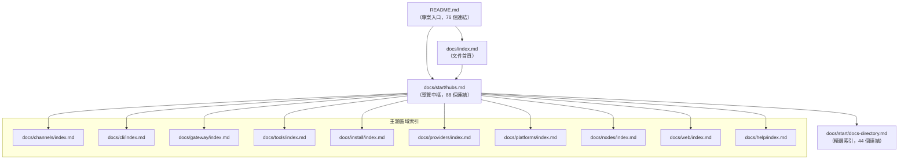
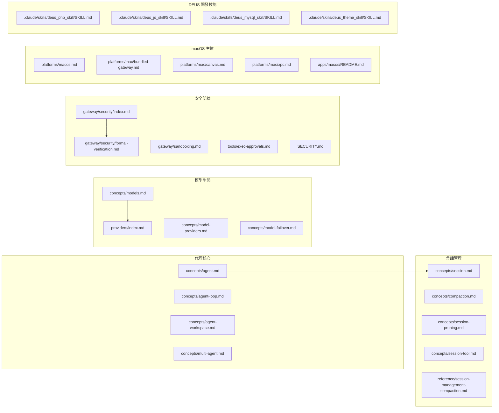

# OpenClaw 專案 Markdown 檔案索引清冊

> 產出日期：2026-02-07
> 掃描範圍：專案根目錄下所有 `.md` 檔案（排除 `node_modules`、`.git`）
> 檔案總數：**801 個**

---

## 目錄

- [概覽摘要](#概覽摘要)
- [統計概覽](#統計概覽)
- [一、專案根目錄](#一專案根目錄)
- [二、Swabble 子專案](#二swabble-子專案)
- [三、apps — 行動與桌面應用](#三apps--行動與桌面應用)
- [四、assets — 靜態資源](#四assets--靜態資源)
- [五、.github — GitHub 專案治理](#五github--github-專案治理)
- [六、.agent / .agents — 自動化工作流](#六agent--agents--自動化工作流)
- [七、.pi — Pi 編碼代理提示](#七pi--pi-編碼代理提示)
- [八、docs — 主文件體系（英文）](#八docs--主文件體系英文)
  - [8.1 文件根目錄](#81-文件根目錄)
  - [8.2 docs/start — 入門指南](#82-docsstart--入門指南)
  - [8.3 docs/install — 安裝部署](#83-docsinstall--安裝部署)
  - [8.4 docs/concepts — 核心概念](#84-docsconcepts--核心概念)
  - [8.5 docs/channels — 通訊管道整合](#85-docschannels--通訊管道整合)
  - [8.6 docs/cli — CLI 命令參考](#86-docscli--cli-命令參考)
  - [8.7 docs/gateway — Gateway 服務](#87-docsgateway--gateway-服務)
  - [8.8 docs/tools — 代理工具](#88-docstools--代理工具)
  - [8.9 docs/nodes — 節點裝置](#89-docsnodes--節點裝置)
  - [8.10 docs/web — Web 介面](#810-docsweb--web-介面)
  - [8.11 docs/providers — 模型提供商](#811-docsproviders--模型提供商)
  - [8.12 docs/platforms — 平台指南](#812-docsplatforms--平台指南)
  - [8.13 docs/plugins — 外掛系統](#813-docsplugins--外掛系統)
  - [8.14 docs/automation — 自動化](#814-docsautomation--自動化)
  - [8.15 docs/reference — 參考文件](#815-docsreference--參考文件)
  - [8.16 docs/refactor — 重構計畫](#816-docsrefactor--重構計畫)
  - [8.17 docs/experiments — 實驗性功能](#817-docsexperiments--實驗性功能)
  - [8.18 docs/help — 求助中心](#818-docshelp--求助中心)
  - [8.19 docs/其他](#819-docs其他)
- [九、docs/zh-CN — 簡體中文翻譯鏡像](#九docszh-cn--簡體中文翻譯鏡像)
- [十、extensions — 外掛擴展](#十extensions--外掛擴展)
- [十一、skills — 代理技能](#十一skills--代理技能)
- [十二、src/hooks — 內建 Hook](#十二srchooks--內建-hook)
- [十三、vendor/a2ui — 第三方 A2UI 規範](#十三vendora2ui--第三方-a2ui-規範)
- [十四、.claude/skills — DEUS 開發技能](#十四claudeskills--deus-開發技能)
- [十五、deus_data — 專案分析資料](#十五deus_data--專案分析資料)
- [檔案間關聯圖譜](#檔案間關聯圖譜)
- [孤立檔案清單](#孤立檔案清單)

---

## 概覽摘要

OpenClaw 是一個多通道 AI 代理閘道平台，可在 WhatsApp、Telegram、Slack、Discord 等 20+ 通訊管道上執行個人 AI 助手。專案採用 TypeScript / Node.js 技術堆疊，以 Monorepo 方式組織，涵蓋：

- **核心 Gateway 服務**：WebSocket 伺服器、代理運行時、會話管理
- **多通道整合**：20+ 通訊平台外掛
- **行動與桌面應用**：macOS（Swift）、iOS（SwiftUI）、Android（Kotlin）
- **豐富的代理技能**：50+ 技能，整合 GitHub、Notion、Spotify、智慧家居等
- **完善的文件體系**：300+ 英文文件 + 305 簡體中文翻譯鏡像

文件結構採用 **Mintlify** 文件框架，使用根相對路徑連結（無 `.md` 副檔名），以 Hub-Spoke 模式組織導覽。

---

## 統計概覽

| 類別 | 檔案數量 |
|------|---------|
| 專案根目錄 | 8 |
| Swabble 子專案 | 3 |
| apps（行動/桌面應用） | 6 |
| assets | 1 |
| .github（專案治理） | 2 |
| .agent / .agents（自動化） | 4 |
| .pi（提示集） | 4 |
| docs（英文主文件） | 313 |
| docs/zh-CN（簡中翻譯鏡像） | 305 |
| extensions（外掛擴展） | 48 |
| skills（代理技能） | 57 |
| src/hooks（內建 Hook） | 6 |
| vendor/a2ui（第三方） | 9 |
| .claude/skills（DEUS 開發技能） | 34 |
| deus_data | 1 |
| **合計** | **801** |

---

## 一、專案根目錄

| 檔案名稱 | 相對路徑 | 用途說明 | 分類 | 目標受眾 |
|---------|---------|---------|------|---------|
| README.md ✅ PROCESSED | `./README.md` | 專案主頁與完整入口文件（約 500 行），涵蓋七大區塊：（1）**專案定位與安裝**：介紹 OpenClaw 為個人 AI 助手平台，支援 Node ≥22 執行環境，提供 `npm install -g openclaw@latest` 與 `openclaw onboard --install-daemon` 一鍵安裝流程，並說明 stable/beta/dev 三軌版本通道切換機制；（2）**快速啟動與源碼開發**：包含 Gateway 啟動、訊息傳送、Agent 互動的最小範例，以及 pnpm 源碼建構與 `gateway:watch` 熱重載開發迴圈；（3）**安全預設**：詳述 DM 配對機制（`dmPolicy="pairing"`），未知發送者需透過 `openclaw pairing approve` 核准，並建議使用 `openclaw doctor` 檢查風險設定；（4）**功能亮點**：列舉 Gateway WebSocket 控制面板、20+ 通訊管道收件匣（WhatsApp/Telegram/Slack/Discord/Google Chat/Signal/BlueBubbles/iMessage/MS Teams/Matrix/Zalo/WebChat）、多代理路由、Voice Wake 語音喚醒、Talk Mode 連續對話、Live Canvas 視覺工作區、A2UI 整合、伴侶應用（macOS/iOS/Android）、50+ 技能系統與 ClawHub 技能註冊表；（5）**架構與子系統**：以 ASCII 圖表呈現 Gateway 控制面板架構，說明 Tailscale Serve/Funnel 遠端存取、SSH 通道、macOS TCC 權限模型、Agent-to-Agent sessions 跨工作階段協作（`sessions_list`/`sessions_history`/`sessions_send`）；（6）**通道設定速查**：逐一列出 WhatsApp、Telegram、Slack、Discord、Signal、BlueBubbles、iMessage、MS Teams、WebChat 的最小設定範例（JSON5 格式）；（7）**文件導覽與社群**：提供 76+ 個外部連結，分為入門文件、進階文件、操作排錯、深度剖析、工作區技能、平台內部實作等分類，尾部包含貢獻者頭像牆與專案起源故事（Molty 太空龍蝦助手）。此檔案是整個專案的核心入口點，連結密度極高，適合所有角色閱讀。 | 專案總覽 | 所有人 |
| CHANGELOG.md ✅ PROCESSED | `./CHANGELOG.md` | 專案版本更新紀錄，採用日期制版號（`YYYY.M.D` 格式，如 `2026.2.6`），每個版本區塊分為 Changes（行為變更）、Added（新增功能）、Fixes（修復項目）三個子段落。最新版本 2026.2.6 的重點異動包括：Cron 排程系統大幅重構（預設 `wakeMode` 改為 `"now"`、新增執行歷史深連結、修復計時器漂移與鎖競爭問題）、新增 xAI（Grok）與百度 Qianfan 模型提供商支援、Anthropic Opus 4.6 與 OpenAI Codex gpt-5.3-codex 前向相容、原生 Voyage AI 記憶體嵌入支援、Web UI 新增令牌用量儀表板。安全修復方面涵蓋 Gateway Canvas Host 認證加固、技能/外掛程式碼安全掃描器、憑證從 config.get 回應中遮蔽。歷史版本回溯至早期開發階段，每筆變更均標注對應的 GitHub Issue/PR 編號與貢獻者致謝（如 `#10776 Thanks @tyler6204`），便於追溯具體程式碼變更。此檔案是了解專案演進歷程、判斷功能成熟度、追蹤已知問題修復狀態的關鍵文件。 | 版本紀錄 | 開發者/使用者 |
| CONTRIBUTING.md ✅ PROCESSED | `./CONTRIBUTING.md` | 社群貢獻指南（約 79 行），涵蓋四大面向：（1）**社群連結**：GitHub 儲存庫、Discord 伺服器、X/Twitter 帳號快速入口；（2）**維護者名單**：列出 5 位核心維護者及其負責領域——Peter Steinberger（專案領導者，Benevolent Dictator）、Shadow（Discord + Slack 子系統）、Jos（Telegram、API、Nix 模式）、Christoph Nakazawa（JS 基礎設施）、Gustavo Madeira Santana（多代理、CLI、Web UI）；（3）**貢獻流程**：小型修復直接開 PR，新功能或架構變更需先在 GitHub Discussion 或 Discord 討論，問題諮詢可至 Discord #setup-help 頻道。PR 前需通過本地測試（`pnpm build && pnpm check && pnpm test`），保持 PR 聚焦單一主題；（4）**AI 輔助 PR 政策**：明確歡迎 AI/Vibe-Coded PR，要求標註 AI 輔助程度、測試範圍、附上提示詞或工作階段記錄。此外說明 Control UI 使用 Lit 搭配舊版裝飾器（legacy decorators），`tsconfig.json` 設定 `experimentalDecorators: true`。當前開發重點為穩定性（WhatsApp/Telegram 邊界案例）、UX（Onboarding 精靈與錯誤訊息）、技能擴展、效能最佳化（令牌用量與壓縮邏輯）。 | 社群治理 | 貢獻者 |
| SECURITY.md ✅ PROCESSED | `./SECURITY.md` | 安全政策文件（約 73 行），定義漏洞回報與安全邊界：（1）**漏洞回報管道**：透過 `steipete@gmail.com` 私下回報，需附上重現步驟、影響評估與最小 PoC；（2）**無賞金計畫聲明**：專案為開源社群專案，無 Bug Bounty 預算，鼓勵以 PR 形式貢獻修復；（3）**排除範圍**：公開網路曝露、違反文件建議的使用方式、Prompt Injection 攻擊均不在安全範圍內；（4）**操作指引**：引導至 `docs.openclaw.ai/gateway/security` 查看威脅模型與強化指南，包含 `openclaw security audit --deep` 與 `--fix` 命令；（5）**Web 介面安全警告**：Web 介面僅供本地使用，未經公開網路強化，禁止綁定至公開 IP；（6）**執行環境安全需求**：要求 Node.js ≥22.12.0（包含 CVE-2025-59466 async_hooks DoS 與 CVE-2026-21636 Permission Model Bypass 修補）；（7）**Docker 安全最佳實踐**：官方映像以非 root 使用者（`node`）執行，建議搭配 `--read-only` 與 `--cap-drop=ALL` 旗標；（8）**秘密掃描**：使用 `detect-secrets` 工具於 CI/CD 中自動偵測洩漏的秘密，設定檔為 `.detect-secrets.cfg`，基線檔為 `.secrets.baseline`。 | 安全政策 | 安全研究者 |
| AGENTS.md ✅ PROCESSED | `./AGENTS.md` | 儲存庫層級的 AI 代理與開發者操作指引（約 190 行），是 AI 編碼代理（如 Claude、Codex、Pi）與人類開發者在此專案中工作的核心行為手冊。涵蓋：（1）**專案結構與模組組織**：定義 `src/` 原始碼目錄（CLI 於 `src/cli`、命令於 `src/commands`、Web Provider 於 `src/provider-web.ts`、基礎設施於 `src/infra`、媒體管線於 `src/media`）、測試共置（`*.test.ts`）、外掛於 `extensions/*` 為獨立工作區套件、通訊管道需同時考量所有內建與擴展管道；（2）**Mintlify 文件連結規範**：內部連結使用根相對路徑且不帶 `.md` 副檔名、標題避免 em dash 與撇號、對外回覆使用完整 `https://docs.openclaw.ai/` URL；（3）**i18n 翻譯管線**：`docs/zh-CN/` 為自動生成，不直接編輯，需透過詞彙表與 `scripts/docs-i18n` 腳本更新；（4）**建構與測試指令**：`pnpm install` → `pnpm build` → `pnpm check` → `pnpm test`（Vitest，V8 覆蓋率門檻 70%），偏好 Bun 執行 TypeScript；（5）**編碼風格**：TypeScript ESM、Oxlint/Oxfmt 格式化、檔案上限約 700 LOC、使用 `createDefaultDeps` 依賴注入、產品名稱用 OpenClaw / CLI 用 `openclaw`；（6）**Commit 與 PR 工作流**：使用 `scripts/committer` 提交、偏好 rebase 線性歷史、PR 合併後需新增 CHANGELOG 條目並致謝貢獻者、新貢獻者需加入 README 頭像牆；（7）**多代理安全規則**：禁止未經授權的 git stash/worktree/branch 操作、各代理維持獨立工作階段、僅提交自身變更；（8）**平台特定注意事項**：macOS 透過 App 管理 Gateway 而非臨時 tmux、SwiftUI 偏好 Observation 框架、版本號分佈於 `package.json`/iOS Info.plist/Android build.gradle.kts/macOS Info.plist 等多處。 | 開發指南 | 開發者/AI 代理 |
| CLAUDE.md ✅ PROCESSED | `./CLAUDE.md` | 專案系統性分析與逆向工程指南（繁體中文，約 600+ 行），為 Claude Code AI 代理提供一套完整的 GitHub 專案架構分析方法論。文件定義三大核心能力（快速偵察、逆向推導、清晰表達）並規範十個分析階段的執行流程：（1）專案總覽偵察（README/LICENSE/CHANGELOG/CONTRIBUTING 閱讀）、（2）目錄結構解讀（目錄樹產生、架構風格判斷、Mermaid 模組關係圖）、（3）依賴關係拓撲（五大類別歸類：Framework/Data/Communication/Infra/DevTools）、（4）進入點與啟動流程（main 函式追蹤、啟動序列圖）、（5）核心架構模式辨識（MVC/Clean Architecture/Hexagonal/Event-Driven/CQRS/Microservices 等）、（6）資料流與狀態管理追蹤（典型 API 請求生命週期）、（7）API 介面與對外契約（端點清單、認證機制、錯誤處理模式）、（8）測試策略與品質保障（測試分層、覆蓋率評估）、（9）建置與部署管線（CI/CD 流程圖）、（10）綜合分析報告產出（含架構品質 1-5 評分矩陣）。嚴格規範輸出語言為台灣繁體中文，附有完整的詞彙對照表（如「使用者」取代「用戶」、「設定」取代「配置」），並設有 6 項分析原則（先觀察再推論、區分事實與推測、關注設計意圖、追蹤邊界例外、保持實用導向、承認不確定性）與自我檢查清單。 | AI 分析框架 | AI 代理 |
| CLAUDE.md.deprecated ✅ PROCESSED | `./CLAUDE.md.deprecated` | 已棄用的符號連結（symlink），實際指向 `./AGENTS.md`。這代表專案曾經使用 `CLAUDE.md` 作為 AI 代理的工作指引檔名（遵循 Claude Code 慣例），後來將其重新命名為更通用的 `AGENTS.md`（適用於所有 AI 編碼代理），並保留此 deprecated 檔案作為向後相容的過渡。讀者應直接參考 `AGENTS.md` 取得最新的儲存庫操作指引，此符號連結無獨立內容。 | 已棄用 | — |
| docs.acp.md ✅ PROCESSED | `./docs.acp.md` | ACP（Agent Client Protocol）橋接器完整技術文件（約 198 行），定義 IDE 與 OpenClaw Gateway 之間的通訊協定。核心架構為 `openclaw acp` 透過 stdio（NDJSON 格式）對外暴露 ACP 代理介面，內部轉發至 Gateway WebSocket。涵蓋：（1）**使用情境**：IDE 或工具鏈支援 ACP 時，可透過此橋接器驅動 Gateway 工作階段，支援本地或遠端 Gateway；（2）**代理選擇**：ACP 不直接選擇代理，而是透過 Gateway session key 路由，支援 `agent:main:main`、`agent:design:main` 等命名慣例的代理範圍工作階段鍵；（3）**Zed 編輯器整合範例**：提供 `~/.config/zed/settings.json` 的 `agent_servers` 設定範本，可指定 Gateway URL、Token 與目標代理工作階段；（4）**執行模型**：ACP `prompt` 映射至 Gateway `chat.send`，串流事件雙向轉譯，`cancel` 映射至 `chat.abort`，終態對應為 `complete→stop`、`aborted→cancel`、`error→error`；（5）**工作階段映射**：預設產生 `acp:<uuid>` 隔離鍵，可透過 CLI 旗標（`--session`/`--session-label`/`--reset-session`）或 ACP `_meta` 欄位覆寫，支援 `sessionKey`/`sessionLabel`/`resetSession`/`requireExisting` 四種模式；（6）**認證與 Gateway 探索**：優先使用 CLI 旗標（`--url`/`--token`/`--password`），否則讀取 `gateway.remote.*` 設定；（7）**相容性**：使用 `@agentclientprotocol/sdk` 0.13.x，支援 ACP 的 `initialize`/`newSession`/`loadSession`/`prompt`/`cancel`/`listSessions` 操作。關聯文件：`docs/cli/acp.md`、`docs/concepts/session.md`。 | 協定文件 | 開發者 |

---

## 二、Swabble 子專案

| 檔案名稱 | 相對路徑 | 用途說明 | 分類 |
|---------|---------|---------|------|
| README.md ✅ PROCESSED | `Swabble/README.md` | Swabble 子專案完整介紹文件（約 112 行），定義一個 Swift 6.2 語音喚醒詞守護程式，專為 macOS 26 設計，使用 Apple Speech.framework（SpeechAnalyzer + SpeechTranscriber）實現完全本地端（零網路）語音辨識。核心功能包括：（1）**喚醒詞偵測**：預設喚醒詞 `clawd`（別名 `claude`），可透過 `--no-wake` 旗標繞過；（2）**SwabbleKit 共享程式庫**：多平台（iOS 17+/macOS 15+）喚醒詞門控工具，提供基於語音片段間隙的觸發偵測；（3）**Hook 執行協定**：喚醒後執行任意 Shell 命令，支援 prefix/env/cooldown（1 秒）/min_chars（24 字元）/timeout（5 秒）參數，注入 `SWABBLE_TEXT` 與 `SWABBLE_PREFIX` 環境變數；（4）**完整 CLI 命令集**：`serve`（前景守護迴圈）、`transcribe`（離線音檔轉錄為 TXT/SRT）、`test-hook`、`mic list/set`、`setup`（產生預設 config.json）、`doctor`（檢查 Speech 授權與裝置可用性）、`health`、`tail-log`、`status`、`service install/uninstall/status`（launchd plist 管理佔位）；（5）**設定檔**：`~/.config/swabble/config.json`，涵蓋 audio（裝置/取樣率/聲道）、wake（喚醒詞/別名）、hook（命令/參數/前綴/冷卻/超時/環境變數）、logging（等級/格式）、transcripts（啟用/最大筆數）、speech（語言區域/禮貌用語替換）；（6）**語音管線**：`AVAudioEngine` tap → `BufferConverter` → `AnalyzerInput` → `SpeechAnalyzer`，請求 volatile + final 結果。可作為 SwiftPM 相依性嵌入其他應用程式。 | 子專案總覽 |
| CHANGELOG.md ✅ PROCESSED | `Swabble/CHANGELOG.md` | Swabble 版本變更紀錄（目前僅一個版本 0.2.0，2025-12-23 發布），記錄兩項重點變更：新增 `SwabbleKit` 多平台喚醒詞門控工具程式庫（支援 iOS + macOS，具備基於語音片段間隙的偵測能力），以及將 CLI 的喚醒詞匹配/剝離邏輯路由至 `SwabbleKit` helpers。Speech 管線型別明確標註 macOS 26 / iOS 26 可用性門控。此檔案篇幅極短，反映專案處於早期開發階段。 | 版本紀錄 |
| spec.md ✅ PROCESSED | `Swabble/docs/spec.md` | Swabble 技術規格書（約 34 行），作為專案的架構設計藍圖與實作規範。涵蓋：（1）**目標定義**：類 brabble 風格的 always-on 語音 Hook，使用 Apple Speech.framework 取代 whisper.cpp；（2）**需求規格**：macOS 26+、Swift 6.2、完全本地處理、喚醒詞門控、Hook 執行（cooldown/min_chars/timeout/prefix/env）、JSON Codable 設定檔（不使用 TOML）、CLI 使用 Commander 框架（steipete/Commander SwiftPM 套件）；（3）**架構分層**：CLI 層（Commander 子命令體系）、Config 層（`SwabbleConfig` Codable 結構）、Audio + Speech Pipeline 層（`SpeechPipeline` 包裝 `AVAudioEngine` → `SpeechAnalyzer` + `SpeechTranscriber`）、Wake Gate 層（CLI 文字匹配 + SwabbleKit 片段感知間隙偵測）、Hook Executor 層（async Process 生成，`${hostname}` 前綴替換）、Transcripts Store 層（記憶體環形緩衝區 + 可選 JSON Lines 持久化）；（4）**範圍外項目**：模型管理（由 Speech 框架處理）、launchd Helper（規劃中）、進階喚醒詞偵測器；（5）**待定設計決策**：UNIX 控制 socket 介面選擇、PII 遮蔽功能（brabble 對等功能，目前僅佔位布林值）。 | 技術規格 |

---

## 三、apps — 行動與桌面應用

| 檔案名稱 | 相對路徑 | 用途說明 | 分類 |
|---------|---------|---------|------|
| README.md ✅ PROCESSED | `apps/android/README.md` | Android 節點應用開發指南（約 52 行），說明以 Kotlin + Jetpack Compose 建構的內部專用 Android 節點客戶端。應用透過 mDNS 服務探測（`_openclaw-gw._tcp`）自動發現 Gateway WebSocket，並暴露 Canvas、Chat、Camera 三大能力。技術重點：Foreground Service 持久通知（含 Disconnect 按鈕）維持連線、Chat 使用共享 session key `main`（跨 iOS/macOS/WebChat/Android 同步）、最低 SDK 31。建置指令為 Gradle 標準流程（`./gradlew :app:assembleDebug`/`installDebug`/`testDebugUnitTest`）。配對流程需先在主機啟動 Gateway，再由 Android 端設定頁發現或手動輸入 Gateway 位址，最後由 Gateway CLI 核准（`openclaw nodes approve`）。必要 Android 權限：`NEARBY_WIFI_DEVICES`（Android 13+）、`ACCESS_FINE_LOCATION`（Android 12-）、`POST_NOTIFICATIONS`、`CAMERA`、`RECORD_AUDIO`。 | 行動應用 |
| README.md ✅ PROCESSED | `apps/ios/README.md` | iOS 應用開發指南（約 29 行），說明內部專用 SwiftUI iOS 應用鷹架。涵蓋開發工具需求（`swiftformat` + `swiftlint` 經由 Homebrew 安裝）、Xcode 專案產生流程（`xcodegen generate` 於 `apps/ios` 目錄執行後開啟 `OpenClaw.xcodeproj`）、共享套件 `../shared/OpenClawKit`（型別與常數共享，供 iOS/macOS bridge/Gateway routing 使用），以及 fastlane 整合（指向 `apps/ios/fastlane/SETUP.md` 了解 App Store Connect 認證與上傳 lanes）。 | 行動應用 |
| SETUP.md ✅ PROCESSED | `apps/ios/fastlane/SETUP.md` | iOS fastlane 自動化建置設定指南（約 33 行），提供逐步操作流程：（1）經由 Homebrew 安裝 fastlane；（2）在 App Store Connect > Users and Access > Keys 建立 API 金鑰，下載 `.p8` 檔案並記錄 Issuer ID 與 Key ID；（3）建立 gitignored `.env` 檔案（位於 `apps/ios/fastlane/.env`），設定 `ASC_KEY_ID`、`ASC_ISSUER_ID`、`ASC_KEY_PATH`（`.p8` 絕對路徑）、`IOS_DEVELOPMENT_TEAM`（Apple Team ID）；（4）若缺少 Team ID 可執行 `scripts/ios-team-id.sh` 輔助查詢；（5）執行 `fastlane beta` 啟動 Beta 發佈通道。 | 建置部署 |
| README.md ✅ PROCESSED | `apps/macos/README.md` | macOS 應用建構、簽署與打包完整指南（約 65 行），涵蓋：（1）快速開發啟動（`scripts/restart-mac.sh --no-sign` 最快但 TCC 權限不持久、`--sign` 需憑證）；（2）打包流程（`scripts/package-mac-app.sh` 產生 `dist/OpenClaw.app` 並呼叫 `scripts/codesign-mac-app.sh` 簽署）；（3）簽署身份自動選擇優先順序：Developer ID Application > Apple Distribution > Apple Development > 首個可用，找不到時預設報錯（可透過 `ALLOW_ADHOC_SIGNING=1` 或 `SIGN_IDENTITY="-"` 覆寫）；（4）Team ID 審計（Sparkle 不一致防護）：簽署後比對 App Bundle 中所有 Mach-O 二進位的 Team ID 一致性，可透過 `SKIP_TEAM_ID_CHECK=1` 跳過；（5）Library Validation 變通方案：開發情境下 `DISABLE_LIBRARY_VALIDATION=1` 新增 `com.apple.security.cs.disable-library-validation` entitlement；（6）完整環境變數旗標一覽表。 | 桌面應用 |
| NOTICE.md ✅ PROCESSED | `apps/macos/Sources/OpenClaw/Resources/DeviceModels/NOTICE.md` | Apple 設備型號對應資料授權聲明（約 10 行），記錄目錄內的 Apple Model Identifier 對人類可讀名稱映射資料來源為開源專案 `kyle-seongwoo-jun/apple-device-identifiers`，iOS 映射鎖定至 commit `8e7388b`、macOS 映射鎖定至 commit `98ca753`，完整授權條款見同目錄下的 `LICENSE.apple-device-identifiers.txt`。 | 授權聲明 |

---

## 四、assets — 靜態資源

| 檔案名稱 | 相對路徑 | 用途說明 | 分類 |
|---------|---------|---------|------|
| README.md ✅ PROCESSED | `assets/chrome-extension/README.md` | Chrome 擴充功能（Browser Relay）安裝與使用指南（約 22 行），說明如何將 OpenClaw 附加至現有 Chrome 分頁以實現 Gateway 自動化控制。運作機制為透過本地 CDP（Chrome DevTools Protocol）中繼伺服器（預設 `http://127.0.0.1:18792/`，埠號可於選項中調整）橋接 Gateway 與瀏覽器。安裝流程：（1）啟動已啟用 Browser Control 的 Gateway；（2）確認中繼伺服器可達；（3）透過 CLI 命令 `openclaw browser extension install` 與 `openclaw browser extension path` 取得擴充功能路徑；（4）在 `chrome://extensions` 啟用開發者模式後載入未打包擴充功能；（5）釘選擴充功能圖示，點擊即可附加/分離目標分頁。 | 瀏覽器擴充 |

---

## 五、.github — GitHub 專案治理

| 檔案名稱 | 相對路徑 | 用途說明 | 分類 |
|---------|---------|---------|------|
| bug_report.md ✅ PROCESSED | `.github/ISSUE_TEMPLATE/bug_report.md` | GitHub Issue 程式錯誤回報範本（約 35 行），包含 YAML front matter（`name: Bug report`，`about: Report a problem or unexpected behavior in Clawdbot`，標籤 `bug`），提供結構化回報欄位：Summary（問題描述）、Steps to reproduce（重現步驟）、Expected behavior（預期行為）、Actual behavior（實際行為）、Environment（Clawdbot 版本/OS/安裝方式 pnpm/npx/docker 等）、Logs or screenshots（附帶秘密遮蔽提醒）。值得注意的是範本中使用「Clawdbot」而非「OpenClaw」作為產品名稱，反映專案可能經歷過品牌更名。 | Issue 範本 |
| feature_request.md ✅ PROCESSED | `.github/ISSUE_TEMPLATE/feature_request.md` | GitHub Issue 功能需求提案範本（約 23 行），包含 YAML front matter（`name: Feature request`，`about: Suggest an idea or improvement for Clawdbot`，標籤 `enhancement`），提供四個結構化欄位：Summary（問題或機會描述）、Proposed solution（建議 Clawdbot 應如何處理）、Alternatives considered（替代方案）、Additional context（連結/截圖/相關 Issue）。同樣使用「Clawdbot」產品名稱，與 bug_report 範本保持一致。 | Issue 範本 |

---

## 六、.agent / .agents — 自動化工作流

| 檔案名稱 | 相對路徑 | 用途說明 | 分類 |
|---------|---------|---------|------|
| update_clawdbot.md ✅ PROCESSED | `.agent/workflows/update_clawdbot.md` | Fork 上游同步完整工作流程文件（約 381 行，為本批次中最長的文件之一），提供 Fork 分支與上游發生分歧時的完整同步指南。涵蓋：（1）快速參考一行指令；（2）分歧評估（`git fetch upstream` + `git log --left-right` 判斷 ahead/behind 數量，附選擇 rebase vs. merge 的決策準則）；（3）Rebase 策略（偏好）：含常見衝突模式對照表（`package.json`/`pnpm-lock.yaml`/`*.patch`/原始碼檔案的衝突處理方式）；（4）Merge 替代策略；（5）全面重建（`pnpm install` → `build` → `ui:build` → `clawdbot doctor`）；（6）macOS App 重建（`scripts/restart-mac.sh` 或 `pnpm mac:package`，含手動安裝至 `/Applications`）；（7）macOS App 與 Agent 驗證（健康檢查、殭屍程序偵測、Telegram Agent 驗證）；（8）Swift/macOS 建構問題排除（Swift 6.2/macOS 26 SDK 不相容處理，含 `FileManager.default` 棄用、`Thread.isMainThread` 棄用、Peekaboo 子模組修復）；（9）驗證與推送（`git push --force-with-lease`）；（10）完整疑難排解區；（11）自動化腳本 `scripts/sync-upstream.sh`。 | 工作流定義 |
| SKILL.md ✅ PROCESSED | `.agents/skills/merge-pr/SKILL.md` | AI 代理 PR Squash 合併技能定義（約 186 行，三階段 PR 工作流的第三步），提供自動化合併已準備好的 PR 的結構化流程。安全規則：僅使用 `gh pr merge --squash`，禁止 `git push`、禁止停止 Gateway、禁止結束 18792 埠程序。前置條件需已執行 `/reviewpr` 與 `/preparepr`（讀取 `.local/review.md` 與 `.local/prep.md` 產出物）。執行步驟：辨識 PR 元資料 → 健全性檢查（草稿狀態/CI 檢查/是否落後 main）→ 執行 `gh pr merge --squash --delete-branch`（CI 待定時使用 `--auto`）→ 取得合併 SHA → 可選感謝留言 → 驗證狀態為 MERGED → 成功後清理 worktree。使用獨立 git worktree（`.worktrees/pr-<PR>`）隔離操作。 | PR 自動化 |
| SKILL.md ✅ PROCESSED | `.agents/skills/prepare-pr/SKILL.md` | AI 代理 PR 準備合併技能定義（約 249 行，三階段 PR 工作流的第二步），負責將已審查的 PR 修復至可合併狀態。安全規則：禁止推送至 main、禁止 `git push`（裸命令）、禁止 `git clean -fdx`、禁止 `git add -A`（僅 stage 特定檔案）。執行步驟：辨識 PR 元資料（作者/head branch/head repo URL）→ Fetch PR branch tip → Rebase 至最新 main（含衝突解決指引，上限 3 次衝突解決）→ 修復 `.local/review.md` 中所有 BLOCKER 與 IMPORTANT 項目（NIT 為可選）→ 更新 CHANGELOG.md → 更新文件 → 使用 `committer` 工具提交 → 執行完整門控（`pnpm install`/`build`/`ui:build`/`check`/`test`，最多 3 輪重試）→ 推送至 PR head branch（安全檢查 head 非 main/master）→ 驗證 PR 未落後 main → 寫入 `.local/prep.md` 摘要產出物。 | PR 自動化 |
| SKILL.md ✅ PROCESSED | `.agents/skills/review-pr/SKILL.md` | AI 代理 PR 結構化審查技能定義（約 229 行，三階段 PR 工作流的第一步），執行唯讀分析評估。安全規則：禁止推送、禁止合併、純唯讀操作。使用獨立 git worktree，先於 `origin/main` 檢查是否已存在相同實作。九步執行流程：辨識 PR 元資料 → 檢查功能/修復是否已存在 main → 自我指派 PR → 閱讀 PR 描述 → 徹底閱讀 diff → 驗證變更必要性與價值（辨識「AI slop」）→ 評估實作品質 → 安全審查（注意 OpenClaw 子代理具完整磁碟存取權限）→ 審查測試。產出結構化報告含 10 個章節（A-J）：TL;DR 建議（READY FOR /preparepr | NEEDS WORK | NEEDS DISCUSSION | NOT USEFUL (CLOSE)）、變更內容、優點、安全發現、關注事項（BLOCKER/IMPORTANT/NIT）、測試、文件狀態、Changelog、後續項目、建議 PR 留言。結果儲存至 `.local/review.md` 供後續步驟使用。 | PR 自動化 |

---

## 七、.pi — Pi 編碼代理提示

| 檔案名稱 | 相對路徑 | 用途說明 | 分類 |
|---------|---------|---------|------|
| cl.md ✅ PROCESSED | `.pi/prompts/cl.md` | 發布前 Changelog 審計提示定義（約 59 行，YAML front matter `description: Audit changelog entries before release`），定義自動化 Changelog 審計流程：透過 `git tag --sort=-version:refname` 找到最後發布標籤，列出所有後續 commit，讀取三個套件的 `[Unreleased]` 區段（`packages/ai`、`packages/tui`、`packages/coding-agent`），逐 commit 檢查是否存在對應 Changelog 條目、外部貢獻格式是否正確（`Description ([#N](url) by [@user](url))`）。特殊規則：影響終端使用者的 `ai`/`agent`/`tui` 變更必須同步複製至 `coding-agent` Changelog。自動提議新增 `### New Features` 區段並徵求使用者確認。Changelog 格式規範：Breaking Changes → Added → Changed → Fixed → Removed，內部與外部貢獻歸屬格式不同。 | 發行工程 |
| is.md ✅ PROCESSED | `.pi/prompts/is.md` | GitHub Issue 診斷與分析提示定義（約 23 行，YAML front matter `description: Analyze GitHub issues (bugs or feature requests)`），接受 Issue 識別碼作為 `$ARGUMENTS`，對每個 Issue 完整閱讀（含所有留言與關聯 Issue/PR）。Bug 處理策略：忽略 Issue 中提供的根因分析（假設大概率錯誤），完整閱讀所有相關程式碼檔案（不截斷），追蹤程式碼路徑，辨識實際根因並提出修復方案。功能需求策略：完整閱讀相關程式碼，提出最精簡的實作方案並列出受影響檔案與所需變更。關鍵限制：僅分析與提案，不執行實作，除非明確被要求。 | 分析工具 |
| landpr.md ✅ PROCESSED | `.pi/prompts/landpr.md` | PR 著陸（合併）工作流提示定義（約 71 行），為較早期的單體式 PR 合併方案（相較於 `.agents/skills/` 的三階段方式）。定義 16 步端對端流程：檢查倉庫清潔度 → 辨識 PR 元資料 → Fast-forward main → 建立臨時基礎分支 → Checkout PR 分支 → Rebase 至臨時基礎 → 修復問題/新增測試/更新 CHANGELOG.md → 決定合併策略（rebase vs. squash，不確定時詢問）→ 執行完整門控（`pnpm lint && pnpm build && pnpm test`）後再提交 → 使用 `committer` 工具提交（含貢獻者歸屬）→ Force-with-lease 推送 PR 分支 → `gh pr merge`（rebase 或 squash，禁止 `gh pr close`）→ 同步 main → PR 留言（land commit SHA + merge commit SHA + 致謝）→ 驗證 MERGED 狀態 → 刪除臨時分支。與三階段 Skills 工作流的關鍵差異：此為一次性完成審查修復、測試與合併的整合方案。 | PR 自動化 |
| reviewpr.md ✅ PROCESSED | `.pi/prompts/reviewpr.md` | PR 審查提示定義（約 106 行），為較早期的 PR 審查方案（相較於 `.agents/skills/review-pr/SKILL.md`）。九步流程：辨識 PR 元資料與上下文（`gh pr view` + 完整 JSON 欄位）→ 仔細閱讀 PR 描述 → 徹底閱讀 diff → 驗證變更必要性/價值性 → 評估實作品質（正確性/設計/效能/安全/向後相容/風格一致性）→ 測試與驗證 → 後續重構/清理 → 關鍵問題判斷 → 結構化產出。產出 7 個章節（A-G）：TL;DR 建議（READY FOR /landpr | NEEDS WORK | NEEDS DISCUSSION）、變更內容、優點、關注事項（BLOCKER/IMPORTANT/NIT）、測試、後續項目、建議 PR 留言。與 Skills 版本差異：不使用 worktree、不儲存 `.local/review.md` 產出物、建議指向 `/landpr` 而非 `/preparepr`、缺少安全發現/文件狀態/Changelog 獨立章節。 | PR 自動化 |

---

## 八、docs — 主文件體系（英文）

### 8.1 文件根目錄

| 檔案名稱 | 相對路徑 | 用途說明 | 分類 |
|---------|---------|---------|------|
| index.md ✅ PROCESSED | `docs/index.md` | 文件主頁與平台入口（約 193 行），採用 Mintlify 文件框架格式（含 YAML front matter、`<Columns>`/`<Card>`/`<Steps>` 自訂元件）。涵蓋六大區塊：（1）**品牌導言**：以深色/淺色模式切換 Logo 與太空龍蝦標語開場，定義 OpenClaw 為自建 AI 代理閘道（Self-hosted Gateway），支援 WhatsApp/Telegram/Discord/iMessage 等通訊管道；（2）**Quick Start 三步驟**：`npm install -g openclaw@latest` → `openclaw onboard --install-daemon` → `openclaw channels login` + `openclaw gateway --port 18789`；（3）**架構概覽**：Mermaid 流程圖呈現 Chat apps + plugins → Gateway → Pi agent / CLI / Web Control UI / macOS app / iOS+Android nodes 的 Hub-Spoke 架構；（4）**六大核心能力**：多管道閘道、外掛通道、多代理路由、媒體支援、Web Control UI、行動節點；（5）**設定指引**：預設使用 Pi binary RPC 模式，附 JSON5 範例展示 `allowFrom` 白名單與 `requireMention` 群組門控；（6）**導覽卡片**：分為 Start Here（Docs hubs/Configuration/Remote access/Channels/Nodes/Help）與 Learn More（Features/Multi-agent/Security/Troubleshooting/Credits）兩組，共 12 個外部連結，串聯整個文件體系。 | 文件首頁 |
| bedrock.md ✅ PROCESSED | `docs/bedrock.md` | Amazon Bedrock Converse API 完整整合指南（約 177 行），說明如何透過 pi-ai 的 Bedrock Converse 串流供應商將 AWS Bedrock 模型接入 OpenClaw。涵蓋：（1）**認證機制**：使用 AWS SDK 預設憑證鏈（環境變數/共享設定/Instance Role），非 API Key 方式，憑證來源優先順序為 `AWS_BEARER_TOKEN_BEDROCK` → `AWS_ACCESS_KEY_ID` + `AWS_SECRET_ACCESS_KEY` → `AWS_PROFILE` → SDK 預設鏈；（2）**自動模型發現**：透過 `bedrock:ListFoundationModels` API 自動掃描支援串流與文字輸出的模型，結果預設快取 1 小時，可設定 `providerFilter` 篩選特定供應商（如 `anthropic`、`amazon`）；（3）**手動設定範例**：完整 JSON5 設定區塊，包含 `amazon-bedrock` provider 定義、`bedrock-converse-stream` API 模式、Claude Opus 4.6 模型設定（含 reasoning/input/cost/contextWindow/maxTokens 欄位）；（4）**EC2 Instance Role 整合**：詳述 IMDS 認證變通方案（設定 `AWS_PROFILE=default`），附完整 IAM 角色建立與掛載腳本（`aws iam create-role`/`associate-iam-instance-profile`），所需權限為 `InvokeModel`/`InvokeModelWithResponseStream`/`ListFoundationModels`。 | 模型提供商 |
| brave-search.md ✅ PROCESSED | `docs/brave-search.md` | Brave Search API 設定指南（約 42 行），說明 OpenClaw 以 Brave Search 作為 `web_search` 工具的預設搜尋供應商。內容包含：（1）API 金鑰取得流程：註冊 Brave Search API 帳號 → 選擇 Data for Search 方案 → 產生金鑰；（2）JSON5 設定範例：`tools.web.search` 區塊，含 `provider: "brave"`、`apiKey`、`maxResults: 5`、`timeoutSeconds: 30`；（3）注意事項：Data for AI 方案不相容於 `web_search`，免費層有速率限制。關聯文件：`docs/tools/web.md`。 | 工具整合 |
| broadcast-groups.md ✅ PROCESSED | `docs/broadcast-groups.md` | WhatsApp 廣播群組完整技術文件（約 443 行，實驗性功能，2026.1.9 新增），定義多代理同時處理同一訊息的機制。涵蓋：（1）**核心概念**：透過 `broadcast` 設定區塊，將 WhatsApp 群組 JID 或 E.164 電話號碼對應至多個代理 ID，使一則訊息被多個專職代理同步處理；（2）**四大使用情境**：專職代理團隊（Code Reviewer + Documentation Bot + Security Auditor + Test Generator）、多語言支援、品質保證工作流、任務自動化；（3）**處理策略**：parallel（預設，同步執行）與 sequential（依序等待），透過 `broadcast.strategy` 設定切換；（4）**工作階段隔離**：每個代理維持完全獨立的 session key、對話紀錄、工作區、工具存取與記憶體/上下文，但共享群組上下文緩衝區；（5）**路由優先順序**：broadcast 優先於 bindings，不繞過管道白名單與群組啟用規則；（6）**TypeScript 介面定義**：`broadcast?: { strategy?: "parallel" | "sequential"; [peerId: string]: string[] }`；（7）**限制與未來規劃**：建議上限 10 個代理、代理間不可見彼此回應、目前僅支援 WhatsApp（Telegram/Discord/Slack 規劃中），未來計畫包含共享上下文模式、代理協調、動態代理選擇。 | 功能說明 |
| date-time.md ✅ PROCESSED | `docs/date-time.md` | 日期時間處理跨元件正規化完整指南（約 129 行），定義 OpenClaw 在訊息封套、系統提示、工具負載與連接器之間的時間戳處理策略。涵蓋：（1）**訊息封套時間戳**：預設使用主機本地時間（分鐘精度），格式為 `[Provider ... YYYY-MM-DD HH:MM TZ]`，可透過 `envelopeTimezone` 切換為 `utc`/`local`/`user`/IANA 時區，`envelopeTimestamp` 與 `envelopeElapsed` 可獨立開關；（2）**系統提示時區注入**：已知使用者時區時注入 `Time zone: America/Chicago` 等資訊（僅時區，不含時鐘格式，以維持 prompt caching 穩定性），需要精確時間時透過 `session_status` 工具取得；（3）**時間格式偵測**：`timeFormat: "auto"` 時檢查 OS 偏好（macOS/Windows），結果快取於程序生命週期；（4）**工具負載正規化**：保留原始供應商時間戳，額外附加 `timestampMs`（epoch 毫秒 UTC）與 `timestampUtc`（ISO 8601 UTC）正規化欄位，涵蓋 Slack/Discord/Telegram/WhatsApp 各自格式。關聯文件：`docs/concepts/system-prompt.md`、`docs/concepts/timezone.md`、`docs/concepts/messages.md`。 | 設定參考 |
| debugging.md ✅ PROCESSED | `docs/debugging.md` | 除錯工具與監視模式完整指南（約 163 行），涵蓋開發者在串流輸出、推理洩漏與快速迭代中所需的除錯能力。內容包含：（1）**Runtime Debug 覆寫**：`/debug` 聊天命令（需 `commands.debug: true` 啟用），支援 `show`/`set`/`unset`/`reset` 操作，變更僅存於記憶體不寫入磁碟；（2）**Gateway Watch Mode**：`pnpm gateway:watch --force` 啟動檔案監視自動重啟（底層為 `tsx watch`），可傳入任意 gateway CLI 旗標；（3）**Dev Profile 隔離**：兩層 `--dev` 旗標——全域 `--dev`（Profile 隔離至 `~/.openclaw-dev`，預設埠 19001）與 `gateway --dev`（自動建立預設設定/工作區、跳過 BOOTSTRAP.md、預設身份為 C3-PO 協定機器人、`OPENCLAW_SKIP_CHANNELS=1` 跳過通道）；（4）**Raw Stream 日誌**：OpenClaw 層級 `--raw-stream`（記錄格式化前的原始助手串流至 `~/.openclaw/logs/raw-stream.jsonl`）與 pi-mono 層級 `PI_RAW_STREAM=1`（記錄 OpenAI 相容原始 chunk 至 `~/.pi-mono/logs/raw-openai-completions.jsonl`）；（5）**安全注意事項**：原始日誌可能包含完整提示詞、工具輸出與使用者資料，需本地保留並分享前清除秘密與 PII。 | 開發工具 |
| environment.md ✅ PROCESSED | `docs/environment.md` | 環境變數載入來源與優先順序完整說明（約 82 行），定義 OpenClaw 從多源載入環境變數的策略，核心原則為「永不覆寫已存在的值」。優先順序由高到低為：（1）Process 環境（父 shell/daemon 繼承）→（2）工作目錄 `.env`（dotenv 預設，不覆寫）→（3）全域 `~/.openclaw/.env`（不覆寫）→（4）設定檔 `env` 區塊（`env.OPENROUTER_API_KEY` 或 `env.vars.GROQ_API_KEY`，僅填入缺失值）→（5）Login Shell 匯入（`env.shellEnv.enabled` 或 `OPENCLAW_LOAD_SHELL_ENV=1`，僅匯入缺失的預期金鑰，含 15 秒超時）。額外支援設定檔內 `${VAR_NAME}` 語法進行環境變數替換。關聯文件：`docs/gateway/configuration.md`、`docs/help/faq.md`、`docs/concepts/models.md`。 | 設定參考 |
| hooks.md ✅ PROCESSED | `docs/hooks.md` | 事件驅動 Hook 自動化系統完整技術文件（約 917 行，為 docs/ 根目錄中最長的文件之一），定義 OpenClaw 的可擴展事件驅動架構。涵蓋：（1）**Hook 與 Webhook 區分**：Hook 在 Gateway 內部執行（回應代理事件），Webhook 為外部 HTTP 觸發器；（2）**四個內建 Hook**：session-memory（`/new` 時儲存工作階段上下文至 `<workspace>/memory/`，使用 LLM 產生描述性檔名 slug）、command-logger（所有命令事件 JSONL 審計至 `~/.openclaw/logs/commands.log`）、boot-md（Gateway 啟動時執行 `BOOT.md`）、soul-evil（`agent:bootstrap` 事件以機率/時間窗交換 SOUL.md 為 SOUL_EVIL.md）；（3）**三層探索目錄**：workspace hooks → managed hooks（`~/.openclaw/hooks/`）→ bundled hooks，支援 Hook Pack（npm 套件，`package.json` 的 `openclaw.hooks` 欄位）；（4）**HOOK.md 元資料規格**：YAML frontmatter 含 `metadata.openclaw`（emoji/events/export/requires（bins/anyBins/env/config/os）/always/install）；（5）**Handler TypeScript 介面**：`HookHandler` 型別，事件上下文含 `type`（command/session/agent/gateway）、`action`、`sessionKey`、`messages[]`、`context`（含 sessionEntry/workspaceDir/bootstrapFiles/cfg）；（6）**事件類型**：command（new/reset/stop）、agent:bootstrap（可變異 bootstrapFiles）、gateway:startup、tool_result_persist（同步工具結果轉換）；（7）**設定格式**：新格式（`hooks.internal.entries`）與舊格式（`hooks.internal.handlers[]`）相容，支援 per-hook env 與 extraDirs；（8）**完整 CLI 參考**：`openclaw hooks list/info/check/enable/disable`；（9）**架構元件**：列出 8 個核心原始碼檔案路徑（types.ts/workspace.ts/frontmatter.ts/config.ts/hooks-status.ts/loader.ts/hooks-cli.ts/server-startup.ts）。 | 進階功能 |
| logging.md ✅ PROCESSED | `docs/logging.md` | 日誌系統、診斷與 OpenTelemetry 匯出完整指南（約 351 行），涵蓋三大面向：（1）**日誌基礎**：檔案日誌（JSONL 格式，預設 `/tmp/openclaw/openclaw-YYYY-MM-DD.log`）與主控台輸出（TTY 感知），CLI 尾隨（`openclaw logs --follow`，支援 `--json`/`--plain`/`--no-color`），Control UI Logs 分頁即時串流，通道專屬日誌（`openclaw channels logs --channel whatsapp`），日誌等級（`logging.level` 控制檔案，`logging.consoleLevel` 控制主控台），主控台風格（`pretty`/`compact`/`json`），敏感資訊遮蔽（`logging.redactSensitive: "tools"`，支援自訂 regex）；（2）**結構化診斷事件**：機器可讀事件（model.usage/webhook.received/message.queued/queue.lane.enqueue/session.state 等），獨立於日誌存在，可餵入指標/追蹤/匯出器，支援診斷旗標（`diagnostics.flags`，如 `telegram.http`）進行精準除錯；（3）**OpenTelemetry 匯出**：透過 `diagnostics-otel` 外掛以 OTLP/HTTP(protobuf) 匯出至任意 OTel 收集器，支援 Metrics（計數器+直方圖，含 token 用量/成本/訊息流/佇列深度）、Traces（model usage + webhook/message 處理 span）、Logs（OTLP 日誌匯出），完整列出所有 metric 名稱/型別/屬性與 span 名稱/屬性，支援取樣率（`sampleRate`）與刷新間隔（`flushIntervalMs`）設定。 | 設定參考 |
| multi-agent-sandbox-tools.md ✅ PROCESSED | `docs/multi-agent-sandbox-tools.md` | 多代理沙箱與工具限制完整設定指南（約 397 行），定義每個代理獨立安全剖面的機制。涵蓋：（1）**per-agent 沙箱**：`agents.list[].sandbox` 覆寫 `agents.defaults.sandbox`，支援 mode（off/non-main/all）、scope（session/agent/shared）、Docker setupCommand；（2）**per-agent 認證隔離**：每個代理讀取自己的 `~/.openclaw/agents/<agentId>/agent/auth-profiles.json`，禁止跨代理共用 agentDir；（3）**四個設定範例**：Personal + Restricted Family Agent、Work Agent with Shared Sandbox、Global coding profile + messaging-only agent、不同沙箱模式組合；（4）**工具限制八層優先順序**：Tool profile → Provider tool profile → Global tool policy → Provider tool policy → Agent-specific tool policy → Agent provider policy → Sandbox tool policy → Subagent tool policy，每層只能進一步限制不能恢復已拒絕工具；（5）**Tool Groups 速記**：`group:runtime`/`group:fs`/`group:sessions`/`group:memory`/`group:ui`/`group:automation`/`group:messaging`/`group:nodes`/`group:openclaw`；（6）**Elevated Mode**：全域基線（發送者白名單）+ per-agent 進一步限制；（7）**non-main 陷阱**：基於 `session.mainKey` 而非 agent id，群組/通道工作階段總是被視為 non-main。關聯文件：`docs/gateway/sandboxing.md`、`docs/gateway/sandbox-vs-tool-policy-vs-elevated.md`。 | 安全設定 |
| network.md ✅ PROCESSED | `docs/network.md` | 網路架構導覽中樞頁面（約 55 行），彙整 OpenClaw 在 localhost、LAN 與 tailnet 之間連線、配對與安全的核心文件連結。分為四大區塊：（1）**Core Model**：Gateway 架構/協定/Runbook/Web 表面與綁定模式（4 個連結）；（2）**Pairing + Identity**：DM 配對總覽/Gateway 節點配對/Devices CLI/Pairing CLI，附 Local Trust 說明（loopback 與 Gateway 主機自身 tailnet 位址可自動核准配對）；（3）**Discovery + Transports**：探測與傳輸/Bonjour mDNS/SSH 遠端存取/Tailscale（4 個連結）；（4）**Nodes + Transports**：Nodes 總覽/Bridge Protocol（舊版）/iOS Runbook/Android Runbook（4 個連結）；（5）**Security**：安全總覽/Gateway 設定/排錯/Doctor（4 個連結）。本頁不含獨立技術內容，純粹作為網路相關文件的索引樞紐。 | 架構文件 |
| perplexity.md ✅ PROCESSED | `docs/perplexity.md` | Perplexity Sonar 搜尋工具設定指南（約 81 行），說明如何將 Perplexity Sonar 接入 OpenClaw 的 `web_search` 工具。涵蓋：（1）**兩種 API 路徑**：Perplexity 直連（`https://api.perplexity.ai`，`PERPLEXITY_API_KEY`）與 OpenRouter 代理（`https://openrouter.ai/api/v1`，`OPENROUTER_API_KEY`，支援預付/加密貨幣額度）；（2）**設定範例**：`tools.web.search` 區塊含 `provider: "perplexity"`、`perplexity.apiKey`/`baseUrl`/`model`；（3）**自動路由邏輯**：`pplx-...` 金鑰 → 直連 Perplexity，`sk-or-...` 金鑰 → OpenRouter，未知格式 → OpenRouter（安全備用）；（4）**模型選擇**：`sonar`（快速問答+搜尋）、`sonar-pro`（多步推理+搜尋，預設）、`sonar-reasoning-pro`（深度研究）。關聯文件：`docs/tools/web.md`。 | 模型提供商 |
| pi.md ✅ PROCESSED | `docs/pi.md` | Pi 編碼代理整合架構深度技術文件（約 613 行，docs/ 根目錄中技術深度最高的文件），完整揭示 OpenClaw 如何透過直接匯入 pi SDK 的 `createAgentSession()` 嵌入 AI 編碼代理。涵蓋：（1）**套件依賴**：`pi-ai`（LLM 抽象層）、`pi-agent-core`（代理迴圈/工具執行）、`pi-coding-agent`（高階 SDK：AgentSession/SessionManager/AuthStorage/ModelRegistry）、`pi-tui`（終端 UI），版本 0.49.3；（2）**檔案結構**：完整列出 `src/agents/` 目錄下 60+ 個檔案與子目錄，涵蓋 runner/subscribe/block-chunker/messaging/tools/settings/extensions/auth/model/sandbox/system-prompt 等模組；（3）**核心整合流程**：runEmbeddedPiAgent() → createAgentSession() → subscribeEmbeddedPiSession()（事件訂閱：message_start/end/update、tool_execution、turn、agent、auto_compaction）→ session.prompt()；（4）**工具架構**：七層管線（Base Tools → Custom Replacements → OpenClaw Tools → Channel Tools → Policy Filtering → Schema Normalization → AbortSignal Wrapping），splitSdkTools() 以空 builtInTools + 全部 customTools 確保一致性；（5）**系統提示建構**：buildAgentSystemPrompt() 組裝 Tooling/Safety/CLI/Skills/Docs/Workspace/Sandbox/Messaging 等區段；（6）**工作階段管理**：JSONL 樹狀結構、SessionManager 快取、歷史回合限制、自動/手動壓縮；（7）**認證與模型**：多 API Key 旋轉（markAuthProfileFailure/advanceAuthProfile）、FailoverError 觸發模型備援；（8）**Pi 擴展**：Compaction Safeguard（自適應令牌預算）與 Context Pruning（cache-TTL 修剪）；（9）**供應商特殊處理**：Anthropic（refusal 清洗/turn 驗證）、Google/Gemini（turn 排序修正/schema 清理）、OpenAI（apply_patch/thinking 降級）；（10）**與 Pi CLI 差異對照表**：6 個面向比較嵌入式 vs CLI 模式；（11）**測試清單**：列出 70+ 個測試檔案路徑。 | 架構文件 |
| pi-dev.md ✅ PROCESSED | `docs/pi-dev.md` | Pi 整合開發工作流程指南（約 71 行），為開發者提供 Pi 整合層的日常開發迴圈。涵蓋：（1）**型別檢查與 Lint**：`pnpm build`（型別檢查+建構）、`pnpm lint`、`pnpm format`，完整門控 `pnpm lint && pnpm build && pnpm test`；（2）**測試執行**：專用腳本 `scripts/pi/run-tests.sh`（可加 `--live` 執行真實供應商行為測試），Glob 範圍涵蓋 `src/agents/pi-*.test.ts`、`pi-embedded-*.test.ts`、`pi-tools*.test.ts`、`pi-settings.test.ts`、`pi-tool-definition-adapter.test.ts`、`pi-extensions/*.test.ts`；（3）**手動測試**：dev mode Gateway（`pnpm gateway:dev`）、直接觸發代理（`pnpm openclaw agent --message "Hello" --thinking low`）、TUI 互動除錯（`pnpm tui`）；（4）**狀態重置**：`~/.openclaw` 目錄結構說明（`openclaw.json`/`credentials/`/`agents/<agentId>/sessions/`/`sessions.json`/`workspace/`），僅重置 sessions 或完整重置的不同策略。 | 開發指南 |
| plugin.md ✅ PROCESSED | `docs/plugin.md` | 外掛系統（Extensions）完整技術文件（約 665 行），為 OpenClaw 的可擴展架構提供全面說明。涵蓋：（1）**Quick Start**：`openclaw plugins list/install/enable/disable/doctor` CLI 操作；（2）**官方外掛清單**：MS Teams、Memory（Core/LanceDB）、Voice Call、Zalo Personal、Matrix、Nostr、Zalo、Google Antigravity OAuth、Gemini CLI OAuth、Qwen OAuth、Copilot Proxy 等 13 個外掛；（3）**外掛能力**：Gateway RPC 方法、HTTP Handler、Agent Tools、CLI 命令、Background Services、Skills、Auto-reply Commands；（4）**探索與優先順序**：Config paths → Workspace extensions → Global extensions → Bundled extensions，含 Package Packs（`package.json` 的 `openclaw.extensions`）與 Channel Catalog Metadata；（5）**設定**：`plugins.enabled/allow/deny/load.paths/entries.<id>`，嚴格驗證（未知 ID 為錯誤，JSON Schema 驗證 configSchema）；（6）**Plugin Slots**：排他類別機制（`plugins.slots.memory`），同類別僅一個生效；（7）**Plugin API**：registerGatewayMethod/registerCli/registerCommand（auto-reply，處理順序先於 built-in 與 AI 代理）/registerService/registerProvider（模型認證 OAuth 流程）/registerChannel（完整通道外掛步驟指南）；（8）**Plugin Hooks**：外掛可內建 Hook 目錄，透過 `registerPluginHooksFromDir` 註冊；（9）**npm 發佈合約**：`openclaw.extensions` 入口、jiti 載入 TS、scoped 套件正規化至 unscoped ID。 | 擴展性 |
| prose.md ✅ PROCESSED | `docs/prose.md` | OpenProse 工作流程格式與 OpenClaw 整合指南（約 135 行），說明 OpenProse 這個 Markdown-first 可攜式工作流格式在 OpenClaw 中的運作方式。涵蓋：（1）**功能定位**：多代理研究+合成（顯式平行處理）、可重複的核准安全工作流（程式碼審查/事件分流/內容管線）、跨支援代理執行時的可重用 `.prose` 程式；（2）**安裝啟用**：`openclaw plugins enable open-prose` + Gateway 重啟；（3）**Slash Command**：`/prose help/run/compile/examples/update`，支援檔案路徑、handle/slug（`https://p.prose.md/<handle>/<slug>`）、直接 URL；（4）**範例 .prose 檔**：展示 researcher（sonnet）+ writer（opus）雙代理平行研究+合成流程；（5）**狀態管理**：`.prose/` 目錄結構（runs/agents），四種狀態後端——filesystem（預設）、in-context（暫時性）、sqlite（實驗性）、postgres（實驗性）；（6）**OpenClaw 執行時映射**：OpenProse session → `sessions_spawn`、File read/write → `read`/`write`、Web fetch → `web_fetch`；（7）**安全注意事項**：將 `.prose` 檔案視為程式碼，執行前需審查，搭配 OpenClaw 工具白名單與核准閘控制副作用。關聯文件：`docs/tools/lobster.md`（Lobster 確定性核准工作流比較）。 | 外掛文件 |
| scripts.md ✅ PROCESSED | `docs/scripts.md` | 儲存庫輔助腳本慣例與使用指南（約 29 行），定義 `scripts/` 目錄下輔助腳本的角色與管理規範。涵蓋：（1）**定位原則**：腳本為可選輔助工具，僅在文件或發布檢查清單中明確引用時才需執行，優先使用 CLI 表面（如認證監控使用 `openclaw models status --check` 而非腳本）；（2）**跨主機注意事項**：假設腳本為主機特定，於新機器執行前需先閱讀內容確認相容性；（3）**認證監控腳本**：指向 `/automation/auth-monitoring` 文件取得詳細說明；（4）**新增腳本規範**：保持腳本聚焦單一用途並附帶說明，於相關文件中新增簡短條目。篇幅極短，屬於輕量級開發者慣例文件。 | 開發工具 |
| testing.md ✅ PROCESSED | `docs/testing.md` | 測試策略與執行完整指南（約 369 行），定義 OpenClaw 的三層測試架構與執行方式。涵蓋：（1）**三個 Vitest 測試套件**：Unit/Integration（`pnpm test`，Vitest V8 覆蓋率門檻 70%，涵蓋商業邏輯/工具定義/設定解析）、E2E（`pnpm test:e2e`，需執行中 Gateway 與已配對通道）、Live（`pnpm test:live`，真實供應商 API 行為測試，需 API 金鑰）；（2）**Docker 測試執行器**：`scripts/docker/run-tests-docker.sh` 在隔離容器中執行（掛載 `.env`/`openclaw.json`，支援 `--no-cache`/`--live`/`--e2e` 旗標），GitHub Actions 以 `ubuntu-latest` + Node 22 執行；（3）**Live 測試矩陣**：依模型能力（chat/vision/thinking/tool_use/image_gen）與供應商（Anthropic/OpenAI/Google/DeepSeek/OpenRouter/Groq/Ollama）分類，支援 `PI_TEST_PROVIDERS`/`PI_TEST_MODELS` 環境變數篩選；（4）**憑證處理**：`test/helpers/live-credentials.ts` 依序載入 `.env.test.local` → `.env` → process.env → `openclaw.json` 設定路徑，安全需求為不提交 `.env.test.local`（已列入 `.gitignore`）；（5）**測試撰寫慣例**：檔案共置（`*.test.ts`）、`createDefaultDeps()` 依賴注入、`vi.mock()`/`vi.spyOn()` 模擬策略、快照更新（`--update`）、`test.skipIf()` 條件跳過、覆蓋率報告（`pnpm test -- --coverage`）。關聯文件：`docs/pi-dev.md`、`AGENTS.md`。 | 品質保障 |
| token-use.md ✅ PROCESSED | `docs/token-use.md` | 令牌用量與成本追蹤完整說明（約 113 行），解釋 OpenClaw 如何計量、報告與最佳化令牌消耗。涵蓋：（1）**系統提示組成**：每次執行時動態組裝，包含工具清單+短描述、技能清單（僅元資料，指令按需 `read` 載入）、自我更新指令、工作區+引導檔案（`AGENTS.md`/`SOUL.md`/`TOOLS.md`/`IDENTITY.md`/`USER.md`/`HEARTBEAT.md`/`BOOTSTRAP.md`，大檔案受 `agents.defaults.bootstrapMaxChars` 20000 字元截斷）、時間（UTC+使用者時區）、回覆標籤+心跳行為、執行時元資料；（2）**上下文視窗計量項目**：系統提示+對話歷史+工具呼叫/結果+附件/轉錄+壓縮摘要+供應商包裝標頭；（3）**即時查看方式**：`/status`（emoji 狀態卡含模型/上下文用量/最近回應令牌/估算成本）、`/usage off|tokens|full`（每回應用量頁尾，OAuth 隱藏成本）、`/usage cost`（本地成本摘要）；（4）**成本估算**：基於 `models.providers.<provider>.models[].cost`（USD/1M tokens，含 input/output/cacheRead/cacheWrite），缺少定價時僅顯示令牌數；（5）**快取 TTL 與修剪影響**：cache-ttl 修剪策略（快取過期後修剪工作階段重置快取視窗）、心跳保暖快取（如 Anthropic 1 小時 TTL 搭配 55 分鐘心跳間隔降低快取寫入成本）；（6）**減壓技巧**：`/compact` 摘要長工作階段、裁剪大型工具輸出、保持技能描述簡短、探索性工作使用較小模型。關聯文件：`docs/concepts/context.md`、`docs/concepts/system-prompt.md`。 | 設定參考 |
| tts.md ✅ PROCESSED | `docs/tts.md` | 文字轉語音（TTS）完整技術文件（約 397 行），定義 OpenClaw 將外發回覆轉換為音訊的機制。涵蓋：（1）**三大供應商**：ElevenLabs（主要/備援）、OpenAI（主要/備援，亦用於摘要）、Edge TTS（`node-edge-tts`，Microsoft Edge 線上神經語音服務，無需 API 金鑰，預設當無金鑰時自動使用）；（2）**啟用方式**：預設關閉，透過 `messages.tts.auto` 設定或 `/tts always`（別名 `/tts on`）啟用，四種模式：`off`/`always`/`inbound`（僅回覆語音訊息）/`tagged`（回覆含 `[[tts]]` 標籤時）；（3）**完整設定參考**：`messages.tts` 區塊，含 provider 選擇邏輯（openai→elevenlabs→edge 備援順序）、maxTextLength 硬上限、timeoutMs、prefsPath、ElevenLabs 細項（voiceSettings: stability/similarityBoost/style/speed/useSpeakerBoost、applyTextNormalization、languageCode、seed）、Edge TTS 細項（voice/lang/outputFormat/rate/pitch/volume/saveSubtitles/proxy）；（4）**模型驅動覆寫**（預設開啟）：模型可發出 `[[tts:provider=elevenlabs voiceId=... model=... speed=1.1]]` 指令覆寫單次回覆的語音設定，含 `[[tts:text]]...[[/tts:text]]` 表現性標籤（笑聲、歌唱提示），可透過 `modelOverrides.enabled: false` 全域停用或以 allowlist 細粒度控制；（5）**輸出格式**：Telegram 固定 Opus（48kHz/64kbps 圓形語音泡泡）、其他管道 MP3（44.1kHz/128kbps）、Edge TTS 使用 `edge.outputFormat`；（6）**自動 TTS 行為流程**：跳過已含媒體/MEDIA: 指令/極短回覆 → 長度超限時啟用摘要（summaryModel 或 `agents.defaults.model.primary`）→ 產生音訊附加至回覆；（7）**Slash 命令**：`/tts off|always|inbound|tagged|status|provider|limit|summary|audio`（Discord 因內建衝突註冊為 `/voice`）；（8）**Gateway RPC**：`tts.status`/`enable`/`disable`/`convert`/`setProvider`/`providers`。 | 功能說明 |
| tui.md ✅ PROCESSED | `docs/tui.md` | 終端使用者介面（TUI）完整操作指南（約 163 行），說明如何從任意機器連線至 Gateway 進行互動式對話。涵蓋：（1）**快速啟動**：`openclaw gateway` + `openclaw tui`（本地）或 `openclaw tui --url ws://<host>:<port> --token <token>`（遠端），支援 `--password` 密碼認證；（2）**介面組成**：Header（連線 URL/當前代理/工作階段）、Chat log（使用者訊息/助手回覆/系統通知/工具卡片）、Status line（connecting/running/streaming/idle/error）、Footer（連線狀態+代理+工作階段+模型+思考/詳細/推理+令牌計數+投遞狀態）、Input（文字編輯器含自動完成）；（3）**心智模型**：代理為唯一 slug（如 `main`/`research`），工作階段以 `agent:<agentId>:<sessionKey>` 格式儲存，支援 per-sender（預設，每代理多工作階段）與 global（全域單一工作階段）兩種範圍；（4）**投遞模式**：預設關閉，透過 `/deliver on`、Settings 面板或 `--deliver` 旗標開啟；（5）**選擇器與覆蓋層**：Model picker（`Ctrl+L`）、Agent picker（`Ctrl+G`）、Session picker（`Ctrl+P`）、Settings（`Ctrl+O` 工具輸出展開/`Ctrl+T` 思考可見度）；（6）**Slash 命令**：核心（`/help`/`/status`/`/agent`/`/session`/`/model`）、工作階段控制（`/think`/`/verbose`/`/reasoning`/`/usage`/`/elevated`/`/activation`/`/deliver`）、生命週期（`/new`/`/reset`/`/abort`/`/settings`/`/exit`），其餘 Gateway 命令（如 `/context`）自動轉發；（7）**本地 Shell 命令**：`!` 前綴執行本地 shell（每工作階段需一次核准），命令在 TUI 工作目錄以非互動 shell 執行；（8）**CLI 選項**：`--url`/`--token`/`--password`/`--session`/`--deliver`/`--thinking`/`--timeout-ms`/`--history-limit`；（9）**排錯指南**：無輸出排查步驟與連線問題診斷。 | 使用介面 |
| vps.md ✅ PROCESSED | `docs/vps.md` | VPS 雲端託管部署導覽中樞頁面（約 44 行），彙整所有支援的 VPS/雲端平台部署指南。涵蓋：（1）**供應商清單**：Railway（一鍵+瀏覽器設定）、Northflank（一鍵+瀏覽器設定）、Oracle Cloud（Always Free ARM，$0/月）、Fly.io、Hetzner（Docker）、GCP Compute Engine、exe.dev（VM+HTTPS 代理）、AWS（EC2/Lightsail/Free Tier，含社群影片教學連結）；（2）**雲端部署運作模型**：Gateway 在 VPS 上執行並擁有狀態+工作區，使用者透過 Control UI 或 Tailscale/SSH 從筆電/手機連線，VPS 為真實來源需做備份，安全預設為保持 Gateway 在 loopback 並透過 SSH tunnel 或 Tailscale Serve 存取（若綁定 `lan`/`tailnet` 需設定 `gateway.auth.token` 或 `gateway.auth.password`）；（3）**節點搭配使用**：Gateway 在雲端，本地裝置（Mac/iOS/Android/headless）配對為節點，提供本地螢幕/相機/Canvas 與 `system.run` 能力。關聯文件：`docs/gateway/remote.md`、`docs/platforms/`、`docs/nodes/`。 | 部署指南 |
| README.md ✅ PROCESSED | `docs/.i18n/README.md` | 文件國際化（i18n）資產目錄說明（約 32 行），定義 `docs/.i18n/` 目錄下翻譯輔助檔案的格式與用途。涵蓋：（1）**檔案清單**：`glossary.<lang>.json`（偏好術語對應表，用於提示引導）與 `<lang>.tm.jsonl`（翻譯記憶庫快取，以 workflow+model+text hash 為鍵）；（2）**詞彙表格式**：JSON 陣列，每筆含 `source`（英文原文）、`target`（偏好翻譯）、`ignore_case`（忽略大小寫）、`whole_word`（全詞匹配）欄位，範例展示 `troubleshooting → 故障排除`；（3）**運作機制**：詞彙表條目作為模型的提示引導傳入（非確定性改寫），翻譯記憶庫由 `scripts/docs-i18n` 腳本更新。此目錄為自動生成內容，不應直接編輯。 | 翻譯基礎設施 |

### 8.2 docs/start — 入門指南

| 檔案名稱 | 相對路徑 | 用途說明 | 分類 |
|---------|---------|---------|------|
| getting-started.md ✅ PROCESSED | `docs/start/getting-started.md` | 從零到首次對話的最小設定快速啟動指南（約 121 行），採用 Mintlify `<Steps>`/`<Tabs>`/`<AccordionGroup>` 元件建構分步教學。涵蓋：（1）**前置需求**：Node 22+；（2）**CLI 快速設定四步驟**：安裝（macOS/Linux curl 安裝腳本 + Windows PowerShell 安裝腳本雙分頁）→ 執行 onboarding wizard（`openclaw onboard --install-daemon`）→ 檢查 Gateway 狀態（`openclaw gateway status`）→ 開啟 Control UI（`openclaw dashboard`）；（3）**最快對話路徑提示**：直接使用 Control UI 瀏覽器聊天（`http://127.0.0.1:18789/`），無需設定通道；（4）**可選額外操作**：前景執行 Gateway（`openclaw gateway --port 18789`）與發送測試訊息（`openclaw message send`）；（5）**深入連結**：Onboarding Wizard 詳細設定與 macOS App Onboarding。關聯文件：`docs/start/wizard.md`、`docs/start/onboarding.md`、`docs/install/`。 | 快速開始 |
| quickstart.md ✅ PROCESSED | `docs/start/quickstart.md` | 舊版快速啟動頁面重定向（約 23 行），以 Mintlify `<Info>` 元件告知讀者 Quick Start 已合併至 Getting Started 頁面，並提供兩張 `<Card>` 連結至 Getting Started 與 Onboarding Wizard。此頁面僅作為舊連結的向後相容著陸頁，無獨立技術內容。 | 重定向 |
| hubs.md ✅ PROCESSED | `docs/start/hubs.md` | 文件體系完整導覽中樞（約 198 行），以分類列表形式串聯整個文件站點的所有頁面。分為 13 大區塊共約 88 個連結：Start here（13 個）、Installation + updates（4 個）、Core concepts（27 個，涵蓋架構/代理/會話/佇列/路由/模型/OAuth/TypeBox）、Providers + ingress（15 個，涵蓋所有通訊管道+WebChat+Webhook+Gmail）、Gateway + operations（17 個）、Tools + automation（14 個）、Nodes/media/voice（7 個）、Platforms（7 個）、macOS companion app advanced（18 個，完整 macOS 子頁面清單）、Workspace + templates（10 個）、Experiments（5 個）、Project（1 個 Credits）、Testing + release（3 個）。此頁面是探索文件體系的最完整入口，適合需要「地圖」的使用者。 | 導覽中樞 |
| docs-directory.md ✅ PROCESSED | `docs/start/docs-directory.md` | 常用文件精選索引（約 65 行），為 hubs.md 的精簡版本，僅收錄最常存取的頁面。分為四大區塊：Start here（18 個連結，含設定/Slash 命令/多代理/配對/技能/RPC/Gateway Runbook/Nodes/Web/Remote）、Providers and UX（11 個連結，含 WebChat/Control UI/Telegram/Discord/Mattermost/BlueBubbles/Groups/媒體）、Companion apps（5 個連結，含 macOS/iOS/Android/Windows/Linux）、Operations and safety（6 個連結，含 Sessions/Cron/Webhooks/Gmail/Security/Troubleshooting）。適合已有基本認識、需要快速找到特定頁面的使用者。 | 精選索引 |
| onboarding.md ✅ PROCESSED | `docs/start/onboarding.md` | macOS App 首次執行 Onboarding 流程圖解（約 81 行），以 Mintlify `<Steps>` 元件搭配截圖逐步展示 macOS 應用程式的 Day 0 體驗。七個步驟：（1）核准 macOS 安全警告；（2）核准本地網路探測權限；（3）閱讀安全通知；（4）選擇 Gateway 位置（Local/Remote/稍後設定），附 Gateway 認證提示（即使 loopback 也建議 token）；（5）TCC 權限請求（Automation/Notifications/Accessibility/Screen Recording/Microphone/Speech Recognition/Camera/Location 共 8 項）；（6）可選安裝全域 `openclaw` CLI（npm/pnpm）；（7）開啟專屬 Onboarding Chat 工作階段讓代理自我介紹並引導下一步。關聯文件：`docs/start/bootstrapping.md`。 | 入門體驗 |
| wizard.md ✅ PROCESSED | `docs/start/wizard.md` | CLI Onboarding Wizard 引導式設定指南（約 109 行），為 macOS/Linux/Windows（WSL2）推薦的設定方式。涵蓋：（1）**QuickStart vs Advanced 模式**：QuickStart 使用預設值（loopback/18789 埠/Token 自動產生/Tailscale 關閉/Telegram+WhatsApp 白名單），Advanced 暴露所有步驟；（2）**七步設定流程**（Local 模式）：Model/Auth → Workspace → Gateway → Channels → Daemon → Health check → Skills；（3）**重跑不破壞**：除非明確選擇 Reset 或 `--reset`，否則不清除既有設定，設定無效時要求先執行 `openclaw doctor`；（4）**新增代理**：`openclaw agents add <name>` 建立獨立工作區/工作階段/認證剖面，支援 `--model`/`--agent-dir`/`--bind`/`--non-interactive` 旗標；（5）**Remote 模式**：僅設定本地客戶端連線至遠端 Gateway，不修改遠端主機。關聯文件：`docs/start/wizard-cli-reference.md`、`docs/cli/onboard.md`。 | 設定精靈 |
| wizard-cli-automation.md ✅ PROCESSED | `docs/start/wizard-cli-automation.md` | CLI Wizard 非互動式自動化腳本範例集（約 142 行），提供 `openclaw onboard --non-interactive` 的完整用法。涵蓋：（1）**基線範例**：Anthropic API Key 認證+loopback+安裝 daemon+跳過技能；（2）**供應商特定範例**（7 個 Accordion）：Gemini、Z.AI、Vercel AI Gateway、Cloudflare AI Gateway（需 account-id/gateway-id）、Moonshot、Synthetic（Anthropic 相容）、OpenCode Zen；（3）**新增代理自動化**：`openclaw agents add work --workspace --model --bind --non-interactive --json` 完整範例；（4）**注意事項**：`--json` 不等於非互動模式，需搭配 `--non-interactive`（+`--workspace`）。適合 CI/CD 管線與自動化部署場景。 | 自動化設定 |
| wizard-cli-reference.md ✅ PROCESSED | `docs/start/wizard-cli-reference.md` | CLI Onboarding 完整行為參考文件（約 248 行），為 wizard.md 的深入版本。涵蓋：（1）**Local 流程詳細步驟**（9 個 Step）：既有設定偵測（Keep/Modify/Reset，Reset 使用 `trash` 並提供 3 種範圍）→ Model/Auth → Workspace → Gateway → Channels（WhatsApp QR/Telegram bot token/Discord/Google Chat/Mattermost/Signal/BlueBubbles/iMessage，DM 預設 pairing）→ Daemon 安裝（macOS LaunchAgent/Linux systemd user unit，含 `loginctl enable-linger` 說明）→ Health check → Skills（npm/pnpm 選擇）→ Finish；（2）**Remote 模式**：設定 WS URL+Token，附 Bonjour/Avahi 探索提示；（3）**Auth 選項矩陣**（13 個 Accordion）：Anthropic API Key/OAuth/Setup Token、OpenAI Code OAuth/API Key、xAI Grok、OpenCode Zen、Generic API Key、Vercel AI Gateway、Cloudflare AI Gateway、MiniMax M2.1、Synthetic、Moonshot+Kimi Coding、Skip；（4）**輸出與內部細節**：`openclaw.json` 典型欄位清單、憑證/工作階段/WhatsApp 存放路徑、Gateway Wizard RPC（`wizard.start`/`next`/`cancel`/`status`）、Signal 設定行為（下載 release asset/JVM 需 Java 21/Native 優先）。 | 技術參考 |
| setup.md ✅ PROCESSED | `docs/start/setup.md` | 進階設定與開發工作流程指南（約 163 行），為已完成初始設定的使用者與開發者提供深入操作。涵蓋：（1）**客製化策略**：設定（`~/.openclaw/openclaw.json`）與工作區（`~/.openclaw/workspace`，建議設為私有 git 倉庫）分離於專案倉庫之外，確保更新不破壞個人化；（2）**穩定工作流**：安裝 macOS App → 讓 App 管理內建 Gateway → `openclaw channels login` 連結通道 → `openclaw health` 健全性檢查；（3）**前沿工作流**：`pnpm install` + `pnpm gateway:watch`（TypeScript 熱重載）→ macOS App Local 模式附加至執行中 Gateway → 驗證「Using existing gateway」；（4）**常見陷阱**：錯誤埠號（預設 `ws://127.0.0.1:18789`）、狀態存放位置（credentials/sessions/logs）；（5）**憑證存放地圖**：WhatsApp/Telegram/Discord/Slack/Pairing 白名單/Model Auth Profiles/Legacy OAuth 各自路徑；（6）**Linux systemd**：user service 預設登出後停止，需 `loginctl enable-linger` 保持 Gateway 常駐。 | 進階設定 |
| openclaw.md ✅ PROCESSED | `docs/start/openclaw.md` | 將 OpenClaw 建構為個人助手的端到端指南（約 225 行），涵蓋從安全注意事項到日常操作的完整「個人助手」使用情境。涵蓋：（1）**安全警告**：代理可執行命令/讀寫檔案/透過 WhatsApp 等管道發送訊息，建議設定 `allowFrom` 白名單、使用專用 WhatsApp 號碼、先停用心跳；（2）**雙手機架構**：個人手機 → 助手手機（專用號碼）→ Mac 上的 OpenClaw，避免個人 WhatsApp 訊息全部成為代理輸入；（3）**5 分鐘快速啟動**：`openclaw channels login` → `openclaw gateway --port 18789` → 最小 JSON5 設定（`channels.whatsapp.allowFrom`）；（4）**工作區設定**：`AGENTS.md`/`SOUL.md`/`TOOLS.md`/`IDENTITY.md`/`USER.md`/`BOOTSTRAP.md` 自動播種，建議 git 備份；（5）**助手設定範例**：完整 JSON5 含 model/thinkingDefault/timeoutSeconds/heartbeat/allowFrom/groups/mentionPatterns/session reset 策略；（6）**會話與記憶**：JSONL 檔案路徑、`/new`/`/reset`/`/compact` 命令；（7）**心跳模式**：預設 30 分鐘、HEARTBEAT.md 空白時跳過、HEARTBEAT_OK 抑制投遞；（8）**媒體進出**：`{{MediaPath}}`/`{{MediaUrl}}`/`{{Transcript}}` 樣版與 `MEDIA:` 指令；（9）**操作檢查清單**：`openclaw status`/`--all`/`--deep`/`health --json`。 | 使用指南 |
| pairing.md ✅ PROCESSED | `docs/start/pairing.md` | DM 存取控制與節點裝置配對機制說明（約 87 行），定義 OpenClaw 的兩種明確擁有者核准步驟。涵蓋：（1）**DM 配對**（聊天存取控制）：未知發送者收到 8 字元配對碼（大寫、排除混淆字元 `0O1I`，1 小時過期），每管道預設上限 3 個待處理請求，透過 `openclaw pairing list/approve <channel> <CODE>` 核准，支援 telegram/whatsapp/signal/imessage/discord/slack，狀態檔儲存於 `~/.openclaw/credentials/`（`<channel>-pairing.json` + `<channel>-allowFrom.json`）；（2）**節點裝置配對**（iOS/Android/macOS/headless）：節點以 `role: node` 連線 Gateway，產生裝置配對請求，透過 `openclaw devices list/approve/reject <requestId>` 管理，狀態檔儲存於 `~/.openclaw/devices/`（`pending.json` + `paired.json`），舊版 `node.pair.*` API 為 Gateway 專屬配對儲存，WS 節點仍需裝置配對。 | 安全設定 |
| showcase.md ✅ PROCESSED | `docs/start/showcase.md` | 社群專案與整合實際應用展示頁面（約 417 行），採用 Mintlify `<CardGroup>`/`<Card>` 元件以視覺豐富的卡片佈局呈現 30+ 個社群專案。分為七大類別：（1）**OpenClaw in Action**：3 支 YouTube 嵌入式影片（含 VelvetShark 28 分鐘完整設定教學）；（2）**Fresh from Discord**（16 張卡片）：PR Review→Telegram 回饋、Wine Cellar 技能、Tesco 購物自動化、SNAG 截圖轉 Markdown、Agents UI 桌面管理器、Clawdia 語音橋接、CodexMonitor、Bambu 3D 列印控制、維也納公共交通、ParentPay 學校餐訂購、R2 上傳、iOS TestFlight 部署、Oura 戒指健康助手、14+ 多代理協作、Linear CLI、Beeper CLI；（3）**Automation & Workflows**（11 張卡片）：Winix 空氣清淨機、屋頂相機、視覺晨報、Padel 訂場、會計進件、沙發開發模式、求職代理、Jira 技能、Todoist、TradingView、Slack 自動支援；（4）**Knowledge & Memory**（4 張卡片）；（5）**Voice & Phone**（2 張卡片）；（6）**Infrastructure & Deployment**（4 張卡片，含 Home Assistant Add-on/Skill、Nix 打包、CalDAV 日曆）；（7）**Home & Hardware**（2 張卡片）；（8）**Community Projects**（1 張卡片）。頁尾含投稿三步驟指南。 | 社群展示 |
| lore.md ✅ PROCESSED | `docs/start/lore.md` | 專案背景故事、品牌演進與社群文化紀錄（約 220 行），以幽默敘事風格記錄 OpenClaw 的品牌歷史。涵蓋：（1）**起源**：Warelay（WhatsApp Gateway）→ Clawd/Clawdbot → Moltbot → OpenClaw 三次品牌更名，因 Anthropic 商標要求於 2026 年 1 月 27 日首次「脫殼」；（2）**命名由來**：OPEN（開源、開放）+ CLAW（龍蝦傳承），「The claw is the law」為社群口號；（3）**關鍵角色**：Molty（they/them，Claude 實例化身太空龍蝦，住在 `~/.openclaw/workspace/`）與 Peter（創建者）；（4）**重大事件**：The Directory Dump（Molty 洩漏完整目錄結構至群組聊天）、The Great Molt（5am 品牌更名混亂：Twitter handle 被搶注+GitHub 個人帳號誤改+加密貨幣詐騙+Handsome Molty 迷因）、The Final Form（3 小時完成 GitHub/X/npm/docs 全面遷移，200K+ 瀏覽量）、機器人購物狂潮（Boston Dynamics Spot $74,500 報價）；（5）**Icon 產生傳奇**：20+ 次 AI 圖像生成迭代（太空馬鈴薯/Mass Effect Krogan 龍蝦/人臉龍蝦/酒保龍蝦）；（6）**Sacred Texts**：SOUL.md/memory/*.md/AGENTS.md/USER.md；（7）**Lobster's Creed**。 | 專案文化 |
| bootstrapping.md ✅ PROCESSED | `docs/start/bootstrapping.md` | 代理首次執行工作區初始化儀式說明（約 42 行），定義 Onboarding 完成後代理首次啟動時的 Bootstrap 流程。涵蓋：（1）**Bootstrap 動作**：播種 `AGENTS.md`/`BOOTSTRAP.md`/`IDENTITY.md`/`USER.md` 至工作區（預設 `~/.openclaw/workspace`）→ 執行簡短 Q&A 儀式（逐題詢問）→ 將身份與偏好寫入 `IDENTITY.md`/`USER.md`/`SOUL.md` → 完成後刪除 `BOOTSTRAP.md`（確保僅執行一次）；（2）**執行位置**：Bootstrap 始終在 Gateway 主機上執行，macOS App 連線至遠端 Gateway 時，工作區檔案位於遠端機器上需在該處編輯。關聯文件：`docs/start/onboarding.md`、`docs/concepts/agent-workspace.md`。 | 代理設定 |

### 8.3 docs/install — 安裝部署

| 檔案名稱 | 相對路徑 | 用途說明 | 分類 |
|---------|---------|---------|------|
| index.md ✅ PROCESSED | `docs/install/index.md` | 安裝方法主索引與完整安裝指南（約 204 行），採用 Mintlify `<AccordionGroup>`/`<Tabs>`/`<Steps>`/`<CardGroup>` 元件建構多路徑安裝教學。涵蓋：（1）**系統需求**：Node 22+（安裝腳本可自動安裝）、macOS/Linux/Windows（強烈建議 WSL2）、源碼建構需 pnpm；（2）**三種安裝方式**：安裝腳本（推薦，`curl -fsSL https://openclaw.ai/install.sh | bash`，macOS/Linux/WSL2 與 Windows PowerShell 雙路徑，支援 `--no-onboard` 跳過引導）、npm/pnpm 全域安裝（含 sharp/libvips 建構錯誤排解與 pnpm `approve-builds` 明確核准機制）、從原始碼建構（`git clone` → `pnpm install` → `pnpm ui:build` → `pnpm build` → `pnpm link --global`）；（3）**其他安裝方式卡片**：Docker/Nix/Ansible/Bun 四個連結；（4）**安裝後驗證**：`openclaw doctor`（設定檢查）、`openclaw status`（Gateway 狀態）、`openclaw dashboard`（開啟瀏覽器 UI）；（5）**排錯**：`openclaw` 找不到時的 PATH 診斷與修復步驟（`npm prefix -g` + shell rc 檔案 PATH 匯出）；（6）**維護卡片**：Updating/Migrating/Uninstall 三個連結。此頁面是所有安裝路徑的入口樞紐。 | 安裝索引 |
| node.md ✅ PROCESSED | `docs/install/node.md` | Node.js 安裝與設定完整指南（約 139 行），為需要手動管理 Node 環境的使用者提供詳細操作步驟。涵蓋：（1）**版本需求**：Node 22+，安裝腳本可自動偵測安裝，本頁面供手動設定使用；（2）**跨平台安裝方式**：macOS（Homebrew 推薦或 nodejs.org 安裝檔）、Linux（Ubuntu/Debian NodeSource 22.x 套件庫 + apt、Fedora/RHEL dnf）、Windows（winget 推薦 `OpenJS.NodeJS.LTS`、Chocolatey `nodejs-lts`、nodejs.org 安裝檔）；（3）**版本管理器**：fnm（快速跨平台）、nvm（macOS/Linux 廣泛使用）、mise（多語言支援），附 fnm 範例（`fnm install 22` + `fnm use 22`），警告需確認 shell 啟動檔初始化；（4）**排錯指南**：`openclaw: command not found` 三步驟診斷（`npm prefix -g` → 檢查 PATH → 新增至 shell rc 檔案），Linux `EACCES` 權限錯誤修復（切換 npm 全域前綴至 `~/.npm-global`）。關聯文件：`docs/install/index.md`。 | 前置需求 |
| installer.md ✅ PROCESSED | `docs/install/installer.md` | 安裝腳本內部運作機制完整技術文件（約 386 行），詳述 OpenClaw 三個安裝腳本的流程、旗標與環境變數。涵蓋：（1）**install.sh**（macOS/Linux/WSL，推薦）：五步流程——偵測 OS（macOS 時自動安裝 Homebrew）→ 確認 Node 22+（macOS Homebrew/Linux NodeSource）→ 確認 Git → 安裝 OpenClaw（npm 全域安裝為預設，git 方式 clone+pnpm+build 後安裝 wrapper 至 `~/.local/bin/`）→ 後置任務（doctor/onboarding），支援源碼 checkout 偵測自動切換安裝方式，12 個 CLI 旗標（`--install-method`/`--version`/`--beta`/`--git-dir`/`--no-onboard`/`--dry-run` 等）與 11 個環境變數；（2）**install-cli.sh**（本地前綴安裝，無需 root）：三步流程——下載 Node tarball（預設 22.22.0）至 `<prefix>/tools/` 並驗證 SHA-256 → 確認 Git → 以 `npm --prefix` 安裝並產生 wrapper 至 `<prefix>/bin/`，7 個旗標（`--prefix`/`--version`/`--node-version`/`--json` NDJSON 輸出等）與 7 個環境變數；（3）**install.ps1**（Windows PowerShell 5+）：四步流程——確認環境 → 依序嘗試 winget/Chocolatey/Scoop 安裝 Node → npm/git 安裝 → 自動新增 PATH 並執行 doctor，6 個旗標；（4）**CI/自動化**：非互動模式範例（`--no-prompt --no-onboard`）、NDJSON 機器可讀輸出；（5）**排錯**：Git 必要性說明、Linux npm EACCES、sharp/libvips、Windows 特定問題。 | 安裝工具 |
| docker.md ✅ PROCESSED | `docs/install/docker.md` | Docker 容器化部署與代理沙箱完整技術文件（約 568 行），涵蓋兩大使用情境：（1）**容器化 Gateway**（Docker Compose）：`docker-setup.sh` 一鍵腳本（建構映像→onboarding wizard→產生 token→啟動 Gateway），支援 `OPENCLAW_DOCKER_APT_PACKAGES`（映像內建系統套件）、`OPENCLAW_EXTRA_MOUNTS`（額外主機目錄掛載，逗號分隔 Docker bind mount 語法）、`OPENCLAW_HOME_VOLUME`（命名卷持久化 `/home/node`）三個環境變數進階客製化，手動 Compose 流程（`docker build` → `docker compose run onboard` → `docker compose up -d`），Control UI token 配對排錯，權限問題處理（映像以 uid 1000 `node` 使用者執行），快速重建 Dockerfile 模式（依賴層快取），通道設定（WhatsApp QR/Telegram/Discord），OpenAI Codex OAuth 無頭環境回呼變通方案，健康檢查與 E2E 煙霧測試指令；（2）**代理沙箱**（主機 Gateway + Docker 隔離工具執行）：三種範圍（session/agent/shared）、三種工作區存取模式（none/ro/rw）、預設映像 `openclaw-sandbox:bookworm-slim`、自動修剪策略（閒置 24h 或年齡 7d）、網路預設 `none`、Docker 強化參數（pidsLimit/memory/memorySwap/cpus/ulimits/seccomp/apparmor/DNS）、工具 allow/deny 政策（deny 優先）、沙箱瀏覽器映像（Chromium + CDP + noVNC，Xvfb 抗機器人偵測）、自訂映像建構、per-agent 沙箱剖面覆寫。關聯文件：`docs/gateway/sandboxing.md`、`docs/multi-agent-sandbox-tools.md`。 | 容器部署 |
| nix.md ✅ PROCESSED | `docs/install/nix.md` | Nix 宣告式安裝指南（約 97 行），說明透過 nix-openclaw Home Manager 模組進行可重現、可回滾的安裝。涵蓋：（1）**Quick Start**：提供可直接貼給 AI 代理的 6 步驟設定提示（安裝 Determinate Nix → 建立本地 flake → 建立 Telegram bot → 設定密鑰 → `home-manager switch` → 驗證），核心內容委託至外部 `github.com/openclaw/nix-openclaw` 儲存庫；（2）**安裝成果**：Gateway + macOS App + 工具（whisper/spotify/cameras）全部釘選版本、launchd 服務（重啟自存活）、宣告式外掛系統、即時回滾（`home-manager switch --rollback`）；（3）**Nix Mode 執行時行為**：`OPENCLAW_NIX_MODE=1` 環境變數（macOS GUI 可透過 `defaults write` 啟用），停用自動安裝與自我變異流程、缺失依賴顯示 Nix 專屬修復訊息、UI 顯示唯讀 Nix 模式橫幅；（4）**設定與狀態路徑**：`OPENCLAW_STATE_DIR`（預設 `~/.openclaw`）與 `OPENCLAW_CONFIG_PATH` 明確指向 Nix 管理位置；（5）**macOS 打包注意事項**：`scripts/package-mac-app.sh` 使用 `Info.plist` 樣板修補動態欄位，保持 SwiftPM 與 Nix 建構的確定性。 | 系統安裝 |
| bun.md ✅ PROCESSED | `docs/install/bun.md` | 實驗性 Bun 執行時工作流程指南（約 60 行），說明以 Bun 作為本地開發替代執行時的使用方式與限制。涵蓋：（1）**定位**：Bun 為可選本地執行時（`bun run`/`bun --watch`），不建議用於 Gateway 生產環境（WhatsApp/Telegram 存在已知問題），pnpm 仍為預設建構工具；（2）**安裝**：`bun install`（`bun.lock`/`bun.lockb` 已列入 `.gitignore` 避免倉庫異動），可用 `--no-save` 完全不寫入 lockfile；（3）**建構與測試**：`bun run build` + `bun run vitest run`；（4）**生命週期腳本**：Bun 預設封鎖依賴的生命週期腳本，`@whiskeysockets/baileys` 的 preinstall（Node 版本檢查）與 `protobufjs` 的 postinstall（版本警告）通常不需要，若遇實際執行時問題可用 `bun pm trust` 明確授權；（5）**注意事項**：部分腳本仍硬編碼 pnpm（`docs:build`/`ui:*`/`protocol:check`），需暫時以 pnpm 執行。 | 實驗性 |
| ansible.md ✅ PROCESSED | `docs/install/ansible.md` | Ansible 自動化伺服器部署完整指南（約 209 行），以安全優先架構將 OpenClaw 部署至 Debian/Ubuntu 生產伺服器。涵蓋：（1）**一鍵安裝**：`curl | bash` 快速腳本，核心委託至 `github.com/openclaw/openclaw-ansible` 儲存庫；（2）**安裝成果**：UFW 防火牆 + Docker 隔離 + Tailscale VPN + systemd 強化 + 一鍵設定；（3）**系統需求**：Debian 11+ 或 Ubuntu 20.04+、root/sudo 權限、Ansible 2.14+（自動安裝）；（4）**Playbook 安裝內容**：Tailscale（mesh VPN）→ UFW（僅 SSH+Tailscale 埠）→ Docker CE + Compose V2（代理沙箱用，Gateway 於主機直接執行）→ Node.js 22.x + pnpm → OpenClaw → systemd 服務；（5）**四層縱深防禦**：防火牆（UFW，僅 22+41641/udp 對外）→ VPN（Tailscale）→ Docker 隔離（DOCKER-USER iptables 鏈阻止外部埠曝露）→ systemd 強化（NoNewPrivileges/PrivateTmp/非特權使用者），`nmap -p-` 驗證僅 port 22 開放；（6）**安裝後操作**：`sudo -i -u openclaw` 切換使用者 → onboarding wizard → 通道登入 → Gateway 測試 → Tailscale 加入 mesh；（7）**手動安裝**：`apt install ansible git` → clone → `ansible-galaxy collection install` → `run-playbook.sh`；（8）**排錯**：防火牆鎖定/服務啟動失敗/Docker 沙箱問題/通道登入失敗。 | 自動化部署 |
| fly.md ✅ PROCESSED | `docs/install/fly.md` | Fly.io 雲端部署完整指南（約 487 行），從零到生產的端對端部署教學。涵蓋：（1）**前置需求**：flyctl CLI、Fly.io 帳號（免費層可用）、模型 API Key、通道憑證；（2）**六步部署流程**：建立 App + 持久卷（1GB，選擇鄰近區域）→ 設定 `fly.toml`（`--bind lan` 綁定 `0.0.0.0`、`--allow-unconfigured` 無設定啟動、`internal_port=3000` 配合健康檢查、建議 2GB RAM、`OPENCLAW_STATE_DIR=/data` 持久化狀態）→ 設定 secrets（`OPENCLAW_GATEWAY_TOKEN`/API Keys/通道 tokens，偏好環境變數勝過設定檔）→ `fly deploy`（首次 ~2-3 分鐘）→ SSH 建立設定檔（`/data/openclaw.json`，含 agents/auth/bindings/channels 完整 JSON 範例）→ 存取 Gateway（Control UI/日誌/SSH）；（3）**排錯**（8 個情境）：bind 位址錯誤、健康檢查失敗、OOM（512MB 不足，建議 2GB）、Gateway lock 檔案殘留（`rm -f /data/gateway.*.lock`）、設定未讀取、SSH 寫入設定變通方案（`echo | tee` 或 `fly sftp`）、狀態未持久化；（4）**Private 部署（強化模式）**：釋放公開 IP → 僅分配 private IPv6 → 三種存取方式（`fly proxy` 本地代理/WireGuard VPN/SSH only），Webhook 需透過 ngrok tunnel 或 Tailscale Funnel 處理，附公開 vs 私有安全比較表；（5）**更新**：`git pull` → `fly deploy`，支援 `fly machine update` 不重建映像；（6）**成本估算**：`shared-cpu-2x` + 2GB RAM 約 $10-15/月。 | 雲端部署 |
| gcp.md ✅ PROCESSED | `docs/install/gcp.md` | GCP Compute Engine Docker 生產部署完整指南（約 505 行），以 13 步驟從零部署持久 Gateway。涵蓋：（1）**前置需求**：GCP 帳號（免費層 e2-micro 適用）、gcloud CLI 或 Cloud Console、SSH 存取、模型與通道憑證；（2）**VM 規格建議**：e2-small（2 vCPU/2GB，~$12/月，推薦）vs e2-micro（1GB，免費層但可能 OOM）；（3）**部署流程**：建立 GCP 專案 + 啟用 Compute Engine API → 建立 VM（gcloud CLI 或 Console 雙路徑說明）→ SSH 連線 → 安裝 Docker（`get.docker.com`）→ Clone 倉庫 → 建立持久主機目錄（`~/.openclaw/` + `workspace/`）→ 設定 `.env`（含 Gateway token/bind/port/config path/keyring password）→ Docker Compose 設定（loopback-only 埠映射保安全）→ Dockerfile 內建構外部二進位檔（gog/goplaces/wacli 等，強調不可執行時安裝）→ `docker compose build && up -d` → 驗證 → SSH tunnel 存取 Control UI；（4）**持久化對照表**：10 個元件的儲存位置與持久化機制（host volume mount vs Docker image vs ephemeral）；（5）**排錯**：SSH 連線拒絕（金鑰傳播延遲）、OS Login 問題、OOM（`gcloud instances set-machine-type` 升級）；（6）**安全最佳實踐**：建立專用 service account + 最小權限 IAM 角色。與 Hetzner 指南結構平行，但增加 GCP 專屬細節。 | 雲端部署 |
| hetzner.md ✅ PROCESSED | `docs/install/hetzner.md` | Hetzner VPS Docker 生產部署完整指南（約 331 行），以 9 步驟從零部署持久 Gateway（~$5/月起）。涵蓋：（1）**定位**：最簡單的「OpenClaw 24/7」方案，Ubuntu/Debian VPS，狀態化伺服器（非拋棄式基礎設施）；（2）**部署流程**：租用 VPS + SSH root 登入 → 安裝 Docker（`get.docker.com`）→ Clone 倉庫 → 建立持久主機目錄（`/root/.openclaw/`，`chown 1000:1000` 配合容器使用者）→ `.env` 設定（Gateway token/bind/port/config path/keyring password，`openssl rand -hex 32` 產生強密鑰）→ Docker Compose 設定（loopback-only 埠映射，可選 Canvas host 18793 埠曝露）→ Dockerfile 內建構外部二進位檔（gog/goplaces/wacli 三個範例，強調「執行時安裝是陷阱」原則）→ `docker compose build && up -d` → SSH tunnel 存取 Control UI；（3）**持久化對照表**：10 個元件的儲存位置與持久化機制（host volume mount vs Docker image vs ephemeral），與 GCP 指南結構平行。此指南為 VPS 部署的基礎範本，其他 Linux VPS 供應商可依此對照調整。 | 雲端部署 |
| exe-dev.md ✅ PROCESSED | `docs/install/exe-dev.md` | exe.dev VM + HTTPS 代理部署指南（約 127 行），為 exe.dev 平台的快速部署方案。涵蓋：（1）**一鍵路徑**：`https://exe.new/openclaw` 建立 VM → 填入 auth key → 點擊 Agent（Shelley）自動安裝；（2）**Shelley 自動安裝提示**：完整的 AI 代理安裝提示詞，指示安裝 OpenClaw、設定 nginx WebSocket 反向代理（port 18789 → port 80/8000）、處理裝置配對，exe.dev 自動處理 8000→443 HTTPS 轉發；（3）**手動安裝流程**：`ssh exe.dev new` 建立 VM → SSH 連線 → 安裝前置套件 → `curl | bash` 安裝腳本 → nginx 反向代理設定（含 WebSocket upgrade 標頭與 86400s 長連線超時）→ 存取 `https://<vm-name>.exe.xyz/` 並配對裝置；（4）**遠端存取**：由 exe.dev 認證機制處理，HTTP 流量從 port 8000 轉發至 HTTPS 域名；（5）**更新**：`npm i -g openclaw@latest` → `doctor` → `gateway restart` → `health`。篇幅精簡，適合偏好託管 VM 平台的使用者。 | 雲端部署 |
| macos-vm.md ✅ PROCESSED | `docs/install/macos-vm.md` | macOS VM 沙箱化執行完整指南（約 282 行），說明在 Apple Silicon Mac 上以 Lume 虛擬化工具執行隔離 Gateway。涵蓋：（1）**使用時機建議**：預設推薦小型 Linux VPS（成本低、24/7）或專用硬體（Mac mini，住宅 IP 利於瀏覽器自動化），macOS VM 僅在需要 macOS 專屬能力（iMessage/BlueBubbles）或嚴格隔離時使用，混合方案（VPS Gateway + Mac 節點）也可行；（2）**VM 選項**：本地 Lume VM（Apple Silicon Mac，`lume create openclaw --os macos --ipsw latest`）或託管 Mac 供應商（MacStadium 等）；（3）**8 步部署流程**（Lume）：安裝 Lume → 建立 macOS VM（~60GB 磁碟）→ VNC 完成 Setup Assistant + 啟用 Remote Login → 取得 VM IP（`192.168.64.x`）→ SSH 連線 → `npm install -g openclaw` + onboard → 設定通道（WhatsApp QR/Telegram）→ 無頭執行（`lume stop` + `lume run --no-display`）；（4）**iMessage 整合**（核心賣點）：VM 內安裝 BlueBubbles + Apple ID 登入 → Web API + 密碼設定 → Webhook 指向 Gateway → OpenClaw 設定 `channels.bluebubbles` 區塊；（5）**黃金映像管理**：`lume clone openclaw openclaw-golden` 快照，隨時可重置；（6）**24/7 執行**：保持插電、停用睡眠、`caffeinate`，或改用專用 Mac mini；（7）**排錯表**：4 個常見問題。 | 沙箱部署 |
| migrating.md ✅ PROCESSED | `docs/install/migrating.md` | Gateway 跨機器遷移完整指南（約 193 行），說明如何在不重做 onboarding 的情況下將 Gateway 搬遷至新機器。涵蓋：（1）**遷移概念**：複製狀態目錄（`$OPENCLAW_STATE_DIR`，預設 `~/.openclaw/`，含 config/auth/sessions/channel state）+ 工作區（`~/.openclaw/workspace/`，含 memory/prompts/agent files），僅複製工作區不保留 sessions/credentials/channel logins；（2）**遷移前準備**：辨識狀態目錄（`openclaw status` 檢查 profile 或自訂路徑）、辨識工作區位置、理解保留範圍（完整複製保留所有設定與狀態）；（3）**四步遷移流程**：舊機器 `openclaw gateway stop` + `tar -czf` 備份 → 新機器安裝 OpenClaw → `scp`/`rsync`/外接硬碟複製（確認隱藏目錄與檔案所有權）→ 新機器 `openclaw doctor`（修復服務/套用設定遷移/警告不匹配）+ `gateway restart`；（4）**五大常見陷阱**：profile/state-dir 不匹配（症狀：設定無效/通道遺失/歷史為空）、僅複製 `openclaw.json`（不含 `credentials/`/`agents/` 子目錄）、權限/所有權錯誤、remote/local 模式混淆（remote 模式需遷移 Gateway 主機而非客戶端）、備份含秘密（API keys/OAuth tokens/WhatsApp creds 需加密存放）；（5）**驗證清單**：`openclaw status`/通道連線狀態/Dashboard 現有 sessions/工作區檔案完整性。 | 維護指南 |
| updating.md ✅ PROCESSED | `docs/install/updating.md` | 安全更新策略與回滾方案完整指南（約 232 行），定義 OpenClaw 的多路徑更新工作流程。涵蓋：（1）**推薦路徑**：重新執行安裝腳本（`curl | bash`），自動偵測既有安裝、原地升級、執行 `doctor`，支援 `--no-onboard` 跳過引導與 `--install-method git` 源碼更新；（2）**更新前準備**：確認安裝方式（global npm/pnpm vs source git）、Gateway 執行方式（前景 vs launchd/systemd）、快照個人化檔案（config/credentials/workspace）；（3）**全域安裝更新**：`npm i -g openclaw@latest` 或 `pnpm add -g`，通道切換（`openclaw update --channel beta/dev/stable`），啟動時更新提示（`update.checkOnStart: false` 可停用），更新後必執行 `doctor` + `gateway restart` + `health`；（4）**`openclaw update` 命令**：源碼安裝專用，安全流程（要求 clean worktree → fetch+rebase → install deps → build → UI build → doctor → 重啟，`--no-restart` 可跳過），npm 安裝時嘗試透過套件管理器更新；（5）**Control UI 更新**：RPC `update.run`，觸發源碼更新 → 寫入重啟哨兵報告 → 重啟 Gateway → ping 最後 session 回報結果；（6）**`openclaw doctor`**：安全修復命令——設定鍵遷移、DM 政策審計、Gateway 健康檢查、服務偵測與遷移（launchd/systemd/legacy schtasks）、Linux systemd user lingering；（7）**Gateway 啟停**：CLI 命令 + macOS launchd（`bot.molt.gateway`）/Linux systemd/Windows 對應操作；（8）**回滾/釘選**：全域安裝指定版本（`npm i -g openclaw@<version>`）、源碼按日期 checkout（`git rev-list --before`）。 | 維護指南 |
| uninstall.md ✅ PROCESSED | `docs/install/uninstall.md` | 完全移除 OpenClaw 的步驟指南（約 129 行），提供兩條路徑。涵蓋：（1）**簡易路徑**（CLI 仍可用）：`openclaw uninstall`（推薦），非互動模式 `--all --yes --non-interactive`（亦支援 `npx -y openclaw uninstall`），或手動六步驟——`gateway stop` → `gateway uninstall`（移除 launchd/systemd/schtasks 服務）→ `rm -rf ~/.openclaw`（刪除狀態+設定，自訂 `OPENCLAW_CONFIG_PATH` 需額外清除）→ 可選刪除工作區 → `npm rm -g openclaw`（或 pnpm/bun 對應指令）→ 可選刪除 macOS App；（2）**手動服務移除**（CLI 已不存在但服務仍在執行）：macOS launchd（`launchctl bootout` + 刪除 `~/Library/LaunchAgents/bot.molt.gateway.plist`，支援 profile 標籤與 legacy `com.openclaw.*`）、Linux systemd user unit（`systemctl --user disable --now` + 刪除 unit 檔 + `daemon-reload`）、Windows Scheduled Task（`schtasks /Delete /F` + 刪除 `gateway.cmd`）；（3）**安裝方式差異**：一般安裝（`npm rm -g`）vs 源碼 checkout（需先移除服務再刪除倉庫目錄）；（4）**Profile 注意事項**：多 profile 需逐一重複清理。 | 解除安裝 |
| development-channels.md ✅ PROCESSED | `docs/install/development-channels.md` | 穩定/測試/開發版頻道切換策略指南（約 76 行），定義 OpenClaw 三軌更新通道的語意與切換方式。涵蓋：（1）**三個通道定義**：stable（npm dist-tag `latest`）、beta（npm dist-tag `beta`，測試中的建構版本）、dev（`main` 分支 HEAD，npm dist-tag `dev`，選擇性發佈）；（2）**發佈策略**：先發佈至 beta → 測試通過後將已驗證建構提升至 `latest`（不變更版本號，dist-tag 為 npm 安裝的真實來源）；（3）**切換方式**：git checkout 與 npm/pnpm 全域安裝均使用 `openclaw update --channel stable/beta/dev`，`stable`/`beta` 切出最新匹配標籤，`dev` 切至 `main` 並 rebase；（4）**安裝方式對齊**：明確切換通道時，`dev` 確保 git checkout（預設 `~/openclaw`）、`stable`/`beta` 透過 npm 對應 dist-tag 安裝；（5）**外掛同步**：`dev` 偏好 git checkout 內建外掛，`stable`/`beta` 恢復 npm 安裝的外掛套件；（6）**標籤最佳實踐**：`vYYYY.M.D` 或 `vYYYY.M.D-<patch>` 格式、標籤不可變、npm dist-tag 為真實來源；（7）**macOS App 限制**：beta/dev 可能無 macOS App 建構版本。 | 版本管理 |

### 8.4 docs/concepts — 核心概念

| 檔案名稱 | 相對路徑 | 用途說明 | 分類 |
|---------|---------|---------|------|
| ✅ PROCESSED architecture.md | `docs/concepts/architecture.md` | Gateway 架構全貌文件（132 行）。涵蓋 WebSocket 為基礎的 Gateway 守護程序架構，說明四大元件角色：Gateway 負責維護供應商連線並暴露型別化 WS API；Client（macOS App/CLI/Web UI）透過單一 WS 連線發送請求與訂閱事件；Node（macOS/iOS/Android/headless）以 `role: node` 連線提供裝置能力（Canvas、相機、螢幕錄製、定位）；WebChat 使用同一 WS API 提供靜態聊天介面。詳述連線生命週期（connect → 事件訂閱 → agent 請求/回應/串流）、Wire Protocol 格式（JSON 文字幀、req/res/event 三種訊框類型）、冪等鍵去重機制、裝置配對與本地信任模型（loopback 自動核准 vs 非本地需簽署 challenge nonce）、TypeBox → JSON Schema → Swift 的協定型別產生鏈、遠端存取方式（Tailscale/VPN/SSH tunnel）及三項系統不變式（單主機單 Baileys 會話、強制握手、事件不重播）。目標受眾為需理解 Gateway 通訊協定與客戶端整合的開發者 | 架構設計 |
| ✅ PROCESSED features.md | `docs/concepts/features.md` | OpenClaw 完整功能一覽文件（54 行）。使用 Mintlify `<Columns>` 與 `<Card>` 元件以六張卡片呈現核心能力亮點：多管道整合（WhatsApp/Telegram/Discord/iMessage）、擴充外掛（Mattermost 等）、多代理隔離路由、多媒體支援（圖片/音訊/文件雙向傳輸）、Web Control UI 與 macOS 伴侶 App、iOS/Android 行動節點搭配 Canvas 畫布。接續完整功能清單列出 18 項：Baileys WhatsApp 整合、grammY Telegram Bot、Discord Bot、Mattermost 外掛、imsg CLI iMessage 整合、Pi RPC 模式代理橋接（含工具串流）、串流與分塊長回覆、多代理路由隔離會話、Anthropic/OpenAI OAuth 訂閱認證、會話合併策略、提及式群組啟動、多媒體與語音轉錄 Hook、WebChat 與 macOS 選單列 App、iOS/Android 節點配對。末尾 `<Note>` 標示已移除 Claude/Codex/Gemini/Opencode 路徑，Pi 為唯一程式碼代理路徑 | 功能列表 |
| ✅ PROCESSED agent.md | `docs/concepts/agent.md` | 代理執行時環境核心文件（124 行）。說明 OpenClaw 運行單一嵌入式 pi-mono 代理執行環境。涵蓋：工作區契約（`agents.defaults.workspace` 為唯一 cwd，沙盒模式可重導至 per-session 工作區）；六個啟動注入檔（AGENTS.md 操作指令、SOUL.md 人格邊界、TOOLS.md 工具指引、BOOTSTRAP.md 首次儀式、IDENTITY.md 名稱風格、USER.md 使用者描述）的載入與截斷機制；內建工具與 apply_patch 門控；技能三層載入優先序（bundled → managed → workspace）；pi-mono 整合邊界（重用模型/工具但會話管理由 OpenClaw 自主）；會話 JSONL 儲存路徑；串流中轉向語意（steer/followup/collect 三種佇列模式與工具呼叫邊界注入）；區塊串流控制參數（blockStreamingDefault/Break/Chunk/Coalesce）與非 Telegram 管道需顯式啟用；模型參考格式（provider/model 斜線分割解析）。目標受眾為需客製代理行為或整合 pi-mono 的進階開發者 | 代理核心 |
| ✅ PROCESSED agent-loop.md | `docs/concepts/agent-loop.md` | 代理循環完整生命週期文件（147 行）。從高階到底層拆解代理執行迴圈：進入點（Gateway RPC `agent`/`agent.wait` 與 CLI `agent` 指令）；四層執行鏈（`agent` RPC 驗證 → `agentCommand` 解析模型/技能/啟動 `runEmbeddedPiAgent` → pi-agent-core 串列化每會話佇列與全域佇列、建構 pi session、訂閱事件、強制逾時中止 → `subscribeEmbeddedPiSession` 橋接 pi 事件為 OpenClaw 三條串流：tool/assistant/lifecycle）。涵蓋佇列與並行控制（per-session lane + global lane 防止工具/會話競爭）、工作區與技能準備（沙盒重導、技能快照注入、啟動檔解析、會話寫鎖）、提示組裝流程、雙層 Hook 系統（Gateway 內部 Hook 如 `agent:bootstrap` 與外掛 Hook 如 `before_agent_start`/`agent_end`/`before_tool_call` 等 12 個攔截點）、回覆整形與 NO_REPLY 靜默過濾、壓縮重試機制、逾時語意（`agent.wait` 預設 30 秒、執行時預設 600 秒）、四種提早結束條件 | 代理核心 |
| ✅ PROCESSED agent-workspace.md | `docs/concepts/agent-workspace.md` | 代理工作區佈局與備份策略文件（234 行）。定義工作區為代理的「家」，是檔案工具的唯一 cwd（非硬式沙盒，絕對路徑可跳脫；需啟用 sandbox 才能隔離）。涵蓋：預設位置（`~/.openclaw/workspace`，Profile 模式下為 `workspace-<profile>`）；工作區檔案地圖（AGENTS.md 操作指令、SOUL.md 人格、USER.md 使用者、IDENTITY.md 身份、TOOLS.md 工具指引、HEARTBEAT.md 心跳檢查表、BOOT.md 啟動檢查表、BOOTSTRAP.md 首次儀式、memory/ 每日記憶日誌、MEMORY.md 長期記憶、skills/ 工作區技能、canvas/ Canvas UI 檔案）；遺失檔案時注入標記與截斷上限（bootstrapMaxChars 預設 20000）；不在工作區的項目（config/credentials/sessions/managed skills 在 ~/.openclaw/）；Git 私有 Repo 備份最佳實踐（三種 remote 設定方式：GitHub Web/gh CLI/GitLab）；.gitignore 建議；跨機器遷移四步驟；多代理不同工作區與沙盒進階備註 | 代理設定 |
| ✅ PROCESSED multi-agent.md | `docs/concepts/multi-agent.md` | 多代理路由完整指南（377 行）。說明如何在單一 Gateway 程序中運行多個完全隔離的代理（各有獨立 Workspace/agentDir/Session Store/Auth Profile）。涵蓋：「一個代理」的定義（工作區 + 狀態目錄 + 會話儲存，Auth Profile 為 per-agent 不共享）；路徑快速地圖（Config/State/Workspace/AgentDir/Sessions）；單代理預設模式（agentId=main）；`openclaw agents add` 精靈新增代理；多代理多人格場景（不同電話/帳戶/人格/獨立認證與會話）；單 WhatsApp 號碼 DM 拆分路由（按 E.164 sender 分流，注意直聊合併至 main session key）；六層確定性路由規則（peer > guildId > teamId > accountId > channel > fallback）；多帳戶支援（accountId 隔離）。提供四個完整 JSON5 設定範例：雙 WhatsApp 雙代理、WhatsApp 日常 + Telegram 深度工作、單管道單 peer 指向 Opus、家庭代理綁定 WhatsApp 群組（含提及門控與工具 allow/deny）。說明 Per-Agent Sandbox 與工具設定（v2026.1.6+）及 agent-to-agent 訊息機制 | 多代理 |
| ✅ PROCESSED session.md | `docs/concepts/session.md` | 會話管理完整參考文件（205 行）。說明 OpenClaw 以「每代理一個直聊會話」為主的會話架構。涵蓋：dmScope 四種模式（main 共享/per-peer/per-channel-peer/per-account-channel-peer）與 identityLinks 跨管道身份合併；安全 DM 模式建議（防止多使用者共享上下文洩漏隱私的具體範例）；Gateway 為會話狀態唯一真實來源（遠端模式下狀態在 Gateway 主機）；狀態儲存位置（sessions.json per-agent 映射、JSONL 逐錄、Telegram topic 子檔案）；會話修剪（記憶體內裁剪舊工具結果）；pre-compaction 記憶體沖刷；傳輸 → 會話鍵對應規則（直聊依 dmScope、群組/頻道/Telegram forum topic 獨立鍵、Cron/Webhook/Node 各有格式）；生命週期（每日 4AM 重置、idle 滑動視窗、per-type/per-channel 覆寫、/new /reset 觸發器含模型別名）；送出政策（deny/allow 規則引擎與 /send on\|off 即時覆寫）；設定範例（JSON5 完整 session 區塊）；檢查指令（/status /context /stop /compact）；origin 元資料欄位 | 會話管理 |
| ✅ PROCESSED sessions.md | `docs/concepts/sessions.md` | 重定向別名文件（11 行）。僅含 frontmatter 與一行 Markdown 連結，將讀者導向正典會話管理文件 `/concepts/session`。存在目的為相容以 `sessions`（複數）搜尋的使用者，避免 404 | 重定向 |
| ✅ PROCESSED session-pruning.md | `docs/concepts/session-pruning.md` | 會話修剪技術文件（123 行）。說明 Session Pruning 如何在每次 LLM 呼叫前，於記憶體內裁剪舊工具結果以降低上下文膨脹（不改寫磁碟 JSONL 歷史）。涵蓋：cache-ttl 模式（僅在上次 Anthropic 呼叫超過 TTL 後觸發，預設 5 分鐘，重置 TTL 視窗以利後續快取重用）；Smart Defaults（OAuth/setup-token 自動啟用 cache-ttl + 1 小時心跳、API key 自動啟用 + 30 分鐘心跳 + 1 小時 cacheControlTtl）；成本改善原理（降低 TTL 過期後首次請求的 cacheWrite 大小）；可修剪對象限制（僅 toolResult、保護最後 keepLastAssistants=3 個助手訊息後的結果、含圖片區塊跳過）；上下文視窗估算（chars ≈ tokens × 4，解析優先序：provider override → model registry → 預設 200000）；軟裁剪（保留頭尾各 1500 字元插入省略標記）vs 硬清除（替換為佔位文字）；工具篩選（allow/deny 支援 * 萬用字元）；與壓縮的差異（壓縮持久化 vs 修剪為暫態）；預設參數一覽與三種 JSON5 設定範例 | 會話管理 |
| ✅ PROCESSED session-tool.md | `docs/concepts/session-tool.md` | 會話工具集 API 文件（194 行）。定義四個代理可用的會話管理工具：`sessions_list`（列出會話陣列，支援 kinds/limit/activeMinutes/messageLimit 過濾，沙盒代理預設僅看已 spawn 的會話）、`sessions_history`（取得單一會話逐錄，支援 sessionKey/sessionId 解析、includeTools 開關）、`sessions_send`（跨會話傳訊，支援 fire-and-forget 與等待模式、agent-to-agent 乒乓迴圈最多 5 輪含 REPLY_SKIP 停止、完成後 announce 步驟含 ANNOUNCE_SKIP）、`sessions_spawn`（在隔離會話中 spawn 子代理任務，非阻塞立即回傳、子代理預設排除 session tools、不允許巢狀 spawn、完成後 announce 結果含統計行、archiveAfterMinutes 預設 60 分鐘自動歸檔）。涵蓋鍵模型（main/group/cron/hook/node）、channel 欄位對應、安全/送出政策（deny/allow 規則引擎與 per-session 覆寫）、沙盒會話可見性設定（spawned vs all） | 會話工具 |
| ✅ PROCESSED compaction.md | `docs/concepts/compaction.md` | 上下文視窗與壓縮機制文件（62 行）。說明每個模型的 context window 上限與長對話累積問題。定義壓縮為「將較舊對話摘要為精簡條目並保留近期訊息」的持久化操作（寫入 JSONL 歷史）。涵蓋：自動壓縮（預設開啟，接近視窗上限時觸發並可重試原始請求）、壓縮前靜默記憶體沖刷輪次（提醒模型將持久筆記寫入磁碟）、手動壓縮（`/compact` 指令可附帶自訂摘要指示）、上下文視窗來源（模型定義的供應商目錄）、壓縮 vs 修剪差異對照（壓縮持久化至 JSONL vs 修剪為記憶體內 per-request 暫態）、實用建議（/compact 處理過時會話、/new 重新開始） | 上下文管理 |
| ✅ PROCESSED context.md | `docs/concepts/context.md` | 上下文概念完整說明文件（162 行）。定義「Context」為 OpenClaw 傳送至模型的所有內容，受 context window token 上限約束。以初學者心智模型拆解三大組成：系統提示（規則/工具/技能/時間/工作區檔案）、對話歷史、工具呼叫結果與附件。提供四個檢查指令（/status 視窗使用率、/context list 注入明細與大小、/context detail 深層拆解含 per-tool schema/per-skill 大小、/usage tokens 每回覆 token 附註）含完整輸出範例。說明上下文計入項目（系統提示所有段落、歷史、工具呼叫/結果、附件、壓縮摘要、供應商隱藏標頭）；系統提示組裝流程（工具清單、技能清單、工作區位置、時間、執行環境、Project Context 注入檔案）；注入工作區檔案（7 個標準檔案含 per-file 截斷上限 20000 字元）；技能注入策略（僅清單 metadata，指令按需讀取）；工具雙重成本（清單文字 + JSON Schema）；斜線指令三種行為（standalone/directive/inline shortcut）；持久化機制差異（歷史/壓縮/修剪）；/context 報告來源（run-built vs estimate） | 上下文管理 |
| ✅ PROCESSED memory.md | `docs/concepts/memory.md` | 記憶系統完整技術文件（549 行）。說明 OpenClaw 記憶體為純 Markdown 檔案在工作區中的儲存。涵蓋：雙層記憶檔案（memory/YYYY-MM-DD.md 每日日誌 + MEMORY.md 長期記憶）；寫入時機指引；自動 pre-compaction 記憶體沖刷（靜默代理輪次在壓縮前提醒模型儲存筆記，含 softThresholdTokens/reserveTokensFloor 觸發條件、每壓縮週期一次、沙盒 ro/none 跳過）；向量記憶搜尋（預設啟用，支援 OpenAI/Gemini/Voyage/local 四種嵌入供應商自動選擇、sqlite-vec 加速、檔案監視 debounce）；QMD 實驗性後端（BM25 + vectors + reranking 本地搜尋 sidecar，含安裝前置需求、XDG home 隔離、collections 設定、sessions JSONL 索引、citations 控制、自動 fallback）；額外記憶路徑（extraPaths 支援絕對/工作區相對路徑遞迴掃描）；Gemini 原生嵌入設定；自訂 OpenAI 相容端點；本地嵌入自動下載（GGUF 模型）；混合搜尋（BM25 + vector 加權融合算法，含 candidateMultiplier/vectorWeight/textWeight 設定）；嵌入快取；實驗性會話記憶搜尋（session transcript 索引，含 delta threshold 觸發）；memory_search 與 memory_get 工具行為；索引觸發與 reindex 條件 | 記憶系統 |
| ✅ PROCESSED messages.md | `docs/concepts/messages.md` | 訊息流程綜合文件（155 行）。串連 OpenClaw 處理入站訊息、會話、佇列、串流與推理可見度的完整流程。涵蓋：高階訊息流（入站 → 路由/綁定 → 會話鍵 → 佇列 → 代理執行 → 出站回覆）；入站去重（channel/account/peer/session/message id 短期快取防重複觸發）；入站防抖（per-sender 批次合併，支援全域預設與 per-channel 覆寫，文字訊息才防抖、媒體立即沖刷、控制指令繞過）；會話與裝置關係（Gateway 為 owner，多裝置可映射同會話但歷史不完全同步）；入站 Body 三層分離（Body 提示文字 / CommandBody 指令解析文字 / RawBody 相容別名）；歷史包裝格式（pending-only 群組訊息含 sender 標籤前綴）；佇列與 followup 模式（interrupt/steer/followup/collect/steer-backlog）；串流/分塊/批次設定總覽（blockStreaming/Break/Chunk/Coalesce/humanDelay）；推理可見度（/reasoning on\|off\|stream，Telegram 草稿氣泡）；出站前綴/執行緒/回覆格式 | 訊息流 |
| ✅ PROCESSED queue.md | `docs/concepts/queue.md` | 命令佇列設計文件（90 行）。說明 OpenClaw 如何透過行程內 FIFO 佇列序列化全管道入站自動回覆執行以避免碰撞。涵蓋：設計動機（LLM 呼叫昂貴、防止爭奪共享資源/上游速率限制）；Lane-aware FIFO 架構（per-session lane 保證單一會話同時只有一個執行、global main lane 以 maxConcurrent 限制整體並行度、預設 main=4/subagent=8）；五種佇列模式（steer 注入當前執行、followup 下一輪、collect 合併為單一 followup 輪、steer-backlog 雙重模式、interrupt 中止重跑）；佇列選項（debounceMs=1000 防連續 continue、cap=20 上限、drop 溢出政策 old/new/summarize 含摘要注入）；per-session 即時覆寫（/queue \<mode\> 指令）；scope 與保證（純 TypeScript + promises 無外部依賴、額外 cron/subagent lane 不阻塞入站） | 訊息流 |
| ✅ PROCESSED streaming.md | `docs/concepts/streaming.md` | 串流與分塊技術文件（136 行）。說明 OpenClaw 兩層串流機制：區塊串流（Block Streaming，發送已完成的 text block 為管道訊息）與 Telegram 專屬 token-ish 草稿串流（draft bubble 部分更新）。涵蓋：區塊串流控制參數（blockStreamingDefault on/off、blockStreamingBreak text_end/message_end 邊界語意、blockStreamingChunk minChars/maxChars/breakPreference）；EmbeddedBlockChunker 分塊算法（低/高水位、段落 > 換行 > 句子 > 空白 > 硬切的優先序、code fence 內不切割含自動關閉/重開）；合併串流區塊（Coalescing，idleMs 閒置間隔沖刷、minChars/maxChars 緩衝上限、Signal/Slack/Discord 預設 minChars=1500）；Human-like 節奏（humanDelay off/natural 800-2500ms/custom minMs/maxMs，僅影響 block replies）；管道硬上限（textChunkLimit per-channel、chunkMode length/newline、Discord maxLinesPerMessage=17）；Telegram draft streaming（partial/block/off 三模式、draftChunk 設定、/reasoning stream 寫入草稿氣泡、啟用時停用 block streaming 避免雙重串流） | 訊息流 |
| ✅ PROCESSED channel-routing.md | `docs/concepts/channel-routing.md` | 管道路由規則文件（115 行）。說明 OpenClaw 回覆路由為確定性機制（回覆送回訊息來源管道，模型不選擇管道）。涵蓋：四大術語定義（Channel/AccountId/AgentId/SessionKey）；會話鍵形狀（直聊合併至 agent:\<agentId\>:\<mainKey\>、群組 group:\<id\>、頻道 channel:\<id\>、Slack/Discord 執行緒 :thread:\<threadId\>、Telegram 論壇 :topic:\<topicId\>）含具體範例；六層路由規則優先序（exact peer → guildId → teamId → accountId → channel → default）；廣播群組（Broadcast Groups，同一 peer 多代理並行回覆，含 JSON5 設定範例）；設定總覽（agents.list + bindings 映射）含 Slack/Telegram 範例；會話儲存位置（sessions.json + JSONL 逐錄）；WebChat 行為（附加至選定代理的 main session，可見跨管道上下文）；回覆上下文（ReplyToId/ReplyToBody/ReplyToSender 引用追加） | 管道路由 |
| ✅ PROCESSED groups.md | `docs/concepts/groups.md` | 跨管道群組聊天完整指南（375 行）。涵蓋七大平台（WhatsApp/Telegram/Discord/Slack/Signal/iMessage/Microsoft Teams）的統一群組行為。入門說明（OpenClaw 使用你的帳戶非獨立 Bot、預設 allowlist + 提及門控）；三層存取控制流程圖（groupPolicy → 群組允許清單 → 提及門控）；會話鍵結構（群組隔離、Telegram forum topic 獨立會話、心跳跳過群組）；單代理 DM+群組混合模式（main session 在主機 + 非 main session 在 Docker 沙盒，含工具限制範例與 bind mount 範例）；顯示標籤格式；groupPolicy 三種模式（open/disabled/allowlist）含六管道完整 JSON5 設定與 Matrix 支援；提及門控（requireMention 預設、回覆隱式提及、mentionPatterns 大小寫不敏感 regex、per-agent 覆寫、Discord guilds 與 Slack channels 特殊巢狀）；群組/頻道工具限制（tools allow/deny + toolsBySender per-sender 覆寫，四層解析優先序）；群組允許清單常見意圖四個 copy-paste 範例；/activation 指令（owner-only mention/always 切換）；群組入站 context 欄位；iMessage/WhatsApp 專屬行為 | 群組 |
| ✅ PROCESSED group-messages.md | `docs/concepts/group-messages.md` | WhatsApp 群組訊息處理專屬文件（85 行）。聚焦 WhatsApp Web 管道的群組行為實作細節（mentionPatterns 現跨管道共用，本文件著重 WhatsApp 特有行為）。涵蓋：啟動模式（mention 預設需 @提及/mentionedJids/regex/E.164、always 每訊息回覆搭配 NO_REPLY 靜默）；groupPolicy 三模式（open/disabled/allowlist，預設 allowlist 封鎖至新增 sender）；per-group 隔離會話鍵（agent:\<agentId\>:whatsapp:group:\<jid\>，/verbose /think /new 指令僅影響該群組）；pending-only 上下文注入（預設 50 條未觸發執行的歷史訊息含 sender 標籤）；ephemeral/view-once 訊息解包處理；群組系統提示注入（群組名稱、成員清單、啟動模式）；JSON5 設定範例含 mentionPatterns regex 與 historyLimit；/activation 指令 owner-only；使用四步驟；測試/驗證方法；已知考量（心跳跳過群組、echo suppression、typingMode） | 群組 |
| ✅ PROCESSED models.md | `docs/concepts/models.md` | 模型 CLI 與選擇邏輯文件（209 行）。說明 OpenClaw 模型選擇三層優先序（primary → fallbacks → provider auth failover）與 models allowlist 機制。涵蓋：快速模型推薦（GLM 適合 coding/tool calling、MiniMax 適合寫作）；onboard 設定精靈；設定鍵總覽（model.primary/fallbacks、imageModel、models allowlist、models.providers）；「Model is not allowed」錯誤診斷與修復；/model 聊天中切換模型（list/numbered picker/status/provider/model 格式、OpenRouter 多斜線 ID 處理）；CLI 完整指令集（models list/status/set/set-image、aliases CRUD、fallbacks CRUD、image-fallbacks CRUD）；models list 篩選旗標（--all/--local/--provider/--plain/--json）；models status 詳細輸出（resolved primary/fallbacks/image model、auth 總覽、OAuth 到期警告、--check 自動化退出碼）；Anthropic setup-token 偏好認證；models scan（OpenRouter 免費模型目錄掃描，含探測工具/圖片支援、排名規則、互動式 fallback 選擇）；models.json 自訂供應商寫入與 merge/replace 模式 | 模型管理 |
| ✅ PROCESSED model-providers.md | `docs/concepts/model-providers.md` | LLM 供應商設定參考文件（317 行）。區分 chat channels 與 model providers，提供 provider-by-provider 完整設定指南。涵蓋：快速規則（provider/model 格式、models allowlist、CLI helpers）；內建供應商（pi-ai catalog 免 models.providers 設定）：OpenAI（API key）、Anthropic（API key/setup-token）、OpenAI Codex（ChatGPT OAuth PKCE）、OpenCode Zen、Google Gemini（API key）、Google Vertex/Antigravity/Gemini CLI（gcloud ADC/bundled plugin OAuth）、Z.AI GLM、Vercel AI Gateway、OpenRouter、xAI、Groq、Cerebras（含 GLM 模型 ID）、Mistral、GitHub Copilot（各含 auth 方式與 CLI 指令）；自訂供應商（models.providers/models.json）：Moonshot AI Kimi（OpenAI 相容含 K2 系列模型 ID）、Kimi Coding（Anthropic 相容）、Qwen OAuth（bundled plugin device-code flow）、Synthetic（Anthropic 相容）、MiniMax、Ollama（本地 LLM 自動偵測）、本地 Proxy（LM Studio/vLLM/LiteLLM 含完整模型定義欄位範例）；CLI 範例 | 模型管理 |
| ✅ PROCESSED model-failover.md | `docs/concepts/model-failover.md` | 認證設定檔輪換與模型故障轉移文件（150 行）。說明 OpenClaw 兩階段失敗處理：先在供應商內輪換 Auth Profile，再 fallback 至下一模型。涵蓋：Auth 儲存（per-agent auth-profiles.json，api_key 與 oauth 兩種憑證類型、legacy oauth.json 匯入）；Profile ID 命名規則（provider:default / provider:\<email\>）；輪換順序（explicit config → configured profiles → stored profiles，無明確設定時以 OAuth 優先 + lastUsed 最舊先用 round-robin）；會話黏著性（per-session 釘選 auth profile 保持 provider 快取溫熱，重置條件：/new/reset/compaction count 變更/cooldown、user-pinned vs auto-pinned 差異行為）；Cooldown 指數退避（1m → 5m → 25m → 1h cap，usageStats 記錄 lastUsed/cooldownUntil/errorCount）；計費停用（insufficient credits 觸發 disabledUntil，5h 起始 × 2 最大 24h，24h 無失敗重置）；模型 Fallback（所有 profile 失敗後移至 fallbacks 清單下一模型，僅 auth/rate-limit/timeout 推進 fallback）；相關設定參考（auth.profiles/order、cooldowns 設定鍵、model primary/fallbacks） | 模型管理 |
| ✅ PROCESSED oauth.md | `docs/concepts/oauth.md` | OAuth 認證完整說明文件（146 行）。說明 OpenClaw 的「訂閱認證」OAuth 支援（主要用於 OpenAI Codex ChatGPT OAuth）與 Anthropic setup-token 流程。涵蓋：Token Sink 設計（集中 auth-profiles.json 為唯一讀取點，避免與 Claude Code/Codex CLI 共用 refresh token 互相踢出）；儲存位置（per-agent auth-profiles.json + runtime auth.json 快取、legacy credentials/oauth.json 匯入、$OPENCLAW_STATE_DIR 覆寫）；Anthropic setup-token 流程（claude setup-token → paste-token）；OpenAI Codex PKCE OAuth 流程（generate verifier/challenge → authorize URL → callback 或手動貼上 → token exchange → 提取 accountId 儲存）；Provider Plugin 自訂 OAuth/API key 流程（openclaw models auth login）；Refresh + Expiry 自動機制（過期自動 refresh under file lock）；多帳戶兩種模式（獨立代理隔離 vs 單代理多 profile + auth.order/per-session /model @profileId 覆寫）；channels list --json 查看 profile ID | 認證 |
| ✅ PROCESSED presence.md | `docs/concepts/presence.md` | Presence 狀態機制文件（103 行）。說明 OpenClaw 的輕量、best-effort 狀態視圖，呈現 Gateway 本身與已連線客戶端（macOS App/WebChat/CLI 等）的即時狀態。涵蓋：Presence 欄位結構（instanceId/host/ip/version/deviceFamily/modelIdentifier/mode/lastInputSeconds/reason/ts）；四個狀態產生源（Gateway self entry 啟動時種子、WS connect 握手時 upsert、system-event 週期性信標含主機名/IP/idle 時間、Node role:node 連線）；短期 CLI 指令不產生 presence entry 避免清單雜訊；合併去重規則（instanceId 為鍵，大小寫不敏感，無 instanceId 可能重複列）；TTL 5 分鐘自動修剪、最大 200 條目上限；遠端/tunnel 環繞（loopback IP 忽略避免覆蓋客戶端回報 IP）；macOS Instances tab 渲染與 Active/Idle/Stale 狀態指示器；除錯建議 | 狀態管理 |
| ✅ PROCESSED retry.md | `docs/concepts/retry.md` | 出站重試政策文件（70 行）。說明 OpenClaw 對出站供應商呼叫的重試機制，以 per-HTTP-request 為單位（非多步驟流程整體）保持排序且避免非冪等操作重複。涵蓋：預設參數（attempts=3、maxDelay=30000ms、jitter=0.1）；Discord 行為（僅 HTTP 429 重試、使用 retry_after 或指數退避）；Telegram 行為（429/timeout/connect-reset-closed/temporarily unavailable 重試、Markdown parse error 不重試而 fallback 純文字）；per-provider JSON5 設定範例（channels.telegram.retry/channels.discord.retry 各含 attempts/minDelayMs/maxDelayMs/jitter）；適用範圍（訊息傳送/媒體上傳/反應/投票/貼圖，composite flow 不重試已完成步驟） | 可靠性 |
| ✅ PROCESSED system-prompt.md | `docs/concepts/system-prompt.md` | 系統提示詞組裝文件（116 行）。說明 OpenClaw 為每次代理執行建構自訂系統提示（不使用 p-coding-agent 預設提示）。涵蓋：提示結構 12 個固定段落（Tooling 工具清單、Safety 防護提醒、Skills 技能按需載入、Self-Update 指令、Workspace 工作目錄、Documentation 文件路徑與社群資源含 ClawHub、Workspace Files 注入標記、Sandbox 沙盒資訊、Current Date & Time 時區、Reply Tags 回覆標籤、Heartbeats 心跳提示、Runtime 執行環境含 reasoning 等級）；Safety 為建議性非強制（硬性由工具政策/exec 審核/沙盒/allowlist 保障）；三種 Prompt Mode（full 完整/minimal 子代理精簡/none 僅 base identity）；工作區 bootstrap 注入（七檔案 Project Context，per-file 截斷 20000 字元、agent:bootstrap hook 攔截）；/context list\|detail 檢查；時間處理（僅注入時區保持快取穩定、session_status 取得即時時間）；Skills XML 格式注入（name/description/location）；Documentation 段落（本地 docs 目錄 + 公開映射 + ClawHub） | 提示工程 |
| ✅ PROCESSED markdown-formatting.md | `docs/concepts/markdown-formatting.md` | 出站 Markdown 格式化管線文件（131 行）。說明 OpenClaw 將出站 Markdown 轉換為共用中間表示（IR）再渲染管道專屬輸出的三段式管線。涵蓋：三大設計目標（一次解析多渲染器一致性、IR 上安全分塊避免行內格式斷裂、管道適配）；管線三步驟（Parse Markdown → IR 純文字+style/link spans 以 UTF-16 code units 偏移對齊 Signal API、Chunk IR 在渲染前切割保護行內格式、Render per-channel）；三管道渲染規則（Slack mrkdwn 含 \<url\|label\>、Telegram HTML 標籤、Signal 純文字+text-style ranges 含 label (url) 展開）；IR 結構 JSON 範例；表格處理三模式（code 預設/bullets Signal+WhatsApp 預設/off 直通，per-channel per-account 設定）；分塊規則（code fence 整塊保留、清單/blockquote 前綴不切斷、行內樣式 per-chunk 重開）；連結政策三管道差異；Spoiler 標記（僅 Signal 解析為 SPOILER style range）；新增管道 formatter 五步驟；常見陷阱（Slack angle-bracket 保留、Telegram HTML 跳脫、Signal UTF-16 偏移、fenced code 尾換行） | 格式化 |
| ✅ PROCESSED typing-indicators.md | `docs/concepts/typing-indicators.md` | 打字指示符行為文件（69 行）。說明 OpenClaw 在代理執行期間向聊天管道傳送打字指示符的時機與頻率控制。涵蓋：未設定時的 legacy 行為（直聊/群組提及立即開始、群組未提及等文字串流才開始、心跳停用）；四種 typingMode（never 不顯示、instant 模型迴圈開始即顯示、thinking 首個推理 delta 觸發需 reasoningLevel:stream、message 首個非靜默文字 delta 觸發忽略 NO_REPLY）；觸發時序排序（never → message → thinking → instant）；JSON5 設定範例（agents.defaults.typingMode + typingIntervalSeconds=6 重新整理頻率，per-session 覆寫）；注意事項（message 模式靜默回覆不顯示、thinking 需串流推理支援、心跳永遠不顯示） | UX |
| ✅ PROCESSED timezone.md | `docs/concepts/timezone.md` | 時區處理文件（92 行）。說明 OpenClaw 如何標準化時間戳記使模型看到單一參考時間。涵蓋：訊息信封時間戳記（預設 host-local 分鐘精度，envelopeTimezone 四種模式 utc/local/user/IANA 固定時區，envelopeTimestamp on/off 控制絕對時間、envelopeElapsed on/off 控制經過時間後綴）含三種格式範例（本地/固定時區/經過時間）；工具回傳（保留原始供應商時間戳記，附加正規化欄位 timestampMs UTC epoch + timestampUtc ISO 8601）；系統提示使用者時區（agents.defaults.userTimezone 設定、未設定時解析 host timezone、prompt 含 Current Date & Time + timeFormat auto/12/24） | 設定 |
| ✅ PROCESSED typebox.md | `docs/concepts/typebox.md` | TypeBox 協定定義完整文件（290 行）。說明 TypeBox 作為 Gateway WebSocket 協定的唯一真實來源（Single Source of Truth），驅動執行期驗證、JSON Schema 匯出、Swift codegen。涵蓋：30 秒心智模型（三種訊框 req/res/event、connect 必須為首幀、常見 methods 與 events 分類表含 Core/Messaging/Chat/Sessions/Nodes/Events）；Schema 檔案位置圖（schema.ts → AJV validators → server.ts dispatch → client.ts → dist/protocol.schema.json → GatewayModels.swift）；pipeline 指令（protocol:gen/gen:swift/check）；執行期使用（Server AJV 驗證入站幀、Client 驗證事件/回應幀、hello-ok 宣告支援的 methods/events）；四種完整 JSON 訊框範例（connect/hello-ok/health req+res/event tick）；Node.js 最小客戶端範例程式碼（connect + health）；端到端新增 method 五步驟實作教學（Schema → AJV validator → server handler → protocol:check → tests）；Swift codegen 行為（GatewayFrame enum + typed payloads + ErrorCode + unknown forward-compat）；協定版本控制（minProtocol/maxProtocol 協商）；Schema 慣例（additionalProperties:false/NonEmptyString/discriminator/idempotencyKey）；Live schema JSON 位址 | 協定定義 |
| ✅ PROCESSED usage-tracking.md | `docs/concepts/usage-tracking.md` | 用量追蹤文件（36 行）。說明 OpenClaw 直接從供應商 usage endpoint 拉取使用量/配額（非估算成本）。涵蓋：六個顯示介面（/status 聊天狀態卡含會話 token + 估算成本僅 API key、/usage off\|tokens\|full per-response 附註含 OAuth 僅 token、/usage cost 本地成本摘要自 session logs 聚合、CLI openclaw status --usage 完整 per-provider 明細、CLI openclaw channels list 含 usage snapshot 可 --no-usage 跳過、macOS 選單列 Context 下 Usage 區段）；七家供應商認證需求（Anthropic OAuth、GitHub Copilot OAuth、Gemini CLI OAuth、Antigravity OAuth、OpenAI Codex OAuth 含 accountId、MiniMax API key 5 小時 coding plan window、z.ai API key）；無匹配憑證時隱藏 usage | 成本管理 |

### 8.5 docs/channels — 通訊管道整合

| 檔案名稱 | 相對路徑 | 用途說明 | 分類 |
|---------|---------|---------|------|
| index.md | `docs/channels/index.md` | 支援的訊息平台總覽與管道特性 | 管道索引 |
| whatsapp.md | `docs/channels/whatsapp.md` | WhatsApp Web（Baileys）登入與訊息設定 | IM 整合 |
| telegram.md | `docs/channels/telegram.md` | Telegram Bot API 長輪詢/Webhook 設定 | IM 整合 |
| discord.md | `docs/channels/discord.md` | Discord Bot API 整合設定 | IM 整合 |
| slack.md | `docs/channels/slack.md` | Slack Socket Mode 與 HTTP Webhook 設定 | 企業通訊 |
| feishu.md | `docs/channels/feishu.md` | 飛書/Lark Bot 整合設定 | 企業通訊 |
| googlechat.md | `docs/channels/googlechat.md` | Google Chat API 直訊與空間整合 | 企業通訊 |
| msteams.md | `docs/channels/msteams.md` | Microsoft Teams Bot 支援與限制 | 企業通訊 |
| mattermost.md | `docs/channels/mattermost.md` | Mattermost 自代管機器人整合 | 企業通訊 |
| signal.md | `docs/channels/signal.md` | Signal signal-cli 外部整合 | 隱私通訊 |
| bluebubbles.md | `docs/channels/bluebubbles.md` | BlueBubbles macOS 伺服器 iMessage 整合 | Apple 生態 |
| imessage.md | `docs/channels/imessage.md` | 舊版 iMessage 支援（建議改用 BlueBubbles） | Apple 生態 |
| line.md | `docs/channels/line.md` | LINE Messaging API 外掛整合 | 亞洲通訊 |
| matrix.md | `docs/channels/matrix.md` | Matrix 去中心化訊息機器人整合 | 開放協議 |
| nostr.md | `docs/channels/nostr.md` | Nostr 去中心化社交加密 DM 支援 | 開放協議 |
| tlon.md | `docs/channels/tlon.md` | Tlon/Urbit 去中心化訊息整合 | 開放協議 |
| nextcloud-talk.md | `docs/channels/nextcloud-talk.md` | Nextcloud Talk Webhook 機器人整合 | 自建通訊 |
| twitch.md | `docs/channels/twitch.md` | Twitch IRC 聊天機器人設定 | 直播平台 |
| zalo.md | `docs/channels/zalo.md` | Zalo Bot API 試驗性整合 | 亞洲通訊 |
| zalouser.md | `docs/channels/zalouser.md` | Zalo 個人帳戶非官方整合（含風險警告） | 亞洲通訊 |
| grammy.md | `docs/channels/grammy.md` | grammY Telegram Bot 客戶端整合說明 | IM 整合 |
| location.md | `docs/channels/location.md` | 通訊管道位置資訊解析與正規化 | 基礎設施 |
| troubleshooting.md | `docs/channels/troubleshooting.md` | 通訊管道連線問題排查指南 | 排錯指南 |

### 8.6 docs/cli — CLI 命令參考

共 41 個檔案，涵蓋 OpenClaw CLI 的完整命令生態。

| 檔案名稱 | 相對路徑 | 用途說明 |
|---------|---------|---------|
| index.md | `docs/cli/index.md` | CLI 命令完整參考索引頁面 |
| acp.md | `docs/cli/acp.md` | ACP 橋接器運行命令 |
| agent.md | `docs/cli/agent.md` | 單次 Agent 回合執行命令 |
| agents.md | `docs/cli/agents.md` | 隔離 Agent 實例管理 |
| approvals.md | `docs/cli/approvals.md` | 執行核准清單管理 |
| browser.md | `docs/cli/browser.md` | 瀏覽器控制伺服器管理 |
| channels.md | `docs/cli/channels.md` | 聊天通道帳戶管理 |
| config.md | `docs/cli/config.md` | 非互動式設定值讀取/編輯 |
| configure.md | `docs/cli/configure.md` | 互動式設定精靈 |
| cron.md | `docs/cli/cron.md` | Cron 排程工作管理 |
| dashboard.md | `docs/cli/dashboard.md` | 開啟 Control UI 控制面板 |
| devices.md | `docs/cli/devices.md` | 設備配對與權杖管理 |
| directory.md | `docs/cli/directory.md` | 通道目錄查詢（聯絡人、群組） |
| dns.md | `docs/cli/dns.md` | DNS 輔助工具（Tailscale + CoreDNS） |
| docs.md | `docs/cli/docs.md` | 從終端搜尋線上文件 |
| doctor.md | `docs/cli/doctor.md` | Gateway 健康檢查與導引修復 |
| gateway.md | `docs/cli/gateway.md` | Gateway WebSocket 伺服器管理 |
| health.md | `docs/cli/health.md` | RPC 快速健康狀態檢查 |
| hooks.md | `docs/cli/hooks.md` | 事件驅動 Agent Hook 管理 |
| logs.md | `docs/cli/logs.md` | RPC 遠端日誌追蹤 |
| memory.md | `docs/cli/memory.md` | 語義記憶索引與搜尋 |
| message.md | `docs/cli/message.md` | 統一出站訊息命令 |
| models.md | `docs/cli/models.md` | 模型探索、掃描與設定 |
| node.md | `docs/cli/node.md` | 無頭節點主機運行 |
| nodes.md | `docs/cli/nodes.md` | 配對節點管理與功能調用 |
| onboard.md | `docs/cli/onboard.md` | 互動式上手向導 |
| pairing.md | `docs/cli/pairing.md` | DM 配對請求核准 |
| plugins.md | `docs/cli/plugins.md` | Gateway 外掛管理 |
| reset.md | `docs/cli/reset.md` | 本地設定與狀態重置 |
| sandbox.md | `docs/cli/sandbox.md` | Docker 隔離沙箱管理 |
| security.md | `docs/cli/security.md` | 安全審計與修復工具 |
| sessions.md | `docs/cli/sessions.md` | 對話會話列表與活動記錄 |
| setup.md | `docs/cli/setup.md` | 初始化設定與工作區 |
| skills.md | `docs/cli/skills.md` | 技能可用性檢查 |
| status.md | `docs/cli/status.md` | 通道與會話診斷工具 |
| system.md | `docs/cli/system.md` | Gateway 系統級輔助工具 |
| tui.md | `docs/cli/tui.md` | 終端使用者介面啟動 |
| uninstall.md | `docs/cli/uninstall.md` | 移除 Gateway 服務 |
| update.md | `docs/cli/update.md` | 安全更新與版本切換 |
| voicecall.md | `docs/cli/voicecall.md` | 語音通話外掛命令 |
| webhooks.md | `docs/cli/webhooks.md` | Webhook 輔助工具與整合 |

### 8.7 docs/gateway — Gateway 服務

共 30 個檔案。

| 檔案名稱 | 相對路徑 | 用途說明 |
|---------|---------|---------|
| index.md | `docs/gateway/index.md` | Gateway 服務生命週期操作手冊 |
| authentication.md | `docs/gateway/authentication.md` | OAuth、API 金鑰與 Token 認證機制 |
| background-process.md | `docs/gateway/background-process.md` | 背景執行與長期任務管理 |
| bonjour.md | `docs/gateway/bonjour.md` | Bonjour/mDNS 本地網路探測 |
| bridge-protocol.md | `docs/gateway/bridge-protocol.md` | 舊版 TCP JSONL Bridge 協議定義 |
| cli-backends.md | `docs/gateway/cli-backends.md` | 本地 AI CLI 後備執行時環境 |
| configuration.md | `docs/gateway/configuration.md` | 完整設定選項與範例 |
| configuration-examples.md | `docs/gateway/configuration-examples.md` | 常見設定的結構化範例集合 |
| discovery.md | `docs/gateway/discovery.md` | 節點探測與傳輸機制 |
| doctor.md | `docs/gateway/doctor.md` | 健康檢查、遷移與修復工具 |
| gateway-lock.md | `docs/gateway/gateway-lock.md` | 單一實例守護機制 |
| health.md | `docs/gateway/health.md` | 頻道連線健康狀態快速檢查 |
| heartbeat.md | `docs/gateway/heartbeat.md` | 週期性代理輪轉與通知規則 |
| local-models.md | `docs/gateway/local-models.md` | 本地 GPU 運行（LM Studio、vLLM） |
| logging.md | `docs/gateway/logging.md` | 日誌輸出表面與格式設定 |
| multiple-gateways.md | `docs/gateway/multiple-gateways.md` | 單一主機多 Gateway 隔離 |
| network-model.md | `docs/gateway/network-model.md` | Gateway、節點與畫布連線模型 |
| openai-http-api.md | `docs/gateway/openai-http-api.md` | OpenAI 相容聊天完成端點 |
| openresponses-http-api.md | `docs/gateway/openresponses-http-api.md` | OpenResponses /v1/responses 端點 |
| pairing.md | `docs/gateway/pairing.md` | 遠端節點 Gateway 配對機制 |
| protocol.md | `docs/gateway/protocol.md` | WebSocket 協議握手與版本控制 |
| remote.md | `docs/gateway/remote.md` | SSH 通道與 Tailnet 遠端存取 |
| remote-gateway-readme.md | `docs/gateway/remote-gateway-readme.md` | OpenClaw.app SSH 通道設置 |
| sandbox-vs-tool-policy-vs-elevated.md | `docs/gateway/sandbox-vs-tool-policy-vs-elevated.md` | 沙箱、工具政策與提升權限的差異 |
| sandboxing.md | `docs/gateway/sandboxing.md` | 沙箱模式與 Docker 隔離詳解 |
| tailscale.md | `docs/gateway/tailscale.md` | Tailscale Serve/Funnel 整合 |
| tools-invoke-http-api.md | `docs/gateway/tools-invoke-http-api.md` | 單一工具直接呼叫端點 |
| troubleshooting.md | `docs/gateway/troubleshooting.md` | 常見故障快速除錯指南 |
| security/index.md | `docs/gateway/security/index.md` | AI Gateway 安全考量與威脅模型 |
| security/formal-verification.md | `docs/gateway/security/formal-verification.md` | TLA+/TLC 機器驗證安全模型 |

### 8.8 docs/tools — 代理工具

共 22 個檔案。

| 檔案名稱 | 相對路徑 | 用途說明 |
|---------|---------|---------|
| index.md | `docs/tools/index.md` | 第一級代理工具總覽 |
| exec.md | `docs/tools/exec.md` | Shell 命令執行工具 |
| exec-approvals.md | `docs/tools/exec-approvals.md` | 命令執行核准機制 |
| elevated.md | `docs/tools/elevated.md` | `/elevated` 指令控制 |
| browser.md | `docs/tools/browser.md` | 獨立 Chrome 設定檔管理 |
| browser-login.md | `docs/tools/browser-login.md` | 瀏覽器自動化手動登入 |
| browser-linux-troubleshooting.md | `docs/tools/browser-linux-troubleshooting.md` | Linux Chrome CDP 問題修復 |
| chrome-extension.md | `docs/tools/chrome-extension.md` | Chrome 擴充功能控制現有分頁 |
| web.md | `docs/tools/web.md` | web_search 與 web_fetch 工具 |
| firecrawl.md | `docs/tools/firecrawl.md` | Firecrawl 反機器人後備提取器 |
| skills.md | `docs/tools/skills.md` | 技能系統管理與過濾 |
| skills-config.md | `docs/tools/skills-config.md` | 技能相關設定 |
| creating-skills.md | `docs/tools/creating-skills.md` | 自訂技能建立教學 |
| clawhub.md | `docs/tools/clawhub.md` | ClawHub 公開技能註冊表 |
| slash-commands.md | `docs/tools/slash-commands.md` | 斜線命令處理機制 |
| thinking.md | `docs/tools/thinking.md` | `/think` 推理層級控制 |
| subagents.md | `docs/tools/subagents.md` | 子代理衍生執行機制 |
| agent-send.md | `docs/tools/agent-send.md` | `openclaw agent` CLI 直接執行 |
| apply-patch.md | `docs/tools/apply-patch.md` | 多檔案修補程式工具 |
| llm-task.md | `docs/tools/llm-task.md` | JSON LLM 任務執行工具 |
| lobster.md | `docs/tools/lobster.md` | Lobster 多步驟工作流引擎 |
| reactions.md | `docs/tools/reactions.md` | 跨頻道統一反應語義 |

### 8.9 docs/nodes — 節點裝置

| 檔案名稱 | 相對路徑 | 用途說明 |
|---------|---------|---------|
| index.md | `docs/nodes/index.md` | 節點裝置總覽與 WebSocket 連線說明 |
| audio.md | `docs/nodes/audio.md` | 音訊語音記事轉錄與注入 |
| camera.md | `docs/nodes/camera.md` | 攝影機靜照與影片擷取 |
| images.md | `docs/nodes/images.md` | WhatsApp 影像處理規則 |
| location-command.md | `docs/nodes/location-command.md` | 節點位置命令與權限模式 |
| media-understanding.md | `docs/nodes/media-understanding.md` | 入站媒體可選摘要功能 |
| talk.md | `docs/nodes/talk.md` | 連續語音對話迴圈 |
| voicewake.md | `docs/nodes/voicewake.md` | 全局語音喚醒詞管理 |

### 8.10 docs/web — Web 介面

| 檔案名稱 | 相對路徑 | 用途說明 |
|---------|---------|---------|
| index.md | `docs/web/index.md` | 瀏覽器 Control UI 概覽（Vite + Lit） |
| control-ui.md | `docs/web/control-ui.md` | 基於瀏覽器的 Gateway 操作介面 |
| dashboard.md | `docs/web/dashboard.md` | Gateway 儀表板預設首頁 |
| webchat.md | `docs/web/webchat.md` | 原生聊天 UI（WebSocket 直連） |

### 8.11 docs/providers — 模型提供商

共 21 個檔案。

| 檔案名稱 | 相對路徑 | 用途說明 |
|---------|---------|---------|
| index.md | `docs/providers/index.md` | LLM 提供商總覽與選擇指南 |
| anthropic.md | `docs/providers/anthropic.md` | Anthropic Claude API 認證設定 |
| openai.md | `docs/providers/openai.md` | OpenAI GPT 認證方式 |
| ollama.md | `docs/providers/ollama.md` | Ollama 本地 LLM 整合 |
| openrouter.md | `docs/providers/openrouter.md` | OpenRouter 統一 API 代理設定 |
| qwen.md | `docs/providers/qwen.md` | 阿里雲 Qwen 免費層 OAuth 與設定 |
| deepgram.md | `docs/providers/deepgram.md` | Deepgram 語音轉文字整合 |
| github-copilot.md | `docs/providers/github-copilot.md` | GitHub Copilot 設備流認證 |
| claude-max-api-proxy.md | `docs/providers/claude-max-api-proxy.md` | Claude Max 訂閱 API 端點代理 |
| cloudflare-ai-gateway.md | `docs/providers/cloudflare-ai-gateway.md` | Cloudflare AI Gateway 代理設定 |
| vercel-ai-gateway.md | `docs/providers/vercel-ai-gateway.md` | Vercel AI Gateway 統一端點設定 |
| glm.md | `docs/providers/glm.md` | Z.AI 平台 GLM 模型存取 |
| minimax.md | `docs/providers/minimax.md` | MiniMax M2.1 編碼模型整合 |
| moonshot.md | `docs/providers/moonshot.md` | Moonshot K2 / Kimi Coding 設定 |
| opencode.md | `docs/providers/opencode.md` | OpenCode Zen 精選模型清單 |
| qianfan.md | `docs/providers/qianfan.md` | 百度 Qianfan MaaS 統一 API |
| synthetic.md | `docs/providers/synthetic.md` | Synthetic Anthropic 相容 API |
| venice.md | `docs/providers/venice.md` | Venice AI 隱私優先推理 |
| xiaomi.md | `docs/providers/xiaomi.md` | 小米 MiMo 平台 API 認證 |
| zai.md | `docs/providers/zai.md` | Z.AI GLM REST API 設定 |
| models.md | `docs/providers/models.md` | 支援模型快速入門與推薦 |

### 8.12 docs/platforms — 平台指南

共 27 個檔案（含 mac/ 子目錄 18 個）。

| 檔案名稱 | 相對路徑 | 用途說明 |
|---------|---------|---------|
| index.md | `docs/platforms/index.md` | 平台支援總覽 |
| macos.md | `docs/platforms/macos.md` | macOS 伴侶應用功能列表 |
| ios.md | `docs/platforms/ios.md` | iOS 節點應用預覽版 |
| android.md | `docs/platforms/android.md` | Android 節點應用連線指南 |
| windows.md | `docs/platforms/windows.md` | Windows WSL2 執行指南 |
| linux.md | `docs/platforms/linux.md` | Linux 完全支援說明 |
| digitalocean.md | `docs/platforms/digitalocean.md` | DigitalOcean 部署指南 |
| oracle.md | `docs/platforms/oracle.md` | Oracle Cloud 免費層部署 |
| raspberry-pi.md | `docs/platforms/raspberry-pi.md` | Raspberry Pi 執行指南 |
| mac/bundled-gateway.md | `docs/platforms/mac/bundled-gateway.md` | macOS launchd Gateway 運行時 |
| mac/canvas.md | `docs/platforms/mac/canvas.md` | WKWebView 繪圖面板整合 |
| mac/child-process.md | `docs/platforms/mac/child-process.md` | 應用程式與 Gateway 生命週期整合 |
| mac/dev-setup.md | `docs/platforms/mac/dev-setup.md` | macOS 開發環境設定指南 |
| mac/health.md | `docs/platforms/mac/health.md` | 選單欄 Gateway 健康狀態顯示 |
| mac/icon.md | `docs/platforms/mac/icon.md` | 選單欄圖示狀態與動畫 |
| mac/logging.md | `docs/platforms/mac/logging.md` | 滾動診斷日誌實作 |
| mac/menu-bar.md | `docs/platforms/mac/menu-bar.md` | 選單欄狀態邏輯 |
| mac/peekaboo.md | `docs/platforms/mac/peekaboo.md` | PeekabooBridge UI 自動化整合 |
| mac/permissions.md | `docs/platforms/mac/permissions.md` | macOS TCC 權限持久化 |
| mac/release.md | `docs/platforms/mac/release.md` | macOS 版本發佈檢查清單 |
| mac/remote.md | `docs/platforms/mac/remote.md` | SSH 遠端控制 Gateway |
| mac/signing.md | `docs/platforms/mac/signing.md` | 除錯建置簽署步驟 |
| mac/skills.md | `docs/platforms/mac/skills.md` | Skills 設定 UI |
| mac/voice-overlay.md | `docs/platforms/mac/voice-overlay.md` | 語音覆蓋層生命週期 |
| mac/voicewake.md | `docs/platforms/mac/voicewake.md` | 語音喚醒與推拖講話 |
| mac/webchat.md | `docs/platforms/mac/webchat.md` | 嵌入 Gateway WebChat |
| mac/xpc.md | `docs/platforms/mac/xpc.md` | macOS IPC 架構與 XPC 通訊 |

### 8.13 docs/plugins — 外掛系統

| 檔案名稱 | 相對路徑 | 用途說明 |
|---------|---------|---------|
| agent-tools.md | `docs/plugins/agent-tools.md` | ✅ PROCESSED - 外掛代理工具註冊規範與權限控管文件（約 100 行）。（1）詳述外掛如何透過 JSON Schema 註冊代理工具函式，涵蓋必選與可選工具的定義方式；（2）說明工具的啟用機制，包括允許清單（allowlist）與拒絕清單（denylist）的配置策略；（3）提供基礎工具與可選工具的完整 TypeBox 範例程式碼，展示參數型別定義與執行函式；（4）闡明工具命名衝突的處理規則與外掛 ID 對應關係；（5）強調具副作用或需額外憑證的工具應標記為 `optional: true` 的最佳實踐。 |
| manifest.md | `docs/plugins/manifest.md` | ✅ PROCESSED - 外掛清單檔案（openclaw.plugin.json）規格與驗證機制文件（約 72 行）。（1）規定每個外掛必須在根目錄提供 manifest 檔案，用於在不執行程式碼的情況下驗證設定；（2）定義必填欄位包括 id（外掛唯一識別）與 configSchema（JSON Schema 設定驗證規則）；（3）列舉可選欄位如 kind、channels、providers、skills、name、description、uiHints、version；（4）說明驗證行為包括未知管道鍵檢查、外掛 ID 可發現性檢查、損壞清單偵測；（5）強調即使外掛不接受任何設定，也必須提供空的 JSON Schema 物件。 |
| voice-call.md | `docs/plugins/voice-call.md` | ✅ PROCESSED - 語音通話外掛完整設定與操作指南（約 285 行）。（1）支援 Twilio、Telnyx、Plivo、mock 四種提供商，涵蓋出站通知與多輪對話入站策略；（2）詳細說明安裝流程（npm 套件或本地資料夾）與 Gateway 內執行架構；（3）提供完整的設定範例包括提供商憑證、Webhook 伺服器、公開 URL、安全性驗證、串流模式；（4）闡述 Webhook 安全機制包括允許主機白名單、信任代理 IP、轉發標頭驗證；（5）說明 TTS 設定繼承與覆寫邏輯，支援 OpenAI、ElevenLabs，Edge TTS 在電話音訊中被忽略；（6）涵蓋入站通話策略（allowlist、inboundGreeting、responseModel）與 CLI 指令（call、continue、speak、end、status、tail、expose）；（7）提供代理工具（voice_call）與 Gateway RPC 方法的完整介面定義。 |
| zalouser.md | `docs/plugins/zalouser.md` | ✅ PROCESSED - Zalo 個人帳號非官方自動化外掛文件（約 82 行）。（1）明確警告使用非官方自動化可能導致帳號停權或封鎖，風險自負；（2）說明管道 ID 為 `zalouser` 以明確表示這是個人使用者帳號自動化（與官方 API 預留的 `zalo` 區分）；（3）外掛運行於 Gateway 程序內，遠端 Gateway 需在執行機器上安裝並重啟；（4）提供兩種安裝選項：npm 套件（`@openclaw/zalouser`）或本地資料夾開發模式；（5）前置需求為 Gateway 機器的 PATH 中必須有 `zca` CLI 工具；（6）設定放置於 `channels.zalouser` 而非 `plugins.entries.*`，包含啟用狀態與 DM 配對策略；（7）提供 CLI 指令涵蓋登入、登出、狀態探測、訊息發送、通訊錄查詢；（8）代理工具名稱為 `zalouser`，動作包括 send、image、link、friends、groups、me、status。 |

### 8.14 docs/automation — 自動化

| 檔案名稱 | 相對路徑 | 用途說明 |
|---------|---------|---------|
| auth-monitoring.md | `docs/automation/auth-monitoring.md` | ✅ PROCESSED - OAuth 憑證過期監控與自動化告警文件（約 45 行）。（1）推薦使用可攜式的 CLI 檢查指令 `openclaw models status --check`，提供明確的退出碼（0=正常、1=過期或遺失、2=即將過期）；（2）列舉可選的操作腳本位於 `scripts/` 目錄，專為 systemd + Termux 環境調校，包括 SSH 存取與手機工作流程；（3）說明核心腳本功能：auth-monitor.sh 用於 cron/systemd 計時器觸發告警、claude-auth-status.sh 提供 Claude Code + OpenClaw 整合狀態檢查、mobile-reauth.sh 與 termux-*-widget.sh 支援手機端引導式重新驗證與同步流程；（4）強調 `claude-auth-status.sh` 現在以 `openclaw models status --json` 作為真實來源（CLI 不可用時回退到直接讀檔）；（5）明確指出若不需手機自動化或 systemd 計時器，可跳過這些腳本。 |
| cron-jobs.md | `docs/automation/cron-jobs.md` | ✅ PROCESSED - Gateway 內建排程器完整參考手冊（約 470 行）。（1）說明 Cron 作為 Gateway 的內建排程器，支援工作持久化、代理喚醒、輸出傳遞回聊天管道等功能；（2）區分兩種執行風格：主會話（main session）將系統事件排入下一次心跳處理、隔離會話（isolated）在專屬會話 `cron:<jobId>` 中執行；（3）提供三種排程類型：單次提醒（at, ISO 8601 時間戳）、固定間隔（every, 毫秒）、cron 表達式（5 欄位格式含時區支援）；（4）詳述喚醒模式（wakeMode）：now 立即觸發心跳、next-heartbeat 等待下次週期性檢查；（5）闡明交付模式（delivery mode）：announce 傳遞摘要到目標管道並發布簡短摘要到主會話、none 僅內部執行無傳遞；（6）支援模型與思考等級覆寫（model、thinking）僅建議用於隔離工作以避免共享會話模型的非預期變動；（7）提供完整的 JSON schema 範例涵蓋工作參數（payload.kind = systemEvent 或 agentTurn）與交付配置（channel、to、bestEffort）；（8）說明儲存位置（~/.openclaw/cron/jobs.json 與執行歷史 JSONL）、CLI 快速入門指令、Telegram 主題 ID 編碼格式（-1001234567890:topic:123）、Gateway API 表面與故障排除技巧。 |
| cron-vs-heartbeat.md | `docs/automation/cron-vs-heartbeat.md` | ✅ PROCESSED - 排程機制選擇決策指南與最佳實踐（約 283 行）。（1）提供快速決策表格比較 Heartbeat（週期性感知）與 Cron（精確排程）的適用場景，如檢查收件匣每 30 分鐘用 Heartbeat、每日上午 9 點定時報告用 Cron 隔離工作；（2）說明 Heartbeat 在主會話中以固定間隔運行，適合批量多項檢查（收件匣、行事曆、天氣、通知、專案狀態）並具備上下文感知決策能力，單一心跳取代多個小型輪詢任務降低 API 呼叫成本；（3）闡述 Cron 支援精確時間觸發（5 欄位 cron 表達式含時區）與會話隔離（在 `cron:<jobId>` 中執行無污染主歷史），可覆寫模型與思考等級、支援 announce 模式直接發布或 none 模式內部執行；（4）提供決策流程圖依序檢查：是否需精確時間→是否需會話隔離→能否批量檢查→是否單次提醒→是否需不同模型；（5）建議結合兩者使用：Heartbeat 處理例行監控（每 30 分鐘批量檢查）、Cron 處理精確排程（每日報告、每週檢閱）與單次提醒；（6）補充說明 Lobster 工作流引擎適用於需核准閘門的多步驟工具管線、可恢復執行的確定性流程，Heartbeat/Cron 決定何時執行、Lobster 定義執行哪些步驟；（7）對比主會話 vs. 隔離會話在歷史、上下文、模型、輸出等面向的差異，並提供成本考量建議（保持 HEARTBEAT.md 精簡、批量檢查、使用較便宜模型）。 |
| gmail-pubsub.md | `docs/automation/gmail-pubsub.md` | ✅ PROCESSED - Gmail Pub/Sub 推送整合 OpenClaw Webhook 完整設定指南（約 257 行）。（1）說明整合流程：Gmail watch → Pub/Sub push → `gog gmail watch serve` → OpenClaw webhook，需前置安裝 gcloud、gogcli、tailscale；（2）推薦使用精靈指令 `openclaw webhooks gmail setup --account openclaw@gmail.com` 自動化配線（macOS 透過 brew 安裝相依套件），預設使用 Tailscale Funnel 作為公開推送端點；（3）詳述 hook 設定啟用 Gmail 預設映射（`hooks.presets: ["gmail"]`）並可覆寫為自訂映射以設定交付目標（channel、to）、模型（model、thinking）、sessionKey 樣板；（4）提供針對 Gmail hook 的專屬模型預設設定 `hooks.gmail.model` 與 `hooks.gmail.thinking`，支援回退序列並受代理允許清單約束；（5）說明 Tailscale 模式下 OpenClaw 自動設定 `hooks.gmail.serve.path` 為 `/` 而公開路徑在 `hooks.gmail.tailscale.path`（預設 `/gmail-pubsub`）；（6）Gateway 自動啟動機制：當 `hooks.enabled=true` 且 `hooks.gmail.account` 已設定時，Gateway 會在啟動時執行 `gog gmail watch serve` 並自動續訂 watch；（7）涵蓋單次設定步驟包括 GCP 專案選擇、API 啟用、Pub/Sub 主題建立、IAM 角色綁定、watch 啟動、推送處理器執行、公開端點暴露（含 Tailscale 與非支援隧道的手動配線）、測試與故障排除、清理指令。 |
| poll.md | `docs/automation/poll.md` | ✅ PROCESSED - 跨管道投票功能實作文件（約 70 行）。（1）支援三個管道：WhatsApp（web channel）、Discord、MS Teams（Adaptive Cards）；（2）提供 CLI 指令範例涵蓋 WhatsApp、Discord、MS Teams 的投票發送，包括單選與多選模式、持續時間設定；（3）說明 CLI 選項：--channel 指定管道（預設 whatsapp）、--poll-multi 允許多選、--poll-duration-hours 僅 Discord 支援（預設 24 小時）；（4）定義 Gateway RPC 方法 `poll` 的參數格式包括 to、question、options（必填）與 maxSelections、durationHours、channel、idempotencyKey（選填）；（5）闡明管道差異：WhatsApp 支援 2-12 選項且 maxSelections 必須在選項數量內、忽略 durationHours；Discord 支援 2-10 選項且 durationHours 限制在 1-768 小時、maxSelections > 1 啟用多選但無嚴格計數模式；MS Teams 使用 Adaptive Card 投票（OpenClaw 管理）無原生投票 API、忽略 durationHours、投票記錄儲存於 `~/.openclaw/msteams-polls.json` 需 Gateway 保持線上；（6）代理工具使用 `message` 工具搭配 `poll` 動作與對應參數（pollQuestion、pollOption、pollMulti、pollDurationHours、channel）。 |
| webhook.md | `docs/automation/webhook.md` | ✅ PROCESSED - Gateway HTTP Webhook 端點規格與安全配置文件（約 164 行）。（1）說明 Gateway 可暴露小型 HTTP webhook 端點供外部觸發器使用，需在設定中啟用並設定共享令牌與路徑；（2）定義三種驗證方式優先順序：Authorization: Bearer <token>（推薦）、x-openclaw-token: <token>、查詢參數 ?token=<token>（已棄用並記錄警告）；（3）提供三個端點：`POST /hooks/wake` 排入系統事件到主會話並可選觸發立即心跳（mode: now 或 next-heartbeat）；`POST /hooks/agent` 執行隔離代理回合並總是發布摘要到主會話，支援參數包括 message（必填）、name、sessionKey、wakeMode、deliver、channel、to、model、thinking、timeoutSeconds；`POST /hooks/<name>` 自訂 hook 名稱透過 hooks.mappings 解析為 wake 或 agent 動作，含可選樣板或程式碼轉換；（4）說明回應格式：/hooks/wake 回傳 200、/hooks/agent 回傳 202（非同步啟動）、401 驗證失敗、400 無效載荷、413 超大載荷；（5）提供完整的 curl 範例展示不同端點與驗證方式；（6）闡述映射選項包括 hooks.presets（內建 Gmail 映射）、hooks.mappings（自訂 match + action + 樣板）、hooks.transformsDir（載入 JS/TS 模組進行自訂邏輯）、match.source 保持通用攝入端點（載荷驅動路由）、TS 轉換需 TS 載入器（bun 或 tsx）或執行時預編譯 .js、deliver: true + channel/to 路由回覆到聊天管道、allowUnsafeExternalContent: true 停用該 hook 的外部內容安全包裝（危險，僅用於信任內部來源）；（7）強調安全建議：將 hook 端點置於 loopback、tailnet 或信任的反向代理後、使用專屬 hook 令牌不重用 gateway 驗證令牌、避免在 webhook 日誌中包含敏感原始載荷、hook 載荷預設視為不可信並用安全邊界包裝。 |

### 8.15 docs/reference — 參考文件

| 檔案名稱 | 相對路徑 | 用途說明 |
|---------|---------|---------|
| AGENTS.default.md | `docs/reference/AGENTS.default.md` | ✅ PROCESSED - 預設個人助理代理指令與技能名冊文件（約 100+ 行），說明工作空間設定、安全預設、SOUL.md 身份定義、記憶系統（每日 memory/*.md + 長期 memory.md）、核心技能清單（mcporter、Peekaboo、camsnap、oracle 等）、備份建議（git 倉庫初始化）。 |
| RELEASING.md | `docs/reference/RELEASING.md` | ✅ PROCESSED - npm 與 macOS 發行版本完整檢查清單（約 100 行），涵蓋 7 大步驟：版本與後設資料更新、建置與產出物生成、變更日誌與文件更新、驗證測試套件、macOS app 建置與簽署（Sparkle appcast）、npm 發布（npm login、npm publish、registry 驗證）、GitHub 發行與 appcast，包含故障排除筆記與外掛發布範圍說明。 |
| api-usage-costs.md | `docs/reference/api-usage-costs.md` | ✅ PROCESSED - API 使用與成本稽核完整參考（約 139 行），列舉成本顯示位置（/status、/usage full、CLI 使用視窗）、憑證發現來源（驗證設定檔、環境變數、config、技能設定）、10 個可能產生金鑰支出的功能（核心模型回應、媒體理解、記憶嵌入、Web 搜尋/擷取、提供商使用快照、壓縮總結、模型掃描、Talk 模式、技能第三方 API），提供各功能的設定路徑與成本控制建議。 |
| credits.md | `docs/reference/credits.md` | ✅ PROCESSED - 專案起源、命名由來與貢獻者名單（約 28 行），解釋專案名稱 OpenClaw = CLAW + TARDIS，列舉創作者（Peter Steinberger、Mario Zechner、Clawd 太空龍蝦）與核心貢獻者（Maxim Vovshin、Nacho Iacovino），聲明 MIT 授權。 |
| device-models.md | `docs/reference/device-models.md` | ✅ PROCESSED - Apple 設備模型識別符友善名稱映射管理文件（約 48 行），說明 macOS app 透過映射 Apple 模型識別符到人類可讀名稱顯示友善設備型號，資料來源為 MIT 授權的 kyle-seongwoo-jun/apple-device-identifiers 倉庫，提供更新資料庫流程（選擇上游提交雜湊、curl 重新下載、驗證建置）。 |
| rpc.md | `docs/reference/rpc.md` | ✅ PROCESSED - 外部 CLI 整合 RPC 適配器模式參考（約 44 行），說明兩種模式：模式 A（HTTP daemon）用於 signal-cli（JSON-RPC over HTTP、SSE 事件串流、health probe）、模式 B（stdio 子程序）用於 legacy imsg CLI（stdin/stdout 行分隔 JSON-RPC），提供適配器指引（Gateway 擁有程序生命週期、保持 RPC 客戶端韌性、偏好穩定 ID）。 |
| session-management-compaction.md | `docs/reference/session-management-compaction.md` | ✅ PROCESSED - 會話管理與壓縮內部深度剖析（約 100+ 行），闡述兩層持久化（會話儲存 sessions.json 與轉錄 <sessionId>.jsonl）、sessionKey 識別對話桶的常見模式、sessionId 指向當前轉錄檔案的指標與重設邏輯、會話儲存 schema、轉錄 JSONL 結構、轉錄淨化、上下文限制、壓縮（手動與自動）、靜默內務處理。 |
| test.md | `docs/reference/test.md` | ✅ PROCESSED - 本地測試執行指南與測試套件說明（約 51 行），說明 pnpm test:force（殺死殘留程序以隔離埠執行 Vitest）、pnpm test:coverage（V8 覆蓋率 70% 閾值）、pnpm test:e2e（gateway 端對端煙霧）、pnpm test:live（提供商即時測試需 API 金鑰），提供模型延遲基準腳本與 Docker onboarding/QR 煙霧測試說明。 |
| transcript-hygiene.md | `docs/reference/transcript-hygiene.md` | ✅ PROCESSED - 提供商特定轉錄淨化與修復規則參考（約 130 行），說明提供商特定修正為記憶體內調整不重寫磁碟 JSONL、獨立會話檔案修復階段可重寫畸形檔案並備份、列舉淨化範圍（工具呼叫 ID、輸入驗證、配對修復、回合驗證/排序、思考簽章清理、影像載荷）、定義全域規則（影像淨化、畸形工具呼叫捨棄）、提供提供商矩陣詳述 OpenAI/Google/Anthropic/Mistral/OpenRouter Gemini 當前行為與歷史行為（2026.1.22 前後差異）。 |
| wizard.md | `docs/reference/wizard.md` | ✅ PROCESSED - CLI onboarding 精靈完整參考手冊（約 100+ 行），詳述本地模式流程包括現有設定偵測（保持/修改/重設）、模型/驗證步驟涵蓋多種選項（Anthropic API 金鑰/OAuth/token、OpenAI Code Codex、xAI Grok、OpenCode Zen、Vercel/Cloudflare AI Gateway、MiniMax、Synthetic、Moonshot Kimi 等）、工作空間步驟、Gateway 步驟、管道步驟（WhatsApp/Telegram/Discord/Google Chat/Mattermost/Signal/BlueBubbles/iMessage）、Daemon 安裝步驟（macOS LaunchAgent、Linux/WSL2 systemd）、健康檢查、技能步驟。 |
| templates/AGENTS.md | `docs/reference/templates/AGENTS.md` | 生產環境代理工作空間範本 |
| templates/AGENTS.dev.md | `docs/reference/templates/AGENTS.dev.md` | 開發環境代理工作空間範本 |
| templates/BOOT.md | `docs/reference/templates/BOOT.md` | 啟動時執行的指令範本 |
| templates/BOOTSTRAP.md | `docs/reference/templates/BOOTSTRAP.md` | 首次啟動儀式範本 |
| templates/HEARTBEAT.md | `docs/reference/templates/HEARTBEAT.md` | 心跳 API 呼叫設定範本 |
| templates/IDENTITY.md | `docs/reference/templates/IDENTITY.md` | 代理身份記錄範本 |
| templates/IDENTITY.dev.md | `docs/reference/templates/IDENTITY.dev.md` | 開發環境代理身份記錄 |
| templates/SOUL.md | `docs/reference/templates/SOUL.md` | 代理價值觀與行為準則範本 |
| templates/SOUL.dev.md | `docs/reference/templates/SOUL.dev.md` | 開發環境代理靈魂定義 |
| templates/TOOLS.md | `docs/reference/templates/TOOLS.md` | 本機工具設定範本 |
| templates/TOOLS.dev.md | `docs/reference/templates/TOOLS.dev.md` | 開發環境工具筆記範本 |
| templates/USER.md | `docs/reference/templates/USER.md` | 使用者檔案範本 |
| templates/USER.dev.md | `docs/reference/templates/USER.dev.md` | 開發環境使用者檔案 |

### 8.16 docs/refactor — 重構計畫

| 檔案名稱 | 相對路徑 | 用途說明 |
|---------|---------|---------|
| clawnet.md | `docs/refactor/clawnet.md` | 統一網路協定 Clawnet 重構計畫 |
| exec-host.md | `docs/refactor/exec-host.md` | Exec Host 路由與無頭執行器重構 |
| outbound-session-mirroring.md | `docs/refactor/outbound-session-mirroring.md` | 出站 Session 鏡像重構進度 |
| plugin-sdk.md | `docs/refactor/plugin-sdk.md` | 統一 Plugin SDK 重構計畫 |
| strict-config.md | `docs/refactor/strict-config.md` | 嚴格設定驗證遷移方案 |

### 8.17 docs/experiments — 實驗性功能

| 檔案名稱 | 相對路徑 | 用途說明 |
|---------|---------|---------|
| onboarding-config-protocol.md | `docs/experiments/onboarding-config-protocol.md` | 跨平台共享 onboarding RPC 協定 |
| plans/cron-add-hardening.md | `docs/experiments/plans/cron-add-hardening.md` | Cron 輸入驗證強化計畫 |
| plans/group-policy-hardening.md | `docs/experiments/plans/group-policy-hardening.md` | Telegram 允清單正規化強化（已完成） |
| plans/openresponses-gateway.md | `docs/experiments/plans/openresponses-gateway.md` | OpenResponses 端點與廢棄計畫 |
| proposals/model-config.md | `docs/experiments/proposals/model-config.md` | 模型選擇與後備行為探索 |
| research/memory.md | `docs/experiments/research/memory.md` | 離線 Workspace 記憶系統研究 |

### 8.18 docs/help — 求助中心

| 檔案名稱 | 相對路徑 | 用途說明 |
|---------|---------|---------|
| index.md | `docs/help/index.md` | 幫助中樞（導向排錯與修復） |
| faq.md | `docs/help/faq.md` | 常見問題解答 |
| troubleshooting.md | `docs/help/troubleshooting.md` | 症狀驅動的故障排除指南 |
| submitting-a-pr.md | `docs/help/submitting-a-pr.md` | 撰寫高品質 PR 的最佳實踐 |
| submitting-an-issue.md | `docs/help/submitting-an-issue.md` | 提報有效 Issue 指南 |

### 8.19 docs/其他

| 檔案名稱 | 相對路徑 | 用途說明 | 分類 |
|---------|---------|---------|------|
| node-issue.md | `docs/debug/node-issue.md` | Node + tsx 執行時崩潰因應方案 | 除錯記錄 |
| flags.md | `docs/diagnostics/flags.md` | 診斷旗標啟用子系統目標除錯 | 診斷工具 |
| soul-evil.md | `docs/hooks/soul-evil.md` | Soul Evil Hook 人格交換機制 | Hook 文件 |
| formal-verification.md | `docs/security/formal-verification.md` | TLA+ 機器檢驗安全模型 | 安全驗證 |

---

## 九、docs/zh-CN — 簡體中文翻譯鏡像

**檔案數量**：305 個（佔英文文件的 97.4%）

翻譯基礎設施：
- **翻譯模型**：Claude Opus 4.5
- **詞彙表**：`docs/.i18n/glossary.zh-CN.json`（66 個術語對應）
- **翻譯記憶庫**：`docs/.i18n/zh-CN.tm.jsonl`（1,329 條快取翻譯）
- **最近更新**：2026-02-04

**缺少翻譯的 8 個檔案**：

| 英文路徑 | 缺少原因（推測） |
|---------|--------------|
| `docs/help/submitting-a-pr.md` | 近期新增 |
| `docs/help/submitting-an-issue.md` | 近期新增 |
| `docs/providers/cloudflare-ai-gateway.md` | 近期新增 |
| `docs/providers/qianfan.md` | 近期新增 |
| `docs/reference/wizard.md` | 近期新增 |
| `docs/start/bootstrapping.md` | 近期新增 |
| `docs/start/wizard-cli-automation.md` | 近期新增 |
| `docs/start/wizard-cli-reference.md` | 近期新增 |

zh-CN 目錄結構與英文 docs/ 完全對照，此處不再重複列表。

---

## 十、extensions — 外掛擴展

### 通道與認證外掛

| 檔案名稱 | 相對路徑 | 用途說明 | 分類 |
|---------|---------|---------|------|
| README.md | `extensions/bluebubbles/README.md` | BlueBubbles 通道外掛架構 | 通道外掛 |
| README.md | `extensions/nostr/README.md` | Nostr DM 通道外掛（NIP-04 加密） | 通道外掛 |
| README.md | `extensions/tlon/README.md` | Tlon/Urbit 通道外掛 | 通道外掛 |
| README.md | `extensions/twitch/README.md` | Twitch 通道外掛安裝 | 通道外掛 |
| README.md | `extensions/zalo/README.md` | Zalo Bot API 通道外掛 | 通道外掛 |
| README.md | `extensions/zalouser/README.md` | Zalo 個人帳號整合（含風險提示） | 通道外掛 |
| README.md | `extensions/voice-call/README.md` | 語音通話外掛（Twilio/Telnyx/Plivo） | 功能外掛 |
| README.md | `extensions/copilot-proxy/README.md` | Copilot Proxy VS Code 擴展 | 認證外掛 |
| README.md | `extensions/google-antigravity-auth/README.md` | Google Antigravity OAuth 認證 | 認證外掛 |
| README.md | `extensions/google-gemini-cli-auth/README.md` | Gemini CLI OAuth 認證 | 認證外掛 |
| README.md | `extensions/minimax-portal-auth/README.md` | MiniMax OAuth 認證 | 認證外掛 |
| README.md | `extensions/qwen-portal-auth/README.md` | Qwen OAuth 認證 | 認證外掛 |
| README.md | `extensions/llm-task/README.md` | LLM Task 代理工具外掛 | 工具外掛 |
| README.md | `extensions/lobster/README.md` | Lobster 工作流引擎外掛 | 工具外掛 |
| SKILL.md | `extensions/lobster/SKILL.md` | Lobster 多步驟工作流技能定義 | 技能定義 |
| README.md | `extensions/open-prose/README.md` | OpenProse 技能包外掛 | 語言外掛 |

### 外掛版本紀錄

| 檔案名稱 | 相對路徑 | 用途說明 |
|---------|---------|---------|
| CHANGELOG.md | `extensions/matrix/CHANGELOG.md` | Matrix 擴展版本紀錄 |
| CHANGELOG.md | `extensions/msteams/CHANGELOG.md` | MS Teams 擴展版本紀錄 |
| CHANGELOG.md | `extensions/nostr/CHANGELOG.md` | Nostr 擴展版本紀錄 |
| CHANGELOG.md | `extensions/twitch/CHANGELOG.md` | Twitch 擴展版本紀錄 |
| CHANGELOG.md | `extensions/voice-call/CHANGELOG.md` | 語音通話擴展版本紀錄 |
| CHANGELOG.md | `extensions/zalo/CHANGELOG.md` | Zalo 擴展版本紀錄 |
| CHANGELOG.md | `extensions/zalouser/CHANGELOG.md` | Zalouser 擴展版本紀錄 |

### 飛書技能組（extensions/feishu/skills/）

| 檔案名稱 | 相對路徑 | 用途說明 |
|---------|---------|---------|
| SKILL.md | `extensions/feishu/skills/feishu-doc/SKILL.md` | 飛書文件讀寫操作工具 |
| block-types.md | `extensions/feishu/skills/feishu-doc/references/block-types.md` | 飛書文件區塊類型完整參考（40+ 型別） |
| SKILL.md | `extensions/feishu/skills/feishu-drive/SKILL.md` | 飛書雲端儲存管理工具 |
| SKILL.md | `extensions/feishu/skills/feishu-perm/SKILL.md` | 飛書權限管理工具 |
| SKILL.md | `extensions/feishu/skills/feishu-wiki/SKILL.md` | 飛書知識庫導航工具 |

### OpenProse 語言系統（extensions/open-prose/skills/prose/）

| 檔案名稱 | 相對路徑 | 用途說明 |
|---------|---------|---------|
| SKILL.md | `extensions/open-prose/skills/prose/SKILL.md` | OpenProse AI 會話程式語言定義 |
| prose.md | `extensions/open-prose/skills/prose/prose.md` | OpenProse VM 執行語義 |
| compiler.md | `extensions/open-prose/skills/prose/compiler.md` | OpenProse 完整語法文法與編譯規格 |
| help.md | `extensions/open-prose/skills/prose/help.md` | OpenProse 說明文件 |
| alt-borges.md | `extensions/open-prose/skills/prose/alt-borges.md` | Borges 風格替代關鍵詞 |
| antipatterns.md | `extensions/open-prose/skills/prose/guidance/antipatterns.md` | OpenProse 反模式指南 |
| patterns.md | `extensions/open-prose/skills/prose/guidance/patterns.md` | OpenProse 最佳實踐模式 |
| system-prompt.md | `extensions/open-prose/skills/prose/guidance/system-prompt.md` | VM 執行系統提示強制規則 |
| session.md | `extensions/open-prose/skills/prose/primitives/session.md` | 子代理狀態處理準則 |
| filesystem.md | `extensions/open-prose/skills/prose/state/filesystem.md` | 檔案系統狀態管理 |
| in-context.md | `extensions/open-prose/skills/prose/state/in-context.md` | 內文狀態管理 |
| sqlite.md | `extensions/open-prose/skills/prose/state/sqlite.md` | SQLite 狀態管理（實驗性） |
| postgres.md | `extensions/open-prose/skills/prose/state/postgres.md` | PostgreSQL 狀態管理（實驗性） |
| README.md | `extensions/open-prose/skills/prose/examples/README.md` | OpenProse 範例程式索引 |
| README.md | `extensions/open-prose/skills/prose/examples/roadmap/README.md` | 未實作語法特性規劃 |
| README.md | `extensions/open-prose/skills/prose/lib/README.md` | 標準庫生產級程式 |
| arabian-nights.md | `extensions/open-prose/skills/prose/alts/arabian-nights.md` | 一千零一夜風格暫存器 |
| borges.md | `extensions/open-prose/skills/prose/alts/borges.md` | Borges 風格暫存器 |
| folk.md | `extensions/open-prose/skills/prose/alts/folk.md` | 民俗文學風格暫存器 |
| homer.md | `extensions/open-prose/skills/prose/alts/homer.md` | 荷馬史詩風格暫存器 |
| kafka.md | `extensions/open-prose/skills/prose/alts/kafka.md` | 卡夫卡風格暫存器 |

---

## 十一、skills — 代理技能

共 57 個檔案（51 個 SKILL.md + 6 個參考文件）。

### 技能定義（SKILL.md）

| 技能名稱 | 相對路徑 | 用途說明 | 分類 |
|---------|---------|---------|------|
| 1password | `skills/1password/SKILL.md` | 1Password CLI 密鑰存取與注入 | 安全工具 |
| apple-notes | `skills/apple-notes/SKILL.md` | macOS 蘋果備忘錄管理 | 生產力 |
| apple-reminders | `skills/apple-reminders/SKILL.md` | macOS 蘋果提醒事項管理 | 生產力 |
| bear-notes | `skills/bear-notes/SKILL.md` | Bear 筆記應用管理 | 生產力 |
| blogwatcher | `skills/blogwatcher/SKILL.md` | 部落格與 RSS 更新監控 | 資訊監控 |
| blucli | `skills/blucli/SKILL.md` | BluOS 音訊裝置控制 | 智慧家居 |
| bluebubbles | `skills/bluebubbles/SKILL.md` | iMessage 傳送與管理 | 通訊 |
| camsnap | `skills/camsnap/SKILL.md` | RTSP/ONVIF 攝影機擷取 | 智慧家居 |
| canvas | `skills/canvas/SKILL.md` | 節點 HTML 內容顯示 | 使用介面 |
| clawhub | `skills/clawhub/SKILL.md` | ClawHub 技能註冊表管理 | 工具 |
| coding-agent | `skills/coding-agent/SKILL.md` | 背景程序執行編碼代理 | 開發工具 |
| discord | `skills/discord/SKILL.md` | Discord 訊息與管理操作 | 通訊 |
| eightctl | `skills/eightctl/SKILL.md` | Eight Sleep 床墊控制 | 智慧家居 |
| food-order | `skills/food-order/SKILL.md` | Foodora 外送重新訂購 | 生活服務 |
| gemini | `skills/gemini/SKILL.md` | Gemini CLI 問答與生成 | AI 工具 |
| gifgrep | `skills/gifgrep/SKILL.md` | GIF 搜尋與下載 | 媒體工具 |
| github | `skills/github/SKILL.md` | GitHub CLI 互動管理 | 開發工具 |
| gog | `skills/gog/SKILL.md` | Google Workspace 管理 | 生產力 |
| goplaces | `skills/goplaces/SKILL.md` | Google Places API 地點查詢 | 地點服務 |
| healthcheck | `skills/healthcheck/SKILL.md` | 部署安全性評估與強化 | 安全工具 |
| himalaya | `skills/himalaya/SKILL.md` | IMAP/SMTP 電子郵件管理 | 通訊 |
| imsg | `skills/imsg/SKILL.md` | iMessage/SMS CLI 操作 | 通訊 |
| local-places | `skills/local-places/SKILL.md` | 本地 Google Places 代理查詢 | 地點服務 |
| mcporter | `skills/mcporter/SKILL.md` | MCP 伺服器工具管理 | 工具 |
| model-usage | `skills/model-usage/SKILL.md` | CodexBar 模型成本統計 | 成本管理 |
| nano-banana-pro | `skills/nano-banana-pro/SKILL.md` | Gemini 影像生成/編輯 | AI 工具 |
| nano-pdf | `skills/nano-pdf/SKILL.md` | 自然語言 PDF 編輯 | 文件工具 |
| notion | `skills/notion/SKILL.md` | Notion 頁面與資料庫管理 | 生產力 |
| obsidian | `skills/obsidian/SKILL.md` | Obsidian 保管庫操作 | 生產力 |
| openai-image-gen | `skills/openai-image-gen/SKILL.md` | OpenAI 批量影像生成 | AI 工具 |
| openai-whisper | `skills/openai-whisper/SKILL.md` | 本地 Whisper 語音轉文本 | AI 工具 |
| openai-whisper-api | `skills/openai-whisper-api/SKILL.md` | OpenAI Whisper API 轉錄 | AI 工具 |
| openhue | `skills/openhue/SKILL.md` | Philips Hue 燈具控制 | 智慧家居 |
| oracle | `skills/oracle/SKILL.md` | oracle CLI 最佳實踐 | 工具 |
| ordercli | `skills/ordercli/SKILL.md` | Foodora 訂單狀態查詢 | 生活服務 |
| peekaboo | `skills/peekaboo/SKILL.md` | macOS UI 擷取與自動化 | 系統工具 |
| sag | `skills/sag/SKILL.md` | ElevenLabs TTS 語音合成 | AI 工具 |
| session-logs | `skills/session-logs/SKILL.md` | 工作階段日誌分析 | 診斷工具 |
| sherpa-onnx-tts | `skills/sherpa-onnx-tts/SKILL.md` | 離線本地 TTS | AI 工具 |
| skill-creator | `skills/skill-creator/SKILL.md` | 技能建立指導 | 開發工具 |
| slack | `skills/slack/SKILL.md` | Slack 訊息與管理操作 | 通訊 |
| songsee | `skills/songsee/SKILL.md` | 音訊頻譜圖視覺化 | 媒體工具 |
| sonoscli | `skills/sonoscli/SKILL.md` | Sonos 喇叭控制 | 智慧家居 |
| spotify-player | `skills/spotify-player/SKILL.md` | Spotify 播放與搜尋 | 媒體工具 |
| summarize | `skills/summarize/SKILL.md` | URL/播客/檔案摘要 | 工具 |
| things-mac | `skills/things-mac/SKILL.md` | Things 3 待做事項管理 | 生產力 |
| tmux | `skills/tmux/SKILL.md` | tmux 遠端控制 | 系統工具 |
| trello | `skills/trello/SKILL.md` | Trello 看板管理 | 生產力 |
| video-frames | `skills/video-frames/SKILL.md` | 影片影格擷取 | 媒體工具 |
| voice-call | `skills/voice-call/SKILL.md` | 語音通話啟動 | 通訊 |
| wacli | `skills/wacli/SKILL.md` | WhatsApp CLI 訊息操作 | 通訊 |
| weather | `skills/weather/SKILL.md` | 天氣查詢（免 API 金鑰） | 資訊服務 |

### 技能參考文件

| 檔案名稱 | 相對路徑 | 用途說明 |
|---------|---------|---------|
| cli-examples.md | `skills/1password/references/cli-examples.md` | 1Password CLI 操作範例 |
| get-started.md | `skills/1password/references/get-started.md` | 1Password CLI 入門指南 |
| configuration.md | `skills/himalaya/references/configuration.md` | Himalaya IMAP/SMTP 設定參考 |
| message-composition.md | `skills/himalaya/references/message-composition.md` | MML 電郵撰寫語法指南 |
| codexbar-cli.md | `skills/model-usage/references/codexbar-cli.md` | CodexBar CLI 指令參考 |
| SERVER_README.md | `skills/local-places/SERVER_README.md` | Local Places FastAPI 伺服器架構 |

---

## 十二、src/hooks — 內建 Hook

| 檔案名稱 | 相對路徑 | 用途說明 | 分類 |
|---------|---------|---------|------|
| ✅ README.md | `src/hooks/bundled/README.md` | OpenClaw 內建 Hook 系統完整指南（約 225 行）：（1）四個內建 Hook 的功能說明與啟用指令（session-memory 自動保存工作階段記憶、command-logger 命令稽核日誌、soul-evil 人格交換、boot-md 啟動時執行 BOOT.md）；（2）Hook 結構規範（HOOK.md 元資料 + handler.ts 處理器實作）；（3）HOOK.md YAML frontmatter 格式詳解（包含 emoji、events、requires、install 等欄位定義）；（4）Hook 管理指令（list、info、check、enable、disable）；（5）自訂 Hook 開發指南（workspace hooks 與 managed hooks 目錄說明）；（6）事件類型清單（command、session、agent、gateway 等事件）；（7）Handler API 介面定義與範例程式碼；（8）測試流程說明。提供 TypeScript 型別定義與完整設定範例，是 Hook 系統的權威入門文件。 | Hook 索引 |
| ✅ HOOK.md | `src/hooks/bundled/boot-md/HOOK.md` | boot-md Hook 元資料定義（約 20 行）：監聽 `gateway:startup` 事件，在 OpenClaw Gateway 啟動時自動執行工作區中的 BOOT.md 檔案。YAML frontmatter 包含 emoji 🚀、事件綁定、config 需求（workspace.dir）與 bundled 安裝來源標記。適合自動化啟動檢查清單與初始化任務。 | Hook 定義 |
| ✅ HOOK.md | `src/hooks/bundled/command-logger/HOOK.md` | command-logger Hook 完整文件（約 123 行）：（1）監聽所有 `command` 事件（/new、/reset、/stop 等），將命令事件記錄至 `~/.openclaw/logs/commands.log` 稽核日誌；（2）JSONL 格式輸出範例（包含 timestamp、action、sessionKey、senderId、source 欄位）；（3）使用情境說明（除錯追蹤、稽核監控、分析命令模式、疑難排解）；（4）日誌輪替建議（手動 mv 或使用 logrotate）；（5）日誌查詢指令範例（tail、jq 篩選）；（6）無需設定即可使用，錯誤處理靜默不中斷命令執行。適合需要命令歷程追蹤與稽核的生產環境。 | Hook 定義 |
| ✅ HOOK.md | `src/hooks/bundled/session-memory/HOOK.md` | session-memory Hook 完整文件（約 110 行）：（1）監聽 `/new` 命令，自動將前一個工作階段的對話內容保存至 `<workspace>/memory/YYYY-MM-DD-slug.md` 記憶檔案；（2）工作流程詳解（尋找前一個 session → 提取對話訊息 → 使用 LLM 生成描述性 slug → 保存至記憶檔案 → 發送確認通知）；（3）輸出格式範例（包含 session metadata 與對話內容）；（4）檔名範例展示（如 2026-01-16-vendor-pitch.md、api-design.md，LLM 根據對話內容生成語義化檔名）；（5）可設定保存訊息數量（預設 15 則，可調整）；（6）自動使用已設定的 LLM provider，slug 生成失敗時降級為時間戳檔名。適合需要保留對話脈絡與知識累積的工作流。 | Hook 定義 |
| ✅ HOOK.md | `src/hooks/bundled/soul-evil/HOOK.md` | soul-evil Hook 完整文件（約 72 行）：（1）監聽 `agent:bootstrap` 事件，在系統提示建構前替換注入的 SOUL.md 內容為 SOUL_EVIL.md（僅記憶體替換，不修改磁碟檔案）；（2）觸發條件：每日淨化時間窗（purge window）或隨機機率（chance）；（3）設定選項詳解（file 指定替代檔名、chance 設定隨機機率 0-1、purge.at 設定每日觸發時間如「21:00」、purge.duration 設定時間窗長度如「15m」）；（4）優先序規則：淨化時間窗優先於隨機機率。適合實驗性質的人格切換機制，可用於特定時段的角色扮演或測試不同 persona 行為。需要在工作區建立 SOUL_EVIL.md 檔案。 | Hook 定義 |
| ✅ README.md | `src/hooks/bundled/soul-evil/README.md` | soul-evil Hook 快速設定指引（約 12 行）：簡要說明三步驟設定流程（1）使用 `openclaw hooks enable soul-evil` 啟用；（2）在工作區建立 SOUL_EVIL.md 檔案；（3）設定 hooks.internal.entries.soul-evil 參數。引導至完整文件連結 https://docs.openclaw.ai/hooks/soul-evil。適合快速上手的精簡版說明。 | Hook 文件 |

---

## 十三、vendor/a2ui — 第三方 A2UI 規範

| 檔案名稱 | 相對路徑 | 用途說明 | 分類 |
|---------|---------|---------|------|
| ✅ README.md | `vendor/a2ui/README.md` | A2UI (Agent-to-User Interface) 開源專案總覽（約 163 行）：（1）核心理念說明（讓 AI 代理能夠「說 UI 語言」，透過宣告式 JSON 格式描述 UI 意圖，由客戶端使用原生元件庫渲染）；（2）四大設計哲學（安全優先的資料格式而非可執行程式碼、LLM 友善的漸進式可更新格式、框架無關的可移植性、靈活的開放註冊模式）；（3）使用情境範例（動態資料收集表單、遠端子代理 UI 回傳、自適應工作流程）；（4）架構流程（Generation → Transport → Resolution → Rendering）；（5）相依性說明（支援 A2A Protocol、AG UI 傳輸層，可用任何 LLM 生成）；（6）快速開始指南（Restaurant Finder Demo 執行步驟）；（7）Roadmap 規劃（v1.0 規格穩定、更多渲染器支援、額外傳輸層與代理框架整合）。目前為 v0.8 公開預覽階段，Apache 2.0 授權。 | 專案總覽 |
| ✅ CONTRIBUTING.md | `vendor/a2ui/CONTRIBUTING.md` | Google 開源專案標準貢獻指南（約 50 行）：（1）要求簽署 Contributor License Agreement (CLA)，保留貢獻者著作權但授權 Google 使用與再分發；（2）遵循 Google 開源社群準則；（3）程式碼審查流程（所有提交包含專案成員皆須經 GitHub Pull Request 審查）；（4）貢獻流程六步驟（Fork 官方儲存庫 → 同步分支 → 在 feature branch 開發 → 提交更新 → 發 PR 至 main branch → 解決 linting 錯誤）；（5）額外注意事項（測試變更、耐心等待審查）。標準的 Google 開源專案治理文件。 | 貢獻指南 |
| ✅ GEMINI.md | `vendor/a2ui/.gemini/GEMINI.md` | A2UI 儲存庫 Gemini 代理使用指南（約 95 行）：（1）儲存庫結構導覽（specification/0.8/docs/ 人類可讀文件、json/ JSON Schema 定義、a2a_agents/python/ 伺服器端整合、web/ Lit 客戶端實作、angular/ Angular 客戶端、eval/ Genkit 評估框架）；（2）A2UI 規格總覽（JSONL 串流協定，LLM 可輕鬆生成，平台無關的抽象 UI 定義）；（3）核心概念引用（指向 @docs/a2ui_protocol.md 權威規格文件）；（4）JSON Schema 檔案說明（server_to_client.json、client_to_server.json、含標準目錄的完整 Schema）；（5）Demo 執行指南（Python 伺服器與 Lit/Angular 客戶端啟動指令）；（6）三種渲染器介紹（Lit、Angular、Flutter GenUI）；（7）文件維護指引（新增 demo、規格變更、目錄結構變更時需更新此指南）。適合 AI 代理理解專案脈絡並協助開發。 | AI 代理指南 |
| ✅ README.md | `vendor/a2ui/renderers/angular/README.md` | Angular A2UI 渲染器安全警示（約 9 行）：強調範例程式碼僅供展示用途，生產環境必須將外部代理視為不可信任實體。警告內容包含（1）所有操作資料（AgentCard、訊息、artifacts、任務狀態）應視為不可信任輸入，可能遭受 prompt injection 攻擊；（2）UI 定義與資料串流必須視為不可信任，惡意代理可能嘗試釣魚介面偽造、XSS 注入、DoS 攻擊；（3）開發者責任聲明（必須實作輸入驗證、Content Security Policy、嵌入內容嚴格隔離、安全憑證處理）。適用於所有 A2UI 實作的重要安全指引。 | 渲染器文件 |
| ✅ README.md | `vendor/a2ui/renderers/lit/README.md` | Lit A2UI 渲染器安全警示（約 9 行）：與 Angular 版本內容相同的安全警告文件。強調範例程式碼僅供展示，生產環境必須嚴格驗證外部代理資料，防範 prompt injection、XSS、釣魚攻擊、DoS 等威脅。開發者需實作完整的安全措施（輸入驗證、CSP、內容隔離、安全憑證管理）。Lit 框架特定的 A2UI 渲染器實作安全提醒。 | 渲染器文件 |
| ✅ GEMINI.md | `vendor/a2ui/specification/0.8/eval/GEMINI.md` | A2UI v0.8 訊息驗證邏輯規格文件（約 77 行）：定義 `validateSchema` 函式的驗證規則，補充 JSON Schema 無法輕易表達的限制（條件需求、參照完整性）。（1）訊息類型說明（可包含 surfaceId 與四種訊息類型之一：beginRendering、surfaceUpdate、dataModelUpdate、deleteSurface）；（2）BeginRendering 規則（必須包含 root 屬性）；（3）SurfaceUpdate 詳細規則（元件 ID 唯一性、參照有效性、各元件類型的必要屬性需求如 Heading 需要 text、Container 元件需要 children 且必須擇一使用 explicitList 或 template）；（4）DataModelUpdate 規則（必須有 contents，path 可選）；（5）DeleteSurface 規則（必須 delete: true）。完整的協定驗證邏輯文件，適合實作 A2UI 解析器時參考。 | 規格文件 |
| ✅ README.md | `vendor/a2ui/specification/0.8/eval/README.md` | A2UI v0.8 Genkit 評估框架使用指南（約 62 行）：用於評估各種 LLM 生成 A2UI 的能力。（1）環境設定需求（設定 GEMINI_API_KEY、OPENAI_API_KEY、ANTHROPIC_API_KEY 環境變數，執行 pnpm install）；（2）執行所有評估指令 `pnpm run evalAll`（警告：可能消耗大量 API 配額）；（3）單一測試執行語法與範例（使用 --model 與 --prompt 參數指定特定模型如 gpt-5-mini 與測試案例如 generateDogUIs）；（4）輸出控制選項（--verbose 顯示完整 JSON、--keep=<output_dir> 保存測試結果檔案）。適合 A2UI 協定開發者進行 LLM 能力評估與品質測試。 | 測試文件 |
| ✅ README.md | `vendor/a2ui/specification/0.8/json/README.md` | A2UI JSON Schema 檔案說明文件（約 16 行）：介紹 A2UI 協定的正式 JSON Schema 定義檔案。（1）server_to_client.json：核心的目錄無關 Schema，定義四種主要訊息類型（beginRendering、surfaceUpdate、dataModelUpdate、deleteSurface），component 物件為通用型（additionalProperties: true）允許任意元件定義；（2）client_to_server.json：客戶端事件訊息 Schema（使用者行為 userAction、錯誤回報 error、客戶端 UI 能力宣告 clientUiCapabilities）；（3）catalog_description_schema.json：元 Schema 定義目錄結構（components 與 styles 物件）；（4）standard_catalog_definition.json：標準元件目錄實作（Text、Image、Row、Card 等基線元件）；（5）server_to_client_with_standard_catalog.json：LLM 友善的完整 Schema（結合標準目錄，component 使用嚴格的 oneOf 定義）。完整的 Schema 體系說明。 | 規格文件 |
| ✅ README.md | `vendor/a2ui/specification/0.9/eval/README.md` | A2UI v0.9 Genkit 評估框架使用指南（約 80 行）：v0.9 版本改為將 JSON Schema 直接嵌入提示中，指示 LLM 在 Markdown 程式碼區塊中輸出 JSON。（1）環境設定與 v0.8 相同（API keys 與 pnpm install）；（2）執行所有評估 `pnpm run evalAll`（警告：大量配額消耗）；（3）單一測試語法與範例（如 --model=gemini-2.5-flash-lite --prompt=loginForm）；（4）輸出控制選項詳解（--log-level 控制台日誌等級預設 info、--results 指定輸出目錄預設 results/output-<model>、--clean-results 清理舊結果、--runs-per-prompt 重複執行次數預設 1、--model 指定模型可多次使用、--prompt 指定測試案例）；（5）速率限制機制（主動式本地追蹤與反應式斷路器，遇 429 錯誤自動暫停並等待重試）。v0.9 版本的評估框架強化了日誌管理與速率限制功能。 | 測試文件 |

---

## 十四、.claude/skills — DEUS 開發技能

> **注意**：`.claude/` 目錄位於專案排除清單中（孤立檔案清單第 990 行已說明），這些檔案由 Claude Code 技能系統動態載入，未被本次詳細分析處理。

### PHP 技能（deus_php_skill）

| 檔案名稱 | 相對路徑 | 用途說明 |
|---------|---------|---------|
| ✅ SKILL.md | `.claude/skills/deus_php_skill/SKILL.md` | YouMeb ERP PHP 開發指南（排除目錄 .claude/ 中，未詳細處理） |
| ✅ architecture.md | `.claude/skills/deus_php_skill/architecture.md` | 分層架構原理（Controller-Service-DAO-Model）（排除目錄 .claude/ 中，未詳細處理） |
| ✅ controller.md | `.claude/skills/deus_php_skill/controller.md` | 控制器層實作模式（排除目錄 .claude/ 中，未詳細處理） |
| ✅ service.md | `.claude/skills/deus_php_skill/service.md` | 服務層業務邏輯封裝（排除目錄 .claude/ 中，未詳細處理） |
| ✅ dao.md | `.claude/skills/deus_php_skill/dao.md` | 資料存取物件層實作模式（排除目錄 .claude/ 中，未詳細處理） |
| ✅ model.md | `.claude/skills/deus_php_skill/model.md` | 模型與迭代器實作模式（排除目錄 .claude/ 中，未詳細處理） |

### JavaScript 技能（deus_js_skill）

| 檔案名稱 | 相對路徑 | 用途說明 |
|---------|---------|---------|
| ✅ SKILL.md | `.claude/skills/deus_js_skill/SKILL.md` | Backbone/Marionette 企業應用開發指南（排除目錄 .claude/ 中，未詳細處理） |
| ✅ module-patterns.md | `.claude/skills/deus_js_skill/docs/module-patterns.md` | Marionette 模組標準化模式（排除目錄 .claude/ 中，未詳細處理） |
| ✅ view-patterns.md | `.claude/skills/deus_js_skill/docs/view-patterns.md` | Backbone Views 結構與模式（排除目錄 .claude/ 中，未詳細處理） |
| ✅ event-handling.md | `.claude/skills/deus_js_skill/docs/event-handling.md` | Events Hash 事件處理（排除目錄 .claude/ 中，未詳細處理） |
| ✅ ajax-patterns.md | `.claude/skills/deus_js_skill/docs/ajax-patterns.md` | AJAX 請求與非同步操作模式（排除目錄 .claude/ 中，未詳細處理） |
| ✅ state-management.md | `.claude/skills/deus_js_skill/docs/state-management.md` | Backbone Models/Collections 狀態管理（排除目錄 .claude/ 中，未詳細處理） |
| ✅ coding-standards.md | `.claude/skills/deus_js_skill/docs/coding-standards.md` | 程式碼風格與編碼標準（排除目錄 .claude/ 中，未詳細處理） |
| ✅ module-template.md | `.claude/skills/deus_js_skill/examples/module-template.md` | 模組範本（完整實裝範例）（排除目錄 .claude/ 中，未詳細處理） |
| ✅ view-template.md | `.claude/skills/deus_js_skill/examples/view-template.md` | 檢視範本（快速參考樣板）（排除目錄 .claude/ 中，未詳細處理） |

### MySQL 技能（deus_mysql_skill）

| 檔案名稱 | 相對路徑 | 用途說明 |
|---------|---------|---------|
| ✅ SKILL.md | `.claude/skills/deus_mysql_skill/SKILL.md` | MySQL 8.x Schema 設計智能指南（排除目錄 .claude/ 中，未詳細處理） |
| ✅ naming-conventions.md | `.claude/skills/deus_mysql_skill/docs/naming-conventions.md` | 表格、欄位與索引命名規範（排除目錄 .claude/ 中，未詳細處理） |
| ✅ data-types.md | `.claude/skills/deus_mysql_skill/docs/data-types.md` | MySQL 資料型別選擇指南（排除目錄 .claude/ 中，未詳細處理） |
| ✅ index-design.md | `.claude/skills/deus_mysql_skill/docs/index-design.md` | 索引設計策略與最佳實踐（排除目錄 .claude/ 中，未詳細處理） |
| ✅ constraints.md | `.claude/skills/deus_mysql_skill/docs/constraints.md` | 約束定義與資料完整性維護（排除目錄 .claude/ 中，未詳細處理） |
| ✅ anti-patterns.md | `.claude/skills/deus_mysql_skill/docs/anti-patterns.md` | Schema 設計常見錯誤與替代方案（排除目錄 .claude/ 中，未詳細處理） |
| ✅ table-templates.md | `.claude/skills/deus_mysql_skill/examples/table-templates.md` | 現成可用的表格樣板（排除目錄 .claude/ 中，未詳細處理） |

### 主題技能（deus_theme_skill）

| 檔案名稱 | 相對路徑 | 用途說明 |
|---------|---------|---------|
| ✅ SKILL.md | `.claude/skills/deus_theme_skill/SKILL.md` | Metronic 8 Bootstrap 5 主題開發指南（排除目錄 .claude/ 中，未詳細處理） |
| ✅ css-variables.md | `.claude/skills/deus_theme_skill/docs/css-variables.md` | CSS 自訂屬性系統（--kt- 前綴）（排除目錄 .claude/ 中，未詳細處理） |
| ✅ color-system.md | `.claude/skills/deus_theme_skill/docs/color-system.md` | 完整色彩系統與顏色類別（排除目錄 .claude/ 中，未詳細處理） |
| ✅ layout-system.md | `.claude/skills/deus_theme_skill/docs/layout-system.md` | 頁面結構與版面配置（排除目錄 .claude/ 中，未詳細處理） |
| ✅ typography.md | `.claude/skills/deus_theme_skill/docs/typography.md` | 字型家族（Poppins）與文字樣式（排除目錄 .claude/ 中，未詳細處理） |
| ✅ spacing-system.md | `.claude/skills/deus_theme_skill/docs/spacing-system.md` | 間距比例與工具類（排除目錄 .claude/ 中，未詳細處理） |
| ✅ component-styling.md | `.claude/skills/deus_theme_skill/docs/component-styling.md` | UI 元件樣式設計模式（排除目錄 .claude/ 中，未詳細處理） |
| ✅ responsive-design.md | `.claude/skills/deus_theme_skill/docs/responsive-design.md` | 響應式設計與 Bootstrap 5 斷點（排除目錄 .claude/ 中，未詳細處理） |
| ✅ dark-mode.md | `.claude/skills/deus_theme_skill/docs/dark-mode.md` | 深色模式實作（排除目錄 .claude/ 中，未詳細處理） |
| ✅ utilities.md | `.claude/skills/deus_theme_skill/docs/utilities.md` | Flexbox 與常見工具類（排除目錄 .claude/ 中，未詳細處理） |
| ✅ animations.md | `.claude/skills/deus_theme_skill/docs/animations.md` | 過渡與動畫工具類（排除目錄 .claude/ 中，未詳細處理） |
| ✅ templates.md | `.claude/skills/deus_theme_skill/examples/templates.md` | 完整 HTML UI 樣板（排除目錄 .claude/ 中，未詳細處理） |

---

## 十五、deus_data — 專案分析資料

| 檔案名稱 | 相對路徑 | 用途說明 | 分類 |
|---------|---------|---------|------|
| ✅ CLAUDE.md | `deus_data/CLAUDE.md` | GitHub 專案系統性分析與逆向工程指南完整版（約 890 行）：定義 AI 代理作為資深軟體架構師執行專案分析的完整框架。（1）角色設定（快速偵察、逆向推導、清晰表達三項核心能力）；（2）輸出規格（台灣繁體中文撰寫規範、詞彙對照表如「使用者」取代「用戶」、「資料」取代「數據」）；（3）十階段分析流程（專案總覽偵察 → 目錄結構解讀 → 依賴關係拓撲 → 進入點與啟動流程 → 核心架構模式辨識 → 資料流與狀態管理 → API 介面與對外契約 → 測試策略與品質保障 → 建置與部署管線 → 綜合分析報告產出）；（4）每階段詳細執行步驟、輸出格式範本與 Few-Shot 範例；（5）六項分析原則（Evidence-First、Fact vs. Inference、Why Not Just What、Edge Cases、Actionable Output、Honest Uncertainty）；（6）使用指引與進階技巧（Monorepo 分析、前端專案特殊關注點、停止維護專案評估）；（7）自我檢查清單。這是 CLAUDE.md 的專案內複製版本，用於 AI 代理進行專案架構分析時參考。 | AI 分析框架 |

---

## 檔案間關聯圖譜

### 主要導覽結構

### 連結密度分析

| 檔案 | 內部連結數 | 角色 |
|------|----------|------|
| `docs/start/hubs.md` | 88 | 主要導覽中樞 |
| `README.md` | 76 | 專案入口點 |
| `docs/start/docs-directory.md` | 44 | 精選索引 |
| `docs/channels/index.md` | ~23 | 通訊管道索引 |
| `docs/cli/index.md` | ~41 | CLI 命令索引 |
| `docs/providers/index.md` | ~21 | 模型提供商索引 |
| `docs/platforms/index.md` | ~10 | 平台索引 |
| `docs/gateway/index.md` | ~8 | Gateway 索引 |
| `docs/tools/index.md` | ~7 | 工具索引 |
| `docs/nodes/index.md` | ~8 | 節點索引 |

### 主題叢集

### zh-CN 翻譯鏡像關係

- `docs/` → `docs/zh-CN/`（97.4% 一對一映射，305/313 個檔案）
- 翻譯由 Claude Opus 4.5 自動生成
- 詞彙表確保術語一致性

---

## 孤立檔案清單

以下檔案未被其他 Markdown 檔案直接引用（可能透過程式碼或設定檔間接使用）：

| 類別 | 檔案 | 推測原因 |
|------|------|---------|
| 專案根目錄 | `CLAUDE.md` | AI 代理自行讀取，非文件體系連結 |
| 專案根目錄 | `docs.acp.md` | 獨立協定文件 |
| 子專案 | `Swabble/` 下所有檔案 | 獨立子專案 |
| 應用 | `apps/*/README.md` | 各自獨立的應用文件 |
| 資源 | `assets/chrome-extension/README.md` | 擴充功能獨立文件 |
| 隱藏目錄 | `.agent/`、`.agents/`、`.pi/` 下所有檔案 | 工作流定義，由工具讀取 |
| Hook | `src/hooks/bundled/` 下所有檔案 | 由 Hook 系統載入 |
| Vendor | `vendor/a2ui/` 下所有檔案 | 第三方引入的獨立專案 |
| 技能 | `skills/` 下所有 SKILL.md | 由技能系統動態載入 |
| 擴展 | `extensions/` 下所有檔案 | 由外掛系統動態載入 |
| DEUS 技能 | `.claude/skills/` 下所有檔案 | 由 Claude Code 技能系統載入 |
| deus_data | `deus_data/CLAUDE.md` | CLAUDE.md 複製版本 |
| 翻譯 | `docs/zh-CN/` 下所有檔案 | 透過 i18n 系統路由 |

> **備註**：這些檔案雖然未在 Markdown 文件間互相連結，但多數透過程式碼、設定檔或執行時系統（技能載入器、Hook 系統、外掛框架、i18n 管線）被正確引用。它們並非真正的「孤立」檔案，而是在不同層級（程式碼層 vs. 文件層）被使用。

---

> 本清冊由 Claude Code 於 2026-02-07 自動產出，涵蓋 OpenClaw 專案所有 801 個 Markdown 檔案。
