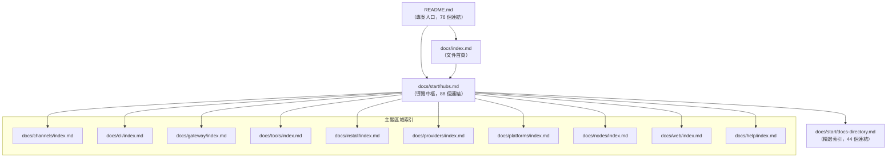
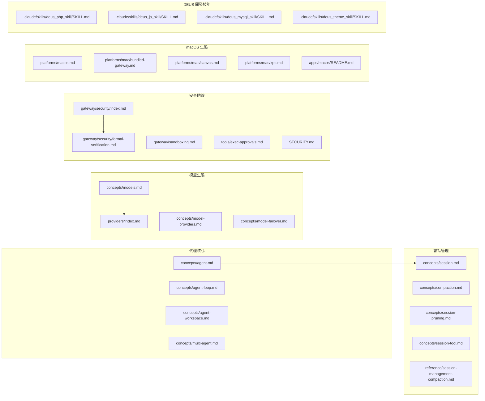

# OpenClaw 專案 Markdown 檔案索引清冊

> 產出日期：2026-02-07
> 掃描範圍：專案根目錄下所有 `.md` 檔案（排除 `node_modules`、`.git`）
> 檔案總數：**801 個**

---

## 目錄

- [概覽摘要](#概覽摘要)
- [統計概覽](#統計概覽)
- [一、專案根目錄](#一專案根目錄)
- [二、Swabble 子專案](#二swabble-子專案)
- [三、apps — 行動與桌面應用](#三apps--行動與桌面應用)
- [四、assets — 靜態資源](#四assets--靜態資源)
- [五、.github — GitHub 專案治理](#五github--github-專案治理)
- [六、.agent / .agents — 自動化工作流](#六agent--agents--自動化工作流)
- [七、.pi — Pi 編碼代理提示](#七pi--pi-編碼代理提示)
- [八、docs — 主文件體系（英文）](#八docs--主文件體系英文)
  - [8.1 文件根目錄](#81-文件根目錄)
  - [8.2 docs/start — 入門指南](#82-docsstart--入門指南)
  - [8.3 docs/install — 安裝部署](#83-docsinstall--安裝部署)
  - [8.4 docs/concepts — 核心概念](#84-docsconcepts--核心概念)
  - [8.5 docs/channels — 通訊管道整合](#85-docschannels--通訊管道整合)
  - [8.6 docs/cli — CLI 命令參考](#86-docscli--cli-命令參考)
  - [8.7 docs/gateway — Gateway 服務](#87-docsgateway--gateway-服務)
  - [8.8 docs/tools — 代理工具](#88-docstools--代理工具)
  - [8.9 docs/nodes — 節點裝置](#89-docsnodes--節點裝置)
  - [8.10 docs/web — Web 介面](#810-docsweb--web-介面)
  - [8.11 docs/providers — 模型提供商](#811-docsproviders--模型提供商)
  - [8.12 docs/platforms — 平台指南](#812-docsplatforms--平台指南)
  - [8.13 docs/plugins — 外掛系統](#813-docsplugins--外掛系統)
  - [8.14 docs/automation — 自動化](#814-docsautomation--自動化)
  - [8.15 docs/reference — 參考文件](#815-docsreference--參考文件)
  - [8.16 docs/refactor — 重構計畫](#816-docsrefactor--重構計畫)
  - [8.17 docs/experiments — 實驗性功能](#817-docsexperiments--實驗性功能)
  - [8.18 docs/help — 求助中心](#818-docshelp--求助中心)
  - [8.19 docs/其他](#819-docs其他)
- [九、docs/zh-CN — 簡體中文翻譯鏡像](#九docszh-cn--簡體中文翻譯鏡像)
- [十、extensions — 外掛擴展](#十extensions--外掛擴展)
- [十一、skills — 代理技能](#十一skills--代理技能)
- [十二、src/hooks — 內建 Hook](#十二srchooks--內建-hook)
- [十三、vendor/a2ui — 第三方 A2UI 規範](#十三vendora2ui--第三方-a2ui-規範)
- [十四、.claude/skills — DEUS 開發技能](#十四claudeskills--deus-開發技能)
- [十五、deus_data — 專案分析資料](#十五deus_data--專案分析資料)
- [檔案間關聯圖譜](#檔案間關聯圖譜)
- [孤立檔案清單](#孤立檔案清單)

---

## 概覽摘要

OpenClaw 是一個多通道 AI 代理閘道平台，可在 WhatsApp、Telegram、Slack、Discord 等 20+ 通訊管道上執行個人 AI 助手。專案採用 TypeScript / Node.js 技術堆疊，以 Monorepo 方式組織，涵蓋：

- **核心 Gateway 服務**：WebSocket 伺服器、代理運行時、會話管理
- **多通道整合**：20+ 通訊平台外掛
- **行動與桌面應用**：macOS（Swift）、iOS（SwiftUI）、Android（Kotlin）
- **豐富的代理技能**：50+ 技能，整合 GitHub、Notion、Spotify、智慧家居等
- **完善的文件體系**：300+ 英文文件 + 305 簡體中文翻譯鏡像

文件結構採用 **Mintlify** 文件框架，使用根相對路徑連結（無 `.md` 副檔名），以 Hub-Spoke 模式組織導覽。

---

## 統計概覽

| 類別 | 檔案數量 |
|------|---------|
| 專案根目錄 | 8 |
| Swabble 子專案 | 3 |
| apps（行動/桌面應用） | 6 |
| assets | 1 |
| .github（專案治理） | 2 |
| .agent / .agents（自動化） | 4 |
| .pi（提示集） | 4 |
| docs（英文主文件） | 313 |
| docs/zh-CN（簡中翻譯鏡像） | 305 |
| extensions（外掛擴展） | 48 |
| skills（代理技能） | 57 |
| src/hooks（內建 Hook） | 6 |
| vendor/a2ui（第三方） | 9 |
| .claude/skills（DEUS 開發技能） | 34 |
| deus_data | 1 |
| **合計** | **801** |

---

## 一、專案根目錄

| 檔案名稱 | 相對路徑 | 用途說明 | 分類 | 目標受眾 |
|---------|---------|---------|------|---------|
| README.md | `./README.md` | 專案主頁，介紹 OpenClaw 的功能、快速開始與技術特色 | 專案總覽 | 所有人 |
| CHANGELOG.md | `./CHANGELOG.md` | 版本更新紀錄，記錄所有功能改進、修復與新增項目 | 版本紀錄 | 開發者/使用者 |
| CONTRIBUTING.md | `./CONTRIBUTING.md` | 貢獻指南，列出維護者、社群連結與參與方式 | 社群治理 | 貢獻者 |
| SECURITY.md | `./SECURITY.md` | 安全政策，說明漏洞回報流程與安全範圍 | 安全政策 | 安全研究者 |
| AGENTS.md | `./AGENTS.md` | 儲存庫指引，定義專案結構、模組規則與開發約定 | 開發指南 | 開發者/AI 代理 |
| CLAUDE.md | `./CLAUDE.md` | 專案系統分析與逆向工程指南（繁體中文） | AI 分析框架 | AI 代理 |
| CLAUDE.md.deprecated | `./CLAUDE.md.deprecated` | 已棄用（符號連結指向 AGENTS.md） | 已棄用 | — |
| docs.acp.md | `./docs.acp.md` | ACP 橋接協定文件，說明 IDE 與 Gateway 通訊機制 | 協定文件 | 開發者 |

---

## 二、Swabble 子專案

| 檔案名稱 | 相對路徑 | 用途說明 | 分類 |
|---------|---------|---------|------|
| README.md | `Swabble/README.md` | Swabble 專案介紹 — macOS 本地喚醒詞守護程式（Swift 6.2） | 子專案總覽 |
| CHANGELOG.md | `Swabble/CHANGELOG.md` | Swabble 版本變更紀錄 | 版本紀錄 |
| spec.md | `Swabble/docs/spec.md` | Swabble 技術規格，詳述架構、命令結構與設定項 | 技術規格 |

---

## 三、apps — 行動與桌面應用

| 檔案名稱 | 相對路徑 | 用途說明 | 分類 |
|---------|---------|---------|------|
| README.md | `apps/android/README.md` | Android 節點應用（Kotlin + Jetpack Compose）開發說明 | 行動應用 |
| README.md | `apps/ios/README.md` | iOS SwiftUI 應用框架與 OpenClawKit 套件說明 | 行動應用 |
| SETUP.md | `apps/ios/fastlane/SETUP.md` | iOS fastlane 自動化建置與 App Store 發佈設定 | 建置部署 |
| README.md | `apps/macos/README.md` | macOS 應用的開發、打包與簽署流程說明 | 桌面應用 |
| NOTICE.md | `apps/macos/Sources/OpenClaw/Resources/DeviceModels/NOTICE.md` | Apple 設備型號對應資料來源授權說明 | 授權聲明 |

---

## 四、assets — 靜態資源

| 檔案名稱 | 相對路徑 | 用途說明 | 分類 |
|---------|---------|---------|------|
| README.md | `assets/chrome-extension/README.md` | Chrome 擴充功能說明，實現 Gateway 對瀏覽器的自動化控制 | 瀏覽器擴充 |

---

## 五、.github — GitHub 專案治理

| 檔案名稱 | 相對路徑 | 用途說明 | 分類 |
|---------|---------|---------|------|
| bug_report.md | `.github/ISSUE_TEMPLATE/bug_report.md` | GitHub Issue 範本 — 程式錯誤回報 | Issue 範本 |
| feature_request.md | `.github/ISSUE_TEMPLATE/feature_request.md` | GitHub Issue 範本 — 功能需求提案 | Issue 範本 |

---

## 六、.agent / .agents — 自動化工作流

| 檔案名稱 | 相對路徑 | 用途說明 | 分類 |
|---------|---------|---------|------|
| update_clawdbot.md | `.agent/workflows/update_clawdbot.md` | Fork 分支與上游同步的工作流程文件 | 工作流定義 |
| SKILL.md | `.agents/skills/merge-pr/SKILL.md` | Squash 合併 PR 至 main 的技能定義 | PR 自動化 |
| SKILL.md | `.agents/skills/prepare-pr/SKILL.md` | PR 準備合併的技能定義（rebase、修復、推送） | PR 自動化 |
| SKILL.md | `.agents/skills/review-pr/SKILL.md` | PR 結構化審查與合併就緒性評估 | PR 自動化 |

---

## 七、.pi — Pi 編碼代理提示

| 檔案名稱 | 相對路徑 | 用途說明 | 分類 |
|---------|---------|---------|------|
| cl.md | `.pi/prompts/cl.md` | 發布前變更日誌審計提示 | 發行工程 |
| is.md | `.pi/prompts/is.md` | GitHub Issue 診斷與分析提示 | 分析工具 |
| landpr.md | `.pi/prompts/landpr.md` | PR 著陸（rebase/squash 合併）工作流提示 | PR 自動化 |
| reviewpr.md | `.pi/prompts/reviewpr.md` | PR 審查與合併就緒性建議提示 | PR 自動化 |

---

## 八、docs — 主文件體系（英文）

### 8.1 文件根目錄

| 檔案名稱 | 相對路徑 | 用途說明 | 分類 |
|---------|---------|---------|------|
| index.md | `docs/index.md` | 文件主頁，介紹 OpenClaw 平台概覽 | 文件首頁 |
| bedrock.md | `docs/bedrock.md` | Amazon Bedrock 模型整合指南 | 模型提供商 |
| brave-search.md | `docs/brave-search.md` | Brave Search API 工具設定 | 工具整合 |
| broadcast-groups.md | `docs/broadcast-groups.md` | WhatsApp 廣播群組功能說明 | 功能說明 |
| date-time.md | `docs/date-time.md` | 日期時間處理方式與跨元件正規化 | 設定參考 |
| debugging.md | `docs/debugging.md` | 除錯工具與監視模式使用技巧 | 開發工具 |
| environment.md | `docs/environment.md` | 環境變數載入來源與優先順序 | 設定參考 |
| hooks.md | `docs/hooks.md` | 事件驅動自動化系統設定 | 進階功能 |
| logging.md | `docs/logging.md` | 日誌系統概覽與設定方法 | 設定參考 |
| multi-agent-sandbox-tools.md | `docs/multi-agent-sandbox-tools.md` | 每代理獨立沙箱與工具限制策略 | 安全設定 |
| network.md | `docs/network.md` | 網路架構樞紐（連線、配對、發現、安全） | 架構文件 |
| perplexity.md | `docs/perplexity.md` | Perplexity Sonar 搜尋工具設定 | 模型提供商 |
| pi.md | `docs/pi.md` | Pi 編碼代理整合架構詳解 | 架構文件 |
| pi-dev.md | `docs/pi-dev.md` | Pi 整合開發工作流程 | 開發指南 |
| plugin.md | `docs/plugin.md` | 外掛系統功能擴展說明 | 擴展性 |
| prose.md | `docs/prose.md` | OpenProse 工作流程格式說明 | 外掛文件 |
| scripts.md | `docs/scripts.md` | 儲存庫輔助腳本用途與安全注意事項 | 開發工具 |
| testing.md | `docs/testing.md` | 測試工具組（單元/E2E/實時測試） | 品質保障 |
| token-use.md | `docs/token-use.md` | 令牌使用量與成本報告方式 | 設定參考 |
| tts.md | `docs/tts.md` | 文字轉語音功能（ElevenLabs、OpenAI、Edge TTS） | 功能說明 |
| tui.md | `docs/tui.md` | 終端使用者介面（TUI）說明 | 使用介面 |
| vps.md | `docs/vps.md` | 雲端主機託管部署指南樞紐 | 部署指南 |
| README.md | `docs/.i18n/README.md` | 文件國際化資產（詞彙表、翻譯記憶庫） | 翻譯基礎設施 |

### 8.2 docs/start — 入門指南

| 檔案名稱 | 相對路徑 | 用途說明 | 分類 |
|---------|---------|---------|------|
| getting-started.md | `docs/start/getting-started.md` | 從零到首次運行的最少設定快速啟動指南 | 快速開始 |
| quickstart.md | `docs/start/quickstart.md` | 舊快速啟動連結的重定向頁面 | 重定向 |
| hubs.md | `docs/start/hubs.md` | **主要文件導覽中樞**，連結至所有文件頁面（88 個連結） | 導覽中樞 |
| docs-directory.md | `docs/start/docs-directory.md` | 常用文件精選索引（44 個連結） | 精選索引 |
| onboarding.md | `docs/start/onboarding.md` | macOS App 首次執行流程的 onboarding 體驗設計 | 入門體驗 |
| wizard.md | `docs/start/wizard.md` | CLI onboarding wizard 引導式設定 | 設定精靈 |
| wizard-cli-automation.md | `docs/start/wizard-cli-automation.md` | CLI wizard 非互動式自動化腳本 | 自動化設定 |
| wizard-cli-reference.md | `docs/start/wizard-cli-reference.md` | CLI wizard 完整行為與內部參考 | 技術參考 |
| setup.md | `docs/start/setup.md` | 進階設定與開發工作流程 | 進階設定 |
| openclaw.md | `docs/start/openclaw.md` | 將 OpenClaw 建構為個人助手的端到端指南 | 使用指南 |
| pairing.md | `docs/start/pairing.md` | DM 存取控制與節點配對的擁有者核准機制 | 安全設定 |
| showcase.md | `docs/start/showcase.md` | 社群專案與整合的實際應用展示 | 社群展示 |
| lore.md | `docs/start/lore.md` | 專案背景故事與品牌由來 | 專案文化 |
| bootstrapping.md | `docs/start/bootstrapping.md` | Agent 首次啟動的工作空間初始化儀式 | 代理設定 |

### 8.3 docs/install — 安裝部署

| 檔案名稱 | 相對路徑 | 用途說明 | 分類 |
|---------|---------|---------|------|
| index.md | `docs/install/index.md` | 安裝方法主索引、系統需求與維護指南 | 安裝索引 |
| node.md | `docs/install/node.md` | Node.js 版本需求與安裝選項 | 前置需求 |
| installer.md | `docs/install/installer.md` | 安裝腳本運作原理與旗標 | 安裝工具 |
| docker.md | `docs/install/docker.md` | Docker 容器化設定與導入流程 | 容器部署 |
| nix.md | `docs/install/nix.md` | Nix Home Manager 宣告式安裝 | 系統安裝 |
| bun.md | `docs/install/bun.md` | 實驗性 Bun 工作流程 | 實驗性 |
| ansible.md | `docs/install/ansible.md` | Ansible 自動化伺服器部署 | 自動化部署 |
| fly.md | `docs/install/fly.md` | Fly.io 雲端部署指南 | 雲端部署 |
| gcp.md | `docs/install/gcp.md` | GCP Compute Engine Docker 部署 | 雲端部署 |
| hetzner.md | `docs/install/hetzner.md` | Hetzner VPS Docker 生產部署 | 雲端部署 |
| exe-dev.md | `docs/install/exe-dev.md` | exe.dev VM 上的 Gateway 部署 | 雲端部署 |
| macos-vm.md | `docs/install/macos-vm.md` | macOS VM 沙箱化執行 | 沙箱部署 |
| migrating.md | `docs/install/migrating.md` | Gateway 跨機器遷移指南 | 維護指南 |
| updating.md | `docs/install/updating.md` | 安全更新策略與回滾方案 | 維護指南 |
| uninstall.md | `docs/install/uninstall.md` | 完全移除 OpenClaw 的步驟 | 解除安裝 |
| development-channels.md | `docs/install/development-channels.md` | 穩定/測試/開發版頻道切換策略 | 版本管理 |

### 8.4 docs/concepts — 核心概念

| 檔案名稱 | 相對路徑 | 用途說明 | 分類 |
|---------|---------|---------|------|
| architecture.md | `docs/concepts/architecture.md` | Gateway 架構、元件與通訊流程總覽 | 架構設計 |
| features.md | `docs/concepts/features.md` | OpenClaw 完整功能清單 | 功能列表 |
| agent.md | `docs/concepts/agent.md` | 代理執行時環境、工作區契約與會話啟動 | 代理核心 |
| agent-loop.md | `docs/concepts/agent-loop.md` | 代理循環生命週期與資料流 | 代理核心 |
| agent-workspace.md | `docs/concepts/agent-workspace.md` | 代理工作區位置、檔案配置與備份策略 | 代理設定 |
| multi-agent.md | `docs/concepts/multi-agent.md` | 單一 Gateway 多代理隔離路由 | 多代理 |
| session.md | `docs/concepts/session.md` | 會話管理規則與持久化方式 | 會話管理 |
| sessions.md | `docs/concepts/sessions.md` | session.md 的別名重定向 | 重定向 |
| session-pruning.md | `docs/concepts/session-pruning.md` | 會話修剪以減少上下文膨脹 | 會話管理 |
| session-tool.md | `docs/concepts/session-tool.md` | 代理列表/取得/傳送會話的工具集 | 會話工具 |
| compaction.md | `docs/concepts/compaction.md` | 自動壓縮機制使會話保持模型限制 | 上下文管理 |
| context.md | `docs/concepts/context.md` | 「上下文」定義、組成與除錯方法 | 上下文管理 |
| memory.md | `docs/concepts/memory.md` | 記憶體以 Markdown 純文字運作 | 記憶系統 |
| messages.md | `docs/concepts/messages.md` | 訊息流、會話、佇列與推理可見度 | 訊息流 |
| queue.md | `docs/concepts/queue.md` | 序列化自動回覆的命令佇列設計 | 訊息流 |
| streaming.md | `docs/concepts/streaming.md` | 區塊串流與令牌草稿串流機制 | 訊息流 |
| channel-routing.md | `docs/concepts/channel-routing.md` | 跨多管道的路由規則 | 管道路由 |
| groups.md | `docs/concepts/groups.md` | 跨 7 管道的群組聊天行為與提及門控 | 群組 |
| group-messages.md | `docs/concepts/group-messages.md` | WhatsApp 群組訊息處理行為 | 群組 |
| models.md | `docs/concepts/models.md` | 模型列表、設定、別名與掃描 | 模型管理 |
| model-providers.md | `docs/concepts/model-providers.md` | LLM 供應商設定參考與 CLI 上線 | 模型管理 |
| model-failover.md | `docs/concepts/model-failover.md` | 驗證設定檔輪換與跨模型故障轉移 | 模型管理 |
| oauth.md | `docs/concepts/oauth.md` | OAuth 令牌交換與多帳戶模式流程 | 認證 |
| presence.md | `docs/concepts/presence.md` | Gateway 與客戶端的狀態視圖合併 | 狀態管理 |
| retry.md | `docs/concepts/retry.md` | 出站供應商呼叫的重試政策 | 可靠性 |
| system-prompt.md | `docs/concepts/system-prompt.md` | 系統提示詞的組成與組裝機制 | 提示工程 |
| markdown-formatting.md | `docs/concepts/markdown-formatting.md` | 出站管道的 Markdown 格式轉換 | 格式化 |
| typing-indicators.md | `docs/concepts/typing-indicators.md` | 打字指示符的顯示與行為調整 | UX |
| timezone.md | `docs/concepts/timezone.md` | 時區標準化使模型看到統一參考時間 | 設定 |
| typebox.md | `docs/concepts/typebox.md` | TypeBox 作為 WebSocket 協議定義源 | 協定定義 |
| usage-tracking.md | `docs/concepts/usage-tracking.md` | 用量追蹤介面與供應商認證 | 成本管理 |

### 8.5 docs/channels — 通訊管道整合

| 檔案名稱 | 相對路徑 | 用途說明 | 分類 |
|---------|---------|---------|------|
| index.md | `docs/channels/index.md` | 支援的訊息平台總覽與管道特性 | 管道索引 |
| whatsapp.md | `docs/channels/whatsapp.md` | WhatsApp Web（Baileys）登入與訊息設定 | IM 整合 |
| telegram.md | `docs/channels/telegram.md` | Telegram Bot API 長輪詢/Webhook 設定 | IM 整合 |
| discord.md | `docs/channels/discord.md` | Discord Bot API 整合設定 | IM 整合 |
| slack.md | `docs/channels/slack.md` | Slack Socket Mode 與 HTTP Webhook 設定 | 企業通訊 |
| feishu.md | `docs/channels/feishu.md` | 飛書/Lark Bot 整合設定 | 企業通訊 |
| googlechat.md | `docs/channels/googlechat.md` | Google Chat API 直訊與空間整合 | 企業通訊 |
| msteams.md | `docs/channels/msteams.md` | Microsoft Teams Bot 支援與限制 | 企業通訊 |
| mattermost.md | `docs/channels/mattermost.md` | Mattermost 自代管機器人整合 | 企業通訊 |
| signal.md | `docs/channels/signal.md` | Signal signal-cli 外部整合 | 隱私通訊 |
| bluebubbles.md | `docs/channels/bluebubbles.md` | BlueBubbles macOS 伺服器 iMessage 整合 | Apple 生態 |
| imessage.md | `docs/channels/imessage.md` | 舊版 iMessage 支援（建議改用 BlueBubbles） | Apple 生態 |
| line.md | `docs/channels/line.md` | LINE Messaging API 外掛整合 | 亞洲通訊 |
| matrix.md | `docs/channels/matrix.md` | Matrix 去中心化訊息機器人整合 | 開放協議 |
| nostr.md | `docs/channels/nostr.md` | Nostr 去中心化社交加密 DM 支援 | 開放協議 |
| tlon.md | `docs/channels/tlon.md` | Tlon/Urbit 去中心化訊息整合 | 開放協議 |
| nextcloud-talk.md | `docs/channels/nextcloud-talk.md` | Nextcloud Talk Webhook 機器人整合 | 自建通訊 |
| twitch.md | `docs/channels/twitch.md` | Twitch IRC 聊天機器人設定 | 直播平台 |
| zalo.md | `docs/channels/zalo.md` | Zalo Bot API 試驗性整合 | 亞洲通訊 |
| zalouser.md | `docs/channels/zalouser.md` | Zalo 個人帳戶非官方整合（含風險警告） | 亞洲通訊 |
| grammy.md | `docs/channels/grammy.md` | grammY Telegram Bot 客戶端整合說明 | IM 整合 |
| location.md | `docs/channels/location.md` | 通訊管道位置資訊解析與正規化 | 基礎設施 |
| troubleshooting.md | `docs/channels/troubleshooting.md` | 通訊管道連線問題排查指南 | 排錯指南 |

### 8.6 docs/cli — CLI 命令參考

共 41 個檔案，涵蓋 OpenClaw CLI 的完整命令生態。

| 檔案名稱 | 相對路徑 | 用途說明 |
|---------|---------|---------|
| index.md | `docs/cli/index.md` | CLI 命令完整參考索引頁面 |
| acp.md | `docs/cli/acp.md` | ACP 橋接器運行命令 |
| agent.md | `docs/cli/agent.md` | 單次 Agent 回合執行命令 |
| agents.md | `docs/cli/agents.md` | 隔離 Agent 實例管理 |
| approvals.md | `docs/cli/approvals.md` | 執行核准清單管理 |
| browser.md | `docs/cli/browser.md` | 瀏覽器控制伺服器管理 |
| channels.md | `docs/cli/channels.md` | 聊天通道帳戶管理 |
| config.md | `docs/cli/config.md` | 非互動式設定值讀取/編輯 |
| configure.md | `docs/cli/configure.md` | 互動式設定精靈 |
| cron.md | `docs/cli/cron.md` | Cron 排程工作管理 |
| dashboard.md | `docs/cli/dashboard.md` | 開啟 Control UI 控制面板 |
| devices.md | `docs/cli/devices.md` | 設備配對與權杖管理 |
| directory.md | `docs/cli/directory.md` | 通道目錄查詢（聯絡人、群組） |
| dns.md | `docs/cli/dns.md` | DNS 輔助工具（Tailscale + CoreDNS） |
| docs.md | `docs/cli/docs.md` | 從終端搜尋線上文件 |
| doctor.md | `docs/cli/doctor.md` | Gateway 健康檢查與導引修復 |
| gateway.md | `docs/cli/gateway.md` | Gateway WebSocket 伺服器管理 |
| health.md | `docs/cli/health.md` | RPC 快速健康狀態檢查 |
| hooks.md | `docs/cli/hooks.md` | 事件驅動 Agent Hook 管理 |
| logs.md | `docs/cli/logs.md` | RPC 遠端日誌追蹤 |
| memory.md | `docs/cli/memory.md` | 語義記憶索引與搜尋 |
| message.md | `docs/cli/message.md` | 統一出站訊息命令 |
| models.md | `docs/cli/models.md` | 模型探索、掃描與設定 |
| node.md | `docs/cli/node.md` | 無頭節點主機運行 |
| nodes.md | `docs/cli/nodes.md` | 配對節點管理與功能調用 |
| onboard.md | `docs/cli/onboard.md` | 互動式上手向導 |
| pairing.md | `docs/cli/pairing.md` | DM 配對請求核准 |
| plugins.md | `docs/cli/plugins.md` | Gateway 外掛管理 |
| reset.md | `docs/cli/reset.md` | 本地設定與狀態重置 |
| sandbox.md | `docs/cli/sandbox.md` | Docker 隔離沙箱管理 |
| security.md | `docs/cli/security.md` | 安全審計與修復工具 |
| sessions.md | `docs/cli/sessions.md` | 對話會話列表與活動記錄 |
| setup.md | `docs/cli/setup.md` | 初始化設定與工作區 |
| skills.md | `docs/cli/skills.md` | 技能可用性檢查 |
| status.md | `docs/cli/status.md` | 通道與會話診斷工具 |
| system.md | `docs/cli/system.md` | Gateway 系統級輔助工具 |
| tui.md | `docs/cli/tui.md` | 終端使用者介面啟動 |
| uninstall.md | `docs/cli/uninstall.md` | 移除 Gateway 服務 |
| update.md | `docs/cli/update.md` | 安全更新與版本切換 |
| voicecall.md | `docs/cli/voicecall.md` | 語音通話外掛命令 |
| webhooks.md | `docs/cli/webhooks.md` | Webhook 輔助工具與整合 |

### 8.7 docs/gateway — Gateway 服務

共 30 個檔案。

| 檔案名稱 | 相對路徑 | 用途說明 |
|---------|---------|---------|
| index.md | `docs/gateway/index.md` | Gateway 服務生命週期操作手冊 |
| authentication.md | `docs/gateway/authentication.md` | OAuth、API 金鑰與 Token 認證機制 |
| background-process.md | `docs/gateway/background-process.md` | 背景執行與長期任務管理 |
| bonjour.md | `docs/gateway/bonjour.md` | Bonjour/mDNS 本地網路探測 |
| bridge-protocol.md | `docs/gateway/bridge-protocol.md` | 舊版 TCP JSONL Bridge 協議定義 |
| cli-backends.md | `docs/gateway/cli-backends.md` | 本地 AI CLI 後備執行時環境 |
| configuration.md | `docs/gateway/configuration.md` | 完整設定選項與範例 |
| configuration-examples.md | `docs/gateway/configuration-examples.md` | 常見設定的結構化範例集合 |
| discovery.md | `docs/gateway/discovery.md` | 節點探測與傳輸機制 |
| doctor.md | `docs/gateway/doctor.md` | 健康檢查、遷移與修復工具 |
| gateway-lock.md | `docs/gateway/gateway-lock.md` | 單一實例守護機制 |
| health.md | `docs/gateway/health.md` | 頻道連線健康狀態快速檢查 |
| heartbeat.md | `docs/gateway/heartbeat.md` | 週期性代理輪轉與通知規則 |
| local-models.md | `docs/gateway/local-models.md` | 本地 GPU 運行（LM Studio、vLLM） |
| logging.md | `docs/gateway/logging.md` | 日誌輸出表面與格式設定 |
| multiple-gateways.md | `docs/gateway/multiple-gateways.md` | 單一主機多 Gateway 隔離 |
| network-model.md | `docs/gateway/network-model.md` | Gateway、節點與畫布連線模型 |
| openai-http-api.md | `docs/gateway/openai-http-api.md` | OpenAI 相容聊天完成端點 |
| openresponses-http-api.md | `docs/gateway/openresponses-http-api.md` | OpenResponses /v1/responses 端點 |
| pairing.md | `docs/gateway/pairing.md` | 遠端節點 Gateway 配對機制 |
| protocol.md | `docs/gateway/protocol.md` | WebSocket 協議握手與版本控制 |
| remote.md | `docs/gateway/remote.md` | SSH 通道與 Tailnet 遠端存取 |
| remote-gateway-readme.md | `docs/gateway/remote-gateway-readme.md` | OpenClaw.app SSH 通道設置 |
| sandbox-vs-tool-policy-vs-elevated.md | `docs/gateway/sandbox-vs-tool-policy-vs-elevated.md` | 沙箱、工具政策與提升權限的差異 |
| sandboxing.md | `docs/gateway/sandboxing.md` | 沙箱模式與 Docker 隔離詳解 |
| tailscale.md | `docs/gateway/tailscale.md` | Tailscale Serve/Funnel 整合 |
| tools-invoke-http-api.md | `docs/gateway/tools-invoke-http-api.md` | 單一工具直接呼叫端點 |
| troubleshooting.md | `docs/gateway/troubleshooting.md` | 常見故障快速除錯指南 |
| security/index.md | `docs/gateway/security/index.md` | AI Gateway 安全考量與威脅模型 |
| security/formal-verification.md | `docs/gateway/security/formal-verification.md` | TLA+/TLC 機器驗證安全模型 |

### 8.8 docs/tools — 代理工具

共 22 個檔案。

| 檔案名稱 | 相對路徑 | 用途說明 |
|---------|---------|---------|
| index.md | `docs/tools/index.md` | 第一級代理工具總覽 |
| exec.md | `docs/tools/exec.md` | Shell 命令執行工具 |
| exec-approvals.md | `docs/tools/exec-approvals.md` | 命令執行核准機制 |
| elevated.md | `docs/tools/elevated.md` | `/elevated` 指令控制 |
| browser.md | `docs/tools/browser.md` | 獨立 Chrome 設定檔管理 |
| browser-login.md | `docs/tools/browser-login.md` | 瀏覽器自動化手動登入 |
| browser-linux-troubleshooting.md | `docs/tools/browser-linux-troubleshooting.md` | Linux Chrome CDP 問題修復 |
| chrome-extension.md | `docs/tools/chrome-extension.md` | Chrome 擴充功能控制現有分頁 |
| web.md | `docs/tools/web.md` | web_search 與 web_fetch 工具 |
| firecrawl.md | `docs/tools/firecrawl.md` | Firecrawl 反機器人後備提取器 |
| skills.md | `docs/tools/skills.md` | 技能系統管理與過濾 |
| skills-config.md | `docs/tools/skills-config.md` | 技能相關設定 |
| creating-skills.md | `docs/tools/creating-skills.md` | 自訂技能建立教學 |
| clawhub.md | `docs/tools/clawhub.md` | ClawHub 公開技能註冊表 |
| slash-commands.md | `docs/tools/slash-commands.md` | 斜線命令處理機制 |
| thinking.md | `docs/tools/thinking.md` | `/think` 推理層級控制 |
| subagents.md | `docs/tools/subagents.md` | 子代理衍生執行機制 |
| agent-send.md | `docs/tools/agent-send.md` | `openclaw agent` CLI 直接執行 |
| apply-patch.md | `docs/tools/apply-patch.md` | 多檔案修補程式工具 |
| llm-task.md | `docs/tools/llm-task.md` | JSON LLM 任務執行工具 |
| lobster.md | `docs/tools/lobster.md` | Lobster 多步驟工作流引擎 |
| reactions.md | `docs/tools/reactions.md` | 跨頻道統一反應語義 |

### 8.9 docs/nodes — 節點裝置

| 檔案名稱 | 相對路徑 | 用途說明 |
|---------|---------|---------|
| index.md | `docs/nodes/index.md` | 節點裝置總覽與 WebSocket 連線說明 |
| audio.md | `docs/nodes/audio.md` | 音訊語音記事轉錄與注入 |
| camera.md | `docs/nodes/camera.md` | 攝影機靜照與影片擷取 |
| images.md | `docs/nodes/images.md` | WhatsApp 影像處理規則 |
| location-command.md | `docs/nodes/location-command.md` | 節點位置命令與權限模式 |
| media-understanding.md | `docs/nodes/media-understanding.md` | 入站媒體可選摘要功能 |
| talk.md | `docs/nodes/talk.md` | 連續語音對話迴圈 |
| voicewake.md | `docs/nodes/voicewake.md` | 全局語音喚醒詞管理 |

### 8.10 docs/web — Web 介面

| 檔案名稱 | 相對路徑 | 用途說明 |
|---------|---------|---------|
| index.md | `docs/web/index.md` | 瀏覽器 Control UI 概覽（Vite + Lit） |
| control-ui.md | `docs/web/control-ui.md` | 基於瀏覽器的 Gateway 操作介面 |
| dashboard.md | `docs/web/dashboard.md` | Gateway 儀表板預設首頁 |
| webchat.md | `docs/web/webchat.md` | 原生聊天 UI（WebSocket 直連） |

### 8.11 docs/providers — 模型提供商

共 21 個檔案。

| 檔案名稱 | 相對路徑 | 用途說明 |
|---------|---------|---------|
| index.md | `docs/providers/index.md` | LLM 提供商總覽與選擇指南 |
| anthropic.md | `docs/providers/anthropic.md` | Anthropic Claude API 認證設定 |
| openai.md | `docs/providers/openai.md` | OpenAI GPT 認證方式 |
| ollama.md | `docs/providers/ollama.md` | Ollama 本地 LLM 整合 |
| openrouter.md | `docs/providers/openrouter.md` | OpenRouter 統一 API 代理設定 |
| qwen.md | `docs/providers/qwen.md` | 阿里雲 Qwen 免費層 OAuth 與設定 |
| deepgram.md | `docs/providers/deepgram.md` | Deepgram 語音轉文字整合 |
| github-copilot.md | `docs/providers/github-copilot.md` | GitHub Copilot 設備流認證 |
| claude-max-api-proxy.md | `docs/providers/claude-max-api-proxy.md` | Claude Max 訂閱 API 端點代理 |
| cloudflare-ai-gateway.md | `docs/providers/cloudflare-ai-gateway.md` | Cloudflare AI Gateway 代理設定 |
| vercel-ai-gateway.md | `docs/providers/vercel-ai-gateway.md` | Vercel AI Gateway 統一端點設定 |
| glm.md | `docs/providers/glm.md` | Z.AI 平台 GLM 模型存取 |
| minimax.md | `docs/providers/minimax.md` | MiniMax M2.1 編碼模型整合 |
| moonshot.md | `docs/providers/moonshot.md` | Moonshot K2 / Kimi Coding 設定 |
| opencode.md | `docs/providers/opencode.md` | OpenCode Zen 精選模型清單 |
| qianfan.md | `docs/providers/qianfan.md` | 百度 Qianfan MaaS 統一 API |
| synthetic.md | `docs/providers/synthetic.md` | Synthetic Anthropic 相容 API |
| venice.md | `docs/providers/venice.md` | Venice AI 隱私優先推理 |
| xiaomi.md | `docs/providers/xiaomi.md` | 小米 MiMo 平台 API 認證 |
| zai.md | `docs/providers/zai.md` | Z.AI GLM REST API 設定 |
| models.md | `docs/providers/models.md` | 支援模型快速入門與推薦 |

### 8.12 docs/platforms — 平台指南

共 27 個檔案（含 mac/ 子目錄 18 個）。

| 檔案名稱 | 相對路徑 | 用途說明 |
|---------|---------|---------|
| index.md | `docs/platforms/index.md` | 平台支援總覽 |
| macos.md | `docs/platforms/macos.md` | macOS 伴侶應用功能列表 |
| ios.md | `docs/platforms/ios.md` | iOS 節點應用預覽版 |
| android.md | `docs/platforms/android.md` | Android 節點應用連線指南 |
| windows.md | `docs/platforms/windows.md` | Windows WSL2 執行指南 |
| linux.md | `docs/platforms/linux.md` | Linux 完全支援說明 |
| digitalocean.md | `docs/platforms/digitalocean.md` | DigitalOcean 部署指南 |
| oracle.md | `docs/platforms/oracle.md` | Oracle Cloud 免費層部署 |
| raspberry-pi.md | `docs/platforms/raspberry-pi.md` | Raspberry Pi 執行指南 |
| mac/bundled-gateway.md | `docs/platforms/mac/bundled-gateway.md` | macOS launchd Gateway 運行時 |
| mac/canvas.md | `docs/platforms/mac/canvas.md` | WKWebView 繪圖面板整合 |
| mac/child-process.md | `docs/platforms/mac/child-process.md` | 應用程式與 Gateway 生命週期整合 |
| mac/dev-setup.md | `docs/platforms/mac/dev-setup.md` | macOS 開發環境設定指南 |
| mac/health.md | `docs/platforms/mac/health.md` | 選單欄 Gateway 健康狀態顯示 |
| mac/icon.md | `docs/platforms/mac/icon.md` | 選單欄圖示狀態與動畫 |
| mac/logging.md | `docs/platforms/mac/logging.md` | 滾動診斷日誌實作 |
| mac/menu-bar.md | `docs/platforms/mac/menu-bar.md` | 選單欄狀態邏輯 |
| mac/peekaboo.md | `docs/platforms/mac/peekaboo.md` | PeekabooBridge UI 自動化整合 |
| mac/permissions.md | `docs/platforms/mac/permissions.md` | macOS TCC 權限持久化 |
| mac/release.md | `docs/platforms/mac/release.md` | macOS 版本發佈檢查清單 |
| mac/remote.md | `docs/platforms/mac/remote.md` | SSH 遠端控制 Gateway |
| mac/signing.md | `docs/platforms/mac/signing.md` | 除錯建置簽署步驟 |
| mac/skills.md | `docs/platforms/mac/skills.md` | Skills 設定 UI |
| mac/voice-overlay.md | `docs/platforms/mac/voice-overlay.md` | 語音覆蓋層生命週期 |
| mac/voicewake.md | `docs/platforms/mac/voicewake.md` | 語音喚醒與推拖講話 |
| mac/webchat.md | `docs/platforms/mac/webchat.md` | 嵌入 Gateway WebChat |
| mac/xpc.md | `docs/platforms/mac/xpc.md` | macOS IPC 架構與 XPC 通訊 |

### 8.13 docs/plugins — 外掛系統

| 檔案名稱 | 相對路徑 | 用途說明 |
|---------|---------|---------|
| agent-tools.md | `docs/plugins/agent-tools.md` | 外掛 JSON Schema 代理工具註冊 |
| manifest.md | `docs/plugins/manifest.md` | 外掛 manifest 檔案規格 |
| voice-call.md | `docs/plugins/voice-call.md` | 語音通話外掛（Twilio/Telnyx/Plivo） |
| zalouser.md | `docs/plugins/zalouser.md` | Zalo 個人帳號非官方外掛 |

### 8.14 docs/automation — 自動化

| 檔案名稱 | 相對路徑 | 用途說明 |
|---------|---------|---------|
| auth-monitoring.md | `docs/automation/auth-monitoring.md` | OAuth 過期狀態監控與告警 |
| cron-jobs.md | `docs/automation/cron-jobs.md` | Gateway 內建排程器 |
| cron-vs-heartbeat.md | `docs/automation/cron-vs-heartbeat.md` | 心跳 vs. Cron 工作選擇指引 |
| gmail-pubsub.md | `docs/automation/gmail-pubsub.md` | Gmail Pub/Sub Webhook 整合 |
| poll.md | `docs/automation/poll.md` | 跨管道投票功能 |
| webhook.md | `docs/automation/webhook.md` | Gateway HTTP Webhook 端點 |

### 8.15 docs/reference — 參考文件

| 檔案名稱 | 相對路徑 | 用途說明 |
|---------|---------|---------|
| AGENTS.default.md | `docs/reference/AGENTS.default.md` | 預設 Agent 指令與技能清單 |
| RELEASING.md | `docs/reference/RELEASING.md` | npm 與 macOS 發行版本檢查清單 |
| api-usage-costs.md | `docs/reference/api-usage-costs.md` | API 成本顯示與監控 |
| credits.md | `docs/reference/credits.md` | 專案起源與貢獻者名單 |
| device-models.md | `docs/reference/device-models.md` | Apple 設備模型識別符資料庫 |
| rpc.md | `docs/reference/rpc.md` | JSON-RPC 適配器模式 |
| session-management-compaction.md | `docs/reference/session-management-compaction.md` | 會話路由與壓縮深度分析 |
| test.md | `docs/reference/test.md` | 本機測試執行指南 |
| transcript-hygiene.md | `docs/reference/transcript-hygiene.md` | 轉錄淨化與修復規則 |
| wizard.md | `docs/reference/wizard.md` | CLI wizard 完整參考 |
| templates/AGENTS.md | `docs/reference/templates/AGENTS.md` | 生產環境代理工作空間範本 |
| templates/AGENTS.dev.md | `docs/reference/templates/AGENTS.dev.md` | 開發環境代理工作空間範本 |
| templates/BOOT.md | `docs/reference/templates/BOOT.md` | 啟動時執行的指令範本 |
| templates/BOOTSTRAP.md | `docs/reference/templates/BOOTSTRAP.md` | 首次啟動儀式範本 |
| templates/HEARTBEAT.md | `docs/reference/templates/HEARTBEAT.md` | 心跳 API 呼叫設定範本 |
| templates/IDENTITY.md | `docs/reference/templates/IDENTITY.md` | 代理身份記錄範本 |
| templates/IDENTITY.dev.md | `docs/reference/templates/IDENTITY.dev.md` | 開發環境代理身份記錄 |
| templates/SOUL.md | `docs/reference/templates/SOUL.md` | 代理價值觀與行為準則範本 |
| templates/SOUL.dev.md | `docs/reference/templates/SOUL.dev.md` | 開發環境代理靈魂定義 |
| templates/TOOLS.md | `docs/reference/templates/TOOLS.md` | 本機工具設定範本 |
| templates/TOOLS.dev.md | `docs/reference/templates/TOOLS.dev.md` | 開發環境工具筆記範本 |
| templates/USER.md | `docs/reference/templates/USER.md` | 使用者檔案範本 |
| templates/USER.dev.md | `docs/reference/templates/USER.dev.md` | 開發環境使用者檔案 |

### 8.16 docs/refactor — 重構計畫

| 檔案名稱 | 相對路徑 | 用途說明 |
|---------|---------|---------|
| clawnet.md | `docs/refactor/clawnet.md` | 統一網路協定 Clawnet 重構計畫 |
| exec-host.md | `docs/refactor/exec-host.md` | Exec Host 路由與無頭執行器重構 |
| outbound-session-mirroring.md | `docs/refactor/outbound-session-mirroring.md` | 出站 Session 鏡像重構進度 |
| plugin-sdk.md | `docs/refactor/plugin-sdk.md` | 統一 Plugin SDK 重構計畫 |
| strict-config.md | `docs/refactor/strict-config.md` | 嚴格設定驗證遷移方案 |

### 8.17 docs/experiments — 實驗性功能

| 檔案名稱 | 相對路徑 | 用途說明 |
|---------|---------|---------|
| onboarding-config-protocol.md | `docs/experiments/onboarding-config-protocol.md` | 跨平台共享 onboarding RPC 協定 |
| plans/cron-add-hardening.md | `docs/experiments/plans/cron-add-hardening.md` | Cron 輸入驗證強化計畫 |
| plans/group-policy-hardening.md | `docs/experiments/plans/group-policy-hardening.md` | Telegram 允清單正規化強化（已完成） |
| plans/openresponses-gateway.md | `docs/experiments/plans/openresponses-gateway.md` | OpenResponses 端點與廢棄計畫 |
| proposals/model-config.md | `docs/experiments/proposals/model-config.md` | 模型選擇與後備行為探索 |
| research/memory.md | `docs/experiments/research/memory.md` | 離線 Workspace 記憶系統研究 |

### 8.18 docs/help — 求助中心

| 檔案名稱 | 相對路徑 | 用途說明 |
|---------|---------|---------|
| index.md | `docs/help/index.md` | 幫助中樞（導向排錯與修復） |
| faq.md | `docs/help/faq.md` | 常見問題解答 |
| troubleshooting.md | `docs/help/troubleshooting.md` | 症狀驅動的故障排除指南 |
| submitting-a-pr.md | `docs/help/submitting-a-pr.md` | 撰寫高品質 PR 的最佳實踐 |
| submitting-an-issue.md | `docs/help/submitting-an-issue.md` | 提報有效 Issue 指南 |

### 8.19 docs/其他

| 檔案名稱 | 相對路徑 | 用途說明 | 分類 |
|---------|---------|---------|------|
| node-issue.md | `docs/debug/node-issue.md` | Node + tsx 執行時崩潰因應方案 | 除錯記錄 |
| flags.md | `docs/diagnostics/flags.md` | 診斷旗標啟用子系統目標除錯 | 診斷工具 |
| soul-evil.md | `docs/hooks/soul-evil.md` | Soul Evil Hook 人格交換機制 | Hook 文件 |
| formal-verification.md | `docs/security/formal-verification.md` | TLA+ 機器檢驗安全模型 | 安全驗證 |

---

## 九、docs/zh-CN — 簡體中文翻譯鏡像

**檔案數量**：305 個（佔英文文件的 97.4%）

翻譯基礎設施：
- **翻譯模型**：Claude Opus 4.5
- **詞彙表**：`docs/.i18n/glossary.zh-CN.json`（66 個術語對應）
- **翻譯記憶庫**：`docs/.i18n/zh-CN.tm.jsonl`（1,329 條快取翻譯）
- **最近更新**：2026-02-04

**缺少翻譯的 8 個檔案**：

| 英文路徑 | 缺少原因（推測） |
|---------|--------------|
| `docs/help/submitting-a-pr.md` | 近期新增 |
| `docs/help/submitting-an-issue.md` | 近期新增 |
| `docs/providers/cloudflare-ai-gateway.md` | 近期新增 |
| `docs/providers/qianfan.md` | 近期新增 |
| `docs/reference/wizard.md` | 近期新增 |
| `docs/start/bootstrapping.md` | 近期新增 |
| `docs/start/wizard-cli-automation.md` | 近期新增 |
| `docs/start/wizard-cli-reference.md` | 近期新增 |

zh-CN 目錄結構與英文 docs/ 完全對照，此處不再重複列表。

---

## 十、extensions — 外掛擴展

### 通道與認證外掛

| 檔案名稱 | 相對路徑 | 用途說明 | 分類 |
|---------|---------|---------|------|
| README.md | `extensions/bluebubbles/README.md` | BlueBubbles 通道外掛架構 | 通道外掛 |
| README.md | `extensions/nostr/README.md` | Nostr DM 通道外掛（NIP-04 加密） | 通道外掛 |
| README.md | `extensions/tlon/README.md` | Tlon/Urbit 通道外掛 | 通道外掛 |
| README.md | `extensions/twitch/README.md` | Twitch 通道外掛安裝 | 通道外掛 |
| README.md | `extensions/zalo/README.md` | Zalo Bot API 通道外掛 | 通道外掛 |
| README.md | `extensions/zalouser/README.md` | Zalo 個人帳號整合（含風險提示） | 通道外掛 |
| README.md | `extensions/voice-call/README.md` | 語音通話外掛（Twilio/Telnyx/Plivo） | 功能外掛 |
| README.md | `extensions/copilot-proxy/README.md` | Copilot Proxy VS Code 擴展 | 認證外掛 |
| README.md | `extensions/google-antigravity-auth/README.md` | Google Antigravity OAuth 認證 | 認證外掛 |
| README.md | `extensions/google-gemini-cli-auth/README.md` | Gemini CLI OAuth 認證 | 認證外掛 |
| README.md | `extensions/minimax-portal-auth/README.md` | MiniMax OAuth 認證 | 認證外掛 |
| README.md | `extensions/qwen-portal-auth/README.md` | Qwen OAuth 認證 | 認證外掛 |
| README.md | `extensions/llm-task/README.md` | LLM Task 代理工具外掛 | 工具外掛 |
| README.md | `extensions/lobster/README.md` | Lobster 工作流引擎外掛 | 工具外掛 |
| SKILL.md | `extensions/lobster/SKILL.md` | Lobster 多步驟工作流技能定義 | 技能定義 |
| README.md | `extensions/open-prose/README.md` | OpenProse 技能包外掛 | 語言外掛 |

### 外掛版本紀錄

| 檔案名稱 | 相對路徑 | 用途說明 |
|---------|---------|---------|
| CHANGELOG.md | `extensions/matrix/CHANGELOG.md` | Matrix 擴展版本紀錄 |
| CHANGELOG.md | `extensions/msteams/CHANGELOG.md` | MS Teams 擴展版本紀錄 |
| CHANGELOG.md | `extensions/nostr/CHANGELOG.md` | Nostr 擴展版本紀錄 |
| CHANGELOG.md | `extensions/twitch/CHANGELOG.md` | Twitch 擴展版本紀錄 |
| CHANGELOG.md | `extensions/voice-call/CHANGELOG.md` | 語音通話擴展版本紀錄 |
| CHANGELOG.md | `extensions/zalo/CHANGELOG.md` | Zalo 擴展版本紀錄 |
| CHANGELOG.md | `extensions/zalouser/CHANGELOG.md` | Zalouser 擴展版本紀錄 |

### 飛書技能組（extensions/feishu/skills/）

| 檔案名稱 | 相對路徑 | 用途說明 |
|---------|---------|---------|
| SKILL.md | `extensions/feishu/skills/feishu-doc/SKILL.md` | 飛書文件讀寫操作工具 |
| block-types.md | `extensions/feishu/skills/feishu-doc/references/block-types.md` | 飛書文件區塊類型完整參考（40+ 型別） |
| SKILL.md | `extensions/feishu/skills/feishu-drive/SKILL.md` | 飛書雲端儲存管理工具 |
| SKILL.md | `extensions/feishu/skills/feishu-perm/SKILL.md` | 飛書權限管理工具 |
| SKILL.md | `extensions/feishu/skills/feishu-wiki/SKILL.md` | 飛書知識庫導航工具 |

### OpenProse 語言系統（extensions/open-prose/skills/prose/）

| 檔案名稱 | 相對路徑 | 用途說明 |
|---------|---------|---------|
| SKILL.md | `extensions/open-prose/skills/prose/SKILL.md` | OpenProse AI 會話程式語言定義 |
| prose.md | `extensions/open-prose/skills/prose/prose.md` | OpenProse VM 執行語義 |
| compiler.md | `extensions/open-prose/skills/prose/compiler.md` | OpenProse 完整語法文法與編譯規格 |
| help.md | `extensions/open-prose/skills/prose/help.md` | OpenProse 說明文件 |
| alt-borges.md | `extensions/open-prose/skills/prose/alt-borges.md` | Borges 風格替代關鍵詞 |
| antipatterns.md | `extensions/open-prose/skills/prose/guidance/antipatterns.md` | OpenProse 反模式指南 |
| patterns.md | `extensions/open-prose/skills/prose/guidance/patterns.md` | OpenProse 最佳實踐模式 |
| system-prompt.md | `extensions/open-prose/skills/prose/guidance/system-prompt.md` | VM 執行系統提示強制規則 |
| session.md | `extensions/open-prose/skills/prose/primitives/session.md` | 子代理狀態處理準則 |
| filesystem.md | `extensions/open-prose/skills/prose/state/filesystem.md` | 檔案系統狀態管理 |
| in-context.md | `extensions/open-prose/skills/prose/state/in-context.md` | 內文狀態管理 |
| sqlite.md | `extensions/open-prose/skills/prose/state/sqlite.md` | SQLite 狀態管理（實驗性） |
| postgres.md | `extensions/open-prose/skills/prose/state/postgres.md` | PostgreSQL 狀態管理（實驗性） |
| README.md | `extensions/open-prose/skills/prose/examples/README.md` | OpenProse 範例程式索引 |
| README.md | `extensions/open-prose/skills/prose/examples/roadmap/README.md` | 未實作語法特性規劃 |
| README.md | `extensions/open-prose/skills/prose/lib/README.md` | 標準庫生產級程式 |
| arabian-nights.md | `extensions/open-prose/skills/prose/alts/arabian-nights.md` | 一千零一夜風格暫存器 |
| borges.md | `extensions/open-prose/skills/prose/alts/borges.md` | Borges 風格暫存器 |
| folk.md | `extensions/open-prose/skills/prose/alts/folk.md` | 民俗文學風格暫存器 |
| homer.md | `extensions/open-prose/skills/prose/alts/homer.md` | 荷馬史詩風格暫存器 |
| kafka.md | `extensions/open-prose/skills/prose/alts/kafka.md` | 卡夫卡風格暫存器 |

---

## 十一、skills — 代理技能

共 57 個檔案（51 個 SKILL.md + 6 個參考文件）。

### 技能定義（SKILL.md）

| 技能名稱 | 相對路徑 | 用途說明 | 分類 |
|---------|---------|---------|------|
| 1password | `skills/1password/SKILL.md` | 1Password CLI 密鑰存取與注入 | 安全工具 |
| apple-notes | `skills/apple-notes/SKILL.md` | macOS 蘋果備忘錄管理 | 生產力 |
| apple-reminders | `skills/apple-reminders/SKILL.md` | macOS 蘋果提醒事項管理 | 生產力 |
| bear-notes | `skills/bear-notes/SKILL.md` | Bear 筆記應用管理 | 生產力 |
| blogwatcher | `skills/blogwatcher/SKILL.md` | 部落格與 RSS 更新監控 | 資訊監控 |
| blucli | `skills/blucli/SKILL.md` | BluOS 音訊裝置控制 | 智慧家居 |
| bluebubbles | `skills/bluebubbles/SKILL.md` | iMessage 傳送與管理 | 通訊 |
| camsnap | `skills/camsnap/SKILL.md` | RTSP/ONVIF 攝影機擷取 | 智慧家居 |
| canvas | `skills/canvas/SKILL.md` | 節點 HTML 內容顯示 | 使用介面 |
| clawhub | `skills/clawhub/SKILL.md` | ClawHub 技能註冊表管理 | 工具 |
| coding-agent | `skills/coding-agent/SKILL.md` | 背景程序執行編碼代理 | 開發工具 |
| discord | `skills/discord/SKILL.md` | Discord 訊息與管理操作 | 通訊 |
| eightctl | `skills/eightctl/SKILL.md` | Eight Sleep 床墊控制 | 智慧家居 |
| food-order | `skills/food-order/SKILL.md` | Foodora 外送重新訂購 | 生活服務 |
| gemini | `skills/gemini/SKILL.md` | Gemini CLI 問答與生成 | AI 工具 |
| gifgrep | `skills/gifgrep/SKILL.md` | GIF 搜尋與下載 | 媒體工具 |
| github | `skills/github/SKILL.md` | GitHub CLI 互動管理 | 開發工具 |
| gog | `skills/gog/SKILL.md` | Google Workspace 管理 | 生產力 |
| goplaces | `skills/goplaces/SKILL.md` | Google Places API 地點查詢 | 地點服務 |
| healthcheck | `skills/healthcheck/SKILL.md` | 部署安全性評估與強化 | 安全工具 |
| himalaya | `skills/himalaya/SKILL.md` | IMAP/SMTP 電子郵件管理 | 通訊 |
| imsg | `skills/imsg/SKILL.md` | iMessage/SMS CLI 操作 | 通訊 |
| local-places | `skills/local-places/SKILL.md` | 本地 Google Places 代理查詢 | 地點服務 |
| mcporter | `skills/mcporter/SKILL.md` | MCP 伺服器工具管理 | 工具 |
| model-usage | `skills/model-usage/SKILL.md` | CodexBar 模型成本統計 | 成本管理 |
| nano-banana-pro | `skills/nano-banana-pro/SKILL.md` | Gemini 影像生成/編輯 | AI 工具 |
| nano-pdf | `skills/nano-pdf/SKILL.md` | 自然語言 PDF 編輯 | 文件工具 |
| notion | `skills/notion/SKILL.md` | Notion 頁面與資料庫管理 | 生產力 |
| obsidian | `skills/obsidian/SKILL.md` | Obsidian 保管庫操作 | 生產力 |
| openai-image-gen | `skills/openai-image-gen/SKILL.md` | OpenAI 批量影像生成 | AI 工具 |
| openai-whisper | `skills/openai-whisper/SKILL.md` | 本地 Whisper 語音轉文本 | AI 工具 |
| openai-whisper-api | `skills/openai-whisper-api/SKILL.md` | OpenAI Whisper API 轉錄 | AI 工具 |
| openhue | `skills/openhue/SKILL.md` | Philips Hue 燈具控制 | 智慧家居 |
| oracle | `skills/oracle/SKILL.md` | oracle CLI 最佳實踐 | 工具 |
| ordercli | `skills/ordercli/SKILL.md` | Foodora 訂單狀態查詢 | 生活服務 |
| peekaboo | `skills/peekaboo/SKILL.md` | macOS UI 擷取與自動化 | 系統工具 |
| sag | `skills/sag/SKILL.md` | ElevenLabs TTS 語音合成 | AI 工具 |
| session-logs | `skills/session-logs/SKILL.md` | 工作階段日誌分析 | 診斷工具 |
| sherpa-onnx-tts | `skills/sherpa-onnx-tts/SKILL.md` | 離線本地 TTS | AI 工具 |
| skill-creator | `skills/skill-creator/SKILL.md` | 技能建立指導 | 開發工具 |
| slack | `skills/slack/SKILL.md` | Slack 訊息與管理操作 | 通訊 |
| songsee | `skills/songsee/SKILL.md` | 音訊頻譜圖視覺化 | 媒體工具 |
| sonoscli | `skills/sonoscli/SKILL.md` | Sonos 喇叭控制 | 智慧家居 |
| spotify-player | `skills/spotify-player/SKILL.md` | Spotify 播放與搜尋 | 媒體工具 |
| summarize | `skills/summarize/SKILL.md` | URL/播客/檔案摘要 | 工具 |
| things-mac | `skills/things-mac/SKILL.md` | Things 3 待做事項管理 | 生產力 |
| tmux | `skills/tmux/SKILL.md` | tmux 遠端控制 | 系統工具 |
| trello | `skills/trello/SKILL.md` | Trello 看板管理 | 生產力 |
| video-frames | `skills/video-frames/SKILL.md` | 影片影格擷取 | 媒體工具 |
| voice-call | `skills/voice-call/SKILL.md` | 語音通話啟動 | 通訊 |
| wacli | `skills/wacli/SKILL.md` | WhatsApp CLI 訊息操作 | 通訊 |
| weather | `skills/weather/SKILL.md` | 天氣查詢（免 API 金鑰） | 資訊服務 |

### 技能參考文件

| 檔案名稱 | 相對路徑 | 用途說明 |
|---------|---------|---------|
| cli-examples.md | `skills/1password/references/cli-examples.md` | 1Password CLI 操作範例 |
| get-started.md | `skills/1password/references/get-started.md` | 1Password CLI 入門指南 |
| configuration.md | `skills/himalaya/references/configuration.md` | Himalaya IMAP/SMTP 設定參考 |
| message-composition.md | `skills/himalaya/references/message-composition.md` | MML 電郵撰寫語法指南 |
| codexbar-cli.md | `skills/model-usage/references/codexbar-cli.md` | CodexBar CLI 指令參考 |
| SERVER_README.md | `skills/local-places/SERVER_README.md` | Local Places FastAPI 伺服器架構 |

---

## 十二、src/hooks — 內建 Hook

| 檔案名稱 | 相對路徑 | 用途說明 | 分類 |
|---------|---------|---------|------|
| README.md | `src/hooks/bundled/README.md` | 內建 Hook 總覽與啟停說明 | Hook 索引 |
| HOOK.md | `src/hooks/bundled/boot-md/HOOK.md` | 啟動時運行 BOOT.md 的 Hook 定義 | Hook 定義 |
| HOOK.md | `src/hooks/bundled/command-logger/HOOK.md` | 命令事件集中記錄 Hook 定義 | Hook 定義 |
| HOOK.md | `src/hooks/bundled/session-memory/HOOK.md` | 工作階段上下文自動保存 Hook 定義 | Hook 定義 |
| HOOK.md | `src/hooks/bundled/soul-evil/HOOK.md` | SOUL 人格交換 Hook 定義 | Hook 定義 |
| README.md | `src/hooks/bundled/soul-evil/README.md` | Soul Evil Hook 設定說明 | Hook 文件 |

---

## 十三、vendor/a2ui — 第三方 A2UI 規範

| 檔案名稱 | 相對路徑 | 用途說明 | 分類 |
|---------|---------|---------|------|
| README.md | `vendor/a2ui/README.md` | A2UI 代理生成可更新 UI 格式總覽 | 專案總覽 |
| CONTRIBUTING.md | `vendor/a2ui/CONTRIBUTING.md` | Google 開源專案貢獻指南 | 貢獻指南 |
| GEMINI.md | `vendor/a2ui/.gemini/GEMINI.md` | A2UI Gemini 代理指南 | AI 代理指南 |
| README.md | `vendor/a2ui/renderers/angular/README.md` | Angular A2UI 渲染器實作 | 渲染器文件 |
| README.md | `vendor/a2ui/renderers/lit/README.md` | Lit A2UI 渲染器實作 | 渲染器文件 |
| GEMINI.md | `vendor/a2ui/specification/0.8/eval/GEMINI.md` | A2UI v0.8 訊息驗證邏輯 | 規格文件 |
| README.md | `vendor/a2ui/specification/0.8/eval/README.md` | A2UI v0.8 Genkit 評估框架 | 測試文件 |
| README.md | `vendor/a2ui/specification/0.8/json/README.md` | A2UI JSON Schema 定義 | 規格文件 |
| README.md | `vendor/a2ui/specification/0.9/eval/README.md` | A2UI v0.9 Genkit 評估框架 | 測試文件 |

---

## 十四、.claude/skills — DEUS 開發技能

### PHP 技能（deus_php_skill）

| 檔案名稱 | 相對路徑 | 用途說明 |
|---------|---------|---------|
| SKILL.md | `.claude/skills/deus_php_skill/SKILL.md` | YouMeb ERP PHP 開發指南 |
| architecture.md | `.claude/skills/deus_php_skill/architecture.md` | 分層架構原理（Controller-Service-DAO-Model） |
| controller.md | `.claude/skills/deus_php_skill/controller.md` | 控制器層實作模式 |
| service.md | `.claude/skills/deus_php_skill/service.md` | 服務層業務邏輯封裝 |
| dao.md | `.claude/skills/deus_php_skill/dao.md` | 資料存取物件層實作模式 |
| model.md | `.claude/skills/deus_php_skill/model.md` | 模型與迭代器實作模式 |

### JavaScript 技能（deus_js_skill）

| 檔案名稱 | 相對路徑 | 用途說明 |
|---------|---------|---------|
| SKILL.md | `.claude/skills/deus_js_skill/SKILL.md` | Backbone/Marionette 企業應用開發指南 |
| module-patterns.md | `.claude/skills/deus_js_skill/docs/module-patterns.md` | Marionette 模組標準化模式 |
| view-patterns.md | `.claude/skills/deus_js_skill/docs/view-patterns.md` | Backbone Views 結構與模式 |
| event-handling.md | `.claude/skills/deus_js_skill/docs/event-handling.md` | Events Hash 事件處理 |
| ajax-patterns.md | `.claude/skills/deus_js_skill/docs/ajax-patterns.md` | AJAX 請求與非同步操作模式 |
| state-management.md | `.claude/skills/deus_js_skill/docs/state-management.md` | Backbone Models/Collections 狀態管理 |
| coding-standards.md | `.claude/skills/deus_js_skill/docs/coding-standards.md` | 程式碼風格與編碼標準 |
| module-template.md | `.claude/skills/deus_js_skill/examples/module-template.md` | 模組範本（完整實裝範例） |
| view-template.md | `.claude/skills/deus_js_skill/examples/view-template.md` | 檢視範本（快速參考樣板） |

### MySQL 技能（deus_mysql_skill）

| 檔案名稱 | 相對路徑 | 用途說明 |
|---------|---------|---------|
| SKILL.md | `.claude/skills/deus_mysql_skill/SKILL.md` | MySQL 8.x Schema 設計智能指南 |
| naming-conventions.md | `.claude/skills/deus_mysql_skill/docs/naming-conventions.md` | 表格、欄位與索引命名規範 |
| data-types.md | `.claude/skills/deus_mysql_skill/docs/data-types.md` | MySQL 資料型別選擇指南 |
| index-design.md | `.claude/skills/deus_mysql_skill/docs/index-design.md` | 索引設計策略與最佳實踐 |
| constraints.md | `.claude/skills/deus_mysql_skill/docs/constraints.md` | 約束定義與資料完整性維護 |
| anti-patterns.md | `.claude/skills/deus_mysql_skill/docs/anti-patterns.md` | Schema 設計常見錯誤與替代方案 |
| table-templates.md | `.claude/skills/deus_mysql_skill/examples/table-templates.md` | 現成可用的表格樣板 |

### 主題技能（deus_theme_skill）

| 檔案名稱 | 相對路徑 | 用途說明 |
|---------|---------|---------|
| SKILL.md | `.claude/skills/deus_theme_skill/SKILL.md` | Metronic 8 Bootstrap 5 主題開發指南 |
| css-variables.md | `.claude/skills/deus_theme_skill/docs/css-variables.md` | CSS 自訂屬性系統（--kt- 前綴） |
| color-system.md | `.claude/skills/deus_theme_skill/docs/color-system.md` | 完整色彩系統與顏色類別 |
| layout-system.md | `.claude/skills/deus_theme_skill/docs/layout-system.md` | 頁面結構與版面配置 |
| typography.md | `.claude/skills/deus_theme_skill/docs/typography.md` | 字型家族（Poppins）與文字樣式 |
| spacing-system.md | `.claude/skills/deus_theme_skill/docs/spacing-system.md` | 間距比例與工具類 |
| component-styling.md | `.claude/skills/deus_theme_skill/docs/component-styling.md` | UI 元件樣式設計模式 |
| responsive-design.md | `.claude/skills/deus_theme_skill/docs/responsive-design.md` | 響應式設計與 Bootstrap 5 斷點 |
| dark-mode.md | `.claude/skills/deus_theme_skill/docs/dark-mode.md` | 深色模式實作 |
| utilities.md | `.claude/skills/deus_theme_skill/docs/utilities.md` | Flexbox 與常見工具類 |
| animations.md | `.claude/skills/deus_theme_skill/docs/animations.md` | 過渡與動畫工具類 |
| templates.md | `.claude/skills/deus_theme_skill/examples/templates.md` | 完整 HTML UI 樣板 |

---

## 十五、deus_data — 專案分析資料

| 檔案名稱 | 相對路徑 | 用途說明 | 分類 |
|---------|---------|---------|------|
| CLAUDE.md | `deus_data/CLAUDE.md` | CLAUDE.md 的複製版本（架構分析指南） | AI 分析框架 |

---

## 檔案間關聯圖譜

### 主要導覽結構

### 連結密度分析

| 檔案 | 內部連結數 | 角色 |
|------|----------|------|
| `docs/start/hubs.md` | 88 | 主要導覽中樞 |
| `README.md` | 76 | 專案入口點 |
| `docs/start/docs-directory.md` | 44 | 精選索引 |
| `docs/channels/index.md` | ~23 | 通訊管道索引 |
| `docs/cli/index.md` | ~41 | CLI 命令索引 |
| `docs/providers/index.md` | ~21 | 模型提供商索引 |
| `docs/platforms/index.md` | ~10 | 平台索引 |
| `docs/gateway/index.md` | ~8 | Gateway 索引 |
| `docs/tools/index.md` | ~7 | 工具索引 |
| `docs/nodes/index.md` | ~8 | 節點索引 |

### 主題叢集

### zh-CN 翻譯鏡像關係

- `docs/` → `docs/zh-CN/`（97.4% 一對一映射，305/313 個檔案）
- 翻譯由 Claude Opus 4.5 自動生成
- 詞彙表確保術語一致性

---

## 孤立檔案清單

以下檔案未被其他 Markdown 檔案直接引用（可能透過程式碼或設定檔間接使用）：

| 類別 | 檔案 | 推測原因 |
|------|------|---------|
| 專案根目錄 | `CLAUDE.md` | AI 代理自行讀取，非文件體系連結 |
| 專案根目錄 | `docs.acp.md` | 獨立協定文件 |
| 子專案 | `Swabble/` 下所有檔案 | 獨立子專案 |
| 應用 | `apps/*/README.md` | 各自獨立的應用文件 |
| 資源 | `assets/chrome-extension/README.md` | 擴充功能獨立文件 |
| 隱藏目錄 | `.agent/`、`.agents/`、`.pi/` 下所有檔案 | 工作流定義，由工具讀取 |
| Hook | `src/hooks/bundled/` 下所有檔案 | 由 Hook 系統載入 |
| Vendor | `vendor/a2ui/` 下所有檔案 | 第三方引入的獨立專案 |
| 技能 | `skills/` 下所有 SKILL.md | 由技能系統動態載入 |
| 擴展 | `extensions/` 下所有檔案 | 由外掛系統動態載入 |
| DEUS 技能 | `.claude/skills/` 下所有檔案 | 由 Claude Code 技能系統載入 |
| deus_data | `deus_data/CLAUDE.md` | CLAUDE.md 複製版本 |
| 翻譯 | `docs/zh-CN/` 下所有檔案 | 透過 i18n 系統路由 |

> **備註**：這些檔案雖然未在 Markdown 文件間互相連結，但多數透過程式碼、設定檔或執行時系統（技能載入器、Hook 系統、外掛框架、i18n 管線）被正確引用。它們並非真正的「孤立」檔案，而是在不同層級（程式碼層 vs. 文件層）被使用。

---

> 本清冊由 Claude Code 於 2026-02-07 自動產出，涵蓋 OpenClaw 專案所有 801 個 Markdown 檔案。
